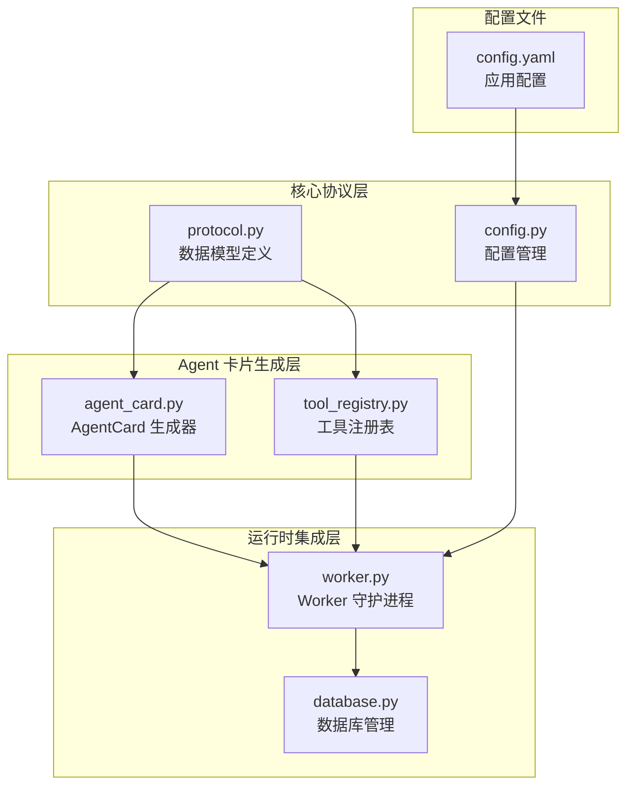
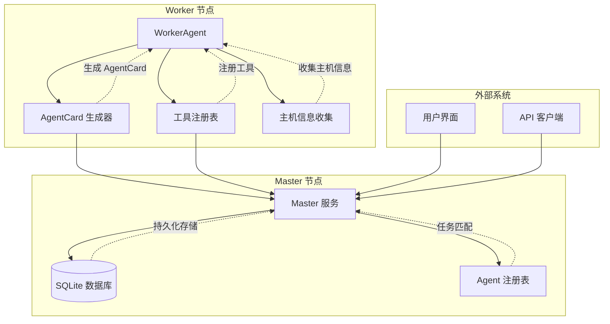
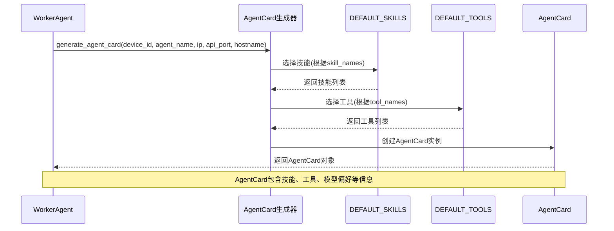
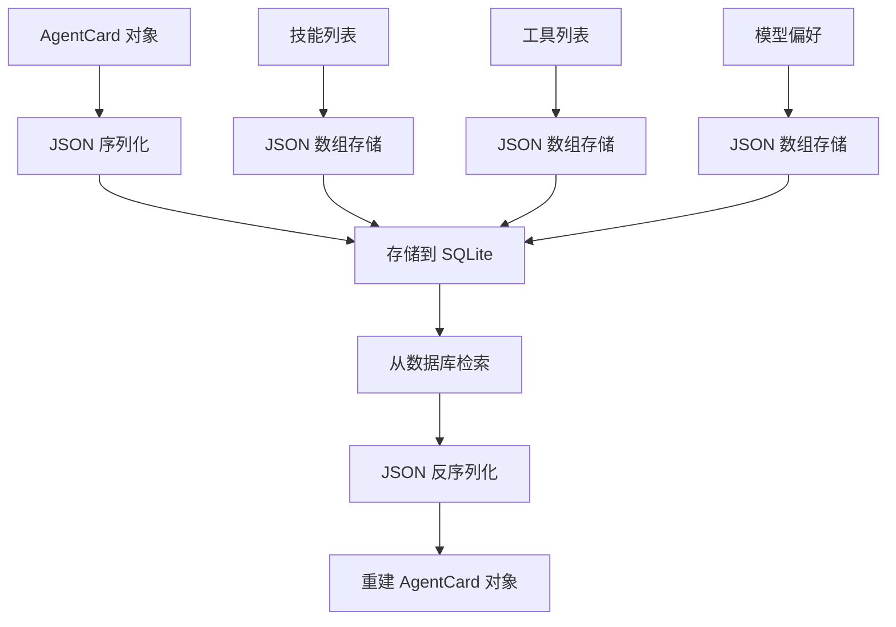
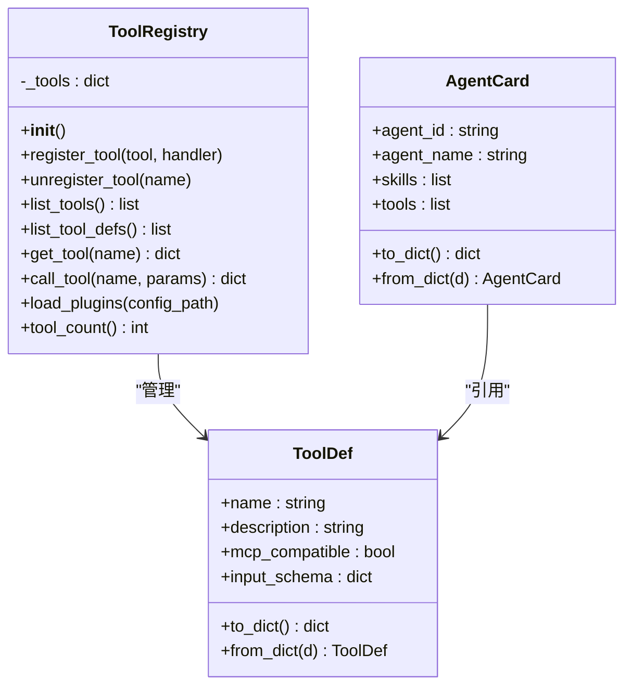
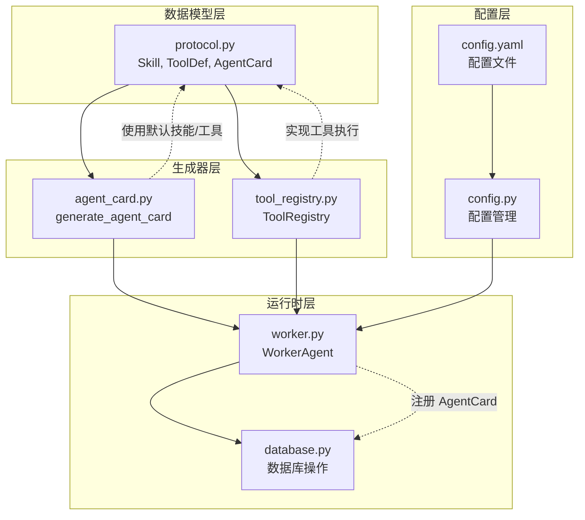

# AgentCard 数据模型

<cite>
**本文档引用的文件**
- [protocol.py](file://lan_mesh/protocol.py)
- [agent_card.py](file://lan_mesh/agent_card.py)
- [tool_registry.py](file://lan_mesh/tool_registry.py)
- [worker.py](file://lan_mesh/worker.py)
- [database.py](file://lan_mesh/database.py)
- [config.py](file://lan_mesh/config.py)
- [config.yaml](file://config.yaml)
</cite>

## 目录
1. [简介](#简介)
2. [项目结构](#项目结构)
3. [核心组件](#核心组件)
4. [架构概览](#架构概览)
5. [详细组件分析](#详细组件分析)
6. [依赖关系分析](#依赖关系分析)
7. [性能考虑](#性能考虑)
8. [故障排除指南](#故障排除指南)
9. [结论](#结论)
10. [附录](#附录)

## 简介

AgentCard 是 QuickLAN 项目中的核心数据模型，借鉴 A2A 协议的 Agent Card 机制。它是一个轻量级的 JSON Schema 定义，用于描述 Agent 的能力声明和运行状态。每个 Worker 节点启动时都会根据自身配置生成 Agent Card，并将其注册到 Master 节点进行任务匹配与分发。

AgentCard 的设计遵循最小必要性原则，只包含完成任务分配所需的关键信息，同时保持足够的灵活性以适应不同的应用场景。

## 项目结构

QuickLAN 项目采用模块化设计，AgentCard 相关的核心文件分布如下：



**图表来源**
- [protocol.py:161-235](file://lan_mesh/protocol.py#L161-L235)
- [agent_card.py:167-217](file://lan_mesh/agent_card.py#L167-L217)
- [worker.py:148-171](file://lan_mesh/worker.py#L148-L171)

**章节来源**
- [protocol.py:1-356](file://lan_mesh/protocol.py#L1-L356)
- [agent_card.py:1-228](file://lan_mesh/agent_card.py#L1-L228)
- [worker.py:1-200](file://lan_mesh/worker.py#L1-L200)

## 核心组件

### AgentCard 数据模型

AgentCard 是整个系统的核心数据结构，包含了 Agent 的完整能力声明和运行状态信息。以下是详细的字段定义：

#### 基础信息字段

| 字段名 | 类型 | 默认值 | 必填 | 描述 |
|--------|------|--------|------|------|
| agent_id | string | "" | 是 | Agent 唯一标识符，通常与 device_id 相同 |
| agent_name | string | "" | 是 | Agent 人类可读名称 |
| version | string | "0.1.0" | 否 | AgentCard 版本号 |
| device_id | string | "" | 是 | 设备唯一标识符 |

#### 主机信息字段

| 字段名 | 类型 | 默认值 | 必填 | 描述 |
|--------|------|--------|------|------|
| hostname | string | "" | 是 | 主机名 |
| ip | string | "" | 是 | 主机 IP 地址 |
| api_port | integer | 0 | 是 | HTTP API 端口号 |

#### 能力声明字段

| 字段名 | 类型 | 默认值 | 必填 | 描述 |
|--------|------|--------|------|------|
| skills | array | [] | 否 | 技能列表，每个元素为 Skill 对象 |
| tools | array | [] | 否 | 工具列表，每个元素为 ToolDef 对象 |
| model_preferences | array | [] | 否 | 模型偏好列表，默认 ["deepseek-v3", "gpt-4o-mini"] |

#### 运行时状态字段

| 字段名 | 类型 | 默认值 | 必填 | 描述 |
|--------|------|--------|------|------|
| max_concurrent_tasks | integer | 5 | 否 | 最大并发任务数 |
| status | string | "idle" | 否 | Agent 状态，枚举值：idle/busy/offline |
| current_task_count | integer | 0 | 否 | 当前正在执行的任务数量 |
| registered_at | number | 时间戳 | 否 | 注册时间戳 |
| last_seen | number | 时间戳 | 否 | 最后活跃时间戳 |

**章节来源**
- [protocol.py:202-235](file://lan_mesh/protocol.py#L202-L235)

### Skill 数据结构

Skill 定义了 Agent 所具备的能力类型，每个 Skill 包含以下属性：

#### Skill 字段定义

| 字段名 | 类型 | 默认值 | 必填 | 描述 |
|--------|------|--------|------|------|
| name | string | "" | 是 | 技能名称，唯一标识符 |
| description | string | "" | 是 | 技能功能描述 |
| input_schema | object | {} | 否 | JSON Schema，定义技能输入参数结构 |
| tags | array | [] | 否 | 技能标签数组，用于分类和搜索 |

#### 预置技能示例

系统提供了以下预置技能：

1. **code_generation** - 代码生成技能
   - 输入参数：language(目标编程语言), requirement(需求描述), context(上下文/已有代码)
   - 标签：["coding", "llm"]

2. **code_review** - 代码审查技能  
   - 输入参数：code(待审查代码), language(编程语言)
   - 标签：["coding", "analysis"]

3. **document_summary** - 文档摘要技能
   - 输入参数：text(待摘要文本), max_length(最大摘要长度)
   - 标签：["nlp", "analysis"]

4. **rag_search** - RAG 检索技能
   - 输入参数：query(检索查询), top_k(返回结果数)
   - 标签：["rag", "retrieval"]

5. **shell_exec** - Shell 命令执行技能
   - 输入参数：command(Shell 命令), timeout(超时秒数)
   - 标签：["system", "exec"]

6. **file_ops** - 文件操作技能
   - 输入参数：action(操作类型), path(文件路径), content(写入内容)
   - 标签：["system", "file"]

7. **monitoring** - 系统监控技能
   - 输入参数：metric(监控指标), threshold(告警阈值)
   - 标签：["system", "monitor"]

**章节来源**
- [protocol.py:161-176](file://lan_mesh/protocol.py#L161-L176)
- [agent_card.py:18-111](file://lan_mesh/agent_card.py#L18-L111)

### ToolDef 数据结构

ToolDef 定义了 Agent 可调用的外部工具，支持 MCP (Model Context Protocol) 兼容性：

#### ToolDef 字段定义

| 字段名 | 类型 | 默认值 | 必填 | 描述 |
|--------|------|--------|------|------|
| name | string | "" | 是 | 工具名称，唯一标识符 |
| description | string | "" | 是 | 工具功能描述 |
| mcp_compatible | boolean | true | 否 | 是否兼容 MCP 协议 |
| input_schema | object | {} | 否 | JSON Schema，定义工具输入参数结构 |

#### 预置工具示例

系统提供了以下预置工具：

1. **file_read** - 文件读取工具
   - 输入参数：path(文件路径), encoding(文件编码，默认 utf-8)
   - MCP 兼容：true

2. **file_write** - 文件写入工具
   - 输入参数：path(文件路径), content(写入内容), encoding(文件编码，默认 utf-8)
   - MCP 兼容：true

3. **shell_exec** - Shell 命令执行工具
   - 输入参数：command(Shell 命令), timeout(超时秒数, 默认 30), cwd(工作目录)
   - MCP 兼容：true

4. **http_request** - HTTP 请求工具
   - 输入参数：url(请求 URL), method(HTTP 方法, 默认 GET), headers(请求头), body(请求体), timeout(超时秒数, 默认 30)
   - MCP 兼容：true

5. **dir_list** - 目录列表工具
   - 输入参数：path(目录路径, 默认当前目录), pattern(glob 匹配模式, 默认 *)
   - MCP 兼容：true

6. **python_eval** - Python 代码执行工具
   - 输入参数：code(Python 代码)
   - MCP 兼容：true

**章节来源**
- [protocol.py:178-193](file://lan_mesh/protocol.py#L178-L193)
- [agent_card.py:115-162](file://lan_mesh/agent_card.py#L115-L162)
- [tool_registry.py:114-214](file://lan_mesh/tool_registry.py#L114-L214)

## 架构概览

AgentCard 在整个系统中的作用和交互关系如下：



**图表来源**
- [worker.py:62-171](file://lan_mesh/worker.py#L62-L171)
- [agent_card.py:167-217](file://lan_mesh/agent_card.py#L167-L217)
- [tool_registry.py:217-338](file://lan_mesh/tool_registry.py#L217-L338)
- [database.py:330-418](file://lan_mesh/database.py#L330-L418)

## 详细组件分析

### AgentCard 生成流程

AgentCard 的生成过程涉及多个步骤，从配置收集到最终的数据结构构建：



**图表来源**
- [agent_card.py:167-217](file://lan_mesh/agent_card.py#L167-L217)
- [agent_card.py:18-111](file://lan_mesh/agent_card.py#L18-L111)
- [agent_card.py:115-162](file://lan_mesh/agent_card.py#L115-L162)

#### 生成参数详解

| 参数名 | 类型 | 默认值 | 描述 |
|--------|------|--------|------|
| device_id | string | 必填 | 设备唯一标识符 |
| agent_name | string | 必填 | Agent 人类可读名称 |
| ip | string | 必填 | 主机 IP 地址 |
| api_port | integer | 必填 | HTTP API 端口号 |
| hostname | string | 必填 | 主机名 |
| skill_names | array | null | 启用的技能列表，null 表示全部启用 |
| tool_names | array | null | 启用的工具列表，null 表示全部启用 |
| model_preferences | array | null | 模型偏好列表，默认 ["deepseek-v3", "gpt-4o-mini"] |
| max_concurrent_tasks | integer | 5 | 最大并发任务数 |

**章节来源**
- [agent_card.py:167-217](file://lan_mesh/agent_card.py#L167-L217)

### 数据库集成

AgentCard 在数据库中的存储和检索机制：



**图表来源**
- [database.py:336-352](file://lan_mesh/database.py#L336-L352)
- [database.py:366-378](file://lan_mesh/database.py#L366-L378)

**章节来源**
- [database.py:330-418](file://lan_mesh/database.py#L330-L418)

### 工具注册表集成

工具注册表提供了动态工具管理和执行能力：



**图表来源**
- [tool_registry.py:217-338](file://lan_mesh/tool_registry.py#L217-L338)
- [protocol.py:178-193](file://lan_mesh/protocol.py#L178-L193)

**章节来源**
- [tool_registry.py:1-338](file://lan_mesh/tool_registry.py#L1-L338)

## 依赖关系分析

AgentCard 相关组件之间的依赖关系：



**图表来源**
- [protocol.py:161-235](file://lan_mesh/protocol.py#L161-L235)
- [agent_card.py:13-13](file://lan_mesh/agent_card.py#L13-L13)
- [tool_registry.py:24-24](file://lan_mesh/tool_registry.py#L24-L24)

**章节来源**
- [protocol.py:1-356](file://lan_mesh/protocol.py#L1-356)
- [agent_card.py:1-228](file://lan_mesh/agent_card.py#L1-L228)
- [tool_registry.py:1-338](file://lan_mesh/tool_registry.py#L1-L338)

## 性能考虑

### AgentCard 优化策略

1. **最小化数据传输**
   - 仅传输必要的字段信息
   - 使用紧凑的 JSON 格式
   - 避免重复信息的多次传输

2. **缓存机制**
   - Worker 端缓存生成的 AgentCard
   - Master 端缓存 Agent 注册表
   - 减少频繁的序列化/反序列化操作

3. **异步处理**
   - 异步注册和心跳机制
   - 非阻塞的工具执行
   - 流水线化的任务处理

4. **内存管理**
   - 及时释放不再使用的 AgentCard
   - 控制工具执行结果的大小
   - 优化 JSON 序列化性能

## 故障排除指南

### 常见问题及解决方案

#### AgentCard 生成失败

**症状**: Worker 启动时无法生成 AgentCard

**可能原因**:
1. 缺少必需的配置参数
2. 技能或工具名称不匹配
3. 网络连接问题

**解决方法**:
1. 检查配置文件是否正确加载
2. 验证技能和工具名称的有效性
3. 确认网络连通性和端口可用性

#### 数据库存储异常

**症状**: AgentCard 无法正确存储或检索

**可能原因**:
1. JSON 序列化/反序列化错误
2. 数据库连接问题
3. 字段类型不匹配

**解决方法**:
1. 检查 JSON Schema 的有效性
2. 验证数据库表结构
3. 确认字段类型转换正确

#### 工具执行失败

**症状**: AgentCard 中的工具无法正常执行

**可能原因**:
1. 工具定义不完整
2. 权限不足
3. 超时设置过短

**解决方法**:
1. 验证工具的 input_schema
2. 检查系统权限设置
3. 调整超时参数

**章节来源**
- [agent_card.py:167-217](file://lan_mesh/agent_card.py#L167-L217)
- [database.py:330-418](file://lan_mesh/database.py#L330-L418)
- [tool_registry.py:259-288](file://lan_mesh/tool_registry.py#L259-L288)

## 结论

AgentCard 数据模型通过简洁而强大的设计，成功地将复杂的 Agent 能力声明抽象为一个轻量级的 JSON 结构。它不仅满足了任务分配的基本需求，还为系统的扩展性和灵活性提供了坚实的基础。

该模型的主要优势包括：

1. **简洁性**: 仅包含必要的字段，避免了冗余信息
2. **可扩展性**: 支持动态添加新的技能和工具
3. **兼容性**: 遵循 MCP 协议标准，便于与其他系统集成
4. **可维护性**: 清晰的模块划分和职责分离

通过合理的配置管理和最佳实践，AgentCard 能够有效地支撑整个分布式系统的任务协调和资源管理。

## 附录

### JSON Schema 定义

AgentCard 的完整 JSON Schema 定义如下：

```json
{
  "$schema": "http://json-schema.org/draft-07/schema#",
  "title": "AgentCard",
  "type": "object",
  "required": ["agent_id", "agent_name", "hostname", "ip", "api_port"],
  "properties": {
    "agent_id": {
      "type": "string",
      "description": "Agent 唯一标识符"
    },
    "agent_name": {
      "type": "string",
      "description": "Agent 人类可读名称"
    },
    "version": {
      "type": "string",
      "description": "AgentCard 版本号",
      "default": "0.1.0"
    },
    "device_id": {
      "type": "string",
      "description": "设备唯一标识符"
    },
    "hostname": {
      "type": "string",
      "description": "主机名"
    },
    "ip": {
      "type": "string",
      "description": "主机 IP 地址"
    },
    "api_port": {
      "type": "integer",
      "description": "HTTP API 端口号",
      "minimum": 1,
      "maximum": 65535
    },
    "skills": {
      "type": "array",
      "items": {
        "type": "object",
        "required": ["name", "description"],
        "properties": {
          "name": {"type": "string"},
          "description": {"type": "string"},
          "input_schema": {"type": "object"},
          "tags": {"type": "array", "items": {"type": "string"}}
        }
      }
    },
    "tools": {
      "type": "array",
      "items": {
        "type": "object",
        "required": ["name", "description"],
        "properties": {
          "name": {"type": "string"},
          "description": {"type": "string"},
          "mcp_compatible": {"type": "boolean"},
          "input_schema": {"type": "object"}
        }
      }
    },
    "model_preferences": {
      "type": "array",
      "items": {"type": "string"}
    },
    "max_concurrent_tasks": {
      "type": "integer",
      "description": "最大并发任务数",
      "minimum": 1
    },
    "status": {
      "type": "string",
      "enum": ["idle", "busy", "offline"],
      "description": "Agent 状态",
      "default": "idle"
    },
    "current_task_count": {
      "type": "integer",
      "description": "当前任务数量",
      "minimum": 0
    },
    "registered_at": {
      "type": "number",
      "description": "注册时间戳"
    },
    "last_seen": {
      "type": "number",
      "description": "最后活跃时间戳"
    }
  }
}
```

### 实际使用示例

#### 基础 AgentCard 示例

```json
{
  "agent_id": "worker-001",
  "agent_name": "开发环境 Worker",
  "version": "0.1.0",
  "device_id": "worker-001",
  "hostname": "dev-worker-01",
  "ip": "192.168.1.101",
  "api_port": 45460,
  "skills": [
    {
      "name": "code_generation",
      "description": "根据需求描述生成代码",
      "input_schema": {
        "type": "object",
        "properties": {
          "language": {"type": "string"},
          "requirement": {"type": "string"},
          "context": {"type": "string"}
        },
        "required": ["requirement"]
      },
      "tags": ["coding", "llm"]
    }
  ],
  "tools": [
    {
      "name": "file_read",
      "description": "读取文件内容",
      "mcp_compatible": true,
      "input_schema": {
        "type": "object",
        "properties": {
          "path": {"type": "string"},
          "encoding": {"type": "string"}
        },
        "required": ["path"]
      }
    }
  ],
  "model_preferences": ["deepseek-v3", "gpt-4o-mini"],
  "max_concurrent_tasks": 5,
  "status": "idle",
  "current_task_count": 0,
  "registered_at": 1700000000.0,
  "last_seen": 1700000000.0
}
```

#### 高级配置示例

```json
{
  "agent_id": "worker-002",
  "agent_name": "生产环境 Worker",
  "version": "0.1.0",
  "device_id": "worker-002",
  "hostname": "prod-worker-01",
  "ip": "10.0.0.101",
  "api_port": 45460,
  "skills": [
    {
      "name": "code_review",
      "description": "审查代码质量",
      "input_schema": {
        "type": "object",
        "properties": {
          "code": {"type": "string"},
          "language": {"type": "string"}
        },
        "required": ["code"]
      },
      "tags": ["coding", "analysis"]
    },
    {
      "name": "monitoring",
      "description": "系统资源监控",
      "input_schema": {
        "type": "object",
        "properties": {
          "metric": {"type": "string"},
          "threshold": {"type": "number"}
        }
      },
      "tags": ["system", "monitor"]
    }
  ],
  "tools": [
    {
      "name": "shell_exec",
      "description": "执行 Shell 命令",
      "mcp_compatible": true,
      "input_schema": {
        "type": "object",
        "properties": {
          "command": {"type": "string"},
          "timeout": {"type": "integer"},
          "cwd": {"type": "string"}
        },
        "required": ["command"]
      }
    },
    {
      "name": "http_request",
      "description": "发起 HTTP 请求",
      "mcp_compatible": true,
      "input_schema": {
        "type": "object",
        "properties": {
          "url": {"type": "string"},
          "method": {"type": "string"},
          "headers": {"type": "object"},
          "body": {"type": "string"},
          "timeout": {"type": "integer"}
        },
        "required": ["url"]
      }
    }
  ],
  "model_preferences": ["claude-3-opus", "gpt-4-turbo"],
  "max_concurrent_tasks": 10,
  "status": "busy",
  "current_task_count": 3,
  "registered_at": 1700000000.0,
  "last_seen": 1700000100.0
}
```

### 配置文件示例

#### 基础配置

```yaml
# LAN Mesh 配置文件
discovery:
  port: 45454
  presence_interval: 3
  device_ttl: 12

worker:
  api_port: 45460
  shared_folder: ~/lan_mesh_shared
  device_name: ""

master:
  api_port: 45470
  shared_folder: ~/lan_mesh_shared
  device_name: ""
  db_path: ~/.lan_mesh/master.sqlite3
```

**章节来源**
- [config.yaml:1-22](file://config.yaml#L1-L22)
- [protocol.py:161-235](file://lan_mesh/protocol.py#L161-L235)
- [agent_card.py:167-217](file://lan_mesh/agent_card.py#L167-L217)