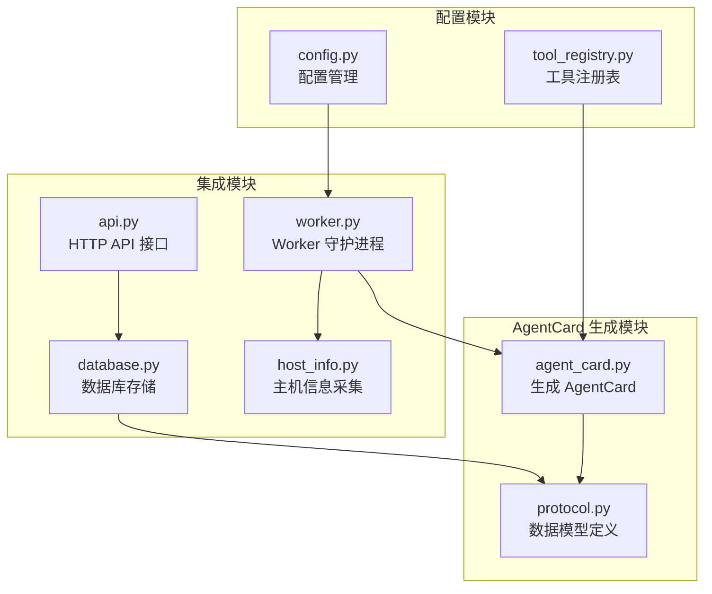
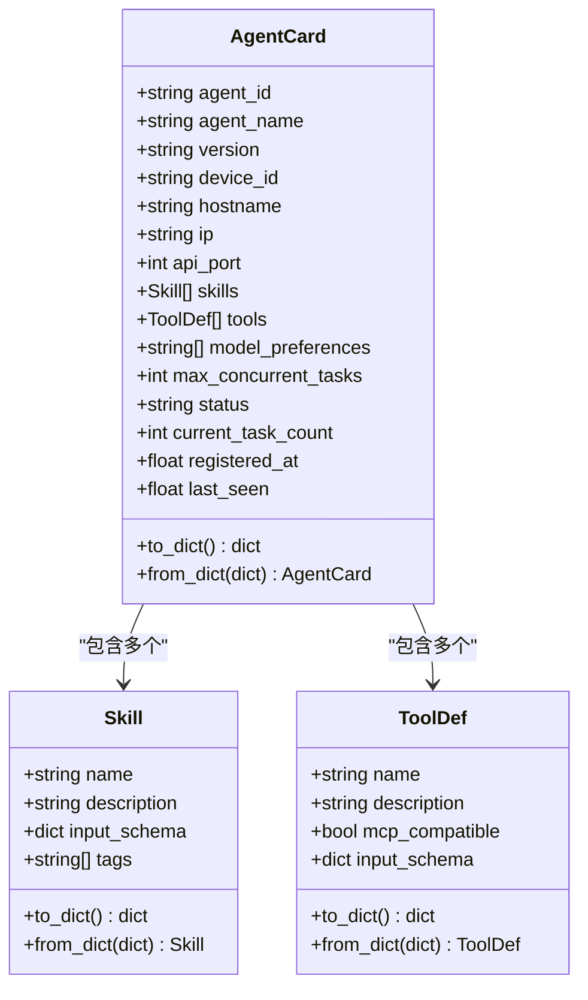
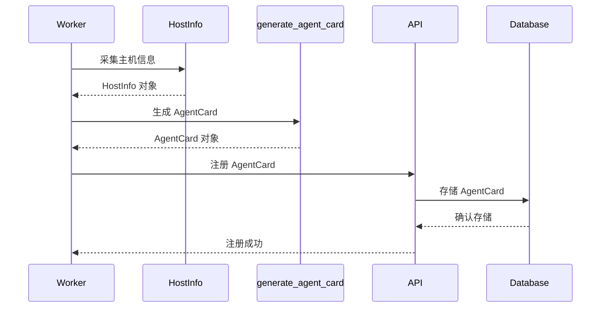
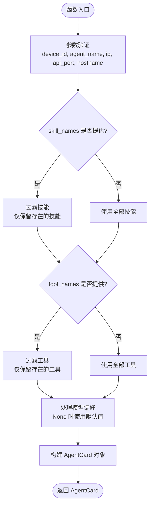
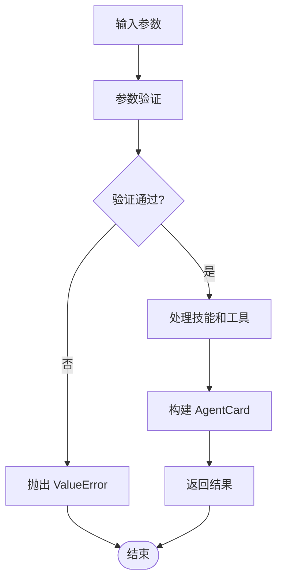
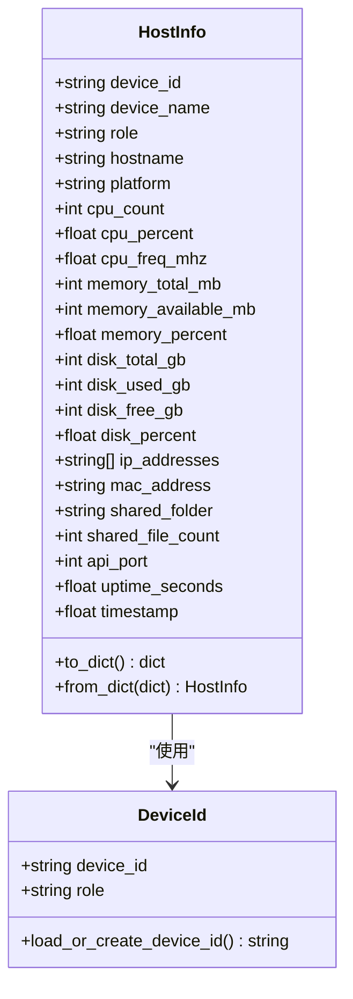
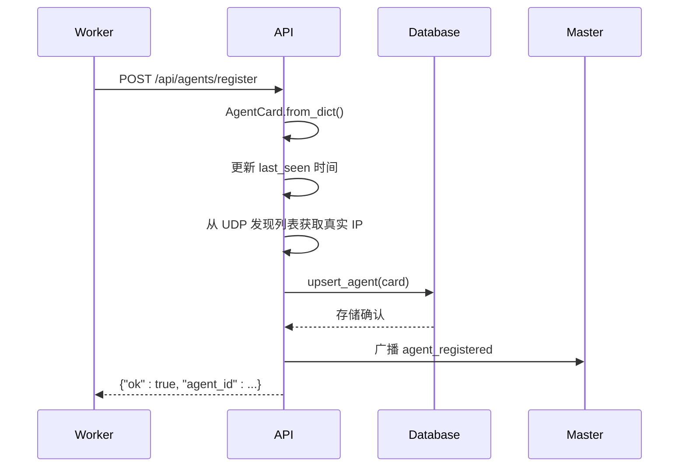
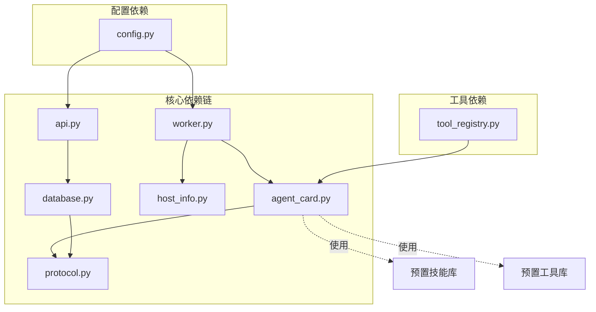

# AgentCard 生成机制

<cite>
**本文引用的文件**
- [agent_card.py](file://lan_mesh/agent_card.py)
- [protocol.py](file://lan_mesh/protocol.py)
- [worker.py](file://lan_mesh/worker.py)
- [api.py](file://lan_mesh/api.py)
- [database.py](file://lan_mesh/database.py)
- [host_info.py](file://lan_mesh/host_info.py)
- [config.py](file://lan_mesh/config.py)
- [tool_registry.py](file://lan_mesh/tool_registry.py)
</cite>

## 目录
1. [简介](#简介)
2. [项目结构](#项目结构)
3. [核心组件](#核心组件)
4. [架构概览](#架构概览)
5. [详细组件分析](#详细组件分析)
6. [依赖分析](#依赖分析)
7. [性能考虑](#性能考虑)
8. [故障排除指南](#故障排除指南)
9. [结论](#结论)

## 简介

AgentCard 生成机制是 LAN Mesh 分布式系统中的核心组件，负责为每个 Worker 节点生成能力声明卡片。该机制借鉴 A2A 协议的 Agent Card 概念，为 Master 节点提供任务匹配与分发所需的完整能力信息。

AgentCard 包含以下关键信息：
- **宿主信息**：设备 ID、主机名、IP 地址、API 端口
- **能力声明**：技能集合、工具集合、模型偏好
- **运行时状态**：当前状态、并发任务数、注册时间

## 项目结构



**图表来源**
- [agent_card.py:1-228](file://lan_mesh/agent_card.py#L1-L228)
- [protocol.py:150-235](file://lan_mesh/protocol.py#L150-L235)
- [worker.py:43-171](file://lan_mesh/worker.py#L43-L171)

## 核心组件

### AgentCard 数据模型

AgentCard 是整个机制的核心数据结构，定义了 Agent 的完整能力声明：



**图表来源**
- [protocol.py:161-235](file://lan_mesh/protocol.py#L161-L235)

### 预置技能库

系统提供了丰富的预置技能，涵盖代码生成、文档处理、系统管理等多个领域：

| 技能名称 | 功能描述 | 输入参数 | 标签 |
|---------|----------|----------|------|
| code_generation | 代码生成 | language, requirement, context | coding, llm |
| code_review | 代码审查 | code, language | coding, analysis |
| document_summary | 文档摘要 | text, max_length | nlp, analysis |
| rag_search | RAG 检索 | query, top_k | rag, retrieval |
| shell_exec | Shell 命令执行 | command, timeout | system, exec |
| file_ops | 文件操作 | action, path, content | system, file |
| monitoring | 系统监控 | metric, threshold | system, monitor |

### 预置工具库

工具库提供与 MCP（Model Context Protocol）兼容的外部工具：

| 工具名称 | 功能描述 | 输入参数 | MCP 兼容性 |
|---------|----------|----------|------------|
| file_read | 文件读取 | path, encoding | ✓ |
| file_write | 文件写入 | path, content, encoding | ✓ |
| shell_exec | Shell 命令执行 | command, timeout, cwd | ✓ |
| http_request | HTTP 请求 | url, method, headers, body | ✓ |

**章节来源**
- [agent_card.py:16-111](file://lan_mesh/agent_card.py#L16-L111)
- [agent_card.py:114-162](file://lan_mesh/agent_card.py#L114-L162)

## 架构概览

AgentCard 生成机制在整个系统中的位置如下：



**图表来源**
- [worker.py:148-171](file://lan_mesh/worker.py#L148-L171)
- [api.py:268-279](file://lan_mesh/api.py#L268-L279)
- [database.py:293-325](file://lan_mesh/database.py#L293-L325)

## 详细组件分析

### generate_agent_card 函数详解

#### 函数签名与参数



**图表来源**
- [agent_card.py:167-217](file://lan_mesh/agent_card.py#L167-L217)

#### 参数处理逻辑

1. **设备配置参数**
   - `device_id`: 设备唯一标识符，复用为 agent_id
   - `agent_name`: Agent 显示名称
   - `hostname`: 主机名或设备名
   - `ip`: 主机 IP 地址
   - `api_port`: HTTP API 端口

2. **能力选择逻辑**
   - 技能选择：支持部分启用或全量启用
   - 工具选择：支持部分启用或全量启用
   - 输入验证：仅接受存在于预置库中的名称

3. **默认值处理**
   - `model_preferences`: 默认 ["deepseek-v3", "gpt-4o-mini"]
   - `max_concurrent_tasks`: 默认 5
   - `status`: 默认 "idle"
   - `current_task_count`: 默认 0

#### 错误处理机制



**图表来源**
- [agent_card.py:178-217](file://lan_mesh/agent_card.py#L178-L217)

**章节来源**
- [agent_card.py:167-217](file://lan_mesh/agent_card.py#L167-L217)

### 设备配置动态生成

#### 主机信息采集

Worker 启动时通过 `host_info.collect_host_info` 采集完整的主机配置信息：



**图表来源**
- [protocol.py:69-111](file://lan_mesh/protocol.py#L69-L111)
- [host_info.py:21-37](file://lan_mesh/host_info.py#L21-L37)

#### IP 地址获取策略

系统采用多层 IP 地址获取策略：

1. **首选 IP**：从主机信息采集结果中获取
2. **备用 IP**：从 UDP 发现包中获取（通过 API 层）
3. **回退 IP**：使用空字符串

#### 主机名处理

- 优先使用配置文件中的 `device_name`
- 其次使用 `socket.gethostname()`
- 最后生成基于设备 ID 的简短名称

**章节来源**
- [host_info.py:129-191](file://lan_mesh/host_info.py#L129-L191)
- [worker.py:153-160](file://lan_mesh/worker.py#L153-L160)

### AgentCard 注册与存储

#### 注册流程



**图表来源**
- [api.py:268-279](file://lan_mesh/api.py#L268-L279)
- [database.py:293-325](file://lan_mesh/database.py#L293-L325)

#### 数据库存储结构

AgentCard 在 SQLite 数据库中的存储结构：

| 字段名 | 类型 | 描述 |
|--------|------|------|
| agent_id | TEXT | 主键，Agent 唯一标识 |
| agent_name | TEXT | Agent 显示名称 |
| version | TEXT | AgentCard 版本 |
| device_id | TEXT | 设备 ID |
| hostname | TEXT | 主机名 |
| ip | TEXT | IP 地址 |
| api_port | INTEGER | API 端口 |
| skills | TEXT | JSON 序列化的技能列表 |
| tools | TEXT | JSON 序列化的工具列表 |
| model_preferences | TEXT | JSON 序列化的模型偏好 |
| max_concurrent | INTEGER | 最大并发任务数 |
| status | TEXT | Agent 状态 |
| current_task_count | INTEGER | 当前任务数 |
| registered_at | REAL | 注册时间戳 |
| last_seen | REAL | 最后活跃时间戳 |

**章节来源**
- [database.py:293-325](file://lan_mesh/database.py#L293-L325)

## 依赖分析

### 组件间依赖关系



**图表来源**
- [agent_card.py:13](file://lan_mesh/agent_card.py#L13)
- [worker.py:43](file://lan_mesh/worker.py#L43)
- [api.py:32](file://lan_mesh/api.py#L32)

### 外部依赖

AgentCard 生成机制依赖以下外部库：

| 依赖库 | 版本要求 | 用途 |
|--------|----------|------|
| psutil | >= 5.0.0 | 系统信息采集 |
| pydantic | >= 1.0.0 | 配置验证 |
| fastapi | >= 0.68.0 | Web API 框架 |
| requests | >= 2.25.0 | HTTP 客户端 |
| sqlite3 | 内置 | 数据持久化 |

**章节来源**
- [agent_card.py:9](file://lan_mesh/agent_card.py#L9)
- [host_info.py:14](file://lan_mesh/host_info.py#L14)
- [config.py:11](file://lan_mesh/config.py#L11)

## 性能考虑

### 内存使用优化

1. **延迟加载**：技能和工具采用延迟加载策略，仅在需要时才进行序列化
2. **对象池**：重复使用相同的技能和工具实例，减少内存分配
3. **增量更新**：支持部分更新 AgentCard，避免全量重建

### 计算复杂度分析

- **技能选择**：O(n)，其中 n 为提供的技能名称数量
- **工具选择**：O(m)，其中 m 为提供的工具名称数量
- **AgentCard 构建**：O(n+m)，线性时间复杂度

### 并发处理

- **线程安全**：AgentCard 对象设计为不可变数据结构
- **原子操作**：数据库操作使用事务保证一致性
- **锁机制**：在高并发场景下使用适当的锁策略

## 故障排除指南

### 常见问题及解决方案

#### 1. 技能或工具名称无效

**问题症状**：
- 生成的 AgentCard 中缺少预期的技能或工具
- 日志显示警告信息

**解决方法**：
```python
# 检查可用的技能名称
available_skills = get_default_skill_names()
print("可用技能:", available_skills)

# 检查可用的工具名称  
available_tools = get_default_tool_names()
print("可用工具:", available_tools)
```

#### 2. IP 地址获取失败

**问题症状**：
- AgentCard 中 IP 地址为空
- Worker 无法被 Master 正确识别

**解决方法**：
```python
# 手动设置 IP 地址
ips = get_local_ipv4_addresses()
if ips:
    ip = ips[0]  # 使用第一个可用的 IP
else:
    ip = "127.0.0.1"  # 回退到本地回环地址
```

#### 3. 数据库连接问题

**问题症状**：
- AgentCard 注册失败
- 数据库操作抛出异常

**解决方法**：
```python
# 检查数据库连接
try:
    db.test_connection()
    print("数据库连接正常")
except Exception as e:
    print(f"数据库连接失败: {e}")
    # 重启数据库服务或检查权限
```

#### 4. 配置文件加载失败

**问题症状**：
- 配置加载返回默认值
- 系统行为不符合预期

**解决方法**：
```python
# 检查配置文件路径
config_paths = [
    "config.yaml",
    "~/.lan_mesh/config.yaml",
    os.environ.get("LAN_MESH_CONFIG", "")
]

for path in config_paths:
    if os.path.exists(path):
        print(f"配置文件存在: {path}")
    else:
        print(f"配置文件不存在: {path}")
```

**章节来源**
- [agent_card.py:220-227](file://lan_mesh/agent_card.py#L220-L227)
- [host_info.py:42-57](file://lan_mesh/host_info.py#L42-L57)
- [database.py:293-325](file://lan_mesh/database.py#L293-L325)

## 结论

AgentCard 生成机制通过精心设计的数据模型和灵活的配置选项，为 LAN Mesh 分布式系统提供了强大的能力声明和任务匹配基础。该机制的主要优势包括：

1. **模块化设计**：清晰分离了技能、工具、配置等各个组件
2. **灵活性**：支持部分启用和完全自定义的能力组合
3. **可扩展性**：易于添加新的技能和工具
4. **可靠性**：完善的错误处理和数据验证机制
5. **性能优化**：高效的算法和内存使用策略

通过合理利用 AgentCard 生成机制，用户可以根据不同的应用场景定制 Worker 的能力配置，实现最优的任务分配和资源利用效率。