# 预置技能与工具库

<cite>
**本文档引用的文件**
- [agent_card.py](file://lan_mesh/agent_card.py)
- [tool_registry.py](file://lan_mesh/tool_registry.py)
- [agent_runtime.py](file://lan_mesh/agent_runtime.py)
- [protocol.py](file://lan_mesh/protocol.py)
</cite>

## 目录
1. [简介](#简介)
2. [项目结构](#项目结构)
3. [核心组件](#核心组件)
4. [架构概览](#架构概览)
5. [详细组件分析](#详细组件分析)
6. [依赖关系分析](#依赖关系分析)
7. [性能考虑](#性能考虑)
8. [故障排除指南](#故障排除指南)
9. [结论](#结论)

## 简介

本文档详细介绍了 lan-mesh 项目中的预置技能与工具库系统。该系统提供了7种内置技能和4种内置工具，支持智能代理的自动化任务执行。所有技能和工具都遵循 MCP（Model Context Protocol）兼容标准，确保与其他 AI 系统的互操作性。

系统采用模块化设计，通过 Agent Card 机制暴露能力声明，通过 Tool Registry 管理工具注册和执行，通过 Agent Runtime 处理具体的任务执行逻辑。

## 项目结构

预置技能与工具库主要分布在以下文件中：

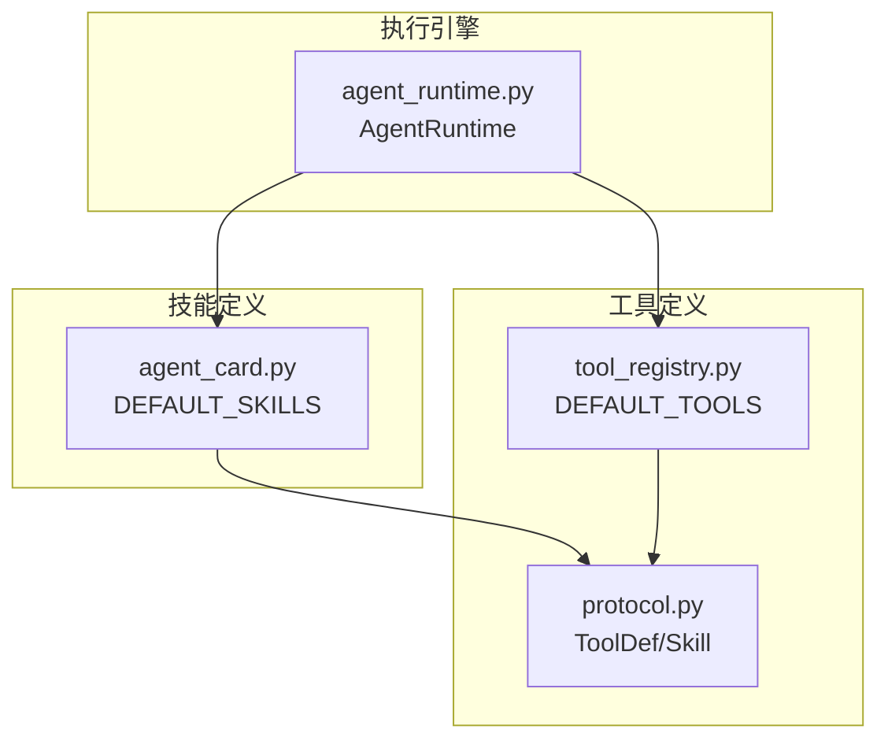

**图表来源**
- [agent_card.py:18-111](file://lan_mesh/agent_card.py#L18-L111)
- [tool_registry.py:114-162](file://lan_mesh/tool_registry.py#L114-L162)
- [protocol.py:161-192](file://lan_mesh/protocol.py#L161-L192)

**章节来源**
- [agent_card.py:1-228](file://lan_mesh/agent_card.py#L1-L228)
- [tool_registry.py:1-338](file://lan_mesh/tool_registry.py#L1-L338)
- [protocol.py:161-235](file://lan_mesh/protocol.py#L161-L235)

## 核心组件

### 技能系统 (DEFAULT_SKILLS)

系统定义了7种内置技能，每种技能都有明确的功能定位、输入参数模式和标签分类：

| 技能名称 | 功能描述 | 标签分类 | 输入参数 |
|---------|----------|----------|----------|
| code_generation | 根据需求描述生成代码 (Python/JavaScript/Go 等) | coding, llm | language, requirement, context |
| code_review | 审查代码质量,发现 Bug 和改进建议 | coding, analysis | code, language |
| document_summary | 长文档摘要、关键信息提取 | nlp, analysis | text, max_length |
| rag_search | 基于知识库的 RAG 检索与问答 | rag, retrieval | query, top_k |
| shell_exec | 执行 Shell 命令并返回输出 | system, exec | command, timeout |
| file_ops | 文件读写操作 | system, file | action, path, content |
| monitoring | 系统资源监控与告警 (CPU/内存/磁盘/网络) | system, monitor | metric, threshold |

### 工具系统 (DEFAULT_TOOLS)

系统提供了4种内置工具，均具备 MCP 兼容性：

| 工具名称 | 功能描述 | MCP 兼容性 | 输入参数 |
|---------|----------|------------|----------|
| file_read | 读取指定路径的文件内容 | 是 | path, encoding |
| file_write | 将内容写入指定文件 | 是 | path, content, encoding |
| shell_exec | 执行 Shell 命令并返回输出 | 是 | command, timeout, cwd |
| http_request | 发起 HTTP 请求并返回响应 | 是 | url, method, headers, body, timeout |

**章节来源**
- [agent_card.py:18-111](file://lan_mesh/agent_card.py#L18-L111)
- [agent_card.py:116-162](file://lan_mesh/agent_card.py#L116-L162)
- [tool_registry.py:114-214](file://lan_mesh/tool_registry.py#L114-L214)

## 架构概览

系统采用分层架构设计，确保技能和工具的可扩展性和互操作性：

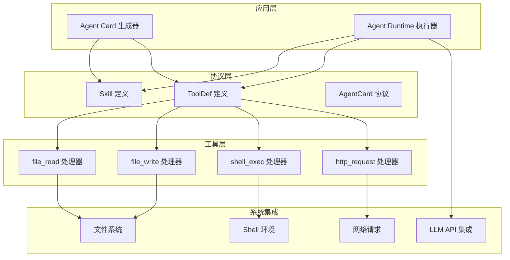

**图表来源**
- [agent_card.py:167-217](file://lan_mesh/agent_card.py#L167-L217)
- [agent_runtime.py:28-45](file://lan_mesh/agent_runtime.py#L28-L45)
- [tool_registry.py:217-289](file://lan_mesh/tool_registry.py#L217-L289)

## 详细组件分析

### 技能组件分析

#### code_generation 技能

**功能描述**: 根据需求描述生成代码，支持多种编程语言。

**输入参数模式**:
- `language`: 目标编程语言 (可选)
- `requirement`: 需求描述 (必需)
- `context`: 上下文/已有代码 (可选)

**标签分类**: coding, llm

**执行流程**:
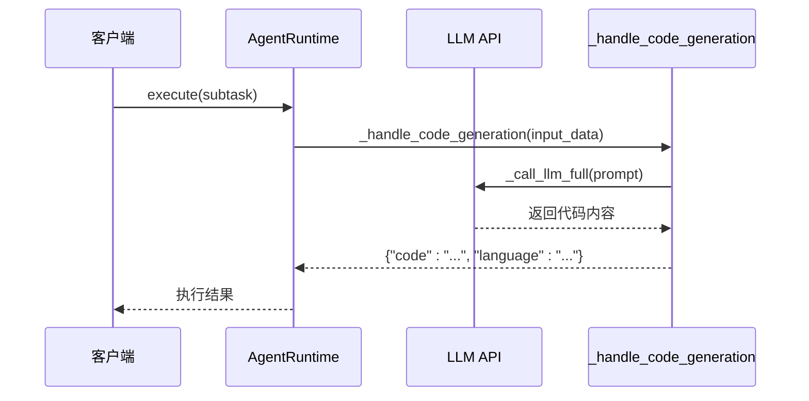

**图表来源**
- [agent_runtime.py:78-89](file://lan_mesh/agent_runtime.py#L78-L89)
- [agent_runtime.py:172-193](file://lan_mesh/agent_runtime.py#L172-L193)

**最佳实践**:
- 提供清晰的需求描述
- 如有上下文代码，建议包含相关背景
- 注意语言选择对生成质量的影响

#### code_review 技能

**功能描述**: 审查代码质量，发现 Bug 和改进建议。

**输入参数模式**:
- `code`: 待审查的代码 (必需)
- `language`: 编程语言 (可选)

**标签分类**: coding, analysis

**执行流程**:
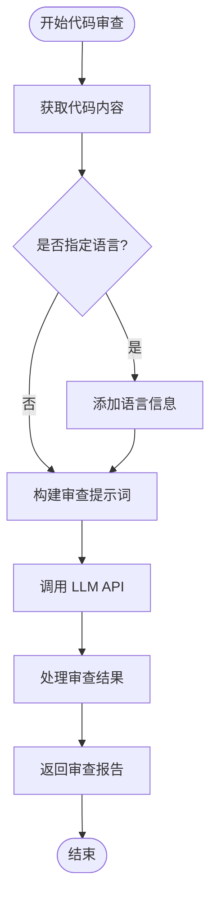

**图表来源**
- [agent_runtime.py:91-101](file://lan_mesh/agent_runtime.py#L91-L101)

**最佳实践**:
- 提供完整的代码上下文
- 明确指定编程语言有助于更准确的审查
- 结合具体业务场景进行代码审查

#### document_summary 技能

**功能描述**: 对长文档进行摘要和关键信息提取。

**输入参数模式**:
- `text`: 待摘要的文本 (必需)
- `max_length`: 最大摘要长度 (可选，默认500)

**标签分类**: nlp, analysis

**执行流程**:
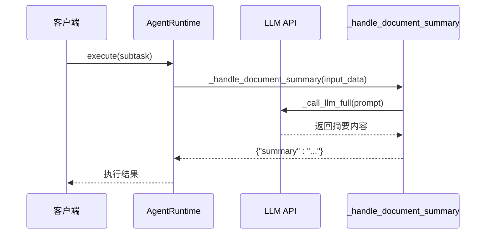

**图表来源**
- [agent_runtime.py:103-110](file://lan_mesh/agent_runtime.py#L103-L110)

**最佳实践**:
- 提供完整的文档内容
- 根据用途调整最大摘要长度
- 对于技术文档，建议保留关键术语

#### rag_search 技能

**功能描述**: 基于知识库的 RAG 检索与问答。

**输入参数模式**:
- `query`: 检索查询 (必需)
- `top_k`: 返回结果数 (可选)

**标签分类**: rag, retrieval

**当前实现状态**: 预留接口，当前返回提示信息

**最佳实践**:
- 查询语句应尽量具体明确
- 可结合领域知识优化查询关键词
- 注意当前实现的局限性

#### shell_exec 技能

**功能描述**: 执行 Shell 命令并返回输出。

**输入参数模式**:
- `command`: Shell 命令 (必需)
- `timeout`: 超时秒数 (可选，默认30)

**标签分类**: system, exec

**执行流程**:
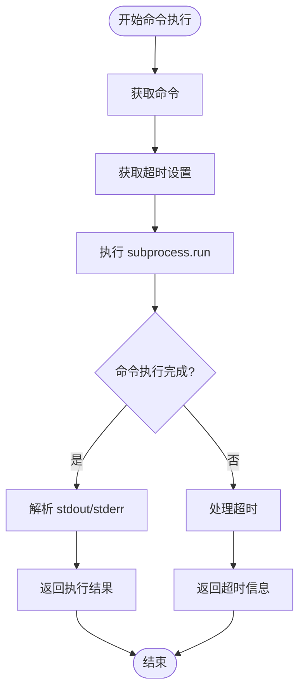

**图表来源**
- [agent_runtime.py:120-136](file://lan_mesh/agent_runtime.py#L120-L136)

**最佳实践**:
- 使用绝对路径避免路径问题
- 合理设置超时时间防止阻塞
- 注意命令注入安全风险

#### file_ops 技能

**功能描述**: 文件读写操作。

**输入参数模式**:
- `action`: 操作类型 (必需) - read, write, list, delete
- `path`: 文件路径 (必需)
- `content`: 写入内容 (write 时必需)

**标签分类**: system, file

**执行流程**:
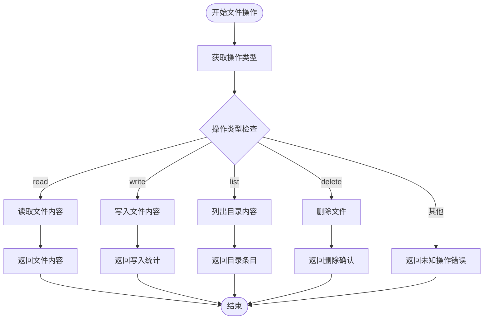

**图表来源**
- [agent_runtime.py:137-158](file://lan_mesh/agent_runtime.py#L137-L158)

**最佳实践**:
- 确保文件路径存在且有相应权限
- 写入操作会覆盖现有文件内容
- 列操作适用于目录浏览和文件发现

#### monitoring 技能

**功能描述**: 系统资源监控与告警。

**输入参数模式**:
- `metric`: 监控指标 (可选)
- `threshold`: 告警阈值 (可选)

**标签分类**: system, monitor

**执行流程**:
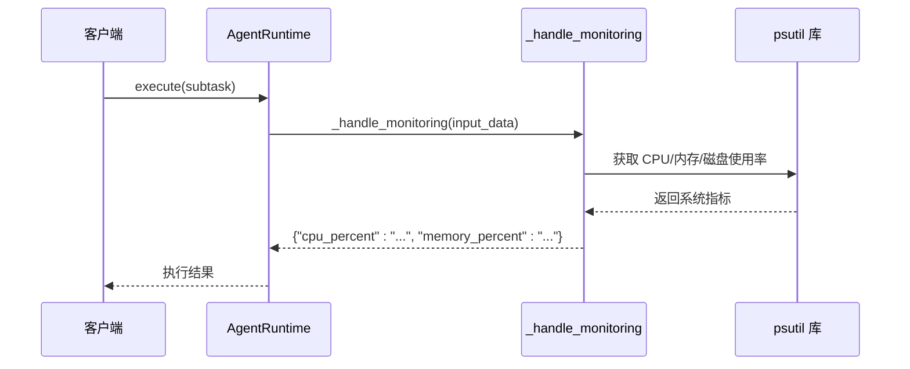

**图表来源**
- [agent_runtime.py:160-168](file://lan_mesh/agent_runtime.py#L160-L168)

**最佳实践**:
- 定期监控关键系统指标
- 结合业务负载调整监控频率
- 建立合理的告警阈值体系

### 工具组件分析

#### ToolDef 类结构

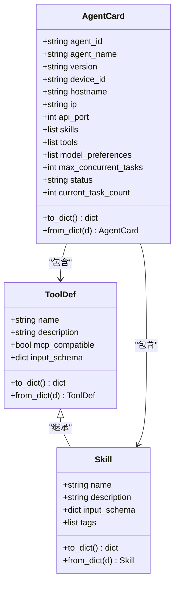

**图表来源**
- [protocol.py:161-192](file://lan_mesh/protocol.py#L161-L192)
- [protocol.py:202-235](file://lan_mesh/protocol.py#L202-L235)

#### ToolRegistry 工具注册系统

**功能特性**:
- 支持三种注册方式：内置工具、配置文件加载、运行时动态注册
- MCP 兼容的工具执行调度
- 输入参数的 JSON Schema 验证
- 错误处理和异常捕获

**工具执行流程**:
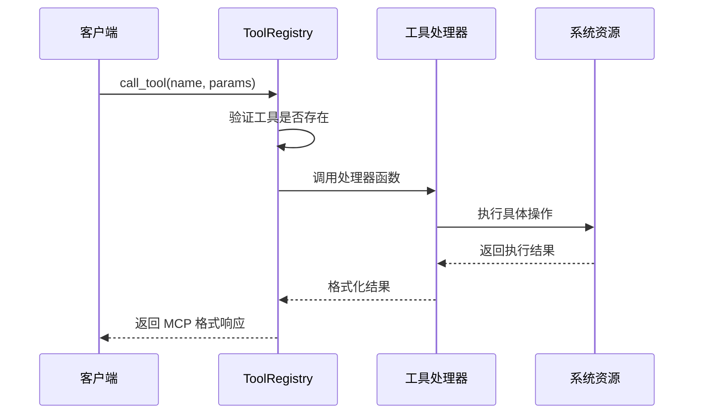

**图表来源**
- [tool_registry.py:259-288](file://lan_mesh/tool_registry.py#L259-L288)

**最佳实践**:
- 使用 JSON Schema 定义严格的输入参数
- 实现健壮的错误处理机制
- 提供详细的工具描述和使用说明

**章节来源**
- [protocol.py:161-235](file://lan_mesh/protocol.py#L161-L235)
- [tool_registry.py:217-289](file://lan_mesh/tool_registry.py#L217-L289)

## 依赖关系分析

系统采用松耦合的设计，各组件之间的依赖关系清晰明确：

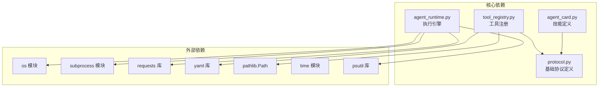

**图表来源**
- [agent_card.py:13](file://lan_mesh/agent_card.py#L13)
- [tool_registry.py:16-24](file://lan_mesh/tool_registry.py#L16-L24)
- [agent_runtime.py:20-25](file://lan_mesh/agent_runtime.py#L20-L25)

**依赖特点**:
- **低耦合**: 各模块职责单一，接口清晰
- **高内聚**: 相关功能集中在同一模块
- **MCP 兼容**: 所有工具都遵循 MCP 标准
- **可扩展性**: 支持动态注册新工具和技能

**章节来源**
- [agent_card.py:13](file://lan_mesh/agent_card.py#L13)
- [tool_registry.py:16-24](file://lan_mesh/tool_registry.py#L16-L24)
- [agent_runtime.py:20-25](file://lan_mesh/agent_runtime.py#L20-L25)

## 性能考虑

### 技能执行性能

1. **LLM API 调用优化**:
   - 优先使用 DeepSeek API (成本较低)
   - 回退到 OpenAI API (质量较高)
   - 支持 token 用量统计和成本控制

2. **Shell 命令执行**:
   - 默认超时时间为30秒
   - 异步执行避免阻塞
   - 输出结果大小限制 (HTTP 请求工具)

3. **文件操作性能**:
   - 使用 pathlib.Path 提供更好的路径处理
   - 目录列表操作支持 glob 模式匹配
   - 文件写入前自动创建父目录

### 工具执行性能

1. **工具注册表优化**:
   - 内置工具直接复制，减少初始化开销
   - 支持插件化工具动态加载
   - MCP 格式响应优化传输效率

2. **错误处理性能**:
   - 异常捕获和错误恢复
   - 超时处理避免资源浪费
   - 日志记录最小化性能影响

## 故障排除指南

### 常见问题及解决方案

#### LLM API 配置问题
**症状**: 返回 "未配置 LLM API Key" 提示
**原因**: 环境变量未正确设置
**解决方案**:
- 设置 `DEEPSEEK_API_KEY` 或 `OPENAI_API_KEY`
- 验证 API 密钥的有效性
- 检查网络连接和防火墙设置

#### Shell 命令执行失败
**症状**: 命令超时或执行失败
**原因**: 命令不存在、权限不足、超时设置过短
**解决方案**:
- 使用绝对路径执行命令
- 检查用户权限和文件系统权限
- 适当增加超时时间
- 在测试环境中验证命令语法

#### 文件操作异常
**症状**: 文件读写失败或权限错误
**原因**: 文件路径不存在、权限不足、磁盘空间不足
**解决方案**:
- 确认文件路径存在且可访问
- 检查文件系统权限设置
- 验证磁盘空间充足
- 使用相对路径时注意工作目录

#### 工具注册失败
**症状**: 工具无法找到或加载失败
**原因**: 插件模块导入错误、函数不存在、配置格式不正确
**解决方案**:
- 检查模块路径和函数名称
- 验证 YAML 配置格式
- 查看插件加载日志
- 确保依赖包正确安装

**章节来源**
- [agent_runtime.py:188-193](file://lan_mesh/agent_runtime.py#L188-L193)
- [agent_runtime.py:134-135](file://lan_mesh/agent_runtime.py#L134-L135)
- [tool_registry.py:332-333](file://lan_mesh/tool_registry.py#L332-L333)

## 结论

预置技能与工具库系统为 lan-mesh 项目提供了强大的自动化能力。系统具有以下优势：

1. **标准化设计**: 遵循 MCP 标准，确保与其他 AI 系统的互操作性
2. **模块化架构**: 清晰的职责分离和接口设计
3. **丰富的功能**: 覆盖代码生成、分析、系统管理等多个领域
4. **可扩展性**: 支持动态注册和插件化扩展
5. **安全性**: 内置输入验证和错误处理机制

通过合理使用这些技能和工具，可以构建高效的智能代理系统，实现从代码生成到系统管理的全方位自动化任务处理。建议在实际部署中根据具体需求选择合适的技能组合，并建立完善的监控和故障排除机制。