# Worker 代理

<cite>
**本文引用的文件**
- [worker.py](file://lan_mesh/worker.py)
- [pm_agent.py](file://lan_mesh/pm_agent.py)
- [agent_prompt.py](file://lan_mesh/agent_prompt.py)
- [agent_runtime.py](file://lan_mesh/agent_runtime.py)
- [api.py](file://lan_mesh/api.py)
- [agent_card.py](file://lan_mesh/agent_card.py)
- [host_info.py](file://lan_mesh/host_info.py)
- [discovery.py](file://lan_mesh/discovery.py)
- [protocol.py](file://lan_mesh/protocol.py)
- [shared_folder.py](file://lan_mesh/shared_folder.py)
- [config.py](file://lan_mesh/config.py)
- [database.py](file://lan_mesh/database.py)
- [orchestrator.py](file://lan_mesh/orchestrator.py)
- [mcp_client.py](file://lan_mesh/mcp_client.py)
- [tool_registry.py](file://lan_mesh/tool_registry.py)
- [preflight.py](file://lan_mesh/preflight.py)
- [skill_registry.py](file://lan_mesh/skill_registry.py)
- [station_api.py](file://lan_mesh/station_api.py)
</cite>

## 更新摘要
**变更内容**
- 新增 PM Agent 集成，支持项目经理代理功能
- 改进错误处理机制，增强异常捕获和日志记录
- 新增 HTTP API 端点支持 PM Agent 远程激活和子 Agent 管理
- 增强 AgentRuntime 的技能缓存和系统提示构建功能
- 优化 WorkerAgent 的状态管理和线程安全机制

## 目录
1. [简介](#简介)
2. [项目结构](#项目结构)
3. [核心组件](#核心组件)
4. [架构总览](#架构总览)
5. [详细组件分析](#详细组件分析)
6. [依赖分析](#依赖分析)
7. [性能考虑](#性能考虑)
8. [故障排查指南](#故障排查指南)
9. [结论](#结论)
10. [附录](#附录)

## 简介
本文件为 Worker 代理的架构文档，聚焦 Worker 作为分布式节点的核心职责：自动采集主机信息、创建共享文件夹、通过 UDP 发现 Master、通过 HTTP 注册与心跳、暴露 HTTP API 供 Master 查询与文件下载，并在具备 Agent 运行时的情况下执行子任务。**新增功能**：Worker 在成功注册后会自动请求授权技能并缓存到本地，包含完整的HTTP通信、文件系统管理和错误恢复机制。**重大更新**：新增 PM Agent（项目经理代理）集成，支持复杂的多 Agent 协作模式，包括任务分解、团队管理、进度监控和失败接管策略。文档深入解析 WorkerAgent 类的设计模式、状态管理与错误处理；阐述 AgentCard 能力声明系统、主机信息采集流程与与 Master 的通信协议；并提供 Worker 启动序列图与通信流程图，帮助读者全面理解 Worker 如何参与分布式系统的协调。

## 项目结构
- 代码组织采用按功能域划分的模块化结构，核心模块包括：
  - Worker 代理与生命周期：worker.py
  - 项目经理代理：pm_agent.py
  - 子 Agent 提示模板：agent_prompt.py
  - Agent 能力声明与生成：agent_card.py
  - 主机信息采集与发现：host_info.py、discovery.py
  - 协议与数据模型：protocol.py
  - API 路由与 Master/Worker 交互：api.py
  - 共享文件夹管理：shared_folder.py
  - Agent 运行时与任务执行：agent_runtime.py
  - 配置管理：config.py
  - 数据库存储：database.py
  - 任务编排与分发：orchestrator.py
  - MCP 客户端与工具注册表：mcp_client.py、tool_registry.py
  - 启动前自检：preflight.py
  - **技能管理系统**：skill_registry.py、station_api.py

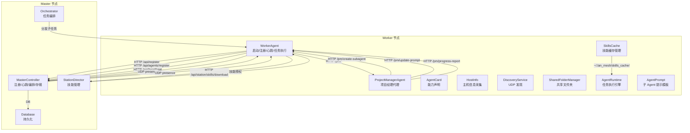

**更新** 新增 PM Agent 和子 Agent 管理相关组件

图表来源
- [worker.py:64-65](file://lan_mesh/worker.py#L64-L65)
- [pm_agent.py:30-51](file://lan_mesh/pm_agent.py#L30-L51)
- [api.py:127-233](file://lan_mesh/api.py#L127-L233)
- [agent_prompt.py:177-200](file://lan_mesh/agent_prompt.py#L177-L200)

章节来源
- [worker.py:1-593](file://lan_mesh/worker.py#L1-L593)
- [api.py:1-757](file://lan_mesh/api.py#L1-L757)
- [discovery.py:1-259](file://lan_mesh/discovery.py#L1-L259)
- [protocol.py:1-356](file://lan_mesh/protocol.py#L1-L356)
- [config.py:1-84](file://lan_mesh/config.py#L1-L84)

## 核心组件
- WorkerAgent：Worker 的核心控制器，负责生命周期管理、注册与心跳、HTTP API 暴露、共享文件夹与 Agent 运行时集成。**新增**：PM Agent 管理功能，支持远程激活和子 Agent 协作。
- ProjectManagerAgent：项目经理代理，运行在 Worker 进程内，负责任务规划、团队创建、子 Agent 管理和进度监控。**新增**：支持多种协作模式（单体、编排者、团队、总线、共享状态）。
- AgentPrompt：子 Agent 通用提示模板与定制构建器，提供标准化的子 Agent 行为准则和进度上报格式。**新增**：支持角色模板、依赖关系处理和里程碑管理。
- AgentCard：能力声明系统，描述 Worker 的技能、工具、模型偏好与并发能力，用于 Master 进行任务匹配与分发。
- HostInfo/DiscoveryPacket：协议层的数据模型，承载主机硬件画像与发现包摘要。
- DiscoveryService：UDP 广播发现服务，负责周期性广播 presence、监听其他设备、TTL 清理。
- SharedFolderManager：共享文件夹管理，提供文件列表、下载、上传与主机配置报告生成。
- AgentRuntime：Worker 端任务执行引擎，根据技能类型路由到对应处理器。**新增**：技能缓存读取和系统提示构建，支持 PM 注入的定制提示。
- Database：Master 端持久化层，存储主机记录、心跳日志、Agent 注册、任务与项目信息。
- Orchestrator：Master 端任务编排器，负责任务分解、构建 DAG、匹配 Agent、分发子任务与聚合结果。
- MCP 客户端与工具注册表：提供 MCP 工具的发现与调用能力，支撑 Agent 的工具链扩展。
- Preflight：启动前自检，确保环境满足运行条件。
- **SkillRegistry**：技能注册表，管理技能注册、权限分配与内容分发。**新增**：Worker 通过 HTTP API 拉取已授权技能。
- **StationDirector**：技能管理控制器，提供技能扫描、分配和下载接口。**新增**：技能授权和分发。

**更新** 新增 PM Agent、AgentPrompt 和增强的错误处理功能

章节来源
- [worker.py:68-593](file://lan_mesh/worker.py#L68-L593)
- [pm_agent.py:30-893](file://lan_mesh/pm_agent.py#L30-L893)
- [agent_prompt.py:1-467](file://lan_mesh/agent_prompt.py#L1-L467)
- [agent_card.py:167-228](file://lan_mesh/agent_card.py#L167-L228)
- [host_info.py:129-212](file://lan_mesh/host_info.py#L129-L212)
- [discovery.py:33-259](file://lan_mesh/discovery.py#L33-L259)
- [shared_folder.py:16-219](file://lan_mesh/shared_folder.py#L16-L219)
- [agent_runtime.py:28-396](file://lan_mesh/agent_runtime.py#L28-L396)
- [database.py:16-611](file://lan_mesh/database.py#L16-L611)
- [orchestrator.py:58-262](file://lan_mesh/orchestrator.py#L58-L262)
- [mcp_client.py:22-252](file://lan_mesh/mcp_client.py#L22-L252)
- [tool_registry.py:217-338](file://lan_mesh/tool_registry.py#L217-L338)
- [preflight.py:226-290](file://lan_mesh/preflight.py#L226-L290)
- [skill_registry.py:43-388](file://lan_mesh/skill_registry.py#L43-L388)
- [station_api.py:625-714](file://lan_mesh/station_api.py#L625-L714)

## 架构总览
Worker 代理在分布式系统中扮演"受控节点"角色，通过 UDP 发现感知 Master，随后通过 HTTP 完成注册与心跳，持续上报资源使用率与共享文件状态。**新增功能**：注册成功后自动拉取已授权技能并缓存到本地，为后续任务执行提供技能知识库。**重大更新**：支持 PM Agent 远程激活，Worker 可以作为子 Agent 执行任务并向上级 PM 上报进度。Master 侧负责注册记录、心跳日志、Agent 注册、任务编排和技能管理，最终将子任务分发至 Worker 执行并收集结果。

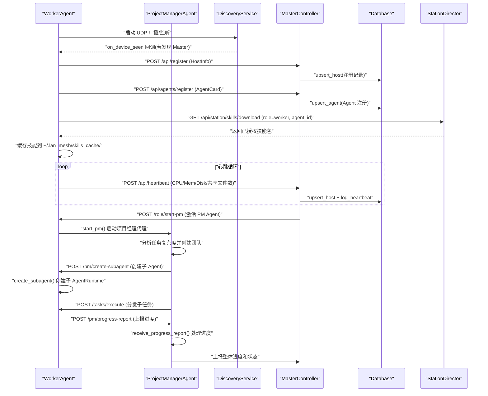

**更新** 新增 PM Agent 激活和子 Agent 管理流程

图表来源
- [worker.py:322-387](file://lan_mesh/worker.py#L322-L387)
- [pm_agent.py:68-133](file://lan_mesh/pm_agent.py#L68-L133)
- [api.py:129-233](file://lan_mesh/api.py#L129-L233)

## 详细组件分析

### WorkerAgent 类设计与状态管理
- 设计模式
  - 控制器模式：集中管理 Worker 的生命周期、注册、心跳与 API 暴露。
  - 线程模型：心跳循环与 UDP 监听在独立线程中运行，避免阻塞主事件循环。
  - 回调机制：DiscoveryService 的 on_device_seen 回调用于记录 Master 地址并触发注册。
  - **新增**：PM Agent 管理模式：支持远程激活 PM Agent 和子 Agent 协作。
- 状态管理
  - WorkerState：持有设备 ID、名称、角色、API 端口、启动时间、共享文件夹、Master 地址、AgentCard 快照、AgentRuntime 实例、PM Agent 实例和子 Agent 列表。
  - 线程安全：心跳循环与注册流程通过布尔标志与异常捕获保证幂等与容错。
  - **新增**：PM Agent 状态管理：跟踪 PM Agent 运行状态、团队信息和子 Agent 列表。
- 错误处理
  - HTTP 请求异常捕获与重试策略：心跳失败时尝试重新注册；注册失败打印错误并继续重试。
  - 端口冲突：HTTP 端口采用递增策略寻找可用端口；UDP 端口绑定失败直接报错。
  - 文件系统异常：共享文件夹写入与路径解析进行边界检查与异常捕获。
  - **新增**：PM Agent 异常处理：子 Agent 失败时的接管策略，包括同站重试、换站重试和本地接管。
  - **新增**：技能拉取异常处理：网络请求失败时记录错误但不影响 Worker 正常运行。

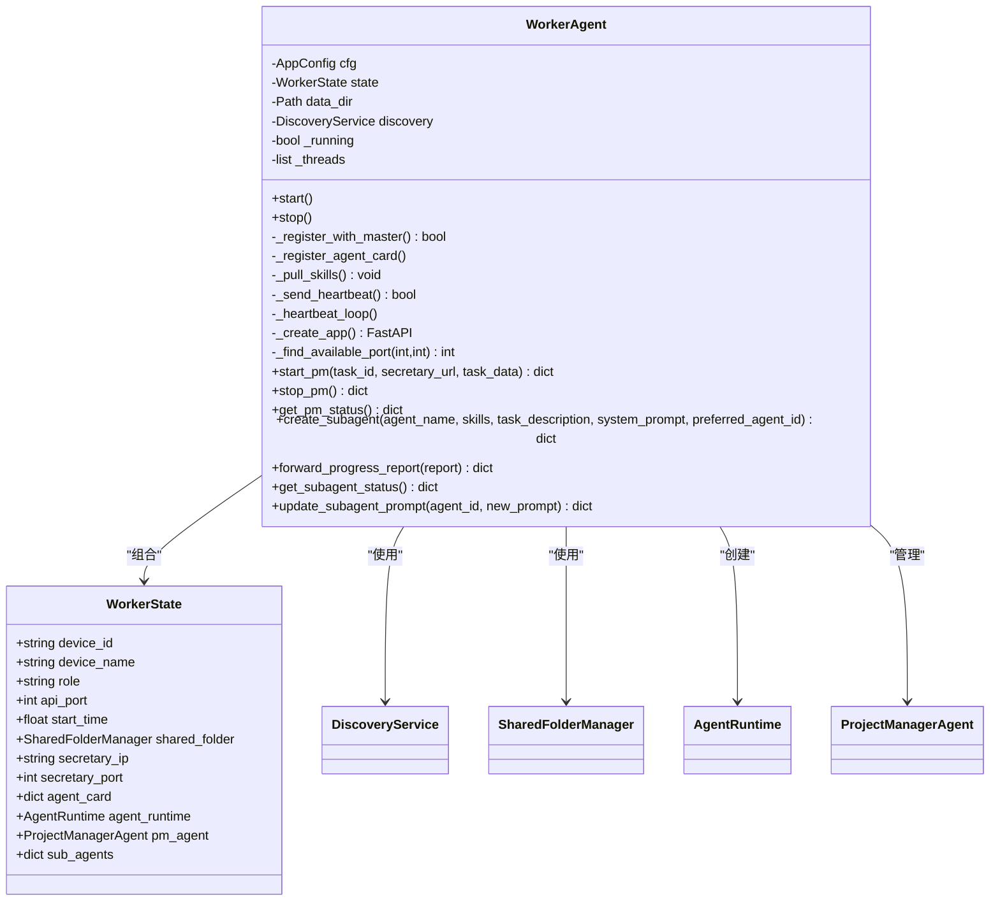

**更新** 新增 PM Agent 管理相关方法和状态字段

图表来源
- [worker.py:51-66](file://lan_mesh/worker.py#L51-L66)
- [worker.py:322-478](file://lan_mesh/worker.py#L322-L478)

章节来源
- [worker.py:68-593](file://lan_mesh/worker.py#L68-L593)

### ProjectManagerAgent 项目经理代理
- 设计理念
  - **多 Agent 协作模式**：支持单体、编排者、团队、总线、共享状态五种协作模式。
  - **智能任务分解**：使用 multi-agent-architect skill 分析任务复杂度并制定执行策略。
  - **动态团队管理**：根据任务需求创建子 Agent 团队，支持跨站点协作。
- 核心功能
  - **任务规划**：分析任务复杂度，决定协作模式和团队规模。
  - **团队创建**：在合适的 work_station 上创建子 Agent 或团队。
  - **依赖管理**：处理子任务间的依赖关系，支持拓扑排序和结果传递。
  - **进度监控**：定期收集子 Agent 进度，提供整体状态报告。
  - **失败接管**：实现三级失败接管策略：同站重试、换站重试、PM 本地接管。
- 优化特性
  - **依赖感知**：自动检测子任务依赖，等待前序任务完成后自动注入结果。
  - **结果聚合**：任务完成后调用 LLM 聚合各子任务结果为最终交付物。
  - **动态提示更新**：支持在任务执行过程中动态更新子 Agent 的 system prompt。
  - **自检机制**：要求子任务完成时提供自检结果，确保输出质量。

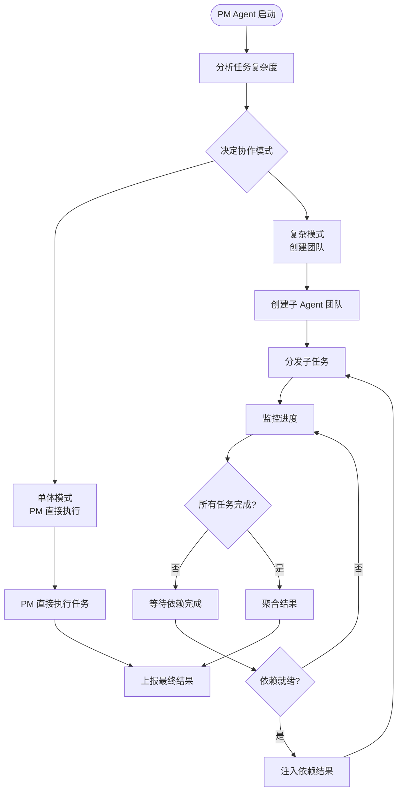

**更新** 新增 PM Agent 的协作模式和失败接管策略

图表来源
- [pm_agent.py:68-133](file://lan_mesh/pm_agent.py#L68-L133)
- [pm_agent.py:224-322](file://lan_mesh/pm_agent.py#L224-L322)
- [pm_agent.py:737-800](file://lan_mesh/pm_agent.py#L737-L800)

章节来源
- [pm_agent.py:30-893](file://lan_mesh/pm_agent.py#L30-L893)

### AgentPrompt 子 Agent 提示模板
- 设计思路
  - **通用基础模板**：BASE_SUBAGENT_PROMPT 定义所有子 Agent 共享的行为准则和工作协议。
  - **定制构建器**：build_subagent_prompt() 根据具体任务定制角色、上下文、依赖、质量要求。
  - **标准化格式**：PROGRESS_REPORT_FORMAT 定义统一的进度上报格式。
  - **上下文构建**：build_dispatch_context() 构建任务分发时的附加上下文。
- 角色模板
  - **代码生成工程师**：负责编写高质量、可运行的代码。
  - **代码审查工程师**：审查代码质量和安全性，输出问题清单。
  - **文档摘要工程师**：将长文档提炼为结构化摘要。
  - **运维执行工程师**：执行 Shell 命令并返回结构化结果。
  - **文件操作工程师**：执行文件读写、列表、删除等操作。
  - **系统监控工程师**：采集系统资源使用率并上报。
- 功能特性
  - **依赖关系处理**：自动构建前序依赖和后续依赖信息。
  - **里程碑管理**：根据任务描述推导关键里程碑节点。
  - **质量要求**：为不同类型任务定义相应的质量标准。
  - **PM 额外叮嘱**：根据依赖关系生成针对性的额外指导。

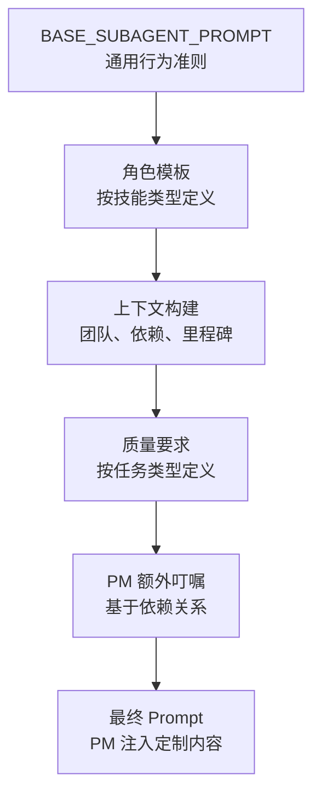

**更新** 新增 AgentPrompt 的角色模板和依赖关系处理

图表来源
- [agent_prompt.py:18-76](file://lan_mesh/agent_prompt.py#L18-L76)
- [agent_prompt.py:95-172](file://lan_mesh/agent_prompt.py#L95-L172)
- [agent_prompt.py:344-430](file://lan_mesh/agent_prompt.py#L344-L430)

章节来源
- [agent_prompt.py:1-467](file://lan_mesh/agent_prompt.py#L1-L467)

### WorkerAgent 类设计与状态管理
- 设计模式
  - 控制器模式：集中管理 Worker 的生命周期、注册、心跳与 API 暴露。
  - 线程模型：心跳循环与 UDP 监听在独立线程中运行，避免阻塞主事件循环。
  - 回调机制：DiscoveryService 的 on_device_seen 回调用于记录 Master 地址并触发注册。
  - **新增**：PM Agent 管理模式：支持远程激活 PM Agent 和子 Agent 协作。
- 状态管理
  - WorkerState：持有设备 ID、名称、角色、API 端口、启动时间、共享文件夹、Master 地址、AgentCard 快照、AgentRuntime 实例、PM Agent 实例和子 Agent 列表。
  - 线程安全：心跳循环与注册流程通过布尔标志与异常捕获保证幂等与容错。
  - **新增**：PM Agent 状态管理：跟踪 PM Agent 运行状态、团队信息和子 Agent 列表。
- 错误处理
  - HTTP 请求异常捕获与重试策略：心跳失败时尝试重新注册；注册失败打印错误并继续重试。
  - 端口冲突：HTTP 端口采用递增策略寻找可用端口；UDP 端口绑定失败直接报错。
  - 文件系统异常：共享文件夹写入与路径解析进行边界检查与异常捕获。
  - **新增**：PM Agent 异常处理：子 Agent 失败时的接管策略，包括同站重试、换站重试和本地接管。
  - **新增**：技能拉取异常处理：网络请求失败时记录错误但不影响 Worker 正常运行。

**更新** 新增 PM Agent 管理相关方法和状态字段

图表来源
- [worker.py:51-66](file://lan_mesh/worker.py#L51-L66)
- [worker.py:322-478](file://lan_mesh/worker.py#L322-L478)

章节来源
- [worker.py:68-593](file://lan_mesh/worker.py#L68-L593)

### AgentCard 能力声明系统
- 能力构成
  - 技能（Skill）：描述可处理的任务类型，包含输入 Schema 与标签。
  - 工具（ToolDef）：可调用的外部工具，支持 MCP 兼容。
  - 运行时属性：模型偏好、最大并发任务数、状态与任务计数。
- 生成流程
  - 依据设备信息生成 AgentCard，包含设备 ID/名称/IP/API 端口、技能与工具清单。
  - Worker 在注册主机信息后，向 Master 发送 /api/agents/register 完成能力登记。
- 用途
  - Master 侧通过数据库查询空闲 Agent 并按技能匹配分发子任务。

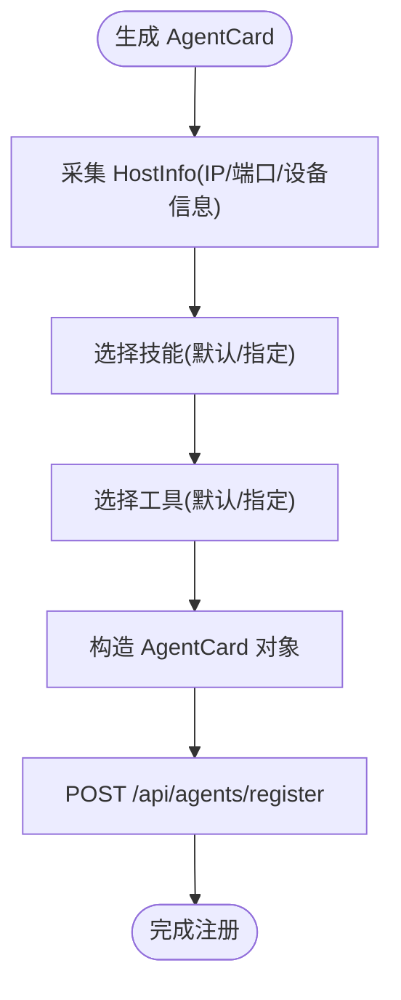

图表来源
- [agent_card.py:167-217](file://lan_mesh/agent_card.py#L167-L217)
- [api.py:171-175](file://lan_mesh/api.py#L171-L175)

章节来源
- [agent_card.py:16-228](file://lan_mesh/agent_card.py#L16-L228)
- [api.py:157-178](file://lan_mesh/api.py#L157-L178)

### 主机信息采集与发现机制
- 主机信息采集
  - 使用 psutil 收集 CPU/内存/磁盘/网络等指标，生成 HostInfo。
  - 通过 make_discovery_packet 生成 DiscoveryPacket 摘要，便于 UDP 广播快速识别。
- UDP 发现
  - DiscoveryService 后台线程负责：
    - presence_loop：周期性广播自身 presence。
    - listen_loop：监听其他设备包，回送 presence 并更新设备列表，触发 on_device_seen。
    - prune_loop：定期清理超时离线设备。
  - 端口与网络状态：支持 SO_REUSEADDR/SO_REUSEPORT 适配不同平台；计算广播目标地址。

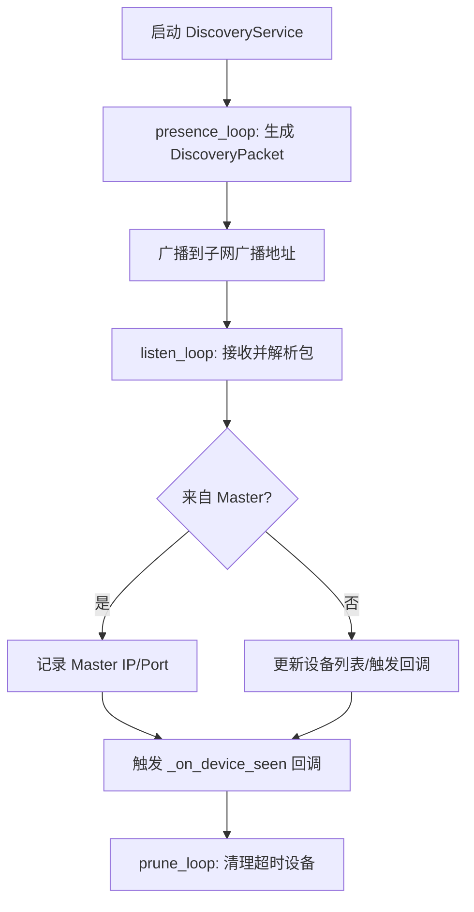

**更新** 增强的错误处理和日志记录

图表来源
- [discovery.py:139-228](file://lan_mesh/discovery.py#L139-L228)
- [discovery.py:159-214](file://lan_mesh/discovery.py#L159-L214)
- [host_info.py:194-212](file://lan_mesh/host_info.py#L194-L212)

章节来源
- [host_info.py:129-212](file://lan_mesh/host_info.py#L129-L212)
- [discovery.py:33-259](file://lan_mesh/discovery.py#L33-L259)

### 与 Master 的通信协议
- 注册流程
  - Worker 通过 /api/register 发送 HostInfo，Master 写入数据库并广播注册事件。
  - 随后发送 /api/agents/register，携带 AgentCard，Master 写入 Agent 注册表。
  - **新增**：注册成功后自动请求 /api/station/skills/download 获取已授权技能。
- 心跳流程
  - Worker 每 HEARTBEAT_INTERVAL_SECS 向 /api/heartbeat 发送 CPU/Mem/Disk/共享文件数。
  - Master 更新在线状态与最后心跳时间，并记录心跳日志。
- 任务执行
  - Master 通过 /tasks/execute 将子任务分发给 Worker。
  - Worker 执行完成后返回结果，Master 记录消费与更新任务状态。
- **新增**：PM Agent 通信协议
  - /role/start-pm：远程激活 PM Agent。
  - /pm/create-subagent：在目标 Worker 创建子 Agent。
  - /pm/progress-report：子 Agent 向 PM 上报进度。
  - /pm/update-prompt：动态更新子 Agent 的 system prompt。

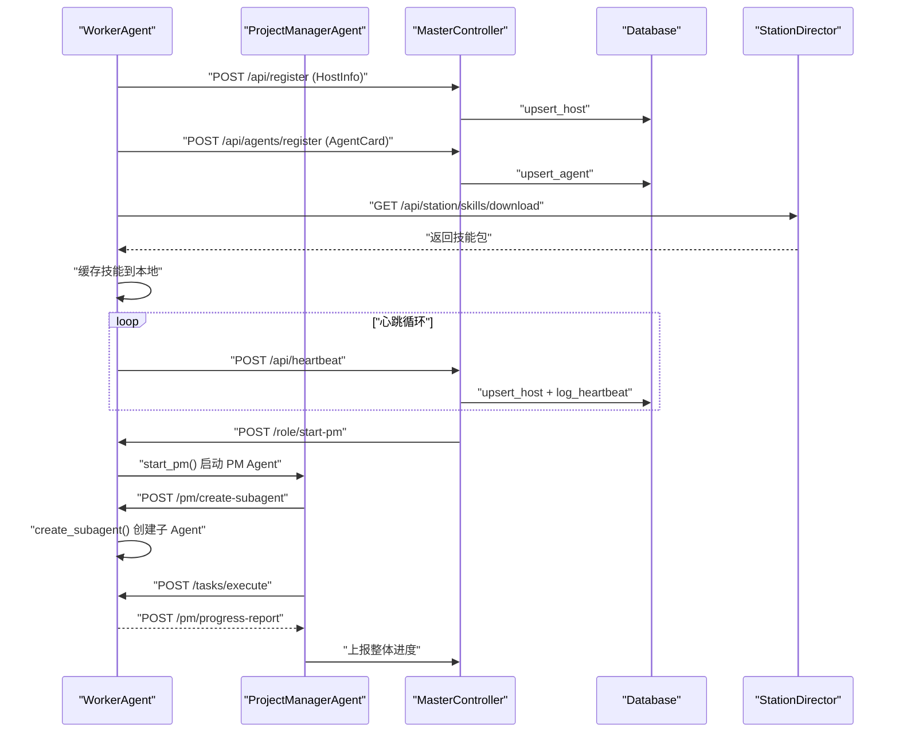

**更新** 新增 PM Agent 通信协议和子 Agent 管理流程

图表来源
- [worker.py:133-155](file://lan_mesh/worker.py#L133-L155)
- [worker.py:181-207](file://lan_mesh/worker.py#L181-L207)
- [api.py:129-233](file://lan_mesh/api.py#L129-L233)
- [station_api.py:643-646](file://lan_mesh/station_api.py#L643-L646)

章节来源
- [api.py:147-200](file://lan_mesh/api.py#L147-L200)
- [database.py:147-231](file://lan_mesh/database.py#L147-L231)

### Agent 运行时与任务执行
- 执行策略
  - 根据 required_skill 路由到对应处理器：代码生成/审查、文档摘要、RAG 检索、Shell 执行、文件操作、系统监控。
  - LLM API 调用优先使用 DeepSeek，其次 OpenAI，支持环境变量配置。
- **新增**：技能缓存系统
  - AgentRuntime 在启动时创建技能缓存目录 `~/.lan_mesh/skills_cache/`。
  - 从本地缓存读取技能内容，构建系统提示，为 LLM 提供上下文知识。
  - 支持 YAML front matter 解析，自动去除头部元数据。
- **新增**：PM 注入的定制提示
  - 支持 PM Agent 注入的定制 system prompt，覆盖默认技能缓存拼装。
  - 动态更新子 Agent 的 system prompt，用于纠偏、补充上下文、调整策略。
- 错误处理
  - 捕获子进程超时、文件系统异常与网络请求异常，返回结构化错误信息。
  - 任务执行结果包含输出、状态与可选的 token 用量统计。

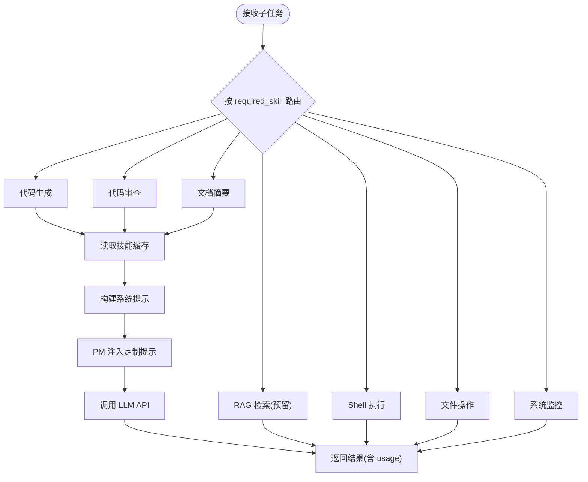

**更新** 新增 PM 注入的定制提示和增强的错误处理

图表来源
- [agent_runtime.py:47-48](file://lan_mesh/agent_runtime.py#L47-L48)
- [agent_runtime.py:193-226](file://lan_mesh/agent_runtime.py#L193-L226)
- [agent_runtime.py:49-57](file://lan_mesh/agent_runtime.py#L49-L57)
- [agent_runtime.py:298-300](file://lan_mesh/agent_runtime.py#L298-L300)

章节来源
- [agent_runtime.py:28-396](file://lan_mesh/agent_runtime.py#L28-L396)

### 技能管理系统
- **SkillRegistry**：中央技能注册表，管理技能注册、权限分配与内容分发。
  - 扫描 skills/ 目录，解析 YAML front matter 元数据。
  - 管理技能权限分配，支持角色、Agent、主机级别的授权。
  - 构建技能包，供 Worker 拉取已授权技能。
- **StationDirector API**：提供技能管理接口。
  - `/api/station/skills/download`：Worker 拉取已授权技能包。
  - `/api/station/skills/scan`：手动扫描注册新技能。
  - `/api/station/skills/{skill_id}/assign`：分配技能给目标实体。
- **Worker 自动技能拉取**：
  - 注册成功后自动请求授权技能。
  - 缓存到 `~/.lan_mesh/skills_cache/{skill_id}/SKILL.md`。
  - 支持参考文档缓存 `reference.md`。
  - 错误恢复：网络失败时记录错误但不影响 Worker 正常运行。

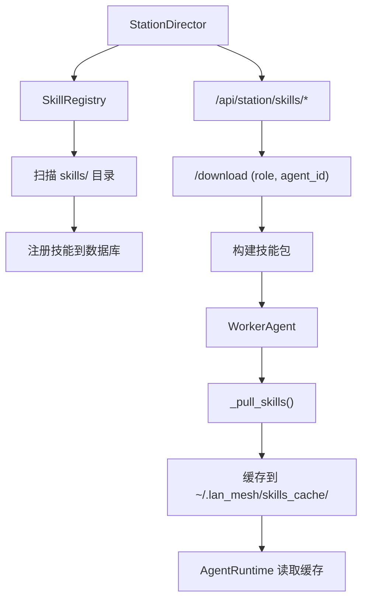

**新增** 技能管理系统架构图

图表来源
- [skill_registry.py:57-100](file://lan_mesh/skill_registry.py#L57-L100)
- [station_api.py:643-646](file://lan_mesh/station_api.py#L643-L646)
- [worker.py:181-207](file://lan_mesh/worker.py#L181-L207)

章节来源
- [skill_registry.py:43-388](file://lan_mesh/skill_registry.py#L43-L388)
- [station_api.py:625-714](file://lan_mesh/station_api.py#L625-L714)
- [worker.py:181-207](file://lan_mesh/worker.py#L181-L207)

### 启动序列图与通信流程图
- Worker 启动序列
  - 自检通过后，创建共享文件夹、生成设备 ID、部署采集脚本并写入初始配置报告。
  - 启动 DiscoveryService、AgentRuntime，启动心跳线程与 FastAPI 服务器。
  - 发现 Master 后注册 HostInfo 与 AgentCard，**新增**：自动拉取已授权技能并缓存到本地。
  - 进入心跳循环，持续上报状态。

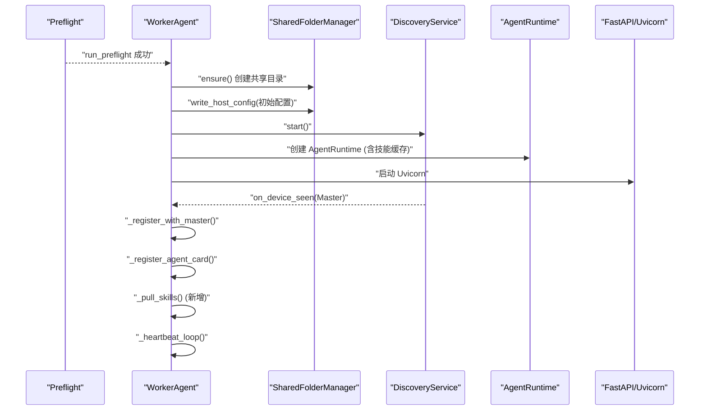

**更新** 新增技能拉取流程

图表来源
- [preflight.py:226-290](file://lan_mesh/preflight.py#L226-L290)
- [worker.py:392-396](file://lan_mesh/worker.py#L392-L396)
- [worker.py:181-207](file://lan_mesh/worker.py#L181-L207)

- Worker 与 Master 通信流程
  - UDP 发现：Worker 广播 presence，Master 回送 presence 并记录。
  - HTTP 注册：Worker 发送 HostInfo，Master 写入数据库并广播。
  - **新增**：技能拉取：Worker 请求已授权技能，Master 返回技能包并缓存到本地。
  - 心跳：Worker 发送实时资源使用率，Master 更新在线状态。
  - 任务：Master 分发子任务，Worker 执行并返回结果。
  - **新增**：PM Agent 协作：Master 远程激活 PM Agent，PM Agent 创建子 Agent 并管理进度。

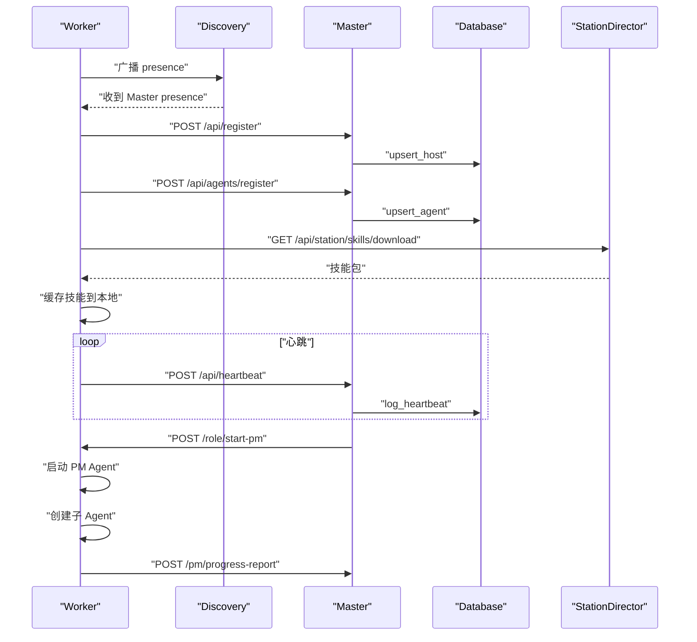

**更新** 新增技能拉取通信流程和 PM Agent 协作流程

图表来源
- [discovery.py:147-214](file://lan_mesh/discovery.py#L147-L214)
- [worker.py:181-207](file://lan_mesh/worker.py#L181-L207)
- [station_api.py:643-646](file://lan_mesh/station_api.py#L643-L646)
- [api.py:129-233](file://lan_mesh/api.py#L129-L233)

## 依赖分析
- 组件耦合
  - WorkerAgent 与 DiscoveryService、SharedFolderManager、AgentRuntime 强耦合，通过回调与共享状态协作。
  - MasterController 与 Database、DiscoveryService、Orchestrator 强耦合，负责注册、心跳、编排与存储。
  - **新增**：Worker 与 StationDirector 通过 HTTP API 通信，实现技能授权和分发。
  - **新增**：PM Agent 与 WorkerAgent 通过 HTTP API 通信，实现远程激活和子 Agent 管理。
- 外部依赖
  - psutil：主机信息采集。
  - fastapi/uvicorn：HTTP API 与服务器。
  - requests：HTTP 客户端。
  - sqlite3：Master 端持久化。
  - yaml/pydantic：配置解析与校验。
  - **新增**：pathlib：文件系统路径管理。
- 循环依赖
  - 未发现直接循环依赖；模块间通过协议层数据模型与 API 路由解耦。

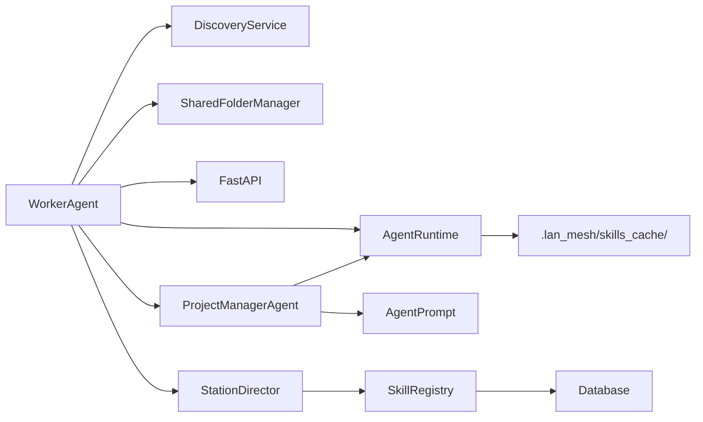

**更新** 新增 PM Agent 和 AgentPrompt 相关依赖关系

图表来源
- [worker.py:392-396](file://lan_mesh/worker.py#L392-L396)
- [agent_runtime.py:47-48](file://lan_mesh/agent_runtime.py#L47-L48)
- [pm_agent.py:30-51](file://lan_mesh/pm_agent.py#L30-L51)
- [skill_registry.py:43-48](file://lan_mesh/skill_registry.py#L43-L48)

章节来源
- [worker.py:392-593](file://lan_mesh/worker.py#L392-L593)
- [pm_agent.py:30-893](file://lan_mesh/pm_agent.py#L30-L893)
- [orchestrator.py:58-108](file://lan_mesh/orchestrator.py#L58-L108)

## 性能考虑
- 心跳频率与资源消耗
  - 心跳间隔为固定常量，建议根据网络与负载调整，避免过于频繁导致 CPU/网络开销。
- 线程模型
  - 心跳与发现均在独立线程运行，避免阻塞 API 服务器；注意线程安全与异常恢复。
- I/O 与存储
  - 共享文件夹写入与主机配置报告生成为磁盘 I/O 密集操作，建议合理规划存储位置与容量。
  - **新增**：技能缓存写入为磁盘 I/O 操作，建议合理规划存储位置与容量。
  - **新增**：PM Agent 的团队信息和子 Agent 状态需要定期持久化。
- 网络绑定
  - UDP 端口绑定失败需及时反馈；HTTP 端口冲突采用递增策略，减少人工干预。
  - **新增**：PM Agent 的 HTTP API 调用设置合理的超时时间，避免阻塞 Worker 启动流程。
- **新增**：PM Agent 性能优化
  - 任务分解算法的时间复杂度为 O(n²)，其中 n 为子任务数量。
  - 依赖检测使用拓扑排序，时间复杂度为 O(n + e)，其中 e 为依赖边数。
  - 失败接管策略的重试次数限制为 2 次，避免无限重试。

## 故障排查指南
- 启动失败
  - 检查自检报告：Python 版本、依赖、配置文件、数据目录、共享文件夹、网络接口、端口占用。
  - 关键检查项：依赖缺失、配置文件不存在、数据目录不可写、共享文件夹不可写、UDP 端口被占用。
- 注册失败
  - 确认 Master 已启动并可访问；检查 Worker 与 Master 的网络连通性；查看 Master 日志与数据库注册记录。
- 心跳失败
  - 检查网络延迟与丢包；确认 Master 端 /api/heartbeat 路由正常；查看数据库心跳日志。
- 任务执行失败
  - 检查 AgentCard 技能是否匹配；确认 Worker 端 AgentRuntime 可用；查看 LLM API Key 配置与网络访问。
- **新增**：PM Agent 启动失败
  - 检查 /role/start-pm 端点是否可用；确认 Worker 端 PM Agent 管理功能正常。
  - 查看 PM Agent 日志，确认任务数据解析是否正确。
- **新增**：子 Agent 创建失败
  - 检查 /pm/create-subagent 端点是否可用；确认目标 Worker 的 AgentRuntime 初始化正常。
  - 查看子 Agent 的 system prompt 是否正确注入。
- **新增**：技能拉取失败
  - 检查 StationDirector 是否正常运行；确认 /api/station/skills/download 路由可用；查看技能授权配置。
  - 检查本地缓存目录 `~/.lan_mesh/skills_cache/` 权限；确认网络连接稳定。
- **新增**：PM Agent 进度上报失败
  - 检查 /pm/progress-report 端点是否可用；确认 Worker 能够正确转发进度报告。
  - 查看子 Agent 的自检结果，确认输出格式符合要求。

章节来源
- [preflight.py:226-290](file://lan_mesh/preflight.py#L226-L290)
- [api.py:147-200](file://lan_mesh/api.py#L147-L200)
- [database.py:194-201](file://lan_mesh/database.py#L194-L201)
- [agent_runtime.py:172-396](file://lan_mesh/agent_runtime.py#L172-L396)
- [worker.py:181-207](file://lan_mesh/worker.py#L181-L207)
- [pm_agent.py:68-133](file://lan_mesh/pm_agent.py#L68-L133)

## 结论
Worker 代理通过清晰的模块化设计与稳健的错误处理，在分布式系统中承担了"自注册、保活、上报、执行"的关键职责。**新增的 PM Agent 集成功能**使其能够作为项目经理代理，支持复杂的多 Agent 协作模式，包括任务分解、团队管理、进度监控和失败接管策略。**增强的错误处理机制**提供了更好的异常捕获和日志记录，提高了系统的稳定性和可维护性。其基于 UDP 的发现机制与 HTTP 的注册/心跳协议，配合 Master 的编排与存储，实现了高效的节点协同。AgentCard 能力声明系统进一步提升了任务匹配的准确性与可扩展性。建议在生产环境中关注心跳频率、网络稳定性与存储性能，并完善监控与告警体系。

## 附录
- 配置与端口
  - Discovery 端口：45454
  - Worker API 端口：45460
  - Master API/Web UI 端口：45470
  - 心跳间隔：5 秒
  - 发现存在间隔：3 秒
  - 设备 TTL：12 秒
- **新增**：技能缓存目录
  - 默认缓存路径：`~/.lan_mesh/skills_cache/`
  - 技能文件格式：`{skill_id}/SKILL.md` 和 `{skill_id}/reference.md`
- **新增**：PM Agent 端口
  - PM Agent 管理端点：`/role/start-pm`、`/role/stop-pm`、`/role/pm-status`
  - 子 Agent 管理端点：`/pm/create-subagent`、`/pm/progress-report`、`/pm/update-prompt`
  - 子 Agent 状态端点：`/pm/subagents`

章节来源
- [protocol.py:17-25](file://lan_mesh/protocol.py#L17-L25)
- [config.py:14-41](file://lan_mesh/config.py#L14-L41)
- [agent_runtime.py:47-48](file://lan_mesh/agent_runtime.py#L47-L48)
- [api.py:127-233](file://lan_mesh/api.py#L127-L233)