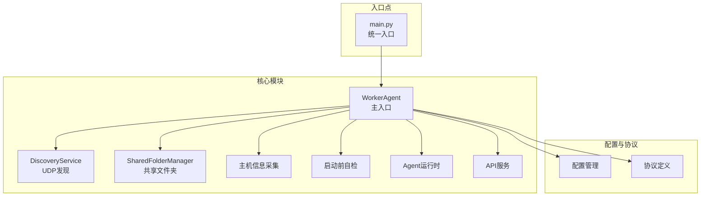
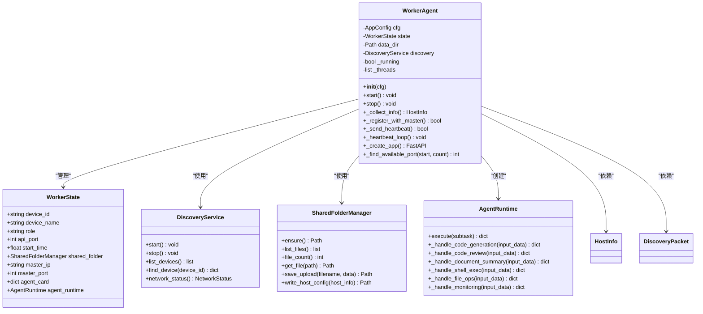
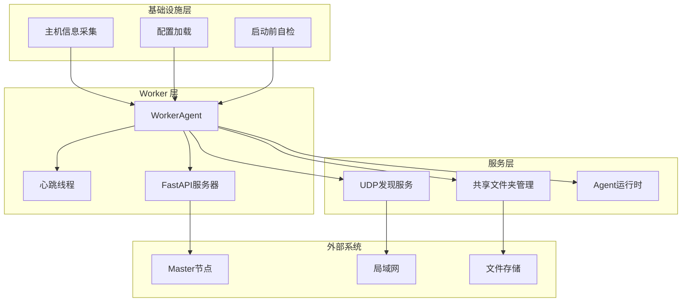
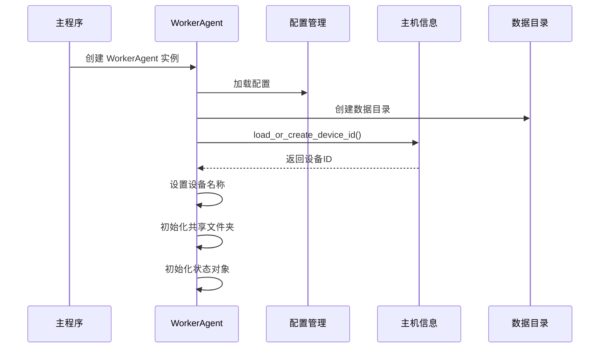
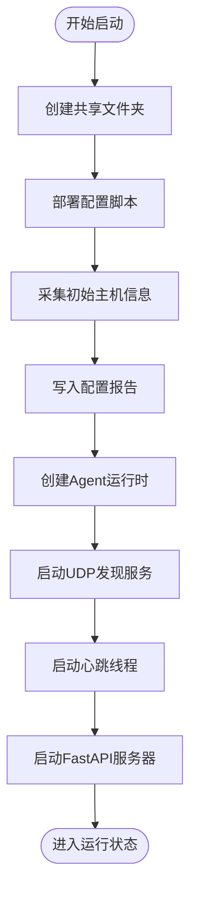
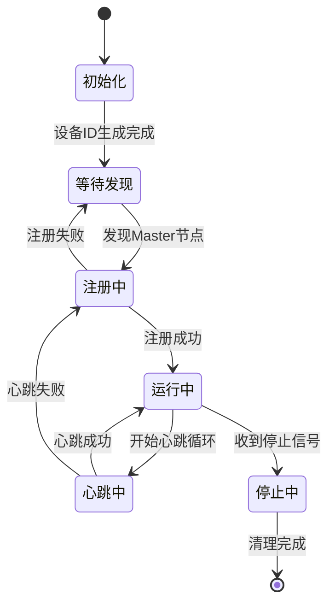
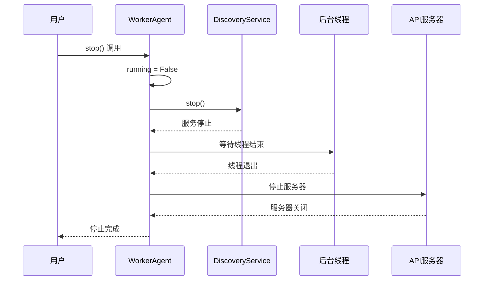
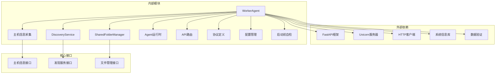
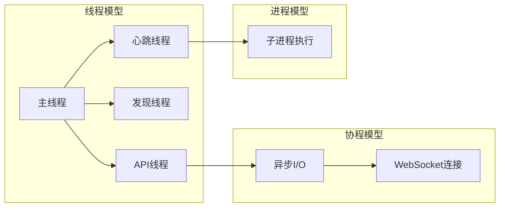

# Worker 生命周期管理

<cite>
**本文档引用的文件**
- [worker.py](file://lan_mesh/worker.py)
- [agent_runtime.py](file://lan_mesh/agent_runtime.py)
- [discovery.py](file://lan_mesh/discovery.py)
- [shared_folder.py](file://lan_mesh/shared_folder.py)
- [host_info.py](file://lan_mesh/host_info.py)
- [preflight.py](file://lan_mesh/preflight.py)
- [api.py](file://lan_mesh/api.py)
- [protocol.py](file://lan_mesh/protocol.py)
- [config.py](file://lan_mesh/config.py)
- [agent_card.py](file://lan_mesh/agent_card.py)
- [main.py](file://main.py)
</cite>

## 目录
1. [简介](#简介)
2. [项目结构](#项目结构)
3. [核心组件](#核心组件)
4. [架构概览](#架构概览)
5. [详细组件分析](#详细组件分析)
6. [依赖关系分析](#依赖关系分析)
7. [性能考虑](#性能考虑)
8. [故障排除指南](#故障排除指南)
9. [结论](#结论)

## 简介

Worker 生命周期管理是 LAN Mesh 分布式系统的核心组成部分，负责在各主机上部署和管理 Worker 守护进程。本文档深入分析 WorkerAgent 类的初始化过程、状态管理机制和生命周期控制，详细说明启动流程的各个阶段，包括设备ID生成、主机信息采集、共享文件夹创建、FastAPI应用启动、UDP发现服务启动和心跳循环建立。

Worker 作为分布式系统中的工作节点，承担着自动采集本机配置、创建并暴露共享文件夹、通过 UDP 广播发现 Master 节点、通过 HTTP 向 Master 注册并发送心跳、提供 HTTP API 供 Master 查询与文件下载等职责。

## 项目结构

LAN Mesh 项目采用模块化设计，主要包含以下核心模块：

**图表来源**
- [worker.py:1-325](file://lan_mesh/worker.py#L1-L325)
- [main.py:1-90](file://main.py#L1-L90)

**章节来源**
- [worker.py:1-45](file://lan_mesh/worker.py#L1-L45)
- [main.py:25-86](file://main.py#L25-L86)

## 核心组件

### WorkerAgent 类

WorkerAgent 是 Worker 生命周期管理的核心类，负责整个 Worker 的启动、运行和停止过程。该类实现了完整的生命周期管理，包括状态初始化、服务启动、心跳维护和优雅停机。

**图表来源**
- [worker.py:47-325](file://lan_mesh/worker.py#L47-L325)
- [agent_runtime.py:28-242](file://lan_mesh/agent_runtime.py#L28-L242)
- [discovery.py:33-259](file://lan_mesh/discovery.py#L33-L259)
- [shared_folder.py:16-219](file://lan_mesh/shared_folder.py#L16-L219)

### WorkerState 数据结构

WorkerState 是 Worker 的运行时共享状态容器，包含了 Worker 运行所需的所有关键信息：

- **设备标识**：device_id、device_name、role
- **网络配置**：api_port、master_ip、master_port
- **文件系统**：shared_folder、agent_runtime
- **运行时信息**：start_time、agent_card

**章节来源**
- [worker.py:47-60](file://lan_mesh/worker.py#L47-L60)
- [protocol.py:69-111](file://lan_mesh/protocol.py#L69-L111)

## 架构概览

Worker 的整体架构采用模块化设计，各组件职责明确，通过清晰的接口进行交互：

**图表来源**
- [worker.py:253-325](file://lan_mesh/worker.py#L253-L325)
- [discovery.py:33-95](file://lan_mesh/discovery.py#L33-L95)
- [shared_folder.py:16-38](file://lan_mesh/shared_folder.py#L16-L38)

## 详细组件分析

### 启动流程详解

Worker 的启动流程是一个复杂的多阶段过程，每个阶段都有特定的目标和验证要求：

#### 阶段一：设备ID生成与初始化

**图表来源**
- [worker.py:73-96](file://lan_mesh/worker.py#L73-L96)
- [host_info.py:21-37](file://lan_mesh/host_info.py#L21-L37)

#### 阶段二：共享文件夹创建与配置报告

**图表来源**
- [worker.py:285-302](file://lan_mesh/worker.py#L285-L302)
- [shared_folder.py:122-144](file://lan_mesh/shared_folder.py#L122-L144)

#### 阶段三：FastAPI应用启动

Worker 使用 FastAPI 框架提供 HTTP API 服务，支持以下功能：

- **信息查询**：GET `/info` 返回完整主机配置
- **文件管理**：共享文件的列表、下载、上传功能
- **任务执行**：接收并执行 Master 分发的子任务
- **健康检查**：基础的健康状态检查

**章节来源**
- [worker.py:219-238](file://lan_mesh/worker.py#L219-L238)
- [api.py:39-98](file://lan_mesh/api.py#L39-L98)

### 状态管理机制

Worker 的状态管理采用共享状态模式，通过 WorkerState 对象集中管理所有运行时信息：

**图表来源**
- [worker.py:203-216](file://lan_mesh/worker.py#L203-L216)
- [worker.py:320-325](file://lan_mesh/worker.py#L320-L325)

### 异常处理与错误恢复

Worker 实现了多层次的异常处理机制：

#### 网络异常处理
- **端口冲突**：自动寻找可用端口
- **UDP绑定失败**：降级运行但仍保持基本功能
- **HTTP请求失败**：重试机制和优雅降级

#### 文件系统异常处理
- **路径越界保护**：防止目录遍历攻击
- **权限检查**：确保文件操作的安全性
- **磁盘空间监控**：避免存储溢出

#### 服务异常处理
- **心跳失败**：自动重新注册
- **Agent运行时异常**：任务失败记录和错误返回
- **配置文件损坏**：自动重建默认配置

**章节来源**
- [worker.py:126-146](file://lan_mesh/worker.py#L126-L146)
- [shared_folder.py:88-101](file://lan_mesh/shared_folder.py#L88-L101)
- [discovery.py:155-214](file://lan_mesh/discovery.py#L155-L214)

### 优雅停机机制

Worker 的优雅停机机制确保服务能够安全地关闭所有正在运行的服务：

**图表来源**
- [worker.py:320-325](file://lan_mesh/worker.py#L320-L325)
- [discovery.py:86-89](file://lan_mesh/discovery.py#L86-L89)

**章节来源**
- [worker.py:320-325](file://lan_mesh/worker.py#L320-L325)
- [discovery.py:86-89](file://lan_mesh/discovery.py#L86-L89)

## 依赖关系分析

Worker 的依赖关系体现了模块化设计的优势：

**图表来源**
- [worker.py:15-44](file://lan_mesh/worker.py#L15-L44)
- [agent_runtime.py:20-26](file://lan_mesh/agent_runtime.py#L20-L26)

### 关键依赖特性

#### 启动前自检依赖
- **Python版本检查**：确保运行环境满足要求
- **依赖包验证**：检查必需的第三方库
- **配置文件处理**：自动创建默认配置
- **网络端口验证**：确保端口可用性

#### 主机信息采集依赖
- **系统信息获取**：CPU、内存、磁盘使用情况
- **网络接口信息**：IP地址、MAC地址、广播地址
- **文件系统信息**：磁盘空间、文件数量统计

#### UDP发现服务依赖
- **网络套接字**：UDP广播和单播通信
- **线程同步**：多线程安全的设备列表管理
- **定时器机制**：周期性的存在广播和清理任务

**章节来源**
- [preflight.py:48-73](file://lan_mesh/preflight.py#L48-L73)
- [host_info.py:129-191](file://lan_mesh/host_info.py#L129-L191)
- [discovery.py:139-259](file://lan_mesh/discovery.py#L139-L259)

## 性能考虑

### 资源使用优化

Worker 在设计时充分考虑了性能优化：

#### 内存管理
- **延迟初始化**：只有在需要时才创建昂贵的对象
- **缓存机制**：主机信息的定期缓存减少重复计算
- **资源池**：HTTP连接和文件句柄的合理管理

#### 网络性能
- **异步处理**：心跳和文件传输采用异步模式
- **批量操作**：多个文件操作的批处理优化
- **连接复用**：HTTP客户端的连接池复用

#### 磁盘I/O优化
- **增量更新**：只在必要时更新配置文件
- **缓冲写入**：大文件的分块写入避免内存峰值
- **压缩传输**：共享文件的压缩传输减少带宽占用

### 并发模型

Worker 采用了混合并发模型：

**图表来源**
- [worker.py:298-302](file://lan_mesh/worker.py#L298-L302)
- [agent_runtime.py:120-136](file://lan_mesh/agent_runtime.py#L120-L136)

## 故障排除指南

### 常见启动问题

#### 设备ID生成失败
**症状**：启动时无法生成稳定的设备ID
**解决方案**：
1. 检查用户主目录的写入权限
2. 确认 `.lan_mesh` 目录存在且可写
3. 验证UUID生成函数的可用性

#### 端口占用问题
**症状**：Worker 无法绑定到指定端口
**解决方案**：
1. 使用 `netstat` 检查端口占用情况
2. 修改配置文件中的端口号
3. 使用系统提供的端口自动分配功能

#### 网络接口不可用
**症状**：UDP发现服务启动失败
**解决方案**：
1. 检查网络接口状态
2. 验证防火墙设置
3. 确认广播权限

### 运行时问题诊断

#### 心跳失败
**症状**：Master 无法获取Worker的状态信息
**诊断步骤**：
1. 检查网络连通性
2. 验证Master的IP和端口配置
3. 查看Worker的日志输出

#### 文件共享异常
**症状**：共享文件无法正常访问
**排查方法**：
1. 检查共享文件夹的权限设置
2. 验证文件路径的安全性
3. 确认磁盘空间充足

#### Agent运行时错误
**症状**：任务执行失败或异常
**解决策略**：
1. 检查LLM API密钥配置
2. 验证系统资源是否充足
3. 查看详细的错误日志

**章节来源**
- [preflight.py:226-290](file://lan_mesh/preflight.py#L226-L290)
- [worker.py:126-146](file://lan_mesh/worker.py#L126-L146)

## 结论

Worker 生命周期管理展现了现代分布式系统设计的最佳实践。通过模块化架构、完善的异常处理机制和优雅的停机流程，Worker 能够稳定可靠地在各种环境中运行。

关键优势包括：
- **模块化设计**：清晰的职责分离和接口定义
- **健壮性保证**：多层次的异常处理和错误恢复
- **性能优化**：合理的资源管理和并发模型
- **易用性**：自动化的配置管理和启动前自检

未来可以考虑的改进方向：
- 增强监控和日志功能
- 扩展更多的任务执行能力
- 优化网络通信效率
- 增加更多的安全防护措施

通过本文档的详细分析，开发者可以深入理解 Worker 的工作机制，为系统的维护、扩展和故障排除提供有力的技术支撑。