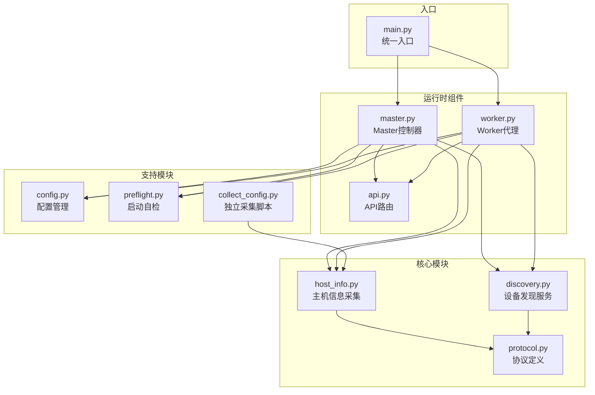
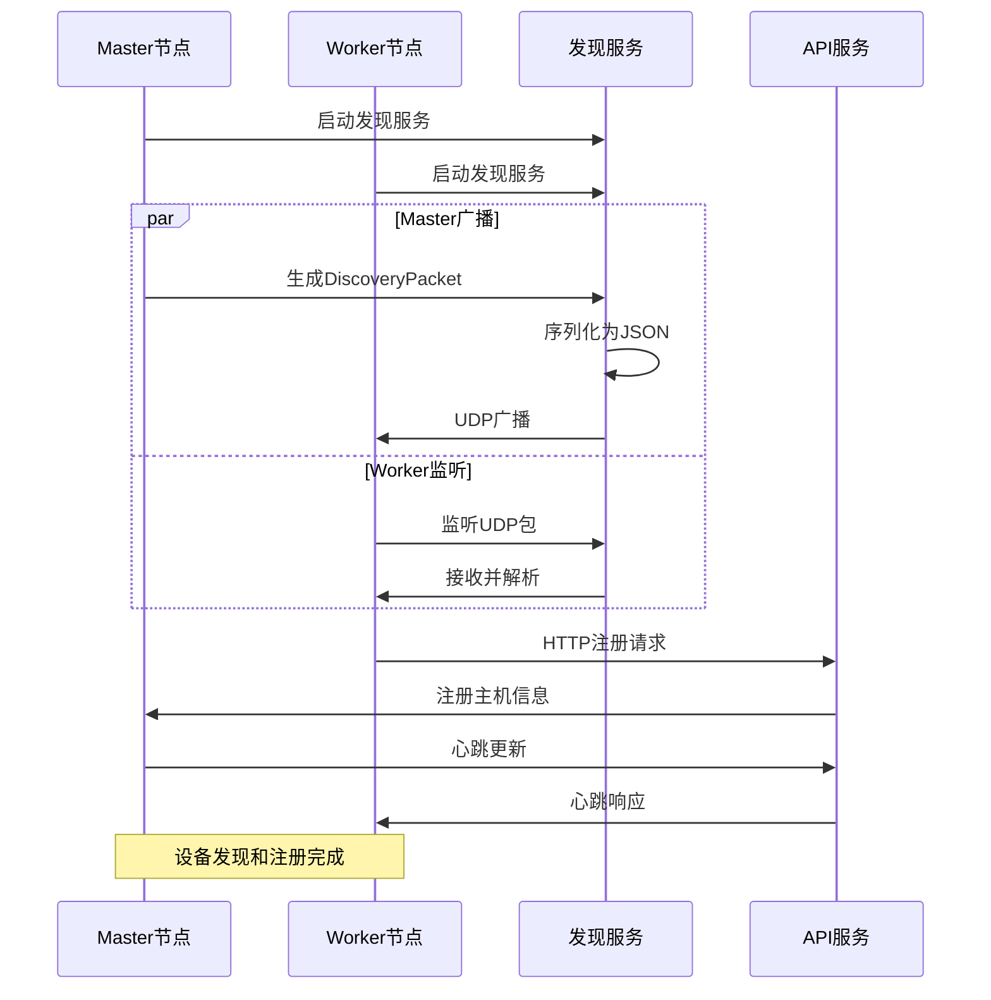
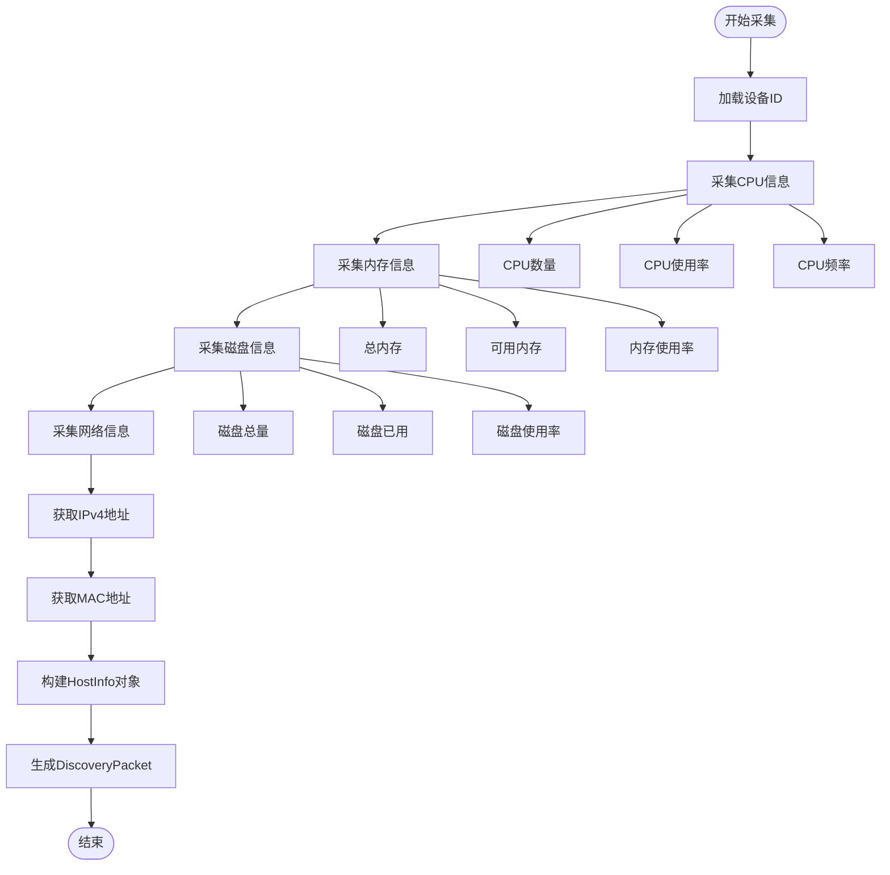
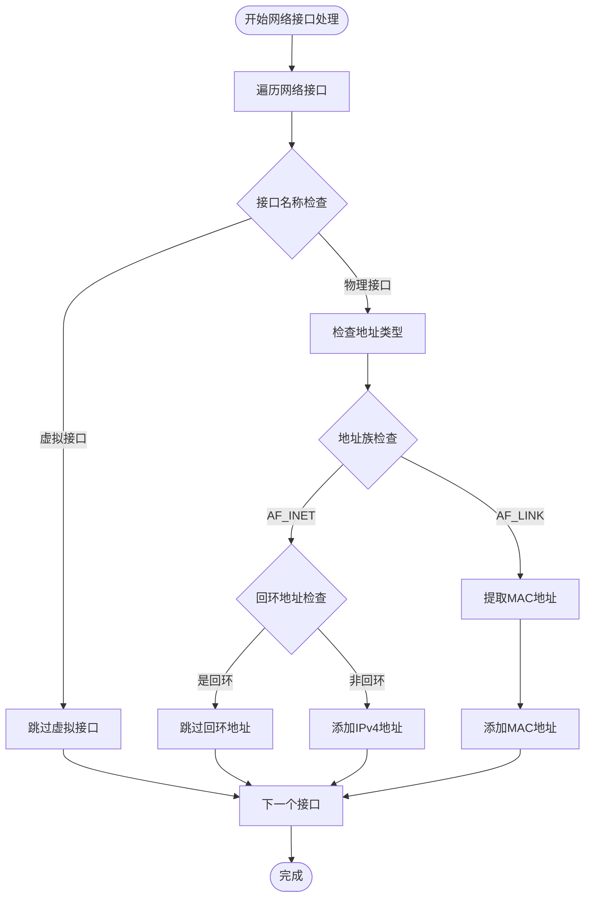
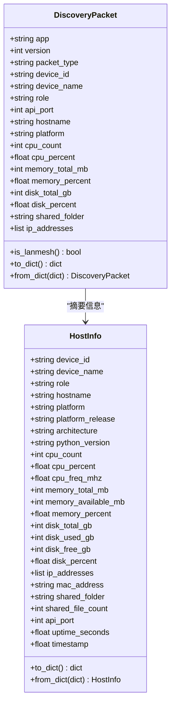
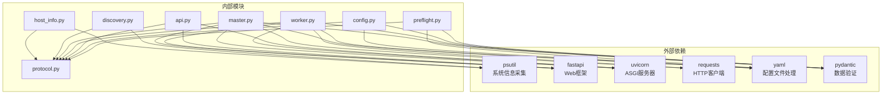

# 主机信息采集

<cite>
**本文档引用的文件**
- [host_info.py](file://lan_mesh/host_info.py)
- [discovery.py](file://lan_mesh/discovery.py)
- [protocol.py](file://lan_mesh/protocol.py)
- [master.py](file://lan_mesh/master.py)
- [worker.py](file://lan_mesh/worker.py)
- [api.py](file://lan_mesh/api.py)
- [config.py](file://lan_mesh/config.py)
- [preflight.py](file://lan_mesh/preflight.py)
- [collect_config.py](file://lan_mesh/collect_config.py)
- [main.py](file://main.py)
</cite>

## 目录
1. [简介](#简介)
2. [项目结构](#项目结构)
3. [核心组件](#核心组件)
4. [架构概览](#架构概览)
5. [详细组件分析](#详细组件分析)
6. [依赖关系分析](#依赖关系分析)
7. [性能考虑](#性能考虑)
8. [故障排除指南](#故障排除指南)
9. [结论](#结论)

## 简介

LAN Mesh 主机信息采集系统是一个基于 Python 的分布式网络发现和主机信息管理系统。该系统通过 UDP 广播发现局域网内的设备，自动采集各主机的 CPU、内存、磁盘、操作系统和网络接口等系统信息，并提供统一的 API 接口进行管理和监控。

系统采用 Master/Worker 架构，其中 Master 节点负责协调和管理，Worker 节点负责信息采集和任务执行。通过 discover.py 模块实现设备发现功能，host_info.py 模块负责系统信息采集，protocol.py 定义了数据传输协议和数据模型。

## 项目结构



**图表来源**
- [main.py:1-90](file://main.py#L1-L90)
- [master.py:1-324](file://lan_mesh/master.py#L1-L324)
- [worker.py:1-325](file://lan_mesh/worker.py#L1-L325)

**章节来源**
- [main.py:1-90](file://main.py#L1-L90)
- [config.py:1-84](file://lan_mesh/config.py#L1-L84)

## 核心组件

### 主机信息采集模块 (host_info.py)

host_info.py 是系统的核心信息采集模块，提供了完整的主机信息收集功能：

#### 设备ID生成机制
- 使用 UUID4 生成唯一设备标识符
- 支持 Master/Worker 角色分离，确保同一台机器上不同角色有不同的设备ID
- 设备ID持久化存储在用户主目录下的 `.lan_mesh` 目录中
- 通过 `load_or_create_device_id()` 函数实现设备ID的加载和创建

#### 系统信息采集函数
- `collect_host_info()`: 采集完整的主机配置信息
- `get_local_ipv4_addresses()`: 获取所有非回环 IPv4 地址
- `get_mac_address()`: 获取首个非虚拟网卡的 MAC 地址
- `get_broadcast_targets()`: 计算所有子网广播地址
- `get_disk_info()`: 获取指定挂载点的磁盘使用情况

#### 数据模型转换
- `make_discovery_packet()`: 将完整的 HostInfo 转换为 DiscoveryPacket
- 支持 JSON 序列化和反序列化

**章节来源**
- [host_info.py:19-212](file://lan_mesh/host_info.py#L19-L212)

### 设备发现服务 (discovery.py)

discovery.py 实现了基于 UDP 广播的设备发现功能：

#### 核心功能
- 定期 UDP 广播设备存在信息
- 监听其他设备的发现包
- TTL 超时清理机制
- 子网广播地址计算

#### 线程架构
- `presence_loop`: 定期广播自身存在
- `listen_loop`: 监听其他设备的 UDP 包
- `prune_loop`: 定期清理超时离线设备

#### 端口处理
- 支持端口绑定失败时的降级处理
- Linux/macOS 支持 SO_REUSEPORT 选项
- Windows 环境下的兼容性处理

**章节来源**
- [discovery.py:33-259](file://lan_mesh/discovery.py#L33-L259)

### 协议定义 (protocol.py)

protocol.py 定义了系统间通信的数据结构和协议规范：

#### 数据模型
- `DiscoveryPacket`: UDP 广播发现包
- `HostInfo`: 完整主机配置信息
- `HostRecord`: Master 端维护的主机记录
- `NetworkStatus`: 网络状态快照

#### 序列化机制
- 使用 dataclasses 实现自动序列化
- 支持 `to_dict()` 和 `from_dict()` 方法
- JSON 格式的网络传输

**章节来源**
- [protocol.py:29-111](file://lan_mesh/protocol.py#L29-L111)

## 架构概览



**图表来源**
- [master.py:257-283](file://lan_mesh/master.py#L257-L283)
- [worker.py:272-283](file://lan_mesh/worker.py#L272-L283)
- [discovery.py:139-215](file://lan_mesh/discovery.py#L139-L215)

## 详细组件分析

### 主机信息采集流程



**图表来源**
- [host_info.py:129-191](file://lan_mesh/host_info.py#L129-L191)

#### CPU信息采集
- 逻辑核心数：`psutil.cpu_count(logical=True)`
- 物理核心数：`psutil.cpu_count(logical=False)`
- CPU使用率：`psutil.cpu_percent(interval=0.5)`
- CPU频率：`psutil.cpu_freq()`

#### 内存信息采集
- 总内存：`psutil.virtual_memory().total`
- 可用内存：`psutil.virtual_memory().available`
- 内存使用率：`psutil.virtual_memory().percent`

#### 磁盘信息采集
- 根分区使用情况：`psutil.disk_usage("/")`
- 支持 GB 单位转换
- 异常处理机制

**章节来源**
- [host_info.py:143-191](file://lan_mesh/host_info.py#L143-L191)

### 网络接口筛选逻辑



**图表来源**
- [host_info.py:42-103](file://lan_mesh/host_info.py#L42-L103)

#### 接口筛选规则
- 跳过虚拟网络接口：`lo`, `docker`, `virbr`, `veth`, `br-`
- 跳过回环地址：以 `127.` 开头的 IPv4 地址
- 支持多种地址族：AF_INET (IPv4), AF_LINK (MAC)

#### 广播地址计算
- 基于 IP 地址和子网掩码计算
- 支持多网卡场景
- 生成 255.255.255.255 广播地址

**章节来源**
- [host_info.py:77-103](file://lan_mesh/host_info.py#L77-L103)

### DiscoveryPacket 数据结构设计



**图表来源**
- [protocol.py:29-111](file://lan_mesh/protocol.py#L29-L111)

#### 序列化机制
- 使用 dataclasses 自动生成序列化方法
- `to_dict()`: 将对象转换为字典
- `from_dict()`: 从字典创建对象实例
- JSON 格式在网络传输中的应用

#### 协议版本控制
- 应用名称：`lan-mesh`
- 协议版本：`1`
- 版本验证：`is_lanmesh()` 方法

**章节来源**
- [protocol.py:55-65](file://lan_mesh/protocol.py#L55-L65)

### Master/Worker 架构实现

```mermaid
graph TB
subgraph "Master节点"
M1[MasterController]
M2[DiscoveryService]
M3[FastAPI应用]
M4[SQLite数据库]
end
subgraph "Worker节点"
W1[WorkerAgent]
W2[DiscoveryService]
W3[FastAPI应用]
W4[共享文件夹]
end
subgraph "公共组件"
C1[HostInfo采集]
C2[DiscoveryPacket]
C3[配置管理]
end
M1 --> M2
M1 --> M3
M1 --> M4
M1 --> C1
M1 --> C2
M1 --> C3
W1 --> W2
W1 --> W3
W1 --> W4
W1 --> C1
W1 --> C2
W1 --> C3
M2 < --> W2 : UDP广播
M3 < --> W3 : HTTP通信
```

**图表来源**
- [master.py:67-114](file://lan_mesh/master.py#L67-L114)
- [worker.py:62-97](file://lan_mesh/worker.py#L62-L97)

#### Master节点职责
- 自动创建共享文件夹
- 启动 UDP 广播发现
- 接收 Worker HTTP 注册与心跳
- 持久化主机信息到 SQLite
- 提供 Web UI 仪表盘

#### Worker节点职责
- 自动创建并暴露共享文件夹
- 通过 UDP 发现 Master 节点
- 通过 HTTP 向 Master 注册并发送心跳
- 提供 HTTP API 供 Master 查询与文件下载

**章节来源**
- [master.py:67-114](file://lan_mesh/master.py#L67-L114)
- [worker.py:62-97](file://lan_mesh/worker.py#L62-L97)

## 依赖关系分析



**图表来源**
- [preflight.py:57-73](file://lan_mesh/preflight.py#L57-L73)
- [master.py:32-45](file://lan_mesh/master.py#L32-L45)
- [worker.py:28-44](file://lan_mesh/worker.py#L28-L44)

### 系统兼容性处理

#### Windows 平台特性
- 端口绑定降级：Windows 不支持 SO_REUSEPORT 选项
- 网络接口识别：使用不同的虚拟接口前缀
- 文件系统路径：支持 Windows 路径格式

#### Linux/macOS 平台特性
- SO_REUSEPORT 支持：允许端口复用
- lspci 命令：用于 GPU 信息检测
- 系统负载均值：支持 getloadavg() 函数

#### 跨平台一致性
- psutil 库提供统一的系统信息接口
- 网络接口筛选逻辑适配不同平台的虚拟接口命名
- 文件路径处理使用 pathlib 提供跨平台支持

**章节来源**
- [discovery.py:163-174](file://lan_mesh/discovery.py#L163-L174)
- [collect_config.py:146-154](file://lan_mesh/collect_config.py#L146-L154)

## 性能考虑

### 信息采集优化
- CPU 使用率采样：使用短间隔避免阻塞
- 磁盘信息缓存：减少频繁的系统调用
- 网络接口遍历：使用集合去重避免重复计算

### 网络通信优化
- UDP 广播：高效的设备发现机制
- 心跳间隔：平衡实时性和网络负载
- TTL 超时：及时清理离线设备

### 内存管理
- 数据类序列化：高效的内存使用
- 异常处理：避免内存泄漏
- 资源清理：线程安全的资源释放

## 故障排除指南

### 启动前自检
系统提供全面的启动前自检功能，包括：
- Python 版本检查（≥ 3.10）
- 依赖包完整性检查
- 配置文件存在性检查
- 数据目录可写性检查
- 网络接口可用性检查
- 端口绑定测试

### 常见问题诊断

#### 设备ID生成失败
- 检查用户主目录写权限
- 确认 .lan_mesh 目录可创建
- 验证 UUID 生成函数可用性

#### 网络发现失败
- 检查 UDP 端口 45454 可用性
- 验证防火墙设置允许 UDP 广播
- 确认网络接口正常工作

#### API 服务启动失败
- 检查 HTTP API 端口可用性
- 验证 FastAPI 和 Uvicorn 安装
- 确认共享文件夹路径正确

**章节来源**
- [preflight.py:226-290](file://lan_mesh/preflight.py#L226-L290)

## 结论

LAN Mesh 主机信息采集系统提供了一个完整、可靠的分布式网络发现和主机信息管理解决方案。系统通过精心设计的数据模型、高效的网络通信机制和完善的错误处理策略，实现了跨平台的稳定运行。

主要特点包括：
- 基于 UDP 广播的高效设备发现
- 完整的主机信息采集和序列化
- Master/Worker 架构的清晰分工
- 全面的启动前自检和故障诊断
- 良好的跨平台兼容性

该系统为后续的任务编排、项目管理和 MCP 工具集成奠定了坚实的基础，是构建分布式计算环境的理想选择。