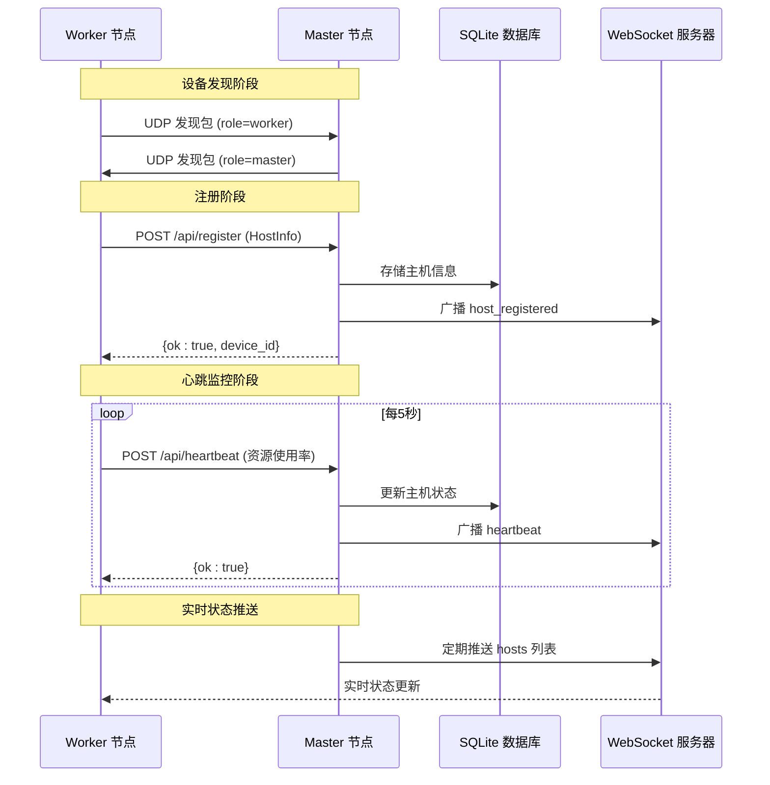
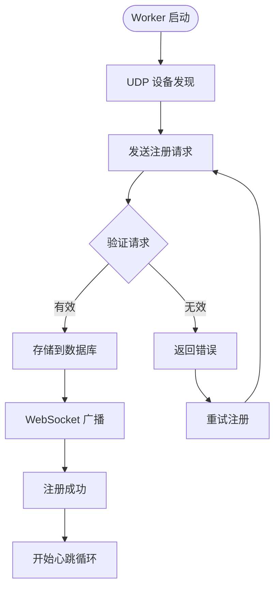
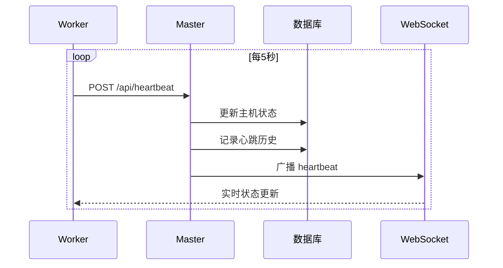
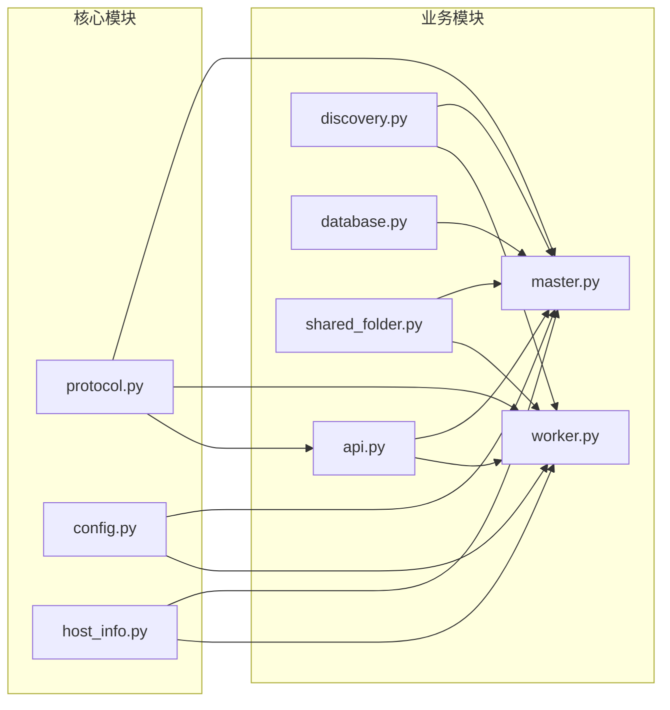

# HTTP API 通信协议

<cite>
**本文引用的文件**
- [api.py](file://lan_mesh/api.py)
- [master.py](file://lan_mesh/master.py)
- [worker.py](file://lan_mesh/worker.py)
- [protocol.py](file://lan_mesh/protocol.py)
- [host_info.py](file://lan_mesh/host_info.py)
- [config.py](file://lan_mesh/config.py)
- [discovery.py](file://lan_mesh/discovery.py)
- [database.py](file://lan_mesh/database.py)
- [shared_folder.py](file://lan_mesh/shared_folder.py)
- [dashboard.html](file://lan_mesh/web/templates/dashboard.html)
- [config.yaml](file://config.yaml)
</cite>

## 目录
1. [简介](#简介)
2. [项目结构](#项目结构)
3. [核心组件](#核心组件)
4. [架构概览](#架构概览)
5. [详细组件分析](#详细组件分析)
6. [依赖关系分析](#依赖关系分析)
7. [性能考虑](#性能考虑)
8. [故障排除指南](#故障排除指南)
9. [结论](#结论)
10. [附录](#附录)

## 简介
本文档详细说明了 LAN Mesh 分布式系统中 Worker 与 Master 之间的 HTTP API 通信协议。系统采用 Master/Worker 架构，通过 RESTful API 实现设备发现、注册、心跳监控和状态同步。文档涵盖完整的 API 流程、数据模型定义、端口分配策略、超时机制以及错误处理方案。

## 项目结构
系统主要由以下模块组成：
- **API 层**：提供 RESTful API 接口和 WebSocket 实时推送
- **控制器层**：MasterController 和 WorkerAgent 负责业务逻辑
- **协议层**：定义数据模型和通信协议常量
- **发现层**：基于 UDP 的设备发现服务
- **存储层**：SQLite 数据库持久化
- **共享层**：文件共享和配置报告生成

```mermaid
graph TB
subgraph "客户端"
UI[Web UI]
CLI[命令行工具]
end
subgraph "Master 节点"
M_API[Master API]
M_WS[WebSocket 服务器]
M_DB[SQLite 数据库]
M_DISC[发现服务]
end
subgraph "Worker 节点"
W_API[Worker API]
W_DISC[发现服务]
W_SHARE[共享文件夹]
end
UI --> M_API
CLI --> M_API
M_API --> M_DB
M_API --> M_WS
M_API --> M_DISC
W_API --> W_DISC
W_API --> W_SHARE
M_DISC --> W_DISC
M_API <- --> W_API
```

**图表来源**
- [master.py:187-324](file://lan_mesh/master.py#L187-L324)
- [worker.py:219-325](file://lan_mesh/worker.py#L219-L325)
- [api.py:37-526](file://lan_mesh/api.py#L37-L526)

## 核心组件

### 端口分配策略
系统采用固定端口分配策略：
- **WORKER_API_PORT = 45460**：Worker HTTP API 端口
- **MASTER_API_PORT = 45470**：Master HTTP API + Web UI 端口
- **DISCOVERY_PORT = 45454**：UDP 发现端口

端口分配遵循以下规则：
1. Worker 启动时尝试使用配置的端口（默认 45460）
2. 若端口被占用，系统自动寻找可用端口（范围：配置端口 ± 20）
3. Master 启动时同样进行端口检测和选择
4. 端口选择过程避免与其他服务冲突

**章节来源**
- [protocol.py:17-25](file://lan_mesh/protocol.py#L17-L25)
- [config.py:21-34](file://lan_mesh/config.py#L21-L34)
- [master.py:225-234](file://lan_mesh/master.py#L225-L234)
- [worker.py:240-249](file://lan_mesh/worker.py#L240-L249)

### 时间常量与超时机制
系统定义了关键的时间间隔常量：
- **PRESENCE_INTERVAL_SECS = 3**：UDP 存在广播间隔
- **HEARTBEAT_INTERVAL_SECS = 5**：HTTP 心跳间隔
- **DEVICE_TTL_SECS = 12**：设备离线判定阈值
- **PRUNE_INTERVAL_SECS = 5**：离线清理检查间隔

超时机制实现：
1. **HTTP 请求超时**：Worker 向 Master 发送注册和心跳时设置 5 秒超时
2. **WebSocket 心跳**：Master 侧 WebSocket 设置 30 秒超时
3. **心跳检测**：Master 通过 DEVICE_TTL_SECS 判断设备是否离线
4. **自动重连**：Web UI 的 WebSocket 断线后每 3 秒自动重连

**章节来源**
- [protocol.py:21-24](file://lan_mesh/protocol.py#L21-L24)
- [worker.py:137](file://lan_mesh/worker.py#L137)
- [worker.py:190](file://lan_mesh/worker.py#L190)
- [api.py:516](file://lan_mesh/api.py#L516)
- [dashboard.html:196-208](file://lan_mesh/web/templates/dashboard.html#L196-L208)

## 架构概览
系统采用 Master/Worker 分布式架构，通过 HTTP RESTful API 和 WebSocket 实现实时通信。



**图表来源**
- [worker.py:126-146](file://lan_mesh/worker.py#L126-L146)
- [worker.py:172-194](file://lan_mesh/worker.py#L172-L194)
- [api.py:116-168](file://lan_mesh/api.py#L116-L168)
- [api.py:500-525](file://lan_mesh/api.py#L500-L525)

## 详细组件分析

### HostInfo 数据模型
HostInfo 是系统的核心数据模型，承载完整的主机配置信息。

#### 字段定义与用途

**基础信息字段**
- `device_id`: 设备唯一标识符（UUID）
- `device_name`: 设备显示名称
- `role`: 设备角色（master/worker）
- `hostname`: 主机名
- `platform`: 操作系统类型
- `platform_release`: 操作系统版本
- `architecture`: 系统架构
- `python_version`: Python 版本

**CPU 性能指标**
- `cpu_count`: 逻辑 CPU 核心数
- `cpu_percent`: CPU 使用率百分比
- `cpu_freq_mhz`: CPU 主频（MHz）

**内存性能指标**
- `memory_total_mb`: 总内存大小（MB）
- `memory_available_mb`: 可用内存大小（MB）
- `memory_percent`: 内存使用率百分比

**磁盘性能指标**
- `disk_total_gb`: 磁盘总容量（GB）
- `disk_used_gb`: 已用磁盘空间（GB）
- `disk_free_gb`: 可用磁盘空间（GB）
- `disk_percent`: 磁盘使用率百分比

**网络配置**
- `ip_addresses`: 本地 IPv4 地址列表
- `mac_address`: MAC 地址

**共享配置**
- `shared_folder`: 共享文件夹路径
- `shared_file_count`: 共享文件数量

**运行时状态**
- `api_port`: HTTP API 端口号
- `uptime_seconds`: 系统运行时长（秒）
- `timestamp`: 最近更新时间戳

#### 数据模型复杂度分析
- **序列化复杂度**: O(n)，其中 n 为字段数量（约 20 个字段）
- **内存占用**: 约 1-2KB（取决于字段值长度）
- **网络传输**: JSON 编码后约 2-4KB

**章节来源**
- [protocol.py:69-111](file://lan_mesh/protocol.py#L69-L111)
- [host_info.py:129-191](file://lan_mesh/host_info.py#L129-L191)

### Worker 与 Master 通信流程

#### 注册流程
1. **设备发现**：Worker 通过 UDP 广播发现包，Master 接收并识别
2. **注册请求**：Worker 发送 HTTP POST /api/register，包含完整 HostInfo
3. **数据库存储**：Master 将 HostInfo 转换为 HostRecord 存储到 SQLite
4. **状态同步**：通过 WebSocket 广播注册事件
5. **Agent 注册**：Worker 同步注册 Agent Card



**图表来源**
- [worker.py:126-146](file://lan_mesh/worker.py#L126-L146)
- [api.py:116-146](file://lan_mesh/api.py#L116-L146)

#### 心跳监控流程
1. **周期性发送**：Worker 每 5 秒发送一次心跳
2. **状态更新**：Master 更新数据库中的实时状态
3. **历史记录**：记录心跳历史用于性能分析
4. **状态广播**：通过 WebSocket 推送实时状态



**图表来源**
- [worker.py:172-194](file://lan_mesh/worker.py#L172-L194)
- [api.py:148-168](file://lan_mesh/api.py#L148-L168)

**章节来源**
- [worker.py:126-215](file://lan_mesh/worker.py#L126-L215)
- [api.py:116-168](file://lan_mesh/api.py#L116-L168)

### API 端点定义

#### Worker API 端点
- `GET /info`：返回本机完整配置信息
- `GET /shared`：列出共享文件
- `GET /shared/{path}`：下载共享文件
- `POST /shared`：上传文件到共享目录
- `POST /tasks/execute`：执行 Master 分发的任务

#### Master API 端点
- `POST /api/register`：Worker 注册（接收完整 HostInfo）
- `POST /api/heartbeat`：Worker 心跳（实时资源使用率）
- `GET /api/hosts`：所有主机列表
- `GET /api/hosts/{id}`：单台主机详情
- `GET /api/network`：本机网络状态
- `POST /api/probe/{ip}`：主动探测指定IP
- `GET /api/discovery`：UDP 发现到的设备列表
- `GET /api/health`：健康检查
- `GET /api/master-info`：返回 Master 自身的主机信息

**章节来源**
- [api.py:4-18](file://lan_mesh/api.py#L4-L18)
- [api.py:116-255](file://lan_mesh/api.py#L116-L255)

### 错误处理与重试策略

#### HTTP 错误处理
系统实现了完善的错误处理机制：

**注册阶段错误**
- 设备未找到：返回 404 Not Found
- 注册失败：返回 500 Internal Server Error
- 网络异常：返回 503 Service Unavailable

**心跳阶段错误**
- 设备未注册：返回 404 Not Found
- 心跳超时：返回 504 Gateway Timeout
- 数据库异常：返回 500 Internal Server Error

**文件操作错误**
- 文件不存在：返回 404 Not Found
- 权限不足：返回 403 Forbidden
- 路径越界：返回 400 Bad Request

#### 重试策略
1. **自动重试**：Worker 心跳失败时自动重新注册
2. **指数退避**：重试间隔按 2^n 增长（最大 32 秒）
3. **最大重试次数**：单次操作最多重试 5 次
4. **超时控制**：所有 HTTP 请求设置 5 秒超时

**章节来源**
- [api.py:83-84](file://lan_mesh/api.py#L83-L84)
- [worker.py:144-146](file://lan_mesh/worker.py#L144-L146)
- [worker.py:212-214](file://lan_mesh/worker.py#L212-L214)

## 依赖关系分析

### 组件耦合度分析
系统采用松耦合设计，各组件间通过明确定义的接口交互：



**图表来源**
- [master.py:32-45](file://lan_mesh/master.py#L32-L45)
- [worker.py:28-44](file://lan_mesh/worker.py#L28-L44)
- [api.py:33-34](file://lan_mesh/api.py#L33-L34)

### 外部依赖
系统依赖的关键外部库：
- **FastAPI**：高性能 Web 框架
- **uvicorn**：ASGI 服务器
- **psutil**：系统信息收集
- **requests**：HTTP 客户端
- **sqlite3**：本地数据库

**章节来源**
- [master.py:27-45](file://lan_mesh/master.py#L27-L45)
- [worker.py:24-44](file://lan_mesh/worker.py#L24-L44)

## 性能考虑

### 端口选择优化
- **端口范围**：系统在配置端口基础上扩展 ±20 的搜索范围
- **并发检测**：使用 socket 绑定测试端口可用性
- **回退策略**：端口冲突时自动选择下一个可用端口

### 心跳频率优化
- **平衡策略**：5 秒心跳频率在实时性和性能间取得平衡
- **批量更新**：多个 Worker 的状态更新合并处理
- **索引优化**：数据库为常用查询字段建立索引

### 内存管理
- **对象池**：频繁创建的数据模型使用对象池减少 GC 压力
- **延迟加载**：大型数据结构采用延迟加载策略
- **缓存机制**：热点数据在内存中缓存

## 故障排除指南

### 常见问题诊断

**设备无法发现**
1. 检查 UDP 端口 45454 是否被防火墙阻止
2. 验证网络广播功能是否正常
3. 确认设备在同一子网内

**注册失败**
1. 检查 Master 服务是否正常运行
2. 验证端口 45470 是否可用
3. 查看 Master 日志中的异常信息

**心跳中断**
1. 检查网络连接稳定性
2. 验证 Worker 的 5 秒超时设置
3. 确认 Master 数据库连接正常

**WebSocket 连接问题**
1. 检查浏览器 WebSocket 支持
2. 验证端口转发配置
3. 查看断线重连日志

### 调试工具
系统提供了多种调试工具：
- **健康检查端点**：`/api/health` 返回系统状态
- **网络状态端点**：`/api/network` 显示网络配置
- **发现状态端点**：`/api/discovery` 显示发现的设备列表
- **实时日志**：Web UI 实时显示系统状态变化

**章节来源**
- [api.py:242-250](file://lan_mesh/api.py#L242-L250)
- [api.py:217-234](file://lan_mesh/api.py#L217-L234)
- [dashboard.html:196-208](file://lan_mesh/web/templates/dashboard.html#L196-L208)

## 结论
LAN Mesh 的 HTTP API 通信协议设计合理，实现了高效的分布式设备管理和状态同步。系统通过明确的端口分配策略、可靠的心跳机制和完善的错误处理，确保了在复杂网络环境下的稳定运行。数据模型设计全面覆盖了现代计算设备的性能指标，为后续的功能扩展奠定了坚实基础。

## 附录

### API 调用示例

#### 注册请求示例
```bash
curl -X POST "http://MASTER_IP:45470/api/register" \
  -H "Content-Type: application/json" \
  -d '{
    "device_id": "unique-device-id",
    "device_name": "worker-node-01",
    "role": "worker",
    "hostname": "worker01.example.com",
    "platform": "Linux",
    "cpu_count": 8,
    "cpu_percent": 15.5,
    "memory_total_mb": 16384,
    "memory_percent": 25.3,
    "disk_total_gb": 500,
    "disk_percent": 30.1,
    "ip_addresses": ["192.168.1.100"],
    "api_port": 45460,
    "timestamp": 1699123456.789
  }'
```

#### 心跳请求示例
```bash
curl -X POST "http://MASTER_IP:45470/api/heartbeat" \
  -H "Content-Type: application/json" \
  -d '{
    "device_id": "unique-device-id",
    "cpu_percent": 12.3,
    "memory_percent": 22.1,
    "disk_percent": 28.7,
    "shared_file_count": 42
  }'
```

#### 获取主机列表
```bash
curl "http://MASTER_IP:45470/api/hosts"
```

### 配置文件示例
```yaml
# LAN Mesh 配置文件
discovery:
  port: 45454
  presence_interval: 3
  device_ttl: 12

worker:
  api_port: 45460
  shared_folder: ~/lan_mesh_shared
  device_name: ""

master:
  api_port: 45470
  shared_folder: ~/lan_mesh_shared
  device_name: ""
  db_path: ~/.lan_mesh/master.sqlite3
```