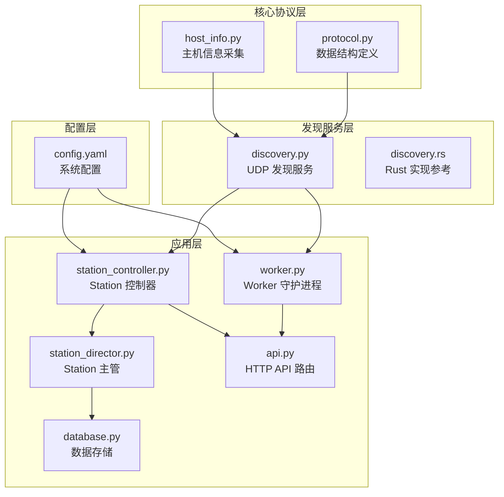
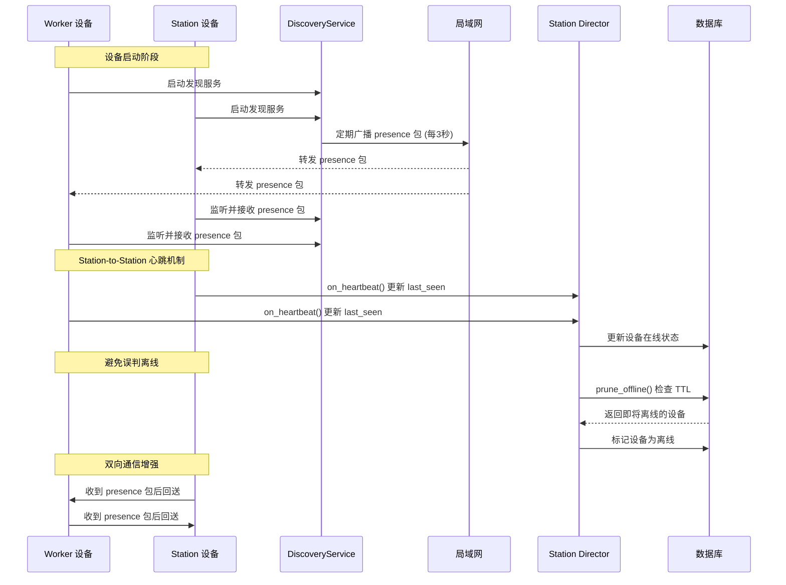
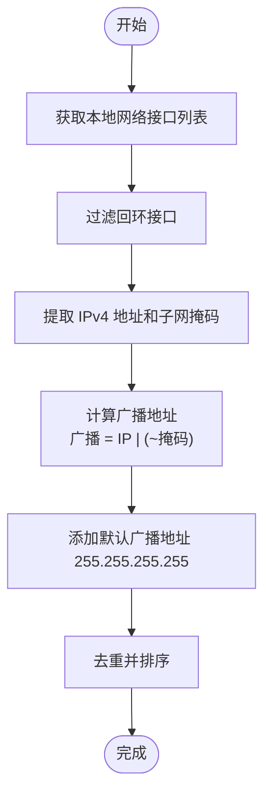
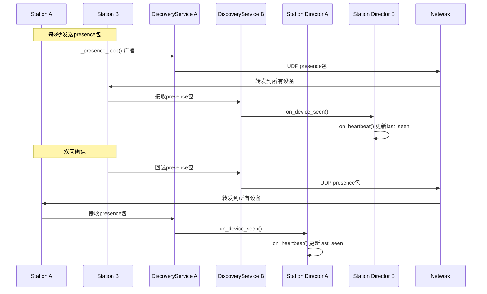
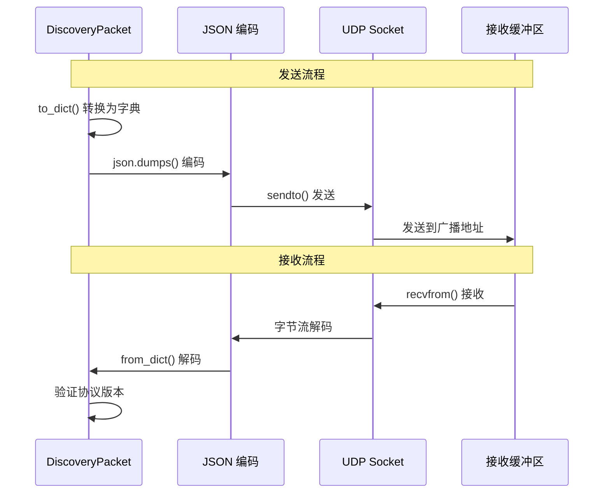
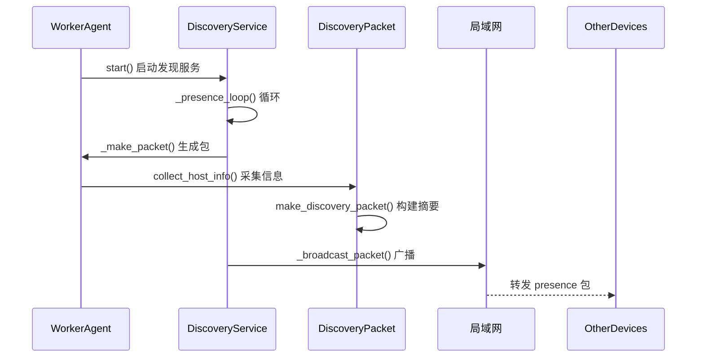
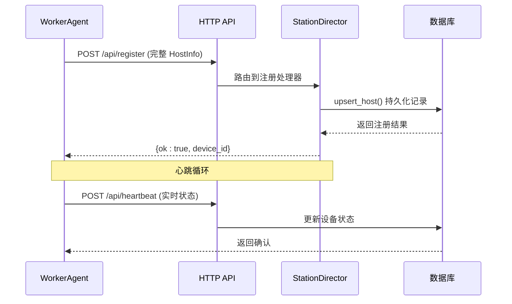
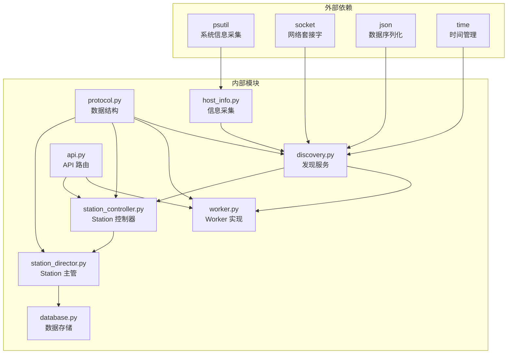

# UDP 广播发现协议

<cite>
**本文档引用的文件**
- [discovery.py](file://lan_mesh/discovery.py)
- [protocol.py](file://lan_mesh/protocol.py)
- [host_info.py](file://lan_mesh/host_info.py)
- [worker.py](file://lan_mesh/worker.py)
- [station_controller.py](file://lan_mesh/station_controller.py)
- [station_director.py](file://lan_mesh/station_director.py)
- [database.py](file://lan_mesh/database.py)
- [api.py](file://lan_mesh/api.py)
- [config.yaml](file://config.yaml)
- [discovery.rs](file://quicklan-main/src-tauri/src/discovery.rs)
- [protocol.rs](file://quicklan-main/src-tauri/src/protocol.rs)
</cite>

## 更新摘要
**变更内容**
- 更新了UDP广播发现协议的双重角色说明 - 不仅是设备发现机制，还作为Station节点间的轻量级心跳系统
- 新增了Station-to-Station通信可靠性增强的详细说明
- 更新了presence包在避免prune_offline误判中的作用机制
- 增强了Station节点间互相发现的架构描述

## 目录
1. [简介](#简介)
2. [项目结构](#项目结构)
3. [核心组件](#核心组件)
4. [架构概览](#架构概览)
5. [详细组件分析](#详细组件分析)
6. [依赖关系分析](#依赖关系分析)
7. [性能考虑](#性能考虑)
8. [故障排除指南](#故障排除指南)
9. [结论](#结论)
10. [附录](#附录)

## 简介
本文档详细介绍了基于 UDP 广播的局域网设备发现协议，该协议现已承担双重角色：既是设备发现机制，也是Station节点间的轻量级心跳系统。通过每3秒的UDP presence包维持设备在线状态，有效避免了prune_offline函数误判Station节点离线的问题，显著增强了Station-to-Station通信的可靠性。

协议采用 Master/Worker/Station 混合架构，通过 UDP 广播实现设备发现和注册，结合 HTTP API 实现心跳和状态同步。DiscoveryPacket 数据结构承载设备身份信息和配置摘要，支持 presence 和 register 两种包类型以满足不同的通信需求。

## 项目结构
LAN Mesh 项目采用模块化设计，主要包含以下核心模块：

**图表来源**
- [discovery.py:1-259](file://lan_mesh/discovery.py#L1-L259)
- [protocol.py:1-562](file://lan_mesh/protocol.py#L1-L562)
- [worker.py:1-593](file://lan_mesh/worker.py#L1-L593)
- [station_controller.py:1-555](file://lan_mesh/station_controller.py#L1-L555)
- [station_director.py:1-232](file://lan_mesh/station_director.py#L1-L232)
- [database.py:360-380](file://lan_mesh/database.py#L360-L380)

**章节来源**
- [discovery.py:1-259](file://lan_mesh/discovery.py#L1-L259)
- [protocol.py:1-562](file://lan_mesh/protocol.py#L1-L562)
- [config.yaml:1-22](file://config.yaml#L1-L22)

## 核心组件

### DiscoveryPacket 数据结构
DiscoveryPacket 是 UDP 广播发现协议的核心数据结构，承载设备身份信息和配置摘要。

#### 字段定义
| 字段名 | 类型 | 必填 | 默认值 | 描述 |
|--------|------|------|--------|------|
| app | string | 是 | "lan-mesh" | 应用标识符 |
| version | int | 是 | 1 | 协议版本号 |
| packet_type | string | 是 | "presence" | 包类型：presence 或 register |
| device_id | string | 是 | "" | 设备唯一标识符 |
| device_name | string | 是 | "" | 设备显示名称 |
| role | string | 是 | "worker" | 设备角色：master、worker 或 station |
| api_port | int | 是 | 0 | HTTP API 端口号 |
| hostname | string | 否 | "" | 主机名 |
| platform | string | 否 | "" | 操作系统平台 |
| cpu_count | int | 否 | 0 | CPU 核心数 |
| cpu_percent | float | 否 | 0.0 | CPU 使用率百分比 |
| memory_total_mb | int | 否 | 0 | 总内存大小(MB) |
| memory_percent | float | 否 | 0.0 | 内存使用率百分比 |
| disk_total_gb | int | 否 | 0 | 总磁盘大小(GB) |
| disk_percent | float | 否 | 0.0 | 磁盘使用率百分比 |
| shared_folder | string | 否 | "" | 共享文件夹路径 |
| ip_addresses | list | 否 | [] | 本地 IPv4 地址列表 |

#### 包类型说明
- **presence**: 设备存在证明包，定期广播用于宣告设备在线状态，现在也作为Station节点间的轻量级心跳信号
- **register**: 设备注册包，用于向 Master 注册设备信息（在当前实现中主要用于 HTTP 注册流程）

**章节来源**
- [protocol.py:29-65](file://lan_mesh/protocol.py#L29-L65)
- [protocol.py:36-56](file://lan_mesh/protocol.py#L36-L56)

### DiscoveryService 核心功能
DiscoveryService 是 UDP 广播发现服务的核心实现，负责以下功能：

1. **定期广播**: 每隔 PRESENCE_INTERVAL_SECS 秒广播一次设备存在证明
2. **监听接收**: 监听来自其他设备的 UDP 包并更新设备列表
3. **TTL 清理**: 定期清理超过 DEVICE_TTL_SECS 未收到的心跳的设备
4. **网络状态**: 提供本机网络状态查询功能
5. **双向通信**: 收到对方包后回送 presence 包，确保双方都能感知彼此存在

**章节来源**
- [discovery.py:33-136](file://lan_mesh/discovery.py#L33-L136)
- [discovery.py:139-228](file://lan_mesh/discovery.py#L139-L228)

## 架构概览

**图表来源**
- [worker.py:536-547](file://lan_mesh/worker.py#L536-L547)
- [station_controller.py:479-491](file://lan_mesh/station_controller.py#L479-L491)
- [station_controller.py:297-350](file://lan_mesh/station_controller.py#L297-L350)
- [station_director.py:151-159](file://lan_mesh/station_director.py#L151-L159)
- [database.py:365-380](file://lan_mesh/database.py#L365-L380)

## 详细组件分析

### UDP 广播机制实现

#### 端口配置
- **发现端口**: 45454 (与 QuickLAN 保持一致)
- **Worker API 端口**: 45460 起始端口
- **Station API 端口**: 45470 起始端口

#### 广播地址选择
系统通过枚举本地网络接口来确定广播目标地址：

**图表来源**
- [host_info.py:77-103](file://lan_mesh/host_info.py#L77-L103)

#### 网络接口枚举
系统使用 psutil 库枚举网络接口，支持多网卡环境：

- **过滤规则**: 排除回环接口、Docker、虚拟网卡等
- **地址类型**: 仅处理 IPv4 地址
- **MAC 地址**: 通过 psutil.AF_LINK 跨平台获取

**章节来源**
- [host_info.py:42-103](file://lan_mesh/host_info.py#L42-L103)

### Station-to-Station 心跳机制

**新增** UDP广播发现协议现在承担双重角色，不仅用于设备发现，还作为Station节点间的轻量级心跳系统。

#### 心跳工作流程

**图表来源**
- [station_controller.py:297-350](file://lan_mesh/station_controller.py#L297-L350)
- [station_controller.py:371-382](file://lan_mesh/station_controller.py#L371-L382)
- [station_director.py:112-147](file://lan_mesh/station_director.py#L112-L147)

#### 避免误判离线的机制
Station节点通过UDP presence包每3秒更新彼此的last_seen时间戳，有效防止prune_offline函数误判：

1. **轻量级心跳**: UDP presence包携带CPU、内存、磁盘使用率等实时指标
2. **自动注册**: 首次发现时自动将设备注册到数据库
3. **持续更新**: 后续presence包仅更新last_seen和IP地址
4. **TTL保护**: 12秒的TTL设置确保在网络波动时不会立即标记离线

**章节来源**
- [station_controller.py:297-350](file://lan_mesh/station_controller.py#L297-L350)
- [station_director.py:151-159](file://lan_mesh/station_director.py#L151-L159)
- [database.py:365-380](file://lan_mesh/database.py#L365-L380)

### 数据包序列化和反序列化

#### Python 实现

**图表来源**
- [protocol.py:58-64](file://lan_mesh/protocol.py#L58-L64)
- [discovery.py:231-253](file://lan_mesh/discovery.py#L231-L253)

#### Rust 实现参考
QuickLAN 项目提供了 Rust 版本的实现作为参考：

- **序列化**: 使用 serde_json::to_vec 进行二进制编码
- **广播**: 通过 get_if_addrs 库获取网络接口信息
- **协议验证**: 通过 is_quicklan() 方法验证应用标识

**章节来源**
- [discovery.rs:289-311](file://quicklan-main/src-tauri/src/discovery.rs#L289-L311)
- [protocol.rs:11-30](file://quicklan-main/src-tauri/src/protocol.rs#L11-L30)

### Worker 如何发送存在证明和注册请求

#### 存在证明发送流程

**图表来源**
- [worker.py:120-124](file://lan_mesh/worker.py#L120-L124)
- [worker.py:536-547](file://lan_mesh/worker.py#L536-L547)
- [discovery.py:139-146](file://lan_mesh/discovery.py#L139-L146)

#### 注册请求处理流程

**图表来源**
- [worker.py:136-158](file://lan_mesh/worker.py#L136-L158)
- [api.py:116-146](file://lan_mesh/api.py#L116-L146)

**章节来源**
- [worker.py:120-158](file://lan_mesh/worker.py#L120-L158)
- [api.py:116-168](file://lan_mesh/api.py#L116-L168)

## 依赖关系分析

**图表来源**
- [discovery.py:13-30](file://lan_mesh/discovery.py#L13-L30)
- [host_info.py:6-16](file://lan_mesh/host_info.py#L6-L16)
- [station_controller.py:35-49](file://lan_mesh/station_controller.py#L35-L49)

**章节来源**
- [discovery.py:13-30](file://lan_mesh/discovery.py#L13-L30)
- [host_info.py:6-16](file://lan_mesh/host_info.py#L6-L16)

## 性能考虑

### 广播频率优化
- **存在证明间隔**: 默认 3 秒，平衡网络负载和响应速度
- **TTL 设置**: 12 秒，确保设备离线检测的准确性
- **清理间隔**: 5 秒，定期清理超时设备

### 网络效率
- **多网卡支持**: 自动识别多个网络接口，避免重复广播
- **广播地址去重**: 对计算出的广播地址进行去重处理
- **错误容忍**: 广播过程中忽略单个目标的发送错误
- **双向通信**: 收到对方包后立即回送，确保双方都能感知彼此存在

### 资源管理
- **线程安全**: 使用 RLock 保护设备列表访问
- **内存管理**: 定期清理超时设备，防止内存泄漏
- **端口复用**: 支持 SO_REUSEPORT 选项提高端口复用性

### Station-to-Station 通信优化
- **轻量级心跳**: UDP presence包仅携带必要的心跳信息
- **自动注册**: 首次发现时自动注册，减少手动配置
- **增量更新**: 后续包仅更新last_seen，降低网络开销
- **容错机制**: 网络波动时不会立即标记设备离线

## 故障排除指南

### 常见问题及解决方案

#### 端口占用问题
**症状**: UDP 绑定失败，发现服务降级运行
**原因**: 端口 45454 被其他程序占用
**解决方案**: 
1. 检查端口占用情况
2. 修改配置文件中的 discovery.port
3. 重启占用程序

#### 网络接口识别问题
**症状**: 设备无法被其他设备发现
**原因**: 网络接口枚举失败或过滤规则过于严格
**解决方案**:
1. 检查网络连接状态
2. 验证防火墙设置
3. 确认 psutil 库正常工作

#### Station节点误判离线
**症状**: Station节点频繁显示离线状态
**原因**: TTL 设置过短或网络延迟过高
**解决方案**:
1. 调整 DEVICE_TTL_SECS 参数
2. 检查网络稳定性
3. 增加 presence_interval
4. 确认UDP广播包正常收发

#### Station-to-Station通信问题
**症状**: Station节点间无法互相发现
**原因**: 防火墙阻止UDP广播或网络隔离
**解决方案**:
1. 检查防火墙UDP 45454端口设置
2. 确认网络设备允许广播流量
3. 验证同一子网内的连通性
4. 检查各Station节点的日志输出

**章节来源**
- [discovery.py:159-174](file://lan_mesh/discovery.py#L159-L174)
- [discovery.py:221-227](file://lan_mesh/discovery.py#L221-L227)
- [station_controller.py:384-391](file://lan_mesh/station_controller.py#L384-L391)

## 结论
LAN Mesh 的 UDP 广播发现协议通过简洁而有效的设计实现了高效的局域网设备发现，现已发展为支持双重角色的综合通信机制：

1. **双重角色设计**: 既是设备发现机制，也是Station节点间的轻量级心跳系统
2. **增强的可靠性**: 每3秒的UDP presence包有效避免prune_offline函数误判Station节点离线
3. **双向通信**: 收到对方包后立即回送，确保双方都能感知彼此存在
4. **自动注册机制**: 首次发现时自动注册，后续仅更新心跳状态
5. **简洁的数据结构**: DiscoveryPacket 将设备身份和配置摘要封装在一个消息中
6. **可靠的广播机制**: 支持多网卡环境，自动计算广播地址
7. **完善的生命周期管理**: 包括设备发现、注册、心跳和离线清理

该协议为后续的功能扩展（如任务调度、文件传输等）奠定了坚实的基础，同时保持了良好的性能和可靠性，特别是在Station-to-Station通信方面提供了显著的增强。

## 附录

### 配置参数说明

| 参数名 | 默认值 | 描述 |
|--------|--------|------|
| discovery.port | 45454 | UDP 广播端口 |
| discovery.presence_interval | 3 | 存在证明广播间隔(秒) |
| discovery.device_ttl | 12 | 设备离线判定阈值(秒) |
| worker.api_port | 45460 | Worker HTTP API 端口起始值 |
| secretary.api_port | 45470 | Secretary/Station HTTP API 端口起始值 |

### 协议版本兼容性
- **应用标识**: "lan-mesh"
- **协议版本**: 1
- **包类型**: presence, register
- **数据格式**: JSON

### Station-to-Station 通信特性
- **心跳频率**: 每3秒发送一次UDP presence包
- **TTL保护**: 12秒内未收到心跳才标记离线
- **自动注册**: 首次发现时自动注册到数据库
- **增量更新**: 后续包仅更新last_seen和实时指标
- **双向确认**: 收到包后立即回送，确保双向通信