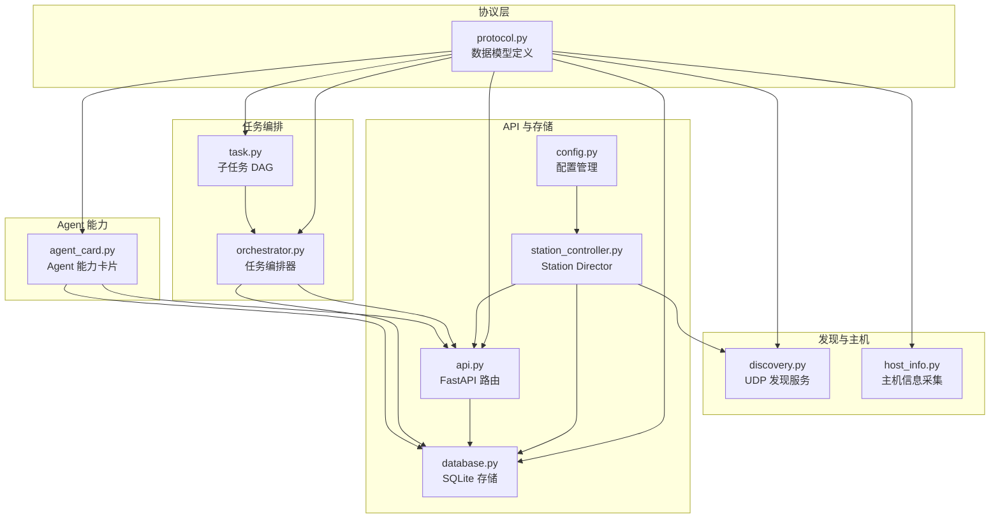
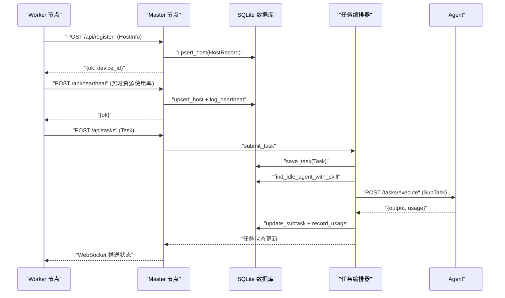
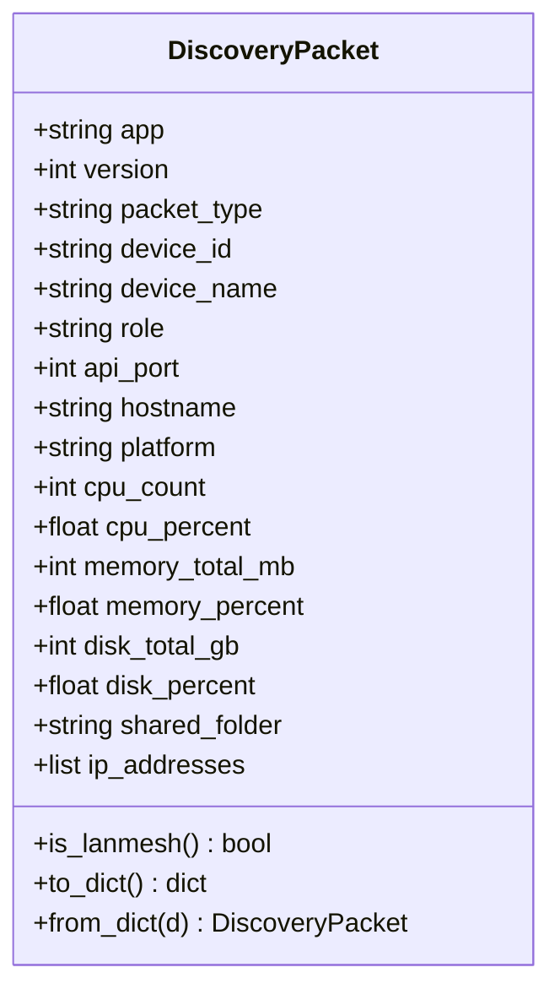
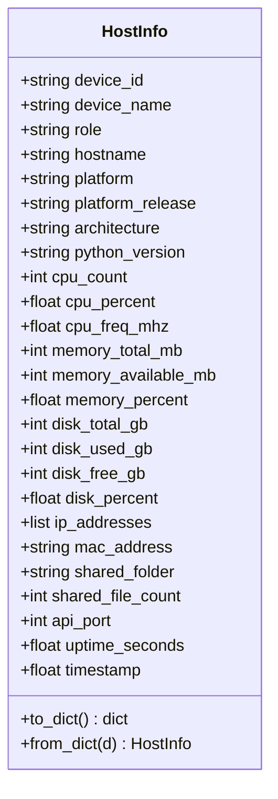
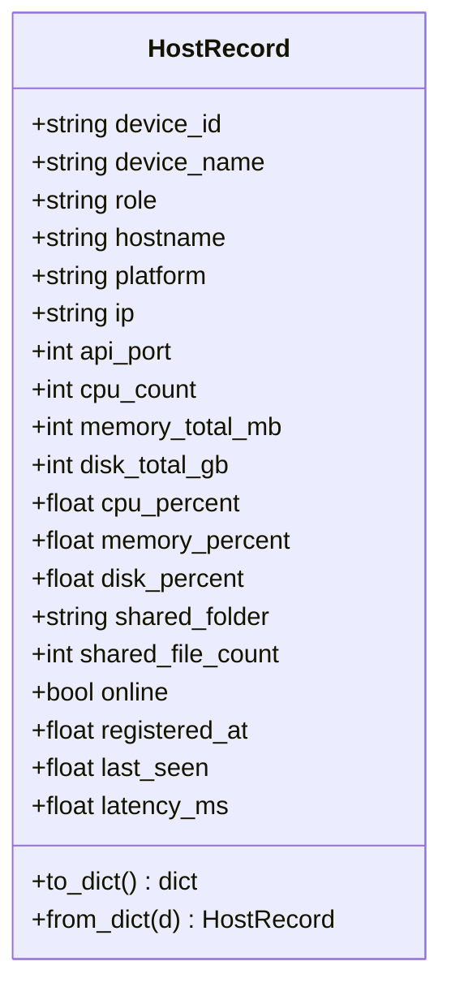
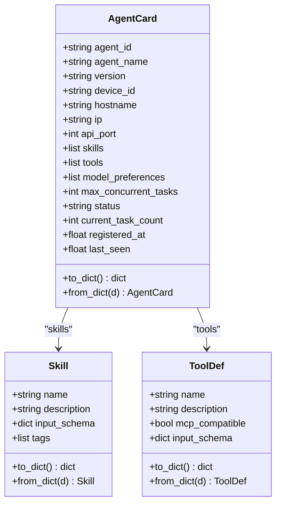
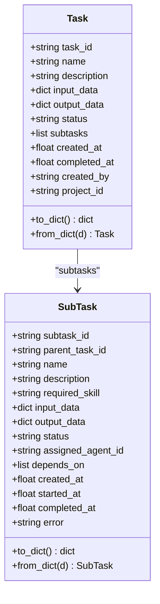
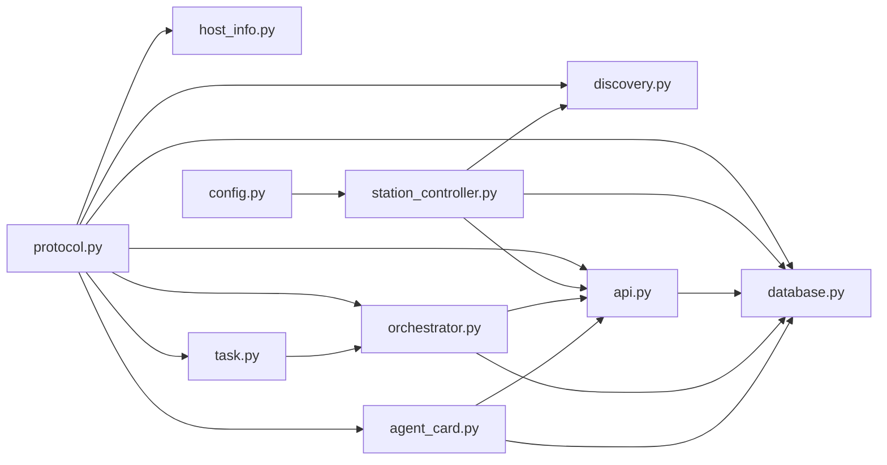

# 消息格式规范

<cite>
**本文引用的文件**
- [protocol.py](file://lan_mesh/protocol.py)
- [discovery.py](file://lan_mesh/discovery.py)
- [host_info.py](file://lan_mesh/host_info.py)
- [agent_card.py](file://lan_mesh/agent_card.py)
- [task.py](file://lan_mesh/task.py)
- [orchestrator.py](file://lan_mesh/orchestrator.py)
- [api.py](file://lan_mesh/api.py)
- [database.py](file://lan_mesh/database.py)
- [config.py](file://lan_mesh/config.py)
- [station_controller.py](file://lan_mesh/station_controller.py)
</cite>

## 目录
1. [简介](#简介)
2. [项目结构](#项目结构)
3. [核心组件](#核心组件)
4. [架构总览](#架构总览)
5. [详细组件分析](#详细组件分析)
6. [依赖关系分析](#依赖关系分析)
7. [性能考量](#性能考量)
8. [故障排查指南](#故障排查指南)
9. [结论](#结论)
10. [附录](#附录)

## 简介
本文件面向 LAN Mesh 局域网任务编排系统，系统性梳理并标准化消息格式规范，覆盖以下核心数据模型的 JSON 序列化格式：
- DiscoveryPacket：UDP 广播发现包
- HostInfo：完整主机信息（HTTP API 载荷）
- HostRecord：Master 端主机注册记录（数据库持久化）
- AgentCard：Agent 能力卡片
- Task：顶层任务
- SubTask：子任务

文档详细说明各字段类型、默认值、验证规则，并提供请求/响应示例与数据模型间的关系图，帮助开发者快速理解与实现。

## 项目结构
系统采用模块化设计，核心协议定义集中在 protocol.py，业务逻辑分布在 discovery、host_info、agent_card、task、orchestrator、api、database、config、master 等模块中。API 层通过 FastAPI 暴露 HTTP 接口，数据库层使用 SQLite 持久化。

图表来源
- [protocol.py:1-356](file://lan_mesh/protocol.py#L1-L356)
- [discovery.py:1-259](file://lan_mesh/discovery.py#L1-L259)
- [host_info.py:1-212](file://lan_mesh/host_info.py#L1-L212)
- [agent_card.py:1-228](file://lan_mesh/agent_card.py#L1-L228)
- [task.py:1-91](file://lan_mesh/task.py#L1-L91)
- [orchestrator.py:1-262](file://lan_mesh/orchestrator.py#L1-L262)
- [api.py:1-539](file://lan_mesh/api.py#L1-L539)
- [database.py:1-611](file://lan_mesh/database.py#L1-L611)
- [config.py:1-84](file://lan_mesh/config.py#L1-L84)
- [station_controller.py](file://lan_mesh/station_controller.py#L1-L324)

章节来源
- [protocol.py:1-356](file://lan_mesh/protocol.py#L1-L356)
- [api.py:1-539](file://lan_mesh/api.py#L1-L539)
- [database.py:1-611](file://lan_mesh/database.py#L1-L611)

## 核心组件
本节对各核心数据模型进行 JSON 序列化格式说明，包括字段类型、默认值与验证规则。

- DiscoveryPacket（UDP 广播发现包）
  - 字段与类型
    - app: 字符串，默认 "lan-mesh"
    - version: 整数，默认 1
    - packet_type: 字符串，枚举 "presence" 或 "register"
    - device_id: 字符串
    - device_name: 字符串
    - role: 字符串，枚举 "master" 或 "worker"
    - api_port: 整数
    - hostname: 字符串
    - platform: 字符串
    - cpu_count: 整数
    - cpu_percent: 浮点数
    - memory_total_mb: 整数
    - memory_percent: 浮点数
    - disk_total_gb: 整数
    - disk_percent: 浮点数
    - shared_folder: 字符串
    - ip_addresses: 数组（字符串）
  - 默认值与验证
    - 必填字段：device_id、device_name、role、api_port
    - 可选字段：其余字段若缺失将使用默认值
    - 验证：is_lanmesh() 校验 app 与 version 是否匹配
  - 示例
    - 请求/响应 JSON 片段路径：[DiscoveryPacket 示例:180-182](file://lan_mesh/discovery.py#L180-L182)

- HostInfo（完整主机信息）
  - 字段与类型
    - device_id/device_name/role: 字符串
    - hostname/platform/platform_release/architecture/python_version: 字符串
    - cpu_count/cpu_percent/cpu_freq_mhz: 整数/浮点数
    - memory_total_mb/memory_available_mb/memory_percent: 整数/浮点数
    - disk_total_gb/disk_used_gb/disk_free_gb/disk_percent: 整数/浮点数
    - ip_addresses: 数组（字符串）
    - mac_address: 字符串
    - shared_folder/shared_file_count: 字符串/整数
    - api_port/uptime_seconds/timestamp: 整数/浮点数
  - 默认值与验证
    - 必填字段：device_id、device_name、role
    - 可选字段：其余字段若缺失将使用默认值
    - 验证：from_dict 仅保留协议定义内的字段
  - 示例
    - 请求/响应 JSON 片段路径：[HostInfo.to_dict():104-110](file://lan_mesh/protocol.py#L104-L110)

- HostRecord（Master 端主机注册记录）
  - 字段与类型
    - device_id/device_name/role: 字符串
    - hostname/platform/ip/api_port: 字符串/整数
    - cpu_count/memory_total_mb/disk_total_gb: 整数
    - cpu_percent/memory_percent/disk_percent: 浮点数
    - shared_folder/shared_file_count: 字符串/整数
    - online: 布尔
    - registered_at/last_seen/latency_ms: 浮点数/可选
  - 默认值与验证
    - 必填字段：device_id
    - 可选字段：online 默认 True；latency_ms 可为空
    - 验证：from_dict 仅保留协议定义内的字段
  - 示例
    - 请求/响应 JSON 片段路径：[HostRecord.to_dict():141-147](file://lan_mesh/protocol.py#L141-L147)

- AgentCard（Agent 能力卡片）
  - 字段与类型
    - agent_id/agent_name/version/device_id/hostname/ip/api_port: 字符串/整数
    - skills: 数组（Skill.to_dict()）
    - tools: 数组（ToolDef.to_dict()）
    - model_preferences: 数组（字符串）
    - max_concurrent_tasks: 整数
    - status: 字符串，枚举 "idle"|"busy"|"offline"
    - current_task_count: 整数
    - registered_at/last_seen: 浮点数
  - 默认值与验证
    - 必填字段：agent_id、device_id
    - 可选字段：其余字段若缺失将使用默认值
    - 验证：from_dict 仅保留协议定义内的字段
  - 示例
    - 请求/响应 JSON 片段路径：[AgentCard.to_dict():228-234](file://lan_mesh/protocol.py#L228-L234)

- Skill（Agent 技能声明）
  - 字段与类型
    - name/description: 字符串
    - input_schema: 对象（JSON Schema）
    - tags: 数组（字符串）
  - 默认值与验证
    - 必填字段：name
    - 可选字段：其余字段若缺失将使用默认值
    - 验证：from_dict 仅保留协议定义内的字段
  - 示例
    - 请求/响应 JSON 片段路径：[Skill.to_dict():169-175](file://lan_mesh/protocol.py#L169-L175)

- ToolDef（工具定义）
  - 字段与类型
    - name/description: 字符串
    - mcp_compatible: 布尔
    - input_schema: 对象（JSON Schema）
  - 默认值与验证
    - 必填字段：name
    - 可选字段：其余字段若缺失将使用默认值
    - 验证：from_dict 仅保留协议定义内的字段
  - 示例
    - 请求/响应 JSON 片段路径：[ToolDef.to_dict():186-192](file://lan_mesh/protocol.py#L186-L192)

- Task（顶层任务）
  - 字段与类型
    - task_id/name/description: 字符串
    - input_data/output_data: 对象（字典）
    - status: 字符串，枚举 "pending"|"assigned"|"running"|"completed"|"failed"|"cancelled"
    - subtasks: 数组（SubTask.to_dict()）
    - created_at/completed_at/created_by/project_id: 字符串/浮点数
  - 默认值与验证
    - 必填字段：task_id
    - 可选字段：其余字段若缺失将使用默认值
    - 验证：from_dict 仅保留协议定义内的字段
  - 示例
    - 请求/响应 JSON 片段路径：[Task.to_dict():291-297](file://lan_mesh/protocol.py#L291-L297)

- SubTask（子任务）
  - 字段与类型
    - subtask_id/parent_task_id/name/description: 字符串
    - required_skill: 字符串
    - input_data/output_data: 对象（字典）
    - status: 字符串，枚举 "pending"|"assigned"|"running"|"completed"|"failed"
    - assigned_agent_id: 字符串
    - depends_on: 数组（字符串）
    - created_at/started_at/completed_at/error: 浮点数/字符串
  - 默认值与验证
    - 必填字段：subtask_id、parent_task_id、required_skill
    - 可选字段：其余字段若缺失将使用默认值
    - 验证：from_dict 仅保留协议定义内的字段
  - 示例
    - 请求/响应 JSON 片段路径：[SubTask.to_dict():267-273](file://lan_mesh/protocol.py#L267-L273)

章节来源
- [protocol.py:29-356](file://lan_mesh/protocol.py#L29-L356)

## 架构总览
系统通过 UDP 广播进行设备发现，Worker 通过 HTTP API 向 Master 注册与上报心跳，Master 将主机信息持久化至 SQLite，并通过 WebSocket 推送状态变化。任务编排器将用户任务分解为子任务 DAG，匹配空闲 Agent 并分发执行。

图表来源
- [api.py:116-168](file://lan_mesh/api.py#L116-L168)
- [database.py:147-201](file://lan_mesh/database.py#L147-L201)
- [orchestrator.py:70-108](file://lan_mesh/orchestrator.py#L70-L108)
- [database.py:421-441](file://lan_mesh/database.py#L421-L441)
- [orchestrator.py:157-226](file://lan_mesh/orchestrator.py#L157-L226)
- [database.py:589-600](file://lan_mesh/database.py#L589-L600)

## 详细组件分析

### DiscoveryPacket（UDP 广播发现包）
- JSON 序列化
  - to_dict(): 将 dataclass 转换为字典，字段类型与默认值见“核心组件”
  - from_dict(): 仅保留协议定义内的字段，缺失字段使用默认值
- 验证规则
  - is_lanmesh(): app 必须等于 "lan-mesh"，version 必须等于 1
- 使用场景
  - Worker 定期广播自身存在
  - Master 监听并更新设备列表
  - 主动探测指定 IP 的设备

图表来源
- [protocol.py:29-65](file://lan_mesh/protocol.py#L29-L65)

章节来源
- [protocol.py:29-65](file://lan_mesh/protocol.py#L29-L65)
- [discovery.py:139-214](file://lan_mesh/discovery.py#L139-L214)

### HostInfo（完整主机信息）
- JSON 序列化
  - to_dict(): 字段类型与默认值见“核心组件”
  - from_dict(): 仅保留协议定义内的字段
- 使用场景
  - Worker 自身信息采集
  - Master 通过 HTTP API 获取 Worker 详细画像
  - DiscoveryPacket 摘要字段来源于 HostInfo

图表来源
- [protocol.py:69-111](file://lan_mesh/protocol.py#L69-L111)
- [host_info.py:129-191](file://lan_mesh/host_info.py#L129-L191)

章节来源
- [protocol.py:69-111](file://lan_mesh/protocol.py#L69-L111)
- [host_info.py:129-191](file://lan_mesh/host_info.py#L129-L191)

### HostRecord（Master 端主机注册记录）
- JSON 序列化
  - to_dict(): 字段类型与默认值见“核心组件”
  - from_dict(): 仅保留协议定义内的字段
- 使用场景
  - Master 持久化 Worker 注册信息
  - WebSocket 推送主机状态
  - 离线清理与心跳记录

图表来源
- [protocol.py:115-148](file://lan_mesh/protocol.py#L115-L148)
- [database.py:147-231](file://lan_mesh/database.py#L147-L231)

章节来源
- [protocol.py:115-148](file://lan_mesh/protocol.py#L115-L148)
- [database.py:147-231](file://lan_mesh/database.py#L147-L231)

### AgentCard（Agent 能力卡片）
- JSON 序列化
  - to_dict(): 字段类型与默认值见“核心组件”
  - from_dict(): 仅保留协议定义内的字段
- 使用场景
  - Worker 启动时生成并注册
  - Master 维护 Agent 注册表用于任务匹配
  - 编排器按技能匹配空闲 Agent

图表来源
- [protocol.py:202-234](file://lan_mesh/protocol.py#L202-L234)
- [protocol.py:161-193](file://lan_mesh/protocol.py#L161-L193)
- [agent_card.py:167-217](file://lan_mesh/agent_card.py#L167-L217)

章节来源
- [protocol.py:202-234](file://lan_mesh/protocol.py#L202-L234)
- [agent_card.py:167-217](file://lan_mesh/agent_card.py#L167-L217)

### Task 与 SubTask（任务与子任务）
- JSON 序列化
  - Task.to_dict()/from_dict()
  - SubTask.to_dict()/from_dict()
- 使用场景
  - 用户提交任务，编排器分解为子任务 DAG
  - 按拓扑排序与依赖关系执行
  - 编排器分发到匹配的 Agent

图表来源
- [protocol.py:276-298](file://lan_mesh/protocol.py#L276-L298)
- [protocol.py:249-274](file://lan_mesh/protocol.py#L249-L274)
- [task.py:16-91](file://lan_mesh/task.py#L16-L91)

章节来源
- [protocol.py:276-298](file://lan_mesh/protocol.py#L276-L298)
- [protocol.py:249-274](file://lan_mesh/protocol.py#L249-L274)
- [task.py:16-91](file://lan_mesh/task.py#L16-L91)

### API 请求/响应示例
以下示例展示关键消息类型的完整数据格式（仅提供片段路径，不直接粘贴代码）：
- Worker 注册（Master 接收 HostInfo）
  - 请求体：HostInfo.to_dict()
  - 响应体：{"ok": true, "device_id": "<device_id>"}
  - 片段路径：[注册接口:116-146](file://lan_mesh/api.py#L116-L146)

- Worker 心跳（Master 接收实时资源使用率）
  - 请求体：{"device_id": "...", "cpu_percent": 0.0, "memory_percent": 0.0, "disk_percent": 0.0, "shared_file_count": 0}
  - 响应体：{"ok": true}
  - 片段路径：[心跳接口:148-168](file://lan_mesh/api.py#L148-L168)

- Master 发现设备列表（Master 返回 UDP 发现结果）
  - 响应体：{"devices": [DiscoveryPacket.to_dict()], "total": 0}
  - 片段路径：[发现接口:228-234](file://lan_mesh/api.py#L228-L234)

- Agent 注册（Master 接收 AgentCard）
  - 请求体：AgentCard.to_dict()
  - 响应体：{"ok": true, "agent_id": "<agent_id>"}
  - 片段路径：[Agent 注册接口:268-279](file://lan_mesh/api.py#L268-L279)

- 提交任务（Master 接收 Task）
  - 请求体：{"name": "...", "description": "...", "input_data": {}, "project_id": "..."}
  - 响应体：Task.to_dict()
  - 片段路径：[提交任务接口:302-326](file://lan_mesh/api.py#L302-L326)

章节来源
- [api.py:116-168](file://lan_mesh/api.py#L116-L168)
- [api.py:228-234](file://lan_mesh/api.py#L228-L234)
- [api.py:268-279](file://lan_mesh/api.py#L268-L279)
- [api.py:302-326](file://lan_mesh/api.py#L302-L326)

## 依赖关系分析
- 协议层（protocol.py）为所有模块提供统一的数据模型定义
- discovery.py 依赖 protocol.DiscoveryPacket、NetworkStatus
- host_info.py 依赖 protocol.HostInfo、DiscoveryPacket
- agent_card.py 依赖 protocol.AgentCard、Skill、ToolDef
- task.py 依赖 protocol.SubTask
- orchestrator.py 依赖 protocol.Task、SubTask、AgentCard、TaskDAG
- api.py 依赖 protocol.HostInfo、HostRecord、NetworkStatus、AgentCard
- database.py 依赖 protocol.HostRecord、AgentCard、Task、SubTask、Project、UsageRecord
- station_controller.py 依赖 discovery、host_info、protocol、database、api、orchestrator

图表来源
- [protocol.py:1-356](file://lan_mesh/protocol.py#L1-L356)
- [discovery.py:20-30](file://lan_mesh/discovery.py#L20-L30)
- [host_info.py:16-16](file://lan_mesh/host_info.py#L16-L16)
- [agent_card.py:13-13](file://lan_mesh/agent_card.py#L13-L13)
- [task.py:13-13](file://lan_mesh/task.py#L13-L13)
- [orchestrator.py:19-21](file://lan_mesh/orchestrator.py#L19-L21)
- [api.py:33-34](file://lan_mesh/api.py#L33-L34)
- [database.py:13-13](file://lan_mesh/database.py#L13-L13)
- [config.py:36-40](file://lan_mesh/config.py#L36-L40)
- [station_controller.py](file://lan_mesh/station_controller.py#L32-L45)

章节来源
- [protocol.py:1-356](file://lan_mesh/protocol.py#L1-L356)
- [api.py:1-539](file://lan_mesh/api.py#L1-L539)
- [database.py:1-611](file://lan_mesh/database.py#L1-L611)

## 性能考量
- UDP 广播频率与 TTL
  - PRESENCE_INTERVAL_SECS 默认 3 秒，DEVICE_TTL_SECS 默认 12 秒，PRUNE_INTERVAL_SECS 默认 5 秒
  - 影响：降低网络负载与 CPU 开销，同时保证设备状态及时更新
- HTTP 心跳间隔
  - HEARTBEAT_INTERVAL_SECS 默认 5 秒，平衡实时性与性能
- 数据库索引
  - hosts、agents、tasks、projects 表建立必要索引，提升查询效率
- JSON 序列化
  - dataclasses.asdict() 提供高效序列化，避免重复字段映射

## 故障排查指南
- UDP 端口占用
  - 现象：发现服务降级运行
  - 处理：更换端口或释放占用进程
  - 片段路径：[端口绑定异常处理:159-174](file://lan_mesh/discovery.py#L159-L174)
- 设备离线判定
  - 现象：设备长时间未出现
  - 处理：检查 DEVICE_TTL_SECS 设置与网络连通性
  - 片段路径：[离线清理:216-228](file://lan_mesh/discovery.py#L216-L228)
- 心跳丢失
  - 现象：Master 端显示离线
  - 处理：确认 Worker 心跳接口调用与网络可达性
  - 片段路径：[心跳接口:148-168](file://lan_mesh/api.py#L148-L168)
- Agent 匹配失败
  - 现象：无空闲 Agent 可用
  - 处理：检查 AgentCard 注册与技能声明
  - 片段路径：[Agent 匹配:396-417](file://lan_mesh/database.py#L396-L417)

章节来源
- [discovery.py:159-174](file://lan_mesh/discovery.py#L159-L174)
- [discovery.py:216-228](file://lan_mesh/discovery.py#L216-L228)
- [api.py:148-168](file://lan_mesh/api.py#L148-L168)
- [database.py:396-417](file://lan_mesh/database.py#L396-L417)

## 结论
本文档系统化梳理了 LAN Mesh 的消息格式规范，明确了各数据模型的 JSON 序列化格式、字段类型与默认值、验证规则以及典型请求/响应示例。通过协议层的统一定义与 API 层的清晰边界，系统实现了高效的设备发现、主机注册、Agent 能力管理与任务编排。建议在开发与集成过程中严格遵循本文档的数据模型与字段约束，确保跨节点通信的稳定性与一致性。

## 附录
- 常量与端口
  - DISCOVERY_PORT: 45454
  - WORKER_API_PORT: 45460
  - MASTER_API_PORT: 45470
  - PRESENCE_INTERVAL_SECS: 3
  - HEARTBEAT_INTERVAL_SECS: 5
  - DEVICE_TTL_SECS: 12
  - PRUNE_INTERVAL_SECS: 5
- 配置加载
  - 支持多路径配置文件加载与环境变量覆盖
  - 片段路径：[配置加载:48-72](file://lan_mesh/config.py#L48-L72)

章节来源
- [protocol.py:12-25](file://lan_mesh/protocol.py#L12-L25)
- [config.py:48-72](file://lan_mesh/config.py#L48-L72)
