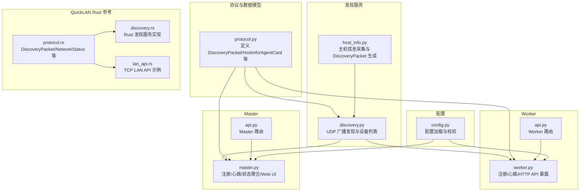
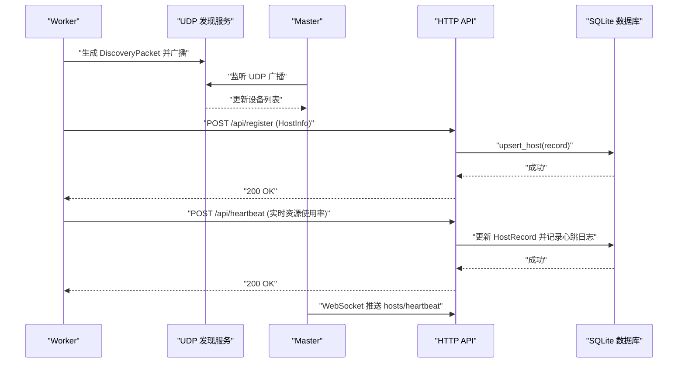
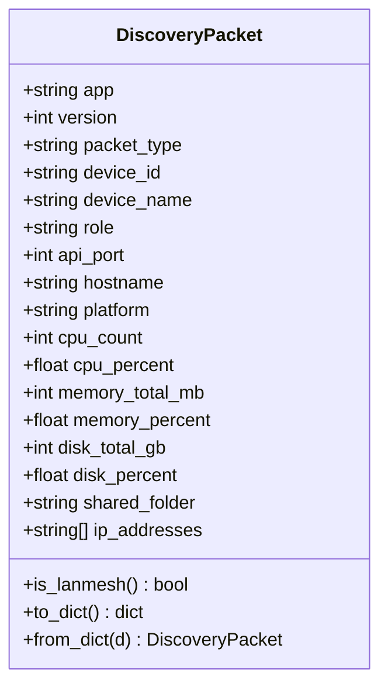
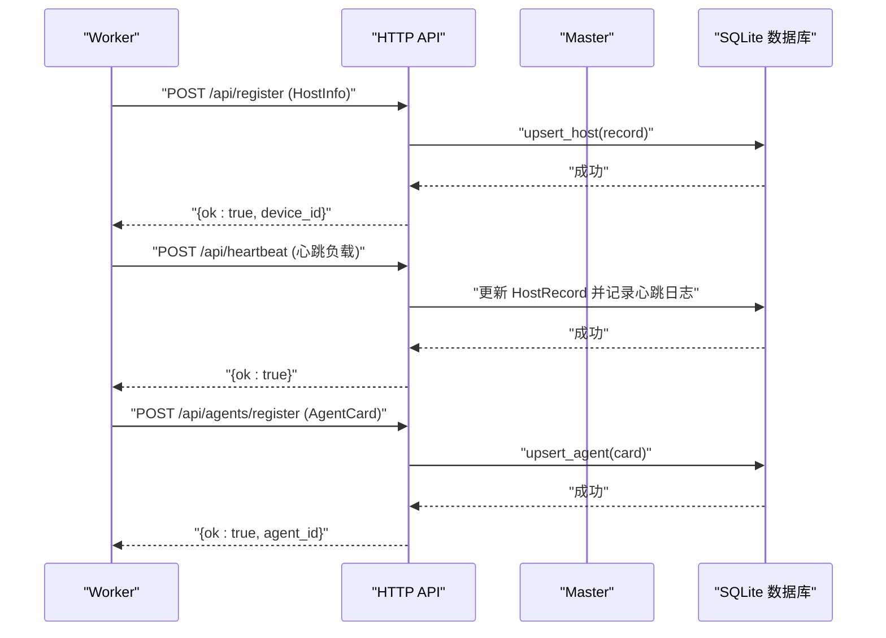
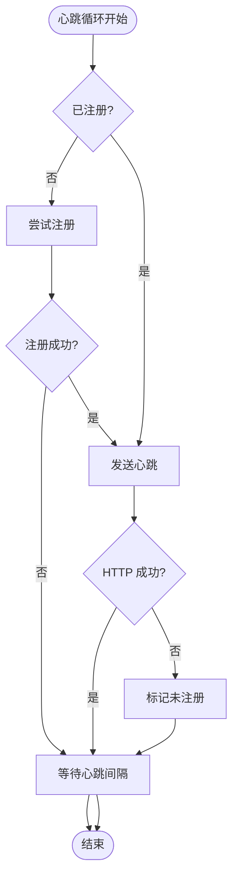
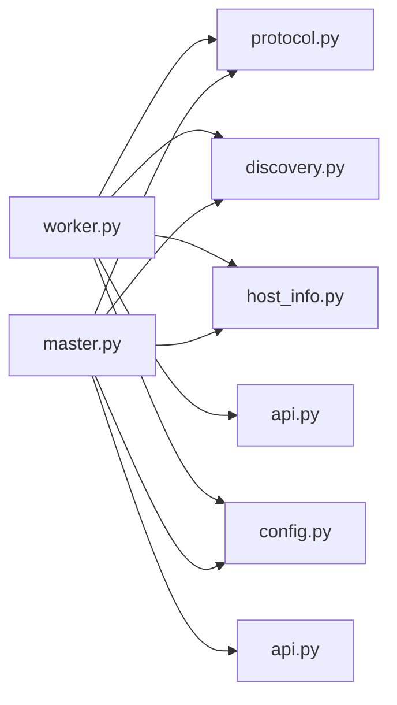

# 通信协议与消息格式

<cite>
**本文引用的文件**
- [lan_mesh/worker.py](file://lan_mesh/worker.py)
- [lan_mesh/master.py](file://lan_mesh/master.py)
- [lan_mesh/discovery.py](file://lan_mesh/discovery.py)
- [lan_mesh/protocol.py](file://lan_mesh/protocol.py)
- [lan_mesh/host_info.py](file://lan_mesh/host_info.py)
- [lan_mesh/api.py](file://lan_mesh/api.py)
- [lan_mesh/config.py](file://lan_mesh/config.py)
- [quicklan-main/src-tauri/src/protocol.rs](file://quicklan-main/src-tauri/src/protocol.rs)
- [quicklan-main/src-tauri/src/discovery.rs](file://quicklan-main/src-tauri/src/discovery.rs)
- [quicklan-main/src-tauri/src/lan_api.rs](file://quicklan-main/src-tauri/src/lan_api.rs)
</cite>

## 目录
1. [简介](#简介)
2. [项目结构](#项目结构)
3. [核心组件](#核心组件)
4. [架构总览](#架构总览)
5. [详细组件分析](#详细组件分析)
6. [依赖关系分析](#依赖关系分析)
7. [性能考虑](#性能考虑)
8. [故障排除指南](#故障排除指南)
9. [结论](#结论)
10. [附录](#附录)

## 简介
本文件系统性地梳理了 LAN Mesh 分布式系统中 Worker 与 Master 之间的通信协议与消息格式，涵盖：
- Worker 与 Master 之间的 HTTP 通信协议：注册请求、心跳消息与状态更新的数据格式
- DiscoveryPacket 的 UDP 广播消息结构：设备ID、角色、API端口与网络信息字段
- 请求超时机制、重试策略与错误处理流程
- 完整的请求/响应示例与协议交互序列图，展示 Worker 在分布式系统中的通信行为

## 项目结构
本项目采用模块化组织，核心模块如下：
- 协议与数据模型：定义 DiscoveryPacket、HostInfo、AgentCard 等数据结构
- 发现服务：基于 UDP 的广播发现与设备列表维护
- Worker 与 Master：分别实现注册、心跳、状态同步与 Web UI
- API 层：统一的 FastAPI 路由，提供 HTTP 接口与 WebSocket 推送
- 配置管理：基于 Pydantic 的强类型配置加载与校验

图表来源
- [lan_mesh/protocol.py:1-356](file://lan_mesh/protocol.py#L1-L356)
- [lan_mesh/discovery.py:1-259](file://lan_mesh/discovery.py#L1-L259)
- [lan_mesh/host_info.py:1-212](file://lan_mesh/host_info.py#L1-L212)
- [lan_mesh/worker.py:1-325](file://lan_mesh/worker.py#L1-L325)
- [lan_mesh/master.py:1-324](file://lan_mesh/master.py#L1-L324)
- [lan_mesh/api.py:1-539](file://lan_mesh/api.py#L1-L539)
- [lan_mesh/config.py:1-84](file://lan_mesh/config.py#L1-L84)
- [quicklan-main/src-tauri/src/protocol.rs:1-230](file://quicklan-main/src-tauri/src/protocol.rs#L1-L230)
- [quicklan-main/src-tauri/src/discovery.rs:1-384](file://quicklan-main/src-tauri/src/discovery.rs#L1-L384)
- [quicklan-main/src-tauri/src/lan_api.rs:1-177](file://quicklan-main/src-tauri/src/lan_api.rs#L1-L177)

章节来源
- [lan_mesh/protocol.py:1-356](file://lan_mesh/protocol.py#L1-L356)
- [lan_mesh/discovery.py:1-259](file://lan_mesh/discovery.py#L1-L259)
- [lan_mesh/host_info.py:1-212](file://lan_mesh/host_info.py#L1-L212)
- [lan_mesh/worker.py:1-325](file://lan_mesh/worker.py#L1-L325)
- [lan_mesh/master.py:1-324](file://lan_mesh/master.py#L1-L324)
- [lan_mesh/api.py:1-539](file://lan_mesh/api.py#L1-L539)
- [lan_mesh/config.py:1-84](file://lan_mesh/config.py#L1-L84)

## 核心组件
- DiscoveryPacket：UDP 广播发现包，包含设备身份、角色、API 端口与硬件配置摘要
- HostInfo：完整主机信息，通过 HTTP API 获取，包含 CPU/内存/磁盘/网络等详细信息
- AgentCard：Agent 能力声明，描述 Worker 的技能与工具
- DiscoveryService：UDP 发现服务，负责广播、监听、设备列表维护与清理
- WorkerAgent：Worker 守护进程，负责注册、心跳与 HTTP API 暴露
- MasterController：Master 控制器，负责注册、心跳、状态聚合与 Web UI

章节来源
- [lan_mesh/protocol.py:29-111](file://lan_mesh/protocol.py#L29-L111)
- [lan_mesh/protocol.py:150-235](file://lan_mesh/protocol.py#L150-L235)
- [lan_mesh/discovery.py:33-136](file://lan_mesh/discovery.py#L33-L136)
- [lan_mesh/worker.py:62-120](file://lan_mesh/worker.py#L62-L120)
- [lan_mesh/master.py:67-144](file://lan_mesh/master.py#L67-L144)

## 架构总览
Worker 与 Master 通过双通道协作：
- UDP 发现通道：Worker 定期广播 DiscoveryPacket，Master 监听并维护设备列表
- HTTP 通道：Worker 主动向 Master 注册并周期性发送心跳，Master 持久化状态并通过 WebSocket 推送

图表来源
- [lan_mesh/discovery.py:139-215](file://lan_mesh/discovery.py#L139-L215)
- [lan_mesh/api.py:116-168](file://lan_mesh/api.py#L116-L168)
- [lan_mesh/master.py:160-184](file://lan_mesh/master.py#L160-L184)

## 详细组件分析

### DiscoveryPacket UDP 广播消息结构
DiscoveryPacket 是 Worker 与 Master 之间 UDP 广播的核心载体，包含以下字段：
- app/version：协议标识，用于识别是否为 LAN Mesh 协议
- packet_type：包类型，如 presence
- device_id/device_name：设备唯一标识与名称
- role：设备角色（master/worker）
- api_port：HTTP API 端口
- 主机配置摘要：hostname、platform、cpu_count/cpu_percent、memory_total_mb/memory_percent、disk_total_gb/disk_percent、shared_folder、ip_addresses

生成与解析逻辑：
- Worker 通过 host_info.collect_host_info 采集完整信息，再调用 host_info.make_discovery_packet 生成 DiscoveryPacket
- DiscoveryService 监听 UDP 广播，解析为 DiscoveryPacket，并更新设备列表

图表来源
- [lan_mesh/protocol.py:29-65](file://lan_mesh/protocol.py#L29-L65)
- [lan_mesh/host_info.py:194-212](file://lan_mesh/host_info.py#L194-L212)

章节来源
- [lan_mesh/protocol.py:29-65](file://lan_mesh/protocol.py#L29-L65)
- [lan_mesh/host_info.py:194-212](file://lan_mesh/host_info.py#L194-L212)
- [lan_mesh/discovery.py:178-214](file://lan_mesh/discovery.py#L178-L214)

### Worker 与 Master 的 HTTP 通信协议
- 注册请求
  - 方法：POST /api/register
  - 请求体：HostInfo 对象（完整主机信息）
  - 响应：{"ok": true, "device_id": "<device_id>"}
  - 行为：Master 将 HostInfo 转换为 HostRecord，尝试从 UDP 发现列表获取真实 IP，写入数据库并广播 WebSocket 消息

- 心跳消息
  - 方法：POST /api/heartbeat
  - 请求体：{"device_id": "<device_id>", "cpu_percent": x, "memory_percent": y, "disk_percent": z, "shared_file_count": n}
  - 响应：{"ok": true}
  - 行为：Master 更新 HostRecord 的实时状态、在线标志与最后心跳时间，记录心跳日志并通过 WebSocket 推送

- Agent Card 注册
  - 方法：POST /api/agents/register
  - 请求体：AgentCard 对象（技能与工具声明）
  - 响应：{"ok": true, "agent_id": "<agent_id>"}
  - 行为：Master 维护 Agent 注册表，用于任务匹配与分发

图表来源
- [lan_mesh/api.py:116-168](file://lan_mesh/api.py#L116-L168)
- [lan_mesh/api.py:268-299](file://lan_mesh/api.py#L268-L299)
- [lan_mesh/worker.py:126-194](file://lan_mesh/worker.py#L126-L194)

章节来源
- [lan_mesh/api.py:116-168](file://lan_mesh/api.py#L116-L168)
- [lan_mesh/api.py:268-299](file://lan_mesh/api.py#L268-L299)
- [lan_mesh/worker.py:126-194](file://lan_mesh/worker.py#L126-L194)

### 请求超时机制、重试策略与错误处理
- UDP 发现
  - 广播间隔：PRESENCE_INTERVAL_SECS（默认 3 秒）
  - 设备 TTL：DEVICE_TTL_SECS（默认 12 秒），超过 3×DEVICE_TTL 未收到则清理
  - 监听超时：socket 设置超时，避免阻塞
  - 端口绑定：若端口被占用，尝试 SO_REUSEPORT（类 Unix）或降级运行

- HTTP 心跳
  - 超时：requests.post 调用设置 timeout=5 秒
  - 重试：心跳循环中，若发送失败则打印日志并标记未注册，等待下次心跳周期重新注册
  - 错误处理：捕获 requests.RequestException，避免崩溃

- Master 端
  - 注册：若设备未通过 HTTP 注册但已在 UDP 发现列表中，Master 会在查询时补充相关信息
  - 心跳：若设备未注册，返回 404；成功则更新在线状态与最后心跳时间

图表来源
- [lan_mesh/worker.py:203-216](file://lan_mesh/worker.py#L203-L216)
- [lan_mesh/discovery.py:216-228](file://lan_mesh/discovery.py#L216-L228)

章节来源
- [lan_mesh/discovery.py:139-228](file://lan_mesh/discovery.py#L139-L228)
- [lan_mesh/worker.py:126-194](file://lan_mesh/worker.py#L126-L194)
- [lan_mesh/api.py:148-168](file://lan_mesh/api.py#L148-L168)

### 配置与端口约定
- UDP 发现端口：DISCOVERY_PORT（默认 45454）
- Worker HTTP API 端口：WORKER_API_PORT（默认 45460）
- Master HTTP API 端口：MASTER_API_PORT（默认 45470）
- 心跳间隔：HEARTBEAT_INTERVAL_SECS（默认 5 秒）
- 发现存在广播间隔：PRESENCE_INTERVAL_SECS（默认 3 秒）
- 设备 TTL：DEVICE_TTL_SECS（默认 12 秒）

章节来源
- [lan_mesh/protocol.py:17-25](file://lan_mesh/protocol.py#L17-L25)
- [lan_mesh/config.py:14-40](file://lan_mesh/config.py#L14-L40)

## 依赖关系分析
- Worker 依赖
  - protocol.py：数据模型与常量
  - discovery.py：UDP 发现服务
  - host_info.py：主机信息采集与 DiscoveryPacket 生成
  - api.py：Worker 路由
  - config.py：配置加载

- Master 依赖
  - protocol.py：数据模型与常量
  - discovery.py：UDP 发现服务
  - host_info.py：主机信息采集
  - api.py：Master 路由与 WebSocket 推送
  - config.py：配置加载

图表来源
- [lan_mesh/worker.py:28-44](file://lan_mesh/worker.py#L28-L44)
- [lan_mesh/master.py:32-45](file://lan_mesh/master.py#L32-L45)

章节来源
- [lan_mesh/worker.py:28-44](file://lan_mesh/worker.py#L28-L44)
- [lan_mesh/master.py:32-45](file://lan_mesh/master.py#L32-L45)

## 性能考虑
- UDP 广播频率与设备 TTL 的平衡：较短的广播间隔可提升发现速度，但增加网络开销；TTL 过短可能导致频繁离线/上线抖动
- HTTP 心跳间隔：建议与业务负载匹配，避免过于频繁导致 Master 数据库压力
- 端口冲突处理：UDP 端口绑定失败时的降级策略，确保服务可用性
- WebSocket 推送：批量推送与去重，减少不必要的网络传输

## 故障排除指南
- Worker 无法注册
  - 检查 Master 是否在线且端口可达
  - 确认 DiscoveryPacket 的 app/version 与协议版本一致
  - 查看 Master 日志中的注册失败原因

- 心跳失败
  - 检查网络连通性与防火墙设置
  - 确认 HTTP 超时设置合理
  - 查看 Worker 心跳循环中的异常日志

- 设备离线抖动
  - 调整 DEVICE_TTL 与 PRESENCE_INTERVAL，避免过于敏感
  - 检查是否存在多网卡导致 IP 变化

章节来源
- [lan_mesh/discovery.py:155-214](file://lan_mesh/discovery.py#L155-L214)
- [lan_mesh/worker.py:172-194](file://lan_mesh/worker.py#L172-L194)
- [lan_mesh/api.py:116-168](file://lan_mesh/api.py#L116-L168)

## 结论
本文档系统性地梳理了 LAN Mesh 中 Worker 与 Master 的通信协议与消息格式，明确了 UDP DiscoveryPacket 的结构、HTTP 注册与心跳的数据格式、以及超时与重试策略。通过清晰的架构图与序列图，读者可以快速理解 Worker 在分布式系统中的通信行为，并据此进行部署与故障排查。

## 附录
- 数据模型对照（QuickLAN Rust 参考）
  - DiscoveryPacket：包含 app、version、packet_type、device_id、device_name、tcp_port、api_port、library_version、share_count、manifest_hash、upload_tasks 等字段
  - NetworkStatus：包含 udp_port、tcp_port、api_port、local_ips、broadcast_targets
  - DeviceInfo：包含 id、name、ip、tcp_port、api_port、online、last_seen_ms、share_count、library_version、manifest_hash、upload_tasks、latency_ms、note

章节来源
- [quicklan-main/src-tauri/src/protocol.rs:11-56](file://quicklan-main/src-tauri/src/protocol.rs#L11-L56)
- [quicklan-main/src-tauri/src/discovery.rs:24-33](file://quicklan-main/src-tauri/src/discovery.rs#L24-L33)
- [quicklan-main/src-tauri/src/lan_api.rs:14-177](file://quicklan-main/src-tauri/src/lan_api.rs#L14-L177)