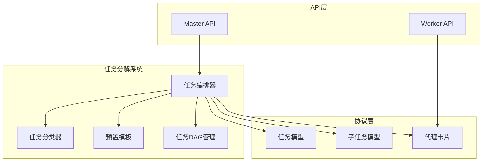
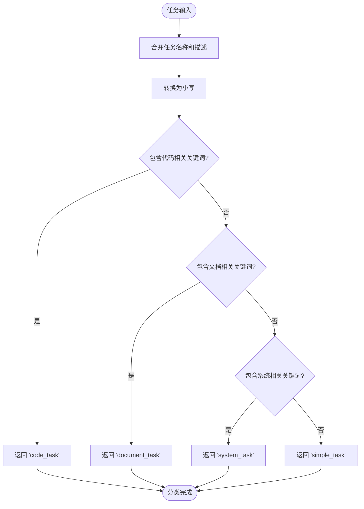
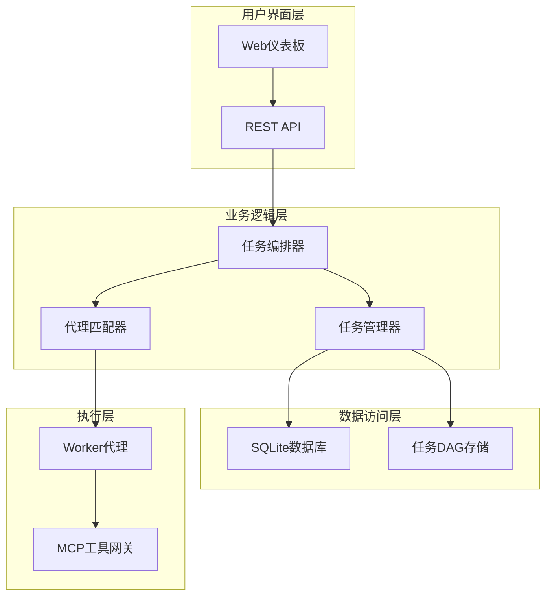
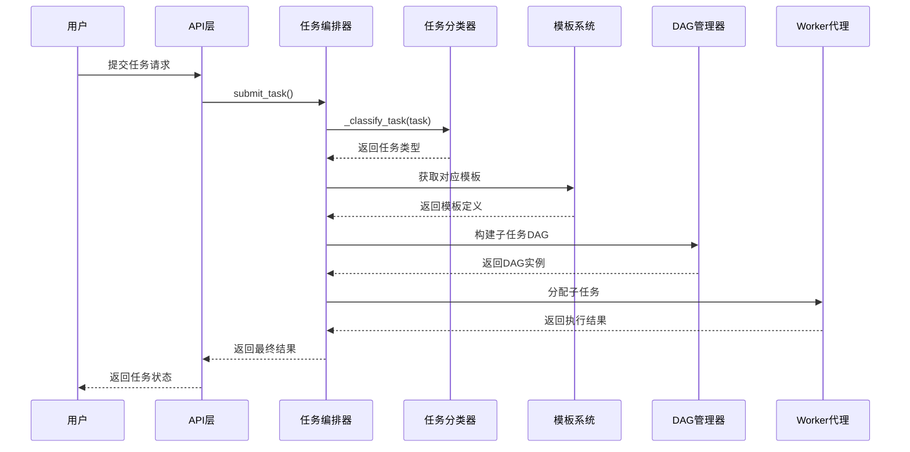
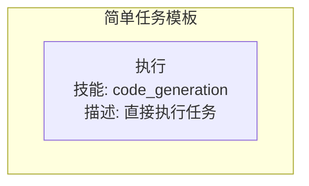
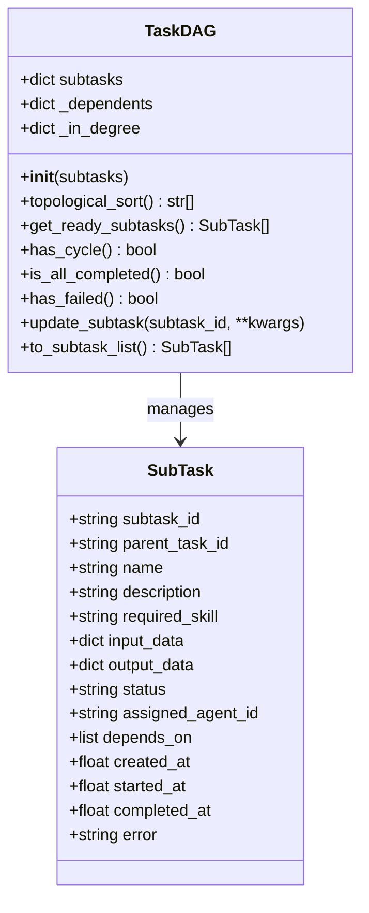
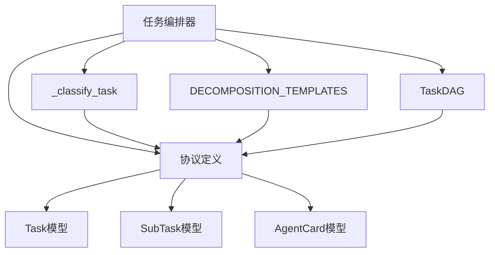

# 任务分解算法

<cite>
**本文档引用的文件**
- [orchestrator.py](file://lan_mesh/orchestrator.py)
- [protocol.py](file://lan_mesh/protocol.py)
- [task.py](file://lan_mesh/task.py)
- [api.py](file://lan_mesh/api.py)
- [station_controller.py](file://lan_mesh/station_controller.py)
- [worker.py](file://lan_mesh/worker.py)
</cite>

## 目录
1. [简介](#简介)
2. [项目结构](#项目结构)
3. [核心组件](#核心组件)
4. [架构概览](#架构概览)
5. [详细组件分析](#详细组件分析)
6. [依赖关系分析](#依赖关系分析)
7. [性能考虑](#性能考虑)
8. [故障排除指南](#故障排除指南)
9. [结论](#结论)

## 简介

本文档详细介绍了 LAN Mesh 项目中的任务分解算法，这是一个基于预置模板的任务分类和分解系统。该系统采用规则驱动的方法，通过关键词匹配对任务进行分类，并根据预定义的模板生成相应的子任务序列。

系统的核心功能包括：
- 基于关键词的任务分类机制
- 预置模板驱动的子任务生成
- 依赖关系建立和拓扑排序
- 动态任务调度和执行

## 项目结构

LAN Mesh 项目采用模块化设计，任务分解算法主要集中在 `lan_mesh/orchestrator.py` 文件中，配合协议定义、任务管理和API路由等组件共同工作。



**图表来源**
- [orchestrator.py:1-262](file://lan_mesh/orchestrator.py#L1-L262)
- [protocol.py:237-298](file://lan_mesh/protocol.py#L237-L298)

**章节来源**
- [orchestrator.py:1-262](file://lan_mesh/orchestrator.py#L1-L262)
- [protocol.py:1-356](file://lan_mesh/protocol.py#L1-L356)

## 核心组件

### 任务分类器 (_classify_task)

任务分类器是整个系统的核心，它使用规则驱动的方法对任务进行智能分类。该函数通过分析任务名称和描述中的关键词来确定任务类型。



**图表来源**
- [orchestrator.py:46-55](file://lan_mesh/orchestrator.py#L46-L55)

### 预置任务模板 (DECOMPOSITION_TEMPLATES)

系统提供了四种预置任务模板，每种模板都针对特定类型的任务设计了最优的子任务序列：

| 模板类型 | 关键词 | 适用场景 | 子任务数量 |
|---------|--------|----------|------------|
| code_task | 代码、code、函数、function、bug、重构 | 编程开发任务 | 3个子任务 |
| document_task | 文档、document、摘要、summary、报告 | 文档处理任务 | 2个子任务 |
| system_task | 系统、system、监控、monitor、shell、命令 | 系统运维任务 | 2个子任务 |
| simple_task | 默认模板 | 通用简单任务 | 1个子任务 |

**章节来源**
- [orchestrator.py:26-43](file://lan_mesh/orchestrator.py#L26-L43)

## 架构概览

任务分解算法采用分层架构设计，确保了系统的可扩展性和可维护性。



**图表来源**
- [station_controller.py](file://lan_mesh/station_controller.py#L67-L114)
- [worker.py:62-97](file://lan_mesh/worker.py#L62-L97)

## 详细组件分析

### 任务分解流程

任务分解过程遵循严格的步骤顺序，确保每个任务都能被正确地分解为可执行的子任务。



**图表来源**
- [orchestrator.py:70-108](file://lan_mesh/orchestrator.py#L70-L108)
- [orchestrator.py:110-130](file://lan_mesh/orchestrator.py#L110-L130)

### 代码任务模板分析

代码任务模板专门设计用于处理编程相关的任务，采用了经典的三阶段工作流：需求分析、代码生成和代码审查。

```mermaid
flowchart TD
subgraph "代码任务模板"
Requirement[需求分析<br/>技能: code_review<br/>描述: 分析需求描述,提取关键信息]
subgraph "依赖关系"
Requirement -.-> CodeGeneration
CodeGeneration -.-> CodeReview
end
CodeGeneration[代码生成<br/>技能: code_generation<br/>描述: 根据需求生成代码<br/>依赖: [0]]
CodeReview[代码审查<br/>技能: code_review<br/>描述: 审查生成的代码<br/>依赖: [1]]
end
```

**图表来源**
- [orchestrator.py:27-31](file://lan_mesh/orchestrator.py#L27-L31)

### 文档任务模板分析

文档任务模板适用于需要处理文档和文本的任务，采用检索-生成的两阶段模式。

```mermaid
flowchart TD
subgraph "文档任务模板"
RAGSearch[检索资料<br/>技能: rag_search<br/>描述: 从知识库检索相关资料]
subgraph "依赖关系"
RAGSearch -.-> DocumentSummary
end
DocumentSummary[生成摘要<br/>技能: document_summary<br/>描述: 基于检索结果生成摘要<br/>依赖: [0]]
end
```

**图表来源**
- [orchestrator.py:32-35](file://lan_mesh/orchestrator.py#L32-L35)

### 系统任务模板分析

系统任务模板专为系统管理和运维任务设计，采用检查-执行的顺序模式。

```mermaid
flowchart TD
subgraph "系统任务模板"
Monitoring[检查状态<br/>技能: monitoring<br/>描述: 检查系统资源状态]
subgraph "依赖关系"
Monitoring -.-> ShellExec
end
ShellExec[执行操作<br/>技能: shell_exec<br/>描述: 执行必要的系统操作<br/>依赖: [0]]
end
```

**图表来源**
- [orchestrator.py:36-39](file://lan_mesh/orchestrator.py#L36-L39)

### 简单任务模板分析

简单任务模板作为默认模板，适用于不需要复杂处理流程的简单任务。



**图表来源**
- [orchestrator.py:40-42](file://lan_mesh/orchestrator.py#L40-L42)

**章节来源**
- [orchestrator.py:26-55](file://lan_mesh/orchestrator.py#L26-L55)

### 任务DAG管理

任务DAG（有向无环图）管理系统负责维护子任务之间的依赖关系，并提供拓扑排序功能。



**图表来源**
- [task.py:16-91](file://lan_mesh/task.py#L16-L91)
- [protocol.py:250-274](file://lan_mesh/protocol.py#L250-L274)

**章节来源**
- [task.py:16-91](file://lan_mesh/task.py#L16-L91)

## 依赖关系分析

任务分解算法的依赖关系相对简单，主要围绕任务分类器和模板系统展开。



**图表来源**
- [orchestrator.py:19-21](file://lan_mesh/orchestrator.py#L19-L21)
- [protocol.py:237-298](file://lan_mesh/protocol.py#L237-L298)

**章节来源**
- [orchestrator.py:19-21](file://lan_mesh/orchestrator.py#L19-L21)
- [protocol.py:237-298](file://lan_mesh/protocol.py#L237-L298)

## 性能考虑

### 时间复杂度分析

- **任务分类**: O(k) - k为关键词数量
- **模板查找**: O(1) - 字典查找
- **子任务生成**: O(n) - n为模板中的子任务数量
- **DAG构建**: O(n + e) - n为子任务数，e为依赖关系数
- **拓扑排序**: O(n + e) - Kahn算法

### 空间复杂度分析

- **模板存储**: O(T × S) - T为模板数量，S为平均子任务数
- **DAG存储**: O(n + e) - n为子任务数，e为依赖关系数
- **任务状态**: O(n) - 存储每个子任务的状态

### 优化建议

1. **模板缓存**: 对频繁使用的模板进行缓存
2. **异步处理**: 使用异步I/O处理多个任务
3. **批量操作**: 支持批量任务提交和处理
4. **内存管理**: 及时清理已完成任务的内存占用

## 故障排除指南

### 常见问题及解决方案

#### 1. 循环依赖检测

当子任务之间存在循环依赖时，系统会检测并拒绝执行：

```python
# 错误示例：循环依赖
{
    "name": "任务A",
    "depends_on_idx": [1]  # 依赖任务B
}
{
    "name": "任务B", 
    "depends_on_idx": [0]  # 依赖任务A
}
```

**解决方法**: 检查模板中的依赖关系，确保形成有向无环图。

#### 2. 任务分类不准确

如果任务分类不符合预期，可以：

1. **检查关键词匹配**: 确认任务描述中包含正确的关键词
2. **调整分类逻辑**: 修改 `_classify_task` 函数中的关键词列表
3. **添加新模板**: 为特殊任务类型创建专用模板

#### 3. 子任务ID分配问题

系统使用UUID确保子任务ID的唯一性，如遇冲突：

1. **检查UUID生成**: 确认 `uuid.uuid4()` 正常工作
2. **验证ID格式**: 确保ID符合预期格式
3. **调试输出**: 添加日志跟踪ID分配过程

**章节来源**
- [orchestrator.py:91-97](file://lan_mesh/orchestrator.py#L91-L97)
- [orchestrator.py:118](file://lan_mesh/orchestrator.py#L118)

## 结论

LAN Mesh 项目中的任务分解算法采用简洁而高效的设计，通过规则驱动的任务分类和预置模板系统，实现了灵活的任务处理能力。该系统的主要优势包括：

1. **模块化设计**: 清晰的职责分离和接口定义
2. **可扩展性**: 易于添加新的任务类型和模板
3. **可靠性**: 完善的错误处理和循环依赖检测
4. **可视化**: 通过Web界面直观展示任务状态

未来可以考虑的改进方向：
- 将规则驱动的分类器替换为基于LLM的智能分类
- 添加任务优先级和资源约束机制
- 实现更复杂的任务组合和条件分支
- 增强任务执行的监控和审计功能

该系统为分布式任务处理提供了一个坚实的基础，能够有效支持各种类型的自动化任务执行场景。
