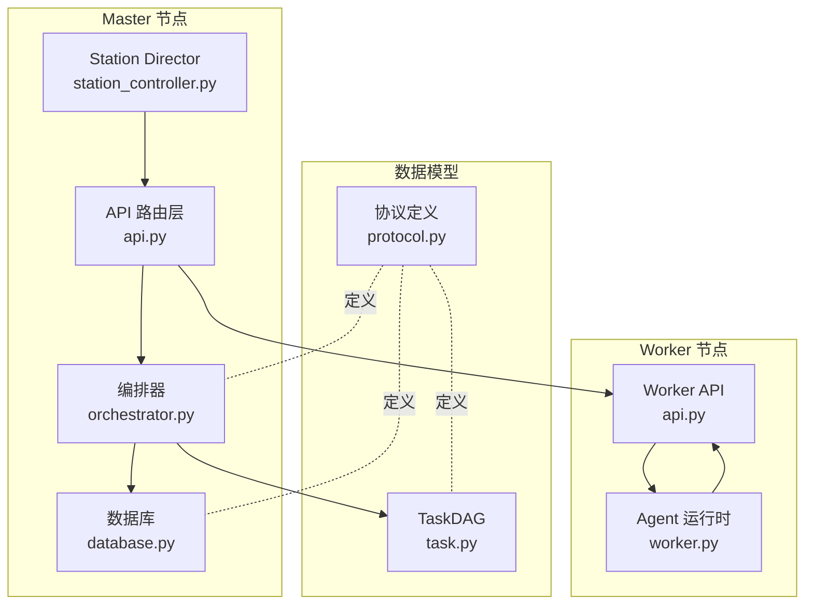
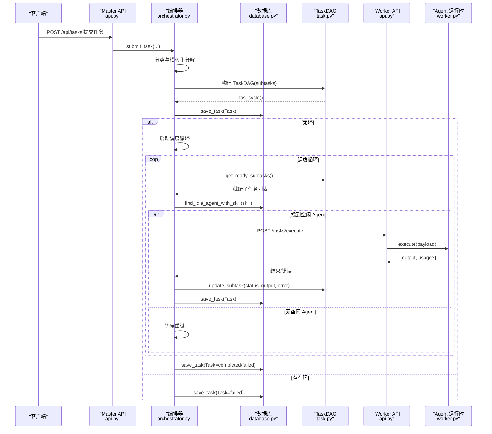
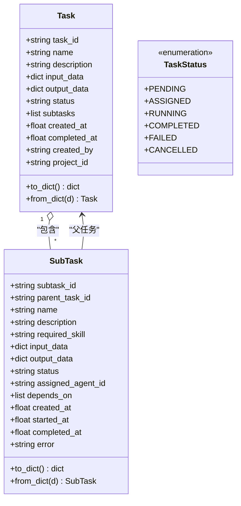
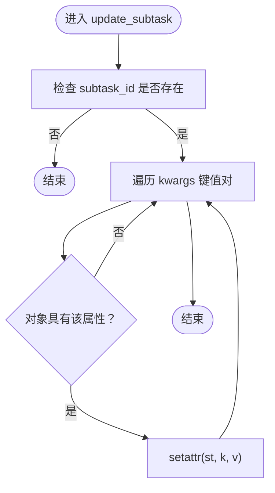
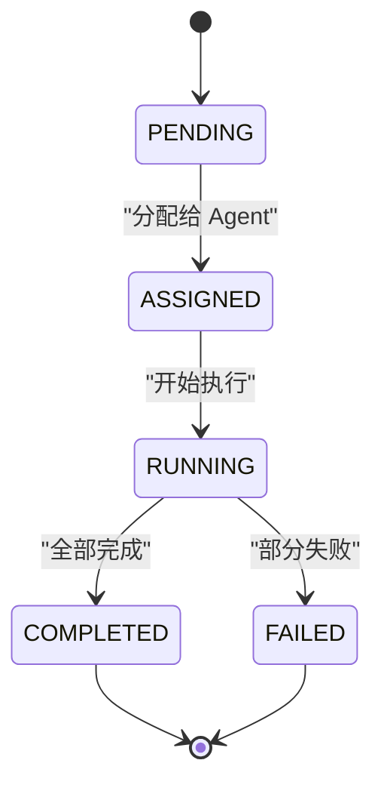
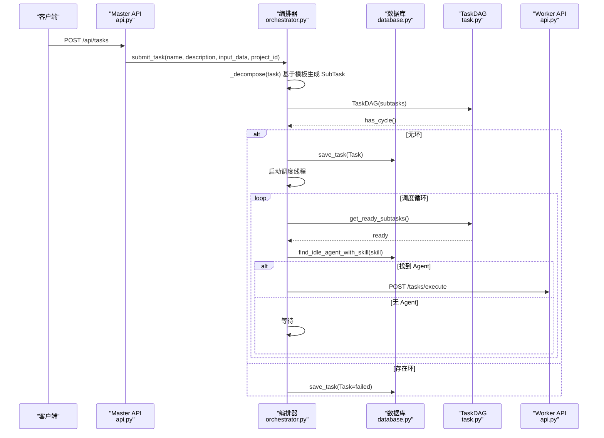
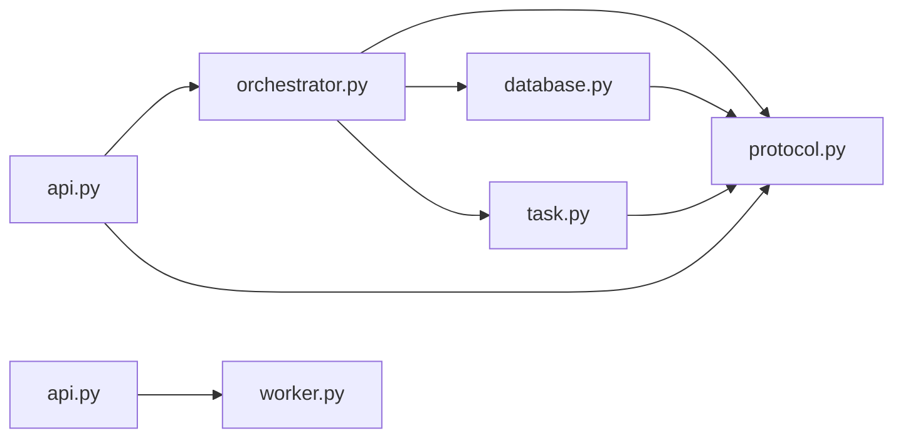

# 任务数据模型

<cite>
**本文引用的文件**
- [protocol.py](file://lan_mesh/protocol.py)
- [task.py](file://lan_mesh/task.py)
- [orchestrator.py](file://lan_mesh/orchestrator.py)
- [database.py](file://lan_mesh/database.py)
- [api.py](file://lan_mesh/api.py)
- [station_controller.py](file://lan_mesh/station_controller.py)
- [worker.py](file://lan_mesh/worker.py)
</cite>

## 目录
1. [简介](#简介)
2. [项目结构](#项目结构)
3. [核心组件](#核心组件)
4. [架构总览](#架构总览)
5. [详细组件分析](#详细组件分析)
6. [依赖关系分析](#依赖关系分析)
7. [性能考量](#性能考量)
8. [故障排查指南](#故障排查指南)
9. [结论](#结论)
10. [附录](#附录)

## 简介
本文件面向任务数据模型，系统性阐述 Task 与 SubTask 数据类的设计原则、字段定义、数据类型与约束；TaskDAG 的实现细节（邻接表、入度统计、Kahn 拓扑排序、就绪子任务筛选、循环依赖检测）；任务状态转换机制（pending → running → completed/failed）与生命周期管理；并提供数据模型关系图与任务创建/分解/执行的序列图，帮助读者快速理解与应用该模型。

## 项目结构
围绕任务数据模型的关键文件与职责：
- protocol.py：定义 Task、SubTask、TaskStatus 等核心数据模型与枚举，统一数据契约。
- task.py：实现 TaskDAG，负责子任务依赖图的构建、拓扑排序、就绪子任务筛选与状态更新。
- orchestrator.py：任务编排器，负责任务提交、模板化分解、DAG 构建、Agent 匹配、子任务分发与结果聚合。
- database.py：SQLite 存储层，提供任务、Agent、项目与消费记录的持久化。
- api.py：FastAPI 路由层，暴露任务提交等 API，并与编排器交互。
- station_controller.py：Station Director，集成编排器与数据库，提供 Web UI 与 API。
- worker.py：Worker 守护进程，注册到 Master，提供任务执行端点。

图表来源
- [api.py:103-326](file://lan_mesh/api.py#L103-L326)
- [orchestrator.py:58-108](file://lan_mesh/orchestrator.py#L58-L108)
- [database.py:16-143](file://lan_mesh/database.py#L16-L143)
- [station_controller.py](file://lan_mesh/station_controller.py#L67-L114)
- [worker.py:39-98](file://lan_mesh/worker.py#L39-L98)
- [protocol.py:237-298](file://lan_mesh/protocol.py#L237-L298)
- [task.py:16-91](file://lan_mesh/task.py#L16-L91)

章节来源
- [protocol.py:237-298](file://lan_mesh/protocol.py#L237-L298)
- [task.py:16-91](file://lan_mesh/task.py#L16-L91)
- [orchestrator.py:58-108](file://lan_mesh/orchestrator.py#L58-L108)
- [database.py:16-143](file://lan_mesh/database.py#L16-L143)
- [api.py:103-326](file://lan_mesh/api.py#L103-L326)
- [station_controller.py](file://lan_mesh/station_controller.py#L67-L114)
- [worker.py:39-98](file://lan_mesh/worker.py#L39-L98)

## 核心组件
本节聚焦 Task、SubTask 与 TaskDAG 的设计与实现要点。

- Task（顶层任务）
  - 字段概览：task_id、name、description、input_data、output_data、status、subtasks、created_at、completed_at、created_by、project_id。
  - 约束与语义：status 采用 TaskStatus 枚举；subtasks 为 SubTask 的字典列表；project_id 支持项目级隔离与预算控制。
  - 复杂度：序列化/反序列化 O(n)，其中 n 为 subtasks 数量。

- SubTask（子任务）
  - 字段概览：subtask_id、parent_task_id、name、description、required_skill、input_data、output_data、status、assigned_agent_id、depends_on、created_at、started_at、completed_at、error。
  - 约束与语义：depends_on 为前置 subtask_id 列表；status 采用 TaskStatus；required_skill 用于 Agent 匹配；error 记录失败原因。
  - 复杂度：序列化/反序列化 O(1)。

- TaskDAG（子任务有向无环图）
  - 数据结构：邻接表（被依赖 → 依赖它的任务列表）、入度映射（每个任务依赖数）。
  - 方法：
    - 构造：遍历 subtasks，建立邻接表与入度。
    - 拓扑排序：Kahn 算法，队列维护入度为 0 的节点。
    - 就绪子任务：筛选 pending 且所有依赖均 completed 的子任务。
    - 循环检测：若拓扑排序长度小于节点数，则存在环。
    - 状态汇总：判断是否全部完成或是否存在失败。
    - 更新：动态更新子任务字段（如 status、output_data、error）。
  - 复杂度：构造 O(V+E)，拓扑排序 O(V+E)，就绪筛选 O(V+E)。

章节来源
- [protocol.py:237-298](file://lan_mesh/protocol.py#L237-L298)
- [task.py:16-91](file://lan_mesh/task.py#L16-L91)

## 架构总览
任务从提交到执行的端到端流程如下：

图表来源
- [api.py:302-326](file://lan_mesh/api.py#L302-L326)
- [orchestrator.py:70-108](file://lan_mesh/orchestrator.py#L70-L108)
- [orchestrator.py:132-156](file://lan_mesh/orchestrator.py#L132-L156)
- [orchestrator.py:157-226](file://lan_mesh/orchestrator.py#L157-L226)
- [task.py:35-66](file://lan_mesh/task.py#L35-L66)
- [database.py:421-441](file://lan_mesh/database.py#L421-L441)

## 详细组件分析

### 数据模型类图
Task 与 SubTask 的字段与关系如下所示：

图表来源
- [protocol.py:237-298](file://lan_mesh/protocol.py#L237-L298)

章节来源
- [protocol.py:237-298](file://lan_mesh/protocol.py#L237-L298)

### TaskDAG 类实现与算法
- 构建阶段
  - 输入：List[SubTask]
  - 输出：内部结构 self.subtasks、self._dependents、self._in_degree
  - 复杂度：O(V+E)
- 拓扑排序（Kahn 算法）
  - 初始化：入度为 0 的节点入队
  - 迭代：弹出节点，加入结果，减少其后继节点入度，入度为 0 则入队
  - 复杂度：O(V+E)
- 就绪子任务筛选
  - 条件：status == "pending" 且 所有 depends_on 的子任务 status == "completed"
  - 复杂度：O(V+E)
- 循环依赖检测
  - 若拓扑排序结果长度 < 节点数，则存在环
- 状态汇总
  - 全部完成：所有子任务 status == "completed"
  - 存在失败：任一子任务 status == "failed"
- 动态更新
  - update_subtask：安全地更新子任务属性（如 status、output_data、error）

图表来源
- [task.py:80-86](file://lan_mesh/task.py#L80-L86)

章节来源
- [task.py:16-91](file://lan_mesh/task.py#L16-L91)

### 任务状态转换与生命周期
- 状态机（TaskStatus）
  - PENDING → ASSIGNED → RUNNING → COMPLETED/FAILED
  - 可取消（CANCELLED）
- 生命周期管理
  - 提交：生成 Task，分解为 SubTask，构建 DAG，检测环，保存至数据库
  - 调度：循环查找就绪子任务，匹配空闲 Agent，分发执行
  - 执行：Worker 接收 /tasks/execute，执行后回传结果/错误
  - 聚合：更新 DAG 与 Task，最终标记完成或失败
  - 持久化：每次状态变化同步写入数据库

图表来源
- [protocol.py:239-247](file://lan_mesh/protocol.py#L239-L247)
- [orchestrator.py:132-156](file://lan_mesh/orchestrator.py#L132-L156)
- [orchestrator.py:235-257](file://lan_mesh/orchestrator.py#L235-L257)

章节来源
- [protocol.py:239-247](file://lan_mesh/protocol.py#L239-L247)
- [orchestrator.py:132-156](file://lan_mesh/orchestrator.py#L132-L156)
- [orchestrator.py:235-257](file://lan_mesh/orchestrator.py#L235-L257)

### 任务创建/分解/执行序列图

图表来源
- [api.py:302-326](file://lan_mesh/api.py#L302-L326)
- [orchestrator.py:70-108](file://lan_mesh/orchestrator.py#L70-L108)
- [orchestrator.py:110-130](file://lan_mesh/orchestrator.py#L110-L130)
- [task.py:35-66](file://lan_mesh/task.py#L35-L66)

章节来源
- [api.py:302-326](file://lan_mesh/api.py#L302-L326)
- [orchestrator.py:70-108](file://lan_mesh/orchestrator.py#L70-L108)
- [orchestrator.py:110-130](file://lan_mesh/orchestrator.py#L110-L130)
- [task.py:35-66](file://lan_mesh/task.py#L35-L66)

## 依赖关系分析
- 编排器依赖
  - protocol：Task、SubTask、TaskStatus、AgentCard 等数据模型
  - database：任务与 Agent 的持久化
  - task：TaskDAG 依赖
- TaskDAG 依赖
  - protocol.SubTask：节点类型
  - collections.defaultdict、collections.deque：邻接表与队列
- 数据库依赖
  - protocol：Task、SubTask、AgentCard、Project、UsageRecord
  - sqlite3：持久化存储
- API 依赖
  - protocol：数据模型
  - orchestrator：任务提交入口
  - worker：子任务执行端点

图表来源
- [orchestrator.py:19-21](file://lan_mesh/orchestrator.py#L19-L21)
- [task.py:10-13](file://lan_mesh/task.py#L10-L13)
- [database.py:13](file://lan_mesh/database.py#L13)
- [api.py:33-34](file://lan_mesh/api.py#L33-L34)

章节来源
- [orchestrator.py:19-21](file://lan_mesh/orchestrator.py#L19-L21)
- [task.py:10-13](file://lan_mesh/task.py#L10-L13)
- [database.py:13](file://lan_mesh/database.py#L13)
- [api.py:33-34](file://lan_mesh/api.py#L33-L34)

## 性能考量
- 时间复杂度
  - TaskDAG 构建：O(V+E)，适合大规模子任务图
  - Kahn 拓扑排序：O(V+E)，避免 DFS 回溯开销
  - 就绪子任务筛选：O(V+E)，与依赖图规模线性相关
- 空间复杂度
  - 邻接表与入度映射：O(V+E)
  - 子任务字典：O(V)
- 并发与锁
  - 编排器使用线程锁保护活动 DAG 映射，避免并发修改
- I/O 优化
  - 数据库采用每线程独立连接，减少锁竞争
  - 任务状态变更异步持久化，降低阻塞

[本节为通用性能讨论，不直接分析具体文件]

## 故障排查指南
- 循环依赖
  - 现象：任务提交即失败，输出包含“子任务存在循环依赖”
  - 排查：检查 SubTask.depends_on 是否形成环；必要时调整模板或依赖关系
  - 参考：[orchestrator.py:92-94](file://lan_mesh/orchestrator.py#L92-L94)、[task.py:68-70](file://lan_mesh/task.py#L68-L70)
- 子任务失败
  - 现象：任务最终状态为 failed，子任务 error 字段记录错误
  - 排查：查看 Worker 端执行日志与返回；确认 Agent 能力与输入数据
  - 参考：[orchestrator.py:202-217](file://lan_mesh/orchestrator.py#L202-L217)、[task.py:76-78](file://lan_mesh/task.py#L76-L78)
- Agent 不可用
  - 现象：调度循环长时间无进展
  - 排查：确认 Agent 注册状态、空闲数量与所需技能匹配
  - 参考：[database.py:396-417](file://lan_mesh/database.py#L396-L417)、[orchestrator.py:150-154](file://lan_mesh/orchestrator.py#L150-L154)
- 数据库异常
  - 现象：保存任务失败或查询为空
  - 排查：检查 SQLite 文件权限、索引完整性与表结构兼容性
  - 参考：[database.py:421-441](file://lan_mesh/database.py#L421-L441)

章节来源
- [orchestrator.py:92-94](file://lan_mesh/orchestrator.py#L92-L94)
- [task.py:68-70](file://lan_mesh/task.py#L68-L70)
- [orchestrator.py:202-217](file://lan_mesh/orchestrator.py#L202-L217)
- [task.py:76-78](file://lan_mesh/task.py#L76-L78)
- [database.py:396-417](file://lan_mesh/database.py#L396-L417)
- [orchestrator.py:150-154](file://lan_mesh/orchestrator.py#L150-L154)
- [database.py:421-441](file://lan_mesh/database.py#L421-L441)

## 结论
本文系统梳理了任务数据模型的设计与实现，明确了 Task/SubTask 的字段与约束、TaskDAG 的构建与算法、任务状态转换与生命周期管理，并提供了端到端的流程图与序列图。该模型具备良好的可扩展性与可维护性，适用于多 Agent 协作的任务编排场景。

[本节为总结性内容，不直接分析具体文件]

## 附录
- 任务提交 API
  - 端点：POST /api/tasks
  - 请求体：name、description、input_data、created_by、project_id（可选）
  - 响应：Task 对象
  - 参考：[api.py:302-326](file://lan_mesh/api.py#L302-L326)
- 子任务执行 API
  - 端点：POST /tasks/execute
  - 请求体：subtask_id、parent_task_id、name、description、required_skill、input_data
  - 响应：执行结果与可选 usage
  - 参考：[api.py:54-60](file://lan_mesh/api.py#L54-L60)
- 数据模型持久化
  - 表：tasks、agents、projects、usage_log
  - 参考：[database.py:92-136](file://lan_mesh/database.py#L92-L136)

章节来源
- [api.py:302-326](file://lan_mesh/api.py#L302-L326)
- [api.py:54-60](file://lan_mesh/api.py#L54-L60)
- [database.py:92-136](file://lan_mesh/database.py#L92-L136)
