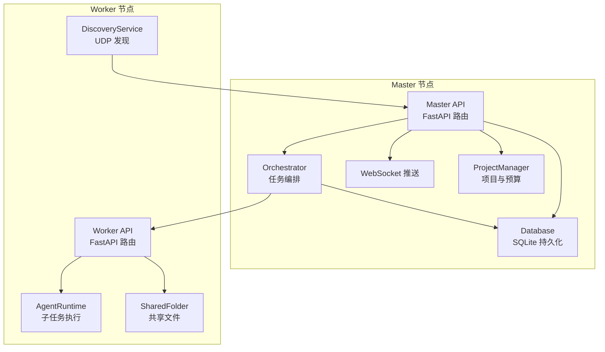
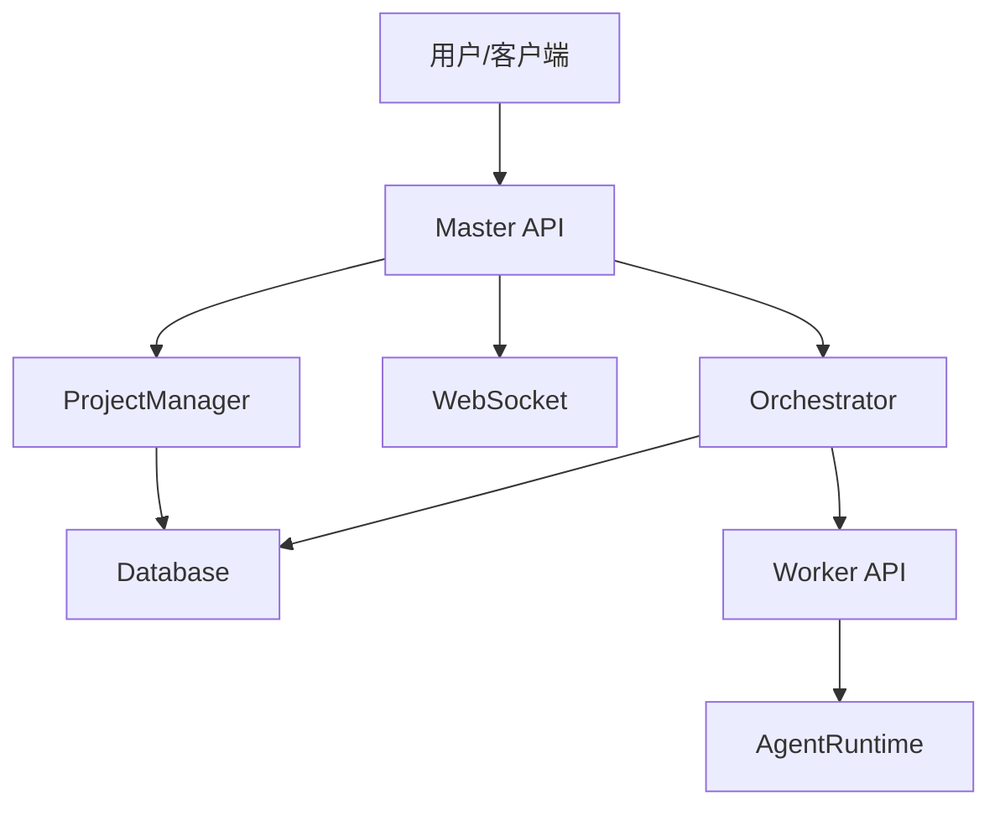
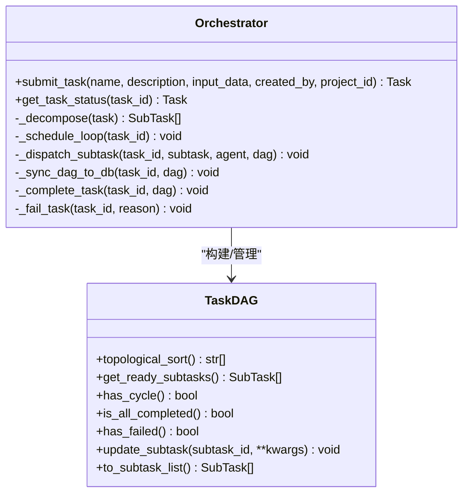
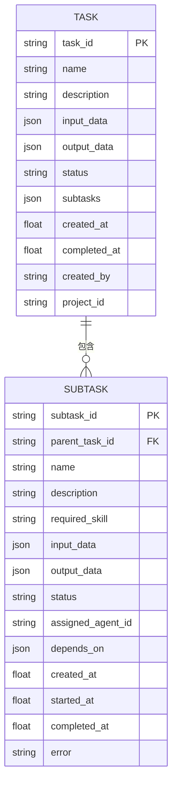
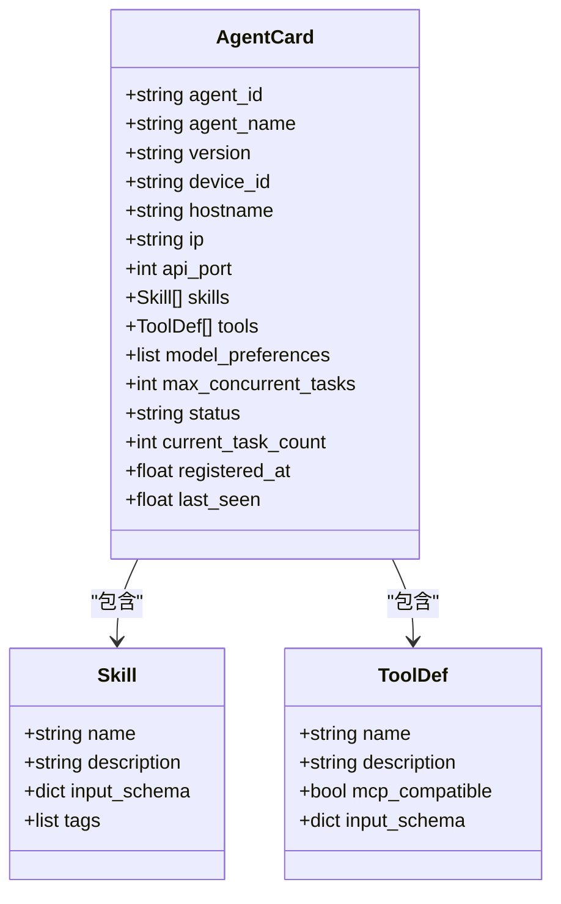
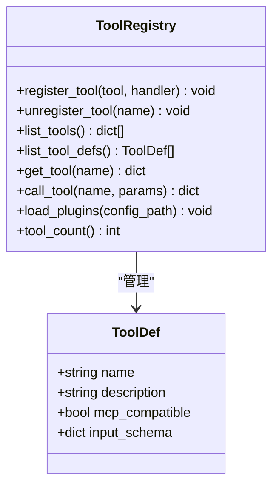
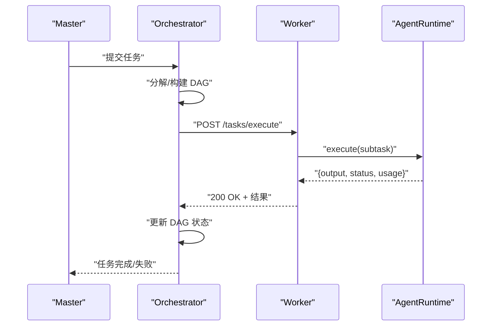
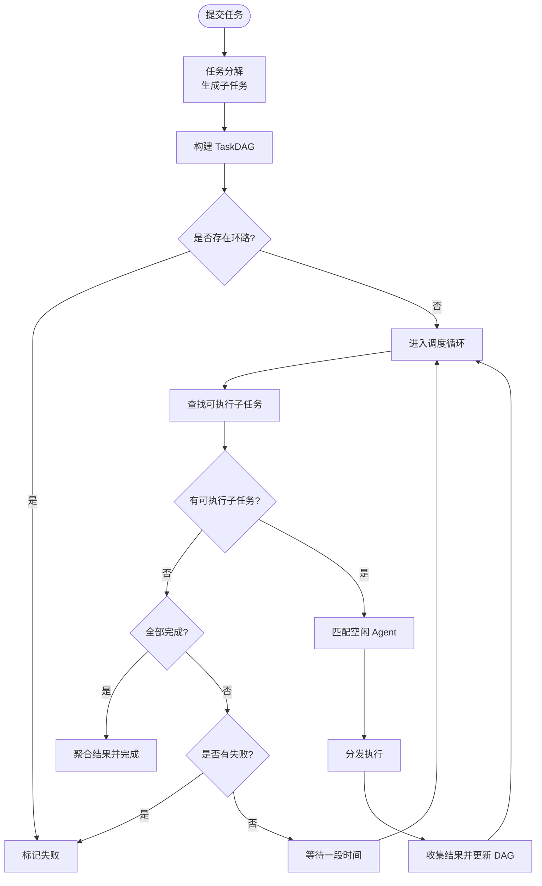
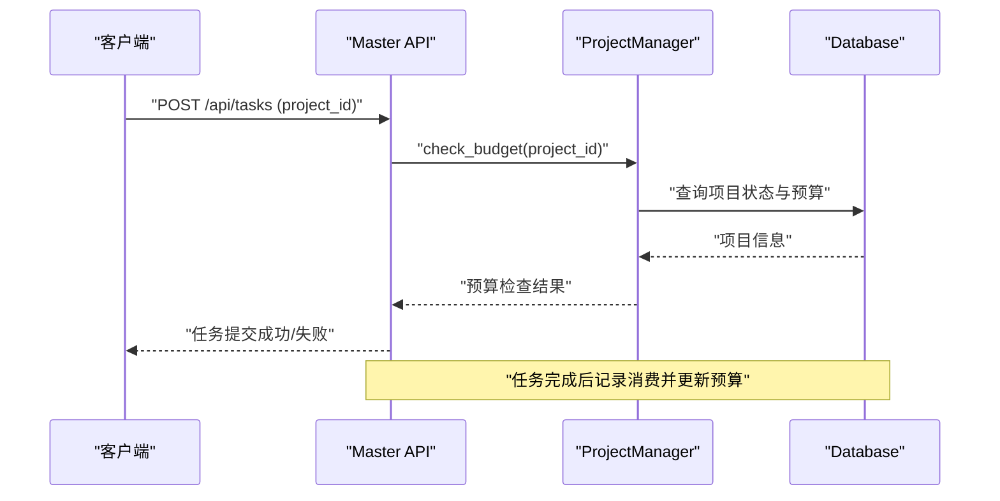
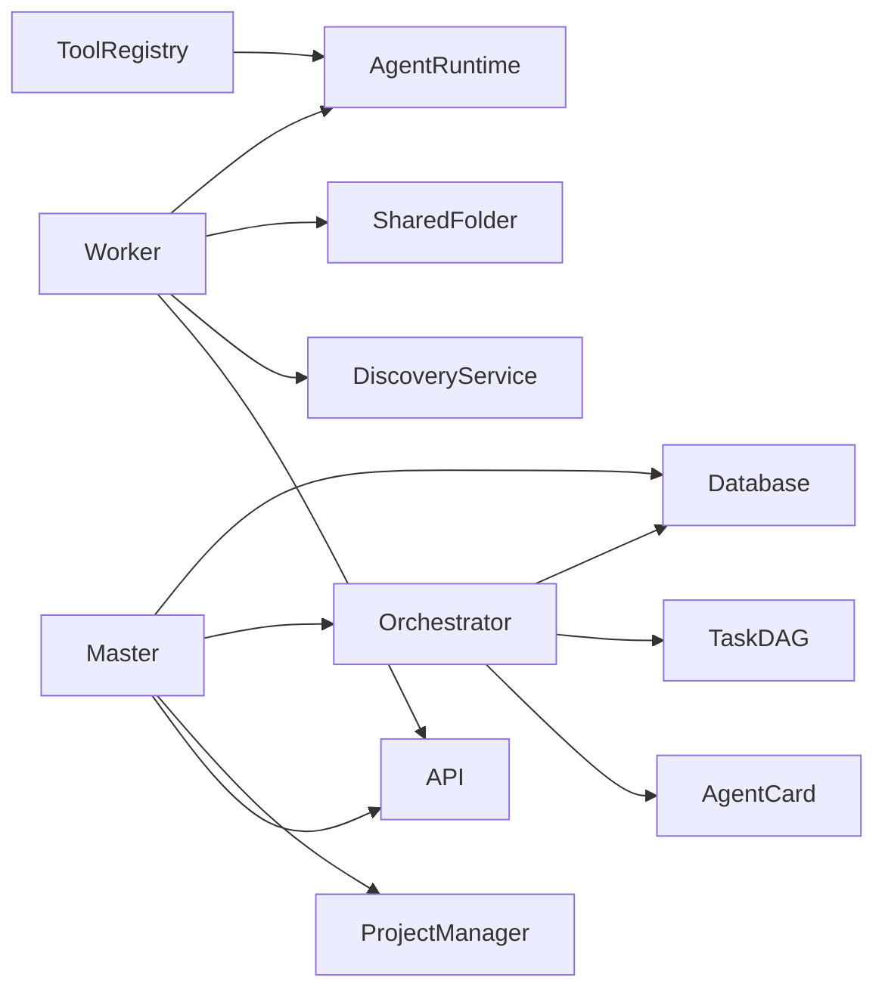

# 任务编排系统

<cite>
**本文引用的文件**
- [orchestrator.py](file://lan_mesh/orchestrator.py)
- [task.py](file://lan_mesh/task.py)
- [tool_registry.py](file://lan_mesh/tool_registry.py)
- [agent_runtime.py](file://lan_mesh/agent_runtime.py)
- [worker.py](file://lan_mesh/worker.py)
- [database.py](file://lan_mesh/database.py)
- [protocol.py](file://lan_mesh/protocol.py)
- [station_controller.py](file://lan_mesh/station_controller.py)
- [api.py](file://lan_mesh/api.py)
- [config.py](file://lan_mesh/config.py)
- [project.py](file://lan_mesh/project.py)
- [config.yaml](file://config.yaml)
</cite>

## 目录
1. [简介](#简介)
2. [项目结构](#项目结构)
3. [核心组件](#核心组件)
4. [架构总览](#架构总览)
5. [详细组件分析](#详细组件分析)
6. [依赖关系分析](#依赖关系分析)
7. [性能考量](#性能考量)
8. [故障排查指南](#故障排查指南)
9. [结论](#结论)
10. [附录](#附录)

## 简介
本任务编排系统基于有向无环图（DAG）实现分布式任务调度，采用“Master-Worker”架构：Master 负责任务编排、Agent 能力注册与匹配、项目预算与消费追踪；Worker 负责节点发现、心跳上报、任务执行与文件共享。系统支持规则驱动的任务分解、基于技能的 Agent 匹配、拓扑排序的 DAG 调度、以及 MCP 工具网关的插件化工具体系。

## 项目结构
系统主要模块分布如下：
- Master 控制器：负责节点发现、注册、心跳、Web UI、任务提交与项目管理
- Worker 守护进程：负责节点发现、注册、心跳、任务执行、共享文件管理
- Orchestrator 编排器：负责任务分解、构建 DAG、调度与结果聚合
- TaskDAG：负责子任务依赖管理与拓扑排序
- AgentRuntime：负责子任务执行与 LLM 工具调用
- ToolRegistry：工具注册与执行调度
- Database：SQLite 存储层，持久化主机、Agent、任务、项目与消费记录
- Protocol：统一的数据模型与协议定义
- API：FastAPI 路由层，提供 HTTP/WebSocket 接口
- Config：配置管理与加载
- Project：项目管理与预算控制

图表来源
- [station_controller.py](file://lan_mesh/station_controller.py#L67-L324)
- [worker.py:62-325](file://lan_mesh/worker.py#L62-L325)
- [api.py:103-526](file://lan_mesh/api.py#L103-L526)
- [database.py:16-611](file://lan_mesh/database.py#L16-L611)
- [orchestrator.py:58-262](file://lan_mesh/orchestrator.py#L58-L262)

章节来源
- [station_controller.py](file://lan_mesh/station_controller.py#L1-L324)
- [worker.py:1-325](file://lan_mesh/worker.py#L1-L325)
- [api.py:1-539](file://lan_mesh/api.py#L1-L539)
- [database.py:1-611](file://lan_mesh/database.py#L1-L611)
- [config.py:1-84](file://lan_mesh/config.py#L1-L84)
- [config.yaml:1-22](file://config.yaml#L1-L22)

## 核心组件
- Orchestrator：任务提交、分解、构建 DAG、调度循环、结果聚合与状态管理
- TaskDAG：子任务依赖图、拓扑排序、可执行子任务筛选、循环检测
- AgentRuntime：子任务执行、技能路由、LLM API 调用、工具执行
- ToolRegistry：工具注册、插件加载、工具调用
- Database：主机、Agent、任务、项目、消费记录的持久化
- Protocol：统一的数据模型（Task/SubTask、AgentCard、HostInfo 等）
- API：Master/Worker 的 HTTP 与 WebSocket 接口
- ProjectManager：项目生命周期、预算检查、消费记录与模型路由

章节来源
- [orchestrator.py:58-262](file://lan_mesh/orchestrator.py#L58-L262)
- [task.py:16-91](file://lan_mesh/task.py#L16-L91)
- [agent_runtime.py:28-242](file://lan_mesh/agent_runtime.py#L28-L242)
- [tool_registry.py:217-338](file://lan_mesh/tool_registry.py#L217-L338)
- [database.py:16-611](file://lan_mesh/database.py#L16-L611)
- [protocol.py:1-356](file://lan_mesh/protocol.py#L1-L356)
- [api.py:1-539](file://lan_mesh/api.py#L1-L539)
- [project.py:62-320](file://lan_mesh/project.py#L62-L320)

## 架构总览
系统采用“Master-Worker”分布式架构：
- Master 节点提供 Web UI、任务提交、Agent 注册与心跳、项目预算控制、DAG 调度与状态聚合
- Worker 节点提供发现、注册、心跳、子任务执行、共享文件管理
- 通信基于 HTTP/HTTPS 与 WebSocket，数据持久化于 SQLite

图表来源
- [station_controller.py](file://lan_mesh/station_controller.py#L67-L324)
- [api.py:103-526](file://lan_mesh/api.py#L103-L526)
- [orchestrator.py:58-262](file://lan_mesh/orchestrator.py#L58-L262)
- [database.py:16-611](file://lan_mesh/database.py#L16-L611)
- [project.py:62-320](file://lan_mesh/project.py#L62-L320)

## 详细组件分析

### Orchestrator 类：任务编排与 DAG 调度
- 任务提交与分解：根据任务描述关键词分类，选择预置模板，生成子任务列表
- DAG 构建与校验：将子任务构建成 TaskDAG，检测循环依赖
- 调度循环：持续查找可执行子任务，匹配空闲 Agent，异步分发执行
- 结果聚合：收集 Worker 返回结果，聚合到顶层任务，更新状态与输出
- 状态管理：支持 pending → running → completed/failed 的状态流转

图表来源
- [orchestrator.py:58-262](file://lan_mesh/orchestrator.py#L58-L262)
- [task.py:16-91](file://lan_mesh/task.py#L16-L91)

章节来源
- [orchestrator.py:58-262](file://lan_mesh/orchestrator.py#L58-L262)
- [task.py:16-91](file://lan_mesh/task.py#L16-L91)

### Task 与 SubTask 数据模型
- Task：顶层任务，包含任务元数据、子任务列表、状态与输出
- SubTask：子任务节点，包含依赖关系、分配 Agent、状态与输出
- 依赖关系：SubTask.depends_on 指向前置子任务 ID，形成 DAG

图表来源
- [protocol.py:237-298](file://lan_mesh/protocol.py#L237-L298)

章节来源
- [protocol.py:237-298](file://lan_mesh/protocol.py#L237-L298)

### Agent 能力匹配与 AgentCard
- AgentCard：声明 Agent 的技能、工具、并发限制与状态
- 匹配策略：按技能名称匹配，优先空闲 Agent，按当前任务数升序选择
- Worker 注册：Worker 启动后生成 AgentCard 并注册到 Master

图表来源
- [protocol.py:159-234](file://lan_mesh/protocol.py#L159-L234)

章节来源
- [protocol.py:159-234](file://lan_mesh/protocol.py#L159-L234)
- [database.py:396-417](file://lan_mesh/database.py#L396-L417)

### ToolRegistry：工具注册与执行
- 内置工具：文件读写、Shell 执行、HTTP 请求、目录列举、Python 评估等
- 插件加载：从 YAML 配置动态导入模块并注册工具
- 工具调用：根据工具名路由到对应处理器，返回 MCP 兼容格式

图表来源
- [tool_registry.py:217-338](file://lan_mesh/tool_registry.py#L217-L338)

章节来源
- [tool_registry.py:1-338](file://lan_mesh/tool_registry.py#L1-L338)

### AgentRuntime：子任务执行策略
- 技能路由：根据 required_skill 调用相应处理器
- LLM API：优先 DeepSeek，其次 OpenAI，返回内容与 token 用量
- 本地工具：Shell 执行、文件操作、系统监控等
- 错误处理：捕获异常并返回失败状态

图表来源
- [orchestrator.py:157-226](file://lan_mesh/orchestrator.py#L157-L226)
- [api.py:54-60](file://lan_mesh/api.py#L54-L60)
- [agent_runtime.py:47-75](file://lan_mesh/agent_runtime.py#L47-L75)

章节来源
- [agent_runtime.py:28-242](file://lan_mesh/agent_runtime.py#L28-L242)
- [api.py:39-98](file://lan_mesh/api.py#L39-L98)

### DAG 调度流程图
- 任务提交后分解为子任务，构建 TaskDAG
- 调度循环持续扫描可执行子任务（依赖满足且状态为 pending）
- 匹配空闲 Agent，分发执行，等待结果
- 成功则更新子任务状态，失败则标记失败
- 全部完成后聚合输出，否则根据失败情况终止

图表来源
- [orchestrator.py:132-156](file://lan_mesh/orchestrator.py#L132-L156)
- [task.py:54-78](file://lan_mesh/task.py#L54-L78)

章节来源
- [orchestrator.py:132-156](file://lan_mesh/orchestrator.py#L132-L156)
- [task.py:54-78](file://lan_mesh/task.py#L54-L78)

### 项目预算与消费追踪
- 项目隔离：每个项目拥有独立工作空间、预算与模型白名单
- 预算检查：任务提交前检查项目状态与预算
- 消费记录：记录每次 LLM 调用的 token 用量与成本
- 路由策略：根据预算使用率与策略推荐经济模型

图表来源
- [api.py:302-326](file://lan_mesh/api.py#L302-L326)
- [project.py:176-197](file://lan_mesh/project.py#L176-L197)
- [database.py:589-610](file://lan_mesh/database.py#L589-L610)

章节来源
- [project.py:62-320](file://lan_mesh/project.py#L62-L320)
- [database.py:589-610](file://lan_mesh/database.py#L589-L610)
- [api.py:302-326](file://lan_mesh/api.py#L302-L326)

## 依赖关系分析
- 组件耦合
  - Orchestrator 依赖 Database、TaskDAG、AgentCard
  - Worker 依赖 DiscoveryService、SharedFolder、AgentRuntime、API
  - Master 依赖 DiscoveryService、Database、Orchestrator、ProjectManager、API
  - ToolRegistry 与 AgentRuntime 解耦，便于插件化扩展
- 外部依赖
  - HTTP/HTTPS 通信（requests）
  - FastAPI/Uvicorn（Web 服务）
  - SQLite（持久化）
  - YAML（配置与插件定义）

图表来源
- [orchestrator.py:19-21](file://lan_mesh/orchestrator.py#L19-L21)
- [worker.py:28-44](file://lan_mesh/worker.py#L28-L44)
- [station_controller.py](file://lan_mesh/station_controller.py#L32-L45)
- [tool_registry.py:24-25](file://lan_mesh/tool_registry.py#L24-L25)

章节来源
- [orchestrator.py:19-21](file://lan_mesh/orchestrator.py#L19-L21)
- [worker.py:28-44](file://lan_mesh/worker.py#L28-L44)
- [station_controller.py](file://lan_mesh/station_controller.py#L32-L45)
- [tool_registry.py:24-25](file://lan_mesh/tool_registry.py#L24-L25)

## 性能考量
- 调度轮询：调度循环每 2 秒检查一次，避免频繁 IO
- 线程模型：调度与执行均使用多线程，提升并发能力
- 数据库：每个线程独立连接，减少锁竞争
- LLM 调用：优先 DeepSeek，其次 OpenAI，降低延迟与成本
- 工具执行：Shell 与文件操作本地执行，减少网络开销

## 故障排查指南
- 任务状态异常
  - 检查 DAG 是否存在循环依赖
  - 查看子任务状态与错误信息
- Agent 匹配失败
  - 确认 AgentCard 的技能声明与任务 required_skill 一致
  - 检查 Agent 状态是否为空闲
- Worker 心跳丢失
  - 检查网络连通性与端口占用
  - 查看 Master 日志与 WebSocket 推送
- LLM 调用失败
  - 检查 DEEPSEEK_API_KEY 或 OPENAI_API_KEY 环境变量
  - 查看返回的错误信息与 token 用量
- 工具调用失败
  - 检查工具定义与输入参数
  - 查看插件加载日志

章节来源
- [orchestrator.py:200-226](file://lan_mesh/orchestrator.py#L200-L226)
- [agent_runtime.py:172-241](file://lan_mesh/agent_runtime.py#L172-L241)
- [database.py:396-417](file://lan_mesh/database.py#L396-L417)

## 结论
该任务编排系统通过 DAG 与 Agent 能力匹配实现了灵活的分布式任务调度，结合项目预算与消费追踪提供了成本控制能力。系统模块清晰、扩展性强，适合在局域网环境中部署与运维。

## 附录
- 配置文件位置与加载顺序
  - 显式指定路径
  - 环境变量 LAN_MESH_CONFIG
  - ~/.lan_mesh/config.yaml
  - ./config.yaml
- 常用端口
  - Discovery：45454
  - Worker API：45460
  - Master API + Web UI：45470

章节来源
- [config.py:48-84](file://lan_mesh/config.py#L48-L84)
- [config.yaml:1-22](file://config.yaml#L1-L22)
