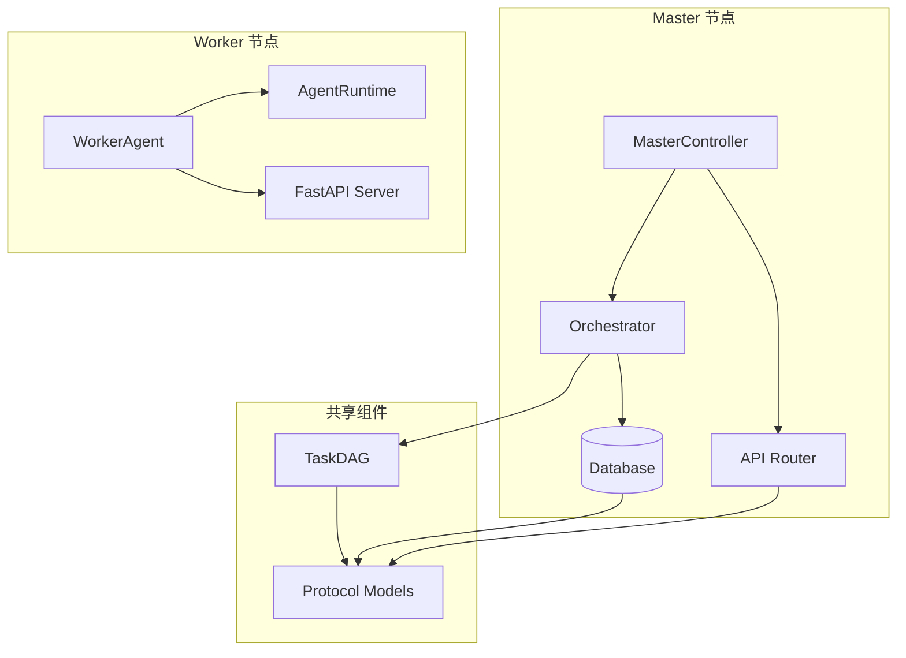
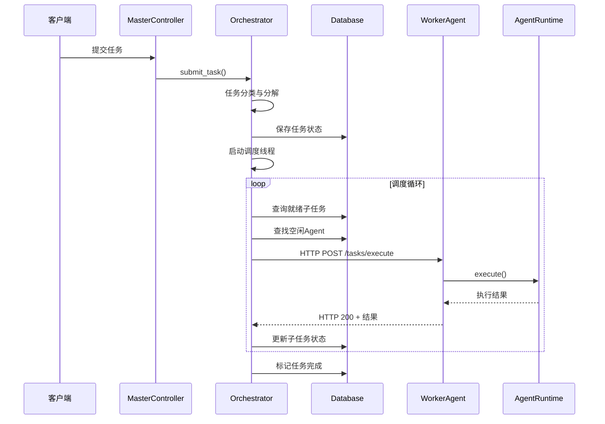
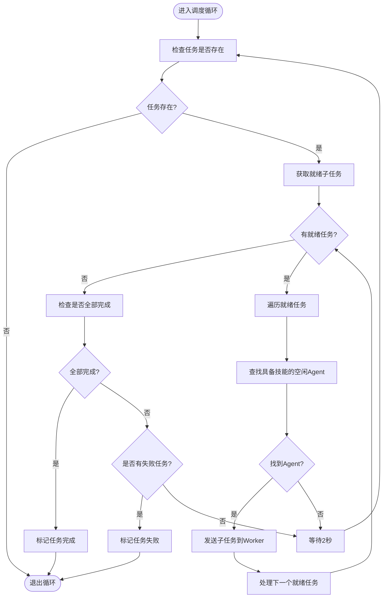
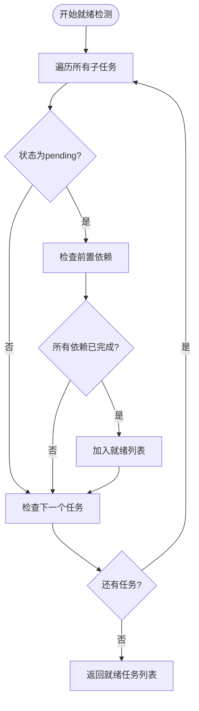
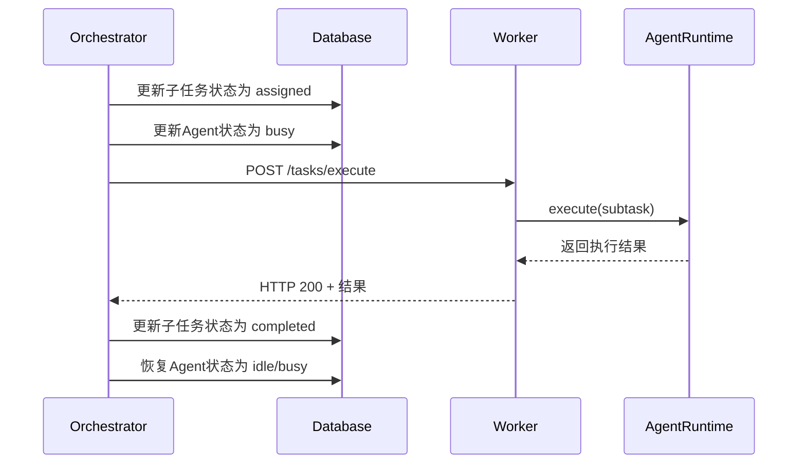
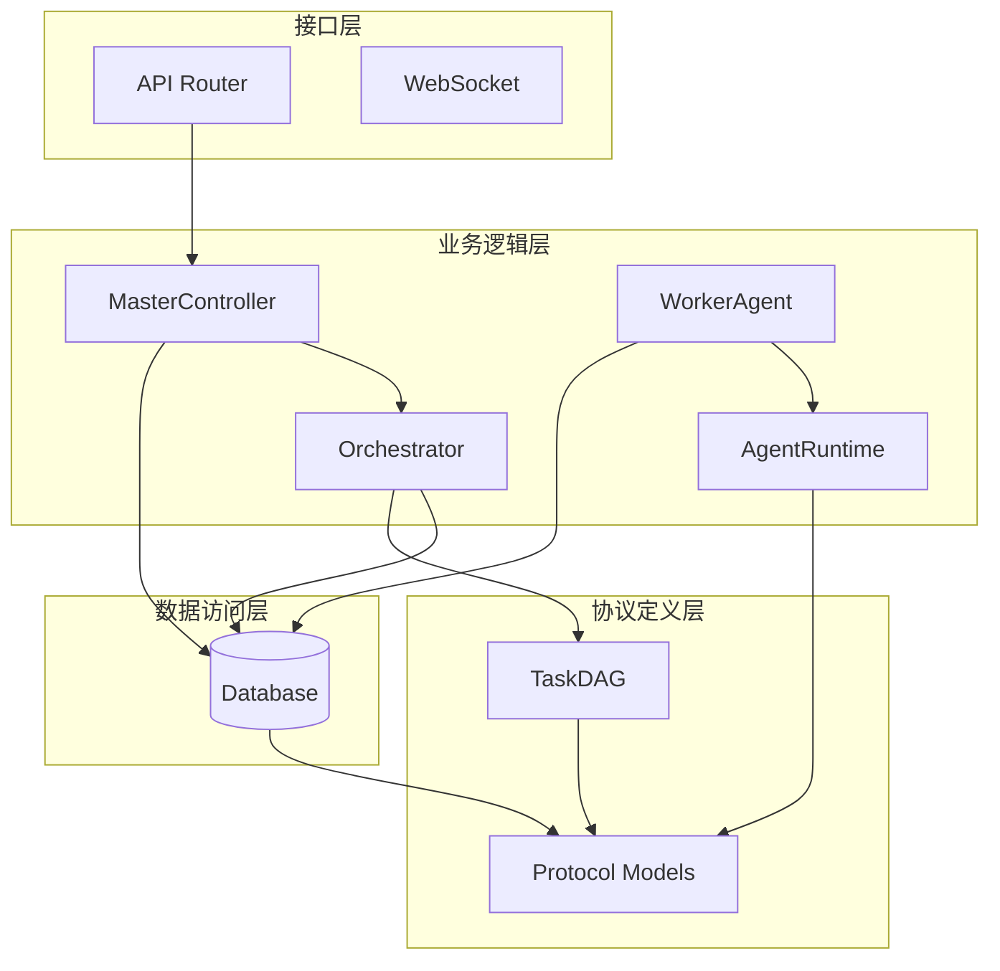

# 任务调度机制

<cite>
**本文引用的文件**
- [orchestrator.py](file://lan_mesh/orchestrator.py)
- [task.py](file://lan_mesh/task.py)
- [database.py](file://lan_mesh/database.py)
- [protocol.py](file://lan_mesh/protocol.py)
- [api.py](file://lan_mesh/api.py)
- [worker.py](file://lan_mesh/worker.py)
- [agent_runtime.py](file://lan_mesh/agent_runtime.py)
- [station_controller.py](file://lan_mesh/station_controller.py)
</cite>

## 目录
1. [引言](#引言)
2. [项目结构](#项目结构)
3. [核心组件](#核心组件)
4. [架构概览](#架构概览)
5. [详细组件分析](#详细组件分析)
6. [依赖关系分析](#依赖关系分析)
7. [性能考虑](#性能考虑)
8. [故障排除指南](#故障排除指南)
9. [结论](#结论)

## 引言

本文档深入解析 LAN Mesh 项目中的任务调度机制，重点阐述 Orchestrator 类的核心调度算法，包括 `_schedule_loop` 方法的循环调度逻辑。文档详细说明子任务就绪检测机制、Agent 匹配算法和负载均衡策略，解释任务分发过程（包括 HTTP 请求构建、Worker 代理调用和异步结果收集），并分析并发控制机制（线程锁使用、Agent 状态管理和任务计数控制）。同时提供调度流程图和状态转换图，展示从任务提交到完成的完整调度过程。

## 项目结构

LAN Mesh 项目采用模块化设计，主要包含以下核心模块：

**图表来源**
- [station_controller.py](file://lan_mesh/station_controller.py#L67-L114)
- [orchestrator.py:58-108](file://lan_mesh/orchestrator.py#L58-L108)
- [worker.py:62-114](file://lan_mesh/worker.py#L62-L114)

**章节来源**
- [station_controller.py](file://lan_mesh/station_controller.py#L1-L324)
- [orchestrator.py:1-262](file://lan_mesh/orchestrator.py#L1-L262)
- [worker.py:1-325](file://lan_mesh/worker.py#L1-L325)

## 核心组件

### Orchestrator 类（任务编排器）

Orchestrator 是 Master 节点的核心组件，负责任务分解、Agent 匹配、子任务分发与结果聚合。其主要职责包括：

- **任务分类与分解**：根据任务描述关键词自动分类，并生成相应的子任务模板
- **DAG 构建**：将子任务构建成有向无环图，确保依赖关系正确
- **Agent 匹配**：查找具备所需技能的空闲 Agent
- **任务分发**：通过 HTTP 请求将子任务分发给 Worker
- **结果聚合**：收集子任务结果并聚合为最终输出

### TaskDAG 类（任务依赖图）

TaskDAG 实现了子任务的依赖关系管理，支持拓扑排序和就绪任务检测：

- **邻接表表示**：使用被依赖 → 依赖它的任务列表的映射
- **入度计算**：跟踪每个任务需要等待的前置任务数量
- **就绪检测**：基于入度为 0 和前置任务完成状态判断可执行任务

### Database 类（数据存储层）

提供线程安全的 SQLite 数据库存储，支持 Agent、任务和主机信息的持久化：

- **线程本地连接**：每个线程维护独立的数据库连接
- **Agent 状态管理**：支持 Agent 的状态查询和更新
- **任务生命周期管理**：支持任务的创建、更新和查询

**章节来源**
- [orchestrator.py:58-108](file://lan_mesh/orchestrator.py#L58-L108)
- [task.py:16-91](file://lan_mesh/task.py#L16-L91)
- [database.py:16-611](file://lan_mesh/database.py#L16-L611)

## 架构概览

系统采用分布式架构，Master 节点负责协调，Worker 节点负责执行：

**图表来源**
- [orchestrator.py:132-156](file://lan_mesh/orchestrator.py#L132-L156)
- [api.py:54-60](file://lan_mesh/api.py#L54-L60)
- [agent_runtime.py:47-75](file://lan_mesh/agent_runtime.py#L47-L75)

## 详细组件分析

### Orchestrator 核心调度算法

#### 任务提交与初始化

当用户提交任务时，Orchestrator 执行以下流程：

1. **任务创建**：生成唯一任务ID，初始化任务状态为 "pending"
2. **任务分解**：根据任务描述关键词自动分类，应用相应的子任务模板
3. **DAG 构建**：将子任务构建成有向无环图，检查循环依赖
4. **状态更新**：将任务状态设为 "running" 并保存到数据库
5. **异步调度**：启动独立的调度线程开始任务分发

#### _schedule_loop 循环调度逻辑

调度循环是 Orchestrator 的核心，采用轮询机制持续检查和分发任务：

**图表来源**
- [orchestrator.py:132-156](file://lan_mesh/orchestrator.py#L132-L156)

#### 子任务就绪检测机制

就绪检测基于两个条件：
1. **状态检查**：子任务状态必须为 "pending"
2. **依赖检查**：所有前置依赖任务必须已完成

TaskDAG 提供了高效的就绪检测算法：

**图表来源**
- [task.py:54-66](file://lan_mesh/task.py#L54-L66)

#### Agent 匹配算法

Agent 匹配采用"技能匹配 + 负载均衡"的策略：

1. **技能匹配**：查询具备指定技能的 Agent
2. **负载均衡**：在同一技能范围内选择当前任务数最少的 Agent
3. **状态检查**：确保 Agent 处于 "idle" 状态

匹配算法的关键实现：
- 使用 SQL 查询按 `current_task_count` 升序排列
- 逐个检查 Agent 的技能列表，确认技能名称匹配
- 返回第一个匹配的空闲 Agent

#### 负载均衡策略

系统实现了多层级的负载均衡：

1. **Agent 级别**：同一技能下选择任务数最少的 Agent
2. **Worker 级别**：不同 Worker 间均匀分配任务
3. **时间级别**：通过轮询机制避免热点竞争

#### 任务分发过程

任务分发采用异步 HTTP 调用模式：

**图表来源**
- [orchestrator.py:157-226](file://lan_mesh/orchestrator.py#L157-L226)
- [api.py:54-60](file://lan_mesh/api.py#L54-L60)
- [agent_runtime.py:47-75](file://lan_mesh/agent_runtime.py#L47-L75)

#### 并发控制机制

系统采用多层并发控制确保数据一致性：

1. **线程锁保护**：使用 `threading.Lock()` 保护共享状态访问
2. **数据库事务**：每个线程维护独立的数据库连接，避免锁争用
3. **Agent 状态原子性**：状态更新和任务计数调整在单个数据库操作中完成
4. **异步执行**：子任务执行采用独立线程，避免阻塞主调度循环

**章节来源**
- [orchestrator.py:67-108](file://lan_mesh/orchestrator.py#L67-L108)
- [orchestrator.py:132-226](file://lan_mesh/orchestrator.py#L132-L226)
- [task.py:54-91](file://lan_mesh/task.py#L54-L91)
- [database.py:28-34](file://lan_mesh/database.py#L28-L34)

### Worker 执行引擎

WorkerAgent 在每个主机上部署，提供以下功能：

- **自动注册**：通过 UDP 发现 Master 并进行 HTTP 注册
- **心跳维护**：定期发送心跳保持在线状态
- **任务执行**：接收 Master 分发的任务并执行
- **状态上报**：通过共享文件夹提供配置信息

AgentRuntime 实现了多种技能处理器：

| 技能类型 | 处理器 | 功能 |
|---------|--------|------|
| code_generation | _handle_code_generation | 调用 LLM API 生成代码 |
| code_review | _handle_code_review | 调用 LLM API 审查代码 |
| document_summary | _handle_document_summary | 调用 LLM API 生成摘要 |
| rag_search | _handle_rag_search | 预留 RAG 检索接口 |
| shell_exec | _handle_shell_exec | 执行 Shell 命令 |
| file_ops | _handle_file_ops | 文件读写操作 |
| monitoring | _handle_monitoring | 系统资源监控 |

**章节来源**
- [worker.py:62-325](file://lan_mesh/worker.py#L62-L325)
- [agent_runtime.py:28-242](file://lan_mesh/agent_runtime.py#L28-L242)

## 依赖关系分析

系统采用清晰的分层架构，各组件间依赖关系如下：

**图表来源**
- [station_controller.py](file://lan_mesh/station_controller.py#L105-L113)
- [orchestrator.py:19-21](file://lan_mesh/orchestrator.py#L19-L21)
- [worker.py:43-44](file://lan_mesh/worker.py#L43-L44)

### 关键依赖链

1. **MasterController → Orchestrator → Database**：主控制器持有编排器实例，编排器通过数据库访问 Agent 和任务状态
2. **Orchestrator → TaskDAG → Protocol**：编排器使用任务 DAG 管理子任务依赖，依赖协议模型定义数据结构
3. **WorkerAgent → AgentRuntime → Protocol**：Worker 侧执行引擎依赖协议模型进行任务处理
4. **API Router → MasterController**：API 路由器将外部请求转发给主控制器处理

**章节来源**
- [station_controller.py](file://lan_mesh/station_controller.py#L105-L113)
- [orchestrator.py:19-21](file://lan_mesh/orchestrator.py#L19-L21)
- [worker.py:43-44](file://lan_mesh/worker.py#L43-L44)

## 性能考虑

### 并发优化策略

1. **线程池管理**：使用独立线程处理子任务执行，避免阻塞主调度循环
2. **数据库连接池**：每个线程维护独立的数据库连接，减少锁争用
3. **异步 I/O**：HTTP 请求采用异步模式，提高吞吐量
4. **缓存机制**：Agent 状态和任务信息在内存中缓存，减少数据库访问

### 调度效率优化

1. **增量更新**：只更新发生变化的状态，避免全量同步
2. **批量操作**：多个子任务完成后一次性更新数据库
3. **智能等待**：在没有就绪任务时采用指数退避策略
4. **负载感知**：根据 Agent 当前负载智能分配任务

### 资源管理

1. **内存管理**：及时清理完成的任务和过期的 Agent 状态
2. **网络优化**：合理设置 HTTP 超时和重试机制
3. **存储优化**：定期清理过期的心跳记录和使用日志

## 故障排除指南

### 常见问题诊断

1. **任务卡在 pending 状态**
   - 检查子任务依赖关系是否形成循环
   - 验证前置任务是否成功完成
   - 确认 Agent 是否具备所需技能

2. **Agent 匹配失败**
   - 检查 Agent 注册状态和技能声明
   - 验证 Agent 是否处于空闲状态
   - 确认 Agent 的最大并发任务数配置

3. **Worker 执行超时**
   - 检查 Worker 网络连通性
   - 验证 Worker 是否正常运行
   - 检查 LLM API 密钥配置

### 调试技巧

1. **启用详细日志**：观察任务状态变化和 Agent 匹配过程
2. **监控数据库状态**：检查任务和 Agent 的实时状态
3. **验证网络连接**：确保 Master 和 Worker 之间的通信正常
4. **检查资源使用**：监控 CPU、内存和磁盘使用情况

**章节来源**
- [orchestrator.py:235-258](file://lan_mesh/orchestrator.py#L235-L258)
- [database.py:396-418](file://lan_mesh/database.py#L396-L418)

## 结论

LAN Mesh 的任务调度机制展现了现代分布式系统的最佳实践：

1. **模块化设计**：清晰的职责分离和接口定义
2. **高可用性**：多层冗余和故障恢复机制
3. **可扩展性**：支持动态添加 Worker 节点
4. **可观测性**：完整的日志记录和状态监控
5. **性能优化**：多层并发控制和资源管理

该调度系统通过精心设计的算法和架构，实现了高效的任务分发和执行，为大规模分布式任务处理提供了可靠的基础设施。未来可以在以下方面进一步优化：引入更智能的负载预测算法、实现任务优先级调度、增强错误恢复机制等。
