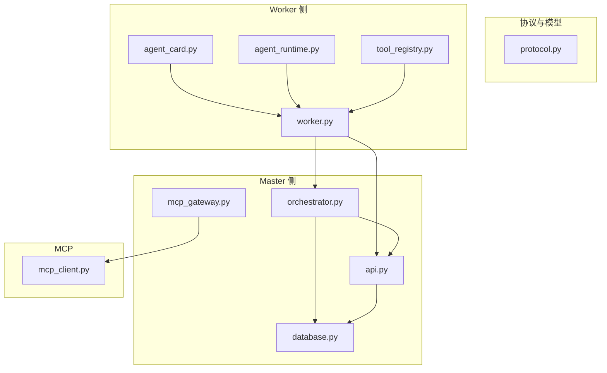
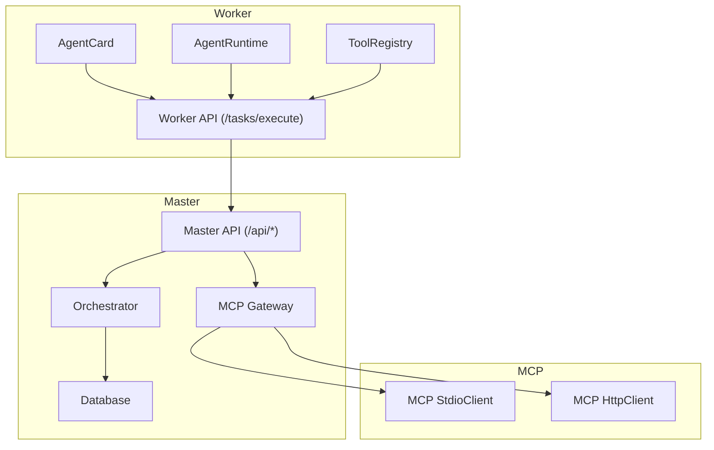
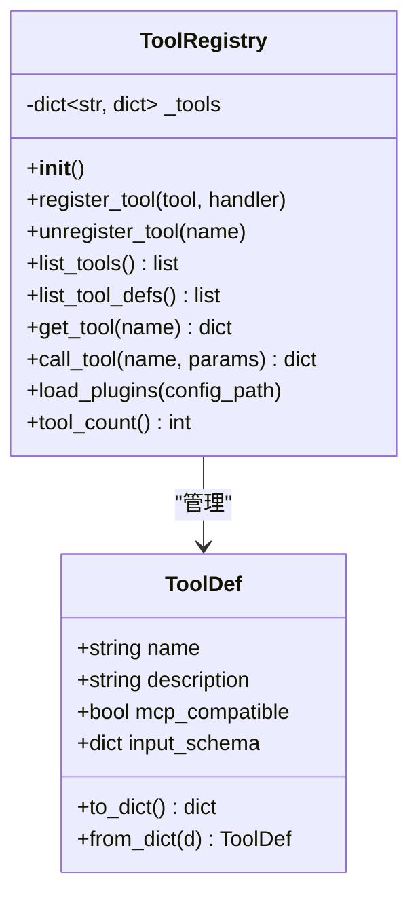
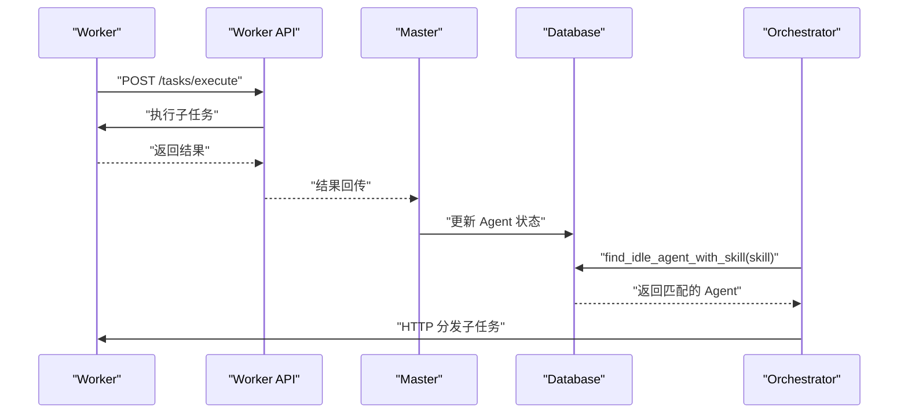
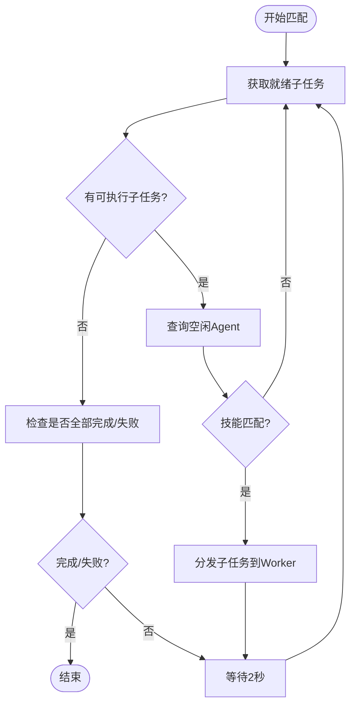
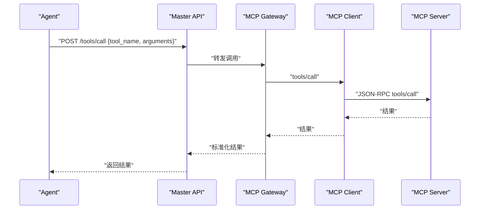
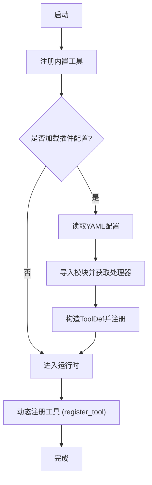
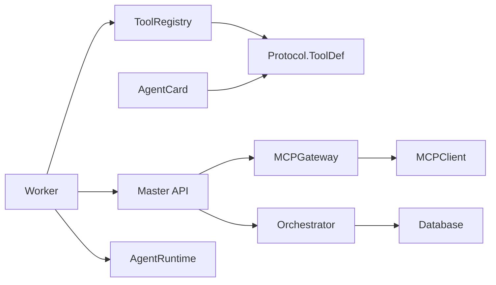

# 工具集成与匹配

<cite>
**本文引用的文件**
- [tool_registry.py](file://lan_mesh/tool_registry.py)
- [agent_card.py](file://lan_mesh/agent_card.py)
- [mcp_client.py](file://lan_mesh/mcp_client.py)
- [mcp_gateway.py](file://lan_mesh/mcp_gateway.py)
- [protocol.py](file://lan_mesh/protocol.py)
- [orchestrator.py](file://lan_mesh/orchestrator.py)
- [worker.py](file://lan_mesh/worker.py)
- [agent_runtime.py](file://lan_mesh/agent_runtime.py)
- [database.py](file://lan_mesh/database.py)
- [task.py](file://lan_mesh/task.py)
- [api.py](file://lan_mesh/api.py)
</cite>

## 目录
1. [简介](#简介)
2. [项目结构](#项目结构)
3. [核心组件](#核心组件)
4. [架构总览](#架构总览)
5. [详细组件分析](#详细组件分析)
6. [依赖关系分析](#依赖关系分析)
7. [性能考量](#性能考量)
8. [故障排查指南](#故障排查指南)
9. [结论](#结论)
10. [附录](#附录)

## 简介
本技术文档围绕“工具集成与匹配系统”，系统性阐述 ToolRegistry 工具注册表的设计与实现、AgentCard 与工具注册表的交互机制（技能匹配与能力验证）、以及 MCP 客户端与网关的集成方案。文档同时提供工具注册流程图与技能匹配算法说明，帮助读者理解如何将外部工具无缝集成到任务编排系统中。

## 项目结构
该系统采用分层设计：协议与数据模型层、Worker 侧的任务执行与能力声明、Master 侧的任务编排与工具网关、数据库持久化层。核心文件如下：
- 协议与模型：protocol.py
- 工具注册与内置工具：tool_registry.py
- Agent 能力声明：agent_card.py
- MCP 客户端与网关：mcp_client.py、mcp_gateway.py
- 任务编排与 DAG：orchestrator.py、task.py
- Worker 与 Master API：worker.py、api.py
- 数据库：database.py
- Worker 任务执行运行时：agent_runtime.py

图表来源
- [protocol.py:161-235](file://lan_mesh/protocol.py#L161-L235)
- [worker.py:62-325](file://lan_mesh/worker.py#L62-L325)
- [agent_runtime.py:28-242](file://lan_mesh/agent_runtime.py#L28-L242)
- [agent_card.py:167-228](file://lan_mesh/agent_card.py#L167-L228)
- [tool_registry.py:217-338](file://lan_mesh/tool_registry.py#L217-L338)
- [orchestrator.py:58-262](file://lan_mesh/orchestrator.py#L58-L262)
- [database.py:16-611](file://lan_mesh/database.py#L16-L611)
- [api.py:103-527](file://lan_mesh/api.py#L103-L527)
- [mcp_gateway.py:33-280](file://lan_mesh/mcp_gateway.py#L33-L280)
- [mcp_client.py:22-252](file://lan_mesh/mcp_client.py#L22-L252)

章节来源
- [protocol.py:161-235](file://lan_mesh/protocol.py#L161-L235)
- [worker.py:62-325](file://lan_mesh/worker.py#L62-L325)
- [orchestrator.py:58-262](file://lan_mesh/orchestrator.py#L58-L262)
- [mcp_gateway.py:33-280](file://lan_mesh/mcp_gateway.py#L33-L280)

## 核心组件
- ToolRegistry：统一管理内置工具、动态注册工具与插件工具，提供工具列表、调用与加载能力。
- AgentCard：生成 Worker 的能力卡片，声明技能与工具，供 Master 进行任务匹配。
- MCP 客户端与网关：MCP 客户端支持 stdio 与 HTTP 两种传输；MCP 网关集中管理多个 MCP Server，提供统一工具列表与调用路由。
- Orchestrator：任务编排器，负责任务分解、构建 DAG、匹配空闲 Agent、分发子任务与结果聚合。
- Database：Master 端 SQLite 存储，维护主机、Agent、任务与项目等数据。
- AgentRuntime：Worker 侧任务执行引擎，根据技能类型路由到不同处理器。

章节来源
- [tool_registry.py:217-338](file://lan_mesh/tool_registry.py#L217-L338)
- [agent_card.py:167-228](file://lan_mesh/agent_card.py#L167-L228)
- [mcp_client.py:22-252](file://lan_mesh/mcp_client.py#L22-L252)
- [mcp_gateway.py:33-280](file://lan_mesh/mcp_gateway.py#L33-L280)
- [orchestrator.py:58-262](file://lan_mesh/orchestrator.py#L58-L262)
- [database.py:16-611](file://lan_mesh/database.py#L16-L611)
- [agent_runtime.py:28-242](file://lan_mesh/agent_runtime.py#L28-L242)

## 架构总览
系统采用“Master-Worker”架构，Master 负责任务编排与工具网关，Worker 负责能力声明与任务执行。MCP 网关作为工具调度中枢，统一聚合与路由工具调用。

图表来源
- [api.py:103-527](file://lan_mesh/api.py#L103-L527)
- [orchestrator.py:58-262](file://lan_mesh/orchestrator.py#L58-L262)
- [database.py:16-611](file://lan_mesh/database.py#L16-L611)
- [mcp_gateway.py:33-280](file://lan_mesh/mcp_gateway.py#L33-L280)
- [mcp_client.py:22-252](file://lan_mesh/mcp_client.py#L22-L252)
- [worker.py:62-325](file://lan_mesh/worker.py#L62-L325)

## 详细组件分析

### ToolRegistry：工具注册与执行
- 设计原则
  - 支持三种注册方式：内置工具、配置文件加载的插件工具、运行时动态注册。
  - 工具定义包含名称、描述、JSON Schema 输入模式与可调用处理器。
  - MCP 兼容：返回符合 MCP tools/list/tools/call 的格式。
- 关键方法
  - register_tool：动态注册 ToolDef 与处理器。
  - list_tools/list_tool_defs：返回 MCP 兼容的工具列表与 ToolDef 对象列表。
  - get_tool：按名称获取工具定义。
  - call_tool：执行工具调用，捕获异常并返回标准化结果。
  - load_plugins：从 YAML 配置加载插件工具，动态导入模块并注册。
- 内置工具
  - 文件读写、Shell 执行、HTTP 请求、目录列举、Python 表达式求值等，均提供 JSON Schema 输入约束与错误处理。

图表来源
- [tool_registry.py:217-338](file://lan_mesh/tool_registry.py#L217-L338)
- [protocol.py:178-193](file://lan_mesh/protocol.py#L178-L193)

章节来源
- [tool_registry.py:217-338](file://lan_mesh/tool_registry.py#L217-L338)
- [protocol.py:178-193](file://lan_mesh/protocol.py#L178-L193)

### AgentCard：能力声明与交互
- 生成逻辑
  - 依据设备信息与可选技能/工具列表生成 AgentCard，包含技能与工具的 JSON Schema。
  - Worker 启动后通过 HTTP 将 AgentCard 注册到 Master。
- 与 Orchestrator 的交互
  - Orchestrator 通过数据库查询空闲 Agent，并按 required_skill 进行匹配。
  - 匹配成功后通过 Worker API 分发子任务。

图表来源
- [agent_card.py:167-228](file://lan_mesh/agent_card.py#L167-L228)
- [api.py:54-61](file://lan_mesh/api.py#L54-L61)
- [database.py:396-418](file://lan_mesh/database.py#L396-L418)
- [orchestrator.py:157-227](file://lan_mesh/orchestrator.py#L157-L227)

章节来源
- [agent_card.py:167-228](file://lan_mesh/agent_card.py#L167-L228)
- [api.py:54-61](file://lan_mesh/api.py#L54-L61)
- [database.py:396-418](file://lan_mesh/database.py#L396-L418)
- [orchestrator.py:157-227](file://lan_mesh/orchestrator.py#L157-L227)

### 技能匹配算法与能力验证
- 匹配流程
  - 任务分解为子任务，每个子任务带有 required_skill。
  - Orchestrator 从数据库查询状态为 idle 的 Agent，遍历 Agent 的 skills，比较 required_skill 与技能名称。
  - 若匹配成功，标记 Agent 为 busy，分发子任务并等待结果。
- 能力验证
  - AgentCard 的 skills 字段包含 JSON Schema，可用于前端或 LLM 的工具描述校验。
  - MCP 网关提供统一工具列表，便于在 Agent 初始化时注入工具描述。

图表来源
- [orchestrator.py:132-156](file://lan_mesh/orchestrator.py#L132-L156)
- [database.py:396-418](file://lan_mesh/database.py#L396-L418)

章节来源
- [orchestrator.py:132-156](file://lan_mesh/orchestrator.py#L132-L156)
- [database.py:396-418](file://lan_mesh/database.py#L396-L418)

### MCP 客户端与网关集成
- MCP 客户端
  - stdio：启动本地子进程并通过 stdin/stdout 通信，适合本地 MCP Server。
  - HTTP：连接远程 MCP Server，适合跨主机或远程工具。
- MCP 网关
  - 维护多个 MCP Server 的连接池，聚合工具列表并路由调用。
  - 支持动态注册/注销 Server，自动重连断开的 Server。
  - 提供统一的 /tools/list 与 /tools/call 接口，供 Agent 使用。

图表来源
- [api.py:443-469](file://lan_mesh/api.py#L443-L469)
- [mcp_gateway.py:136-178](file://lan_mesh/mcp_gateway.py#L136-L178)
- [mcp_client.py:79-90](file://lan_mesh/mcp_client.py#L79-L90)

章节来源
- [mcp_client.py:22-252](file://lan_mesh/mcp_client.py#L22-L252)
- [mcp_gateway.py:33-280](file://lan_mesh/mcp_gateway.py#L33-L280)
- [api.py:427-499](file://lan_mesh/api.py#L427-L499)

### 工具注册流程图
- 内置工具：启动时自动注册。
- 插件工具：从 YAML 配置加载，动态导入模块并注册。
- 运行时工具：通过 register_tool 动态注册。

图表来源
- [tool_registry.py:226-234](file://lan_mesh/tool_registry.py#L226-L234)
- [tool_registry.py:290-334](file://lan_mesh/tool_registry.py#L290-L334)

章节来源
- [tool_registry.py:226-234](file://lan_mesh/tool_registry.py#L226-L234)
- [tool_registry.py:290-334](file://lan_mesh/tool_registry.py#L290-L334)

## 依赖关系分析
- 组件耦合
  - ToolRegistry 与 Protocol 的 ToolDef 强耦合，确保工具定义的标准化。
  - AgentCard 与 Protocol 的 AgentCard/Skill/ToolDef 强耦合，保证能力声明一致性。
  - MCP 网关依赖 MCP 客户端，实现多源工具聚合。
  - Orchestrator 依赖 Database 进行 Agent 与任务状态管理。
- 外部依赖
  - requests：用于 HTTP 请求（LLM API、MCP HTTP 客户端）。
  - yaml：用于配置文件解析（插件与 MCP Server）。
  - subprocess：用于本地命令执行（内置工具与 AgentRuntime）。

图表来源
- [tool_registry.py:24-25](file://lan_mesh/tool_registry.py#L24-L25)
- [agent_card.py:13-13](file://lan_mesh/agent_card.py#L13-L13)
- [mcp_gateway.py:30-31](file://lan_mesh/mcp_gateway.py#L30-L31)
- [orchestrator.py:19-21](file://lan_mesh/orchestrator.py#L19-L21)
- [api.py:103-527](file://lan_mesh/api.py#L103-L527)
- [worker.py:43-44](file://lan_mesh/worker.py#L43-L44)
- [agent_runtime.py:28-46](file://lan_mesh/agent_runtime.py#L28-L46)

章节来源
- [tool_registry.py:24-25](file://lan_mesh/tool_registry.py#L24-L25)
- [agent_card.py:13-13](file://lan_mesh/agent_card.py#L13-L13)
- [mcp_gateway.py:30-31](file://lan_mesh/mcp_gateway.py#L30-L31)
- [orchestrator.py:19-21](file://lan_mesh/orchestrator.py#L19-L21)
- [api.py:103-527](file://lan_mesh/api.py#L103-L527)
- [worker.py:43-44](file://lan_mesh/worker.py#L43-L44)
- [agent_runtime.py:28-46](file://lan_mesh/agent_runtime.py#L28-L46)

## 性能考量
- 工具调用
  - MCP 网关使用连接池与工具缓存，减少重复握手与查询开销。
  - 工具调用结果标准化，便于前端与 LLM 消费。
- 任务调度
  - 使用 DAG 与拓扑排序避免循环依赖，提升执行效率。
  - 轮询等待与异步收集结果，降低阻塞风险。
- 数据访问
  - SQLite 每线程独立连接，减少锁竞争。
  - 索引优化（任务状态、Agent 状态、项目状态）。

## 故障排查指南
- 工具不存在
  - 检查 ToolRegistry 是否正确注册，或 YAML 插件配置是否正确。
  - 确认 MCP 网关是否已连接对应 Server 并刷新工具缓存。
- Agent 匹配失败
  - 确认 AgentCard 的 skills 是否包含所需技能名称。
  - 检查数据库中 Agent 状态是否为 idle 且当前任务数小于最大并发。
- MCP 连接失败
  - 检查 MCP 客户端配置（stdio 命令或 HTTP 地址）。
  - 网关健康检查线程是否正常运行，必要时手动触发重连。
- Worker 任务执行异常
  - 检查 AgentRuntime 的技能处理器是否实现，以及 LLM API Key 是否配置。

章节来源
- [tool_registry.py:259-288](file://lan_mesh/tool_registry.py#L259-L288)
- [database.py:396-418](file://lan_mesh/database.py#L396-L418)
- [mcp_gateway.py:204-236](file://lan_mesh/mcp_gateway.py#L204-L236)
- [agent_runtime.py:78-168](file://lan_mesh/agent_runtime.py#L78-L168)

## 结论
本系统通过 ToolRegistry 提供统一的工具注册与执行能力，结合 AgentCard 的能力声明与 MCP 网关的工具聚合，实现了灵活的工具集成与任务编排。技能匹配算法与数据库状态管理保障了任务高效、可靠地分发与执行。通过 MCP 客户端与网关，系统能够无缝对接本地与远程工具，满足多样化的任务场景。

## 附录
- 使用建议
  - 在 Worker 启动时生成 AgentCard 并注册到 Master，确保技能与工具声明准确。
  - 通过 MCP 网关集中管理工具，避免分散配置带来的维护成本。
  - 对于复杂任务，合理设计子任务 DAG，明确依赖关系，避免循环依赖。
- 扩展方向
  - 支持更多 MCP Server 传输方式与认证机制。
  - 增强工具调用的可观测性与审计日志。
  - 引入工具版本管理与灰度发布策略。