# 共享文件夹管理

<cite>
**本文档引用的文件**
- [shared_folder.py](file://lan_mesh/shared_folder.py)
- [config.py](file://lan_mesh/config.py)
- [host_info.py](file://lan_mesh/host_info.py)
- [collect_config.py](file://lan_mesh/collect_config.py)
- [protocol.py](file://lan_mesh/protocol.py)
- [api.py](file://lan_mesh/api.py)
- [master.py](file://lan_mesh/master.py)
- [worker.py](file://lan_mesh/worker.py)
</cite>

## 目录
1. [简介](#简介)
2. [项目结构](#项目结构)
3. [核心组件](#核心组件)
4. [架构概览](#架构概览)
5. [详细组件分析](#详细组件分析)
6. [依赖关系分析](#依赖关系分析)
7. [性能考虑](#性能考虑)
8. [故障排除指南](#故障排除指南)
9. [结论](#结论)
10. [附录](#附录)

## 简介

共享文件夹管理模块是 LAN Mesh 系统中的核心组件之一，负责管理跨主机的文件共享功能。该模块提供了自动化的目录创建、文件列表枚举、安全路径解析和文件上传保存机制，同时具备主机配置报告的自动生成能力。

本模块的设计参考了 QuickLAN 的 Shared Store 设计，但进行了简化，直接暴露目录结构供跨主机访问。它支持两种配置报告格式：JSON 格式（机器可读）和 TXT 格式（人类可读），为不同用户需求提供灵活的数据展示方式。

## 项目结构

共享文件夹管理模块位于 `lan_mesh` 目录下的 `shared_folder.py` 文件中，与其他核心组件协同工作：

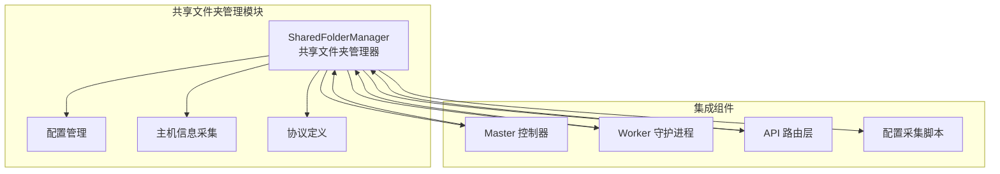

**图表来源**
- [shared_folder.py:16-219](file://lan_mesh/shared_folder.py#L16-L219)
- [config.py:36-84](file://lan_mesh/config.py#L36-L84)
- [host_info.py:129-191](file://lan_mesh/host_info.py#L129-L191)

**章节来源**
- [shared_folder.py:1-219](file://lan_mesh/shared_folder.py#L1-L219)
- [config.py:1-84](file://lan_mesh/config.py#L1-L84)

## 核心组件

共享文件夹管理模块的核心是 `SharedFolderManager` 类，它提供了以下主要功能：

### 主要功能特性

1. **目录自动创建**：在启动时自动创建共享目录，确保文件系统结构的完整性
2. **文件列表枚举**：递归遍历共享目录，提供文件和目录的详细信息
3. **安全路径解析**：防止路径穿越攻击，确保文件访问的安全性
4. **文件上传保存**：处理文件上传请求，实现安全的文件存储
5. **主机配置报告**：自动生成 JSON 和 TXT 格式的配置报告

### 类设计架构

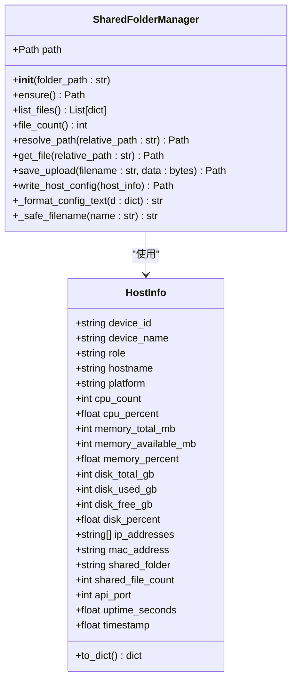

**图表来源**
- [shared_folder.py:16-219](file://lan_mesh/shared_folder.py#L16-L219)
- [protocol.py:69-111](file://lan_mesh/protocol.py#L69-L111)

**章节来源**
- [shared_folder.py:16-219](file://lan_mesh/shared_folder.py#L16-L219)
- [protocol.py:69-111](file://lan_mesh/protocol.py#L69-L111)

## 架构概览

共享文件夹管理模块在整个 LAN Mesh 系统中扮演着关键角色，作为文件共享和配置报告的核心基础设施：

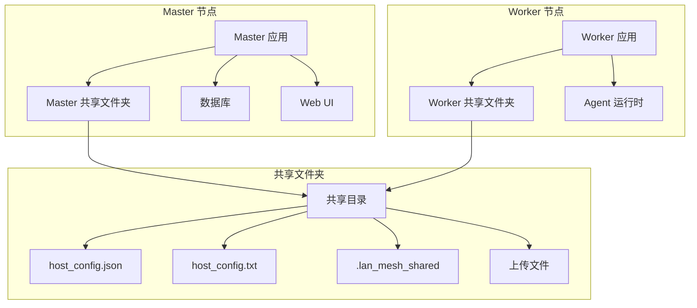

**图表来源**
- [master.py:96-98](file://lan_mesh/master.py#L96-L98)
- [worker.py:90-91](file://lan_mesh/worker.py#L90-L91)
- [shared_folder.py:122-144](file://lan_mesh/shared_folder.py#L122-L144)

## 详细组件分析

### SharedFolderManager 类详解

#### 目录自动创建机制

`SharedFolderManager` 在初始化时会自动创建共享目录，并确保其存在性和完整性：

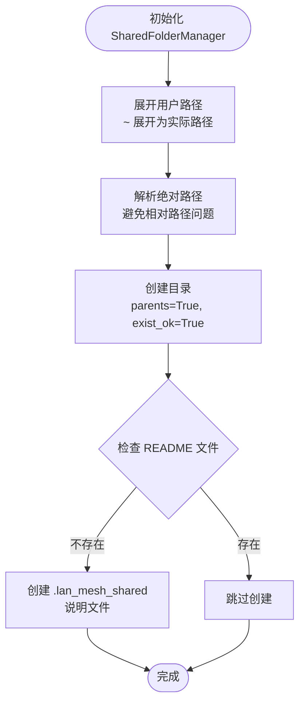

**图表来源**
- [shared_folder.py:23-37](file://lan_mesh/shared_folder.py#L23-L37)

#### 文件列表枚举算法

文件列表枚举采用递归遍历策略，提供详细的文件和目录信息：

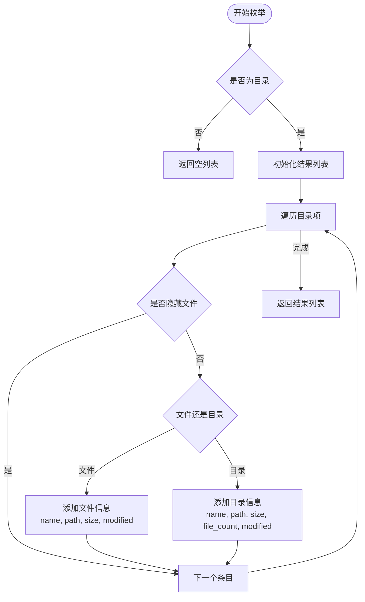

**图表来源**
- [shared_folder.py:39-76](file://lan_mesh/shared_folder.py#L39-L76)

#### 路径安全解析机制

为了防止路径穿越攻击，系统实现了严格的安全路径解析：

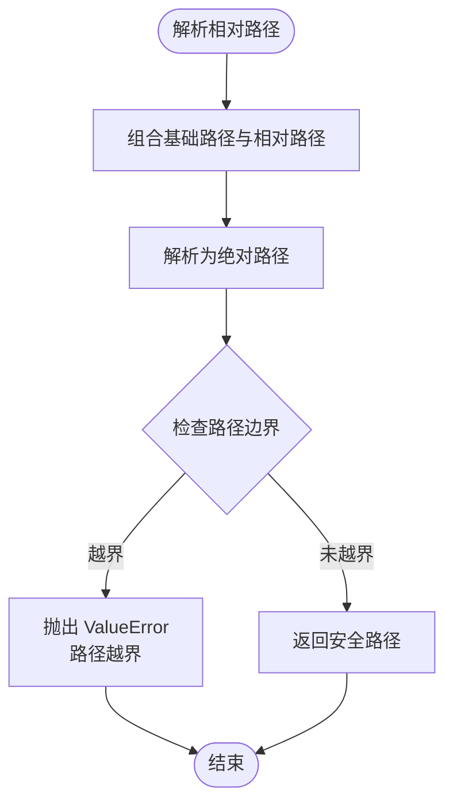

**图表来源**
- [shared_folder.py:88-94](file://lan_mesh/shared_folder.py#L88-L94)

#### 文件上传保存策略

文件上传采用智能冲突处理机制，确保文件唯一性和数据完整性：

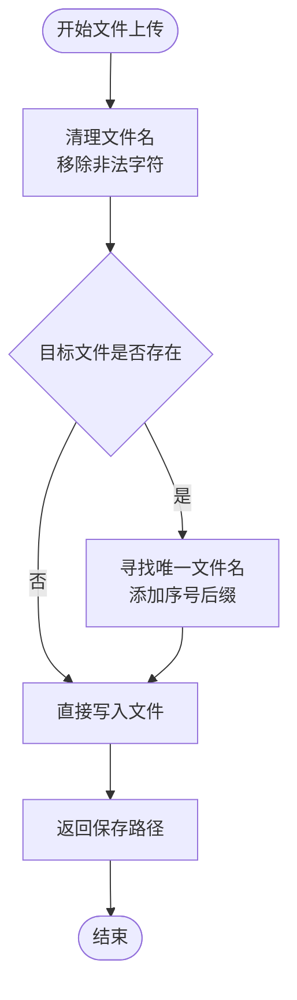

**图表来源**
- [shared_folder.py:103-118](file://lan_mesh/shared_folder.py#L103-L118)

#### 主机配置报告生成

系统自动生成两种格式的配置报告，满足不同使用场景：

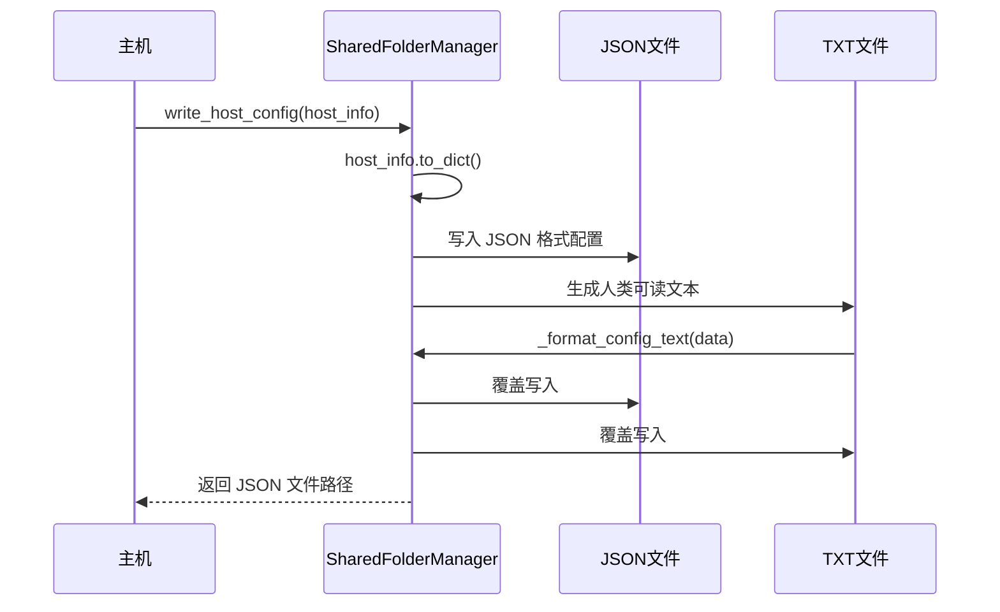

**图表来源**
- [shared_folder.py:122-144](file://lan_mesh/shared_folder.py#L122-L144)
- [shared_folder.py:146-211](file://lan_mesh/shared_folder.py#L146-L211)

### 集成使用示例

#### Master 节点集成

在 Master 节点中，共享文件夹管理器被初始化并用于配置报告的定期刷新：

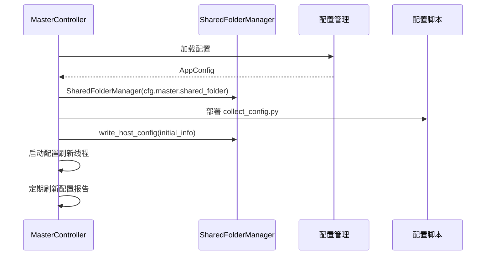

**图表来源**
- [master.py:96-98](file://lan_mesh/master.py#L96-L98)
- [master.py:145-164](file://lan_mesh/master.py#L145-L164)

#### Worker 节点集成

Worker 节点同样使用共享文件夹管理器进行配置报告的生成和维护：

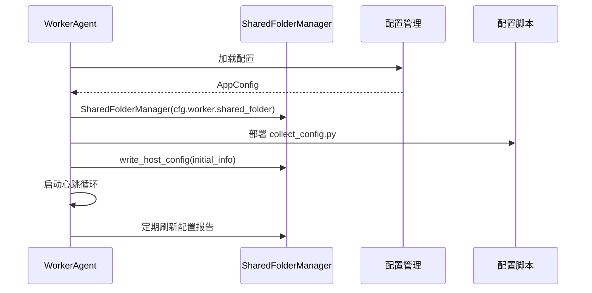

**图表来源**
- [worker.py:90-91](file://lan_mesh/worker.py#L90-L91)
- [worker.py:196-215](file://lan_mesh/worker.py#L196-L215)

**章节来源**
- [shared_folder.py:16-219](file://lan_mesh/shared_folder.py#L16-L219)
- [master.py:96-164](file://lan_mesh/master.py#L96-L164)
- [worker.py:90-215](file://lan_mesh/worker.py#L90-L215)

## 依赖关系分析

共享文件夹管理模块与系统其他组件存在紧密的依赖关系：

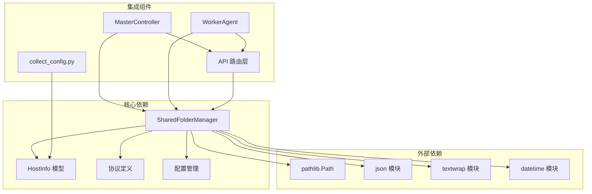

**图表来源**
- [shared_folder.py:7-13](file://lan_mesh/shared_folder.py#L7-L13)
- [api.py:33-34](file://lan_mesh/api.py#L33-L34)

### 外部依赖分析

共享文件夹管理模块依赖以下标准库和第三方库：

| 依赖模块 | 用途 | 版本要求 |
|---------|------|----------|
| pathlib | 路径操作和文件系统抽象 | Python 3.4+ |
| json | JSON 数据序列化 | Python 标准库 |
| textwrap | 文本格式化 | Python 标准库 |
| datetime | 时间戳处理 | Python 标准库 |
| os | 操作系统接口 | Python 标准库 |
| shutil | 文件复制操作 | Python 标准库 |
| psutil | 系统信息采集 | 需要安装 |

**章节来源**
- [shared_folder.py:7-13](file://lan_mesh/shared_folder.py#L7-L13)
- [config.py:10-11](file://lan_mesh/config.py#L10-L11)

## 性能考虑

共享文件夹管理模块在设计时充分考虑了性能优化：

### 文件枚举性能优化

1. **延迟计算**：使用 `rglob()` 进行递归遍历时，采用惰性求值策略
2. **权限处理**：对权限不足的情况进行快速跳过，避免阻塞整个操作
3. **缓存策略**：文件计数通过 `rglob()` 直接统计，减少重复遍历

### 路径解析性能

1. **绝对路径解析**：使用 `resolve()` 方法一次性完成路径标准化
2. **边界检查**：通过字符串前缀比较实现 O(1) 时间复杂度的边界验证
3. **早期退出**：对无效路径立即返回错误，避免不必要的计算

### 内存使用优化

1. **流式处理**：文件上传采用读取后直接写入的方式，避免大文件内存占用
2. **增量统计**：目录统计采用增量累加，避免一次性加载所有文件元数据
3. **对象复用**：使用 `pathlib.Path` 对象复用，减少对象创建开销

## 故障排除指南

### 常见问题及解决方案

#### 权限错误

**问题描述**：文件枚举过程中遇到权限不足错误

**解决方案**：
- 检查共享目录的读取权限
- 确保应用程序具有足够的文件系统访问权限
- 使用 `sudo` 或调整文件权限

#### 路径穿越攻击防护

**问题描述**：访问文件时出现路径越界错误

**解决方案**：
- 确保传入的相对路径不包含 `../` 等相对路径元素
- 使用 `resolve_path()` 方法进行路径验证
- 检查文件系统符号链接的安全性

#### 文件冲突处理

**问题描述**：文件上传时出现文件名冲突

**解决方案**：
- 系统会自动添加序号后缀（如 `(1)`, `(2)`）
- 检查共享目录的写入权限
- 验证磁盘空间是否充足

#### 配置报告生成失败

**问题描述**：主机配置报告无法生成或更新

**解决方案**：
- 检查共享目录的写入权限
- 确认 JSON 序列化过程正常
- 验证时间戳和系统信息采集功能

**章节来源**
- [shared_folder.py:74-76](file://lan_mesh/shared_folder.py#L74-L76)
- [shared_folder.py:93-94](file://lan_mesh/shared_folder.py#L93-L94)
- [shared_folder.py:112-118](file://lan_mesh/shared_folder.py#L112-L118)

## 结论

共享文件夹管理模块为 LAN Mesh 系统提供了强大而安全的文件共享基础设施。通过精心设计的安全机制、高效的性能优化和完善的错误处理，该模块能够可靠地支持跨主机的文件共享和配置报告功能。

模块的主要优势包括：
- **安全性**：严格的路径解析和权限控制，有效防止路径穿越攻击
- **可靠性**：完善的错误处理和恢复机制
- **易用性**：简洁的 API 设计和自动化的配置管理
- **性能**：优化的文件操作和内存使用策略

未来可以考虑的功能扩展包括：
- 支持文件版本管理和历史记录
- 增强文件监控和事件通知机制
- 提供更丰富的文件元数据管理
- 支持分布式文件同步和一致性保证

## 附录

### 使用示例

#### 基本使用方法

```python
# 创建共享文件夹管理器实例
shared_folder = SharedFolderManager("~/lan_mesh_shared")

# 列出共享文件
files = shared_folder.list_files()
print(f"共享目录中有 {len(files)} 个文件")

# 获取特定文件
file_path = shared_folder.get_file("example.txt")

# 上传文件
with open("local_file.txt", "rb") as f:
    data = f.read()
    saved_file = shared_folder.save_upload("uploaded_file.txt", data)
```

#### 高级配置

```python
# 自定义共享目录路径
custom_path = "/var/lib/lan_mesh/shared"
shared_folder = SharedFolderManager(custom_path)

# 配置报告格式
host_info = collect_host_info(...)
shared_folder.write_host_config(host_info)
```

### 最佳实践

1. **路径安全**：始终使用 `resolve_path()` 方法验证用户提供的文件路径
2. **权限管理**：确保共享目录具有适当的读写权限
3. **错误处理**：妥善处理文件操作异常，提供有意义的错误信息
4. **性能优化**：对于大量文件的操作，考虑分批处理和进度反馈
5. **监控告警**：建立文件系统空间和权限的监控机制

### API 参考

| 方法 | 参数 | 返回值 | 描述 |
|------|------|--------|------|
| `__init__` | `folder_path: str` | `None` | 初始化共享文件夹管理器 |
| `ensure` | 无 | `Path` | 确保共享目录存在 |
| `list_files` | 无 | `List[dict]` | 列出共享目录中的文件 |
| `file_count` | 无 | `int` | 返回共享目录中的文件总数 |
| `resolve_path` | `relative_path: str` | `Path` | 安全解析相对路径 |
| `get_file` | `relative_path: str` | `Path` | 获取共享文件的完整路径 |
| `save_upload` | `filename: str, data: bytes` | `Path` | 保存上传文件 |
| `write_host_config` | `host_info` | `Path` | 生成主机配置报告 |
| `_safe_filename` | `name: str` | `str` | 清理文件名中的非法字符 |