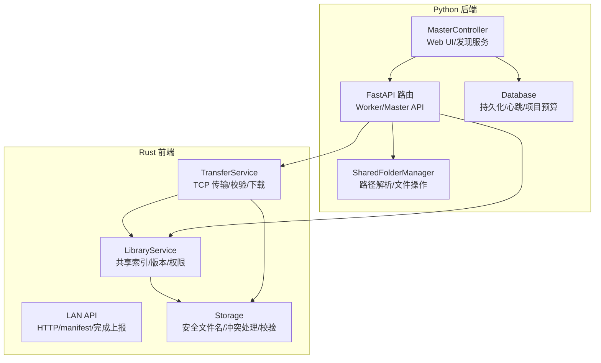
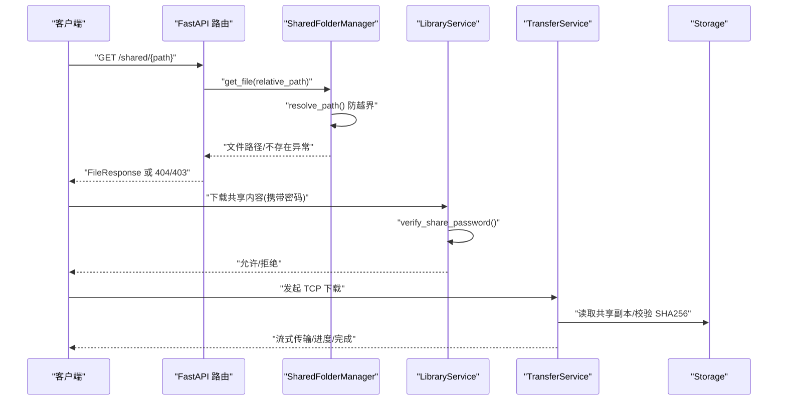
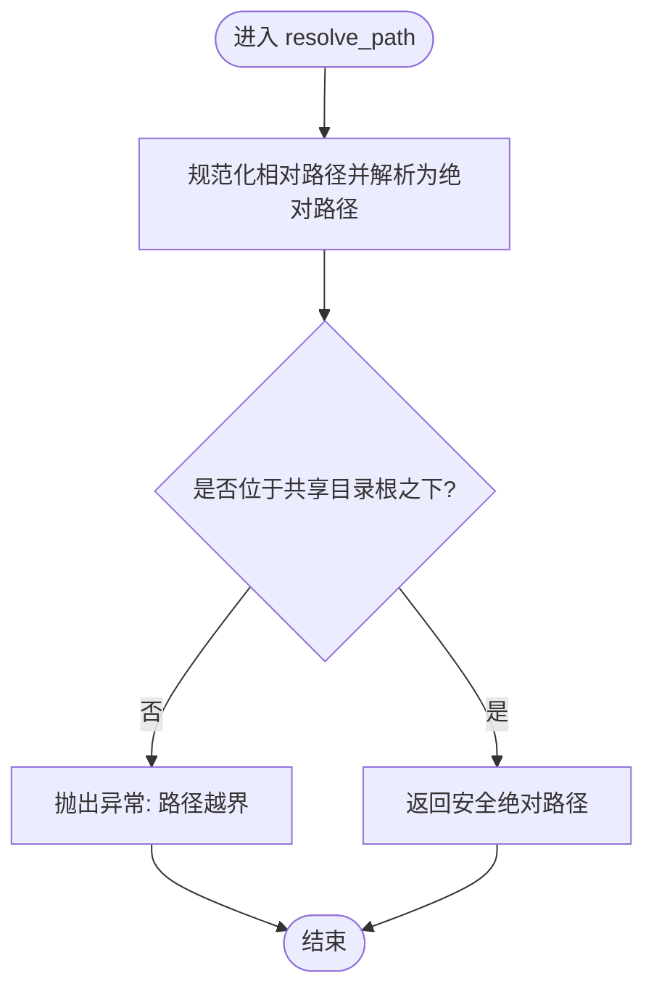
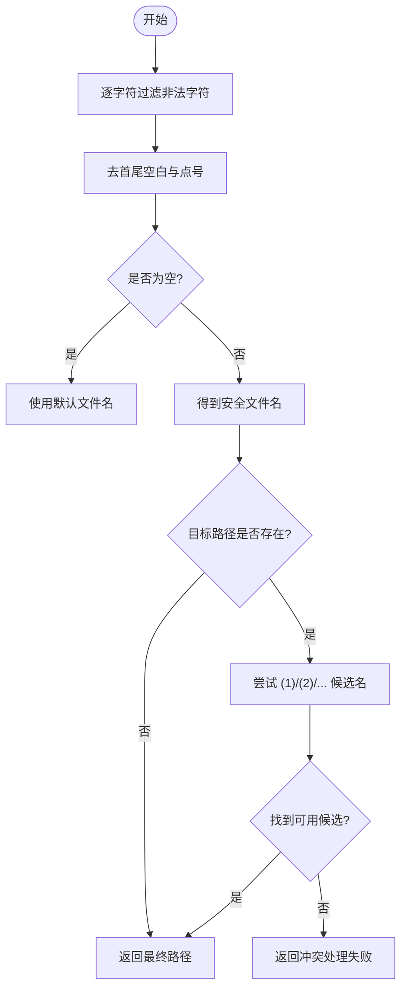
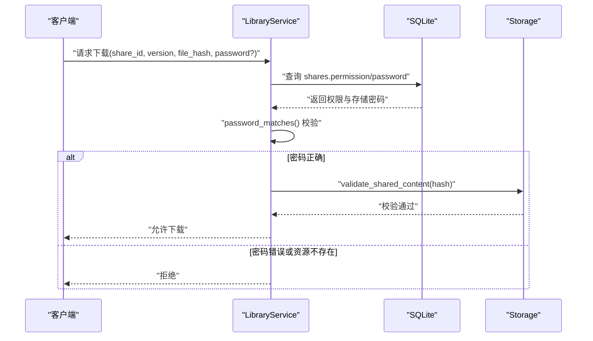
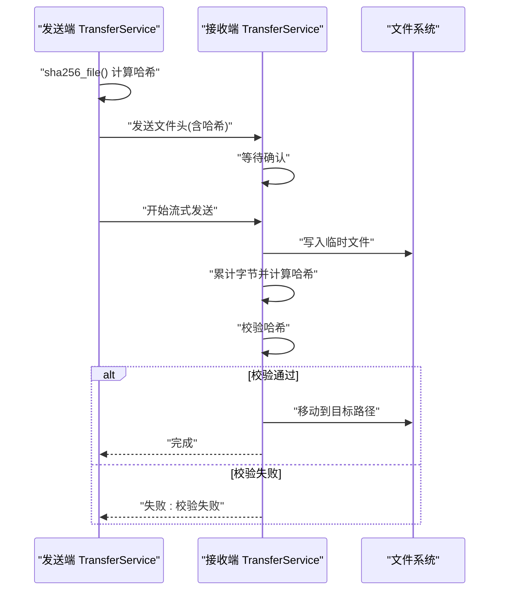
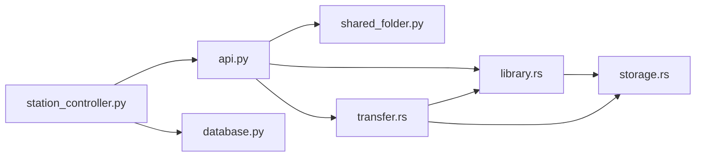

# 安全与权限控制

<cite>
**本文引用的文件**
- [shared_folder.py](file://lan_mesh/shared_folder.py)
- [api.py](file://lan_mesh/api.py)
- [station_controller.py](file://lan_mesh/station_controller.py)
- [protocol.py](file://lan_mesh/protocol.py)
- [database.py](file://lan_mesh/database.py)
- [transfer.rs](file://quicklan-main/src-tauri/src/transfer.rs)
- [lan_api.rs](file://quicklan-main/src-tauri/src/lan_api.rs)
- [library.rs](file://quicklan-main/src-tauri/src/library.rs)
- [storage.rs](file://quicklan-main/src-tauri/src/storage.rs)
</cite>

## 目录
1. [简介](#简介)
2. [项目结构](#项目结构)
3. [核心组件](#核心组件)
4. [架构总览](#架构总览)
5. [详细组件分析](#详细组件分析)
6. [依赖分析](#依赖分析)
7. [性能考虑](#性能考虑)
8. [故障排查指南](#故障排查指南)
9. [结论](#结论)

## 简介
本文件聚焦于文件共享系统的安全与权限控制，围绕以下目标展开：
- 路径安全解析机制与目录遍历防护
- 文件名清理规则、非法字符过滤与命名冲突处理
- 访问控制机制、权限验证流程与安全边界设计
- 输入验证、输出编码与安全配置建议
- 潜在安全风险与对应防护措施

## 项目结构
系统由两部分组成：
- Python 后端（FastAPI）：负责共享文件夹管理、HTTP API、数据库与主机信息采集
- Rust 前端（Tauri）：负责本地文件库、共享内容校验、下载与传输、LAN API

图示来源
- [api.py](file://lan_mesh/api.py)
- [shared_folder.py](file://lan_mesh/shared_folder.py)
- [station_controller.py](file://lan_mesh/station_controller.py)
- [database.py](file://lan_mesh/database.py)
- [library.rs](file://quicklan-main/src-tauri/src/library.rs)
- [transfer.rs](file://quicklan-main/src-tauri/src/transfer.rs)
- [lan_api.rs](file://quicklan-main/src-tauri/src/lan_api.rs)
- [storage.rs](file://quicklan-main/src-tauri/src/storage.rs)

章节来源
- [api.py](file://lan_mesh/api.py)
- [shared_folder.py](file://lan_mesh/shared_folder.py)
- [station_controller.py](file://lan_mesh/station_controller.py)
- [database.py](file://lan_mesh/database.py)
- [library.rs](file://quicklan-main/src-tauri/src/library.rs)
- [transfer.rs](file://quicklan-main/src-tauri/src/transfer.rs)
- [lan_api.rs](file://quicklan-main/src-tauri/src/lan_api.rs)
- [storage.rs](file://quicklan-main/src-tauri/src/storage.rs)

## 核心组件
- 路径安全解析与文件操作：Python 端 SharedFolderManager 提供安全路径解析与文件读写
- 权限与访问控制：Rust 端 LibraryService 支持“公开/密码”两类权限，并在下载前进行校验
- 传输与完整性：Rust 端 TransferService 采用 SHA256 校验与 TCP 流式传输
- 数据持久化与审计：Python 端 Database 记录心跳、项目预算与使用明细
- LAN API：Rust 端 LAN API 提供 manifest 查询与下载完成上报

章节来源
- [shared_folder.py](file://lan_mesh/shared_folder.py)
- [library.rs](file://quicklan-main/src-tauri/src/library.rs)
- [transfer.rs](file://quicklan-main/src-tauri/src/transfer.rs)
- [database.py](file://lan_mesh/database.py)
- [lan_api.rs](file://quicklan-main/src-tauri/src/lan_api.rs)

## 架构总览
下图展示从用户请求到文件下载的关键交互链路，重点标注安全控制点。

图示来源
- [api.py](file://lan_mesh/api.py)
- [shared_folder.py](file://lan_mesh/shared_folder.py)
- [library.rs](file://quicklan-main/src-tauri/src/library.rs)
- [transfer.rs](file://quicklan-main/src-tauri/src/transfer.rs)
- [storage.rs](file://quicklan-main/src-tauri/src/storage.rs)

## 详细组件分析

### 路径安全解析与目录遍历防护
- 解析策略
  - 使用绝对路径标准化与根目录前缀校验，拒绝越界路径
  - 仅允许在共享目录内访问，越界即报错
- 异常处理
  - 文件不存在与路径越界分别映射到不同 HTTP 状态码，便于前端区分
- 影响范围
  - 下载接口与文件列表均受此保护

图示来源
- [shared_folder.py](file://lan_mesh/shared_folder.py)

章节来源
- [shared_folder.py](file://lan_mesh/shared_folder.py)
- [api.py](file://lan_mesh/api.py)

### 文件名清理、非法字符过滤与命名冲突处理
- 清理规则
  - 过滤 Windows 非法字符与控制字符，替换为安全字符
  - 去除首尾空白与点号，避免隐藏文件与无效文件名
- 冲突处理
  - 若目标文件已存在，按“(序号)”模式生成候选名，最多尝试若干次
- 作用范围
  - 上传保存、下载落盘、共享副本复制等场景均应用相同规则

图示来源
- [storage.rs](file://quicklan-main/src-tauri/src/storage.rs)
- [shared_folder.py](file://lan_mesh/shared_folder.py)

章节来源
- [storage.rs](file://quicklan-main/src-tauri/src/storage.rs)
- [shared_folder.py](file://lan_mesh/shared_folder.py)

### 访问控制与权限验证
- 权限类型
  - 公开：无需密码
  - 密码：需正确密码才允许下载
- 校验流程
  - 下载前先查询共享记录的权限与存储密码
  - 对比提供的密码，不匹配则拒绝
- 安全边界
  - 仅对“本地副本”进行权限校验与提供
  - 通过哈希与版本号定位具体资源，避免误取

图示来源
- [library.rs](file://quicklan-main/src-tauri/src/library.rs)
- [database.py](file://lan_mesh/database.py)

章节来源
- [library.rs](file://quicklan-main/src-tauri/src/library.rs)
- [database.py](file://lan_mesh/database.py)

### 传输完整性与下载流程
- 完整性
  - 发送端计算文件 SHA256，接收端同样计算并对比
  - 传输过程中分块读写，实时更新速度与剩余时间
- 下载流程
  - 客户端发起 TCP 连接，协商头部后开始流式传输
  - 接收端写入临时文件，完成后校验并移动至目标位置
- 错误处理
  - 校验失败、连接中断、目标不可写等情况均产生明确错误

图示来源
- [transfer.rs](file://quicklan-main/src-tauri/src/transfer.rs)

章节来源
- [transfer.rs](file://quicklan-main/src-tauri/src/transfer.rs)

### HTTP API 安全边界与错误映射
- 下载接口
  - 路径参数经 SharedFolderManager 安全解析，越界返回 403，不存在返回 404
- 上传接口
  - 采用安全文件名清理与命名冲突处理，返回保存结果
- LAN API
  - 严格解析请求行与路径，非法路径返回 404；manifest 查询与完成上报均有明确响应

章节来源
- [api.py](file://lan_mesh/api.py)
- [shared_folder.py](file://lan_mesh/shared_folder.py)
- [lan_api.rs](file://quicklan-main/src-tauri/src/lan_api.rs)

## 依赖分析
- Python 端
  - FastAPI 路由依赖 SharedFolderManager 进行文件操作
  - MasterController 负责组装 Web UI、数据库与发现服务
- Rust 端
  - LibraryService 依赖 Storage 进行文件校验与命名冲突处理
  - TransferService 依赖 LibraryService 选择下载源并进行完整性校验

图示来源
- [api.py](file://lan_mesh/api.py)
- [shared_folder.py](file://lan_mesh/shared_folder.py)
- [station_controller.py](file://lan_mesh/station_controller.py)
- [database.py](file://lan_mesh/database.py)
- [library.rs](file://quicklan-main/src-tauri/src/library.rs)
- [transfer.rs](file://quicklan-main/src-tauri/src/transfer.rs)
- [storage.rs](file://quicklan-main/src-tauri/src/storage.rs)

章节来源
- [protocol.py](file://lan_mesh/protocol.py)
- [database.py](file://lan_mesh/database.py)

## 性能考虑
- 路径解析与文件统计
  - 列表与计数采用递归扫描，注意在大目录下的开销
- 传输性能
  - 分块大小与并发数量影响吞吐；Rust 端提供速率与 ETA 统计
- 数据库
  - 心跳与使用记录写入频繁，建议合理设置清理周期与索引

## 故障排查指南
- 下载返回 403
  - 可能为路径越界或权限不足；检查请求路径与共享权限设置
- 下载返回 404
  - 文件不存在或已被移除；确认文件名与版本号
- 校验失败
  - 接收端计算的哈希与发送端不一致；检查网络稳定性与磁盘写入
- 密码错误
  - 确认共享权限为“密码”，并提供正确密码
- 命名冲突
  - 系统无法生成不冲突的文件名；手动调整目标目录或文件名

章节来源
- [api.py](file://lan_mesh/api.py)
- [shared_folder.py](file://lan_mesh/shared_folder.py)
- [library.rs](file://quicklan-main/src-tauri/src/library.rs)
- [transfer.rs](file://quicklan-main/src-tauri/src/transfer.rs)
- [storage.rs](file://quicklan-main/src-tauri/src/storage.rs)

## 结论
本系统通过多层安全控制实现文件共享的安全与可控：
- 路径解析与越界检测有效防范目录遍历
- 文件名清理与冲突处理提升可用性与安全性
- 权限与密码校验结合哈希校验，确保访问与完整性
- 传输层采用 SHA256 与流式分块，兼顾性能与可靠性
建议持续关注日志与告警，配合合理的网络隔离与最小权限原则，进一步强化整体安全基线。
