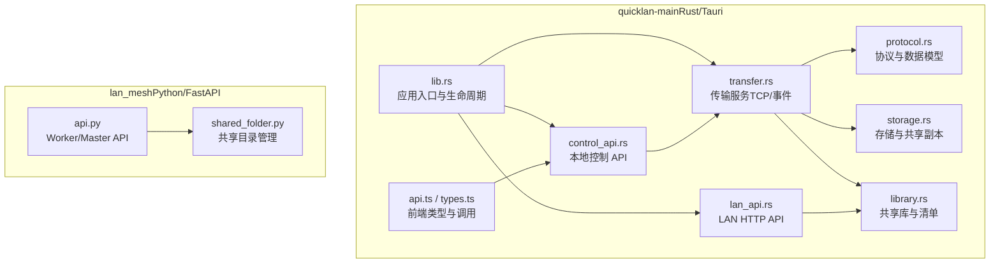
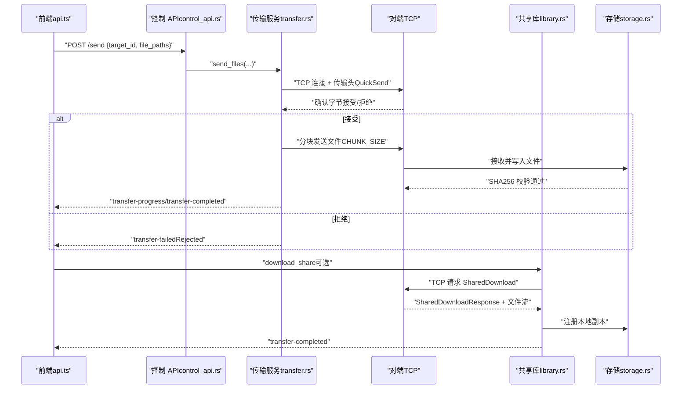
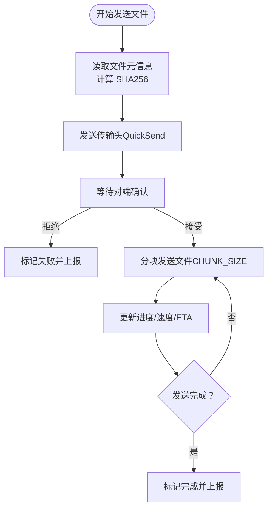
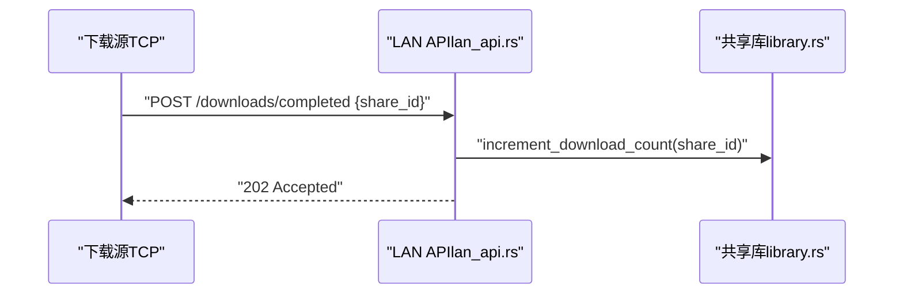
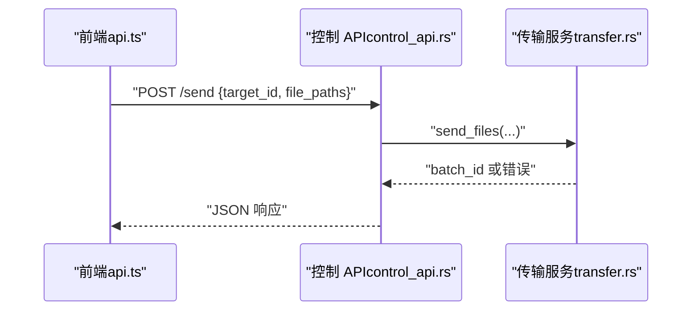
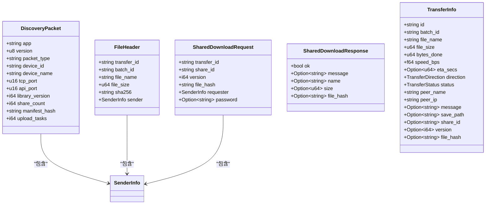
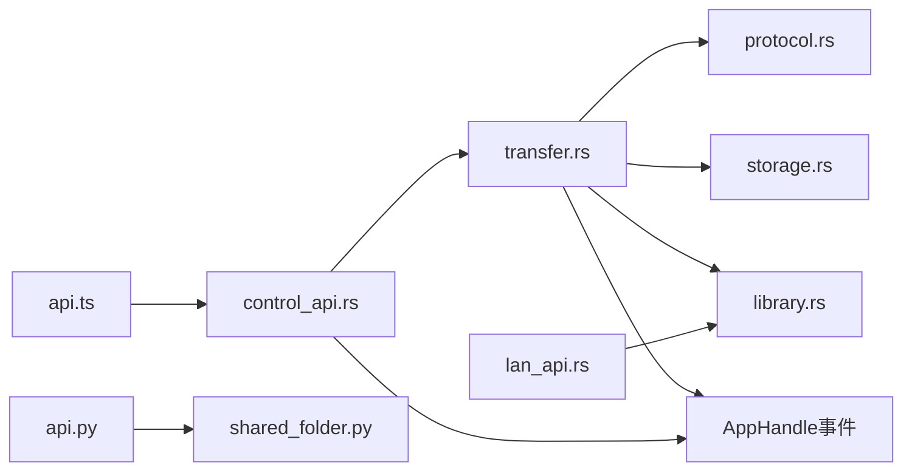

# 文件传输协议

<cite>
**本文引用的文件**
- [transfer.rs](file://quicklan-main/src-tauri/src/transfer.rs)
- [lan_api.rs](file://quicklan-main/src-tauri/src/lan_api.rs)
- [control_api.rs](file://quicklan-main/src-tauri/src/control_api.rs)
- [protocol.rs](file://quicklan-main/src-tauri/src/protocol.rs)
- [storage.rs](file://quicklan-main/src-tauri/src/storage.rs)
- [library.rs](file://quicklan-main/src-tauri/src/library.rs)
- [api.ts](file://quicklan-main/src/api.ts)
- [types.ts](file://quicklan-main/src/types.ts)
- [lib.rs](file://quicklan-main/src-tauri/src/lib.rs)
- [api.py](file://lan_mesh/api.py)
- [shared_folder.py](file://lan_mesh/shared_folder.py)
</cite>

## 目录
1. [简介](#简介)
2. [项目结构](#项目结构)
3. [核心组件](#核心组件)
4. [架构总览](#架构总览)
5. [详细组件分析](#详细组件分析)
6. [依赖关系分析](#依赖关系分析)
7. [性能考虑](#性能考虑)
8. [故障排查指南](#故障排查指南)
9. [结论](#结论)
10. [附录](#附录)

## 简介
本文件传输协议围绕本地局域网内的文件上传、下载与共享清单查询展开，采用多协议协同设计：基于 TCP 的二进制帧传输（快速直传与共享下载）、基于 HTTP 的 LAN API 清单与完成上报、以及基于 WebSocket 的设备发现与状态推送。协议具备以下特性：
- 传输安全：文件完整性校验（SHA256），可选密码保护共享资源
- 并发控制：批量传输批号管理、接收端确认机制、上传任务上限
- 错误恢复：断点续传语义（基于进度重连）、失败事件上报、重复副本去重
- 数据流设计：分块读写（默认 1MB）、进度统计、事件驱动 UI 更新
- 扩展接口：支持与外部组件（如 LAN Mesh）集成，提供共享目录与上传下载能力

## 项目结构
该仓库包含两套主要实现：
- quicklan-main：基于 Tauri/Rust 的桌面应用，提供文件传输、设备发现、UI 控制与 LAN API
- lan_mesh：基于 FastAPI 的 Python 服务，提供共享目录上传/下载与设备管理

**图表来源**
- [lib.rs:138-188](file://quicklan-main/src-tauri/src/lib.rs#L138-L188)
- [transfer.rs:73-159](file://quicklan-main/src-tauri/src/transfer.rs#L73-L159)
- [lan_api.rs:19-51](file://quicklan-main/src-tauri/src/lan_api.rs#L19-L51)
- [control_api.rs:22-45](file://quicklan-main/src-tauri/src/control_api.rs#L22-L45)
- [protocol.rs:1-230](file://quicklan-main/src-tauri/src/protocol.rs#L1-L230)
- [storage.rs:25-46](file://quicklan-main/src-tauri/src/storage.rs#L25-L46)
- [library.rs:21-92](file://quicklan-main/src-tauri/src/library.rs#L21-L92)
- [api.ts:1-130](file://quicklan-main/src/api.ts#L1-L130)
- [types.ts:1-128](file://quicklan-main/src/types.ts#L1-L128)
- [api.py:1-539](file://lan_mesh/api.py#L1-L539)
- [shared_folder.py:16-219](file://lan_mesh/shared_folder.py#L16-L219)

**章节来源**
- [lib.rs:138-188](file://quicklan-main/src-tauri/src/lib.rs#L138-L188)
- [api.py:1-539](file://lan_mesh/api.py#L1-L539)

## 核心组件
- 传输服务（TransferService）
  - 负责 TCP 监听、发起/接收文件传输、事件发布、进度与状态管理
  - 支持快速直传（发送文件到对端）与共享下载（从共享库拉取）
- LAN API（lan_api.rs）
  - 提供 /manifest、/shares/{id}/versions/{ver} 查询与 /downloads/completed 上报
- 控制 API（control_api.rs）
  - 仅允许本机访问，提供 /health、/devices、/transfers、/discover、/send 等
- 协议与数据模型（protocol.rs）
  - 定义传输头、共享清单、传输状态、事件等核心结构
- 存储与共享副本（storage.rs）
  - 共享副本目录结构、唯一目标路径生成、哈希校验
- 共享库（library.rs）
  - 共享项与版本管理、清单生成、下载计数、本地副本注册
- 前端接口（api.ts / types.ts）
  - Tauri 命令封装与 TypeScript 类型定义
- LAN Mesh 共享目录（api.py / shared_folder.py）
  - Worker 端共享文件上传/下载、Master 端共享清单查询

**章节来源**
- [transfer.rs:73-159](file://quicklan-main/src-tauri/src/transfer.rs#L73-L159)
- [lan_api.rs:19-114](file://quicklan-main/src-tauri/src/lan_api.rs#L19-L114)
- [control_api.rs:22-122](file://quicklan-main/src-tauri/src/control_api.rs#L22-L122)
- [protocol.rs:11-230](file://quicklan-main/src-tauri/src/protocol.rs#L11-L230)
- [storage.rs:25-92](file://quicklan-main/src-tauri/src/storage.rs#L25-L92)
- [library.rs:21-92](file://quicklan-main/src-tauri/src/library.rs#L21-L92)
- [api.ts:1-130](file://quicklan-main/src/api.ts#L1-L130)
- [types.ts:1-128](file://quicklan-main/src/types.ts#L1-L128)
- [api.py:39-98](file://lan_mesh/api.py#L39-L98)
- [shared_folder.py:16-118](file://lan_mesh/shared_folder.py#L16-L118)

## 架构总览
下图展示文件传输在不同模块间的交互流程。

**图表来源**
- [control_api.rs:98-114](file://quicklan-main/src-tauri/src/control_api.rs#L98-L114)
- [transfer.rs:180-220](file://quicklan-main/src-tauri/src/transfer.rs#L180-L220)
- [transfer.rs:298-375](file://quicklan-main/src-tauri/src/transfer.rs#L298-L375)
- [transfer.rs:445-502](file://quicklan-main/src-tauri/src/transfer.rs#L445-L502)
- [library.rs:40-62](file://quicklan-main/src-tauri/src/library.rs#L40-L62)
- [storage.rs:29-42](file://quicklan-main/src-tauri/src/storage.rs#L29-L42)

## 详细组件分析

### 传输服务（TransferService）
- 监听与接入
  - 动态绑定 TCP 端口（默认 45455），非阻塞监听，异步接受连接
  - 解析入站 TCP 帧，区分 QuickSend 与 SharedDownload
- 发送流程
  - 计算文件 SHA256，发送传输头（包含文件名、大小、哈希、发送方信息）
  - 等待对端确认（1 表示接受，0 表示拒绝）
  - 分块发送文件，实时更新进度与速度
- 接收流程
  - 弹窗确认（若需要），写入目标文件，边接收边校验 SHA256
  - 成功后可注册本地副本并广播库更新
- 事件与状态
  - 通过 upsert_and_emit 发布 transfer-progress/transfer-completed/transfer-failed/incoming-transfer 等事件
  - 支持批量传输（batch_id），支持清理已完成记录

**图表来源**
- [transfer.rs:298-375](file://quicklan-main/src-tauri/src/transfer.rs#L298-L375)
- [transfer.rs:618-661](file://quicklan-main/src-tauri/src/transfer.rs#L618-L661)

**章节来源**
- [transfer.rs:73-159](file://quicklan-main/src-tauri/src/transfer.rs#L73-L159)
- [transfer.rs:180-220](file://quicklan-main/src-tauri/src/transfer.rs#L180-L220)
- [transfer.rs:298-375](file://quicklan-main/src-tauri/src/transfer.rs#L298-L375)
- [transfer.rs:377-443](file://quicklan-main/src-tauri/src/transfer.rs#L377-L443)
- [transfer.rs:445-502](file://quicklan-main/src-tauri/src/transfer.rs#L445-L502)
- [transfer.rs:541-616](file://quicklan-main/src-tauri/src/transfer.rs#L541-L616)
- [transfer.rs:732-750](file://quicklan-main/src-tauri/src/transfer.rs#L732-L750)

### LAN API（LAN 局域网 HTTP API）
- 端点
  - GET /manifest：返回本地共享清单
  - GET /shares/{id}/versions/{ver}：查询某共享的特定版本信息
  - POST /downloads/completed：通知下载完成（用于统计）
- 特性
  - 仅监听本地端口，非阻塞接受连接
  - 基于简单 HTTP 文本协议解析请求与响应

**图表来源**
- [lan_api.rs:106-113](file://quicklan-main/src-tauri/src/lan_api.rs#L106-L113)
- [lan_api.rs:167-176](file://quicklan-main/src-tauri/src/lan_api.rs#L167-L176)

**章节来源**
- [lan_api.rs:19-114](file://quicklan-main/src-tauri/src/lan_api.rs#L19-L114)
- [lan_api.rs:139-165](file://quicklan-main/src-tauri/src/lan_api.rs#L139-L165)
- [lan_api.rs:167-176](file://quicklan-main/src-tauri/src/lan_api.rs#L167-L176)

### 控制 API（本地控制接口）
- 仅允许本机访问（回环地址）
- 端点
  - GET /health：健康检查
  - GET /devices：设备列表
  - GET /network：网络状态
  - GET /transfers：传输列表
  - POST /discover：探测指定 IP
  - POST /send：发送文件（委托传输服务）

**图表来源**
- [control_api.rs:98-114](file://quicklan-main/src-tauri/src/control_api.rs#L98-L114)
- [api.ts:21-23](file://quicklan-main/src/api.ts#L21-L23)

**章节来源**
- [control_api.rs:22-122](file://quicklan-main/src-tauri/src/control_api.rs#L22-L122)
- [api.ts:13-23](file://quicklan-main/src/api.ts#L13-L23)

### 协议与数据模型（protocol.rs）
- 关键结构
  - DiscoveryPacket、DeviceInfo、NetworkStatus：设备发现与网络状态
  - TcpHeader（QuickSend/FileHeader、SharedDownloadRequest/Response）：传输帧
  - TransferDirection、TransferStatus：传输方向与状态
  - TransferInfo、IncomingTransferEvent、TransferCompletedEvent、TransferFailedEvent：传输事件
  - Manifest、ManifestShare、ShareVersion：共享清单与版本
- 常量
  - 默认端口（发现 45454、TCP 45455、LAN API 45457）
  - 分块大小（1MB）

**图表来源**
- [protocol.rs:11-230](file://quicklan-main/src-tauri/src/protocol.rs#L11-L230)

**章节来源**
- [protocol.rs:11-230](file://quicklan-main/src-tauri/src/protocol.rs#L11-L230)

### 存储与共享副本（storage.rs）
- 目录结构
  - 共享副本：{app_data_dir}/shared_store/{file_hash}/content.bin + metadata.json
  - 下载目录：用户可配置，自动创建
- 能力
  - 唯一目标路径生成（避免同名冲突）
  - 共享副本复制与哈希校验
  - 安全文件名清洗

**章节来源**
- [storage.rs:25-46](file://quicklan-main/src-tauri/src/storage.rs#L25-L46)
- [storage.rs:66-92](file://quicklan-main/src-tauri/src/storage.rs#L66-L92)
- [storage.rs:129-186](file://quicklan-main/src-tauri/src/storage.rs#L129-L186)

### 共享库（library.rs）
- 功能
  - 共享项与版本管理、清单生成、下载计数
  - 本地副本注册与库摘要广播
- 数据结构
  - DownloadSource、SharedContent、Manifest、ManifestShare、ShareVersion

**章节来源**
- [library.rs:21-92](file://quicklan-main/src-tauri/src/library.rs#L21-L92)
- [library.rs:39-62](file://quicklan-main/src-tauri/src/library.rs#L39-L62)

### 前端接口（api.ts / types.ts）
- Tauri 命令封装：设备、传输、共享、设置等
- TypeScript 类型：DeviceInfo、TransferInfo、LibrarySettings、NetworkStatus 等

**章节来源**
- [api.ts:1-130](file://quicklan-main/src/api.ts#L1-L130)
- [types.ts:1-128](file://quicklan-main/src/types.ts#L1-L128)

### LAN Mesh 共享目录（api.py / shared_folder.py）
- Worker API
  - GET /shared：列出共享文件
  - GET /shared/{path}：下载共享文件
  - POST /shared：上传文件到共享目录
- 共享目录管理
  - 安全路径解析、文件计数、上传保存与命名冲突处理

**章节来源**
- [api.py:39-98](file://lan_mesh/api.py#L39-L98)
- [shared_folder.py:16-118](file://lan_mesh/shared_folder.py#L16-L118)

## 依赖关系分析
- 模块耦合
  - TransferService 依赖 Protocol、Storage、Library、Settings、AppHandle
  - LAN API 依赖 LibraryService
  - Control API 依赖 AppState（包含 Discovery、Transfer、Settings、Library）
- 外部依赖
  - Rust：tokio、sha2、uuid、dirs、rusqlite
  - Python：FastAPI、uvicorn（由运行环境提供）

**图表来源**
- [transfer.rs:1-28](file://quicklan-main/src-tauri/src/transfer.rs#L1-L28)
- [lan_api.rs:1-12](file://quicklan-main/src-tauri/src/lan_api.rs#L1-L12)
- [control_api.rs:1-9](file://quicklan-main/src-tauri/src/control_api.rs#L1-L9)
- [api.py:26-31](file://lan_mesh/api.py#L26-L31)
- [shared_folder.py:7-13](file://lan_mesh/shared_folder.py#L7-L13)

**章节来源**
- [transfer.rs:1-28](file://quicklan-main/src-tauri/src/transfer.rs#L1-L28)
- [lan_api.rs:1-12](file://quicklan-main/src-tauri/src/lan_api.rs#L1-L12)
- [control_api.rs:1-9](file://quicklan-main/src-tauri/src/control_api.rs#L1-L9)
- [api.py:26-31](file://lan_mesh/api.py#L26-L31)
- [shared_folder.py:7-13](file://lan_mesh/shared_folder.py#L7-L13)

## 性能考虑
- 分块传输
  - 默认 1MB 分块，平衡内存占用与吞吐
- 进度与速率
  - 基于时间戳计算瞬时速率与 ETA，提升用户体验
- 并发与限流
  - 上传任务上限与缓存配额（LibrarySettings）限制资源占用
- I/O 优化
  - 异步文件读写与 TCP 流，减少阻塞
- 共享副本复用
  - 同哈希文件复用共享副本，节省带宽与磁盘

**章节来源**
- [protocol.rs:9](file://quicklan-main/src-tauri/src/protocol.rs#L9)
- [transfer.rs:575-583](file://quicklan-main/src-tauri/src/transfer.rs#L575-L583)
- [library.rs:224-229](file://quicklan-main/src-tauri/src/library.rs#L224-L229)
- [storage.rs:129-167](file://quicklan-main/src-tauri/src/storage.rs#L129-L167)

## 故障排查指南
- 连接失败
  - 检查防火墙是否拦截 TCP 端口（默认 45455）
  - 确认对端已启动监听并可被发现
- 接收端拒绝
  - 查看 incoming-transfer 窗口确认结果
  - 对端可能因权限或策略拒绝
- 校验失败
  - 接收完成后进行 SHA256 校验，失败需重新传输
- 下载完成未统计
  - 确保调用 /downloads/completed 上报
- 本地控制 API 不可用
  - 仅允许本机访问，确认回环地址与端口

**章节来源**
- [transfer.rs:347-371](file://quicklan-main/src-tauri/src/transfer.rs#L347-L371)
- [transfer.rs:591-595](file://quicklan-main/src-tauri/src/transfer.rs#L591-L595)
- [lan_api.rs:106-113](file://quicklan-main/src-tauri/src/lan_api.rs#L106-L113)
- [control_api.rs:38-42](file://quicklan-main/src-tauri/src/control_api.rs#L38-L42)

## 结论
本文件传输协议通过“TCP 二进制帧 + HTTP LAN API + 事件驱动 UI”的组合，在局域网内实现了高效、可靠且可扩展的文件传输能力。协议内置安全校验、并发控制与错误恢复机制，并提供与 LAN Mesh 的共享目录互通能力，满足从个人设备到小型团队协作的多种场景需求。

## 附录

### API 端点规范（HTTP/LAN API）
- GET /manifest
  - 描述：获取本地共享清单
  - 响应：200 + Manifest
- GET /shares/{id}/versions/{ver}
  - 描述：查询共享项指定版本信息
  - 响应：200 + {"share": ..., "version": ...} 或 404
- POST /downloads/completed
  - 描述：上报下载完成，用于统计
  - 请求体：{"share_id": "..."}

**章节来源**
- [lan_api.rs:77-113](file://quicklan-main/src-tauri/src/lan_api.rs#L77-L113)

### 控制 API（本地）
- GET /health
  - 响应：{"ok": true, "app": "quick-transfer", "control": "codex"}
- GET /devices
  - 响应：设备列表
- GET /network
  - 响应：网络状态（端口、IP、广播目标）
- GET /transfers
  - 响应：传输列表
- POST /discover
  - 请求体：{"ip": "..."}
  - 响应：202 或 400
- POST /send
  - 请求体：{"target_id": "...", "file_paths": ["..."]}
  - 响应：202 {"batch_id": "..."} 或 400 {"error": "..."}

**章节来源**
- [control_api.rs:82-122](file://quicklan-main/src-tauri/src/control_api.rs#L82-L122)

### LAN Mesh 共享目录（Worker）
- GET /shared
  - 响应：{"folder": "...", "files": [...], "file_count": n}
- GET /shared/{file_path:path}
  - 响应：文件流或 404/403
- POST /shared
  - 请求：multipart/form-data（file）
  - 响应：{"ok": true, "filename": "...", "path": "...", "size": n}

**章节来源**
- [api.py:62-98](file://lan_mesh/api.py#L62-L98)