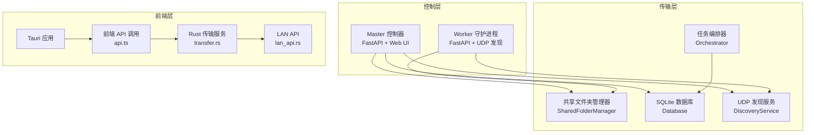
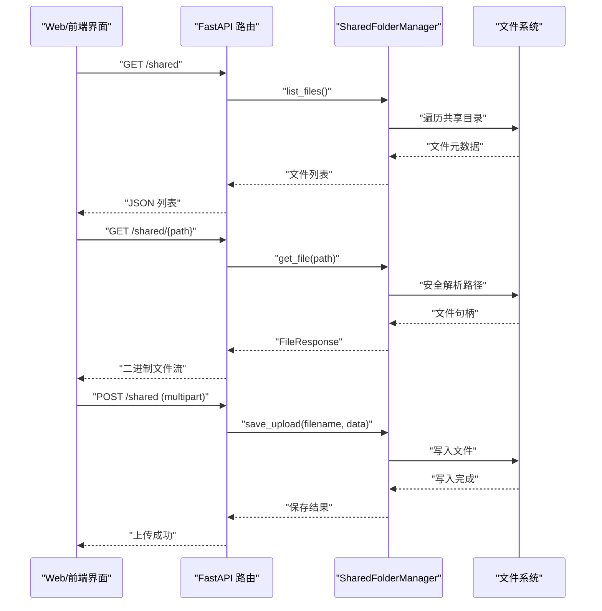
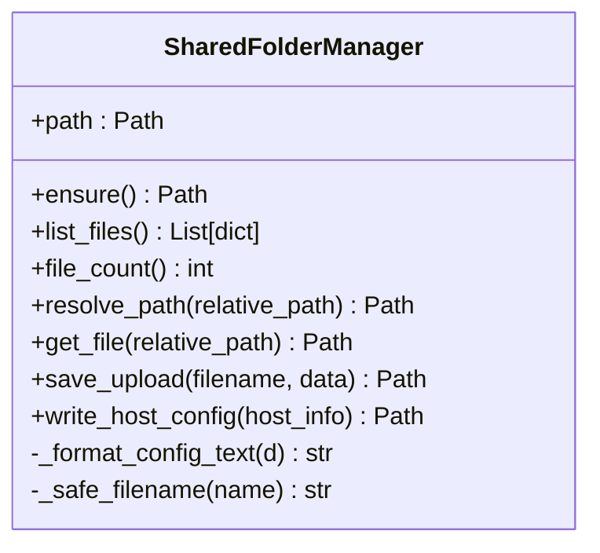
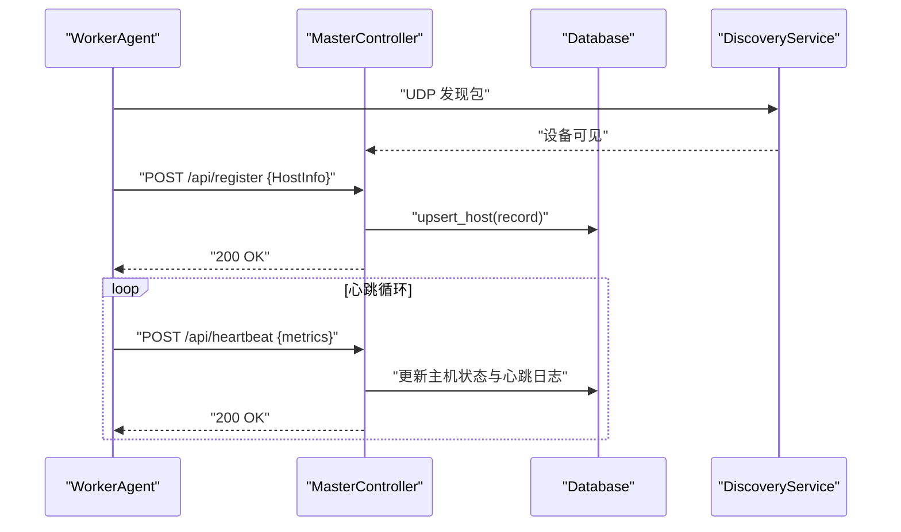
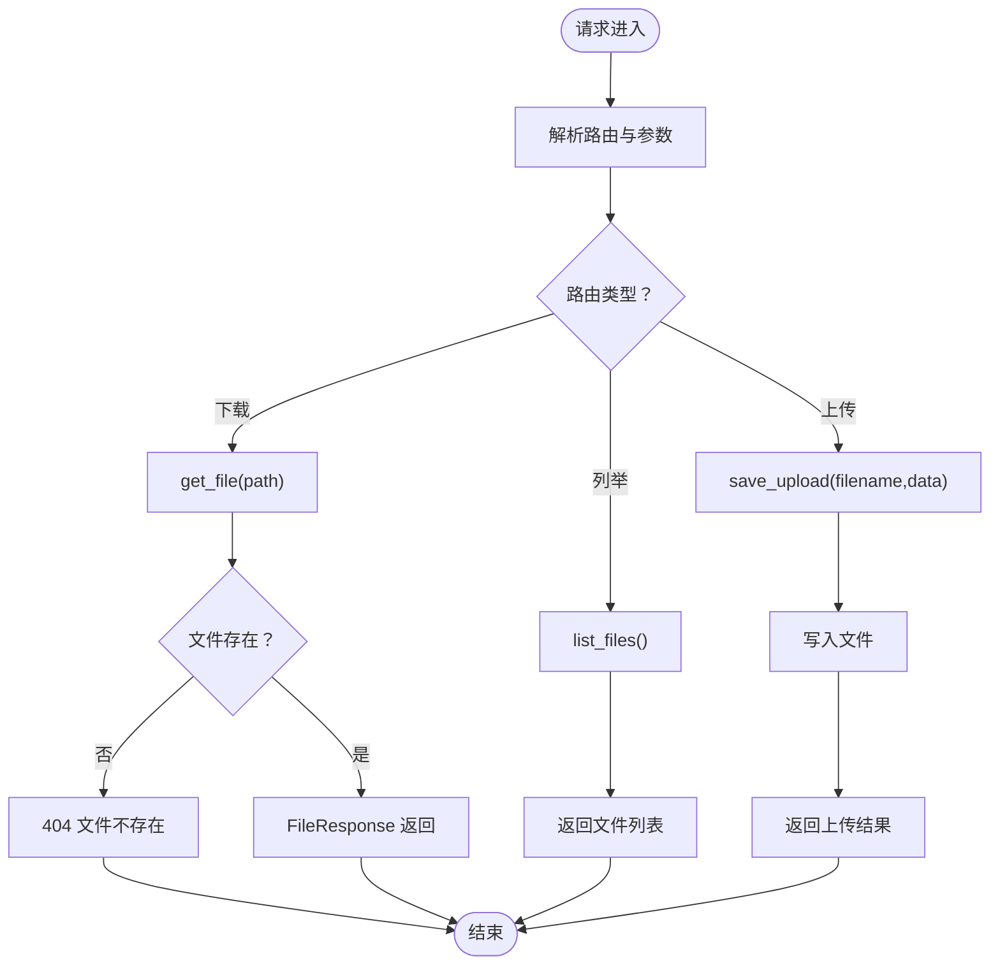
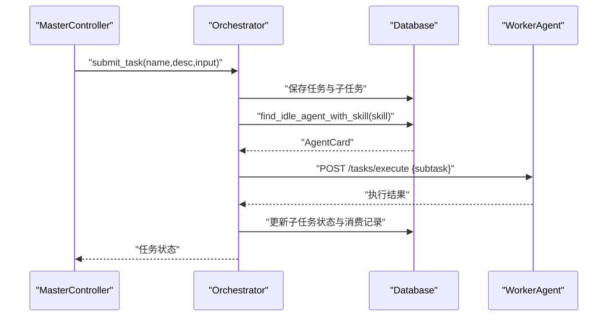
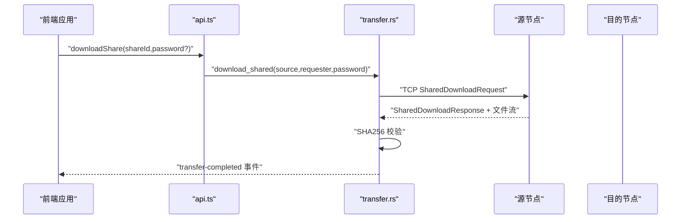
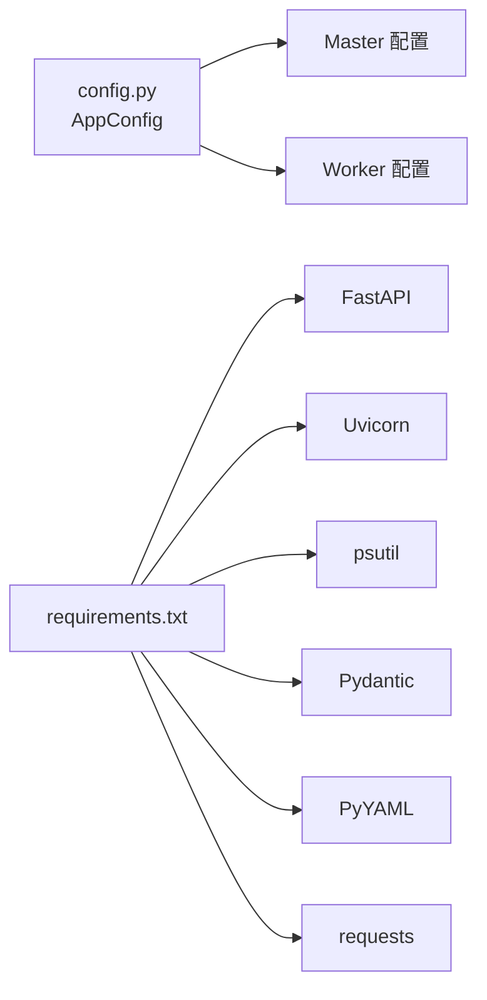

# 文件共享系统

<cite>
**本文引用的文件**
- [shared_folder.py](file://lan_mesh/shared_folder.py)
- [master.py](file://lan_mesh/master.py)
- [worker.py](file://lan_mesh/worker.py)
- [api.py](file://lan_mesh/api.py)
- [config.py](file://lan_mesh/config.py)
- [database.py](file://lan_mesh/database.py)
- [discovery.py](file://lan_mesh/discovery.py)
- [host_info.py](file://lan_mesh/host_info.py)
- [protocol.py](file://lan_mesh/protocol.py)
- [orchestrator.py](file://lan_mesh/orchestrator.py)
- [config.yaml](file://config.yaml)
- [requirements.txt](file://requirements.txt)
- [lan_api.rs](file://quicklan-main/src-tauri/src/lan_api.rs)
- [transfer.rs](file://quicklan-main/src-tauri/src/transfer.rs)
- [api.ts](file://quicklan-main/src/api.ts)
</cite>

## 目录
1. [简介](#简介)
2. [项目结构](#项目结构)
3. [核心组件](#核心组件)
4. [架构总览](#架构总览)
5. [详细组件分析](#详细组件分析)
6. [依赖关系分析](#依赖关系分析)
7. [性能考虑](#性能考虑)
8. [故障排查指南](#故障排查指南)
9. [结论](#结论)
10. [附录](#附录)

## 简介
本文件共享系统采用“Master/Worker”分布式架构，围绕共享文件夹管理、文件传输协议与权限控制机制构建。系统通过 UDP 广播发现节点、HTTP API 进行注册与心跳、SQLite 持久化主机信息，并提供 Web UI 仪表盘与任务编排能力。文件传输采用 HTTP 与 TCP 结合的方式，结合 SHA256 校验保障完整性。

## 项目结构
系统主要分为三层：
- 控制层（Master/Worker）：负责节点发现、注册、心跳、Web UI 与任务编排。
- 传输层（Python/Tauri Rust）：提供本地共享文件夹与跨节点文件传输能力。
- 前端层（Tauri + React）：通过 Tauri 桥接调用 Rust 传输服务与 LAN API。

**图表来源**
- [master.py:67-324](file://lan_mesh/master.py#L67-L324)
- [worker.py:62-325](file://lan_mesh/worker.py#L62-L325)
- [api.py:39-526](file://lan_mesh/api.py#L39-L526)
- [database.py:16-611](file://lan_mesh/database.py#L16-L611)
- [discovery.py:33-259](file://lan_mesh/discovery.py#L33-L259)
- [shared_folder.py:16-219](file://lan_mesh/shared_folder.py#L16-L219)
- [orchestrator.py:58-262](file://lan_mesh/orchestrator.py#L58-L262)
- [transfer.rs:30-750](file://quicklan-main/src-tauri/src/transfer.rs#L30-L750)
- [lan_api.rs:19-177](file://quicklan-main/src-tauri/src/lan_api.rs#L19-L177)
- [api.ts:1-130](file://quicklan-main/src/api.ts#L1-L130)

**章节来源**
- [master.py:1-324](file://lan_mesh/master.py#L1-L324)
- [worker.py:1-325](file://lan_mesh/worker.py#L1-L325)
- [api.py:1-539](file://lan_mesh/api.py#L1-L539)
- [config.py:1-84](file://lan_mesh/config.py#L1-L84)
- [config.yaml:1-22](file://config.yaml#L1-L22)

## 核心组件
- SharedFolderManager：负责共享目录的创建、文件列举、下载、上传与主机配置报告生成。
- MasterController：启动 UDP 发现、注册与心跳、持久化主机信息、提供 Web UI 与 WebSocket 推送。
- WorkerAgent：自动采集本机信息、暴露共享文件夹、注册与心跳、提供任务执行端点。
- Database：SQLite 存储主机、Agent、任务与项目信息，支持心跳日志与消费记录。
- DiscoveryService：UDP 广播发现、设备列表维护与 TTL 清理。
- Orchestrator：任务分解、Agent 匹配、子任务分发与结果聚合。
- 前端传输服务：Rust 实现的 TCP 传输、共享下载、SHA256 校验与进度事件。

**章节来源**
- [shared_folder.py:16-219](file://lan_mesh/shared_folder.py#L16-L219)
- [master.py:67-324](file://lan_mesh/master.py#L67-L324)
- [worker.py:62-325](file://lan_mesh/worker.py#L62-L325)
- [database.py:16-611](file://lan_mesh/database.py#L16-L611)
- [discovery.py:33-259](file://lan_mesh/discovery.py#L33-L259)
- [orchestrator.py:58-262](file://lan_mesh/orchestrator.py#L58-L262)
- [transfer.rs:30-750](file://quicklan-main/src-tauri/src/transfer.rs#L30-L750)
- [lan_api.rs:19-177](file://quicklan-main/src-tauri/src/lan_api.rs#L19-L177)

## 架构总览
系统采用“Master/Worker”中心化控制与去中心化文件共享相结合的模式：
- Master 负责发现、注册、心跳、持久化与 Web UI；Worker 负责共享文件夹与任务执行。
- 文件传输通过 HTTP 列举/下载/上传与 TCP 共享下载两种路径实现，前者面向 Web UI，后者面向 Rust 前端应用。
- 权限控制通过共享文件夹的安全路径解析与上传命名规范实现，同时前端传输服务支持密码保护共享项（在 Rust 层实现）。

**图表来源**
- [api.py:62-96](file://lan_mesh/api.py#L62-L96)
- [shared_folder.py:39-118](file://lan_mesh/shared_folder.py#L39-L118)

**章节来源**
- [api.py:1-539](file://lan_mesh/api.py#L1-L539)
- [shared_folder.py:1-219](file://lan_mesh/shared_folder.py#L1-L219)

## 详细组件分析

### SharedFolderManager 组件分析
- 功能职责
  - 自动创建共享目录并写入说明文件。
  - 递归列举共享目录内容，统计文件数量与目录大小。
  - 安全解析相对路径，防止路径穿越攻击。
  - 保存上传文件，避免同名冲突并清理非法字符。
  - 自动生成主机配置报告（JSON 与 TXT），便于人类与机器阅读。
- 安全策略
  - 路径解析严格限定在共享目录内，出现越界即报错。
  - 上传文件名清洗，移除非法字符并处理重复命名。
- 版本管理
  - 当前版本未实现多版本文件管理；可通过文件名后缀或子目录实现版本化（建议）。

**图表来源**
- [shared_folder.py:16-219](file://lan_mesh/shared_folder.py#L16-L219)

**章节来源**
- [shared_folder.py:16-219](file://lan_mesh/shared_folder.py#L16-L219)

### Master 控制器与 Worker 守护进程
- Master 职责
  - 启动 UDP 发现、注册与心跳、持久化主机信息、提供 Web UI 与 WebSocket 推送。
  - 定期刷新共享文件夹中的主机配置报告。
  - 启动配置刷新与离线清理线程。
- Worker 职责
  - 自动采集本机信息、暴露共享文件夹、注册与心跳。
  - 向 Master 发送心跳并同步共享配置报告。
  - 提供任务执行端点，供 Master 分发子任务。

**图表来源**
- [master.py:115-174](file://lan_mesh/master.py#L115-L174)
- [worker.py:126-215](file://lan_mesh/worker.py#L126-L215)
- [api.py:116-168](file://lan_mesh/api.py#L116-L168)
- [database.py:147-201](file://lan_mesh/database.py#L147-L201)

**章节来源**
- [master.py:67-324](file://lan_mesh/master.py#L67-L324)
- [worker.py:62-325](file://lan_mesh/worker.py#L62-L325)
- [api.py:103-250](file://lan_mesh/api.py#L103-L250)
- [database.py:16-290](file://lan_mesh/database.py#L16-L290)

### 文件传输协议与 HTTP API
- HTTP 文件接口
  - 列举共享文件：GET /shared
  - 下载共享文件：GET /shared/{path}
  - 上传文件：POST /shared
- WebSocket 实时推送
  - /ws：向客户端推送主机状态变更。
- 错误处理
  - 路径越界返回 403，文件不存在返回 404。
- 并发控制
  - FastAPI 基于 uvicorn，默认多进程/线程模型；上传/下载为同步 IO，建议在高并发场景引入异步与限流策略。

**图表来源**
- [api.py:62-96](file://lan_mesh/api.py#L62-L96)
- [shared_folder.py:39-118](file://lan_mesh/shared_folder.py#L39-L118)

**章节来源**
- [api.py:1-539](file://lan_mesh/api.py#L1-L539)
- [shared_folder.py:1-219](file://lan_mesh/shared_folder.py#L1-L219)

### 任务编排与权限控制
- 任务编排
  - Orchestrator 将顶层任务分解为子任务 DAG，匹配空闲 Agent 并分发执行。
  - 支持项目预算控制与消费记录，记录 Token 数量与成本。
- 权限控制
  - 共享文件夹层面：路径解析防穿越、上传文件名清洗。
  - 前端传输服务：支持共享项密码保护（Rust 层实现）。

**图表来源**
- [orchestrator.py:70-226](file://lan_mesh/orchestrator.py#L70-L226)
- [database.py:421-488](file://lan_mesh/database.py#L421-L488)

**章节来源**
- [orchestrator.py:1-262](file://lan_mesh/orchestrator.py#L1-L262)
- [database.py:1-611](file://lan_mesh/database.py#L1-L611)

### 前端传输与 TCP 文件流
- Rust 传输服务
  - 启动 TCP 监听，处理“快速发送”与“共享下载”两类请求。
  - 采用 JSON 帧头与固定缓冲区传输，支持进度事件与 SHA256 校验。
- LAN API
  - 提供清单查询与下载完成上报，配合前端传输服务实现跨节点文件共享。

**图表来源**
- [transfer.rs:222-539](file://quicklan-main/src-tauri/src/transfer.rs#L222-L539)
- [lan_api.rs:106-114](file://quicklan-main/src-tauri/src/lan_api.rs#L106-L114)
- [api.ts:119-121](file://quicklan-main/src/api.ts#L119-L121)

**章节来源**
- [transfer.rs:1-825](file://quicklan-main/src-tauri/src/transfer.rs#L1-L825)
- [lan_api.rs:1-177](file://quicklan-main/src-tauri/src/lan_api.rs#L1-L177)
- [api.ts:1-130](file://quicklan-main/src/api.ts#L1-L130)

## 依赖关系分析
- 配置管理
  - 通过 Pydantic 的 AppConfig 加载 YAML 与环境变量，统一管理 discovery、worker、master 三类配置。
- 运行时依赖
  - FastAPI + Uvicorn 提供 HTTP API；psutil 采集主机信息；requests 用于节点间通信。
- 前端依赖
  - Tauri + Rust 提供高性能传输与跨平台桌面体验；TypeScript 调用 Rust 桥接。

**图表来源**
- [config.py:36-84](file://lan_mesh/config.py#L36-L84)
- [config.yaml:1-22](file://config.yaml#L1-L22)
- [requirements.txt:1-8](file://requirements.txt#L1-L8)

**章节来源**
- [config.py:1-84](file://lan_mesh/config.py#L1-L84)
- [config.yaml:1-22](file://config.yaml#L1-L22)
- [requirements.txt:1-8](file://requirements.txt#L1-L8)

## 性能考虑
- I/O 与并发
  - HTTP 文件上传/下载为同步 IO，建议在高并发场景引入异步 FastAPI 与限流策略。
  - TCP 传输采用固定缓冲区与进度事件，适合大文件稳定传输。
- 存储与索引
  - SQLite 索引覆盖心跳日志与任务状态，满足中小规模集群；大规模场景建议迁移到 PostgreSQL。
- 网络与发现
  - UDP 广播间隔与 TTL 可调，平衡发现延迟与网络开销。

[本节为通用指导，不直接分析具体文件]

## 故障排查指南
- 端口占用
  - Master/Worker 启动时会尝试寻找可用端口，若端口被占用需调整配置或释放端口。
- UDP 发现失败
  - 检查防火墙与广播地址计算，确认端口绑定与权限。
- 文件下载 404/403
  - 确认路径未越界，文件确实存在于共享目录。
- 心跳异常
  - 检查 Master/Worker 间网络连通性与超时设置。
- 前端传输失败
  - 查看 SHA256 校验失败日志与 TCP 连接错误，确认防火墙放行与共享项密码正确。

**章节来源**
- [master.py:225-249](file://lan_mesh/master.py#L225-L249)
- [worker.py:240-250](file://lan_mesh/worker.py#L240-L250)
- [discovery.py:155-214](file://lan_mesh/discovery.py#L155-L214)
- [api.py:81-84](file://lan_mesh/api.py#L81-L84)
- [transfer.rs:591-595](file://quicklan-main/src-tauri/src/transfer.rs#L591-L595)

## 结论
本系统以 Master/Worker 架构实现了稳定的分布式文件共享与传输能力，结合 UDP 发现、HTTP API 与 SQLite 持久化，提供了从节点管理到文件传输的完整方案。前端通过 Rust 传输服务与 LAN API 实现跨节点高效、安全的文件共享。后续可在共享版本管理、权限细化与数据库扩展方面进一步增强。

[本节为总结性内容，不直接分析具体文件]

## 附录
- 配置示例与默认值参见配置文件与配置模块。
- 前端 API 调用与桥接参见前端 TypeScript 与 Rust 桥接文件。

**章节来源**
- [config.yaml:1-22](file://config.yaml#L1-L22)
- [config.py:48-84](file://lan_mesh/config.py#L48-L84)
- [api.ts:1-130](file://quicklan-main/src/api.ts#L1-L130)
- [lan_api.rs:19-177](file://quicklan-main/src-tauri/src/lan_api.rs#L19-L177)