# 架构设计

<cite>
**本文引用的文件**
- [main.py](file://main.py)
- [station_controller.py](file://lan_mesh/station_controller.py)
- [worker.py](file://lan_mesh/worker.py)
- [discovery.py](file://lan_mesh/discovery.py)
- [api.py](file://lan_mesh/api.py)
- [config.py](file://lan_mesh/config.py)
- [protocol.py](file://lan_mesh/protocol.py)
- [database.py](file://lan_mesh/database.py)
- [host_info.py](file://lan_mesh/host_info.py)
- [orchestrator.py](file://lan_mesh/orchestrator.py)
- [model_router.py](file://lan_mesh/model_router.py)
- [project.py](file://lan_mesh/project.py)
- [mcp_gateway.py](file://lan_mesh/mcp_gateway.py)
- [mcp_client.py](file://lan_mesh/mcp_client.py)
- [agent_runtime.py](file://lan_mesh/agent_runtime.py)
- [task.py](file://lan_mesh/task.py)
- [tool_registry.py](file://lan_mesh/tool_registry.py)
- [bot_gateway.py](file://lan_mesh/bot_gateway.py)
- [station_api.py](file://lan_mesh/station_api.py)
- [App.tsx](file://quicklan-main/src/App.tsx)
- [api.ts](file://quicklan-main/src/api.ts)
- [types.ts](file://quicklan-main/src/types.ts)
- [lib.rs](file://quicklan-main/src-tauri/src/lib.rs)
- [requirements.txt](file://requirements.txt)
- [dashboard.html](file://lan_mesh/web/templates/dashboard.html)
</cite>

## 目录
1. [简介](#简介)
2. [项目结构](#项目结构)
3. [核心组件](#核心组件)
4. [架构总览](#架构总览)
5. [详细组件分析](#详细组件分析)
6. [依赖分析](#依赖分析)
7. [性能考虑](#性能考虑)
8. [故障排查指南](#故障排查指南)
9. [结论](#结论)
10. [附录](#附录)

## 简介
Work Station 项目包含两个主要子系统：Python 实现的 LAN Mesh 分布式控制与协作框架，以及基于 Tauri/React 的桌面前端 QuickLAN。本文聚焦 LAN Mesh 的 Master/Worker 分布式架构，系统性阐述以下主题：
- Master/Worker 模式的职责划分与交互流程
- UDP 广播发现机制与网络拓扑
- WebSocket 实时通信与状态同步
- 前后端分离设计（RESTful API + 前端应用）
- 分布式任务编排系统、模型路由器、项目隔离和 MCP 工具网关等核心架构组件
- **新增**：Bot Gateway 移动交互层，支持企业微信和 Telegram 双向通信
- 系统边界与组件关系图
- 架构决策的技术考量与性能影响

## 项目结构
项目采用"多模块 Python 包 + 前端 Tauri 应用"的混合架构：
- Python 后端（lan_mesh 包）：提供 Master/Worker 节点、发现服务、数据库、协议与 API 路由，以及新增的分布式任务编排、模型路由器、项目管理、MCP 工具网关和 **Bot Gateway 移动交互层**
- 前端（quicklan-main）：基于 React + Tauri，通过 invoke 调用后端命令，实现设备发现、文件共享与传输管理

```mermaid
graph TB
subgraph "Python 后端"
M["StationController<br/>lan_mesh/station_controller.py"]
W["WorkerAgent<br/>lan_mesh/worker.py"]
D["DiscoveryService<br/>lan_mesh/discovery.py"]
DB["Database<br/>lan_mesh/database.py"]
API["FastAPI 路由<br/>lan_mesh/api.py"]
CFG["配置管理<br/>lan_mesh/config.py"]
PROT["协议与模型<br/>lan_mesh/protocol.py"]
HI["主机信息采集<br/>lan_mesh/host_info.py"]
ORCH["任务编排器<br/>lan_mesh/orchestrator.py"]
ROUTER["模型路由器<br/>lan_mesh/model_router.py"]
PM["项目管理器<br/>lan_mesh/project.py"]
MCP_G["MCP 网关<br/>lan_mesh/mcp_gateway.py"]
MCP_C["MCP 客户端<br/>lan_mesh/mcp_client.py"]
AR["Agent 运行时<br/>lan_mesh/agent_runtime.py"]
TR["工具注册表<br/>lan_mesh/tool_registry.py"]
TASK["任务 DAG<br/>lan_mesh/task.py"]
BOT["BotGateway<br/>lan_mesh/bot_gateway.py"]
END
subgraph "前端应用"
FE_APP["React 应用<br/>quicklan-main/src/App.tsx"]
FE_API["API 封装<br/>quicklan-main/src/api.ts"]
FE_TYPES["类型定义<br/>quicklan-main/src/types.ts"]
TAURI["Tauri 引擎<br/>quicklan-main/src-tauri/src/lib.rs"]
END
M --- D
M --- DB
M --- API
M --- ORCH
M --- ROUTER
M --- PM
M --- MCP_G
W --- D
W --- API
W --- AR
API --- DB
FE_APP --- FE_API
FE_API --- TAURI
TAURI --- M
TAURI --- W
BOT -.-> M
```

**图表来源**
- [station_controller.py](file://lan_mesh/station_controller.py)
- [worker.py](file://lan_mesh/worker.py)
- [discovery.py](file://lan_mesh/discovery.py)
- [database.py](file://lan_mesh/database.py)
- [api.py](file://lan_mesh/api.py)
- [config.py](file://lan_mesh/config.py)
- [protocol.py](file://lan_mesh/protocol.py)
- [host_info.py](file://lan_mesh/host_info.py)
- [orchestrator.py](file://lan_mesh/orchestrator.py)
- [model_router.py](file://lan_mesh/model_router.py)
- [project.py](file://lan_mesh/project.py)
- [mcp_gateway.py](file://lan_mesh/mcp_gateway.py)
- [mcp_client.py](file://lan_mesh/mcp_client.py)
- [agent_runtime.py](file://lan_mesh/agent_runtime.py)
- [tool_registry.py](file://lan_mesh/tool_registry.py)
- [task.py](file://lan_mesh/task.py)
- [bot_gateway.py](file://lan_mesh/bot_gateway.py)
- [App.tsx](file://quicklan-main/src/App.tsx)
- [api.ts](file://quicklan-main/src/api.ts)
- [types.ts](file://quicklan-main/src/types.ts)
- [lib.rs](file://quicklan-main/src-tauri/src/lib.rs)

**章节来源**
- [main.py](file://main.py)
- [station_controller.py](file://lan_mesh/station_controller.py)
- [worker.py](file://lan_mesh/worker.py)
- [discovery.py](file://lan_mesh/discovery.py)
- [api.py](file://lan_mesh/api.py)
- [config.py](file://lan_mesh/config.py)
- [protocol.py](file://lan_mesh/protocol.py)
- [database.py](file://lan_mesh/database.py)
- [host_info.py](file://lan_mesh/host_info.py)
- [orchestrator.py](file://lan_mesh/orchestrator.py)
- [model_router.py](file://lan_mesh/model_router.py)
- [project.py](file://lan_mesh/project.py)
- [mcp_gateway.py](file://lan_mesh/mcp_gateway.py)
- [mcp_client.py](file://lan_mesh/mcp_client.py)
- [agent_runtime.py](file://lan_mesh/agent_runtime.py)
- [tool_registry.py](file://lan_mesh/tool_registry.py)
- [task.py](file://lan_mesh/task.py)
- [bot_gateway.py](file://lan_mesh/bot_gateway.py)
- [App.tsx](file://quicklan-main/src/App.tsx)
- [api.ts](file://quicklan-main/src/api.ts)
- [types.ts](file://quicklan-main/src/types.ts)
- [lib.rs](file://quicklan-main/src-tauri/src/lib.rs)

## 核心组件
- StationController：**核心控制节点**，负责 UDP 广播发现、HTTP API、WebSocket 推送、数据库持久化、共享文件夹管理、任务编排、MCP 工具网关和 **Bot Gateway 移动交互层**
- WorkerAgent：工作节点，负责本机信息采集、共享文件夹、UDP 发现、HTTP 注册与心跳、任务执行
- DiscoveryService：UDP 广播发现服务，周期性广播 presence、监听其他设备、TTL 清理
- FastAPI 路由：统一暴露 RESTful API，包含 Worker API 与 Master API，并提供 WebSocket
- Database：SQLite 存储，持久化主机、心跳、Agent、任务、项目与用量记录
- 协议与模型：定义 DiscoveryPacket、HostInfo、HostRecord、AgentCard、Task 等数据结构
- 主机信息采集：基于 psutil 的 CPU/内存/磁盘/网络信息采集
- 前端应用：React + Tauri，通过 invoke 调用后端命令，实现设备发现、共享与传输管理
- **分布式任务编排系统**：基于 DAG 的任务分解与调度，支持复杂任务的自动拆解和并行执行
- **模型路由器**：L1-L4 难度分级 + 加权评分算法，支持多 Provider 模型路由和降级链容灾
- **项目管理系统**：项目隔离、预算控制、Token 用量计量和成本实时追踪
- **MCP 工具网关**：动态加载外部工具，支持 MCP 协议兼容的工具注册和调用
- **Bot Gateway 移动交互层**：**新增**，支持企业微信和 Telegram 双向通信，提供手机端通知和命令交互

**章节来源**
- [station_controller.py](file://lan_mesh/station_controller.py)
- [worker.py](file://lan_mesh/worker.py)
- [discovery.py](file://lan_mesh/discovery.py)
- [api.py](file://lan_mesh/api.py)
- [database.py](file://lan_mesh/database.py)
- [protocol.py](file://lan_mesh/protocol.py)
- [host_info.py](file://lan_mesh/host_info.py)
- [orchestrator.py](file://lan_mesh/orchestrator.py)
- [model_router.py](file://lan_mesh/model_router.py)
- [project.py](file://lan_mesh/project.py)
- [mcp_gateway.py](file://lan_mesh/mcp_gateway.py)
- [mcp_client.py](file://lan_mesh/mcp_client.py)
- [agent_runtime.py](file://lan_mesh/agent_runtime.py)
- [tool_registry.py](file://lan_mesh/tool_registry.py)
- [task.py](file://lan_mesh/task.py)
- [bot_gateway.py](file://lan_mesh/bot_gateway.py)
- [App.tsx](file://quicklan-main/src/App.tsx)
- [api.ts](file://quicklan-main/src/api.ts)
- [types.ts](file://quicklan-main/src/types.ts)
- [lib.rs](file://quicklan-main/src-tauri/src/lib.rs)

## 架构总览
LAN Mesh 采用 Master/Worker 分布式架构，现已扩展为完整的 AI 工作站平台：
- StationController 作为控制中心，提供 Web UI、REST API、WebSocket 实时推送与数据库持久化
- Worker 节点作为执行单元，负责本机信息采集与共享文件夹，通过 HTTP 向 StationController 注册与心跳
- DiscoveryService 通过 UDP 广播实现节点发现与网络拓扑感知
- 前端通过 Tauri invoke 调用后端命令，实现设备发现、共享与传输管理
- **新增**：分布式任务编排引擎负责复杂任务的自动拆解和调度
- **新增**：模型路由器提供智能的多 Provider 模型选择和降级容灾
- **新增**：项目管理系统实现预算控制和成本追踪
- **新增**：MCP 工具网关统一管理外部工具调用
- **新增**：Bot Gateway 移动交互层提供企业微信和 Telegram 双向通信

```mermaid
graph TB
subgraph "网络层"
UDP["UDP 广播<br/>DiscoveryService"]
TCP["TCP/HTTP API<br/>FastAPI"]
WS["WebSocket<br/>实时推送"]
WEBHOOK["Webhook<br/>企业微信"]
TG["Telegram API<br/>双向通信"]
END
subgraph "控制面"
STATION["StationController"]
DB["Database"]
UI["Web UI"]
ORCH["任务编排器"]
ROUTER["模型路由器"]
PM["项目管理器"]
MCP_G["MCP 网关"]
BOT["BotGateway"]
END
subgraph "数据面"
WORKERS["WorkerAgent(s)"]
SHARED["共享文件夹"]
AR["Agent 运行时"]
TR["工具注册表"]
TASK["任务 DAG"]
END
UDP --> STATION
TCP --> STATION
WS --> UI
WEBHOOK --> BOT
TG --> BOT
TCP --> WORKERS
SHARED --> WORKERS
SHARED --> STATION
STATION --> DB
WORKERS --> DB
WORKERS --> AR
AR --> TR
ORCH --> TASK
ORCH --> ROUTER
ORCH --> PM
MCP_G --> TR
BOT --> ORCH
```

**图表来源**
- [station_controller.py](file://lan_mesh/station_controller.py)
- [worker.py](file://lan_mesh/worker.py)
- [discovery.py](file://lan_mesh/discovery.py)
- [api.py](file://lan_mesh/api.py)
- [database.py](file://lan_mesh/database.py)
- [orchestrator.py](file://lan_mesh/orchestrator.py)
- [model_router.py](file://lan_mesh/model_router.py)
- [project.py](file://lan_mesh/project.py)
- [mcp_gateway.py](file://lan_mesh/mcp_gateway.py)
- [agent_runtime.py](file://lan_mesh/agent_runtime.py)
- [tool_registry.py](file://lan_mesh/tool_registry.py)
- [task.py](file://lan_mesh/task.py)
- [bot_gateway.py](file://lan_mesh/bot_gateway.py)

## 详细组件分析

### StationController 组件分析
- 职责
  - 生成设备 ID、采集本机信息、创建共享文件夹
  - 启动 UDP 发现、HTTP API（含 Web UI）、WebSocket 推送、离线清理
  - 持久化主机信息到 SQLite，提供任务编排与 MCP 工具网关
  - **新增**：初始化并管理 Bot Gateway 移动交互层
- 关键流程
  - 启动前自检、端口查找、创建共享文件夹、部署采集脚本
  - 启动 DiscoveryService、配置刷新线程、离线清理线程
  - 创建 FastAPI 应用，注册 Master/Worker 路由，启动 Uvicorn 服务器
  - 启动 WebSocket 推送后台任务，定时向客户端推送主机状态
  - 初始化任务编排器、模型路由器、项目管理器和 MCP 网关
  - **新增**：加载 Bot 通道配置，设置命令处理回调，启动 Telegram 轮询

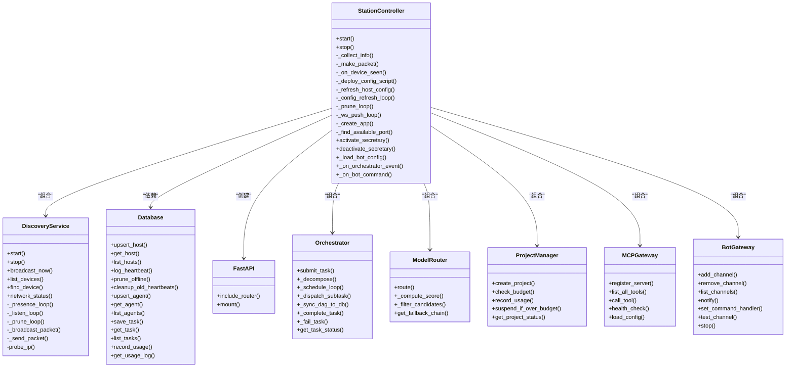

**图表来源**
- [station_controller.py](file://lan_mesh/station_controller.py)
- [discovery.py](file://lan_mesh/discovery.py)
- [database.py](file://lan_mesh/database.py)
- [api.py](file://lan_mesh/api.py)
- [orchestrator.py](file://lan_mesh/orchestrator.py)
- [model_router.py](file://lan_mesh/model_router.py)
- [project.py](file://lan_mesh/project.py)
- [mcp_gateway.py](file://lan_mesh/mcp_gateway.py)
- [bot_gateway.py](file://lan_mesh/bot_gateway.py)

**章节来源**
- [station_controller.py](file://lan_mesh/station_controller.py)
- [discovery.py](file://lan_mesh/discovery.py)
- [database.py](file://lan_mesh/database.py)
- [api.py](file://lan_mesh/api.py)
- [orchestrator.py](file://lan_mesh/orchestrator.py)
- [model_router.py](file://lan_mesh/model_router.py)
- [project.py](file://lan_mesh/project.py)
- [mcp_gateway.py](file://lan_mesh/mcp_gateway.py)
- [bot_gateway.py](file://lan_mesh/bot_gateway.py)

### WorkerAgent 组件分析
- 职责
  - 采集本机信息、创建共享文件夹、暴露 HTTP API
  - 通过 UDP 发现 StationController，HTTP 注册与心跳，维护 Agent Card
  - 执行 StationController 分发的子任务，支持多种技能类型的处理
- 关键流程
  - 启动前自检、查找可用端口、启动 DiscoveryService
  - 部署采集脚本、写入初始配置报告、创建 Agent Runtime
  - 心跳循环：注册、心跳、失败重连、刷新共享配置
  - 接收子任务并调用相应的技能处理器执行

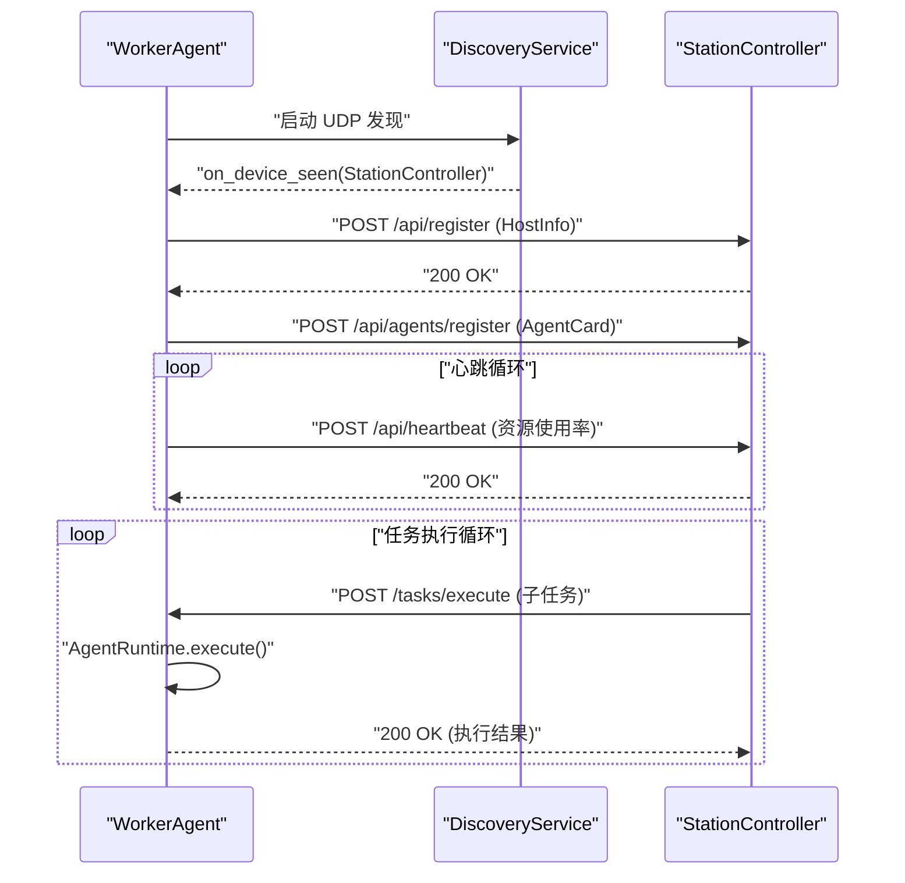

**图表来源**
- [worker.py](file://lan_mesh/worker.py)
- [api.py](file://lan_mesh/api.py)
- [discovery.py](file://lan_mesh/discovery.py)
- [agent_runtime.py](file://lan_mesh/agent_runtime.py)

**章节来源**
- [worker.py](file://lan_mesh/worker.py)
- [api.py](file://lan_mesh/api.py)
- [discovery.py](file://lan_mesh/discovery.py)
- [agent_runtime.py](file://lan_mesh/agent_runtime.py)

### DiscoveryService 组件分析
- 功能
  - presence_loop：周期性广播自身存在
  - listen_loop：监听 UDP 广播，回送 presence，更新设备列表，触发回调
  - prune_loop：定期清理超时离线设备
  - 提供设备查询、网络状态、主动探测 IP
- 网络拓扑
  - 使用广播地址 255.255.255.255 与各子网广播地址
  - 端口固定为 45454，便于跨主机发现

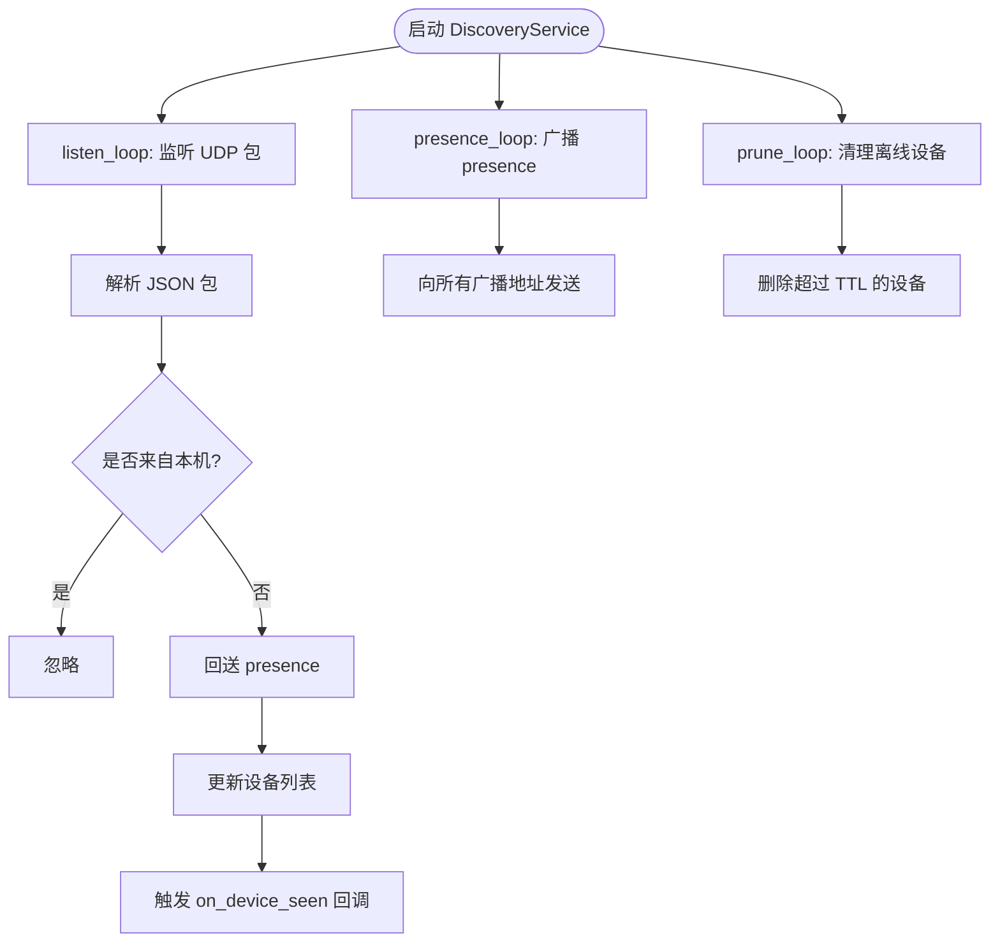

**图表来源**
- [discovery.py](file://lan_mesh/discovery.py)
- [host_info.py](file://lan_mesh/host_info.py)
- [protocol.py](file://lan_mesh/protocol.py)

**章节来源**
- [discovery.py](file://lan_mesh/discovery.py)
- [host_info.py](file://lan_mesh/host_info.py)
- [protocol.py](file://lan_mesh/protocol.py)

### WebSocket 实时通信架构
- 连接管理
  - StationController 提供 /ws 端点，接受 WebSocket 连接，维护客户端集合
  - 客户端每 30 秒发送 ping 文本，服务端响应 ping，超时断开
- 消息格式
  - 服务端推送的消息包含 type 与 data 字段
  - 常见类型：hosts（主机列表）、host_registered（新增主机）、heartbeat（心跳更新）
- 状态同步
  - 后台任务每 3 秒推送一次 hosts 列表
  - 注册与心跳事件即时推送

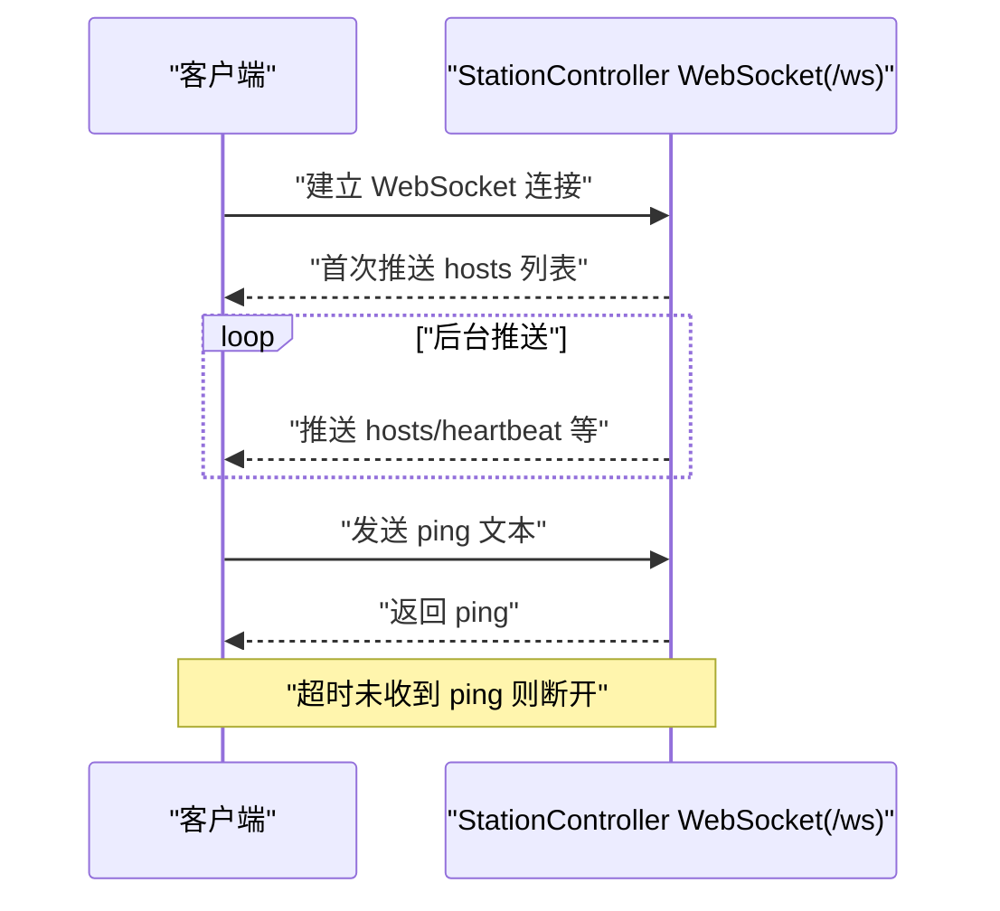

**图表来源**
- [api.py](file://lan_mesh/api.py)
- [station_controller.py](file://lan_mesh/station_controller.py)

**章节来源**
- [api.py](file://lan_mesh/api.py)
- [station_controller.py](file://lan_mesh/station_controller.py)

### 前后端分离设计
- 后端（Python/FastAPI）
  - 提供 RESTful API：注册、心跳、主机列表、网络状态、发现设备、WebSocket
  - 提供 Web UI：仪表盘页面，包含 **Bot 通道管理** 功能
- 前端（React + Tauri）
  - 通过 invoke 调用后端命令，实现设备列表、共享资源、传输管理
  - **新增**：Bot 通道配置界面，支持企业微信和 Telegram 配置
  - 类型定义与事件监听，保证前后端契约一致性

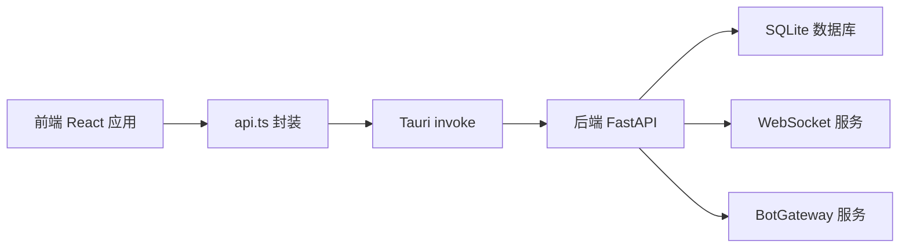

**图表来源**
- [api.ts](file://quicklan-main/src/api.ts)
- [types.ts](file://quicklan-main/src/types.ts)
- [lib.rs](file://quicklan-main/src-tauri/src/lib.rs)
- [api.py](file://lan_mesh/api.py)
- [database.py](file://lan_mesh/database.py)
- [bot_gateway.py](file://lan_mesh/bot_gateway.py)

**章节来源**
- [api.ts](file://quicklan-main/src/api.ts)
- [types.ts](file://quicklan-main/src/types.ts)
- [lib.rs](file://quicklan-main/src-tauri/src/lib.rs)
- [api.py](file://lan_mesh/api.py)
- [database.py](file://lan_mesh/database.py)
- [bot_gateway.py](file://lan_mesh/bot_gateway.py)

### 分布式任务编排系统
- **架构角色**
  - Orchestrator：任务编排器，在 StationController 端运行，负责任务分解、Agent 匹配、子任务分发与结果聚合
  - TaskDAG：任务 DAG 管理，支持子任务依赖关系、拓扑排序和循环依赖检测
  - AgentRuntime：Worker 端 Agent 运行时，接收子任务并执行相应技能处理器
- **核心功能**
  - 任务自动拆解：根据任务类型（代码任务、文档任务、系统任务）自动分解为子任务
  - DAG 构建：构建子任务依赖图，确保执行顺序正确
  - 智能调度：查找匹配的空闲 Agent，按依赖关系并行调度
  - 结果聚合：收集子任务结果并聚合为最终输出
- **关键流程**
  - 任务提交：生成 Task 对象，自动分解为子任务
  - DAG 构建：构建 TaskDAG，检测循环依赖
  - 调度循环：持续分发就绪的子任务
  - 子任务执行：调用 Worker Agent 执行具体任务
  - 状态更新：同步 DAG 状态到数据库

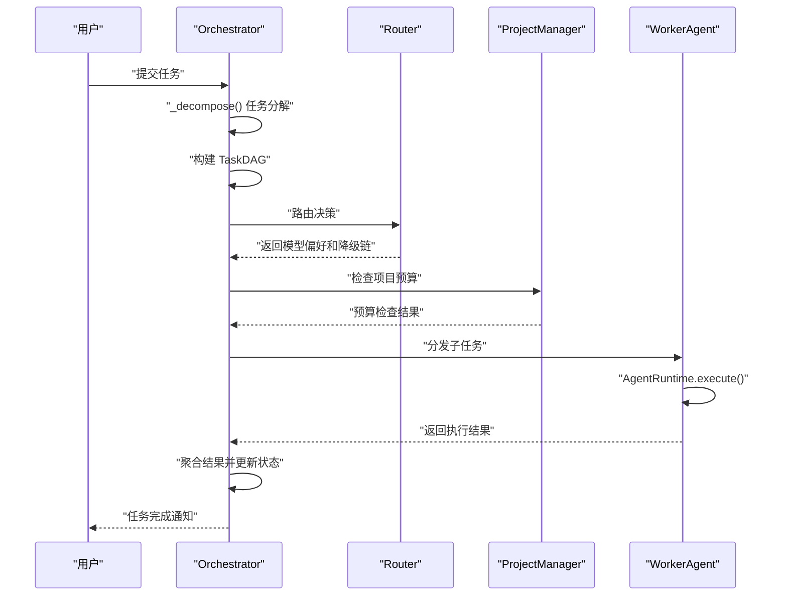

**图表来源**
- [orchestrator.py](file://lan_mesh/orchestrator.py)
- [task.py](file://lan_mesh/task.py)
- [agent_runtime.py](file://lan_mesh/agent_runtime.py)
- [model_router.py](file://lan_mesh/model_router.py)
- [project.py](file://lan_mesh/project.py)

**章节来源**
- [orchestrator.py](file://lan_mesh/orchestrator.py)
- [task.py](file://lan_mesh/task.py)
- [agent_runtime.py](file://lan_mesh/agent_runtime.py)
- [model_router.py](file://lan_mesh/model_router.py)
- [project.py](file://lan_mesh/project.py)

### 模型路由器
- **架构角色**
  - ModelRouter：模型路由器，在 StationController 节点运行，负责任务难度分级、加权评分和降级链管理
- **核心功能**
  - 任务难度分类：基于规则的 L1-L4 难度分级
  - 加权评分算法：综合能力匹配度、成本、速度和负载的评分
  - 降级链容灾：首选模型失败时自动沿降级链重试
  - 策略适配：支持 cost_first、quality_first 和 balanced 策略
- **评分算法**
  - Score = 能力覆盖率×0.4 + 成本反向×0.3 + 速度×0.2 - 负载×0.1
  - 能力覆盖率：Jaccard 相似度计算模型 capabilities 与难度所需能力的匹配程度
  - 成本反向指数：1 - (归一化成本)，越便宜得分越高
  - 速度：直接使用模型配置的速度评分
  - 负载：当前负载率（未来可接入实时监控，默认 0）

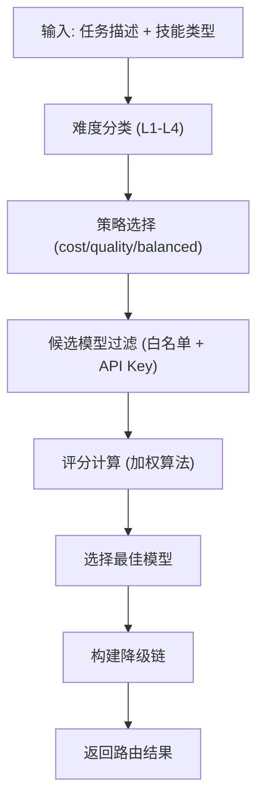

**图表来源**
- [model_router.py](file://lan_mesh/model_router.py)

**章节来源**
- [model_router.py](file://lan_mesh/model_router.py)
- [model_pool.example.yaml](file://lan_mesh/model_pool.example.yaml)

### 项目管理系统
- **架构角色**
  - ProjectManager：项目管理器，在 StationController 节点运行，负责项目生命周期管理和预算控制
- **核心功能**
  - 项目创建：创建独立工作空间、设置预算配额和路由策略
  - 预算控制：实时追踪 Token 用量，超支自动暂停项目
  - 成本计算：基于模型定价表计算单次调用成本
  - 状态查询：提供项目完整状态信息，包括预算使用率和消费记录
- **预算策略**
  - 预算超支 80%：建议切换经济模型
  - 预算超支 100%：自动暂停项目
  - 经济模型：deepseek-chat（成本最低）

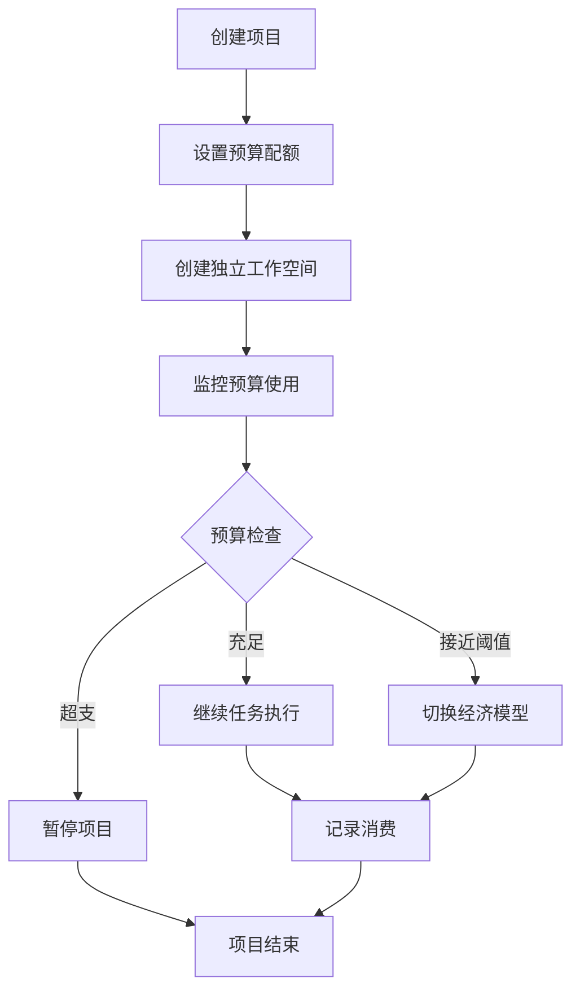

**图表来源**
- [project.py](file://lan_mesh/project.py)

**章节来源**
- [project.py](file://lan_mesh/project.py)

### MCP 工具网关
- **架构角色**
  - MCPGateway：MCP 工具网关，在 StationController 节点运行，负责统一管理 MCP Server 和工具调用
  - MCP 客户端：支持 stdio 和 HTTP 两种传输方式的 MCP 客户端
  - 工具注册表：管理内置工具、插件工具和运行时动态注册的工具
- **核心功能**
  - Server 管理：维护 MCP Server 连接池，支持自动重连
  - 工具聚合：聚合所有 Server 的工具列表，提供统一的工具接口
  - 路由调用：根据工具名称路由到正确的 MCP Server
  - 配置加载：支持 YAML 配置文件加载和运行时动态注册
- **传输方式**
  - stdio：启动本地子进程（如 npx @modelcontextprotocol/server-filesystem）
  - HTTP：连接远程 MCP Server（HTTP + JSON-RPC）

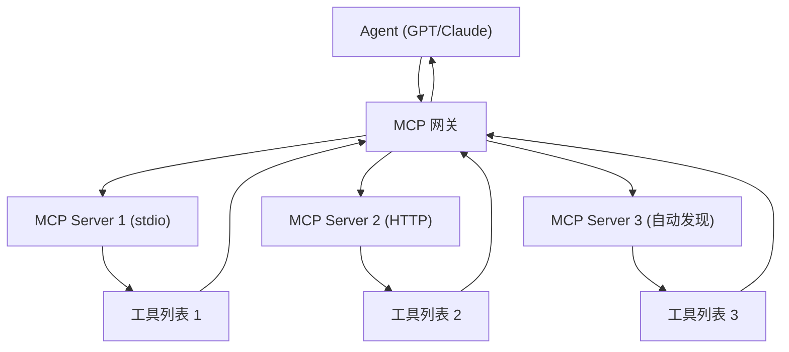

**图表来源**
- [mcp_gateway.py](file://lan_mesh/mcp_gateway.py)
- [mcp_client.py](file://lan_mesh/mcp_client.py)
- [tool_registry.py](file://lan_mesh/tool_registry.py)

**章节来源**
- [mcp_gateway.py](file://lan_mesh/mcp_gateway.py)
- [mcp_client.py](file://lan_mesh/mcp_client.py)
- [tool_registry.py](file://lan_mesh/tool_registry.py)

### Bot Gateway 移动交互层
- **架构角色**
  - BotGateway：**新增**，移动消息通道管理器，负责企业微信和 Telegram 双向通信
  - BotChannel：**新增**，单个 Bot 通道配置类，支持 wechat_webhook 和 telegram 两种类型
- **核心功能**
  - **企业微信 Webhook 推送**：单向推送，最简单的移动端通知方式
  - **Telegram Bot 双向通信**：支持推送通知和命令交互，提供完整的移动交互体验
  - **事件优先级管理**：支持 low/normal/high 三个优先级，避免低优先级事件打扰
  - **命令处理回调**：支持 Telegram 命令的自定义处理逻辑
  - **异步消息发送**：使用线程池避免阻塞调用方
- **事件类型**
  - 任务相关：task_submitted、task_completed、task_failed
  - 主机相关：host_online、host_offline
  - Secretary 状态：secretary_activated、secretary_deactivated
  - 技能相关：skill_assigned、skill_revoked
  - 预算告警：budget_warning
  - 测试消息：bot_test
- **配置管理**
  - 支持多通道配置，自动替换同类型通道
  - 脱敏显示敏感信息（Webhook URL、Bot Token）
  - 支持启用/禁用通道和最低优先级设置

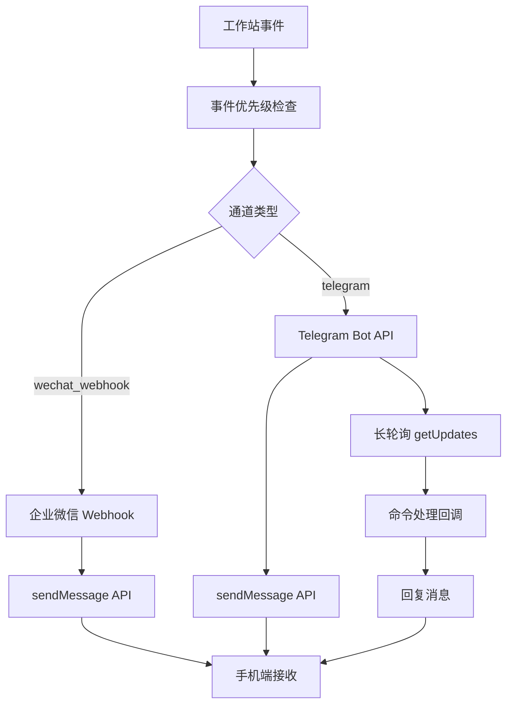

**图表来源**
- [bot_gateway.py](file://lan_mesh/bot_gateway.py)
- [station_controller.py](file://lan_mesh/station_controller.py)
- [station_api.py](file://lan_mesh/station_api.py)

**章节来源**
- [bot_gateway.py](file://lan_mesh/bot_gateway.py)
- [station_controller.py](file://lan_mesh/station_controller.py)
- [station_api.py](file://lan_mesh/station_api.py)
- [config.py](file://lan_mesh/config.py)
- [dashboard.html](file://lan_mesh/web/templates/dashboard.html)

## 依赖分析
- Python 依赖
  - fastapi、uvicorn：Web 服务与 ASGI 服务器
  - psutil：系统信息采集
  - pydantic、PyYAML：配置模型与 YAML 解析
  - requests：HTTP 客户端（Worker 向 StationController 发起请求，Bot Gateway 向第三方 API 发送请求）
  - python-multipart：文件上传支持
  - **新增**：jsonrpc 客户端库（用于 MCP 协议）
  - **新增**：requests 库（用于 Bot Gateway 与企业微信、Telegram API 通信）
- 前端依赖
  - React、Tauri：桌面应用框架
  - lucide-react：图标库
  - @tauri-apps/api：Tauri 前后端通信

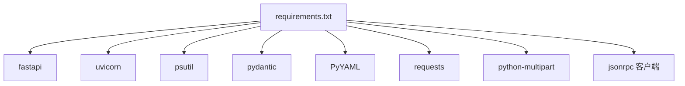

**图表来源**
- [requirements.txt](file://requirements.txt)

**章节来源**
- [requirements.txt](file://requirements.txt)

## 性能考虑
- UDP 广播频率与 TTL
  - presence_interval 与 device_ttl 决定发现延迟与离线判定，需在"实时性 vs. 带宽"间权衡
- 心跳间隔
  - HTTP 心跳间隔与 WebSocket 推送间隔影响状态同步频率与服务器负载
- 数据库写入
  - SQLite 每次心跳写入与批量推送需注意事务与索引优化
- 端口冲突与降级
  - DiscoveryService 在端口占用时尝试 SO_REUSEPORT，否则降级运行，避免启动失败
- 前端渲染
  - 大规模设备列表建议前端分页或虚拟滚动，减少 DOM 压力
- **新增**：任务编排性能
  - DAG 调度循环频率与子任务执行并发度需要平衡
  - 模型路由器评分计算复杂度与缓存策略
  - 项目管理器的预算检查频率与数据库访问优化
- **新增**：MCP 工具网关
  - 多 Server 连接池管理与自动重连机制
  - 工具列表缓存与增量更新策略
- **新增**：Bot Gateway 性能
  - 异步消息发送避免阻塞主流程
  - Telegram 长轮询的超时处理和异常恢复
  - 事件优先级过滤减少不必要的消息推送
  - 多通道并发发送的线程安全控制

## 故障排查指南
- 启动失败
  - 检查端口占用：StationController/Worker 端口与 Discovery 端口
  - 检查配置文件：config.yaml 是否正确，路径与权限
- 发现异常
  - 确认防火墙放行 UDP 45454；检查广播地址计算是否正确
  - 使用 /api/probe/{ip} 主动探测目标 IP
- 心跳失败
  - Worker 无法连接 StationController：检查 StationController IP/端口、网络连通性
  - 心跳超时：检查 StationController 服务器负载与数据库写入性能
- WebSocket 断开
  - 客户端长时间无 ping：检查网络稳定性与超时设置
- 前端无法调用后端
  - 确认 Tauri invoke 命令映射与后端路由一致
  - 检查 CORS 与跨域配置（如需要）
- **新增**：任务编排异常
  - 检查任务 DAG 循环依赖：使用 /api/tasks/{id} 查询任务状态
  - 验证 Agent 能力匹配：确认 AgentCard 中的技能声明
  - 模型路由器配置：检查 model_pool.yaml 中的 API Key 设置
- **新增**：项目管理问题
  - 预算超支：检查项目状态和消费记录
  - 工作空间权限：确认项目目录的读写权限
- **新增**：MCP 工具网关故障
  - Server 连接状态：使用 /api/tools/servers 查询连接状态
  - 工具调用失败：检查 MCP Server 日志和网络连通性
  - 配置文件格式：验证 mcp_servers.yaml 的 YAML 格式
- **新增**：Bot Gateway 移动交互问题
  - 企业微信推送失败：检查 Webhook URL 格式和权限
  - Telegram 通信异常：确认 Bot Token、Chat ID 正确性
  - Telegram 轮询失败：检查网络连通性和长轮询超时设置
  - 事件推送被过滤：检查事件优先级和通道最低优先级设置
  - 命令处理失败：验证命令处理器回调逻辑

**章节来源**
- [station_controller.py](file://lan_mesh/station_controller.py)
- [worker.py](file://lan_mesh/worker.py)
- [discovery.py](file://lan_mesh/discovery.py)
- [api.py](file://lan_mesh/api.py)
- [lib.rs](file://quicklan-main/src-tauri/src/lib.rs)
- [orchestrator.py](file://lan_mesh/orchestrator.py)
- [project.py](file://lan_mesh/project.py)
- [mcp_gateway.py](file://lan_mesh/mcp_gateway.py)
- [bot_gateway.py](file://lan_mesh/bot_gateway.py)

## 结论
LAN Mesh 通过 Master/Worker 分布式架构实现了去中心化的设备发现、状态同步与任务编排。UDP 广播发现提供了低开销的局域网拓扑感知，FastAPI + WebSocket 构建了简洁高效的控制通道。配合前端 Tauri 应用，形成前后端分离的完整方案。

**新增的核心架构组件进一步增强了系统的智能化水平和移动交互能力**：
- **分布式任务编排系统**：实现了复杂任务的自动拆解、DAG 调度和智能 Agent 匹配
- **模型路由器**：提供了 L1-L4 难度分级和多 Provider 智能路由，支持降级链容灾
- **项目管理系统**：实现了项目隔离、预算控制和成本追踪
- **MCP 工具网关**：统一管理外部工具调用，支持动态插件化扩展
- **Bot Gateway 移动交互层**：**新增**，通过企业微信和 Telegram 提供双向移动通信，支持事件推送和命令交互

这些组件共同构成了一个完整的分布式个人 AI 工作站平台，适合中小规模局域网场景下的设备协同、资源共享、智能任务执行和移动交互。架构决策在易用性、可维护性与性能之间取得平衡，为未来的功能扩展奠定了坚实基础。

## 附录
- 端口与时间常量
  - Discovery 端口：45454
  - Worker API 端口：45460
  - StationController API 端口：45470
  - presence_interval：3 秒
  - heartbeat_interval：5 秒
  - device_ttl：12 秒
- 数据模型概览

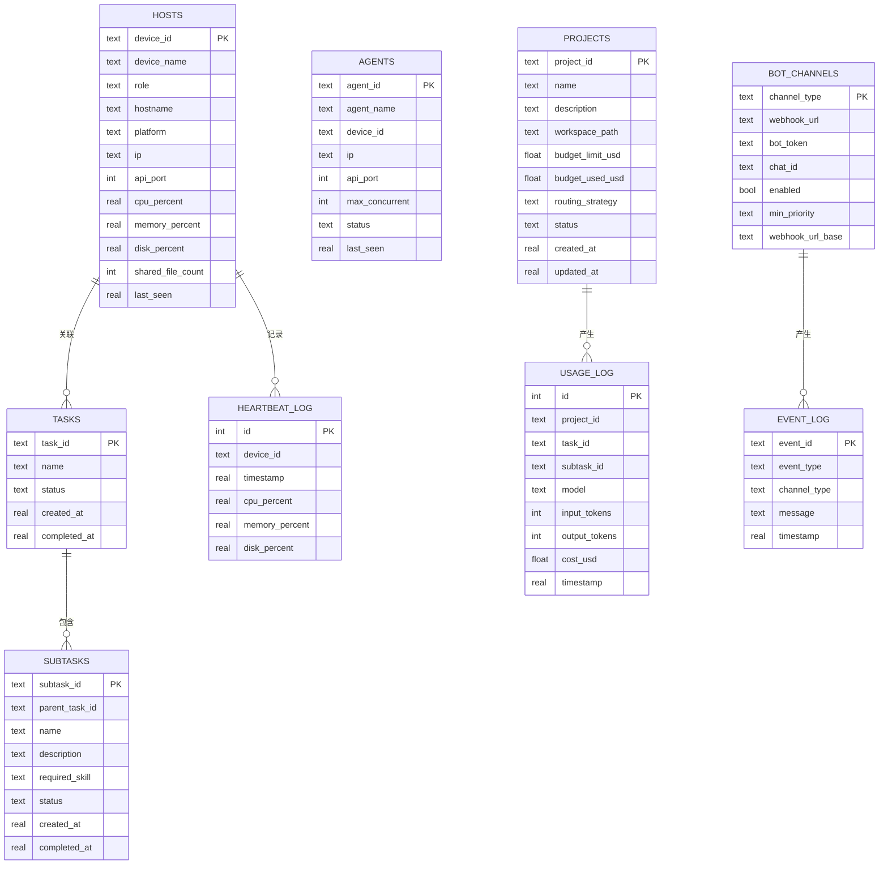

**图表来源**
- [database.py](file://lan_mesh/database.py)
- [protocol.py](file://lan_mesh/protocol.py)
- [bot_gateway.py](file://lan_mesh/bot_gateway.py)

**章节来源**
- [database.py](file://lan_mesh/database.py)
- [protocol.py](file://lan_mesh/protocol.py)
- [bot_gateway.py](file://lan_mesh/bot_gateway.py)