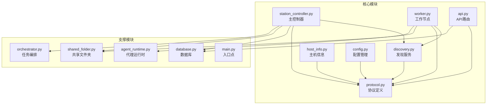
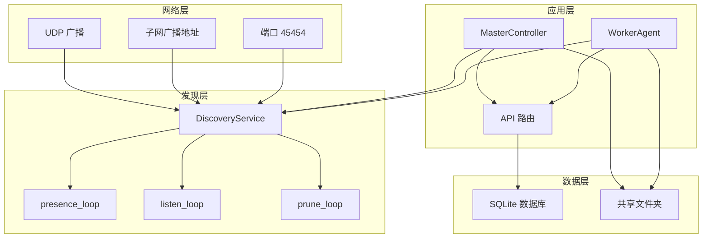
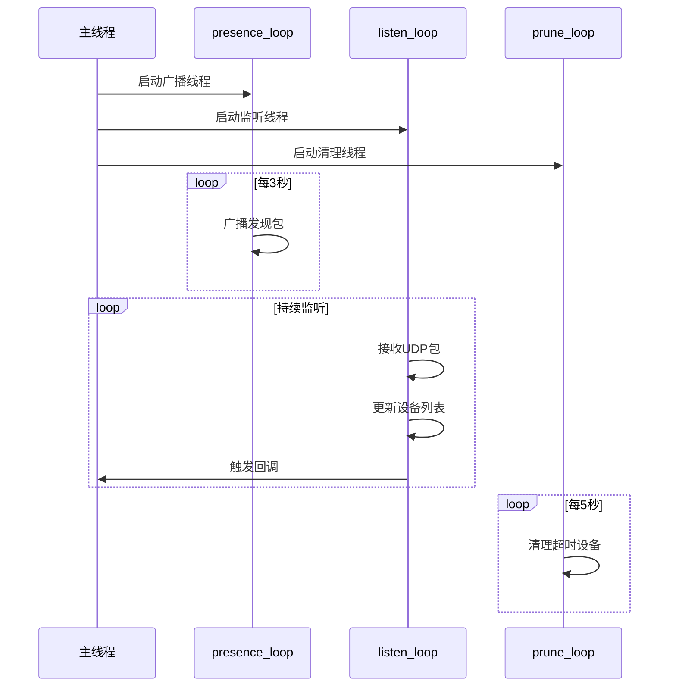
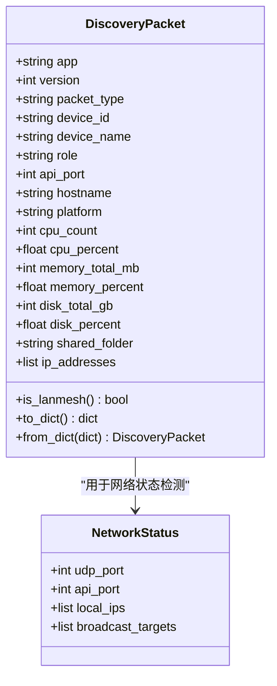
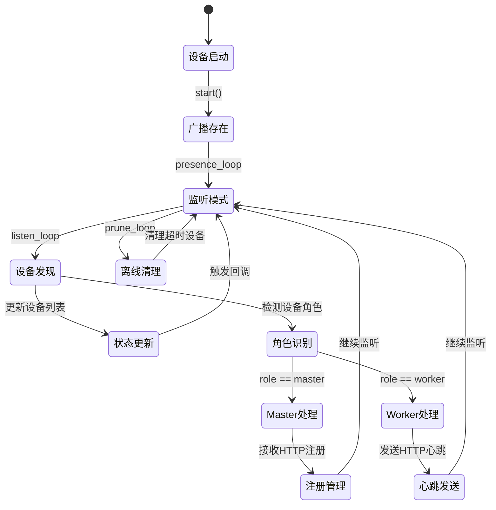
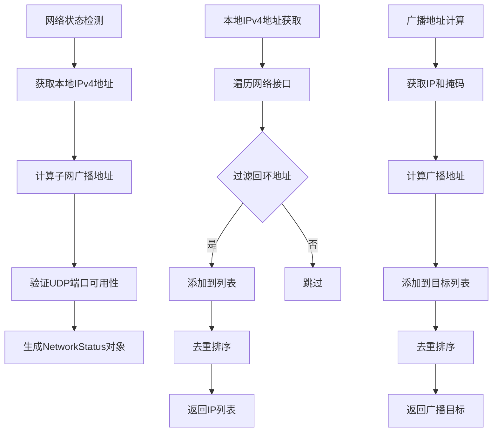
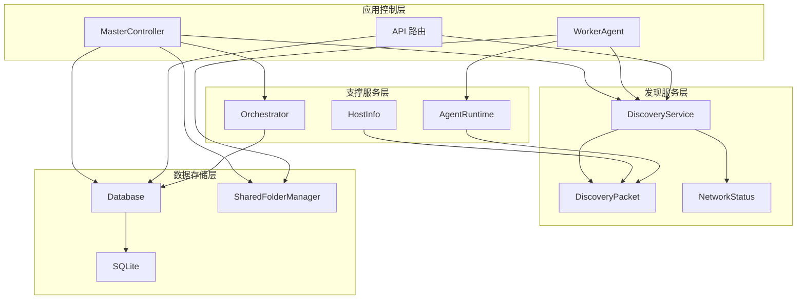

# 设备发现系统

<cite>
**本文引用的文件**
- [discovery.py](file://lan_mesh/discovery.py)
- [station_controller.py](file://lan_mesh/station_controller.py)
- [worker.py](file://lan_mesh/worker.py)
- [protocol.py](file://lan_mesh/protocol.py)
- [host_info.py](file://lan_mesh/host_info.py)
- [api.py](file://lan_mesh/api.py)
- [config.py](file://lan_mesh/config.py)
- [database.py](file://lan_mesh/database.py)
- [shared_folder.py](file://lan_mesh/shared_folder.py)
- [orchestrator.py](file://lan_mesh/orchestrator.py)
- [main.py](file://main.py)
</cite>

## 目录
1. [简介](#简介)
2. [项目结构](#项目结构)
3. [核心组件](#核心组件)
4. [架构概览](#架构概览)
5. [详细组件分析](#详细组件分析)
6. [依赖关系分析](#依赖关系分析)
7. [性能考虑](#性能考虑)
8. [故障排除指南](#故障排除指南)
9. [结论](#结论)

## 简介

LAN Mesh 设备发现系统是一个基于 UDP 广播的去中心化网络发现机制，专为局域网内的设备自动发现和连接管理而设计。该系统采用 Master/Worker 架构，通过 UDP 广播实现设备间的自动发现，同时结合 HTTP API 提供完整的设备管理和任务编排功能。

系统的核心特性包括：
- 基于 UDP 广播的去中心化发现机制
- TTL 超时机制确保网络状态的准确性
- Master/Worker 架构实现中心化控制
- 多线程架构支持并发处理
- 设备角色识别和状态跟踪
- 离线清理策略和网络拓扑适应

## 项目结构

LAN Mesh 项目采用模块化设计，主要分为以下几个核心模块：

**图表来源**
- [discovery.py:1-259](file://lan_mesh/discovery.py#L1-L259)
- [station_controller.py](file://lan_mesh/station_controller.py#L1-L324)
- [worker.py:1-325](file://lan_mesh/worker.py#L1-L325)

**章节来源**
- [main.py:1-90](file://main.py#L1-L90)
- [config.py:1-84](file://lan_mesh/config.py#L1-L84)

## 核心组件

### DiscoveryService 类

DiscoveryService 是整个发现系统的核心组件，实现了基于 UDP 广播的设备发现机制。该类采用多线程架构，包含三个主要后台线程：

1. **presence_loop**: 定期广播自身存在信息
2. **listen_loop**: 监听其他设备的 UDP 包
3. **prune_loop**: 定期清理超时离线设备

该类提供了完整的设备查询、网络状态检测和主动探测功能。

**章节来源**
- [discovery.py:33-259](file://lan_mesh/discovery.py#L33-L259)

### MasterController 类

MasterController 作为中心控制节点，负责：
- 自动采集本机配置信息
- 创建和管理共享文件夹
- 启动 UDP 发现服务
- 接收 Worker 的 HTTP 注册和心跳
- 持久化主机信息到 SQLite 数据库
- 提供 Web UI 仪表盘
- 定期清理超时离线主机

**章节来源**
- [station_controller.py](file://lan_mesh/station_controller.py#L67-L324)

### WorkerAgent 类

WorkerAgent 作为工作节点，负责：
- 自动采集本机配置信息
- 创建和暴露共享文件夹
- 通过 UDP 发现 Master 节点
- 通过 HTTP 向 Master 注册并发送心跳
- 提供 HTTP API 供 Master 查询
- 执行任务和代理运行时

**章节来源**
- [worker.py:62-325](file://lan_mesh/worker.py#L62-L325)

## 架构概览

LAN Mesh 采用了经典的 Master/Worker 架构，结合 UDP 广播实现去中心化的设备发现：

**图表来源**
- [discovery.py:139-259](file://lan_mesh/discovery.py#L139-L259)
- [station_controller.py](file://lan_mesh/station_controller.py#L256-L324)
- [worker.py:271-325](file://lan_mesh/worker.py#L271-L325)

## 详细组件分析

### DiscoveryService 实现原理

DiscoveryService 采用三线程并发架构，每个线程负责特定的发现功能：

#### 多线程架构设计

**图表来源**
- [discovery.py:139-259](file://lan_mesh/discovery.py#L139-L259)

#### 发现包格式设计

DiscoveryPacket 数据结构设计遵循 QuickLAN 协议规范，扩展了主机配置摘要字段：

**图表来源**
- [protocol.py:29-65](file://lan_mesh/protocol.py#L29-L65)
- [protocol.py:151-157](file://lan_mesh/protocol.py#L151-L157)

**章节来源**
- [protocol.py:29-65](file://lan_mesh/protocol.py#L29-L65)

#### TTL 超时机制

系统采用 12 秒的设备 TTL 阈值，通过以下机制实现：

1. **设备状态跟踪**: 每次收到设备包时更新 `last_seen` 时间戳
2. **定期清理**: 每 5 秒检查一次设备列表
3. **超时判断**: 超过 TTL 未收到的设备标记为离线
4. **最终清理**: 超过 3×TTL 的设备从设备列表中移除

**章节来源**
- [discovery.py:216-228](file://lan_mesh/discovery.py#L216-L228)

### 设备角色识别和状态跟踪

系统支持两种设备角色：master 和 worker，每种角色具有不同的职责和行为模式：

**图表来源**
- [discovery.py:139-259](file://lan_mesh/discovery.py#L139-L259)
- [station_controller.py](file://lan_mesh/station_controller.py#L134-L144)
- [worker.py:115-123](file://lan_mesh/worker.py#L115-L123)

**章节来源**
- [station_controller.py](file://lan_mesh/station_controller.py#L134-L144)
- [worker.py:115-123](file://lan_mesh/worker.py#L115-L123)

### 网络状态检测

NetworkStatus 类提供了完整的网络状态检测功能：

**图表来源**
- [host_info.py:42-103](file://lan_mesh/host_info.py#L42-L103)
- [protocol.py:151-157](file://lan_mesh/protocol.py#L151-L157)

**章节来源**
- [host_info.py:42-103](file://lan_mesh/host_info.py#L42-L103)
- [protocol.py:151-157](file://lan_mesh/protocol.py#L151-L157)

### 离线清理策略

系统实现了多层次的离线清理策略：

1. **设备级清理**: 超过 TTL 未收到的设备标记为离线
2. **最终清理**: 超过 3×TTL 的设备从设备列表中移除
3. **数据库清理**: Master 端每 5 秒检查并标记超时主机为离线

**章节来源**
- [discovery.py:216-228](file://lan_mesh/discovery.py#L216-L228)
- [database.py:272-280](file://lan_mesh/database.py#L272-L280)

## 依赖关系分析

### 组件耦合关系

**图表来源**
- [discovery.py:22-30](file://lan_mesh/discovery.py#L22-L30)
- [station_controller.py](file://lan_mesh/station_controller.py#L32-L44)
- [worker.py:28-44](file://lan_mesh/worker.py#L28-L44)

### 外部依赖分析

系统的主要外部依赖包括：

1. **psutil**: 系统信息采集
2. **fastapi**: Web API 框架
3. **uvicorn**: ASGI 服务器
4. **sqlite3**: 本地数据库
5. **requests**: HTTP 客户端

**章节来源**
- [host_info.py:14-16](file://lan_mesh/host_info.py#L14-L16)
- [api.py:26-31](file://lan_mesh/api.py#L26-L31)
- [database.py:6-13](file://lan_mesh/database.py#L6-L13)

## 性能考虑

### 线程安全设计

系统采用线程安全的设计模式：

1. **锁机制**: 使用 `threading.RLock()` 保护共享数据
2. **线程池**: 每个组件独立管理自己的线程集合
3. **原子操作**: 设备列表的增删改查都是原子操作

### 网络性能优化

1. **广播地址优化**: 仅向必要的广播地址发送 UDP 包
2. **端口复用**: 支持 SO_REUSEPORT 选项提高端口复用效率
3. **超时控制**: 设置合理的 socket 超时避免阻塞

### 内存管理

1. **设备列表清理**: 定期清理超时设备避免内存泄漏
2. **JSON 序列化**: 使用高效的 JSON 序列化减少内存占用
3. **连接池**: SQLite 使用线程本地连接避免连接竞争

## 故障排除指南

### 常见问题诊断

#### 端口占用问题

当发现服务启动失败时，系统会尝试以下处理策略：

1. **端口绑定失败**: 尝试 SO_REUSEPORT 选项
2. **端口仍被占用**: 降级运行，仅启用监听功能
3. **网络权限不足**: 检查防火墙设置

#### 设备发现失败

可能的原因和解决方案：

1. **网络隔离**: 检查路由器设置，确保 UDP 广播可达
2. **防火墙阻拦**: 配置防火墙允许端口 45454 的 UDP 流量
3. **网络拓扑复杂**: 确保设备在同一子网内

#### 设备状态异常

1. **频繁离线**: 检查网络稳定性，调整 TTL 阈值
2. **状态不一致**: 清理设备列表，重新建立连接
3. **性能问题**: 检查系统资源使用情况

**章节来源**
- [discovery.py:159-174](file://lan_mesh/discovery.py#L159-L174)
- [station_controller.py](file://lan_mesh/station_controller.py#L166-L174)

## 结论

LAN Mesh 设备发现系统通过精心设计的架构实现了高效、可靠的局域网设备发现和管理。系统的主要优势包括：

1. **去中心化发现**: 基于 UDP 广播的发现机制避免了复杂的网络拓扑配置
2. **多线程并发**: 三线程架构确保了高并发场景下的稳定性和性能
3. **灵活的角色管理**: Master/Worker 架构支持不同角色的差异化处理
4. **完善的错误处理**: 全面的异常处理和故障恢复机制
5. **可扩展性**: 模块化设计便于功能扩展和维护

该系统为构建分布式应用提供了坚实的基础，通过合理的架构设计和实现细节，能够在各种网络环境下稳定运行，并为后续的功能扩展奠定了良好的基础。
