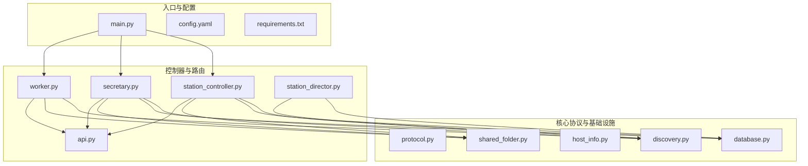
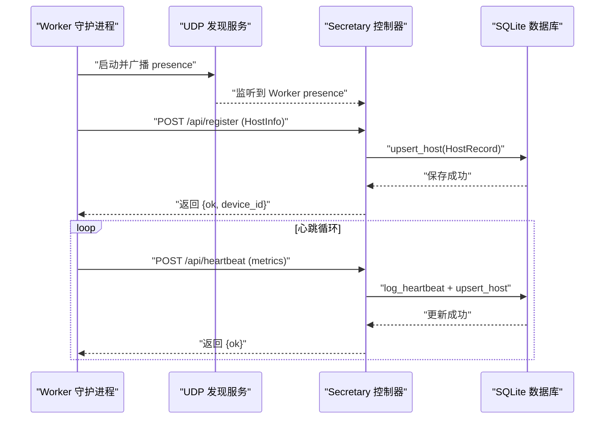
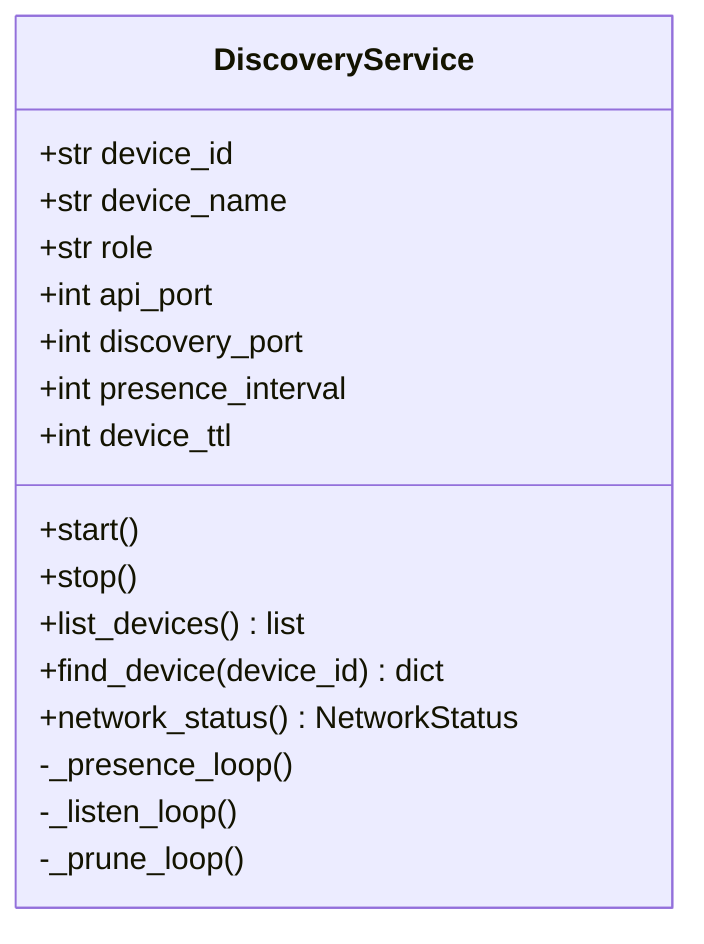
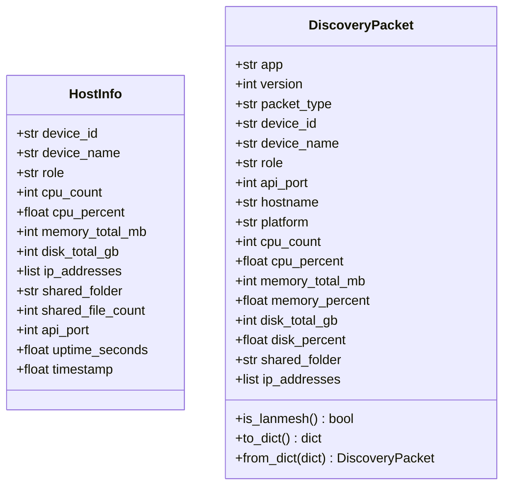
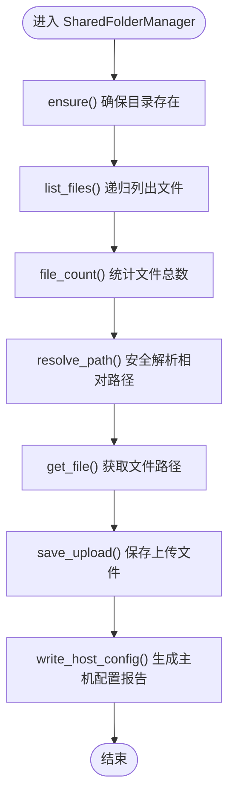
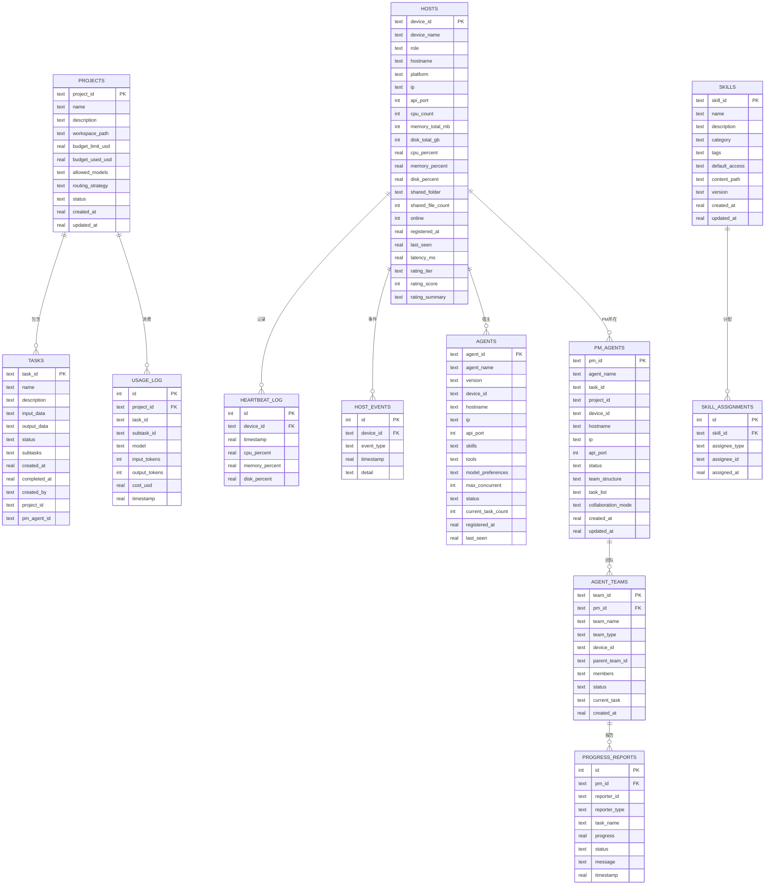
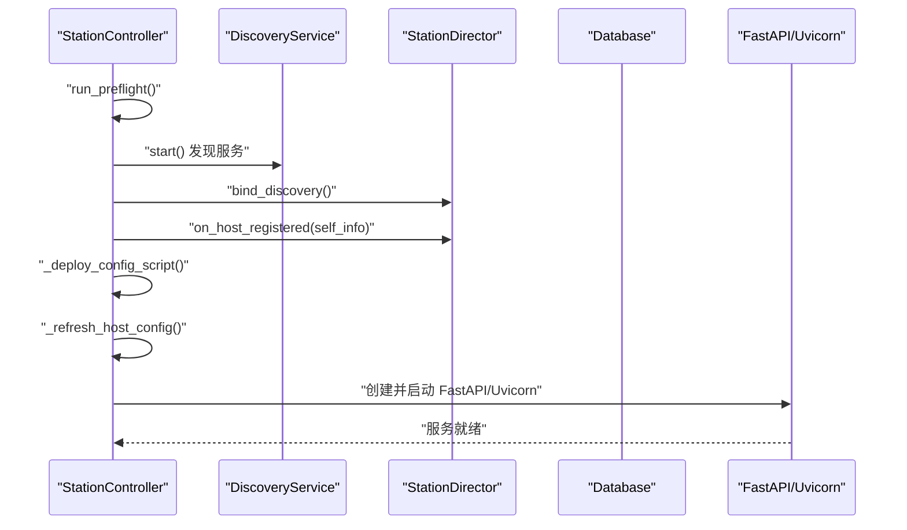
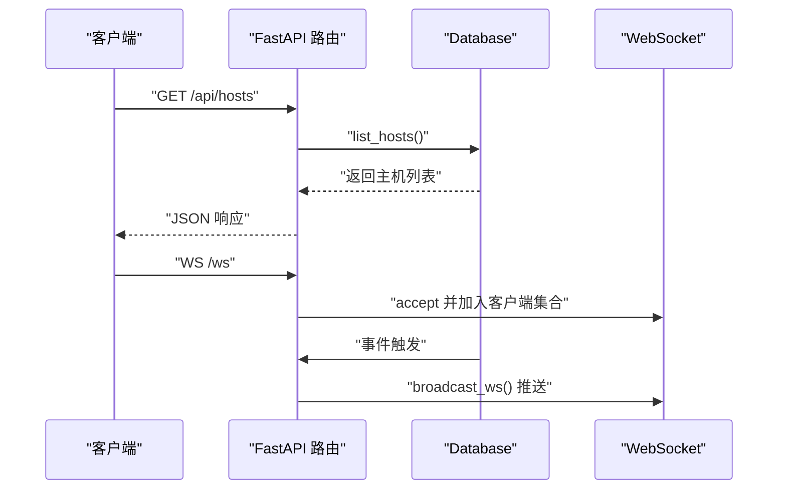
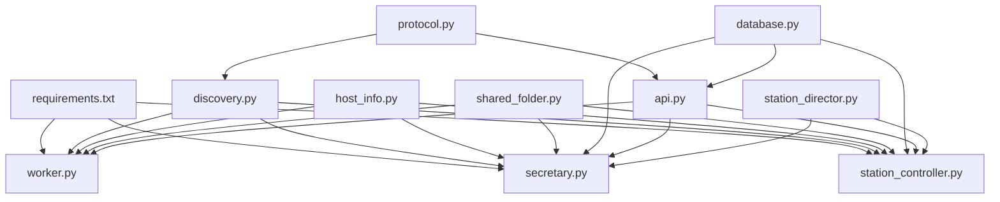

# P2P 点对点通信系统

<cite>
**本文档引用的文件**
- [main.py](file://main.py)
- [config.yaml](file://config.yaml)
- [requirements.txt](file://requirements.txt)
- [lan_mesh/__init__.py](file://lan_mesh/__init__.py)
- [lan_mesh/config.py](file://lan_mesh/config.py)
- [lan_mesh/discovery.py](file://lan_mesh/discovery.py)
- [lan_mesh/protocol.py](file://lan_mesh/protocol.py)
- [lan_mesh/host_info.py](file://lan_mesh/host_info.py)
- [lan_mesh/shared_folder.py](file://lan_mesh/shared_folder.py)
- [lan_mesh/database.py](file://lan_mesh/database.py)
- [lan_mesh/api.py](file://lan_mesh/api.py)
- [lan_mesh/station_director.py](file://lan_mesh/station_director.py)
- [lan_mesh/station_controller.py](file://lan_mesh/station_controller.py)
- [lan_mesh/secretary.py](file://lan_mesh/secretary.py)
- [lan_mesh/worker.py](file://lan_mesh/worker.py)
</cite>

## 目录
1. [简介](#简介)
2. [项目结构](#项目结构)
3. [核心组件](#核心组件)
4. [架构总览](#架构总览)
5. [详细组件分析](#详细组件分析)
6. [依赖关系分析](#依赖关系分析)
7. [性能考虑](#性能考虑)
8. [故障排除指南](#故障排除指南)
9. [结论](#结论)

## 简介
本项目是一个基于局域网的 P2P 点对点通信系统，提供设备发现、主机信息采集、共享文件管理、WebSocket 实时推送以及可选的项目管理和模型路由能力。系统采用“Station Director + Secretary + Worker”的分层架构：Station Director 负责基础设施管理（主机评级、资源池），Secretary 负责项目管理与任务编排（可选），Worker 部署在各主机上负责注册、心跳、文件共享与任务执行。

## 项目结构
项目主要分为三层：
- 入口与配置层：main.py、config.yaml、requirements.txt
- 核心协议与基础设施：protocol.py、discovery.py、host_info.py、shared_folder.py、database.py
- 控制器与路由层：station_controller.py、secretary.py、worker.py、api.py
- 系统集成：station_director.py

**图表来源**
- [main.py:1-105](file://main.py#L1-L105)
- [lan_mesh/station_controller.py:1-556](file://lan_mesh/station_controller.py#L1-L556)
- [lan_mesh/secretary.py:1-342](file://lan_mesh/secretary.py#L1-L342)
- [lan_mesh/worker.py:1-593](file://lan_mesh/worker.py#L1-L593)
- [lan_mesh/discovery.py:1-259](file://lan_mesh/discovery.py#L1-L259)
- [lan_mesh/database.py:1-800](file://lan_mesh/database.py#L1-L800)
- [lan_mesh/api.py:1-793](file://lan_mesh/api.py#L1-L793)

**章节来源**
- [main.py:1-105](file://main.py#L1-L105)
- [config.yaml:1-37](file://config.yaml#L1-L37)
- [requirements.txt:1-10](file://requirements.txt#L1-L10)

## 核心组件
- 配置管理：基于 Pydantic 的强类型配置，支持 YAML 与环境变量加载，提供默认值与路径展开。
- 设备发现：基于 UDP 广播的设备发现，定时广播 presence 包，监听其他设备并维护设备列表与 TTL 清理。
- 主机信息采集：使用 psutil 采集 CPU/内存/磁盘/网络等硬件与运行时信息，生成 DiscoveryPacket 与 HostInfo。
- 共享文件夹：自动创建共享目录，提供文件列表、上传下载与主机配置报告生成。
- 数据库：SQLite 存储主机注册记录、心跳历史、Agent 注册、任务与项目信息，支持线程安全访问。
- 控制器：
  - StationController：启动 Station Director，提供 Web UI，管理 Secretary 激活/停用，维护 WebSocket 推送。
  - SecretaryController：启动 Secretary，提供项目管理、模型路由、MCP 工具网关、任务编排等 API。
  - WorkerAgent：启动 Worker，注册到 Secretary，周期性心跳，提供共享文件 API 与任务执行端点。
- 路由层：统一使用 FastAPI，提供 HTTP API 与 WebSocket，支持实时推送与文件传输。

**章节来源**
- [lan_mesh/config.py:1-159](file://lan_mesh/config.py#L1-L159)
- [lan_mesh/discovery.py:1-259](file://lan_mesh/discovery.py#L1-L259)
- [lan_mesh/host_info.py:1-212](file://lan_mesh/host_info.py#L1-L212)
- [lan_mesh/shared_folder.py:1-219](file://lan_mesh/shared_folder.py#L1-L219)
- [lan_mesh/database.py:1-800](file://lan_mesh/database.py#L1-L800)
- [lan_mesh/station_controller.py:1-556](file://lan_mesh/station_controller.py#L1-L556)
- [lan_mesh/secretary.py:1-342](file://lan_mesh/secretary.py#L1-L342)
- [lan_mesh/worker.py:1-593](file://lan_mesh/worker.py#L1-L593)
- [lan_mesh/api.py:1-793](file://lan_mesh/api.py#L1-L793)

## 架构总览
系统采用“发现 + 注册 + 心跳 + 管理”的模式：
- Worker 启动后通过 UDP 广播自身存在，发现 Secretary/Station Director 并注册。
- Worker 定期向 Secretary 发送心跳，包含实时资源使用率。
- Secretary/Station Director 维护主机注册记录、评级与事件历史，提供 Web UI 与 API。
- Worker 提供共享文件 API，支持上传下载与主机配置报告生成。
- 可选：Secretary 提供项目管理、模型路由、MCP 工具网关与任务编排。

**图表来源**
- [lan_mesh/worker.py:136-255](file://lan_mesh/worker.py#L136-L255)
- [lan_mesh/api.py:291-345](file://lan_mesh/api.py#L291-L345)
- [lan_mesh/database.py:249-300](file://lan_mesh/database.py#L249-L300)

## 详细组件分析

### 设备发现服务（DiscoveryService）
- 功能：定时广播自身存在、监听其他设备、维护设备列表、TTL 清理。
- 关键实现：
  - presence_loop：按间隔广播 DiscoveryPacket。
  - listen_loop：监听 UDP 广播，回送 presence，更新设备列表并触发回调。
  - prune_loop：定期清理超时离线设备。
- 端口与时间常量：DISCOVERY_PORT、PRESENCE_INTERVAL_SECS、DEVICE_TTL_SECS。

**图表来源**
- [lan_mesh/discovery.py:33-259](file://lan_mesh/discovery.py#L33-L259)
- [lan_mesh/protocol.py:17-25](file://lan_mesh/protocol.py#L17-L25)

**章节来源**
- [lan_mesh/discovery.py:1-259](file://lan_mesh/discovery.py#L1-L259)
- [lan_mesh/protocol.py:29-65](file://lan_mesh/protocol.py#L29-L65)

### 主机信息采集（HostInfo/DiscoveryPacket）
- HostInfo：完整主机配置信息，包含 CPU/内存/磁盘/网络/共享/运行时等字段。
- DiscoveryPacket：用于 UDP 广播的精简配置摘要，便于快速识别设备。
- 采集函数：collect_host_info、make_discovery_packet。

**图表来源**
- [lan_mesh/protocol.py:69-151](file://lan_mesh/protocol.py#L69-L151)
- [lan_mesh/protocol.py:29-65](file://lan_mesh/protocol.py#L29-L65)
- [lan_mesh/host_info.py:129-212](file://lan_mesh/host_info.py#L129-L212)

**章节来源**
- [lan_mesh/protocol.py:67-151](file://lan_mesh/protocol.py#L67-L151)
- [lan_mesh/host_info.py:129-212](file://lan_mesh/host_info.py#L129-L212)

### 共享文件夹管理（SharedFolderManager）
- 功能：自动创建共享目录、文件列表、上传下载、主机配置报告生成。
- 安全性：路径解析防穿越、文件名清洗。
- 报告：生成 host_config.json 与 host_config.txt。

**图表来源**
- [lan_mesh/shared_folder.py:16-219](file://lan_mesh/shared_folder.py#L16-L219)

**章节来源**
- [lan_mesh/shared_folder.py:1-219](file://lan_mesh/shared_folder.py#L1-L219)

### 数据库层（Database）
- 表结构：hosts、heartbeat_log、agents、tasks、projects、usage_log、host_events、skills、skill_assignments、pm_agents、agent_teams、progress_reports。
- 线程安全：每个线程独立连接，避免 SQLite 线程问题。
- 功能：主机注册/更新、心跳记录、Agent 注册/查询、任务 CRUD、项目 CRUD、预算与消费记录、技能注册与分配、PM Agent 与团队管理、进度报告。

**图表来源**
- [lan_mesh/database.py:36-244](file://lan_mesh/database.py#L36-L244)

**章节来源**
- [lan_mesh/database.py:16-800](file://lan_mesh/database.py#L16-L800)

### 控制器与生命周期

#### StationController（工作站主管）
- 职责：启动 Station Director，提供 Web UI，管理 Secretary 激活/停用，维护 WebSocket 推送，定期刷新配置报告与清理离线主机。
- 关键流程：启动前自检、UDP 发现、自注册、部署采集脚本、配置刷新、离线清理、FastAPI 启动、WS 推送。

**图表来源**
- [lan_mesh/station_controller.py:460-556](file://lan_mesh/station_controller.py#L460-L556)
- [lan_mesh/station_controller.py:470-505](file://lan_mesh/station_controller.py#L470-L505)

**章节来源**
- [lan_mesh/station_controller.py:1-556](file://lan_mesh/station_controller.py#L1-L556)

#### SecretaryController（秘书控制器）
- 职责：启动 Secretary，提供项目管理、模型路由、MCP 工具网关、任务编排等 API，维护 WebSocket 推送，定期清理离线主机。
- 关键流程：启动前自检、UDP 发现、部署采集脚本、配置刷新、FastAPI 启动、WS 推送。

**章节来源**
- [lan_mesh/secretary.py:1-342](file://lan_mesh/secretary.py#L1-L342)

#### WorkerAgent（工作节点）
- 职责：启动 Worker，注册到 Secretary，周期性心跳，提供共享文件 API 与任务执行端点，支持远程启动/停止 Secretary 与 PM Agent。
- 关键流程：启动前自检、UDP 发现、部署采集脚本、配置刷新、Agent 运行时初始化、心跳循环、FastAPI 启动。

**章节来源**
- [lan_mesh/worker.py:1-593](file://lan_mesh/worker.py#L1-L593)

### API 路由层
- Worker 路由：/info、/shared、/tasks/execute、/role/*、/pm/*、/api/p2p/receive。
- Secretary 路由：/api/register、/api/heartbeat、/api/hosts、/api/network、/api/probe、/api/discovery、/ws、/api/agents、/api/tasks、/api/projects、/tools/*、/api/route/*、/api/station/*。
- WebSocket：实时推送主机状态变更。

**图表来源**
- [lan_mesh/api.py:37-271](file://lan_mesh/api.py#L37-L271)
- [lan_mesh/api.py:274-793](file://lan_mesh/api.py#L274-L793)

**章节来源**
- [lan_mesh/api.py:1-793](file://lan_mesh/api.py#L1-L793)

## 依赖关系分析
- 外部依赖：FastAPI、Uvicorn、WebSockets、psutil、PyYAML、requests、python-multipart、python-dotenv。
- 内部模块耦合：
  - discovery.py 与 protocol.py 紧密耦合（数据结构与端口常量）。
  - api.py 依赖 database.py、shared_folder.py、protocol.py。
  - station_controller.py/secretary.py/worker.py 依赖 discovery.py、database.py、shared_folder.py、api.py。
  - station_director.py 依赖 database.py、discovery.py、host_info.py、host_rating.py。

**图表来源**
- [requirements.txt:1-10](file://requirements.txt#L1-L10)
- [lan_mesh/discovery.py:22-30](file://lan_mesh/discovery.py#L22-L30)
- [lan_mesh/api.py:33-34](file://lan_mesh/api.py#L33-L34)
- [lan_mesh/station_controller.py:35-49](file://lan_mesh/station_controller.py#L35-L49)
- [lan_mesh/secretary.py:32-47](file://lan_mesh/secretary.py#L32-L47)
- [lan_mesh/worker.py:31-48](file://lan_mesh/worker.py#L31-L48)
- [lan_mesh/station_director.py:20-25](file://lan_mesh/station_director.py#L20-L25)

**章节来源**
- [requirements.txt:1-10](file://requirements.txt#L1-L10)

## 性能考虑
- UDP 发现频率：PRESENCE_INTERVAL_SECS=3s，DEVICE_TTL_SECS=12s，避免频繁网络负载与误判离线。
- 心跳间隔：HEARTBEAT_INTERVAL_SECS=5s，平衡实时性与网络开销。
- 线程安全：Database 使用每个线程独立连接，避免 SQLite 线程竞争。
- 离线清理：PRUNE_INTERVAL_SECS=5s，定期清理超时设备，减少内存占用。
- 文件操作：共享文件夹上传下载使用二进制读写，避免大文件阻塞；路径解析防止路径穿越。
- WebSocket：客户端心跳检测，超时 ping 保活，减少无效连接。

## 故障排除指南
- 端口占用：发现服务在绑定端口失败时尝试 SO_REUSEPORT（若可用），否则降级运行。
- 注册失败：Worker 注册到 Secretary 失败时会重试，检查网络连通与端口可达。
- 心跳异常：Worker 心跳失败会尝试重新注册，检查 Secretary 是否在线。
- 离线清理：若主机长时间无心跳，会被标记为离线，可通过重新注册恢复。
- 权限错误：共享文件夹权限不足会导致文件上传/下载失败，检查目录权限。
- 环境变量：配置文件与模型池可通过环境变量覆盖路径，确保变量正确设置。

**章节来源**
- [lan_mesh/discovery.py:155-174](file://lan_mesh/discovery.py#L155-L174)
- [lan_mesh/worker.py:136-158](file://lan_mesh/worker.py#L136-L158)
- [lan_mesh/worker.py:212-234](file://lan_mesh/worker.py#L212-L234)
- [lan_mesh/database.py:365-380](file://lan_mesh/database.py#L365-L380)

## 结论
本系统通过 UDP 广播实现高效的局域网设备发现，结合 HTTP API 与 WebSocket 提供实时状态推送，配合 SQLite 数据库存储与共享文件夹管理，形成完整的 P2P 点对点通信框架。Station Director 负责基础设施管理，Secretary 提供项目管理与任务编排能力，Worker 负责具体任务执行与资源共享。系统具备良好的扩展性与可维护性，适合在多主机协作场景中部署与使用。