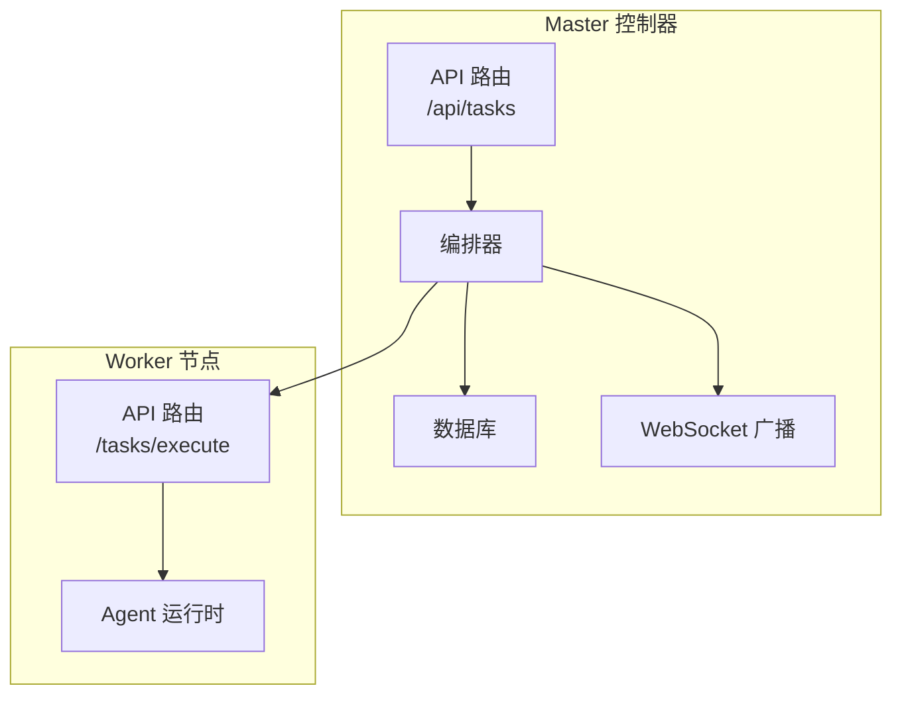
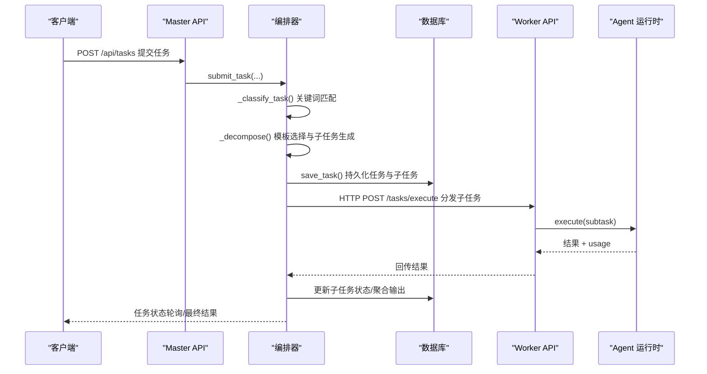
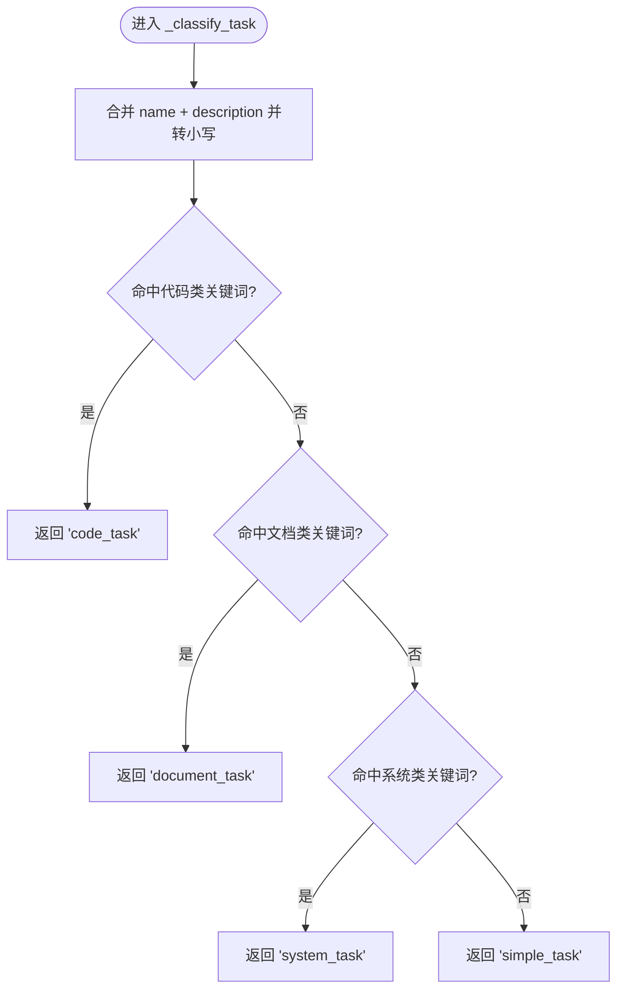
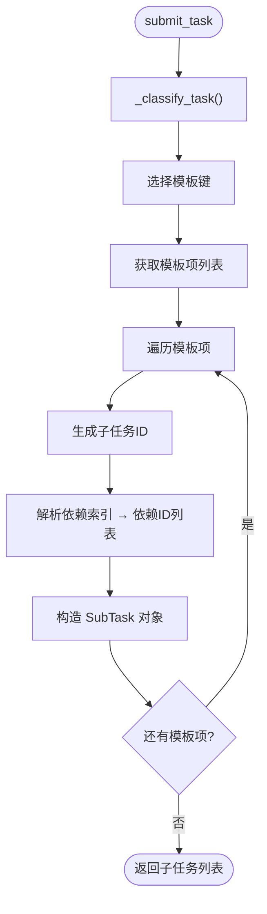
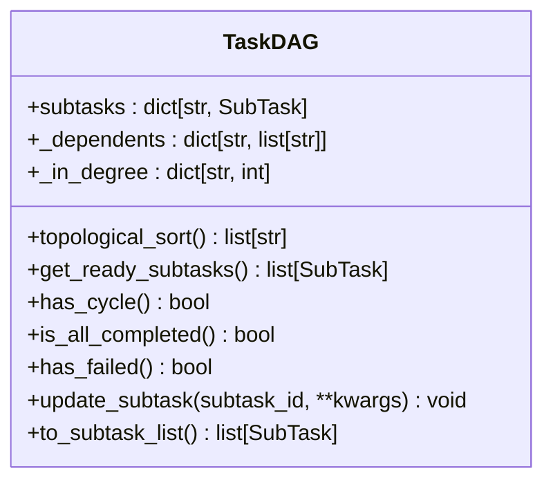
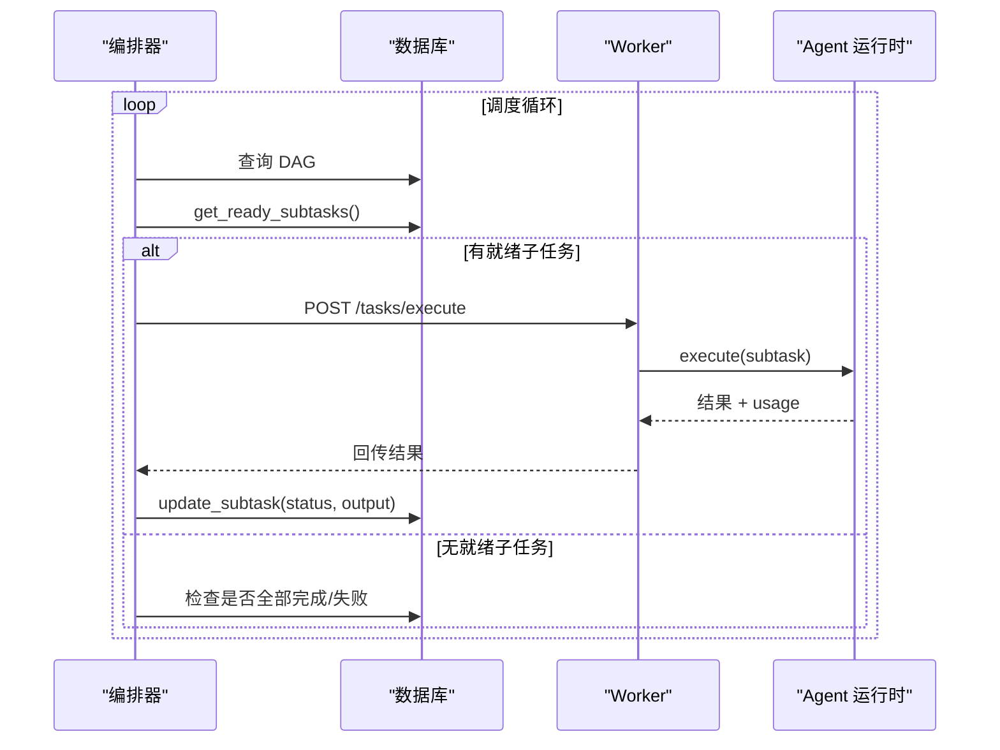
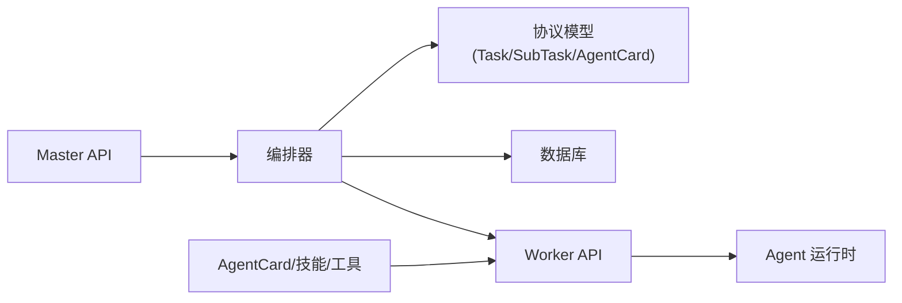

# 任务分解算法

<cite>
**本文引用的文件**
- [orchestrator.py](file://lan_mesh/orchestrator.py)
- [task.py](file://lan_mesh/task.py)
- [protocol.py](file://lan_mesh/protocol.py)
- [database.py](file://lan_mesh/database.py)
- [api.py](file://lan_mesh/api.py)
- [agent_runtime.py](file://lan_mesh/agent_runtime.py)
- [worker.py](file://lan_mesh/worker.py)
- [station_controller.py](file://lan_mesh/station_controller.py)
- [agent_card.py](file://lan_mesh/agent_card.py)
- [project.py](file://lan_mesh/project.py)
</cite>

## 目录
1. [简介](#简介)
2. [项目结构](#项目结构)
3. [核心组件](#核心组件)
4. [架构总览](#架构总览)
5. [详细组件分析](#详细组件分析)
6. [依赖关系分析](#依赖关系分析)
7. [性能考量](#性能考量)
8. [故障排查指南](#故障排查指南)
9. [结论](#结论)
10. [附录](#附录)

## 简介
本文件系统性阐述“任务分解算法”的设计与实现，重点覆盖：
- 基于预置模板的任务分解机制与规则驱动的分类策略
- 关键词匹配算法与模板选择机制
- 子任务生成、依赖关系构建与 ID 分配策略
- 不同任务类型的分解模板（code_task、document_task、system_task、simple_task）
- 自定义模板扩展方法
- 任务分解的质量评估、循环依赖检测与错误处理机制
- 实际任务分解示例与性能优化建议

## 项目结构
本项目采用模块化组织，围绕“Master 控制器 + Worker 节点 + 编排器 + 数据库 + 协议模型”展开。任务分解位于编排器模块，依赖协议模型与数据库持久化，并通过 API 路由对外提供任务提交入口。

图表来源
- [api.py:302-326](file://lan_mesh/api.py#L302-L326)
- [station_controller.py](file://lan_mesh/station_controller.py#L187-L223)
- [orchestrator.py:58-108](file://lan_mesh/orchestrator.py#L58-L108)
- [worker.py:219-238](file://lan_mesh/worker.py#L219-L238)
- [agent_runtime.py:47-75](file://lan_mesh/agent_runtime.py#L47-L75)

章节来源
- [station_controller.py](file://lan_mesh/station_controller.py#L187-L223)
- [api.py:302-326](file://lan_mesh/api.py#L302-L326)

## 核心组件
- 任务编排器（Orchestrator）：负责任务分类、模板选择、子任务生成、DAG 构建、调度与结果聚合。
- 任务 DAG（TaskDAG）：基于邻接表与入度表实现拓扑排序、就绪任务筛选、循环依赖检测。
- 协议模型（Task/SubTask/AgentCard 等）：统一任务与子任务的数据结构、状态机与依赖关系。
- 数据库（Database）：持久化任务、Agent、主机与项目信息，支持任务状态同步与消费记录。
- Agent 运行时（AgentRuntime）：根据技能类型执行具体任务，返回结果与 token 用量。
- API 路由：对外暴露任务提交、任务查询、Agent 管理、项目管理等端点。

章节来源
- [orchestrator.py:58-108](file://lan_mesh/orchestrator.py#L58-L108)
- [task.py:16-91](file://lan_mesh/task.py#L16-L91)
- [protocol.py:237-298](file://lan_mesh/protocol.py#L237-L298)
- [database.py:16-611](file://lan_mesh/database.py#L16-L611)
- [agent_runtime.py:28-75](file://lan_mesh/agent_runtime.py#L28-L75)
- [api.py:302-344](file://lan_mesh/api.py#L302-L344)

## 架构总览
任务从提交到执行的关键流程如下：

图表来源
- [api.py:302-326](file://lan_mesh/api.py#L302-L326)
- [orchestrator.py:70-108](file://lan_mesh/orchestrator.py#L70-L108)
- [database.py:421-441](file://lan_mesh/database.py#L421-L441)
- [worker.py:54-60](file://lan_mesh/worker.py#L54-L60)
- [agent_runtime.py:47-75](file://lan_mesh/agent_runtime.py#L47-L75)

## 详细组件分析

### 任务分类函数与关键词匹配算法
- 分类策略：基于任务名称与描述的关键词集合进行规则匹配，映射到预置模板键。
- 关键词覆盖：中文与英文关键词并行，确保多语言场景下的鲁棒性。
- 分类函数实现要点：
  - 将任务名称与描述拼接并转小写，便于不区分大小写的匹配。
  - 使用“任意关键词命中即分类”的策略，优先级按定义顺序。
  - 未命中任何类别时回退到简单任务模板。

图表来源
- [orchestrator.py:46-55](file://lan_mesh/orchestrator.py#L46-L55)

章节来源
- [orchestrator.py:46-55](file://lan_mesh/orchestrator.py#L46-L55)

### 模板选择机制与子任务生成
- 预置模板：包含四种任务类型模板，每条模板项定义子任务名称、所需技能、描述以及依赖索引。
- 模板选择：根据分类结果从预置字典中选取对应模板；若未找到则回退到简单任务模板。
- 子任务生成：
  - 为每个模板项生成唯一子任务 ID。
  - 解析依赖索引，将相对索引转换为绝对子任务 ID 列表，形成依赖链。
  - 将父任务输入数据透传给子任务，保证上下文一致性。
- ID 分配策略：使用全局唯一标识符生成子任务 ID，避免冲突。

图表来源
- [orchestrator.py:110-130](file://lan_mesh/orchestrator.py#L110-L130)

章节来源
- [orchestrator.py:26-43](file://lan_mesh/orchestrator.py#L26-L43)
- [orchestrator.py:110-130](file://lan_mesh/orchestrator.py#L110-L130)

### 依赖关系构建与 DAG 管理
- 依赖关系表示：每个子任务包含依赖 ID 列表，DAG 通过邻接表与入度表维护依赖关系。
- 拓扑排序：使用 Kahn 算法进行拓扑排序，返回可执行顺序；若存在环则返回部分排序结果。
- 就绪任务筛选：仅返回依赖均已完成且状态为“待执行”的子任务。
- 循环依赖检测：通过拓扑排序结果长度与节点总数比较判断是否存在环。
- 状态更新：支持按子任务 ID 动态更新状态与输出，便于异步执行后的回写。

图表来源
- [task.py:16-91](file://lan_mesh/task.py#L16-L91)

章节来源
- [task.py:16-91](file://lan_mesh/task.py#L16-L91)

### 调度循环与任务生命周期
- 调度循环：持续扫描 DAG 中的就绪子任务，匹配具备相应技能的空闲 Agent。
- 分发策略：将子任务通过 HTTP POST 发送到 Worker 的执行端点；成功后更新状态为“已分配”，失败则标记为“失败”。
- 结果聚合：当 DAG 全部完成或出现失败时，汇总子任务输出并标记顶层任务完成或失败。
- 状态同步：周期性将 DAG 状态同步至数据库，确保状态一致性。

图表来源
- [orchestrator.py:132-156](file://lan_mesh/orchestrator.py#L132-L156)
- [database.py:421-441](file://lan_mesh/database.py#L421-L441)
- [worker.py:54-60](file://lan_mesh/worker.py#L54-L60)
- [agent_runtime.py:47-75](file://lan_mesh/agent_runtime.py#L47-L75)

章节来源
- [orchestrator.py:132-156](file://lan_mesh/orchestrator.py#L132-L156)
- [database.py:421-441](file://lan_mesh/database.py#L421-L441)

### 不同任务类型的分解模板
- code_task：需求分析 → 代码生成 → 代码审查
- document_task：资料检索 → 文档摘要
- system_task：状态检查 → 系统操作
- simple_task：直接执行

模板定义位置与字段说明：
- name：子任务名称
- skill：所需技能名称（与 AgentCard 中技能匹配）
- description：子任务描述
- depends_on_idx：依赖索引列表（相对索引，从 0 开始）

章节来源
- [orchestrator.py:26-43](file://lan_mesh/orchestrator.py#L26-L43)

### 自定义模板扩展方法
- 扩展步骤：
  - 在预置模板字典中新增一个模板键与模板项列表。
  - 在分类函数中增加关键词匹配分支，返回新模板键。
  - 若模板项包含依赖索引，确保索引范围合法且与模板项顺序一致。
- 注意事项：
  - 新增模板需与 AgentCard 中声明的技能一一对应，否则分发阶段可能找不到合适 Agent。
  - 依赖索引应严格遵循模板项顺序，避免越界或循环依赖。
  - 建议为新模板提供清晰的描述与输入参数约束，便于后续调试与维护。

章节来源
- [orchestrator.py:26-55](file://lan_mesh/orchestrator.py#L26-L55)

### 任务分解的质量评估
- 关键词覆盖率：确保分类函数覆盖常见关键词，减少误判。
- 依赖完整性：模板中依赖索引必须指向已生成的前置子任务，避免悬挂依赖。
- 模板粒度：子任务粒度适中，避免过细导致调度开销过大或过粗导致并行度不足。
- 输出聚合：顶层任务输出应包含子任务关键输出，便于审计与复用。

章节来源
- [orchestrator.py:46-55](file://lan_mesh/orchestrator.py#L46-L55)
- [orchestrator.py:110-130](file://lan_mesh/orchestrator.py#L110-L130)

### 循环依赖检测与错误处理机制
- 循环依赖检测：通过拓扑排序长度与节点数量比较判断是否存在环；若存在，任务状态直接置为失败并记录错误。
- 错误处理：
  - 子任务执行失败：记录错误信息与时间戳，状态置为失败。
  - HTTP 请求异常：捕获异常并标记失败，恢复 Agent 状态。
  - Agent 不可用：等待空闲 Agent 或重试，避免阻塞整体调度。

章节来源
- [task.py:68-78](file://lan_mesh/task.py#L68-L78)
- [orchestrator.py:92-94](file://lan_mesh/orchestrator.py#L92-L94)
- [orchestrator.py:200-224](file://lan_mesh/orchestrator.py#L200-L224)

### 实际任务分解示例
- 示例一：代码生成任务
  - 输入：任务名称、描述、输入数据
  - 分类：命中“代码/函数/bug/重构”关键词 → 选择 code_task 模板
  - 子任务：需求分析 → 代码生成 → 代码审查
  - 依赖：第二步依赖第一步，第三步依赖第二步
- 示例二：文档摘要任务
  - 输入：任务名称、描述、输入数据
  - 分类：命中“文档/摘要/报告”关键词 → 选择 document_task 模板
  - 子任务：资料检索 → 文档摘要
  - 依赖：第二步依赖第一步

章节来源
- [orchestrator.py:26-43](file://lan_mesh/orchestrator.py#L26-L43)
- [orchestrator.py:46-55](file://lan_mesh/orchestrator.py#L46-L55)

## 依赖关系分析
- 编排器依赖数据库与协议模型，负责任务生命周期管理与 DAG 操作。
- Worker 侧通过 API 路由接收子任务并调用 Agent 运行时执行。
- Master 侧通过 API 路由对外提供任务提交入口，并与编排器协同工作。
- AgentCard 与技能/工具库决定 Agent 的能力边界，影响任务分发成功率。

图表来源
- [orchestrator.py:19-21](file://lan_mesh/orchestrator.py#L19-L21)
- [api.py:302-344](file://lan_mesh/api.py#L302-L344)
- [agent_runtime.py:28-45](file://lan_mesh/agent_runtime.py#L28-L45)
- [agent_card.py:167-217](file://lan_mesh/agent_card.py#L167-L217)

章节来源
- [protocol.py:237-298](file://lan_mesh/protocol.py#L237-L298)
- [database.py:16-611](file://lan_mesh/database.py#L16-L611)
- [api.py:302-344](file://lan_mesh/api.py#L302-L344)

## 性能考量
- 拓扑排序复杂度：邻接表 + 入度表实现，时间复杂度 O(V+E)，适合中等规模任务图。
- 调度频率：调度循环采用固定休眠时间，可根据任务规模调整以平衡吞吐与延迟。
- 并发与锁：编排器内部使用锁保护活动 DAG 映射，避免并发修改导致的状态不一致。
- 网络开销：子任务分发为短时 HTTP 请求，建议合理设置超时与重试策略。
- 数据库写入：状态更新与任务持久化采用批量写入策略，减少频繁 IO。

章节来源
- [task.py:35-52](file://lan_mesh/task.py#L35-L52)
- [orchestrator.py:67-68](file://lan_mesh/orchestrator.py#L67-L68)
- [orchestrator.py:132-156](file://lan_mesh/orchestrator.py#L132-L156)

## 故障排查指南
- 任务状态异常
  - 检查数据库中任务与子任务状态是否同步。
  - 关注编排器日志中“任务失败/子任务失败”的输出。
- 循环依赖
  - 使用拓扑排序检测，确认模板依赖索引正确。
- Agent 不可用
  - 检查 AgentCard 是否注册成功、状态是否为空闲。
  - 确认 Worker API 端点可达且 Agent 运行时已初始化。
- LLM 调用失败
  - 检查环境变量中 API Key 设置。
  - 关注 Agent 运行时返回的错误信息与 usage 字段。

章节来源
- [database.py:421-441](file://lan_mesh/database.py#L421-L441)
- [task.py:68-78](file://lan_mesh/task.py#L68-L78)
- [agent_runtime.py:172-193](file://lan_mesh/agent_runtime.py#L172-L193)
- [api.py:54-60](file://lan_mesh/api.py#L54-L60)

## 结论
本任务分解算法以“规则驱动的分类 + 预置模板 + DAG 依赖管理”为核心，实现了从任务提交到子任务执行与结果聚合的完整闭环。通过关键词匹配与模板选择，能够快速适配多种任务类型；通过 DAG 的拓扑排序与就绪任务筛选，保障了执行顺序与并行度；通过数据库持久化与状态同步，确保了系统的可观测性与可靠性。建议在实际部署中结合业务场景对模板与关键词进行迭代优化，并关注循环依赖与 Agent 能力匹配，以提升整体吞吐与稳定性。

## 附录
- 项目管理与预算控制：支持项目级预算与模型路由策略，可在任务提交前进行预算校验并在执行后记录消费。
- Agent 能力声明：通过 AgentCard 与技能/工具库声明 Agent 的能力边界，便于编排器进行精准匹配。

章节来源
- [project.py:62-320](file://lan_mesh/project.py#L62-L320)
- [agent_card.py:167-217](file://lan_mesh/agent_card.py#L167-L217)
