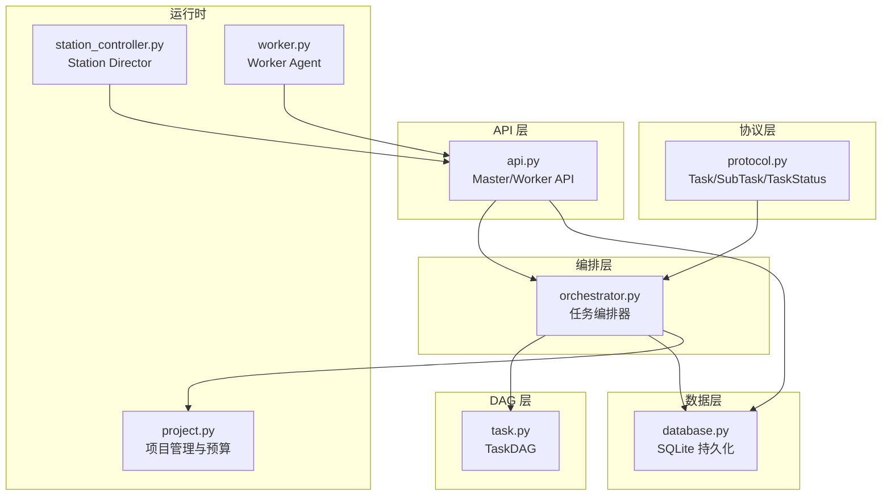
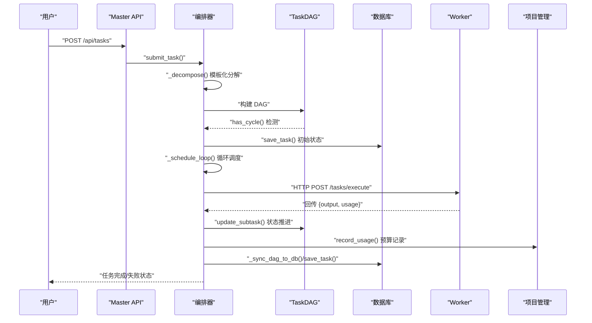
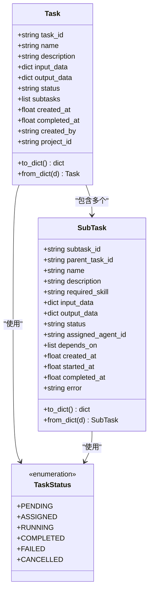
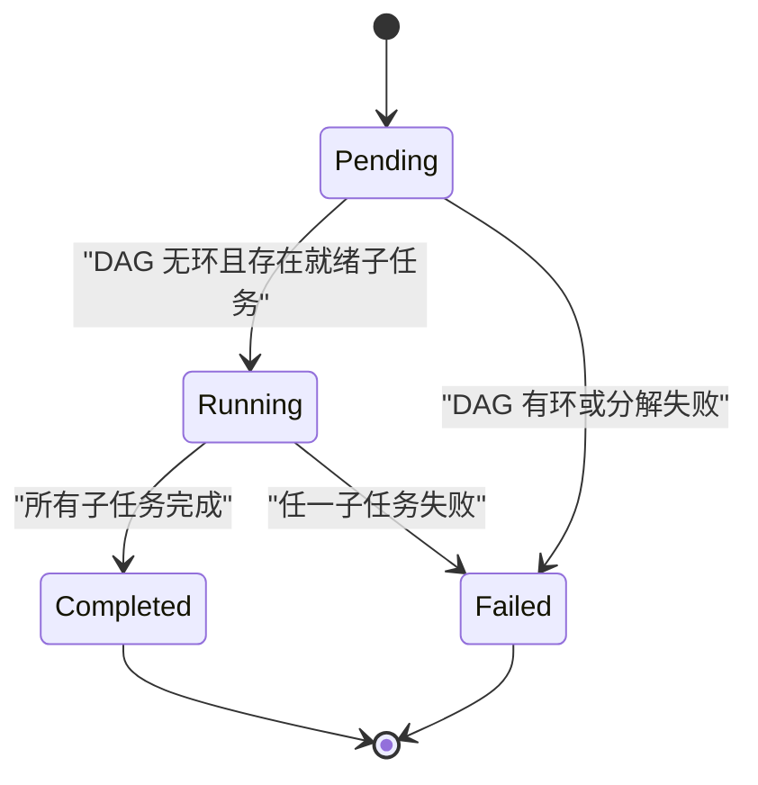
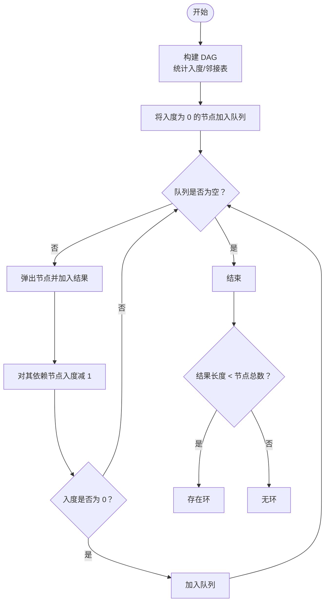
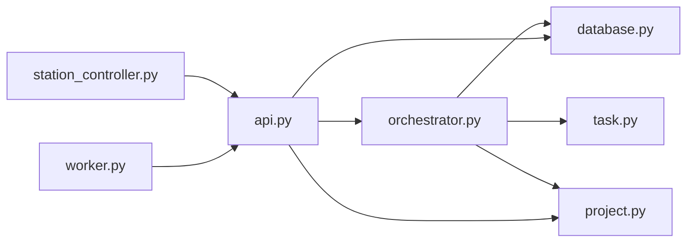

# 任务模型设计

<cite>
**本文引用的文件**
- [protocol.py](file://lan_mesh/protocol.py)
- [task.py](file://lan_mesh/task.py)
- [orchestrator.py](file://lan_mesh/orchestrator.py)
- [database.py](file://lan_mesh/database.py)
- [api.py](file://lan_mesh/api.py)
- [station_controller.py](file://lan_mesh/station_controller.py)
- [worker.py](file://lan_mesh/worker.py)
- [project.py](file://lan_mesh/project.py)
</cite>

## 目录
1. [简介](#简介)
2. [项目结构](#项目结构)
3. [核心组件](#核心组件)
4. [架构总览](#架构总览)
5. [详细组件分析](#详细组件分析)
6. [依赖关系分析](#依赖关系分析)
7. [性能考虑](#性能考虑)
8. [故障排除指南](#故障排除指南)
9. [结论](#结论)
10. [附录](#附录)

## 简介
本文件系统性阐述任务模型设计，围绕 Task 与 SubTask 数据模型、状态管理机制、依赖关系建模、输入输出数据结构与元数据管理、生命周期与时间戳记录、错误处理机制、数据验证与序列化/反序列化、数据库持久化策略，以及实际使用示例与最佳实践展开。目标读者包括需要理解或扩展该任务系统的工程师与产品人员。

## 项目结构
任务模型位于 lan_mesh 子模块中，采用“协议定义 + 编排器 + DAG + 数据库 + API”的分层设计：
- 协议层：定义 Task、SubTask、TaskStatus 等核心数据模型与枚举
- 编排层：负责任务分解、DAG 构建、调度与状态推进
- DAG 层：基于子任务依赖图进行拓扑排序与就绪任务筛选
- 数据层：SQLite 持久化，支持任务、代理、项目与消费记录
- API 层：对外提供任务提交、状态查询等 HTTP 接口

图表来源
- [protocol.py:237-298](file://lan_mesh/protocol.py#L237-L298)
- [orchestrator.py:58-262](file://lan_mesh/orchestrator.py#L58-L262)
- [task.py:16-91](file://lan_mesh/task.py#L16-L91)
- [database.py:16-611](file://lan_mesh/database.py#L16-L611)
- [api.py:103-526](file://lan_mesh/api.py#L103-L526)
- [station_controller.py](file://lan_mesh/station_controller.py#L67-L324)
- [worker.py:62-325](file://lan_mesh/worker.py#L62-L325)
- [project.py:62-320](file://lan_mesh/project.py#L62-L320)

章节来源
- [protocol.py:237-298](file://lan_mesh/protocol.py#L237-L298)
- [orchestrator.py:58-262](file://lan_mesh/orchestrator.py#L58-L262)
- [task.py:16-91](file://lan_mesh/task.py#L16-L91)
- [database.py:16-611](file://lan_mesh/database.py#L16-L611)
- [api.py:103-526](file://lan_mesh/api.py#L103-L526)
- [station_controller.py](file://lan_mesh/station_controller.py#L67-L324)
- [worker.py:62-325](file://lan_mesh/worker.py#L62-L325)
- [project.py:62-320](file://lan_mesh/project.py#L62-L320)

## 核心组件
- Task：顶层任务对象，包含任务标识、名称、描述、输入输出数据、状态、子任务列表、时间戳与创建者等元数据
- SubTask：子任务对象，包含子任务标识、父任务标识、名称、描述、所需技能、输入输出数据、状态、依赖关系、时间戳与错误信息
- TaskStatus：任务状态枚举，涵盖 pending、assigned、running、completed、failed、cancelled
- TaskDAG：子任务有向无环图，支持依赖构建、拓扑排序、就绪任务筛选、循环依赖检测、状态更新与持久化同步
- Orchestrator：任务编排器，负责任务提交、模板化分解、DAG 构建、Agent 匹配、子任务分发、结果聚合与状态推进
- Database：SQLite 数据库封装，提供任务、代理、项目与消费记录的 CRUD 与索引优化
- API：Master/Worker HTTP API，提供任务提交、状态查询、代理注册、心跳、文件共享等接口
- ProjectManager：项目管理与预算控制，提供项目生命周期、预算护栏、消费记录与模型路由策略

章节来源
- [protocol.py:237-298](file://lan_mesh/protocol.py#L237-L298)
- [task.py:16-91](file://lan_mesh/task.py#L16-L91)
- [orchestrator.py:58-262](file://lan_mesh/orchestrator.py#L58-L262)
- [database.py:16-611](file://lan_mesh/database.py#L16-L611)
- [api.py:103-526](file://lan_mesh/api.py#L103-L526)
- [project.py:62-320](file://lan_mesh/project.py#L62-L320)

## 架构总览
任务从提交到完成的端到端流程如下：
- 用户通过 Master API 提交任务
- 编排器根据任务描述选择模板并分解为子任务
- 构建 TaskDAG，检测循环依赖
- 启动调度循环，查找就绪子任务并分配给具备所需技能的空闲 Agent
- Worker 执行子任务并通过 HTTP 回传结果
- 编排器更新子任务状态，聚合输出，推进顶层任务状态
- 数据库持久化任务与代理状态，WebSocket 推送状态变化

图表来源
- [api.py:302-326](file://lan_mesh/api.py#L302-L326)
- [orchestrator.py:70-108](file://lan_mesh/orchestrator.py#L70-L108)
- [task.py:35-78](file://lan_mesh/task.py#L35-L78)
- [database.py:421-441](file://lan_mesh/database.py#L421-L441)
- [project.py:234-271](file://lan_mesh/project.py#L234-L271)

章节来源
- [api.py:302-326](file://lan_mesh/api.py#L302-L326)
- [orchestrator.py:70-108](file://lan_mesh/orchestrator.py#L70-L108)
- [task.py:35-78](file://lan_mesh/task.py#L35-L78)
- [database.py:421-441](file://lan_mesh/database.py#L421-L441)
- [project.py:234-271](file://lan_mesh/project.py#L234-L271)

## 详细组件分析

### 数据模型：Task 与 SubTask
- Task 字段
  - task_id：任务唯一标识
  - name/description：任务名称与描述
  - input_data/output_data：任务输入输出数据字典
  - status：任务状态（pending/assigned/running/completed/failed/cancelled）
  - subtasks：子任务列表（SubTask.to_dict()）
  - created_at/completed_at：创建与完成时间戳
  - created_by：任务创建者
  - project_id：关联项目 ID（用于预算与上下文隔离）
- SubTask 字段
  - subtask_id：子任务唯一标识
  - parent_task_id：父任务标识
  - name/description：子任务名称与描述
  - required_skill：所需技能名称（与 AgentCard.skills[].name 对应）
  - input_data/output_data：子任务输入输出数据字典
  - status：子任务状态（pending/assigned/running/completed/failed）
  - assigned_agent_id：分配的 Agent 标识
  - depends_on：前置子任务 ID 列表（拓扑排序依据）
  - created_at/started_at/completed_at：时间戳
  - error：错误信息（失败时记录）

图表来源
- [protocol.py:237-298](file://lan_mesh/protocol.py#L237-L298)

章节来源
- [protocol.py:237-298](file://lan_mesh/protocol.py#L237-L298)

### 状态管理机制与转换逻辑
- 顶层任务状态
  - pending：初始状态，等待子任务分解与 DAG 构建
  - running：DAG 无环且存在可执行子任务时进入
  - completed：所有子任务完成且无失败
  - failed：检测到循环依赖或子任务失败
  - cancelled：预留状态（可通过扩展实现取消流程）
- 子任务状态
  - pending：初始状态，等待依赖满足
  - assigned：已分配给 Agent，但尚未开始执行
  - running：Agent 正在执行
  - completed：执行成功并回传结果
  - failed：执行失败并记录错误
- 状态转换
  - 提交任务 → pending；若 DAG 有环 → failed
  - DAG 有环检测通过 → running；否则保持 failed
  - 调度循环中：就绪子任务 → assigned → running → completed/failed
  - 所有子任务完成 → completed；任一失败 → failed

图表来源
- [protocol.py:239-247](file://lan_mesh/protocol.py#L239-L247)
- [orchestrator.py:92-96](file://lan_mesh/orchestrator.py#L92-L96)
- [task.py:72-78](file://lan_mesh/task.py#L72-L78)

章节来源
- [protocol.py:239-247](file://lan_mesh/protocol.py#L239-L247)
- [orchestrator.py:92-96](file://lan_mesh/orchestrator.py#L92-L96)
- [task.py:72-78](file://lan_mesh/task.py#L72-L78)

### 依赖关系建模与拓扑排序
- 依赖建模
  - SubTask.depends_on：前置子任务 ID 列表
  - TaskDAG 构造时统计入度与邻接表
- 拓扑排序
  - Kahn 算法：入度为 0 的节点入队列，逐个弹出并减少依赖节点入度
  - 若最终排序长度小于节点数，说明存在环
- 就绪任务筛选
  - 当前状态为 pending 且所有依赖均已完成（completed）时，视为可执行
- 循环依赖检测
  - has_cycle() 基于拓扑排序长度判断

图表来源
- [task.py:22-78](file://lan_mesh/task.py#L22-L78)

章节来源
- [task.py:22-78](file://lan_mesh/task.py#L22-L78)

### 输入输出数据结构与元数据管理
- 输入数据
  - Task.input_data：顶层任务输入数据字典
  - SubTask.input_data：继承自父任务输入数据，亦可按子任务细化
- 输出数据
  - SubTask.output_data：子任务执行结果
  - Task.output_data：按子任务名称聚合的输出字典
- 元数据
  - 时间戳：created_at/started_at/completed_at
  - 错误信息：error（失败时记录）
  - 项目关联：project_id（用于预算与上下文隔离）
  - Agent 分配：assigned_agent_id（便于追踪执行者）

章节来源
- [protocol.py:249-297](file://lan_mesh/protocol.py#L249-L297)
- [orchestrator.py:235-247](file://lan_mesh/orchestrator.py#L235-L247)

### 任务生命周期管理与时间戳记录
- 生命周期阶段
  - 提交：创建 Task，状态 pending
  - 分解：模板化生成 SubTask 列表
  - DAG 构建：检测环，决定是否进入 running
  - 调度：分配 Agent，标记 assigned/running
  - 执行：Worker 执行并回传结果
  - 完成/失败：聚合输出，推进顶层任务状态
- 时间戳
  - created_at：任务创建时间
  - started_at：子任务开始执行时间
  - completed_at：子任务完成或失败时间
  - last_seen：代理与主机心跳时间（间接反映任务执行进度）

章节来源
- [protocol.py:249-297](file://lan_mesh/protocol.py#L249-L297)
- [database.py:421-461](file://lan_mesh/database.py#L421-L461)
- [orchestrator.py:176-217](file://lan_mesh/orchestrator.py#L176-L217)

### 错误处理机制
- 子任务失败
  - HTTP 请求异常或响应非 200：标记 failed，记录错误与完成时间
  - Worker 执行异常：回传错误信息，编排器统一处理
- 任务失败
  - DAG 有环：任务状态直接设为 failed
  - 子任务失败：任务状态设为 failed
- Agent 状态恢复
  - 无论成功与否，最终都会恢复 Agent 的状态与任务计数

章节来源
- [orchestrator.py:176-224](file://lan_mesh/orchestrator.py#L176-L224)
- [task.py:76-78](file://lan_mesh/task.py#L76-L78)

### 数据验证规则、序列化与反序列化
- 数据验证
  - 通过 dataclass 字段与 from_dict() 构造，自动过滤无效字段
  - 任务状态使用枚举约束，避免非法状态
- 序列化/反序列化
  - to_dict()/from_dict() 实现 JSON 序列化与反序列化
  - 数据库存储采用 JSON 字符串（input_data/output_data/subtasks），读取时还原为字典
- 类型与字段约束
  - required_skill 与 AgentCard.skills[].name 对应，确保技能匹配
  - depends_on 为字符串 ID 列表，需保证 ID 存在且无环

章节来源
- [protocol.py:267-297](file://lan_mesh/protocol.py#L267-L297)
- [database.py:421-461](file://lan_mesh/database.py#L421-L461)

### 数据库持久化策略
- 表结构
  - tasks：任务主表，包含任务元数据、状态、子任务 JSON、时间戳与项目 ID
  - agents：代理注册表，包含技能、工具、并发限制与状态
  - projects：项目表，包含预算、路由策略与状态
  - usage_log：消费记录表，记录每次模型调用的成本
- 索引
  - tasks.status、agents.status、projects.status 用于快速过滤
  - usage_log 上按项目与时间建立索引
- 事务与线程安全
  - 每线程独立连接，避免跨线程共享连接导致的 SQLite 线程安全问题
- 兼容性
  - tasks 表新增 project_id 列，兼容旧版本

章节来源
- [database.py:36-143](file://lan_mesh/database.py#L36-L143)
- [database.py:421-461](file://lan_mesh/database.py#L421-L461)
- [database.py:589-611](file://lan_mesh/database.py#L589-L611)

### 实际使用示例与最佳实践
- 提交任务
  - 通过 Master API POST /api/tasks 提交任务，可选携带 project_id
  - 编排器根据任务描述自动选择模板并分解为子任务
- 任务状态查询
  - GET /api/tasks/{task_id} 查询任务状态与输出
- 项目预算控制
  - 提交前检查项目预算，超支则拒绝任务
  - 记录每次调用的 token 用量与成本，自动更新项目已用预算
- 最佳实践
  - 明确子任务依赖：确保 depends_on 指向存在的子任务 ID
  - 合理拆分子任务：粒度适中，避免过度碎片化
  - 使用项目隔离：不同项目独立工作空间与预算
  - 监控与告警：利用 WebSocket 推送与数据库日志跟踪任务状态

章节来源
- [api.py:302-326](file://lan_mesh/api.py#L302-L326)
- [project.py:176-201](file://lan_mesh/project.py#L176-L201)
- [project.py:234-271](file://lan_mesh/project.py#L234-L271)

## 依赖关系分析
- 组件耦合
  - Orchestrator 依赖 Database、TaskDAG、AgentCard 与 ProjectManager
  - TaskDAG 依赖 SubTask
  - API 层依赖 Orchestrator、Database、ProjectManager
  - Master/Worker 运行时分别提供 API 与任务执行能力
- 外部依赖
  - SQLite：本地轻量级持久化
  - FastAPI/uvicorn：HTTP 服务与 WebSocket
  - requests：HTTP 客户端调用 Worker

图表来源
- [orchestrator.py:19-21](file://lan_mesh/orchestrator.py#L19-L21)
- [api.py:103-112](file://lan_mesh/api.py#L103-L112)
- [station_controller.py](file://lan_mesh/station_controller.py#L105-L110)
- [worker.py:42-44](file://lan_mesh/worker.py#L42-L44)

章节来源
- [orchestrator.py:19-21](file://lan_mesh/orchestrator.py#L19-L21)
- [api.py:103-112](file://lan_mesh/api.py#L103-L112)
- [station_controller.py](file://lan_mesh/station_controller.py#L105-L110)
- [worker.py:42-44](file://lan_mesh/worker.py#L42-L44)

## 性能考虑
- 拓扑排序复杂度
  - Kahn 算法时间复杂度 O(V+E)，适合中小规模任务图
- 数据库写入
  - 任务状态更新频繁，建议批量同步（如 _sync_dag_to_db）降低写放大
- 线程与并发
  - 每线程独立连接 SQLite，避免锁竞争
  - 调度循环使用 sleep 控制轮询频率，避免忙等
- 网络调用
  - Worker 执行超时设置合理（当前为 300 秒），失败时及时回退并恢复 Agent 状态

## 故障排除指南
- 任务状态卡在 pending
  - 检查子任务依赖是否满足，确认 depends_on 是否正确
  - 确认 DAG 无环（has_cycle）
- 子任务失败
  - 查看子任务 error 字段与 Worker 日志
  - 检查 Agent 技能匹配与网络连通性
- 预算超支
  - 检查项目预算与已用额度，必要时调整路由策略
- 数据库异常
  - 确认 SQLite 文件权限与磁盘空间
  - 检查索引是否存在，必要时重建

章节来源
- [task.py:68-78](file://lan_mesh/task.py#L68-L78)
- [orchestrator.py:209-224](file://lan_mesh/orchestrator.py#L209-L224)
- [project.py:273-291](file://lan_mesh/project.py#L273-L291)
- [database.py:138-143](file://lan_mesh/database.py#L138-L143)

## 结论
该任务模型以清晰的数据模型与严格的生命周期管理为核心，结合 DAG 依赖建模、Agent 匹配与项目预算控制，实现了从任务提交到执行完成的完整闭环。通过 SQLite 持久化与 HTTP API 提供了良好的可扩展性与可观测性。建议在生产环境中关注依赖完整性、Agent 能力匹配与预算护栏，并持续优化调度策略与错误恢复机制。

## 附录
- 关键接口
  - 提交任务：POST /api/tasks
  - 查询任务：GET /api/tasks/{task_id}
  - 执行子任务：POST /workers/tasks/execute
- 关键表
  - tasks：任务主表
  - agents：代理注册表
  - projects：项目表
  - usage_log：消费记录表
