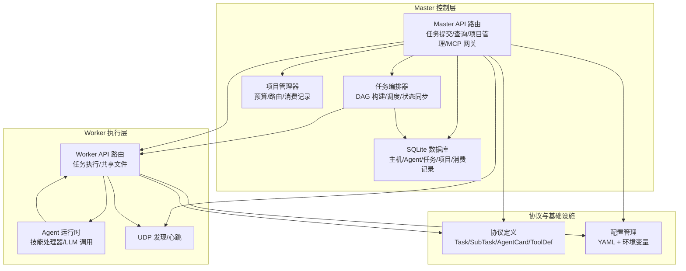
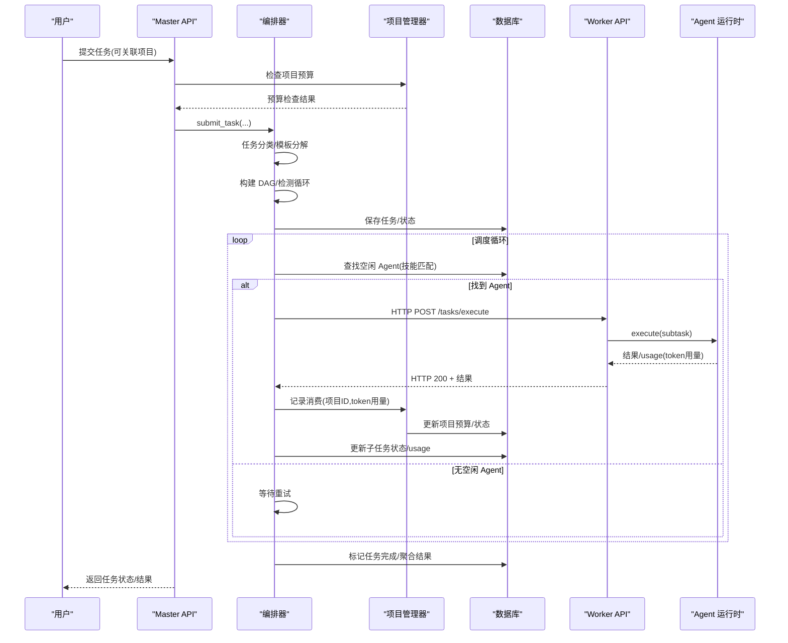
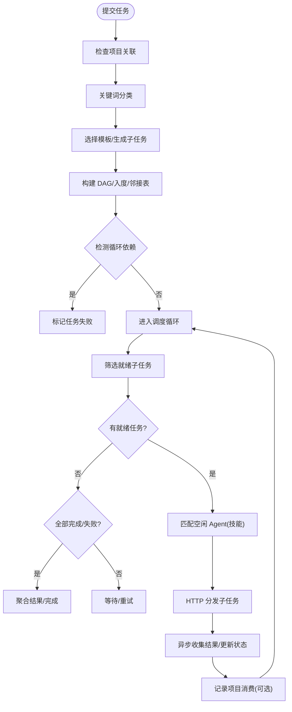
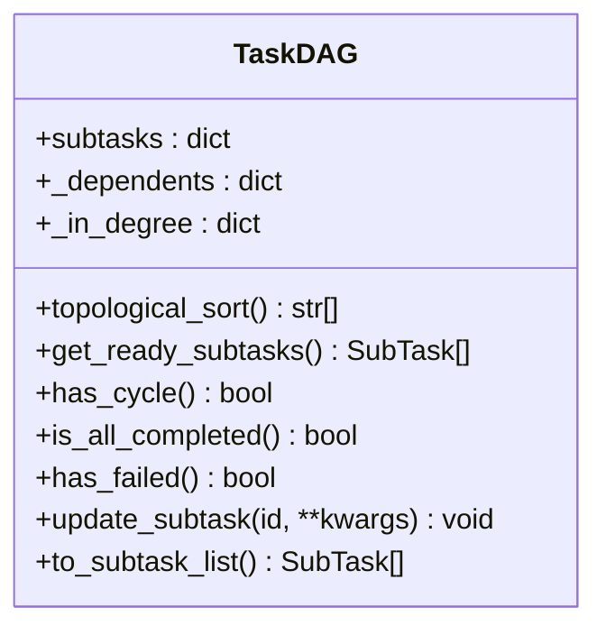
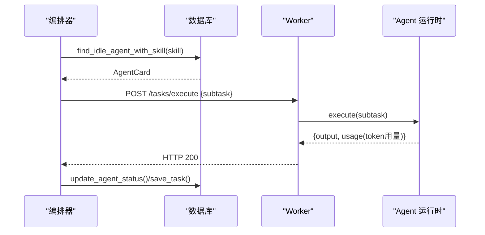
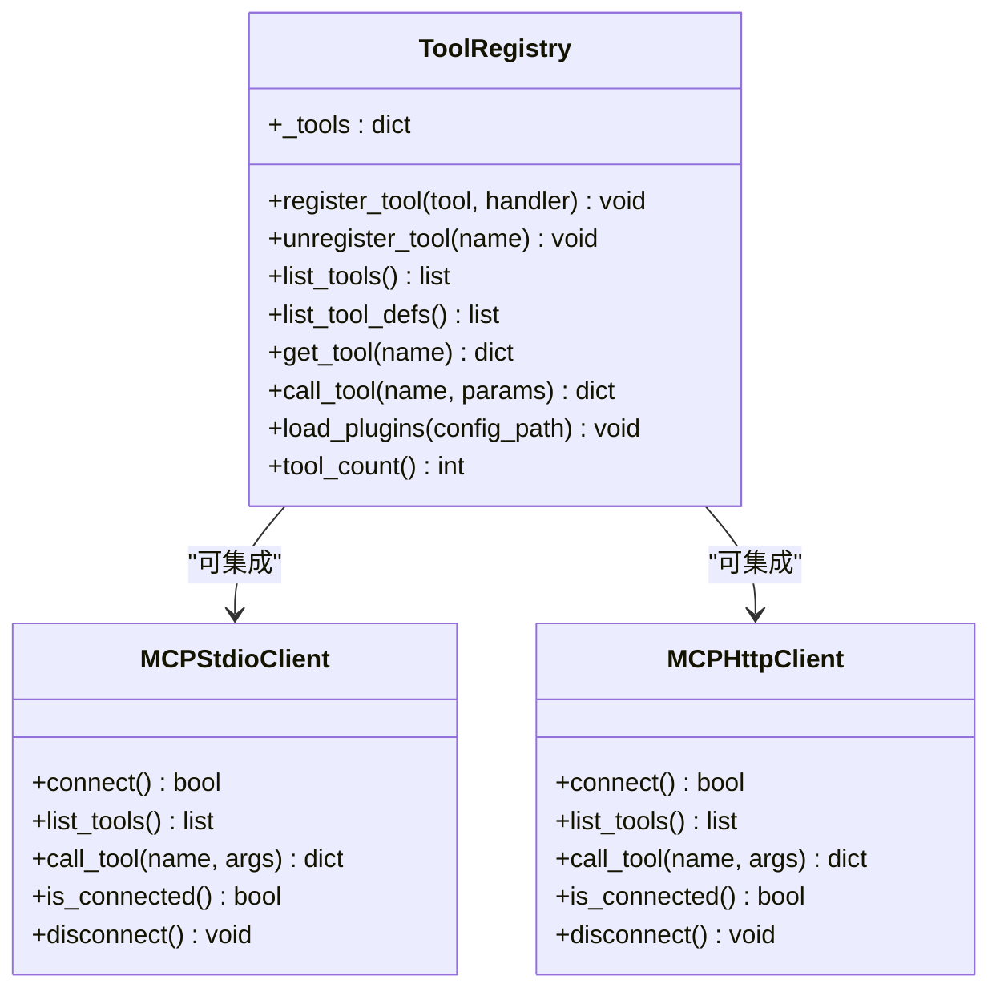
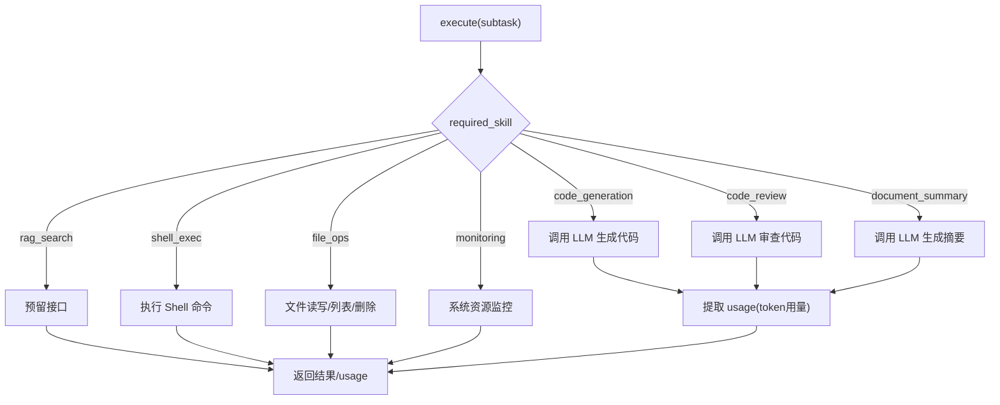
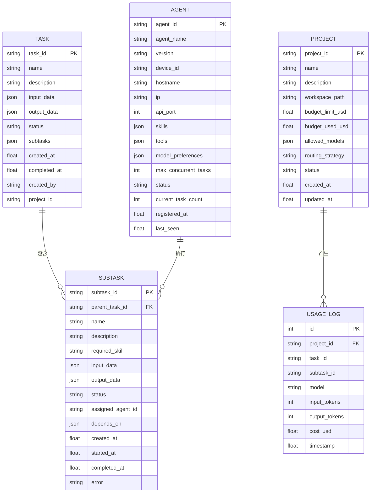
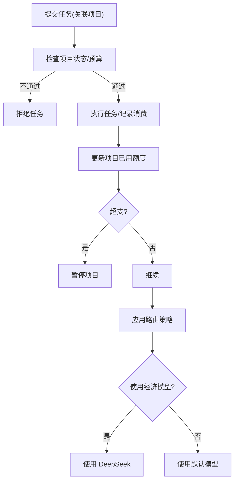
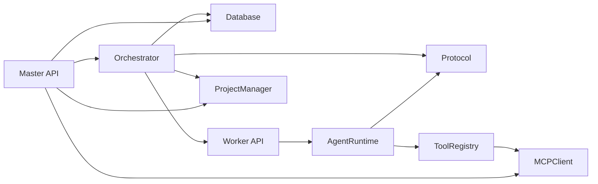

# 任务编排系统

<cite>
**本文引用的文件**
- [orchestrator.py](file://lan_mesh/orchestrator.py)
- [task.py](file://lan_mesh/task.py)
- [tool_registry.py](file://lan_mesh/tool_registry.py)
- [mcp_client.py](file://lan_mesh/mcp_client.py)
- [agent_runtime.py](file://lan_mesh/agent_runtime.py)
- [database.py](file://lan_mesh/database.py)
- [protocol.py](file://lan_mesh/protocol.py)
- [worker.py](file://lan_mesh/worker.py)
- [station_controller.py](file://lan_mesh/station_controller.py)
- [api.py](file://lan_mesh/api.py)
- [config.py](file://lan_mesh/config.py)
- [project.py](file://lan_mesh/project.py)
- [config.yaml](file://config.yaml)
</cite>

## 更新摘要
**变更内容**
- 集成项目管理功能，支持项目预算检查和消费记录追踪
- 增强任务编排器，支持项目关联和预算控制
- 新增ProjectManager类，实现路由策略和预算护栏
- 扩展Agent运行时，支持LLM调用token用量统计
- 增加Web界面项目管理功能

## 目录
1. [简介](#简介)
2. [项目结构](#项目结构)
3. [核心组件](#核心组件)
4. [架构总览](#架构总览)
5. [详细组件分析](#详细组件分析)
6. [依赖关系分析](#依赖关系分析)
7. [性能考量](#性能考量)
8. [故障排查指南](#故障排查指南)
9. [结论](#结论)
10. [附录](#附录)

## 简介
本任务编排系统采用"Master-Slave"架构，结合 DAG（有向无环图）任务模型与 Agent 能力匹配，实现跨主机的分布式任务分解、调度与执行。系统支持：
- 任务自动分类与模板化分解
- DAG 依赖图构建与拓扑排序
- 基于技能的 Agent 匹配与负载均衡
- 工具注册表与 MCP 客户端集成
- **项目级预算控制与消费追踪**
- **路由策略管理（成本优先/质量优先/平衡）**
- 任务状态管理与进度跟踪

## 项目结构
系统主要分为三层：Master 控制层、Worker 执行层、协议与基础设施层。

**图表来源**
- [station_controller.py](file://lan_mesh/station_controller.py#L67-L114)
- [worker.py:62-96](file://lan_mesh/worker.py#L62-L96)
- [api.py:103-112](file://lan_mesh/api.py#L103-L112)
- [database.py:16-143](file://lan_mesh/database.py#L16-L143)
- [protocol.py:12-356](file://lan_mesh/protocol.py#L12-L356)

**章节来源**
- [station_controller.py](file://lan_mesh/station_controller.py#L67-L114)
- [worker.py:62-96](file://lan_mesh/worker.py#L62-L96)
- [api.py:103-112](file://lan_mesh/api.py#L103-L112)
- [database.py:16-143](file://lan_mesh/database.py#L16-L143)
- [protocol.py:12-356](file://lan_mesh/protocol.py#L12-L356)

## 核心组件
- 任务编排器（Master）：负责任务分解、DAG 构建、Agent 匹配、子任务分发与结果聚合。
- 任务 DAG：基于拓扑排序的依赖图，支持循环检测、就绪任务筛选与状态更新。
- Agent 运行时（Worker）：根据技能类型路由到对应处理器，支持 LLM API 调用与本地工具执行。
- 工具注册表与 MCP 客户端：提供内置工具、插件工具与 MCP 服务器集成。
- 数据库与协议：持久化存储、模型定义与状态同步。
- **项目管理器：预算控制、路由策略与消费记录追踪。**

**章节来源**
- [orchestrator.py:58-108](file://lan_mesh/orchestrator.py#L58-L108)
- [task.py:16-91](file://lan_mesh/task.py#L16-L91)
- [agent_runtime.py:28-75](file://lan_mesh/agent_runtime.py#L28-L75)
- [tool_registry.py:217-249](file://lan_mesh/tool_registry.py#L217-L249)
- [mcp_client.py:22-93](file://lan_mesh/mcp_client.py#L22-L93)
- [database.py:16-143](file://lan_mesh/database.py#L16-L143)
- [protocol.py:161-356](file://lan_mesh/protocol.py#L161-L356)
- [project.py:62-124](file://lan_mesh/project.py#L62-L124)

## 架构总览
系统采用"Master-Slave"模式，Master 负责编排与协调，Worker 负责具体执行。任务生命周期从提交到完成贯穿 Master 的编排与 Worker 的执行。

**图表来源**
- [api.py:302-326](file://lan_mesh/api.py#L302-L326)
- [orchestrator.py:70-108](file://lan_mesh/orchestrator.py#L70-L108)
- [orchestrator.py:132-156](file://lan_mesh/orchestrator.py#L132-L156)
- [orchestrator.py:157-226](file://lan_mesh/orchestrator.py#L157-L226)
- [agent_runtime.py:47-75](file://lan_mesh/agent_runtime.py#L47-L75)
- [database.py:421-441](file://lan_mesh/database.py#L421-L441)

## 详细组件分析

### 任务编排器（Master）
- 任务分类：基于关键词规则驱动，支持 code_task/document_task/system_task/simple_task 四类模板。
- DAG 构建：将模板项转为 SubTask，并建立依赖关系；通过拓扑排序保证执行顺序。
- 调度循环：持续扫描就绪子任务，匹配空闲 Agent，分发执行；异步收集结果并更新状态。
- 错误处理：检测循环依赖、子任务失败、HTTP 异常；回滚 Agent 状态并记录错误。
- **项目集成**：支持任务关联项目，自动检查预算并在执行过程中记录消费。

**图表来源**
- [orchestrator.py:46-56](file://lan_mesh/orchestrator.py#L46-L56)
- [orchestrator.py:110-131](file://lan_mesh/orchestrator.py#L110-L131)
- [orchestrator.py:132-156](file://lan_mesh/orchestrator.py#L132-L156)
- [orchestrator.py:157-226](file://lan_mesh/orchestrator.py#L157-L226)
- [task.py:35-79](file://lan_mesh/task.py#L35-L79)

**章节来源**
- [orchestrator.py:46-108](file://lan_mesh/orchestrator.py#L46-L108)
- [task.py:16-91](file://lan_mesh/task.py#L16-L91)

### 任务 DAG（拓扑排序与依赖管理）
- 数据结构：邻接表与入度表，支持快速判断就绪节点。
- 算法：Kahn 拓扑排序，检测环形依赖；按入度为 0 的节点推进执行。
- 查询：就绪任务筛选、失败检测、完成检测、状态更新。

**图表来源**
- [task.py:16-91](file://lan_mesh/task.py#L16-L91)

**章节来源**
- [task.py:16-91](file://lan_mesh/task.py#L16-L91)

### Agent 能力匹配与子任务调度
- Agent 能力：AgentCard 中的 skills/tools/model_preferences 描述 Agent 的技能与工具。
- 匹配策略：按技能名称匹配，优先空闲 Agent，按并发任务数升序选择。
- 分发流程：HTTP POST /tasks/execute，Worker 执行后返回结果与 usage；Master 记录消费并恢复 Agent 状态。

**图表来源**
- [orchestrator.py:151-154](file://lan_mesh/orchestrator.py#L151-L154)
- [orchestrator.py:157-226](file://lan_mesh/orchestrator.py#L157-L226)
- [database.py:396-417](file://lan_mesh/database.py#L396-L417)
- [api.py:54-60](file://lan_mesh/api.py#L54-L60)
- [agent_runtime.py:47-75](file://lan_mesh/agent_runtime.py#L47-L75)

**章节来源**
- [database.py:396-417](file://lan_mesh/database.py#L396-L417)
- [api.py:54-60](file://lan_mesh/api.py#L54-L60)
- [agent_runtime.py:28-75](file://lan_mesh/agent_runtime.py#L28-L75)

### 工具注册表与 MCP 客户端
- 工具注册表：内置工具（文件读写、Shell、HTTP、目录遍历、Python 评估）、YAML 插件加载、运行时动态注册。
- MCP 客户端：支持 stdio 与 HTTP 两种传输，提供 tools/list 与 tools/call 接口。
- 使用场景：Agent 运行时可调用工具，Master 侧也可通过 API 路由到 MCP 网关。

**图表来源**
- [tool_registry.py:217-338](file://lan_mesh/tool_registry.py#L217-L338)
- [mcp_client.py:22-252](file://lan_mesh/mcp_client.py#L22-L252)

**章节来源**
- [tool_registry.py:217-338](file://lan_mesh/tool_registry.py#L217-L338)
- [mcp_client.py:22-252](file://lan_mesh/mcp_client.py#L22-L252)

### Agent 运行时（Worker）
- 技能处理器：code_generation/code_review/document_summary/rag_search/shell_exec/file_ops/monitoring。
- LLM 调用：优先 DeepSeek，其次 OpenAI；返回内容与 token 用量。
- 本地工具：Shell 命令执行、文件读写、目录遍历、Python 评估等。
- **消费记录**：LLM 调用返回 usage 字段，包含模型名称和 token 用量。

**图表来源**
- [agent_runtime.py:47-75](file://lan_mesh/agent_runtime.py#L47-L75)
- [agent_runtime.py:78-242](file://lan_mesh/agent_runtime.py#L78-L242)

**章节来源**
- [agent_runtime.py:28-242](file://lan_mesh/agent_runtime.py#L28-L242)

### 数据模型与状态管理
- Task/SubTask：任务与子任务的数据结构，包含状态、依赖、输入输出、时间戳与错误信息。
- AgentCard：Agent 能力声明，包含技能、工具、模型偏好、并发限制与状态。
- 数据库：持久化存储主机、Agent、任务、项目与消费记录，支持索引优化查询。
- **项目模型**：Project 类包含预算限制、已用预算、模型白名单、路由策略等字段。

**图表来源**
- [protocol.py:250-298](file://lan_mesh/protocol.py#L250-L298)
- [protocol.py:203-235](file://lan_mesh/protocol.py#L203-L235)
- [database.py:92-103](file://lan_mesh/database.py#L92-L103)
- [database.py:74-90](file://lan_mesh/database.py#L74-L90)

**章节来源**
- [protocol.py:237-356](file://lan_mesh/protocol.py#L237-L356)
- [database.py:16-143](file://lan_mesh/database.py#L16-L143)

### 项目管理与预算控制
- 项目隔离：每个项目拥有独立工作空间、预算配额、模型白名单与路由策略。
- 预算护栏：超支自动暂停项目；预算接近阈值时建议切换经济模型。
- 消费记录：记录每次 LLM 调用的 token 用量与成本，自动更新项目已用额度。
- **路由策略**：支持 cost_first（成本优先）、quality_first（质量优先）、balanced（平衡）三种策略。
- **Web界面**：提供项目管理界面，显示预算使用情况、消费记录和项目状态。

**图表来源**
- [api.py:302-326](file://lan_mesh/api.py#L302-L326)
- [project.py:176-191](file://lan_mesh/project.py#L176-L191)
- [project.py:234-272](file://lan_mesh/project.py#L234-L272)
- [project.py:273-292](file://lan_mesh/project.py#L273-L292)

**章节来源**
- [project.py:62-320](file://lan_mesh/project.py#L62-L320)
- [api.py:302-326](file://lan_mesh/api.py#L302-L326)

## 依赖关系分析
- 组件耦合：Master 的 Orchestrator 依赖 Database 与 Protocol；Worker 的 AgentRuntime 依赖 Protocol 与工具注册表；API 路由贯穿 Master/Worker。
- 外部依赖：requests、sqlite3、FastAPI、uvicorn、psutil、subprocess 等。
- 循环依赖：未见直接循环；数据库与 API 路由相互协作，属于合理的控制流耦合。
- **项目集成**：Orchestrator 与 ProjectManager 通过构造函数注入，实现预算检查和消费记录。

**图表来源**
- [orchestrator.py:19-21](file://lan_mesh/orchestrator.py#L19-L21)
- [agent_runtime.py:20-26](file://lan_mesh/agent_runtime.py#L20-L26)
- [api.py:103-112](file://lan_mesh/api.py#L103-L112)
- [project.py:75-76](file://lan_mesh/project.py#L75-L76)

**章节来源**
- [orchestrator.py:19-21](file://lan_mesh/orchestrator.py#L19-L21)
- [agent_runtime.py:20-26](file://lan_mesh/agent_runtime.py#L20-L26)
- [api.py:103-112](file://lan_mesh/api.py#L103-L112)
- [project.py:75-76](file://lan_mesh/project.py#L75-L76)

## 性能考量
- 调度频率：调度循环每 2 秒轮询一次，平衡吞吐与延迟。
- 并发控制：Agent 最大并发任务数限制，避免过载。
- 数据库索引：对任务状态、Agent 状态、项目状态建立索引，提升查询效率。
- LLM 调用：优先使用成本较低的模型，必要时切换经济模型。
- I/O 优化：共享文件夹统一管理，减少重复传输。
- **预算检查**：项目预算检查在任务提交时进行，避免无效调度。

## 故障排查指南
- 任务卡住：检查 DAG 是否存在循环依赖；查看子任务状态与错误信息。
- Agent 不可用：确认 Agent 是否空闲且具备所需技能；检查 Worker 心跳与 Master 注册。
- HTTP 异常：检查 Worker API 地址与端口；查看网络连通性与防火墙。
- 工具调用失败：验证工具名称与输入参数；检查插件加载与权限。
- 预算超支：查看项目状态与消费记录；调整路由策略或增加预算。
- **项目管理异常**：检查项目配置、模型白名单和路由策略设置。

**章节来源**
- [orchestrator.py:92-98](file://lan_mesh/orchestrator.py#L92-L98)
- [orchestrator.py:209-217](file://lan_mesh/orchestrator.py#L209-L217)
- [database.py:396-417](file://lan_mesh/database.py#L396-L417)
- [project.py:273-292](file://lan_mesh/project.py#L273-L292)

## 结论
该任务编排系统通过 DAG 任务模型与 Agent 能力匹配，实现了跨主机的高效任务分解与执行。配合工具注册表与 MCP 客户端，系统具备良好的扩展性与集成能力。**新增的项目管理功能**通过预算控制和路由策略，确保成本可控，适合在多项目、多模型的复杂环境中稳定运行。Web界面提供了直观的项目管理体验，便于用户监控和控制任务执行成本。

## 附录

### 配置文件与启动
- 配置文件：支持 YAML 与环境变量覆盖，默认路径 ~/.lan_mesh/config.yaml 或 ./config.yaml。
- 启动流程：Master 初始化数据库与 Web UI，Worker 采集主机信息并注册到 Master。

**章节来源**
- [config.py:48-84](file://lan_mesh/config.py#L48-L84)
- [config.yaml:1-22](file://config.yaml#L1-L22)
- [station_controller.py](file://lan_mesh/station_controller.py#L238-L318)
- [worker.py:253-325](file://lan_mesh/worker.py#L253-L325)

### API 端点概览
- Master API：任务提交、查询、项目管理、MCP 网关、WebSocket 推送。
- Worker API：任务执行、共享文件管理。
- **项目管理端点**：项目创建、查询、更新、归档，消费记录查询。

**章节来源**
- [api.py:103-526](file://lan_mesh/api.py#L103-L526)

### 项目管理功能详解
- **预算检查**：在任务提交时检查项目状态和预算，防止超支任务进入执行队列。
- **消费记录**：自动记录每次 LLM 调用的 token 用量和成本，支持精确的成本控制。
- **路由策略**：根据项目预算状况和业务需求选择最优的模型调用策略。
- **Web界面**：提供项目管理界面，显示预算使用情况、消费记录和项目状态。

**章节来源**
- [project.py:62-320](file://lan_mesh/project.py#L62-L320)
- [api.py:345-423](file://lan_mesh/api.py#L345-L423)
