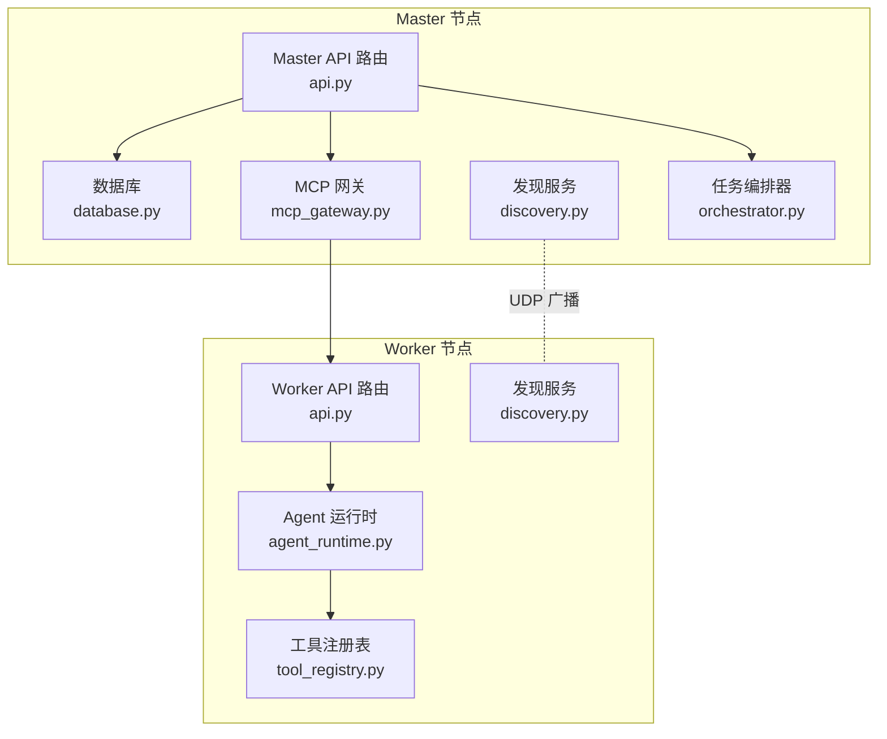
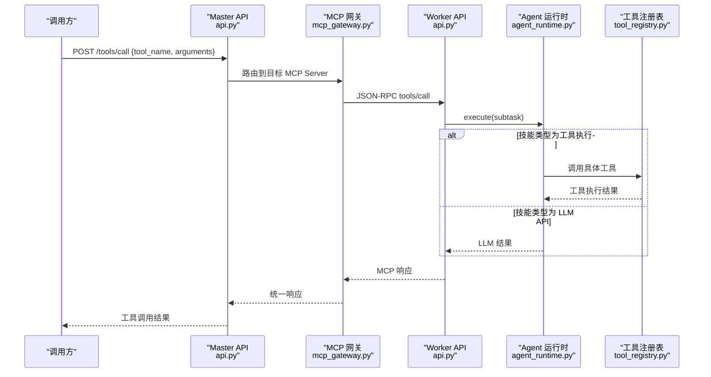
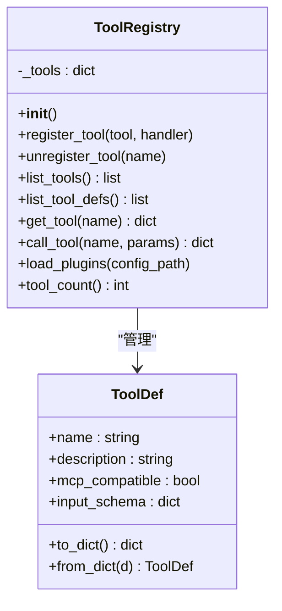
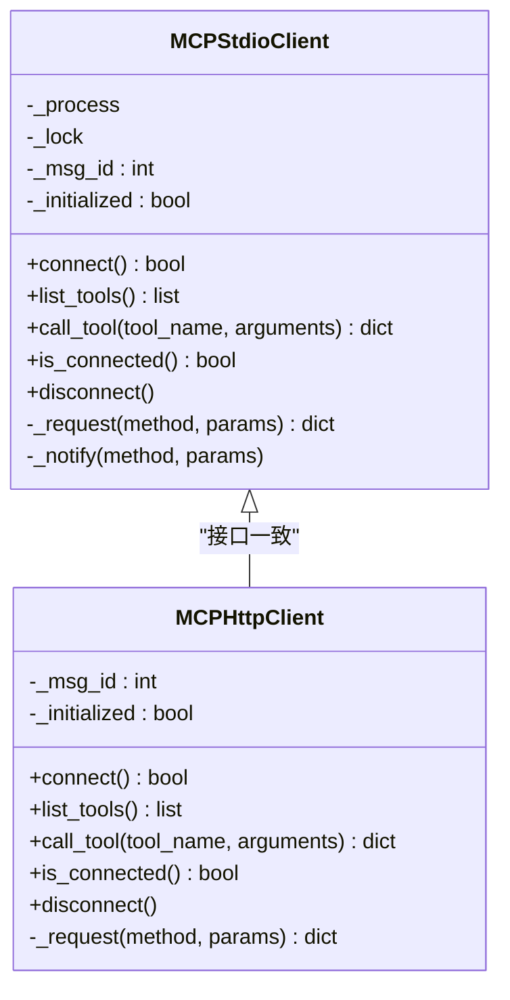
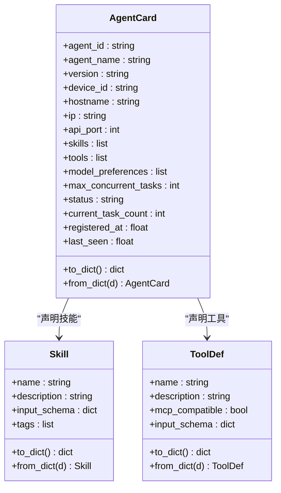
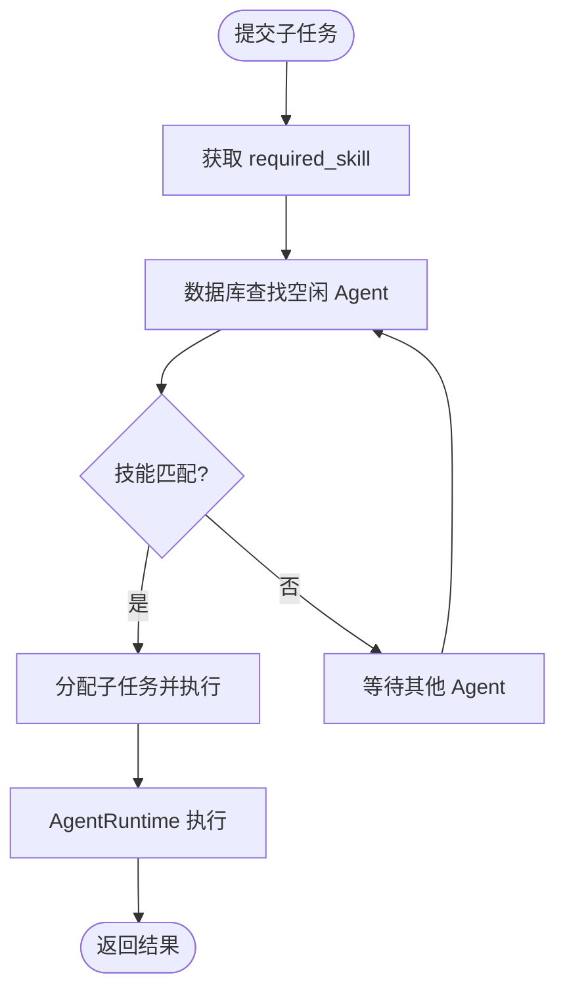
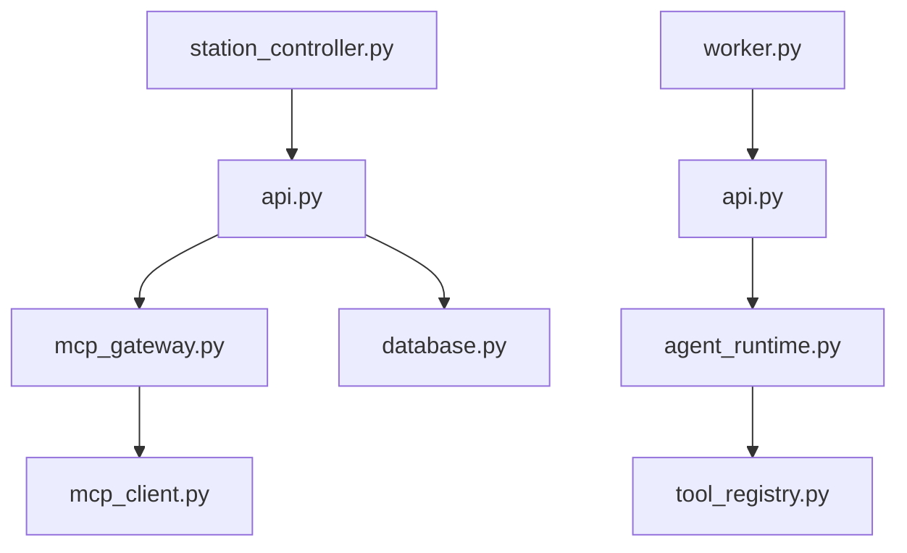

# 工具集成机制

<cite>
**本文档引用的文件**
- [tool_registry.py](file://lan_mesh/tool_registry.py)
- [mcp_client.py](file://lan_mesh/mcp_client.py)
- [mcp_gateway.py](file://lan_mesh/mcp_gateway.py)
- [agent_card.py](file://lan_mesh/agent_card.py)
- [protocol.py](file://lan_mesh/protocol.py)
- [api.py](file://lan_mesh/api.py)
- [station_controller.py](file://lan_mesh/station_controller.py)
- [worker.py](file://lan_mesh/worker.py)
- [database.py](file://lan_mesh/database.py)
- [orchestrator.py](file://lan_mesh/orchestrator.py)
- [agent_runtime.py](file://lan_mesh/agent_runtime.py)
- [task.py](file://lan_mesh/task.py)
- [discovery.py](file://lan_mesh/discovery.py)
- [shared_folder.py](file://lan_mesh/shared_folder.py)
- [host_info.py](file://lan_mesh/host_info.py)
</cite>

## 目录
1. [简介](#简介)
2. [项目结构](#项目结构)
3. [核心组件](#核心组件)
4. [架构概览](#架构概览)
5. [详细组件分析](#详细组件分析)
6. [依赖分析](#依赖分析)
7. [性能考虑](#性能考虑)
8. [故障排除指南](#故障排除指南)
9. [结论](#结论)
10. [附录](#附录)

## 简介
本文件系统性阐述 LAN Mesh 项目中的工具集成机制，重点围绕以下方面展开：
- 工具注册表的设计理念与实现：内置工具、插件工具、动态注册与执行调度
- 工具发现与能力声明：Agent Card 机制、技能与工具的 JSON Schema 声明
- MCP（Model Context Protocol）客户端实现：JSON-RPC 2.0 协议适配、stdio 与 HTTP 传输
- 工具调用流程：从 Master 的工具网关到 Worker 的工具执行
- 工具能力匹配算法：基于技能名称与输入 Schema 的匹配策略
- 版本管理与兼容性：ToolDef 的 mcp_compatible 字段与协议版本
- 错误处理与集成测试：异常捕获、超时控制与测试建议

## 项目结构
LAN Mesh 采用模块化设计，核心围绕“Master 控制器 + Worker 节点 + 工具网关”的分布式架构组织代码。工具集成相关的关键模块包括：
- 工具注册与执行：tool_registry.py
- MCP 客户端与网关：mcp_client.py、mcp_gateway.py
- Agent 能力声明：agent_card.py、protocol.py 中的 AgentCard/ToolDef/Skill
- API 路由与工具网关端点：api.py
- Station/Worker 生命周期与发现：station_controller.py、worker.py、discovery.py
- 数据持久化与任务编排：database.py、orchestrator.py、task.py
- 运行时工具执行：agent_runtime.py
- 辅助设施：shared_folder.py、host_info.py

**图表来源**
- [api.py:103-526](file://lan_mesh/api.py#L103-L526)
- [database.py:16-143](file://lan_mesh/database.py#L16-L143)
- [mcp_gateway.py](file://lan_mesh/mcp_gateway.py)
- [orchestrator.py:58-262](file://lan_mesh/orchestrator.py#L58-L262)
- [discovery.py:33-259](file://lan_mesh/discovery.py#L33-L259)
- [agent_runtime.py:28-242](file://lan_mesh/agent_runtime.py#L28-L242)
- [tool_registry.py:217-338](file://lan_mesh/tool_registry.py#L217-L338)

**章节来源**
- [station_controller.py](file://lan_mesh/station_controller.py#L67-L324)
- [worker.py:62-325](file://lan_mesh/worker.py#L62-L325)
- [api.py:103-526](file://lan_mesh/api.py#L103-L526)

## 核心组件
本节聚焦工具集成的核心构件及其职责：
- 工具注册表（ToolRegistry）：统一管理工具定义与执行，支持内置工具、插件工具与动态注册
- MCP 客户端（MCPStdioClient/MCPHttpClient）：实现 JSON-RPC 2.0 协议，支持本地子进程与远程 HTTP 两种传输
- MCP 网关（MCPGateway）：聚合多个 MCP Server 的工具清单，提供统一的工具发现与调用入口
- Agent 能力声明（AgentCard/Skill/ToolDef）：标准化 Agent 的技能与工具能力声明，便于匹配与路由
- 工具执行器（AgentRuntime）：在 Worker 端根据技能类型执行任务，包含 LLM API 调用与本地工具执行
- API 路由（api.py）：提供 /tools/list、/tools/call、/tools/servers 等工具网关端点

**章节来源**
- [tool_registry.py:217-338](file://lan_mesh/tool_registry.py#L217-L338)
- [mcp_client.py:22-252](file://lan_mesh/mcp_client.py#L22-L252)
- [mcp_gateway.py](file://lan_mesh/mcp_gateway.py)
- [agent_card.py:167-228](file://lan_mesh/agent_card.py#L167-L228)
- [protocol.py:179-235](file://lan_mesh/protocol.py#L179-L235)
- [agent_runtime.py:28-242](file://lan_mesh/agent_runtime.py#L28-L242)
- [api.py:427-498](file://lan_mesh/api.py#L427-L498)

## 架构概览
工具集成的整体流程如下：
1. Worker 启动后生成 Agent Card（包含技能与工具声明），并通过 HTTP 注册到 Master
2. Master 通过数据库维护 Agent 注册表，并提供 /tools/list 与 /tools/call 等端点
3. 当需要调用工具时，Master 通过 MCP 网关选择合适的 MCP Server，发起 JSON-RPC 调用
4. Worker 端的 Agent 运行时根据技能类型路由到对应处理器，必要时通过 ToolRegistry 执行具体工具
5. 工具执行结果以 MCP 规范的 JSON-RPC 响应返回给 Master

**图表来源**
- [api.py:443-468](file://lan_mesh/api.py#L443-L468)
- [mcp_gateway.py](file://lan_mesh/mcp_gateway.py)
- [agent_runtime.py:47-74](file://lan_mesh/agent_runtime.py#L47-L74)
- [tool_registry.py:259-288](file://lan_mesh/tool_registry.py#L259-L288)

## 详细组件分析

### 工具注册表（ToolRegistry）
- 设计理念
  - 支持三种注册方式：内置工具、配置文件加载的插件工具、运行时动态注册
  - 每个工具包含 ToolDef（名称、描述、JSON Schema 输入）、处理器函数与 MCP 兼容标记
- 核心功能
  - 动态注册/注销工具
  - 列出工具（MCP tools/list 格式）
  - 执行工具调用（MCP tools/call 格式），包含异常捕获与错误包装
  - 从 YAML 配置加载插件工具，支持模块导入与函数绑定
- 数据结构与复杂度
  - 工具存储为字典映射，查询与注册均为 O(1)
  - 工具执行涉及处理器调用，复杂度取决于具体处理器
- 优化与健壮性
  - 对异常进行捕获并返回 isError 标记
  - 对超时与异常输出进行明确区分

**图表来源**
- [tool_registry.py:217-338](file://lan_mesh/tool_registry.py#L217-L338)
- [protocol.py:179-193](file://lan_mesh/protocol.py#L179-L193)

**章节来源**
- [tool_registry.py:217-338](file://lan_mesh/tool_registry.py#L217-L338)

### MCP 客户端（MCPStdioClient / MCPHttpClient）
- 协议与传输
  - 遵循 MCP JSON-RPC 2.0 规范，支持 initialize、tools/list、tools/call
  - 两种传输方式：stdio（本地子进程）与 HTTP（远程服务）
- 连接与握手
  - stdio：启动子进程，发送 initialize 并等待响应；HTTP：直接发送 initialize
  - 成功握手后发送 notifications/initialized（stdio）
- 请求与通知
  - _request：发送 JSON-RPC 请求并等待匹配 id 的响应，跳过通知
  - _notify：发送无 id 的通知消息
- 错误处理
  - BrokenPipeError、JSON 解析错误、OSError 等异常被捕获并返回空响应
  - 超时与进程退出状态处理

**图表来源**
- [mcp_client.py:22-252](file://lan_mesh/mcp_client.py#L22-L252)

**章节来源**
- [mcp_client.py:22-252](file://lan_mesh/mcp_client.py#L22-L252)

### MCP 网关（MCPGateway）
- 职责
  - 维护 MCP Server 注册表，支持动态注册/注销
  - 聚合所有 MCP Server 的工具清单，提供统一的工具发现与调用入口
  - 提供统计信息与服务器状态查询
- 与 API 的集成
  - Master API 提供 /tools/list、/tools/call、/tools/servers 等端点，内部委托给 MCP 网关

**章节来源**
- [mcp_gateway.py](file://lan_mesh/mcp_gateway.py)
- [api.py:427-498](file://lan_mesh/api.py#L427-L498)

### Agent 能力声明（AgentCard / Skill / ToolDef）
- AgentCard
  - 包含设备信息、能力声明（skills/tools）、模型偏好、并发任务数与运行时状态
  - Worker 启动时生成并注册到 Master，用于任务匹配与分发
- Skill
  - 抽象 Agent 可处理的任务类型，包含输入 JSON Schema 与标签
- ToolDef
  - 抽象 Agent 可调用的外部工具，包含 MCP 兼容标记与输入 Schema
- 默认能力
  - 预置技能库与工具库，支持代码生成、审查、文档摘要、RAG 检索、Shell 执行、文件操作、监控等

**图表来源**
- [agent_card.py:167-228](file://lan_mesh/agent_card.py#L167-L228)
- [protocol.py:179-235](file://lan_mesh/protocol.py#L179-L235)

**章节来源**
- [agent_card.py:16-228](file://lan_mesh/agent_card.py#L16-L228)
- [protocol.py:159-235](file://lan_mesh/protocol.py#L159-L235)

### 工具调用流程（API 端点）
- /tools/list：聚合所有 MCP Server 的工具清单，返回给 Agent 初始化
- /tools/call：路由到指定 MCP Server 执行工具，返回 MCP 格式的响应
- /tools/servers：管理 MCP Server 注册与状态
- 错误处理：缺失参数、服务器未初始化、调用失败等情况均返回标准错误结构

**章节来源**
- [api.py:427-498](file://lan_mesh/api.py#L427-L498)

### 工具能力匹配算法与 Agent 能力验证
- 匹配策略
  - 编排器根据子任务的 required_skill，在数据库中查找空闲 Agent，比较 AgentCard.skills[].name 与 required_skill 是否一致
  - 匹配成功后将子任务分配给该 Agent
- 能力验证
  - AgentCard 中 skills 与 tools 均为 JSON Schema 声明，Master 可据此进行输入校验与能力匹配
  - Worker 端 AgentRuntime 根据技能名称路由到对应处理器，若未知技能则返回错误

**图表来源**
- [orchestrator.py:150-154](file://lan_mesh/orchestrator.py#L150-L154)
- [database.py:396-417](file://lan_mesh/database.py#L396-L417)

**章节来源**
- [orchestrator.py:58-262](file://lan_mesh/orchestrator.py#L58-L262)
- [database.py:396-417](file://lan_mesh/database.py#L396-L417)

### 工具扩展接口与自定义工具开发
- 插件工具加载
  - 通过 YAML 配置文件声明工具模块与函数，ToolRegistry.load_plugins 动态导入并注册
- 动态注册
  - ToolRegistry.register_tool 支持运行时注册自定义工具
- 开发步骤建议
  - 定义 ToolDef（含名称、描述、输入 Schema）
  - 实现处理器函数（接收参数字典，返回结构化结果）
  - 通过 ToolRegistry.register_tool 或配置文件加载完成注册

**章节来源**
- [tool_registry.py:290-334](file://lan_mesh/tool_registry.py#L290-L334)

### 版本管理与兼容性检查
- ToolDef.mcp_compatible：标记工具是否符合 MCP 规范，便于兼容性判断
- 协议版本：protocol.py 中定义协议版本常量，用于识别兼容性
- 建议
  - 新工具默认设置 mcp_compatible=True
  - 在配置文件中明确工具输入 Schema，确保 LLM 调用时的参数校验

**章节来源**
- [protocol.py:14-25](file://lan_mesh/protocol.py#L14-L25)
- [protocol.py:179-193](file://lan_mesh/protocol.py#L179-L193)

### 错误处理策略
- 工具执行错误
  - ToolRegistry.call_tool 捕获异常并返回 isError 标记与错误内容
- MCP 客户端错误
  - _request/_notify 捕获 BrokenPipeError、JSON 解析错误、OSError，避免进程崩溃
- API 端点错误
  - 缺少参数、服务器未初始化、HTTP 调用失败等情况均返回标准错误结构

**章节来源**
- [tool_registry.py:273-288](file://lan_mesh/tool_registry.py#L273-L288)
- [mcp_client.py:104-144](file://lan_mesh/mcp_client.py#L104-L144)
- [api.py:443-468](file://lan_mesh/api.py#L443-L468)

## 依赖分析
- 组件耦合
  - Master API 依赖 MCP 网关与数据库；MCP 网关依赖 Worker 的 MCP Server
  - Worker API 依赖 Agent 运行时与工具注册表；Agent 运行时依赖工具注册表
- 外部依赖
  - requests（HTTP 调用）、subprocess（stdio 传输）、psutil（主机信息采集）
- 潜在循环依赖
  - 通过模块拆分避免直接循环导入；API 路由在各自模块中定义

**图表来源**
- [api.py:103-526](file://lan_mesh/api.py#L103-L526)
- [mcp_gateway.py](file://lan_mesh/mcp_gateway.py)
- [mcp_client.py:22-252](file://lan_mesh/mcp_client.py#L22-L252)
- [agent_runtime.py:28-242](file://lan_mesh/agent_runtime.py#L28-L242)
- [tool_registry.py:217-338](file://lan_mesh/tool_registry.py#L217-L338)
- [database.py:16-143](file://lan_mesh/database.py#L16-L143)
- [station_controller.py](file://lan_mesh/station_controller.py#L67-L324)
- [worker.py:62-325](file://lan_mesh/worker.py#L62-L325)

**章节来源**
- [api.py:103-526](file://lan_mesh/api.py#L103-L526)
- [mcp_client.py:22-252](file://lan_mesh/mcp_client.py#L22-L252)
- [agent_runtime.py:28-242](file://lan_mesh/agent_runtime.py#L28-L242)
- [tool_registry.py:217-338](file://lan_mesh/tool_registry.py#L217-L338)
- [database.py:16-143](file://lan_mesh/database.py#L16-L143)
- [station_controller.py](file://lan_mesh/station_controller.py#L67-L324)
- [worker.py:62-325](file://lan_mesh/worker.py#L62-L325)

## 性能考虑
- 工具执行
  - ToolRegistry.call_tool 对异常进行捕获，避免单个工具失败影响整体流程
  - AgentRuntime 的 LLM 调用支持超时控制，防止阻塞
- 网络与传输
  - MCPHttpClient 使用超时参数，stdio 客户端通过锁保证并发安全
- 数据库访问
  - Database 使用线程局部连接，减少锁竞争；索引覆盖常用查询字段

[本节为通用指导，不直接分析具体文件]

## 故障排除指南
- 工具不存在或执行失败
  - 检查 ToolRegistry.register_tool 是否正确注册，确认工具名称与调用一致
  - 查看 ToolRegistry.call_tool 返回的 isError 标记与错误内容
- MCP 连接失败
  - stdio：确认命令存在、进程正常退出；查看 initialize 响应
  - HTTP：确认 URL 可达、认证头正确；检查超时设置
- Agent 匹配不到
  - 确认 AgentCard.skills[].name 与子任务 required_skill 一致
  - 检查数据库中 Agent 状态是否为空闲且具备所需技能

**章节来源**
- [tool_registry.py:266-288](file://lan_mesh/tool_registry.py#L266-L288)
- [mcp_client.py:38-70](file://lan_mesh/mcp_client.py#L38-L70)
- [database.py:396-417](file://lan_mesh/database.py#L396-L417)

## 结论
LAN Mesh 的工具集成机制通过 ToolRegistry、MCP 客户端与网关、AgentCard 能力声明以及 API 路由实现了灵活、可扩展的工具生态。其核心优势在于：
- 统一的工具注册与执行框架
- MCP 协议的标准化适配与多传输支持
- 基于技能与工具 Schema 的能力匹配与验证
- 完善的错误处理与可观测性

建议在生产环境中：
- 明确工具输入 Schema，提升 LLM 调用安全性
- 使用插件化工具加载，便于快速扩展
- 建立工具版本与兼容性管理策略
- 完善集成测试与监控告警

[本节为总结性内容，不直接分析具体文件]

## 附录

### 实际工具集成示例（步骤指引）
- 定义工具
  - 在 ToolDef 中声明工具名称、描述与输入 Schema
  - 实现处理器函数，返回结构化结果
- 注册工具
  - 通过 ToolRegistry.register_tool 动态注册
  - 或在 YAML 配置中声明模块与函数，使用 ToolRegistry.load_plugins 加载
- 验证能力
  - 在 Worker 端生成 AgentCard，确保 tools 列表包含新增工具
  - 通过 /tools/list 端点确认工具可见性
- 调用工具
  - 使用 /tools/call 端点传入工具名称与参数
  - 检查返回的 isError 标记与内容

**章节来源**
- [tool_registry.py:232-334](file://lan_mesh/tool_registry.py#L232-L334)
- [agent_card.py:167-217](file://lan_mesh/agent_card.py#L167-L217)
- [api.py:427-468](file://lan_mesh/api.py#L427-L468)

### 最佳实践指南
- 工具设计
  - 明确输入 Schema，最小化必填项，提供合理默认值
  - 工具名称语义清晰，避免歧义
- 错误处理
  - 工具处理器应返回结构化错误信息，便于上层处理
  - 对外部依赖（网络、文件系统）增加超时与重试策略
- 版本与兼容
  - 工具默认 mcp_compatible=True，确保与 MCP 生态兼容
  - 在配置文件中记录工具版本与依赖
- 测试方法
  - 单元测试：针对 ToolDef 的输入校验与处理器逻辑
  - 集成测试：通过 API 端点调用工具，验证返回格式与错误处理
  - 性能测试：模拟高并发工具调用，评估响应时间与资源占用

[本节为通用指导，不直接分析具体文件]
