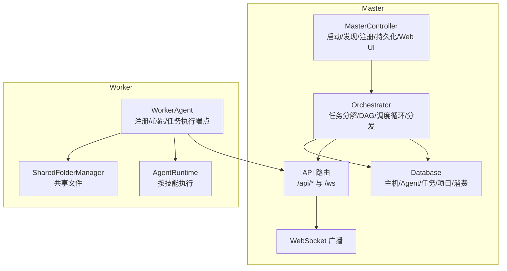
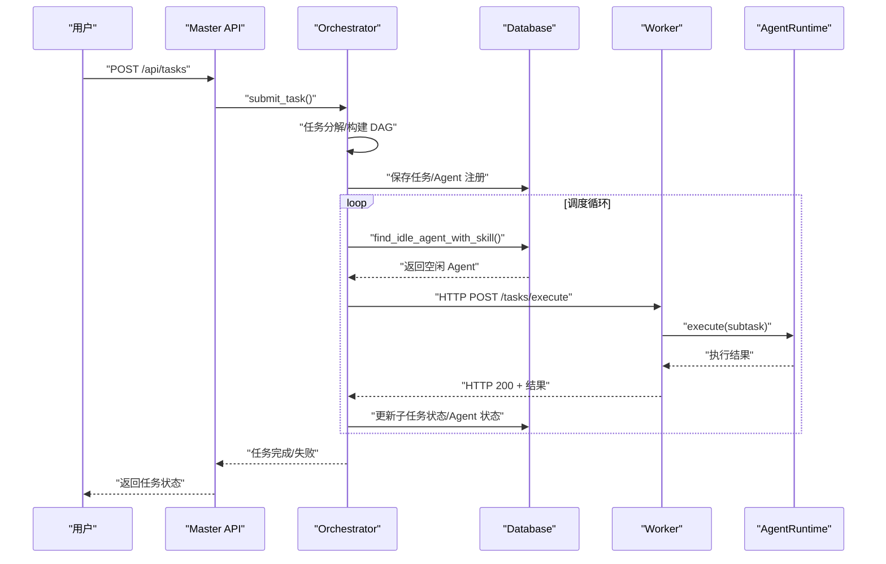
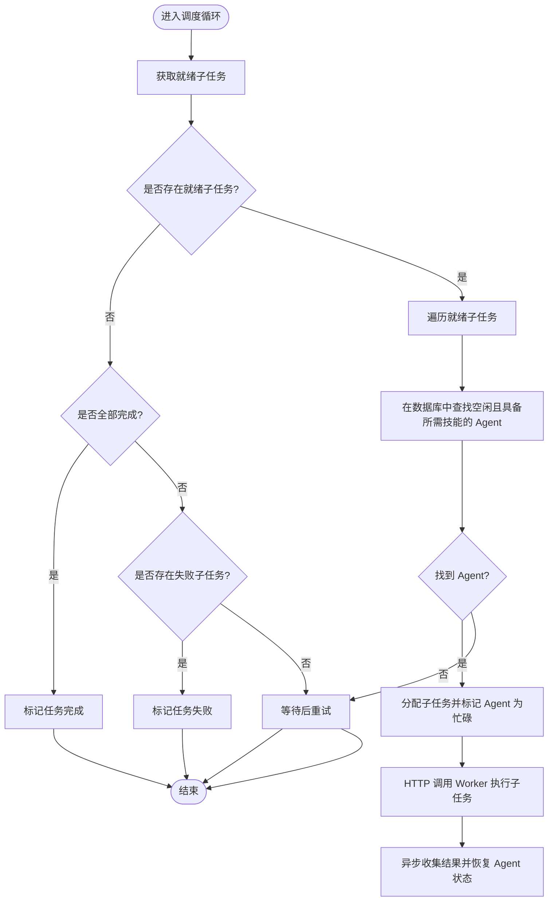
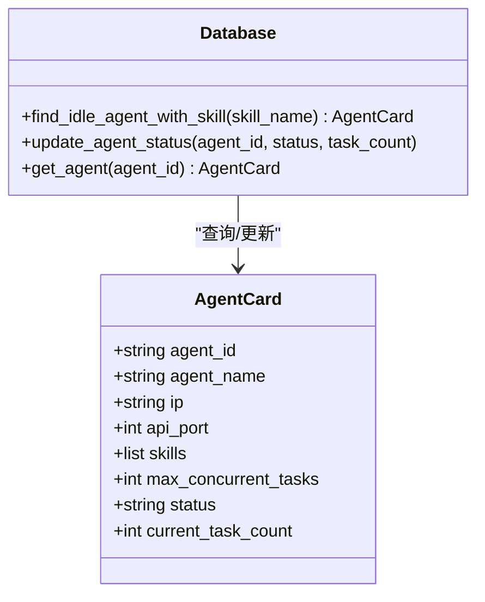
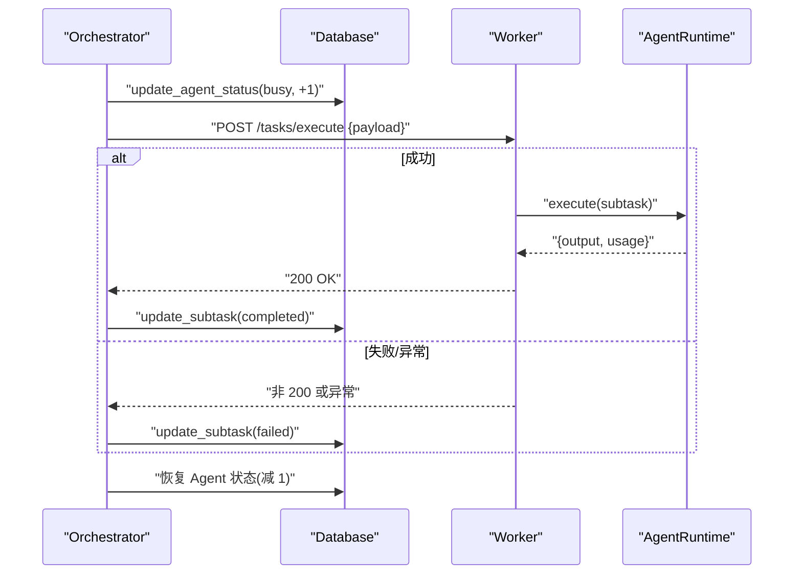
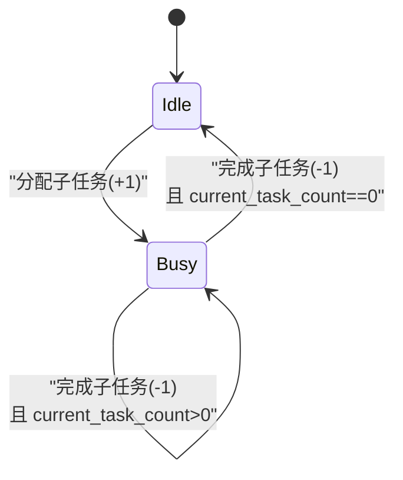
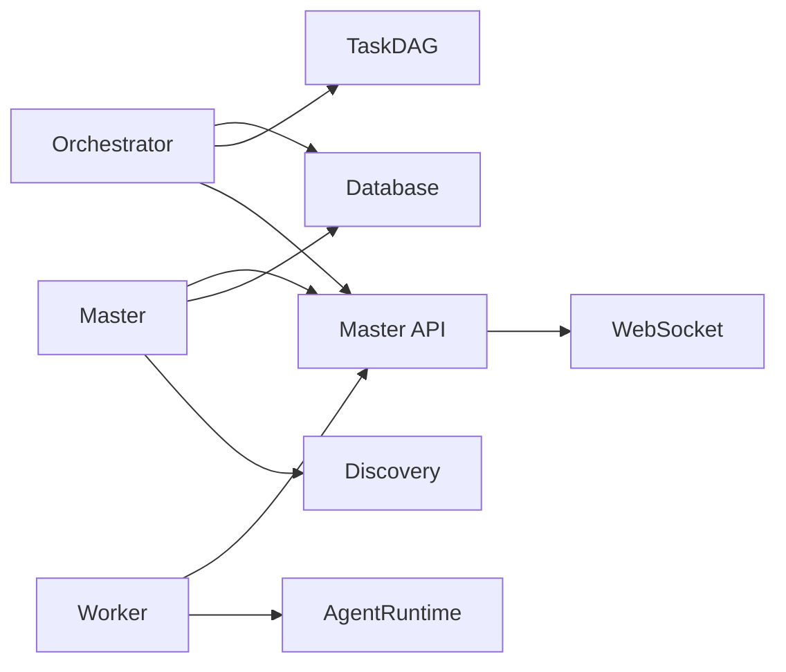

# 调度器实现

<cite>
**本文引用的文件**
- [station_controller.py](file://lan_mesh/station_controller.py)
- [orchestrator.py](file://lan_mesh/orchestrator.py)
- [worker.py](file://lan_mesh/worker.py)
- [task.py](file://lan_mesh/task.py)
- [agent_runtime.py](file://lan_mesh/agent_runtime.py)
- [database.py](file://lan_mesh/database.py)
- [protocol.py](file://lan_mesh/protocol.py)
- [api.py](file://lan_mesh/api.py)
- [agent_card.py](file://lan_mesh/agent_card.py)
- [discovery.py](file://lan_mesh/discovery.py)
- [shared_folder.py](file://lan_mesh/shared_folder.py)
</cite>

## 目录
1. [简介](#简介)
2. [项目结构](#项目结构)
3. [核心组件](#核心组件)
4. [架构总览](#架构总览)
5. [详细组件分析](#详细组件分析)
6. [依赖分析](#依赖分析)
7. [性能考虑](#性能考虑)
8. [故障排除指南](#故障排除指南)
9. [结论](#结论)

## 简介
本文档围绕调度器实现进行深入解析，重点涵盖：
- 调度循环的实现机制与调度节奏
- 就绪子任务检测与 Agent 匹配算法
- 任务分发策略、并发控制与负载均衡
- HTTP 调用 Worker 执行子任务的流程、超时与错误恢复
- Agent 状态管理（忙碌/空闲）与任务计数机制
- 调度性能优化、重试与资源竞争处理
- 实际调度流程示例与故障排除建议

## 项目结构
本项目采用“Master/Worker”中心化架构，核心模块如下：
- Master 控制器：负责发现、注册、心跳、持久化、Web UI、任务提交入口
- Orchestrator 编排器：任务分解、构建 DAG、调度循环、分发与结果聚合
- Worker 守护进程：自动注册、心跳、任务执行端点
- Agent 运行时：按技能路由到具体执行处理器
- 数据库层：持久化主机、Agent、任务、项目与消费记录
- 协议与 API：统一的数据模型、端点定义与 WebSocket 推送

图表来源
- [station_controller.py](file://lan_mesh/station_controller.py#L238-L324)
- [orchestrator.py:58-262](file://lan_mesh/orchestrator.py#L58-L262)
- [worker.py:62-325](file://lan_mesh/worker.py#L62-L325)
- [agent_runtime.py:28-242](file://lan_mesh/agent_runtime.py#L28-L242)
- [database.py:16-611](file://lan_mesh/database.py#L16-L611)
- [api.py:103-526](file://lan_mesh/api.py#L103-L526)

章节来源
- [station_controller.py](file://lan_mesh/station_controller.py#L67-L114)
- [orchestrator.py:58-108](file://lan_mesh/orchestrator.py#L58-L108)
- [worker.py:62-96](file://lan_mesh/worker.py#L62-L96)
- [agent_runtime.py:28-46](file://lan_mesh/agent_runtime.py#L28-L46)
- [database.py:16-143](file://lan_mesh/database.py#L16-L143)
- [api.py:103-112](file://lan_mesh/api.py#L103-L112)

## 核心组件
- MasterController：启动 Master，初始化发现、数据库、共享文件夹、编排器与 MCP 网关；提供 Web UI 与 API；定时清理离线主机与推送 WebSocket
- Orchestrator：任务提交、分解、构建 DAG、调度循环、分发子任务、聚合结果、失败处理
- WorkerAgent：自动注册与心跳、暴露任务执行端点、Agent 运行时
- AgentRuntime：按技能路由到对应处理器（LLM 调用、Shell 执行、文件操作、监控）
- Database：线程安全的 SQLite 存储，维护主机、Agent、任务、项目与消费记录
- Protocol：统一的数据模型（HostInfo/HostRecord/AgentCard/Task/SubTask 等）
- API：Master/Worker 路由、WebSocket 推送、MCP 工具网关
- AgentCard：生成 Worker 的能力卡片（技能/工具/模型偏好/并发限制）
- Discovery：UDP 广播发现、设备列表、TTL 清理
- SharedFolder：共享目录管理与主机配置报告生成

章节来源
- [station_controller.py](file://lan_mesh/station_controller.py#L67-L114)
- [orchestrator.py:58-108](file://lan_mesh/orchestrator.py#L58-L108)
- [worker.py:62-96](file://lan_mesh/worker.py#L62-L96)
- [agent_runtime.py:28-46](file://lan_mesh/agent_runtime.py#L28-L46)
- [database.py:16-143](file://lan_mesh/database.py#L16-L143)
- [protocol.py:12-356](file://lan_mesh/protocol.py#L12-L356)
- [api.py:103-112](file://lan_mesh/api.py#L103-L112)
- [agent_card.py:167-217](file://lan_mesh/agent_card.py#L167-L217)
- [discovery.py:33-94](file://lan_mesh/discovery.py#L33-L94)
- [shared_folder.py:16-86](file://lan_mesh/shared_folder.py#L16-L86)

## 架构总览
调度器整体流程：
- 用户通过 Master API 提交任务
- Orchestrator 将任务分解为子任务，构建 DAG
- 调度循环周期性扫描就绪子任务
- 依据子任务所需技能在数据库中查找空闲 Agent
- 通过 HTTP 将子任务分发给 Worker 的执行端点
- Worker 的 AgentRuntime 执行任务并返回结果
- Orchestrator 更新 DAG 状态、恢复 Agent 状态、聚合最终结果

图表来源
- [api.py:302-326](file://lan_mesh/api.py#L302-L326)
- [orchestrator.py:70-108](file://lan_mesh/orchestrator.py#L70-L108)
- [orchestrator.py:132-156](file://lan_mesh/orchestrator.py#L132-L156)
- [orchestrator.py:157-226](file://lan_mesh/orchestrator.py#L157-L226)
- [worker.py:54-60](file://lan_mesh/worker.py#L54-L60)
- [agent_runtime.py:47-74](file://lan_mesh/agent_runtime.py#L47-L74)

## 详细组件分析

### 调度循环与就绪子任务检测
- 调度循环在独立线程中持续运行，周期性检查 DAG 中的就绪子任务
- 就绪条件：子任务状态为 pending，且其所有前置依赖均已完成
- 若 DAG 已全部完成，则标记任务为 completed；若存在失败子任务，则标记任务为 failed
- 若无就绪子任务但仍有未完成子任务，调度器等待一段时间再重试

图表来源
- [orchestrator.py:132-156](file://lan_mesh/orchestrator.py#L132-L156)
- [task.py:54-66](file://lan_mesh/task.py#L54-L66)
- [database.py:396-417](file://lan_mesh/database.py#L396-L417)

章节来源
- [orchestrator.py:132-156](file://lan_mesh/orchestrator.py#L132-L156)
- [task.py:54-66](file://lan_mesh/task.py#L54-L66)
- [database.py:396-417](file://lan_mesh/database.py#L396-L417)

### Agent 匹配算法
- 匹配策略：优先查找状态为 idle 的 Agent，并按 current_task_count 升序排序，从而实现简单的负载均衡
- 技能匹配：AgentCard 中 skills 字段包含技能名称，调度器通过 required_skill 进行精确匹配
- 并发限制：AgentCard 中 max_concurrent_tasks 限制最大并发，调度器在分配时增加任务计数，在回收时减少任务计数

图表来源
- [protocol.py:203-234](file://lan_mesh/protocol.py#L203-L234)
- [database.py:396-417](file://lan_mesh/database.py#L396-L417)
- [database.py:380-394](file://lan_mesh/database.py#L380-L394)

章节来源
- [protocol.py:203-234](file://lan_mesh/protocol.py#L203-L234)
- [database.py:396-417](file://lan_mesh/database.py#L396-L417)
- [database.py:380-394](file://lan_mesh/database.py#L380-L394)

### 任务分发策略与 HTTP 执行
- 分发流程：调度器更新子任务状态为 assigned，记录 assigned_agent_id；同时将 Agent 的 current_task_count 加一并更新状态为 busy
- HTTP 调用：向 Worker 的执行端点发送子任务 payload，包含子任务标识、父任务标识、名称、描述、所需技能与输入数据
- 超时与错误处理：请求设置超时时间；HTTP 非 200 状态码或异常时，子任务标记为 failed
- 结果回传：Worker 返回执行结果（包含 output 与 usage），调度器更新子任务状态为 completed，并记录项目消费（如适用）

图表来源
- [orchestrator.py:157-226](file://lan_mesh/orchestrator.py#L157-L226)
- [worker.py:54-60](file://lan_mesh/worker.py#L54-L60)
- [agent_runtime.py:47-74](file://lan_mesh/agent_runtime.py#L47-L74)

章节来源
- [orchestrator.py:157-226](file://lan_mesh/orchestrator.py#L157-L226)
- [worker.py:54-60](file://lan_mesh/worker.py#L54-L60)
- [agent_runtime.py:47-74](file://lan_mesh/agent_runtime.py#L47-L74)

### Agent 状态管理与任务计数
- 状态枚举：idle/busy/offline（通过 AgentStatus 枚举）
- 状态更新：分配子任务前将 Agent 状态置为 busy，current_task_count 加一；执行完成后根据剩余任务数决定恢复为 idle 或保持 busy
- 并发控制：max_concurrent_tasks 限制 Agent 最大并发；当 current_task_count 达到上限时，Agent 不再被分配新任务

图表来源
- [protocol.py:195-200](file://lan_mesh/protocol.py#L195-L200)
- [database.py:380-394](file://lan_mesh/database.py#L380-L394)
- [orchestrator.py:218-224](file://lan_mesh/orchestrator.py#L218-L224)

章节来源
- [protocol.py:195-200](file://lan_mesh/protocol.py#L195-L200)
- [database.py:380-394](file://lan_mesh/database.py#L380-L394)
- [orchestrator.py:218-224](file://lan_mesh/orchestrator.py#L218-L224)

### 负载均衡与资源竞争
- 负载均衡：数据库查询空闲 Agent 时按 current_task_count 升序排列，优先分配给更空闲的 Agent
- 资源竞争：调度器内部使用锁保护 active_dags 与 DAG 更新；HTTP 执行采用异步线程，避免阻塞调度循环
- 并发上限：Agent 的 max_concurrent_tasks 限制单机并发，防止资源耗尽

章节来源
- [database.py:400-401](file://lan_mesh/database.py#L400-L401)
- [orchestrator.py:67-68](file://lan_mesh/orchestrator.py#L67-L68)
- [agent_card.py:214](file://lan_mesh/agent_card.py#L214)

### 任务生命周期与 DAG 管理
- 任务生命周期：pending → running → completed/failed
- DAG 构建：根据任务模板生成子任务，建立依赖关系（depends_on）
- 拓扑排序：Kahn 算法实现拓扑排序，检测循环依赖；就绪子任务通过入度为 0 且前置完成判断
- 状态同步：DAG 状态变更后同步回数据库，保证持久化一致性

章节来源
- [protocol.py:239-297](file://lan_mesh/protocol.py#L239-L297)
- [task.py:22-52](file://lan_mesh/task.py#L22-L52)
- [task.py:54-66](file://lan_mesh/task.py#L54-L66)
- [orchestrator.py:228-234](file://lan_mesh/orchestrator.py#L228-L234)

### Agent 能力声明与技能路由
- AgentCard：包含 agent_id、skills、tools、max_concurrent_tasks、status、current_task_count 等
- 技能定义：DEFAULT_SKILLS 提供多种技能（代码生成、代码审查、文档摘要、RAG 检索、Shell 执行、文件操作、监控）
- 路由策略：AgentRuntime 根据 required_skill 选择对应处理器；未知技能返回失败

章节来源
- [agent_card.py:167-217](file://lan_mesh/agent_card.py#L167-L217)
- [agent_runtime.py:28-46](file://lan_mesh/agent_runtime.py#L28-L46)
- [agent_runtime.py:78-168](file://lan_mesh/agent_runtime.py#L78-L168)

## 依赖分析
- 组件耦合
  - Orchestrator 依赖 Database（Agent 查询、任务持久化）、TaskDAG（DAG 管理）、AgentRuntime（Worker 执行）
  - Worker 依赖 AgentRuntime（执行）、SharedFolder（共享文件）、Discovery（注册/心跳）
  - Master 依赖 Discovery（发现）、Database（持久化）、API（路由/WebSocket）、Orchestrator（任务入口）
- 外部依赖
  - requests：HTTP 请求（注册、心跳、分发）
  - FastAPI/uvicorn：Web 服务与 API
  - SQLite：本地持久化
  - WebSocket：实时推送

图表来源
- [orchestrator.py:19-21](file://lan_mesh/orchestrator.py#L19-L21)
- [worker.py:42-44](file://lan_mesh/worker.py#L42-L44)
- [station_controller.py](file://lan_mesh/station_controller.py#L43-L45)
- [api.py:103-112](file://lan_mesh/api.py#L103-L112)

章节来源
- [orchestrator.py:19-21](file://lan_mesh/orchestrator.py#L19-L21)
- [worker.py:42-44](file://lan_mesh/worker.py#L42-L44)
- [station_controller.py](file://lan_mesh/station_controller.py#L43-L45)
- [api.py:103-112](file://lan_mesh/api.py#L103-L112)

## 性能考虑
- 调度节奏：调度循环每两次休眠间隔检查一次就绪子任务，避免频繁轮询造成 CPU 压力
- 并发模型：HTTP 执行在独立线程中进行，不阻塞调度循环；数据库访问通过线程局部连接保证线程安全
- 负载均衡：按 current_task_count 升序选择空闲 Agent，降低热点 Agent 的压力
- I/O 密集：Worker 执行多为 I/O 密集（LLM API、Shell 执行、文件操作），适合异步处理
- 超时与重试：HTTP 调用设置合理超时；失败时记录错误，便于后续重试或人工干预
- 数据库索引：为任务与 Agent 状态建立索引，提升查询效率

## 故障排除指南
- 任务长时间无进展
  - 检查是否存在循环依赖：DAG 构建阶段会检测并标记失败
  - 检查 Agent 是否存在且具备所需技能：确认 AgentCard 的 skills 与 required_skill 匹配
  - 检查 Worker 是否在线并正常心跳：查看 Master 的 hosts 列表与 last_seen
- 子任务失败
  - 查看子任务 error 字段与 Worker 返回的 HTTP 错误
  - 检查 LLM API Key 配置与网络连通性
  - 检查 Shell 命令超时与权限问题
- Agent 状态异常
  - 确认 Agent 的 current_task_count 与 max_concurrent_tasks 设置
  - 检查 Agent 是否被意外标记为 busy 且未释放
- WebSocket 推送断开
  - 检查客户端连接与服务器端异常捕获逻辑
  - 确保广播线程存活与客户端心跳机制

章节来源
- [task.py:68-78](file://lan_mesh/task.py#L68-L78)
- [database.py:396-417](file://lan_mesh/database.py#L396-L417)
- [orchestrator.py:209-217](file://lan_mesh/orchestrator.py#L209-L217)
- [api.py:529-539](file://lan_mesh/api.py#L529-L539)

## 结论
本调度器实现采用中心化 Master/Worker 架构，结合 DAG 与就绪子任务检测，实现了可靠的子任务分发与聚合。通过 AgentCard 能力声明与数据库中的空闲 Agent 查询，调度器能够高效地进行技能匹配与负载均衡。HTTP 分发与异步执行提升了吞吐能力，而数据库持久化与 WebSocket 推送提供了可观测性与一致性保障。针对性能与可靠性，建议进一步引入重试策略、限流与熔断机制，并在生产环境中加强监控与告警。
