# 工作站管理模块

<cite>
**本文档引用的文件**
- [main.py](file://main.py)
- [config.yaml](file://config.yaml)
- [lan_mesh/__init__.py](file://lan_mesh/__init__.py)
- [requirements.txt](file://requirements.txt)
- [lan_mesh/secretary.py](file://lan_mesh/secretary.py)
- [lan_mesh/worker.py](file://lan_mesh/worker.py)
- [lan_mesh/config.py](file://lan_mesh/config.py)
- [lan_mesh/api.py](file://lan_mesh/api.py)
- [lan_mesh/discovery.py](file://lan_mesh/discovery.py)
- [lan_mesh/host_info.py](file://lan_mesh/host_info.py)
- [lan_mesh/shared_folder.py](file://lan_mesh/shared_folder.py)
- [lan_mesh/database.py](file://lan_mesh/database.py)
- [lan_mesh/protocol.py](file://lan_mesh/protocol.py)
- [lan_mesh/orchestrator.py](file://lan_mesh/orchestrator.py)
- [lan_mesh/project.py](file://lan_mesh/project.py)
- [lan_mesh/web/templates/dashboard.html](file://lan_mesh/web/templates/dashboard.html)
- [lan_mesh/station_controller.py](file://lan_mesh/station_controller.py)
- [lan_mesh/station_director.py](file://lan_mesh/station_director.py)
- [lan_mesh/station_api.py](file://lan_mesh/station_api.py)
- [lan_mesh/skill_registry.py](file://lan_mesh/skill_registry.py)
- [lan_mesh/bot_gateway.py](file://lan_mesh/bot_gateway.py)
</cite>

## 更新摘要
**变更内容**
- 主机角色识别从二元系统扩展为三角色系统（station/secretary/worker）
- 新增角色样式支持，包括CSS样式和JavaScript角色标识
- 更新主机详情显示，支持三种角色的差异化展示
- 增强IP地址检测和报告系统，优化on_host_registered和on_heartbeat事件处理器
- 新增Bot Gateway系统集成，支持企业微信和Telegram双向通信
- 新增事件回调机制，实现任务状态、主机状态等事件的自动推送
- 新增命令处理功能，支持Telegram机器人命令交互
- 新增Bot通道配置管理，支持动态添加、删除和测试通道
- 更新架构概览以反映Bot Gateway的集成
- **更新** Station控制器中的UDP发现心跳机制增强，_on_device_seen方法现在将UDP包作为轻量级心跳处理

## 目录
1. [简介](#简介)
2. [项目结构](#项目结构)
3. [核心组件](#核心组件)
4. [架构概览](#架构概览)
5. [详细组件分析](#详细组件分析)
6. [依赖关系分析](#依赖关系分析)
7. [性能考虑](#性能考虑)
8. [故障排除指南](#故障排除指南)
9. [结论](#结论)

## 简介

工作站管理模块是一个基于Python开发的分布式主机管理系统，采用Station-Director/Secretary-Worker架构实现跨主机的统一管理。该系统提供了完整的设备发现、配置采集、资源共享、任务编排和项目管理功能。

**更新** 主机角色识别系统已从传统的二元系统（station/worker）扩展为三角色系统（station/secretary/worker），实现了更精细的角色管理和界面展示。新增的角色样式支持包括CSS样式定义和JavaScript角色标识，为三种角色提供了差异化的视觉呈现。

**更新** 新增了Bot Gateway系统，实现了与手机端的双向通信能力，支持企业微信和Telegram机器人的消息推送和命令交互。通过事件回调机制，系统能够自动将任务状态、主机状态、Secretary激活/停用等重要事件推送到手机端，同时支持通过Telegram机器人发送命令来查询工作站状态和执行管理操作。

**更新** IP地址检测和报告系统得到显著改进，on_host_registered和on_heartbeat事件处理器现在具备更强大的IP地址检测能力。系统能够优先从UDP发现服务获取真实的主机IP地址，其次才使用Worker上报的IP地址，确保主机信息的准确性。这一改进解决了跨网络环境下主机IP地址识别不准确的问题，为远程管理和监控提供了可靠的基础。

**更新** Station控制器中的UDP发现心跳机制得到重要增强。_on_device_seen方法现在将UDP包作为轻量级心跳处理，为已注册设备更新last_seen时间戳和实时指标（CPU、内存、磁盘使用率、IP地址），防止Station节点间因缺少HTTP心跳而被错误标记为离线。此改进特别适用于多Station部署场景，显著提升了系统的稳定性和可靠性。

系统的核心特点包括：
- **三角色架构**：Station Director（基础设施管理）、Secretary（中央控制器）、Worker（工作节点）
- **自动发现**：基于UDP广播的局域网设备自动发现机制
- **配置管理**：自动采集和管理主机配置信息
- **资源共享**：基于共享文件夹的文件传输和同步
- **任务编排**：智能的任务分解和Agent匹配调度
- **项目隔离**：多项目预算控制和资源隔离
- **基础设施管理**：独立的Station Director提供主机评级和资源池管理
- **远程管理**：支持在远程主机上启动或停止Secretary角色
- **Web界面**：提供直观的仪表盘和实时监控，支持三种角色的差异化展示
- **技能管理**：中央技能注册表支持自动扫描、权限分配和内容分发
- **移动通信**：Bot Gateway提供企业微信和Telegram双向通信通道
- **事件推送**：自动推送任务状态、主机状态等重要事件到手机端
- **命令交互**：支持通过Telegram机器人发送命令查询状态和执行操作
- **IP地址检测**：增强的IP地址检测和报告系统，确保主机IP信息的准确性
- **UDP心跳机制**：增强的UDP发现心跳机制，防止Station节点间误判离线

## 项目结构

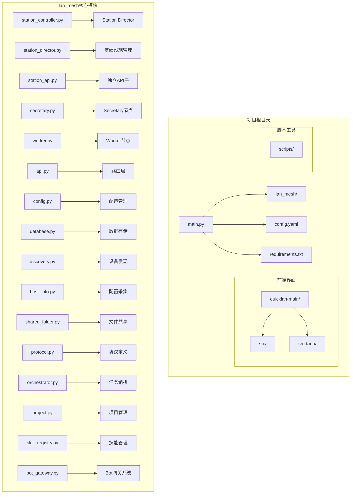

**图表来源**
- [main.py:1-98](file://main.py#L1-L98)
- [lan_mesh/station_controller.py:1-555](file://lan_mesh/station_controller.py#L1-L555)
- [lan_mesh/station_director.py:1-232](file://lan_mesh/station_director.py#L1-L232)
- [lan_mesh/station_api.py:1-757](file://lan_mesh/station_api.py#L1-L757)
- [lan_mesh/skill_registry.py:1-388](file://lan_mesh/skill_registry.py#L1-L388)
- [lan_mesh/bot_gateway.py:1-354](file://lan_mesh/bot_gateway.py#L1-L354)

**章节来源**
- [main.py:1-98](file://main.py#L1-L98)
- [config.yaml:1-22](file://config.yaml#L1-L22)
- [requirements.txt:1-8](file://requirements.txt#L1-L8)

## 核心组件

### 主要角色

系统采用三角色架构：

**Station Director（工作站主管）**
- 独立的基础设施管理层
- 负责主机注册入站、评级和资源池管理
- 提供Web UI仪表盘和实时监控
- 支持远程Secretary分配和管理
- 实现主机舰队管理和事件记录
- **新增技能管理**：通过SkillRegistry管理技能注册、权限分配和内容分发
- **新增Bot Gateway**：集成企业微信和Telegram双向通信通道
- **更新IP地址检测**：增强on_host_registered和on_heartbeat事件处理器的IP地址检测逻辑，确保主机IP信息的准确性
- **更新UDP心跳机制**：通过_on_device_seen方法将UDP包作为轻量级心跳处理，防止Station节点间误判离线

**Secretary（中央控制器）**
- 负责设备发现和注册管理
- 维护主机信息数据库
- 提供Web UI仪表盘
- 管理任务编排和项目预算
- 实现主机评级和资源池管理
- **新增技能集成**：通过Orchestrator使用SkillRegistry提供的技能知识库
- **新增事件回调**：通过Bot Gateway推送任务状态事件到手机端
- **更新IP地址检测**：增强on_heartbeat事件处理器的IP地址更新机制

**Worker（工作节点）**
- 自动采集本机配置信息
- 暴露HTTP API供中央控制
- 通过UDP广播发现Secretary
- 发送心跳保持连接
- 执行分配的任务
- **新增技能拉取**：从Station Director拉取已授权技能到本地缓存
- **新增Bot集成**：支持通过Bot Gateway接收任务分发和状态更新
- **更新IP地址检测**：增强上报心跳时的IP地址信息

### 核心功能模块

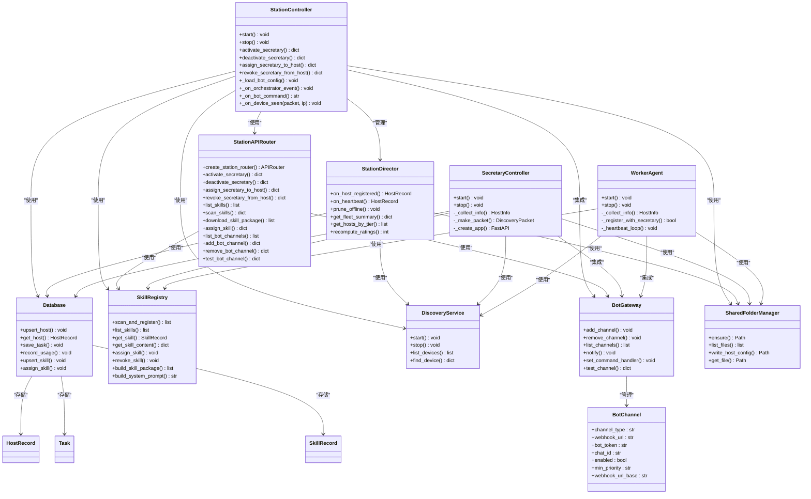

**图表来源**
- [lan_mesh/station_controller.py:69-555](file://lan_mesh/station_controller.py#L69-L555)
- [lan_mesh/station_director.py:28-232](file://lan_mesh/station_director.py#L28-L232)
- [lan_mesh/station_api.py:42-757](file://lan_mesh/station_api.py#L42-L757)
- [lan_mesh/bot_gateway.py:65-354](file://lan_mesh/bot_gateway.py#L65-L354)
- [lan_mesh/skill_registry.py:43-388](file://lan_mesh/skill_registry.py#L43-L388)
- [lan_mesh/secretary.py:69-342](file://lan_mesh/secretary.py#L69-L342)
- [lan_mesh/worker.py:62-325](file://lan_mesh/worker.py#L62-L325)

**章节来源**
- [lan_mesh/station_controller.py:69-555](file://lan_mesh/station_controller.py#L69-L555)
- [lan_mesh/station_director.py:28-232](file://lan_mesh/station_director.py#L28-L232)
- [lan_mesh/station_api.py:42-757](file://lan_mesh/station_api.py#L42-L757)
- [lan_mesh/bot_gateway.py:65-354](file://lan_mesh/bot_gateway.py#L65-L354)
- [lan_mesh/skill_registry.py:43-388](file://lan_mesh/skill_registry.py#L43-L388)
- [lan_mesh/secretary.py:69-342](file://lan_mesh/secretary.py#L69-L342)
- [lan_mesh/worker.py:62-325](file://lan_mesh/worker.py#L62-L325)

## 架构概览

系统采用三层架构设计，实现了清晰的职责分离：

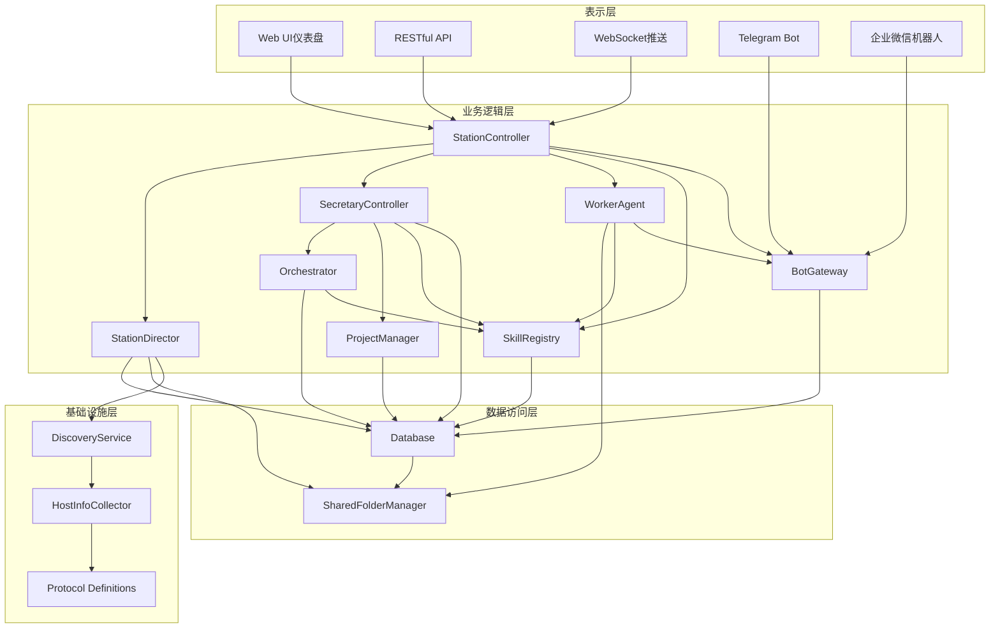

**图表来源**
- [lan_mesh/station_controller.py:265-398](file://lan_mesh/station_controller.py#L265-L398)
- [lan_mesh/station_director.py:28-232](file://lan_mesh/station_director.py#L28-L232)
- [lan_mesh/secretary.py:1-342](file://lan_mesh/secretary.py#L1-L342)
- [lan_mesh/worker.py:1-325](file://lan_mesh/worker.py#L1-L325)
- [lan_mesh/bot_gateway.py:78-354](file://lan_mesh/bot_gateway.py#L78-L354)
- [lan_mesh/skill_registry.py:43-388](file://lan_mesh/skill_registry.py#L43-L388)

### 通信流程

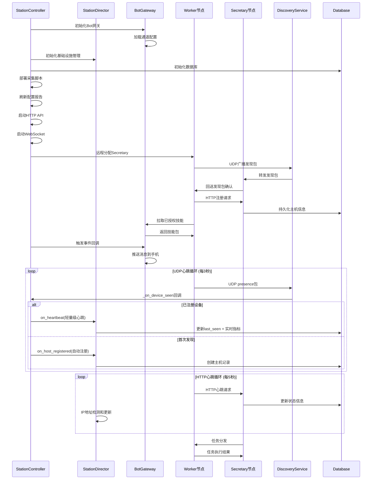

**图表来源**
- [lan_mesh/station_controller.py:312-398](file://lan_mesh/station_controller.py#L312-L398)
- [lan_mesh/station_director.py:40-104](file://lan_mesh/station_director.py#L40-L104)
- [lan_mesh/bot_gateway.py:150-184](file://lan_mesh/bot_gateway.py#L150-L184)
- [lan_mesh/worker.py:126-216](file://lan_mesh/worker.py#L126-L216)
- [lan_mesh/secretary.py:118-172](file://lan_mesh/secretary.py#L118-L172)
- [lan_mesh/discovery.py:147-214](file://lan_mesh/discovery.py#L147-L214)

## 详细组件分析

### Station Controller（工作站控制器）

Station Controller是新增的核心组件，作为Station Director的控制器，提供了完整的基础设施管理功能。

#### 核心职责
- **基础设施管理**：启动和管理Station Director实例
- **远程管理**：支持在远程主机上启动或停止Secretary
- **Web界面**：提供RESTful API和WebSocket实时推送
- **动态加载**：支持在运行时激活或停用Secretary组件
- **状态管理**：跟踪当前运行的Secretary主机
- **技能管理**：创建SkillRegistry实例并执行自动扫描
- **Bot集成**：初始化BotGateway并加载通道配置
- **事件回调**：设置Orchestrator事件回调处理函数
- **UDP心跳处理**：通过_on_device_seen方法将UDP包作为轻量级心跳处理

#### UDP心跳机制增强

**更新** Station Controller中的_on_device_seen方法得到了重要增强，现在将UDP包作为轻量级心跳处理：

- **轻量级心跳**：对于已注册设备，利用UDP presence包更新last_seen时间戳和实时指标
- **实时更新**：更新CPU、内存、磁盘使用率和IP地址等实时指标
- **防止误判离线**：避免Station节点间因缺少HTTP心跳而被错误标记为离线
- **多Station部署优化**：特别适用于多Station部署场景，提升系统稳定性

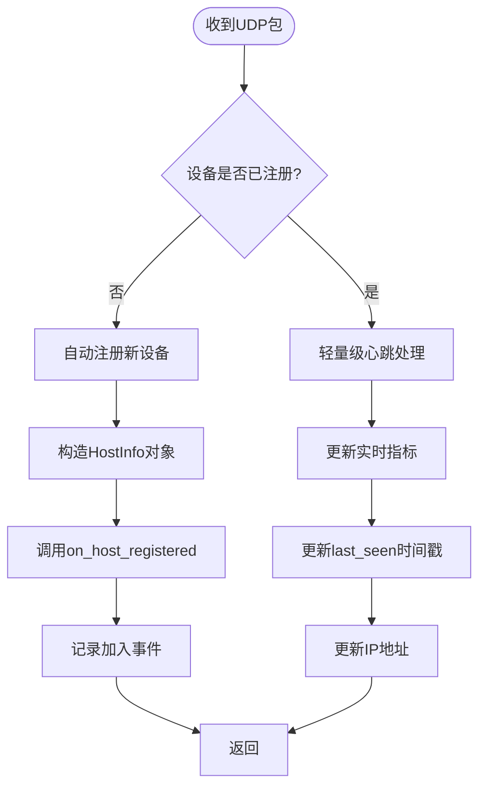

**图表来源**
- [lan_mesh/station_controller.py:297-350](file://lan_mesh/station_controller.py#L297-L350)

#### 生命周期管理

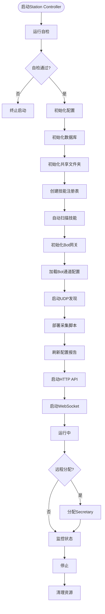

**图表来源**
- [lan_mesh/station_controller.py:312-398](file://lan_mesh/station_controller.py#L312-L398)
- [lan_mesh/station_controller.py:116-119](file://lan_mesh/station_controller.py#L116-L119)

**章节来源**
- [lan_mesh/station_controller.py:69-555](file://lan_mesh/station_controller.py#L69-L555)

### Bot Gateway（Bot网关系统）

**新增组件**：BotGateway是集成的移动通信系统，提供企业微信和Telegram的双向通信能力。

#### 核心职责
- **通道管理**：支持企业微信Webhook和Telegram Bot两种通道类型
- **消息推送**：根据事件类型和优先级向手机端推送消息
- **命令处理**：接收Telegram命令并执行相应的管理操作
- **配置管理**：支持动态添加、删除和测试Bot通道
- **事件回调**：接收来自系统其他组件的事件通知
- **优先级控制**：根据事件严重程度决定是否推送

#### 通道类型和配置

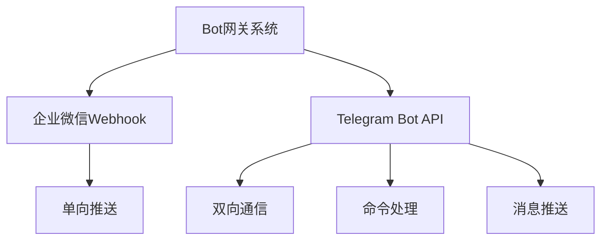

**图表来源**
- [lan_mesh/bot_gateway.py:78-354](file://lan_mesh/bot_gateway.py#L78-L354)

#### 事件推送机制

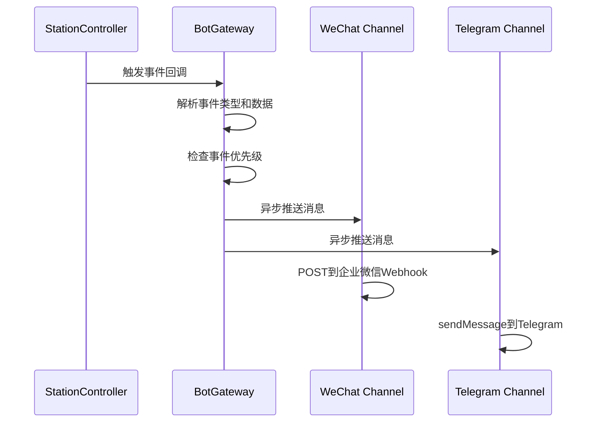

**图表来源**
- [lan_mesh/bot_gateway.py:150-184](file://lan_mesh/bot_gateway.py#L150-L184)

**章节来源**
- [lan_mesh/bot_gateway.py:65-354](file://lan_mesh/bot_gateway.py#L65-L354)

### Bot Channel（Bot通道配置）

BotChannel是单个Bot通道的配置对象，支持企业微信和Telegram两种通道类型。

#### 配置字段
- **channel_type**：通道类型（wechat_webhook | telegram）
- **webhook_url**：企业微信Webhook URL
- **bot_token**：Telegram Bot Token
- **chat_id**：Telegram Chat ID
- **enabled**：是否启用
- **min_priority**：最低推送优先级（low | normal | high）
- **webhook_url_base**：Telegram公网回调地址

#### 通道管理流程

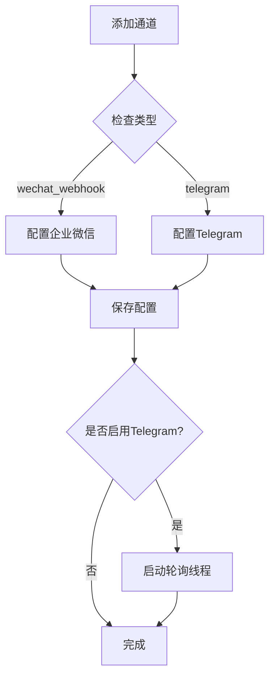

**图表来源**
- [lan_mesh/bot_gateway.py:101-139](file://lan_mesh/bot_gateway.py#L101-139)

**章节来源**
- [lan_mesh/bot_gateway.py:65-139](file://lan_mesh/bot_gateway.py#L65-L139)

### Station API Router（工作站API路由）

Station API Router是新增的独立API层，提供了完整的Station Director功能。

#### 核心功能
- **角色管理**：提供激活/停用Secretary的端点
- **主机管理**：提供主机注册、心跳和查询的端点
- **资源池查询**：提供按评级筛选主机的查询接口
- **远程管理**：支持在远程主机上启动或停止Secretary
- **实时推送**：通过WebSocket推送主机状态变更
- **技能管理API**：提供技能列表、扫描、下载、权限分配等端点
- **Bot管理API**：提供Bot通道配置、测试等功能

#### Bot管理API端点

```mermaid
flowchart TD
BotAPI[Bot管理API] --> ListChannels[GET /api/station/bot/channels]
BotAPI --> AddChannel[POST /api/station/bot/channels]
BotAPI --> RemoveChannel[DELETE /api/station/bot/channels/{channel_type}]
BotAPI --> TestChannel[POST /api/station/bot/test/{channel_type}]
```

**图表来源**
- [lan_mesh/station_api.py:694-727](file://lan_mesh/station_api.py#L694-L727)

**章节来源**
- [lan_mesh/station_api.py:42-757](file://lan_mesh/station_api.py#L42-L757)

### Station Director（工作站主管）

Station Director是新增的基础设施管理层，专门负责主机的注册、评级和资源池管理。

#### 核心职责
- **主机注册入站**：处理Worker的注册请求，进行评级和记录
- **心跳处理**：更新主机的实时指标和状态
- **离线检测**：清理超时离线的主机并记录事件
- **舰队管理**：维护主机列表、统计信息和事件历史
- **资源池查询**：按评级筛选在线主机供Secretary查询
- **技能管理**：通过SkillRegistry管理技能注册和权限分配
- **事件回调**：接收来自BotGateway的事件通知
- **IP地址检测**：增强on_host_registered和on_heartbeat事件处理器的IP地址检测逻辑

#### 评级管理机制

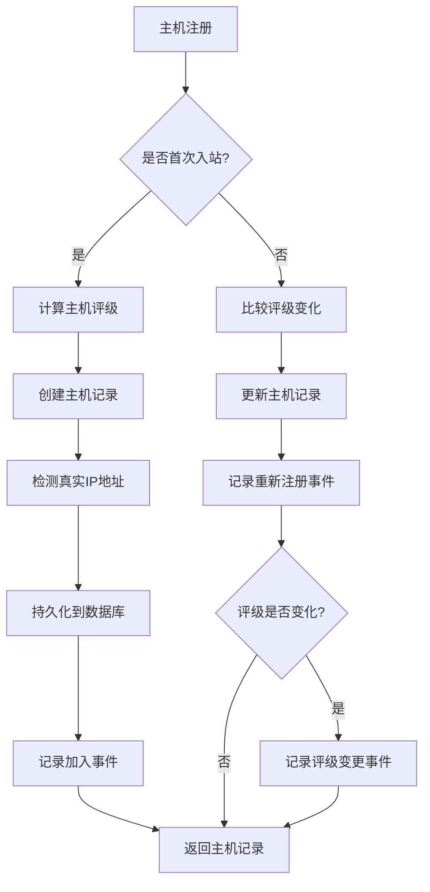

**图表来源**
- [lan_mesh/station_director.py:40-104](file://lan_mesh/station_director.py#L40-L104)

#### IP地址检测增强逻辑

**更新** on_host_registered和on_heartbeat事件处理器现在具备更强大的IP地址检测能力：

- **优先级检测**：首先从UDP发现服务获取设备的实时IP地址
- **回退机制**：如果UDP发现不可用，则使用Worker上报的IP地址
- **心跳更新**：在心跳处理中，优先使用UDP发现的最新IP地址
- **准确性保障**：确保主机记录中的IP地址始终是最新的真实地址

**章节来源**
- [lan_mesh/station_director.py:28-232](file://lan_mesh/station_director.py#L28-L232)

### Skill Registry（技能注册表）

**新增组件**：SkillRegistry是中央技能管理与分发系统，部署在Station Director端，提供完整的技能生命周期管理。

#### 核心职责
- **技能注册**：扫描skills/目录，解析SKILL.md的YAML front matter，自动注册新技能或更新已有技能元数据
- **权限管理**：分配技能给角色、Agent或主机，支持默认权限和直接分配
- **内容分发**：构建Worker拉取的技能包，支持按角色和Agent过滤
- **系统提示构建**：根据任务上下文和角色权限构建system prompt

#### 技能文件结构

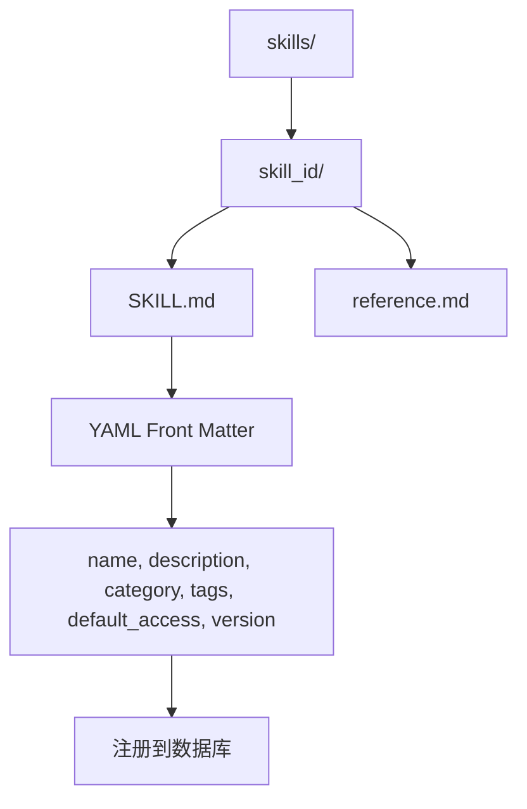

**图表来源**
- [lan_mesh/skill_registry.py:16-30](file://lan_mesh/skill_registry.py#L16-L30)

#### 自动扫描流程

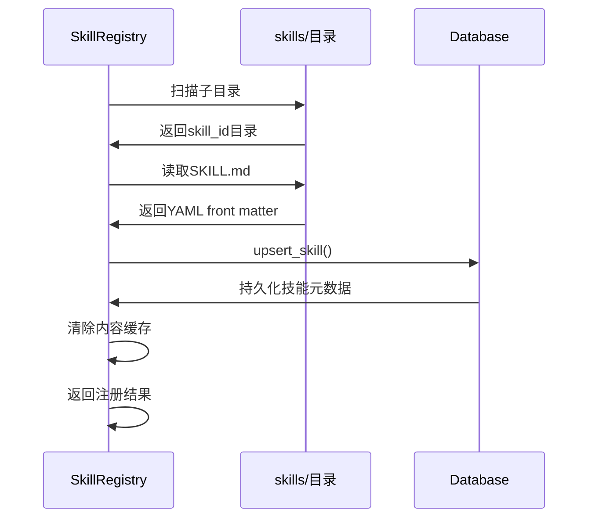

**图表来源**
- [lan_mesh/skill_registry.py:57-100](file://lan_mesh/skill_registry.py#L57-L100)

**章节来源**
- [lan_mesh/skill_registry.py:43-388](file://lan_mesh/skill_registry.py#L43-L388)

### Secretary控制器

Secretary控制器是传统的中央控制器，负责协调所有工作节点并提供管理界面。

#### 核心职责
- **设备发现管理**：启动UDP发现服务，维护设备列表
- **配置采集**：自动收集本机和工作节点的配置信息
- **数据库管理**：持久化主机信息和状态数据
- **Web界面**：提供RESTful API和WebSocket实时推送
- **任务编排**：协调复杂任务的分解和执行
- **项目管理**：实施预算控制和资源隔离
- **技能集成**：通过SkillRegistry提供技能知识库支持
- **事件回调**：接收Orchestrator事件并通过BotGateway推送

#### 生命周期管理

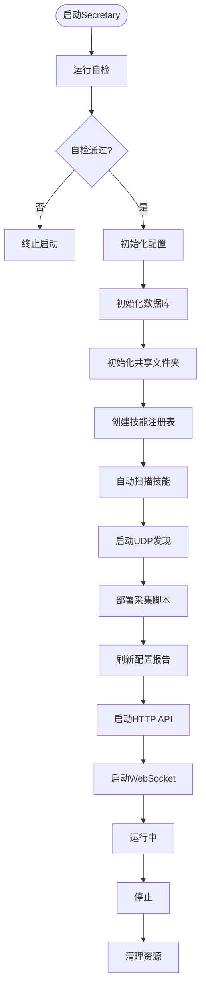

**图表来源**
- [lan_mesh/secretary.py:255-342](file://lan_mesh/secretary.py#L255-L342)

**章节来源**
- [lan_mesh/secretary.py:69-342](file://lan_mesh/secretary.py#L69-L342)

### Worker代理

Worker代理在各个工作节点上运行，负责本地资源管理和任务执行。

#### 核心功能
- **配置采集**：使用psutil收集CPU、内存、磁盘等系统信息
- **文件共享**：提供文件上传下载功能
- **设备发现**：主动寻找Secretary节点
- **注册管理**：向中央控制器注册并保持心跳
- **任务执行**：接收并执行分配的子任务
- **角色管理**：支持在本机启动或停止Secretary子进程
- **技能拉取**：从Station Director拉取已授权技能到本地缓存
- **Bot集成**：支持通过BotGateway接收任务分发和状态更新
- **IP地址上报**：在心跳请求中提供IP地址信息供Station Director检测

#### 心跳机制

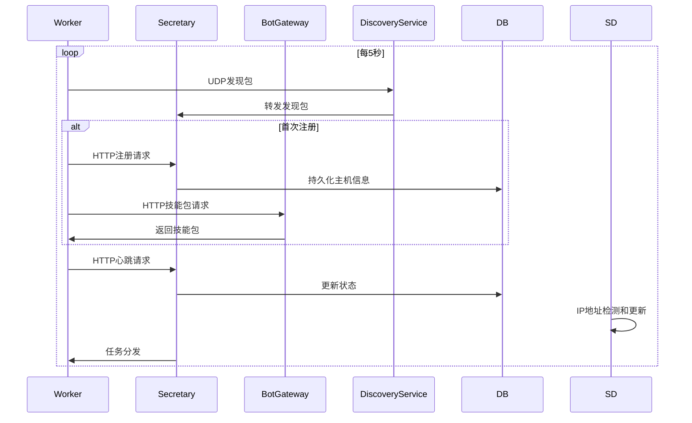

**图表来源**
- [lan_mesh/worker.py:203-216](file://lan_mesh/worker.py#L203-L216)
- [lan_mesh/secretary.py:143-172](file://lan_mesh/secretary.py#L143-L172)

**章节来源**
- [lan_mesh/worker.py:62-325](file://lan_mesh/worker.py#L62-L325)

### 设备发现服务

DiscoveryService实现了基于UDP广播的设备自动发现机制，是整个系统通信的基础。

#### 核心特性
- **广播机制**：定期向局域网广播设备存在信息
- **设备跟踪**：维护在线设备列表和状态
- **TTL管理**：自动清理超时离线设备
- **网络状态**：提供本地网络接口和广播目标信息
- **IP地址记录**：在设备发现过程中记录设备的真实IP地址

#### 发现流程

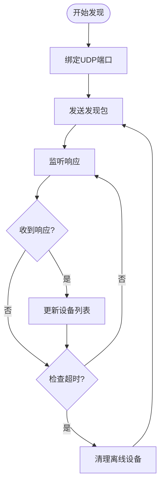

**图表来源**
- [lan_mesh/discovery.py:139-228](file://lan_mesh/discovery.py#L139-L228)

**章节来源**
- [lan_mesh/discovery.py:33-259](file://lan_mesh/discovery.py#L33-L259)

### 数据库管理

Database类提供了完整的数据持久化解决方案，支持多种实体类型的存储和查询。

#### 支持的数据模型
- **主机记录**：存储注册的设备信息和状态
- **心跳日志**：记录设备的性能指标历史
- **Agent卡片**：存储工作节点的能力声明
- **任务管理**：支持复杂任务的生命周期管理
- **项目管理**：实现多项目预算控制
- **使用记录**：跟踪模型调用的消费情况
- **技能管理**：支持技能注册表的CRUD操作
- **Bot通道**：支持Bot通道配置的存储和查询
- **主机事件**：包含主机IP地址变更事件

#### 数据库设计

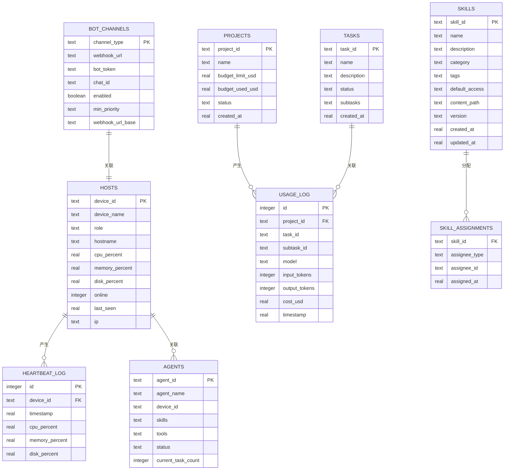

**图表来源**
- [lan_mesh/database.py:36-164](file://lan_mesh/database.py#L36-L164)
- [lan_mesh/database.py:717-835](file://lan_mesh/database.py#L717-L835)

**章节来源**
- [lan_mesh/database.py:16-835](file://lan_mesh/database.py#L16-L835)

### 任务编排引擎

Orchestrator实现了类似LangGraph Supervisor模式的任务编排系统，能够智能地分解复杂任务并分配给合适的Agent执行。

#### 任务分解策略
- **规则驱动**：基于任务描述关键词的预设模板
- **LLM增强**：未来可扩展为基于语言模型的智能分解
- **依赖管理**：构建子任务的DAG依赖关系图
- **技能集成**：通过SkillRegistry提供技能知识库支持

#### Agent匹配算法


**图表来源**
- [lan_mesh/orchestrator.py:58-287](file://lan_mesh/orchestrator.py#L58-L287)

**章节来源**
- [lan_mesh/orchestrator.py:58-287](file://lan_mesh/orchestrator.py#L58-L287)

### 项目管理

ProjectManager实现了多项目的预算控制和资源隔离功能，确保不同项目之间的独立性和安全性.

#### 预算控制机制
- **预算监控**：实时跟踪项目消费情况
- **自动暂停**：超支时自动暂停项目
- **模型切换**：预算紧张时自动切换经济模型
- **白名单控制**：限制可用的AI模型

#### 成本计算

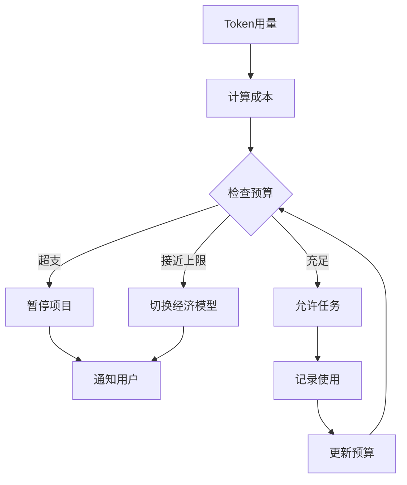

**图表来源**
- [lan_mesh/project.py:62-320](file://lan_mesh/project.py#L62-L320)

**章节来源**
- [lan_mesh/project.py:62-320](file://lan_mesh/project.py#L62-L320)

### 角色样式系统

**新增功能**：系统现已支持三种角色的差异化样式展示，包括CSS样式定义和JavaScript角色标识。

#### CSS样式定义

系统在dashboard.html中定义了三种角色的CSS样式：

- **Secretary样式**：蓝色主题，背景色为rgba(91,140,255,.15)，颜色为var(--accent)
- **Station样式**：紫色主题，背景色为rgba(168,85,247,.15)，颜色为#a855f7  
- **Worker样式**：绿色主题，背景色为rgba(74,222,128,.1)，颜色为var(--green)

#### JavaScript角色标识

在主机列表和详情展示中，系统通过JavaScript对三种角色进行差异化处理：

- **主机卡片边框**：Secretary使用蓝色(#5b8cff)，Station使用紫色(#a855f7)，Worker使用绿色(var(--green))
- **角色徽章**：Secretary使用蓝色徽章，Station使用紫色徽章，Worker使用绿色徽章
- **角色标签**：在表格中显示"主节点"、"Station"、"Worker"等标签

#### 主机详情展示

在主机详情模态框中，系统会根据角色显示不同的样式和标签：

- **角色标识**：显示"Secretary"、"Station"、"Worker"等角色名称
- **样式应用**：根据角色类型应用相应的CSS样式
- **功能区分**：不同角色具有不同的操作权限和功能

**章节来源**
- [lan_mesh/web/templates/dashboard.html:40-60](file://lan_mesh/web/templates/dashboard.html#L40-L60)
- [lan_mesh/web/templates/dashboard.html:940-970](file://lan_mesh/web/templates/dashboard.html#L940-L970)
- [lan_mesh/web/templates/dashboard.html:570-590](file://lan_mesh/web/templates/dashboard.html#L570-L590)

## 依赖关系分析

系统采用了清晰的模块化设计，各组件之间的依赖关系如下：

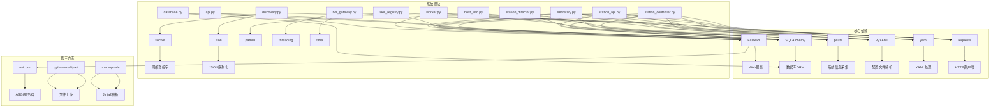

**图表来源**
- [requirements.txt:1-8](file://requirements.txt#L1-L8)
- [lan_mesh/station_controller.py:35-48](file://lan_mesh/station_controller.py#L35-L48)
- [lan_mesh/station_director.py:20-25](file://lan_mesh/station_director.py#L20-L25)
- [lan_mesh/secretary.py:27-47](file://lan_mesh/secretary.py#L27-L47)
- [lan_mesh/worker.py:24-44](file://lan_mesh/worker.py#L24-L44)
- [lan_mesh/bot_gateway.py:24-31](file://lan_mesh/bot_gateway.py#L24-L31)
- [lan_mesh/skill_registry.py:32-40](file://lan_mesh/skill_registry.py#L32-L40)

### 外部依赖

系统对外部依赖的管理遵循以下原则：
- **版本锁定**：明确指定依赖库的最低版本要求
- **功能分离**：每个依赖库服务于特定的功能领域
- **兼容性保证**：确保各组件间的API兼容性

**章节来源**
- [requirements.txt:1-8](file://requirements.txt#L1-L8)

## 性能考虑

### 系统性能优化

1. **并发处理**
   - 使用多线程处理UDP发现、心跳和配置刷新
   - 异步WebSocket推送减少阻塞
   - 线程安全的数据库连接池
   - **新增Bot异步推送**：BotGateway使用守护线程异步发送消息，避免阻塞主流程
   - **更新IP地址检测**：增强on_host_registered和on_heartbeat事件处理器的IP地址检测，减少不必要的网络查询
   - **UDP心跳优化**：_on_device_seen方法使用轻量级心跳处理，避免重复的HTTP请求

2. **网络优化**
   - UDP广播采用多目标地址提高可达性
   - 心跳间隔合理设置避免网络拥塞
   - 连接超时和重试机制提升稳定性
   - **新增Bot长轮询**：Telegram使用长轮询机制，减少无效请求
   - **更新IP地址检测**：优化UDP发现服务的IP地址缓存机制，避免重复查询
   - **UDP心跳机制**：通过UDP presence包每3秒更新设备状态，减少HTTP心跳开销

3. **内存管理**
   - 数据库连接按需创建和销毁
   - 缓存常用配置和设备信息
   - 及时清理过期的发现记录
   - **新增技能缓存**：SkillRegistry使用内容缓存减少重复读取
   - **新增Bot通道缓存**：BotGateway缓存通道配置和消息模板
   - **更新IP地址检测**：优化主机IP地址的缓存和更新机制

4. **动态加载优化**
   - Secretary组件按需加载，减少内存占用
   - 远程管理通过HTTP调用，避免进程间通信开销
   - 状态缓存减少数据库查询频率
   - **新增Bot配置优化**：自动扫描仅在启动时执行，后续通过手动触发
   - **新增事件回调优化**：使用轻量级回调机制，避免阻塞主流程
   - **更新IP地址检测**：优化事件处理器的锁机制，减少并发竞争

### 扩展性设计

系统支持水平扩展：
- **负载均衡**：多个Secretary节点可实现高可用
- **分布式存储**：数据库可迁移到集群环境
- **微服务化**：核心功能可拆分为独立服务
- **远程管理**：支持跨网络的Secretary分配
- **技能扩展**：支持动态添加新的技能文件
- **Bot扩展**：支持添加新的Bot通道类型
- **事件扩展**：支持自定义事件类型和消息模板
- **IP地址检测扩展**：支持更多IP地址检测源和策略
- **UDP心跳扩展**：支持更多设备类型的心跳处理策略

## 故障排除指南

### 常见问题诊断

#### 网络连接问题
- **症状**：Worker无法发现Secretary
- **排查步骤**：
  1. 检查UDP端口45454是否被占用
  2. 验证防火墙设置允许UDP广播
  3. 确认两台主机在同一局域网
  4. 使用`ping`测试网络连通性

#### 端口冲突问题
- **症状**：服务启动失败或端口被占用
- **解决方法**：
  1. 检查配置文件中的端口号
  2. 使用系统工具查找占用进程
  3. 修改配置文件中的端口号
  4. 重启相关服务

#### 数据库问题
- **症状**：数据持久化失败或查询异常
- **处理方案**：
  1. 检查数据库文件权限
  2. 验证SQLite版本兼容性
  3. 清理损坏的数据库文件
  4. 重建数据库结构

#### 远程管理问题
- **症状**：无法在远程主机上启动Secretary
- **排查步骤**：
  1. 检查远程主机的网络连通性
  2. 验证Worker的HTTP API是否正常
  3. 确认远程主机上有足够的系统资源
  4. 检查远程主机的防火墙设置

#### Bot通信问题
- **症状**：Bot消息无法发送或命令无法接收
- **排查步骤**：
  1. 检查Bot通道配置是否正确
  2. 验证企业微信Webhook URL或Telegram Token有效性
  3. 确认网络连通性和防火墙设置
  4. 检查Bot Gateway的日志输出
  5. 验证事件优先级设置是否正确

#### 技能管理问题
- **症状**：技能无法正确注册或权限分配失败
- **排查步骤**：
  1. 检查skills/目录结构是否正确
  2. 验证SKILL.md文件的YAML front matter格式
  3. 确认数据库中技能表结构完整
  4. 检查技能权限分配记录

#### IP地址检测问题
- **症状**：主机IP地址显示不正确或频繁变化
- **排查步骤**：
  1. 检查UDP发现服务是否正常运行
  2. 验证Worker的网络配置和防火墙设置
  3. 确认主机是否位于正确的子网中
  4. 检查Station Director的日志中是否有IP地址检测相关的错误信息
  5. 验证Worker上报的IP地址是否正确

#### UDP心跳问题
- **症状**：Station节点间互相误判离线或心跳延迟
- **排查步骤**：
  1. 检查UDP端口45454是否正常工作
  2. 验证防火墙是否允许UDP广播通信
  3. 确认_on_device_seen方法是否正确处理UDP包
  4. 检查Station Director的日志中是否有UDP心跳相关的错误信息
  5. 验证多Station部署场景下的网络拓扑
  6. 检查DEVICE_TTL_SECS配置是否合理

#### 角色样式问题
- **症状**：主机角色显示样式不正确
- **排查步骤**：
  1. 检查CSS样式定义是否正确加载
  2. 验证JavaScript角色标识逻辑
  3. 确认主机记录中的role字段值正确
  4. 检查浏览器控制台是否有JavaScript错误
  5. 验证dashboard.html中的样式定义

### 日志分析

系统提供了详细的日志输出：
- **启动日志**：显示系统配置和启动参数
- **运行时日志**：记录设备发现和状态变化
- **错误日志**：捕获异常和错误信息
- **调试日志**：提供详细的内部状态信息
- **远程管理日志**：记录Secretary分配和撤销操作
- **技能管理日志**：记录技能扫描、注册和权限分配过程
- **Bot通信日志**：记录Bot消息发送、接收和命令处理过程
- **事件推送日志**：记录各种事件的推送状态和结果
- **IP地址检测日志**：记录主机IP地址检测和更新过程
- **UDP心跳日志**：记录UDP发现包处理和心跳更新过程
- **角色样式日志**：记录角色样式应用和渲染过程

**章节来源**
- [lan_mesh/station_controller.py:399-555](file://lan_mesh/station_controller.py#L399-L555)
- [lan_mesh/secretary.py:337-342](file://lan_mesh/secretary.py#L337-L342)
- [lan_mesh/worker.py:320-325](file://lan_mesh/worker.py#L320-L325)
- [lan_mesh/bot_gateway.py:192-242](file://lan_mesh/bot_gateway.py#L192-L242)

## 结论

工作站管理模块是一个功能完整、架构清晰的分布式系统。通过新增的Bot Gateway系统，系统实现了与手机端的双向通信能力，大大提升了系统的可操作性和实用性。**新增的事件回调机制**进一步增强了系统的自动化水平，能够及时将重要事件推送到手机端。

**更新** 主机角色识别系统已从传统的二元系统扩展为三角色系统（station/secretary/worker），实现了更精细的角色管理和界面展示。新增的角色样式支持包括CSS样式定义和JavaScript角色标识，为三种角色提供了差异化的视觉呈现，显著提升了系统的用户体验。

**更新** IP地址检测和报告系统的改进是本次更新的重要成果。通过增强on_host_registered和on_heartbeat事件处理器的IP地址检测逻辑，系统现在能够更准确地获取和维护主机的真实IP地址信息。这一改进解决了跨网络环境下主机IP地址识别不准确的问题，为远程管理和监控提供了可靠的基础，显著提升了系统的实用性和用户体验。

**更新** Station控制器中的UDP发现心跳机制增强是本次更新的另一个重要成果。_on_device_seen方法现在将UDP包作为轻量级心跳处理，为已注册设备更新last_seen时间戳和实时指标（CPU、内存、磁盘使用率、IP地址），有效防止Station节点间因缺少HTTP心跳而被错误标记为离线。此改进特别适用于多Station部署场景，显著提升了系统的稳定性和可靠性。

主要优势包括：

1. **三角色架构**：Station Director、Secretary和Worker三者职责分明，支持更精细的角色管理
2. **功能全面**：涵盖设备发现、配置管理、任务编排等核心功能
3. **扩展性强**：模块化设计支持功能扩展和性能优化
4. **易用性好**：提供Web界面和RESTful API双重交互方式，支持三种角色的差异化展示
5. **远程管理能力**：支持跨网络的Secretary分配和管理
6. **实时监控**：提供WebSocket推送和仪表盘监控
7. **动态加载**：支持运行时激活或停用Secretary组件
8. **技能管理**：通过SkillRegistry实现中央技能注册表管理，支持自动扫描、权限分配和内容分发
9. **移动通信**：Bot Gateway提供企业微信和Telegram双向通信通道
10. **事件推送**：自动推送任务状态、主机状态等重要事件到手机端
11. **命令交互**：支持通过Telegram机器人发送命令查询状态和执行操作
12. **IP地址检测**：增强的IP地址检测和报告系统，确保主机IP信息的准确性
13. **角色样式系统**：新增的三种角色样式支持，提供差异化的视觉呈现
14. **UDP心跳机制**：增强的UDP发现心跳机制，防止Station节点间误判离线，提升多Station部署的稳定性

该系统适用于需要集中管理多台主机的场景，如开发环境、测试集群或小型生产环境。通过合理的配置和部署，可以有效提升运维效率和资源利用率。新增的Bot Gateway系统特别适合需要移动化管理的场景，而事件推送和命令交互功能则为系统的智能化应用提供了强有力的支持。

**更新** 新的架构设计使得系统更加模块化和可扩展，为未来的功能增强和性能优化奠定了良好的基础。**新增的Bot Gateway系统**为系统的移动化和智能化应用提供了重要的基础设施，通过标准化的事件推送和命令处理机制，实现了与手机端的无缝集成。**更新的IP地址检测系统**进一步提升了系统的可靠性和实用性，为跨网络环境下的主机管理提供了坚实的技术支撑。**新增的角色样式系统**则为用户提供了更直观、更友好的操作体验，使系统管理变得更加高效和便捷。**更新的UDP心跳机制**为多Station部署场景提供了可靠的设备状态管理，确保了系统的稳定性和一致性。