# 工作站管理模块

<cite>
**本文档引用的文件**
- [main.py](file://main.py)
- [config.yaml](file://config.yaml)
- [lan_mesh/__init__.py](file://lan_mesh/__init__.py)
- [requirements.txt](file://requirements.txt)
- [lan_mesh/secretary.py](file://lan_mesh/secretary.py)
- [lan_mesh/worker.py](file://lan_mesh/worker.py)
- [lan_mesh/config.py](file://lan_mesh/config.py)
- [lan_mesh/api.py](file://lan_mesh/api.py)
- [lan_mesh/discovery.py](file://lan_mesh/discovery.py)
- [lan_mesh/host_info.py](file://lan_mesh/host_info.py)
- [lan_mesh/shared_folder.py](file://lan_mesh/shared_folder.py)
- [lan_mesh/database.py](file://lan_mesh/database.py)
- [lan_mesh/protocol.py](file://lan_mesh/protocol.py)
- [lan_mesh/orchestrator.py](file://lan_mesh/orchestrator.py)
- [lan_mesh/station_director.py](file://lan_mesh/station_director.py)
- [lan_mesh/station_controller.py](file://lan_mesh/station_controller.py)
- [lan_mesh/station_api.py](file://lan_mesh/station_api.py)
- [lan_mesh/project.py](file://lan_mesh/project.py)
- [lan_mesh/web/templates/dashboard.html](file://lan_mesh/web/templates/dashboard.html)
</cite>

## 更新摘要
**变更内容**
- 新增Station Director架构和独立的基础设施管理层
- 新增独立的Station API层和Station Controller
- 新增远程Secretary分配和管理功能
- 新增全新的启动模式和命令行参数支持
- 更新架构概览以反映新的分层设计
- 新增Web UI仪表盘和实时监控功能

## 目录
1. [简介](#简介)
2. [项目结构](#项目结构)
3. [核心组件](#核心组件)
4. [架构概览](#架构概览)
5. [详细组件分析](#详细组件分析)
6. [依赖关系分析](#依赖关系分析)
7. [性能考虑](#性能考虑)
8. [故障排除指南](#故障排除指南)
9. [结论](#结论)

## 简介

工作站管理模块是一个基于Python开发的分布式主机管理系统，采用Secretary-Worker架构实现跨主机的统一管理。该系统提供了完整的设备发现、配置采集、资源共享、任务编排和项目管理功能。

**更新** 新增了Station Director架构，实现了更灵活的基础设施管理层，支持独立的Station模式和远程Secretary分配功能。

系统的核心特点包括：
- **分布式架构**：Secretary作为中央控制器，Worker作为分布式节点
- **自动发现**：基于UDP广播的局域网设备自动发现机制
- **配置管理**：自动采集和管理主机配置信息
- **资源共享**：基于共享文件夹的文件传输和同步
- **任务编排**：智能的任务分解和Agent匹配调度
- **项目隔离**：多项目预算控制和资源隔离
- **基础设施管理**：独立的Station Director提供主机评级和资源池管理
- **远程管理**：支持在远程主机上启动或停止Secretary角色
- **Web界面**：提供直观的仪表盘和实时监控

## 项目结构

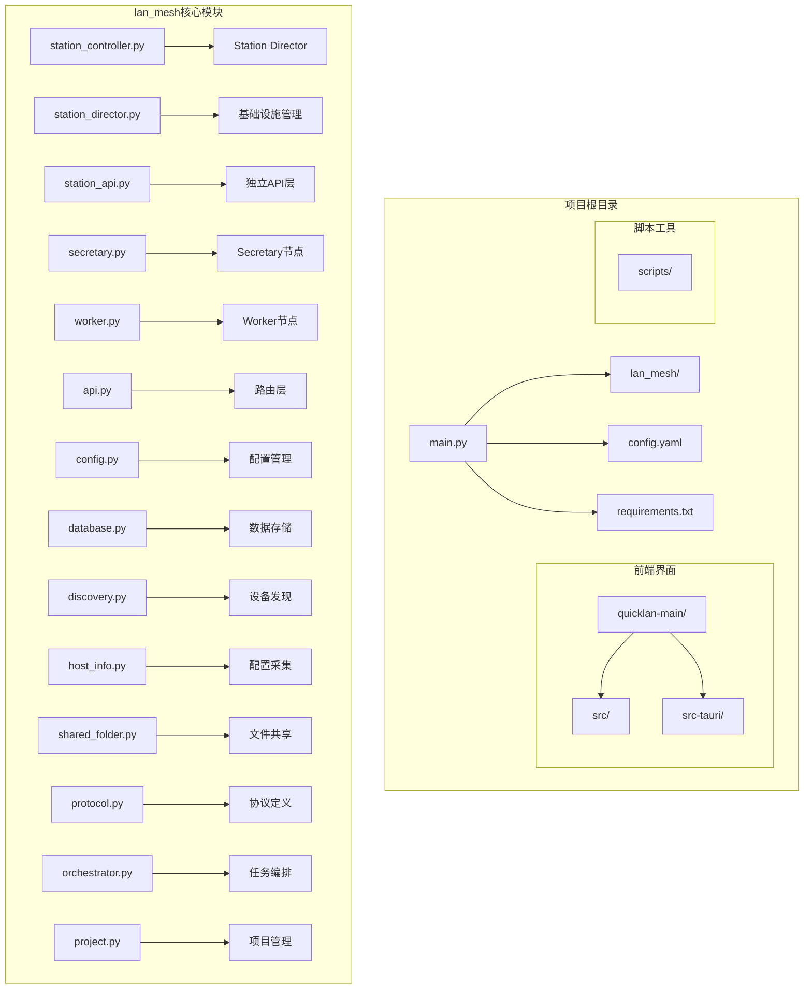

**图表来源**
- [main.py:1-98](file://main.py#L1-L98)
- [lan_mesh/station_controller.py:1-404](file://lan_mesh/station_controller.py#L1-L404)
- [lan_mesh/station_director.py:1-224](file://lan_mesh/station_director.py#L1-L224)
- [lan_mesh/station_api.py:1-650](file://lan_mesh/station_api.py#L1-L650)

**章节来源**
- [main.py:1-98](file://main.py#L1-L98)
- [config.yaml:1-22](file://config.yaml#L1-L22)
- [requirements.txt:1-8](file://requirements.txt#L1-L8)

## 核心组件

### 主要角色

系统采用三角色架构：

**Station Director（工作站主管）**
- 独立的基础设施管理层
- 负责主机注册入站、评级和资源池管理
- 提供Web UI仪表盘和实时监控
- 支持远程Secretary分配和管理
- 实现主机舰队管理和事件记录

**Secretary（中央控制器）**
- 负责设备发现和注册管理
- 维护主机信息数据库
- 提供Web UI仪表盘
- 管理任务编排和项目预算
- 实现主机评级和资源池管理

**Worker（工作节点）**
- 自动采集本机配置信息
- 暴露HTTP API供中央控制
- 通过UDP广播发现Secretary
- 发送心跳保持连接
- 执行分配的任务

### 核心功能模块

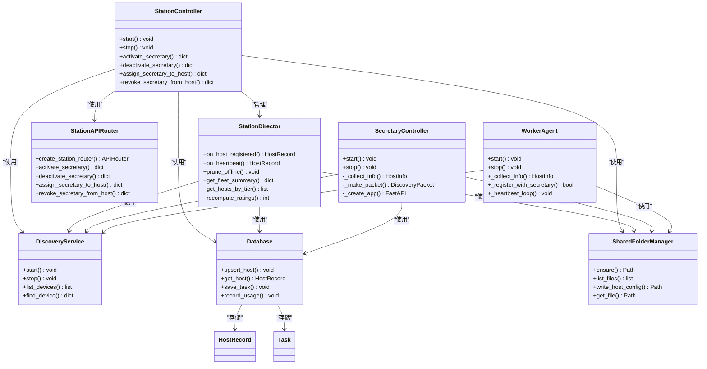

**图表来源**
- [lan_mesh/station_controller.py:69-404](file://lan_mesh/station_controller.py#L69-L404)
- [lan_mesh/station_director.py:28-224](file://lan_mesh/station_director.py#L28-L224)
- [lan_mesh/station_api.py:42-650](file://lan_mesh/station_api.py#L42-L650)
- [lan_mesh/secretary.py:69-342](file://lan_mesh/secretary.py#L69-L342)
- [lan_mesh/worker.py:62-325](file://lan_mesh/worker.py#L62-L325)

**章节来源**
- [lan_mesh/station_controller.py:69-404](file://lan_mesh/station_controller.py#L69-L404)
- [lan_mesh/station_director.py:28-224](file://lan_mesh/station_director.py#L28-L224)
- [lan_mesh/station_api.py:42-650](file://lan_mesh/station_api.py#L42-L650)
- [lan_mesh/secretary.py:69-342](file://lan_mesh/secretary.py#L69-L342)
- [lan_mesh/worker.py:62-325](file://lan_mesh/worker.py#L62-L325)

## 架构概览

系统采用三层架构设计，实现了清晰的职责分离：

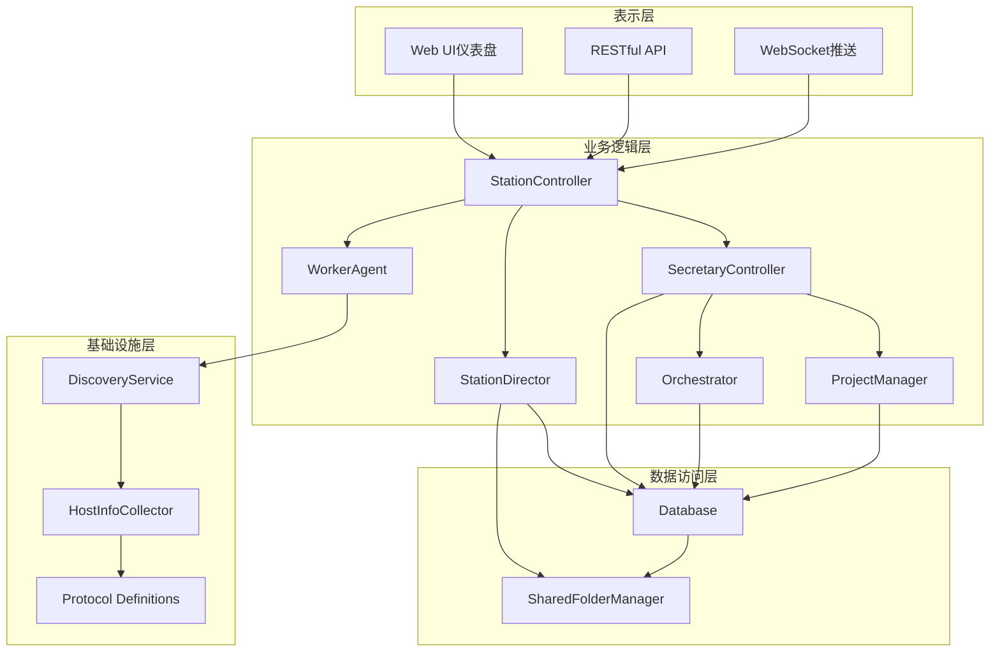

**图表来源**
- [lan_mesh/station_controller.py:265-298](file://lan_mesh/station_controller.py#L265-L298)
- [lan_mesh/station_director.py:28-224](file://lan_mesh/station_director.py#L28-L224)
- [lan_mesh/secretary.py:1-342](file://lan_mesh/secretary.py#L1-L342)
- [lan_mesh/worker.py:1-325](file://lan_mesh/worker.py#L1-L325)

### 通信流程

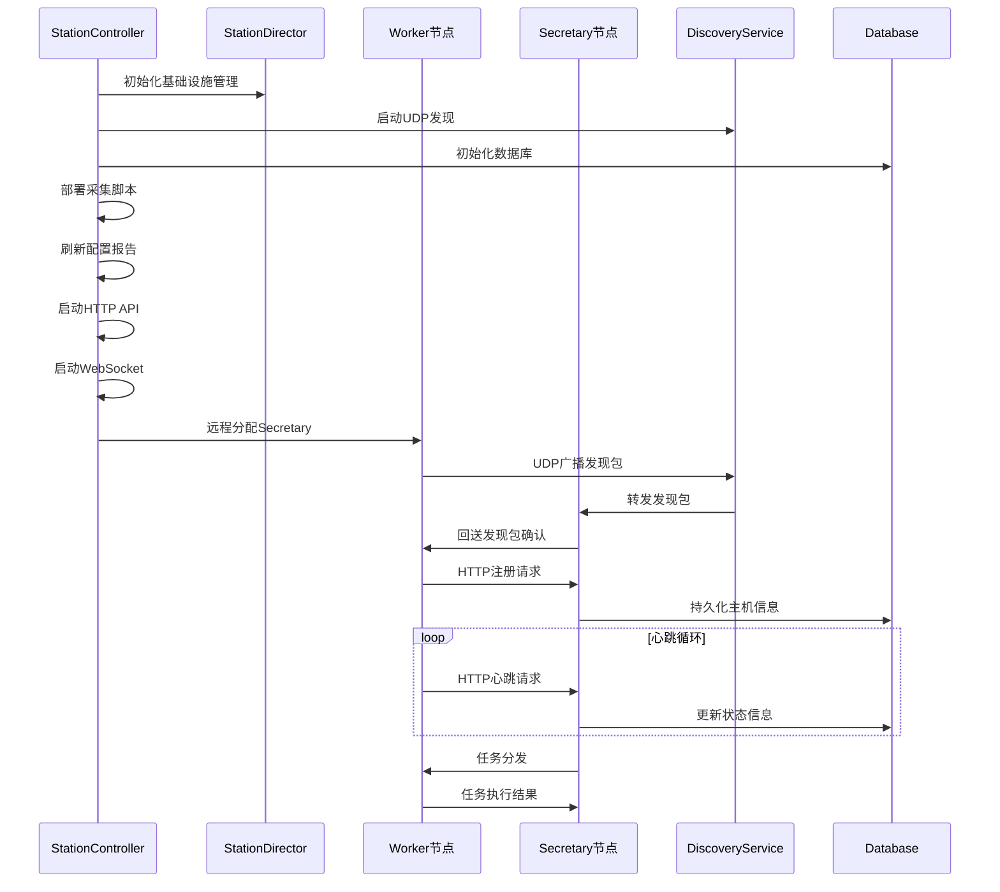

**图表来源**
- [lan_mesh/station_controller.py:312-398](file://lan_mesh/station_controller.py#L312-L398)
- [lan_mesh/station_director.py:40-104](file://lan_mesh/station_director.py#L40-L104)
- [lan_mesh/worker.py:126-216](file://lan_mesh/worker.py#L126-L216)
- [lan_mesh/secretary.py:118-172](file://lan_mesh/secretary.py#L118-L172)
- [lan_mesh/discovery.py:147-214](file://lan_mesh/discovery.py#L147-L214)

## 详细组件分析

### Station Controller（工作站控制器）

Station Controller是新增的核心组件，作为Station Director的控制器，提供了完整的基础设施管理功能。

#### 核心职责
- **基础设施管理**：启动和管理Station Director实例
- **远程管理**：支持在远程主机上启动或停止Secretary
- **Web界面**：提供RESTful API和WebSocket实时推送
- **动态加载**：支持在运行时激活或停用Secretary组件
- **状态管理**：跟踪当前运行的Secretary主机

#### 生命周期管理

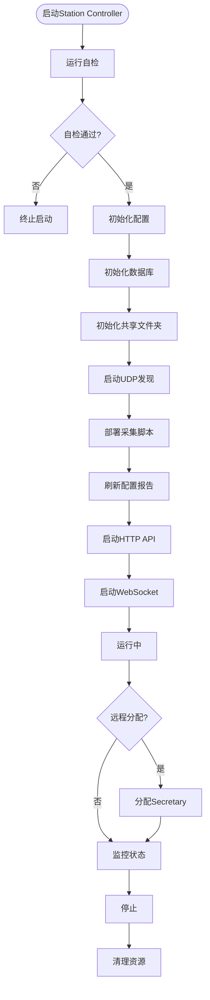

**图表来源**
- [lan_mesh/station_controller.py:312-398](file://lan_mesh/station_controller.py#L312-L398)

**章节来源**
- [lan_mesh/station_controller.py:69-404](file://lan_mesh/station_controller.py#L69-L404)

### Station Director（工作站主管）

Station Director是新增的基础设施管理层，专门负责主机的注册、评级和资源池管理。

#### 核心职责
- **主机注册入站**：处理Worker的注册请求，进行评级和记录
- **心跳处理**：更新主机的实时指标和状态
- **离线检测**：清理超时离线的主机并记录事件
- **舰队管理**：维护主机列表、统计信息和事件历史
- **资源池查询**：按评级筛选在线主机供Secretary查询

#### 评级管理机制

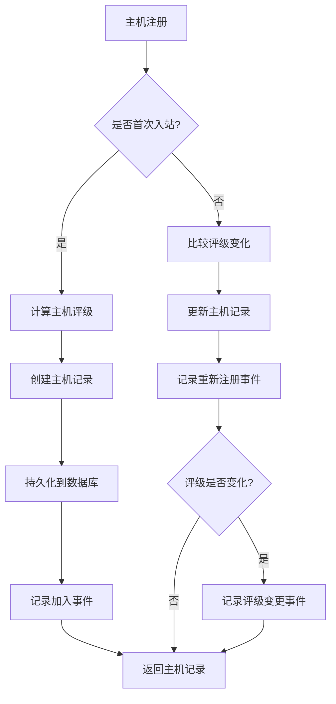

**图表来源**
- [lan_mesh/station_director.py:40-104](file://lan_mesh/station_director.py#L40-L104)

**章节来源**
- [lan_mesh/station_director.py:28-224](file://lan_mesh/station_director.py#L28-L224)

### Station API Router（工作站API路由）

Station API Router是新增的独立API层，提供了完整的Station Director功能。

#### 核心功能
- **角色管理**：提供激活/停用Secretary的端点
- **主机管理**：提供主机注册、心跳和查询的端点
- **资源池查询**：提供按评级筛选主机的查询接口
- **远程管理**：支持在远程主机上启动或停止Secretary
- **实时推送**：通过WebSocket推送主机状态变更

#### 远程Secretary分配流程

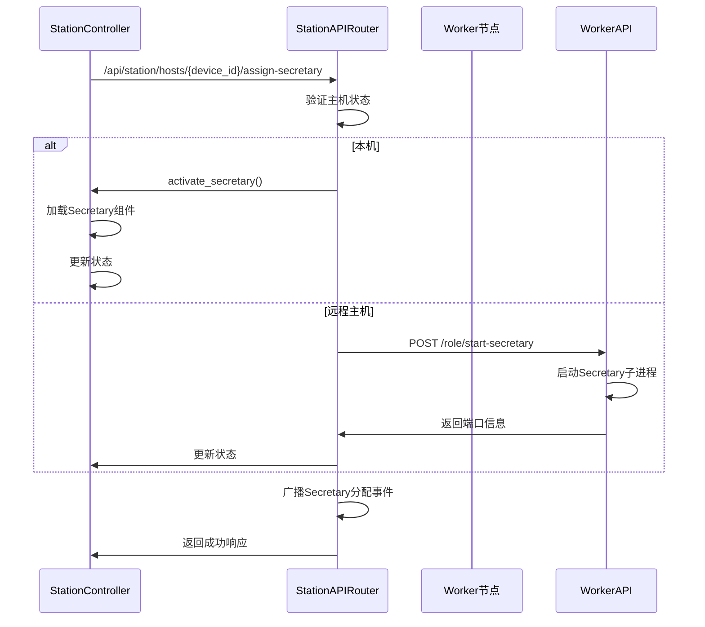

**图表来源**
- [lan_mesh/station_api.py:264-310](file://lan_mesh/station_api.py#L264-L310)

**章节来源**
- [lan_mesh/station_api.py:42-650](file://lan_mesh/station_api.py#L42-L650)

### Secretary控制器

Secretary控制器是传统的中央控制器，负责协调所有工作节点并提供管理界面。

#### 核心职责
- **设备发现管理**：启动UDP发现服务，维护设备列表
- **配置采集**：自动收集本机和工作节点的配置信息
- **数据库管理**：持久化主机信息和状态数据
- **Web界面**：提供RESTful API和WebSocket实时推送
- **任务编排**：协调复杂任务的分解和执行
- **项目管理**：实施预算控制和资源隔离

#### 生命周期管理

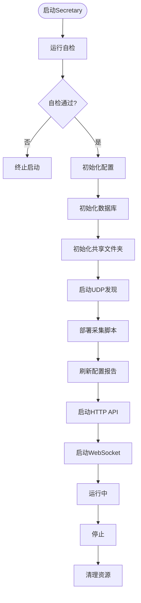

**图表来源**
- [lan_mesh/secretary.py:255-342](file://lan_mesh/secretary.py#L255-L342)

**章节来源**
- [lan_mesh/secretary.py:69-342](file://lan_mesh/secretary.py#L69-L342)

### Worker代理

Worker代理在各个工作节点上运行，负责本地资源管理和任务执行。

#### 核心功能
- **配置采集**：使用psutil收集CPU、内存、磁盘等系统信息
- **文件共享**：提供文件上传下载功能
- **设备发现**：主动寻找Secretary节点
- **注册管理**：向中央控制器注册并保持心跳
- **任务执行**：接收并执行分配的子任务
- **角色管理**：支持在本机启动或停止Secretary子进程

#### 心跳机制

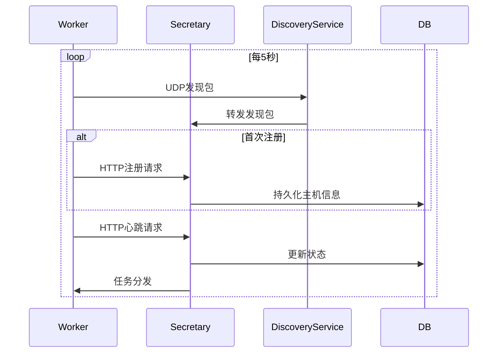

**图表来源**
- [lan_mesh/worker.py:203-216](file://lan_mesh/worker.py#L203-L216)
- [lan_mesh/secretary.py:143-172](file://lan_mesh/secretary.py#L143-L172)

**章节来源**
- [lan_mesh/worker.py:62-325](file://lan_mesh/worker.py#L62-L325)

### 设备发现服务

DiscoveryService实现了基于UDP广播的设备自动发现机制，是整个系统通信的基础。

#### 核心特性
- **广播机制**：定期向局域网广播设备存在信息
- **设备跟踪**：维护在线设备列表和状态
- **TTL管理**：自动清理超时离线设备
- **网络状态**：提供本地网络接口和广播目标信息

#### 发现流程

**图表来源**
- [lan_mesh/discovery.py:139-228](file://lan_mesh/discovery.py#L139-L228)

**章节来源**
- [lan_mesh/discovery.py:33-259](file://lan_mesh/discovery.py#L33-L259)

### 数据库管理

Database类提供了完整的数据持久化解决方案，支持多种实体类型的存储和查询。

#### 支持的数据模型
- **主机记录**：存储注册的设备信息和状态
- **心跳日志**：记录设备的性能指标历史
- **Agent卡片**：存储工作节点的能力声明
- **任务管理**：支持复杂任务的生命周期管理
- **项目管理**：实现多项目预算控制
- **使用记录**：跟踪模型调用的消费情况

#### 数据库设计

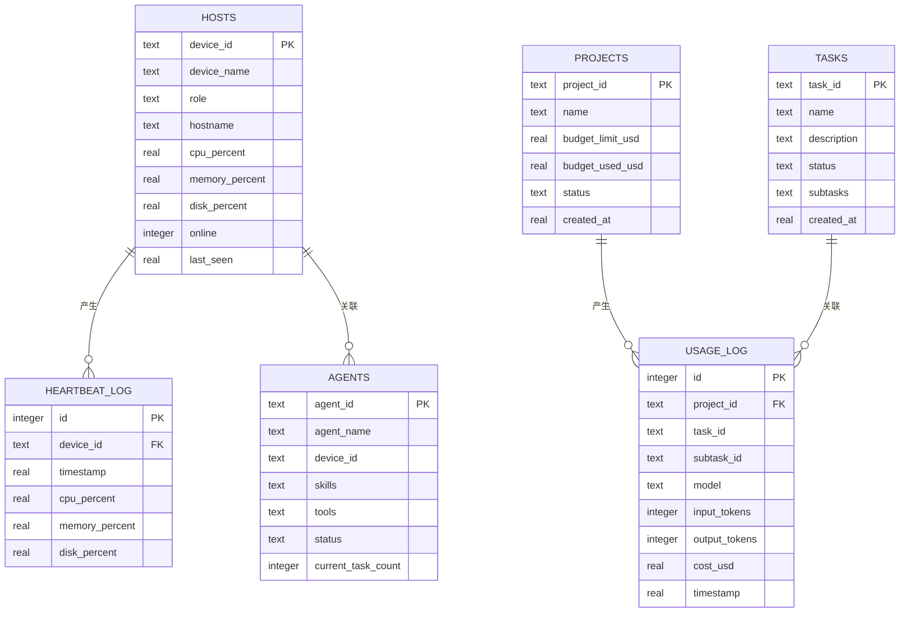

**图表来源**
- [lan_mesh/database.py:36-164](file://lan_mesh/database.py#L36-L164)

**章节来源**
- [lan_mesh/database.py:16-691](file://lan_mesh/database.py#L16-L691)

### 任务编排引擎

Orchestrator实现了类似LangGraph Supervisor模式的任务编排系统，能够智能地分解复杂任务并分配给合适的Agent执行。

#### 任务分解策略
- **规则驱动**：基于任务描述关键词的预设模板
- **LLM增强**：未来可扩展为基于语言模型的智能分解
- **依赖管理**：构建子任务的DAG依赖关系图

#### Agent匹配算法

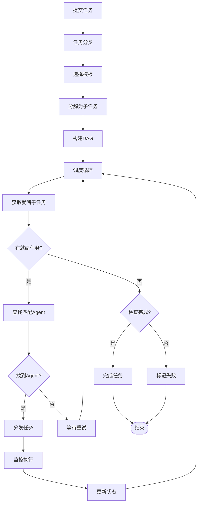

**图表来源**
- [lan_mesh/orchestrator.py:58-287](file://lan_mesh/orchestrator.py#L58-L287)

**章节来源**
- [lan_mesh/orchestrator.py:58-287](file://lan_mesh/orchestrator.py#L58-L287)

### 项目管理

ProjectManager实现了多项目的预算控制和资源隔离功能，确保不同项目之间的独立性和安全性。

#### 预算控制机制
- **预算监控**：实时跟踪项目消费情况
- **自动暂停**：超支时自动暂停项目
- **模型切换**：预算紧张时自动切换经济模型
- **白名单控制**：限制可用的AI模型

#### 成本计算

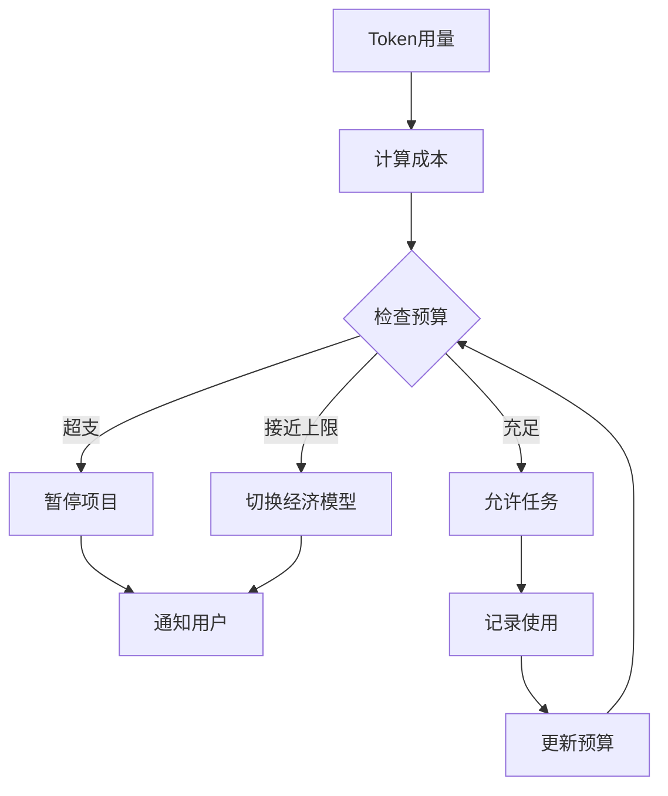

**图表来源**
- [lan_mesh/project.py:62-320](file://lan_mesh/project.py#L62-L320)

**章节来源**
- [lan_mesh/project.py:62-320](file://lan_mesh/project.py#L62-L320)

## 依赖关系分析

系统采用了清晰的模块化设计，各组件之间的依赖关系如下：

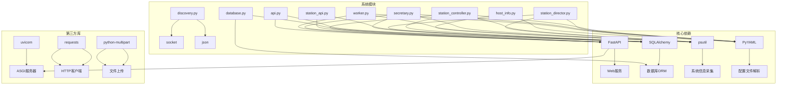

**图表来源**
- [requirements.txt:1-8](file://requirements.txt#L1-L8)
- [lan_mesh/station_controller.py:35-47](file://lan_mesh/station_controller.py#L35-L47)
- [lan_mesh/station_director.py:20-25](file://lan_mesh/station_director.py#L20-L25)
- [lan_mesh/secretary.py:27-47](file://lan_mesh/secretary.py#L27-L47)
- [lan_mesh/worker.py:24-44](file://lan_mesh/worker.py#L24-L44)

### 外部依赖

系统对外部依赖的管理遵循以下原则：
- **版本锁定**：明确指定依赖库的最低版本要求
- **功能分离**：每个依赖库服务于特定的功能领域
- **兼容性保证**：确保各组件间的API兼容性

**章节来源**
- [requirements.txt:1-8](file://requirements.txt#L1-L8)

## 性能考虑

### 系统性能优化

1. **并发处理**
   - 使用多线程处理UDP发现、心跳和配置刷新
   - 异步WebSocket推送减少阻塞
   - 线程安全的数据库连接池

2. **网络优化**
   - UDP广播采用多目标地址提高可达性
   - 心跳间隔合理设置避免网络拥塞
   - 连接超时和重试机制提升稳定性

3. **内存管理**
   - 数据库连接按需创建和销毁
   - 缓存常用配置和设备信息
   - 及时清理过期的发现记录

4. **动态加载优化**
   - Secretary组件按需加载，减少内存占用
   - 远程管理通过HTTP调用，避免进程间通信开销
   - 状态缓存减少数据库查询频率

### 扩展性设计

系统支持水平扩展：
- **负载均衡**：多个Secretary节点可实现高可用
- **分布式存储**：数据库可迁移到集群环境
- **微服务化**：核心功能可拆分为独立服务
- **远程管理**：支持跨网络的Secretary分配

## 故障排除指南

### 常见问题诊断

#### 网络连接问题
- **症状**：Worker无法发现Secretary
- **排查步骤**：
  1. 检查UDP端口45454是否被占用
  2. 验证防火墙设置允许UDP广播
  3. 确认两台主机在同一局域网
  4. 使用`ping`测试网络连通性

#### 端口冲突问题
- **症状**：服务启动失败或端口被占用
- **解决方法**：
  1. 检查配置文件中的端口号
  2. 使用系统工具查找占用进程
  3. 修改配置文件中的端口号
  4. 重启相关服务

#### 数据库问题
- **症状**：数据持久化失败或查询异常
- **处理方案**：
  1. 检查数据库文件权限
  2. 验证SQLite版本兼容性
  3. 清理损坏的数据库文件
  4. 重建数据库结构

#### 远程管理问题
- **症状**：无法在远程主机上启动Secretary
- **排查步骤**：
  1. 检查远程主机的网络连通性
  2. 验证Worker的HTTP API是否正常
  3. 确认远程主机上有足够的系统资源
  4. 检查远程主机的防火墙设置

### 日志分析

系统提供了详细的日志输出：
- **启动日志**：显示系统配置和启动参数
- **运行时日志**：记录设备发现和状态变化
- **错误日志**：捕获异常和错误信息
- **调试日志**：提供详细的内部状态信息
- **远程管理日志**：记录Secretary分配和撤销操作

**章节来源**
- [lan_mesh/station_controller.py:399-404](file://lan_mesh/station_controller.py#L399-L404)
- [lan_mesh/secretary.py:337-342](file://lan_mesh/secretary.py#L337-L342)
- [lan_mesh/worker.py:320-325](file://lan_mesh/worker.py#L320-L325)

## 结论

工作站管理模块是一个功能完整、架构清晰的分布式系统。通过新增的Station Director架构，系统实现了更加灵活和强大的基础设施管理能力。主要优势包括：

1. **架构层次清晰**：Station Director、Secretary和Worker三者职责分明
2. **功能全面**：涵盖设备发现、配置管理、任务编排等核心功能
3. **扩展性强**：模块化设计支持功能扩展和性能优化
4. **易用性好**：提供Web界面和RESTful API双重交互方式
5. **远程管理能力**：支持跨网络的Secretary分配和管理
6. **实时监控**：提供WebSocket推送和仪表盘监控
7. **动态加载**：支持运行时激活或停用Secretary组件

该系统适用于需要集中管理多台主机的场景，如开发环境、测试集群或小型生产环境。通过合理的配置和部署，可以有效提升运维效率和资源利用率。新增的Station Director架构特别适合需要灵活基础设施管理的场景，而远程Secretary分配功能则为大规模部署提供了便利。

**更新** 新的架构设计使得系统更加模块化和可扩展，为未来的功能增强和性能优化奠定了良好的基础。