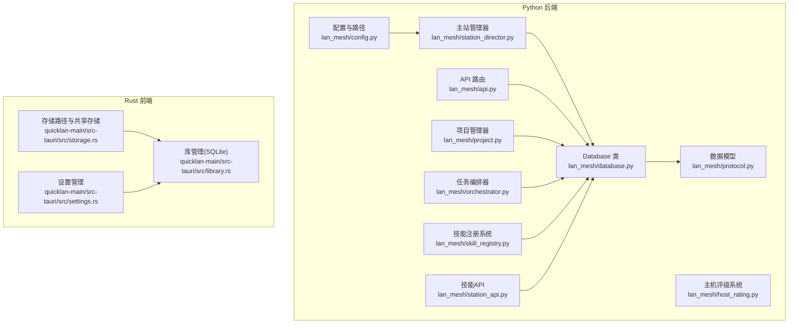
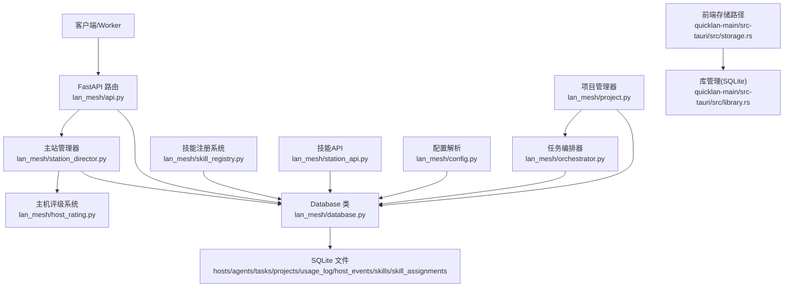
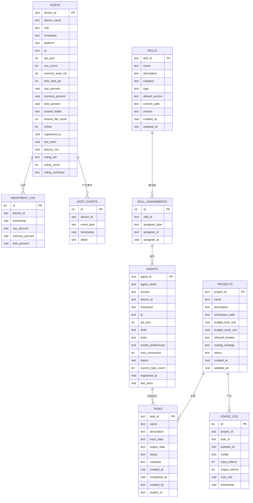
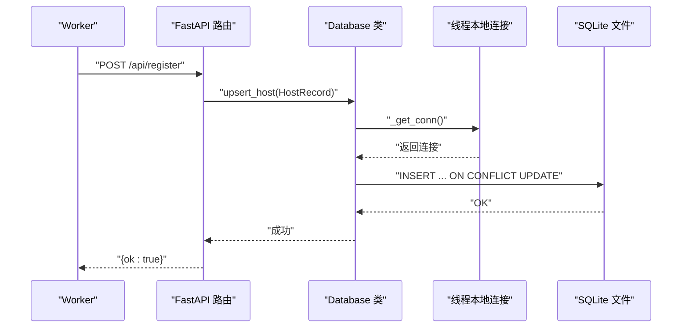
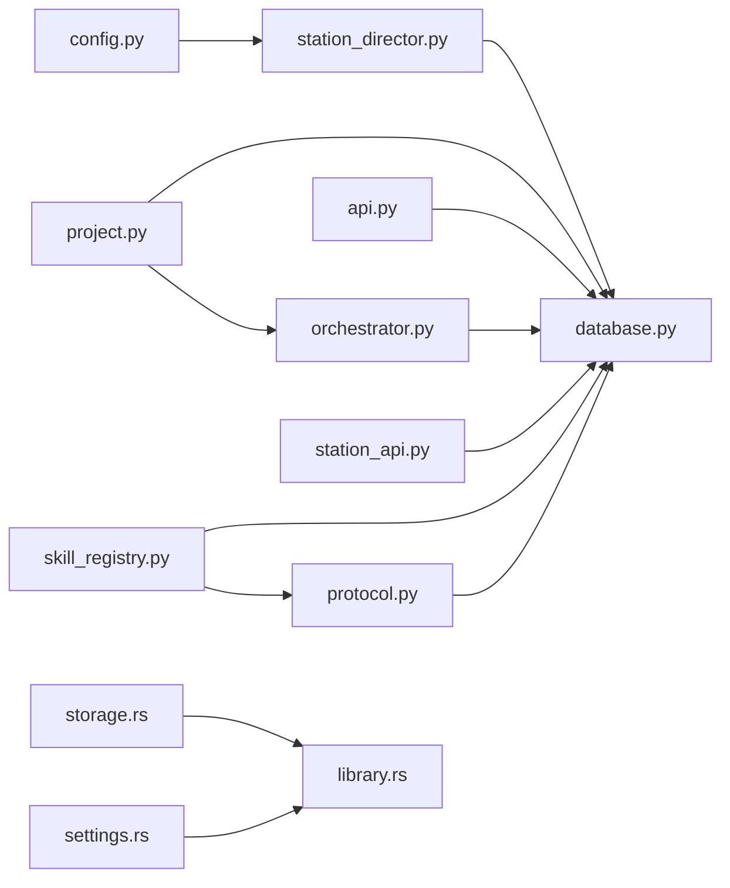

# 数据库设计

<cite>
**本文引用的文件**
- [database.py](file://lan_mesh/database.py)
- [protocol.py](file://lan_mesh/protocol.py)
- [config.py](file://lan_mesh/config.py)
- [api.py](file://lan_mesh/api.py)
- [station_director.py](file://lan_mesh/station_director.py)
- [host_rating.py](file://lan_mesh/host_rating.py)
- [project.py](file://lan_mesh/project.py)
- [orchestrator.py](file://lan_mesh/orchestrator.py)
- [skill_registry.py](file://lan_mesh/skill_registry.py)
- [station_api.py](file://lan_mesh/station_api.py)
- [storage.rs](file://quicklan-main/src-tauri/src/storage.rs)
- [settings.rs](file://quicklan-main/src-tauri/src/settings.rs)
- [library.rs](file://quicklan-main/src-tauri/src/library.rs)
- [dashboard.html](file://lan_mesh/web/templates/dashboard.html)
- [SKILL.md](file://skills/multi-agent-architect/SKILL.md)
</cite>

## 更新摘要
**变更内容**
- 新增skills表和skill_assignments表，支持技能注册、权限管理和内容分发
- 新增技能注册系统，支持从skills/目录自动扫描和注册技能
- 新增技能权限管理，支持角色/代理/主机级别的权限分配
- 新增技能内容管理，支持技能文件的front matter解析和内容缓存
- 新增技能API接口，支持技能查询、分配和内容获取
- 新增rating_tier、rating_score、rating_summary字段到hosts表，支持主机自动评级系统
- 新增host_events表用于跟踪设备生命周期事件，支持综合事件日志和舰队统计分析
- 新增主机评级计算和事件记录功能，增强资源管理和监控能力
- 更新数据库初始化脚本，包含新增表结构和索引

## 目录
1. [简介](#简介)
2. [项目结构](#项目结构)
3. [核心组件](#核心组件)
4. [架构总览](#架构总览)
5. [详细组件分析](#详细组件分析)
6. [依赖关系分析](#依赖关系分析)
7. [性能考虑](#性能考虑)
8. [故障排查指南](#故障排查指南)
9. [结论](#结论)
10. [附录](#附录)

## 简介
本文件系统性梳理了本项目中 SQLite 数据库的设计与实现，覆盖表结构、数据模型、关系映射、连接管理、事务与并发控制、数据访问模式、缓存策略、性能优化、初始化脚本、迁移路径与版本管理、数据生命周期与备份恢复等主题。重点围绕 Master 端数据库模块（lan_mesh/database.py）以及与之配套的数据模型（protocol.py），并结合前端应用（quicklan-main）中的存储路径与设置管理，形成完整的数据库设计文档。

**更新** 本次更新重点关注数据库结构的增强，新增了主机评级系统和事件跟踪功能，通过rating_tier、rating_score、rating_summary字段实现自动化资源分级，通过host_events表提供完整的设备生命周期监控，支持舰队统计分析和资源池管理。同时新增了技能注册和权限管理系统，支持从skills/目录自动扫描技能、管理技能权限分配和内容分发。

## 项目结构
数据库相关的核心位置与职责如下：
- Python 后端（lan_mesh）
  - 数据库封装：lan_mesh/database.py
  - 数据模型：lan_mesh/protocol.py
  - 配置与路径：lan_mesh/config.py
  - API 路由与集成：lan_mesh/api.py
  - 主站管理：lan_mesh/station_director.py
  - 主机评级：lan_mesh/host_rating.py
  - 项目管理：lan_mesh/project.py
  - 任务编排：lan_mesh/orchestrator.py
  - 技能注册：lan_mesh/skill_registry.py
  - 技能API：lan_mesh/station_api.py
- Rust 前端（quicklan-main）
  - 数据库路径与共享存储：quicklan-main/src-tauri/src/storage.rs
  - 设置管理：quicklan-main/src-tauri/src/settings.rs
  - 库管理（另一套 SQLite 使用示例）：quicklan-main/src-tauri/src/library.rs

**图表来源**
- [database.py](file://lan_mesh/database.py)
- [protocol.py](file://lan_mesh/protocol.py)
- [config.py](file://lan_mesh/config.py)
- [api.py](file://lan_mesh/api.py)
- [station_director.py](file://lan_mesh/station_director.py)
- [host_rating.py](file://lan_mesh/host_rating.py)
- [project.py](file://lan_mesh/project.py)
- [orchestrator.py](file://lan_mesh/orchestrator.py)
- [skill_registry.py](file://lan_mesh/skill_registry.py)
- [station_api.py](file://lan_mesh/station_api.py)
- [storage.rs](file://quicklan-main/src-tauri/src/storage.rs)
- [settings.rs](file://quicklan-main/src-tauri/src/settings.rs)
- [library.rs](file://quicklan-main/src-tauri/src/library.rs)

**章节来源**
- [database.py](file://lan_mesh/database.py)
- [protocol.py](file://lan_mesh/protocol.py)
- [config.py](file://lan_mesh/config.py)
- [api.py](file://lan_mesh/api.py)
- [station_director.py](file://lan_mesh/station_director.py)
- [host_rating.py](file://lan_mesh/host_rating.py)
- [project.py](file://lan_mesh/project.py)
- [orchestrator.py](file://lan_mesh/orchestrator.py)
- [skill_registry.py](file://lan_mesh/skill_registry.py)
- [station_api.py](file://lan_mesh/station_api.py)
- [storage.rs](file://quicklan-main/src-tauri/src/storage.rs)
- [settings.rs](file://quicklan-main/src-tauri/src/settings.rs)
- [library.rs](file://quicklan-main/src-tauri/src/library.rs)

## 核心组件
- Database 类：封装 SQLite 连接、表初始化、CRUD 操作、索引与清理逻辑
- 数据模型：HostRecord、AgentCard、Task、Project、UsageRecord、HostEvent、SkillRecord 等
- 配置与路径：db_path 解析、默认路径、共享文件夹路径
- API 集成：注册、心跳、主机列表、WebSocket 推送、事件查询、技能管理等
- 主站管理：StationDirector 提供主机生命周期管理、评级计算和事件记录
- 主机评级：HostRating 提供自动评级算法和难度匹配
- 项目管理：ProjectManager 提供项目生命周期管理、预算控制和消费记录
- 任务编排：Orchestrator 支持项目关联的任务执行和消费记录
- 技能注册：SkillRegistry 提供技能扫描、注册、权限管理和内容分发
- 前端存储：应用数据目录、数据库文件路径、共享存储目录

**章节来源**
- [database.py](file://lan_mesh/database.py)
- [protocol.py](file://lan_mesh/protocol.py)
- [config.py](file://lan_mesh/config.py)
- [api.py](file://lan_mesh/api.py)
- [station_director.py](file://lan_mesh/station_director.py)
- [host_rating.py](file://lan_mesh/host_rating.py)
- [project.py](file://lan_mesh/project.py)
- [orchestrator.py](file://lan_mesh/orchestrator.py)
- [skill_registry.py](file://lan_mesh/skill_registry.py)
- [station_api.py](file://lan_mesh/station_api.py)
- [storage.rs](file://quicklan-main/src-tauri/src/storage.rs)

## 架构总览
下图展示数据库层在整体系统中的位置与交互关系，包括新增的主机评级、事件跟踪和技能管理功能。

**图表来源**
- [database.py](file://lan_mesh/database.py)
- [api.py](file://lan_mesh/api.py)
- [station_director.py](file://lan_mesh/station_director.py)
- [host_rating.py](file://lan_mesh/host_rating.py)
- [project.py](file://lan_mesh/project.py)
- [orchestrator.py](file://lan_mesh/orchestrator.py)
- [skill_registry.py](file://lan_mesh/skill_registry.py)
- [station_api.py](file://lan_mesh/station_api.py)
- [config.py](file://lan_mesh/config.py)
- [storage.rs](file://quicklan-main/src-tauri/src/storage.rs)
- [library.rs](file://quicklan-main/src-tauri/src/library.rs)

## 详细组件分析

### 数据模型与表结构
- 主机记录表（hosts）
  - 主键：device_id
  - 字段：设备标识、名称、角色、主机名、平台、IP、API 端口、CPU/内存/磁盘统计、在线状态、注册与最后心跳时间、延迟、评级等级、评级得分、评级摘要
  - 约束：device_id 主键；多处字段默认值保证数据完整性；新增评级相关字段支持资源分级
- 心跳日志表（heartbeat_log）
  - 主键：自增 id
  - 字段：device_id、timestamp、cpu/memory/disk 百分比
  - 索引：复合索引 (device_id, timestamp)，便于按设备快速检索与清理
- Agent 注册表（agents）
  - 主键：agent_id
  - 字段：agent 名称、版本、宿主设备、主机信息、技能/工具/模型偏好、并发数、状态、任务计数、注册与最后心跳时间
  - 索引：status 字段索引，便于按状态筛选
- 任务表（tasks）
  - 主键：task_id
  - 字段：任务名称、描述、输入输出、状态、子任务列表、创建/完成时间、创建者、项目关联
  - 索引：status 字段索引；兼容性迁移：新增 project_id 列
- 项目表（projects）
  - 主键：project_id
  - 字段：项目名称、描述、工作空间、预算限额/已用、允许模型、路由策略、状态、创建/更新时间
  - 索引：status 字段索引
- 使用记录表（usage_log）
  - 主键：自增 id
  - 字段：项目/任务/子任务/模型、输入/输出 token 数、成本、时间戳
  - 索引：(project_id, timestamp) 复合索引，便于项目维度统计与报表
- 主机事件表（host_events）
  - 主键：自增 id
  - 字段：device_id、event_type、timestamp、detail
  - 索引：复合索引 (device_id, timestamp)，支持事件历史查询和全站事件流
- 技能表（skills）
  - 主键：skill_id
  - 字段：技能ID、名称、描述、分类、标签、默认访问权限、内容路径、版本、创建/更新时间
  - 索引：无（主键自动索引）
- 技能分配表（skill_assignments）
  - 主键：自增 id
  - 字段：技能ID、受分配者类型、受分配者ID、分配时间
  - 约束：UNIQUE(skill_id, assignee_type, assignee_id)，防止重复分配
  - 索引：复合索引 (assignee_type, assignee_id)，支持按受分配者查询

**图表来源**
- [database.py](file://lan_mesh/database.py)

**章节来源**
- [database.py](file://lan_mesh/database.py)

### 数据模型定义与约束
- HostRecord
  - 字段：device_id、device_name、role、hostname、platform、ip、api_port、cpu_count、memory_total_mb、disk_total_gb、cpu_percent、memory_percent、disk_percent、shared_folder、shared_file_count、online、registered_at、last_seen、latency_ms、rating_tier、rating_score、rating_summary
  - 约束：online 以布尔形式存储（数据库中以整型 0/1 存储），时间戳以浮点秒存储，评级字段支持资源分级
- HostEvent
  - 字段：device_id、event_type、timestamp、detail
  - 约束：event_type 支持 join、leave、register、rating_change 等事件类型
- AgentCard
  - 字段：agent_id、agent_name、version、device_id、hostname、ip、api_port、skills（JSON）、tools（JSON）、model_preferences（JSON）、max_concurrent_tasks、status、current_task_count、registered_at、last_seen
  - 约束：技能/工具/偏好以 JSON 文本存储，status 采用枚举字符串
- Task/SubTask
  - 字段：task_id/name/description/input_data/output_data/status/subtasks/created_at/completed_at/created_by/project_id
  - 约束：子任务列表以 JSON 文本存储，状态采用枚举字符串
- Project
  - 字段：project_id、name、description、workspace_path、budget_limit_usd、budget_used_usd、allowed_models（JSON）、routing_strategy、status、created_at、updated_at
- UsageRecord
  - 字段：project_id、task_id、subtask_id、model、input_tokens、output_tokens、cost_usd、timestamp
- SkillRecord
  - 字段：skill_id、name、description、category、tags（JSON）、default_access（JSON）、content_path、version、created_at、updated_at
  - 约束：tags 和 default_access 以 JSON 文本存储，category 支持 architecture/coding/ops/management/general 等分类

**章节来源**
- [protocol.py](file://lan_mesh/protocol.py)

### 数据库连接管理与并发控制
- 连接策略
  - 每个线程持有独立连接：通过 threading.local() 为每个线程缓存 sqlite3.Connection
  - 连接创建时禁用"同线程检查"（check_same_thread=False），满足多线程场景
  - row_factory 设置为 sqlite3.Row，便于字典式访问
- 并发与事务
  - 每个操作均显式 commit，未使用显式 BEGIN/COMMIT 包裹，遵循"每句即事务"的最小粒度
  - 未见显式的锁或 WAL/PRAGMA 配置，建议后续引入 WAL 模式提升并发读写能力
- 线程安全
  - 通过线程本地存储避免跨线程共享连接，降低竞态风险

**图表来源**
- [database.py](file://lan_mesh/database.py)
- [api.py](file://lan_mesh/api.py)

**章节来源**
- [database.py](file://lan_mesh/database.py)

### 事务处理与一致性
- 当前实现
  - 每条 SQL 执行后立即 commit，确保单条语句的原子性
  - 未见显式事务块（BEGIN/COMMIT），适合低并发、小批量写入场景
- 建议
  - 对于需要强一致性的多步写入（如任务创建+子任务写入），应使用显式事务包裹
  - 引入 WAL 模式与合适的 PRAGMA 设置，提升并发读写性能

**章节来源**
- [database.py](file://lan_mesh/database.py)

### 数据访问模式与缓存策略
- 访问模式
  - CRUD 方法：upsert_*、get_*、list_*、update_*、delete_* 等
  - 查询过滤：按 status、device_id、timestamp 等字段过滤
  - JSON 字段：skills、tools、model_preferences、subtasks、input_data/output_data、tags、default_access 等以 JSON 文本存储，便于灵活扩展
  - 事件查询：支持按设备或全站查询事件历史
  - 技能查询：支持按分类过滤技能列表，支持技能内容缓存
- 缓存策略
  - 未见应用层缓存（如 LRU/Redis），当前为直连 SQLite
  - 建议对高频查询结果（如主机列表、项目列表、事件历史、技能内容）引入短期缓存，并结合数据库变更事件失效

**章节来源**
- [database.py](file://lan_mesh/database.py)
- [protocol.py](file://lan_mesh/protocol.py)
- [skill_registry.py](file://lan_mesh/skill_registry.py)

### 性能优化方案
- 索引优化
  - 已有索引：idx_heartbeat_device、idx_tasks_status、idx_agents_status、idx_usage_project、idx_projects_status、idx_host_events_device、idx_skill_assignments
  - 建议：为 frequently-filtered 字段增加复合索引（如 hosts 上的 (online, rating_tier)、(rating_tier, last_seen)）
- 查询优化
  - 使用 LIMIT 控制列表大小（如 list_tasks 默认限制、事件查询限制）
  - 避免 SELECT *，仅选择必要列
- 写入优化
  - 批量写入：将多个 upsert 合并为批量执行
  - 减少 JSON 序列化/反序列化开销：仅在必要时转换
- 存储与清理
  - 心跳日志清理：cleanup_old_heartbeats 按小时清理过期记录
  - 离线清理：prune_offline 基于 TTL 标记离线
  - 事件清理：可考虑按时间窗口清理历史事件
  - 技能内容缓存：减少重复读取技能文件的开销

**章节来源**
- [database.py](file://lan_mesh/database.py)
- [skill_registry.py](file://lan_mesh/skill_registry.py)

### 数据库初始化脚本与迁移路径
- 初始化脚本
  - 在首次连接时执行 executescript，创建 hosts、heartbeat_log、agents、tasks、projects、usage_log、host_events、skills、skill_assignments 表
  - 创建必要索引，包括新增的 host_events 索引和 skill_assignments 索引
  - 兼容性迁移：向 tasks 表添加 project_id 列，若已存在则忽略错误
  - 兼容性迁移：向 hosts 表添加 rating_tier、rating_score、rating_summary 列，若已存在则忽略错误
- 版本管理
  - 未见显式版本号或迁移脚本
  - 建议引入版本表（如 library_state）与迁移函数，确保升级时的结构演进与数据安全

**章节来源**
- [database.py](file://lan_mesh/database.py)

### 数据生命周期、备份与维护
- 生命周期
  - 主机：注册后持续更新 last_seen，超过 TTL 标记离线，自动记录离线事件
  - 心跳：定期清理过期心跳日志
  - 任务：状态机驱动（pending/assigned/running/completed/failed/cancelled）
  - 项目：状态（active/suspended/archived），预算使用追踪
  - 事件：记录主机入站、离站、重新注册、评级变更等生命周期事件
  - 技能：技能文件变更时自动重新扫描注册，支持版本管理
  - 技能分配：支持动态分配和撤销，实时生效
- 备份与恢复
  - 未见内置备份/恢复功能
  - 建议：定期复制 SQLite 文件进行备份；恢复时关闭服务后替换数据库文件
- 维护操作
  - 清理过期心跳：cleanup_old_heartbeats
  - 离线清理：prune_offline
  - 项目归档：delete_project（软删除，设置状态为 archived）
  - 事件清理：可定期清理历史事件以控制存储空间
  - 技能缓存清理：scan_and_register 时自动清除内容缓存

**章节来源**
- [database.py](file://lan_mesh/database.py)
- [skill_registry.py](file://lan_mesh/skill_registry.py)

### 主机评级系统与事件跟踪
- 主机评级系统（HostRating）
  - 职责：根据 CPU/内存/磁盘配置自动计算综合得分（0-100分），映射到 S/A/B/C/D 五级评级
  - 算法：CPU（最多35分，7核封顶）、内存（最多35分，约12GB封顶）、磁盘（最多30分，300GB封顶）
  - 用途：为 Secretary/Planner 提供资源池筛选，支持按难度匹配对应等级的主机
- 主站管理器（StationDirector）
  - 职责：主机注册入站、心跳处理、离线检测、舰队管理、资源池查询
  - 功能：自动计算主机评级、记录生命周期事件、提供舰队统计摘要
  - 集成：与 Database 类协作，提供主机级别的数据访问方法
- 事件记录与查询
  - 支持 join、leave、register、rating_change 等事件类型
  - 提供单台主机事件历史查询和全站事件流
  - 事件详情包含主机信息和评级变更详情

**章节来源**
- [station_director.py](file://lan_mesh/station_director.py)
- [host_rating.py](file://lan_mesh/host_rating.py)

### 项目管理功能
- 项目管理器（ProjectManager）
  - 职责：项目创建、查询、更新、归档；预算控制；消费记录追踪
  - 功能：预算超支自动暂停项目；根据路由策略推荐经济模型；计算模型调用成本
  - 集成：与 Database 类协作，提供项目级别的数据访问方法
- 模型定价与成本计算
  - 支持多种模型的定价表（DeepSeek、OpenAI、Anthropic、通义千问）
  - 基于 token 用量计算单次调用成本
  - 经济模型：预算超支 80% 后自动切换到更经济的模型
- 任务与项目关联
  - 任务表新增 project_id 字段，支持任务与项目的绑定
  - 任务编排器在任务执行完成后自动记录消费信息
  - 项目管理器提供预算使用率计算和状态查询功能

**章节来源**
- [project.py](file://lan_mesh/project.py)
- [orchestrator.py](file://lan_mesh/orchestrator.py)

### 技能注册与权限管理系统
- 技能注册系统（SkillRegistry）
  - 职责：扫描 skills/ 目录，解析技能文件的 YAML front matter，自动注册技能
  - 功能：支持技能元数据管理、权限分配、内容分发、系统提示构建
  - 算法：通过 YAML front matter 解析技能的 name、description、category、tags、default_access、version 等元数据
  - 集成：与 Database 类协作，提供技能级别的数据访问方法
- 技能权限管理
  - 支持三种分配类型：role（角色）、agent（代理）、host（主机）
  - 默认权限：default_access 字段支持 "all"（所有人）和特定角色访问
  - 权限继承：角色默认权限 + 直接分配权限的组合
- 技能内容管理
  - 支持 SKILL.md 主内容和可选 reference.md 扩展参考
  - 内容缓存：减少重复读取技能文件的开销
  - 版本管理：支持技能版本控制和更新
- 技能API接口
  - 技能查询：/api/station/skills、/api/station/skills?category={category}
  - 技能详情：/api/station/skills/{skill_id}
  - 权限管理：/api/station/skills/{skill_id}/assign、/api/station/skills/{skill_id}/assign
  - 系统提示：根据任务上下文动态构建系统提示

**章节来源**
- [skill_registry.py](file://lan_mesh/skill_registry.py)
- [station_api.py](file://lan_mesh/station_api.py)

## 依赖关系分析
- Python 后端
  - Database 依赖 sqlite3、threading、time、pathlib、typing
  - 依赖 protocol 中的数据模型（HostRecord、AgentCard、Task、Project、UsageRecord、HostEvent、SkillRecord）
  - 与 FastAPI 路由集成，通过 API 层暴露注册、心跳、主机列表、事件查询、技能管理等接口
  - 主站管理器依赖 Database、HostRating 和 Protocol 模块
  - 项目管理器依赖 Database 和 Protocol 模块
  - 任务编排器依赖 Database、Protocol 和 ProjectManager
  - 技能注册系统依赖 Database、Protocol 和 YAML 解析库
- 前端（Rust）
  - storage.rs 提供应用数据目录、数据库文件路径、共享存储目录
  - settings.rs 提供设置持久化（昵称、下载目录）
  - library.rs 展示了另一套 SQLite 使用模式（WAL、版本表、settings 表等）

**图表来源**
- [database.py](file://lan_mesh/database.py)
- [protocol.py](file://lan_mesh/protocol.py)
- [config.py](file://lan_mesh/config.py)
- [api.py](file://lan_mesh/api.py)
- [station_director.py](file://lan_mesh/station_director.py)
- [project.py](file://lan_mesh/project.py)
- [orchestrator.py](file://lan_mesh/orchestrator.py)
- [skill_registry.py](file://lan_mesh/skill_registry.py)
- [station_api.py](file://lan_mesh/station_api.py)
- [storage.rs](file://quicklan-main/src-tauri/src/storage.rs)
- [settings.rs](file://quicklan-main/src-tauri/src/settings.rs)
- [library.rs](file://quicklan-main/src-tauri/src/library.rs)

**章节来源**
- [database.py](file://lan_mesh/database.py)
- [protocol.py](file://lan_mesh/protocol.py)
- [config.py](file://lan_mesh/config.py)
- [api.py](file://lan_mesh/api.py)
- [station_director.py](file://lan_mesh/station_director.py)
- [project.py](file://lan_mesh/project.py)
- [orchestrator.py](file://lan_mesh/orchestrator.py)
- [skill_registry.py](file://lan_mesh/skill_registry.py)
- [station_api.py](file://lan_mesh/station_api.py)
- [storage.rs](file://quicklan-main/src-tauri/src/storage.rs)
- [settings.rs](file://quicklan-main/src-tauri/src/settings.rs)
- [library.rs](file://quicklan-main/src-tauri/src/library.rs)

## 性能考虑
- 当前实现偏向简单直接，适合小型部署与开发测试
- 高并发场景建议
  - 引入 WAL 模式与 PRAGMA 设置（journal_mode=WAL、synchronous=NORMAL 等）
  - 使用显式事务包裹多步写入
  - 对热点查询建立复合索引（如 hosts 上的 (online, rating_tier)）
  - 引入应用层缓存与失效策略
- I/O 优化
  - 批量写入减少事务开销
  - 控制日志保留周期，定期清理
- 项目管理性能
  - 项目预算查询使用索引优化
  - 消费记录按项目和时间范围查询
  - 任务与项目关联查询使用 project_id 索引
- 事件系统性能
  - 事件查询使用复合索引优化
  - 支持事件历史限制，避免大量数据查询
  - 舰队统计使用聚合查询，避免全表扫描
- 技能系统性能
  - 技能内容缓存减少文件I/O开销
  - 技能分配查询使用复合索引优化
  - 技能扫描时批量处理，避免重复解析

## 故障排查指南
- 连接问题
  - 确认数据库文件路径存在且可写（config.py 中 db_path）
  - 检查线程本地连接是否正确创建
- 数据不一致
  - 确认每条写入都已 commit
  - 对多步写入使用显式事务
- 查询缓慢
  - 检查是否命中索引（如 status、device_id、timestamp、rating_tier、skill_id）
  - 使用 LIMIT 控制返回数量
- 心跳丢失
  - 检查 prune_offline 的 TTL 是否过短
  - 确认 Worker 心跳频率与 Master 清理频率协调
- 项目管理问题
  - 检查项目预算是否正确更新
  - 确认消费记录是否正确写入 usage_log 表
  - 验证任务与项目关联是否正确
- 评级系统问题
  - 检查主机评级计算是否正常
  - 确认评级事件是否正确记录
  - 验证评级查询接口是否返回正确结果
- 事件系统问题
  - 检查事件表结构是否正确
  - 确认事件查询接口是否正常工作
  - 验证事件历史是否按时间排序
- 技能系统问题
  - 检查 skills/ 目录是否存在且可读
  - 确认 YAML front matter 格式是否正确
  - 验证技能分配权限是否正确生效
  - 检查技能内容缓存是否正常工作

**章节来源**
- [database.py](file://lan_mesh/database.py)
- [config.py](file://lan_mesh/config.py)
- [station_director.py](file://lan_mesh/station_director.py)
- [host_rating.py](file://lan_mesh/host_rating.py)
- [project.py](file://lan_mesh/project.py)
- [skill_registry.py](file://lan_mesh/skill_registry.py)

## 结论
本项目在 Python 后端实现了简洁而实用的 SQLite 数据库存储层，配合完善的数据模型与 API 集成，能够满足 LAN Mesh 场景下的主机注册、心跳、任务与项目管理需求。**更新** 新增的主机评级系统和事件跟踪功能显著增强了资源管理和监控能力，通过 rating_tier、rating_score、rating_summary 字段实现了自动化资源分级，通过 host_events 表提供了完整的设备生命周期监控，支持舰队统计分析和资源池管理。同时新增的技能注册和权限管理系统支持从 skills/ 目录自动扫描技能、管理技能权限分配和内容分发，为多智能体协作提供了强大的能力支撑。建议在未来版本中引入 WAL 模式、显式事务、版本迁移机制与应用层缓存，以进一步提升并发性能、数据一致性与可维护性。

## 附录

### 数据库初始化与路径
- Python 后端
  - 数据库路径解析：config.py 中 get_db_path
  - 初始化：database.py 中 _init_db 执行 executescript 创建表与索引
  - 兼容性迁移：安全添加 rating_tier、rating_score、rating_summary 列
- Rust 前端
  - 应用数据目录：storage.rs 中 app_data_dir
  - 数据库文件路径：storage.rs 中 database_path
  - 共享存储目录：storage.rs 中 shared_store_dir

**章节来源**
- [config.py](file://lan_mesh/config.py)
- [database.py](file://lan_mesh/database.py)
- [storage.rs](file://quicklan-main/src-tauri/src/storage.rs)

### API 集成要点
- 注册与心跳
  - /api/register：接收 HostInfo，转换为 HostRecord 并 upsert
  - /api/heartbeat：更新 HostRecord 的实时指标与 last_seen，同时记录心跳日志
- 主机列表
  - /api/hosts：合并数据库与 UDP 发现结果，返回完整主机视图
- 事件查询
  - /api/station/hosts/{device_id}/events：查询单台主机事件历史
  - /api/station/events：查询最近全站事件流
  - /api/station/rate：手动触发重新评级所有在线主机
  - /api/station/stats：查询舰队统计摘要
- 技能管理
  - /api/station/skills：列出所有技能，可按分类过滤
  - /api/station/skills?category={category}：按分类过滤技能
  - /api/station/skills/{skill_id}：获取技能详情及完整内容
  - /api/station/skills/{skill_id}/assign：分配技能给角色/Agent/主机
  - /api/station/skills/{skill_id}/assign?assignee_type={type}&assignee_id={id}：撤销技能分配
- WebSocket 推送
  - 定期推送主机状态变更至前端

**章节来源**
- [api.py](file://lan_mesh/api.py)
- [station_director.py](file://lan_mesh/station_director.py)
- [station_api.py](file://lan_mesh/station_api.py)

### 主机评级与事件管理 API
- 评级管理端点
  - /api/station/rate：重新计算所有在线主机的评级
  - /api/station/stats：查询舰队统计摘要（总数、在线、离线、各评级分布）
- 事件管理端点
  - /api/station/hosts/{device_id}/events：查询单台主机事件历史
  - /api/station/events：查询全站事件流
- 事件类型
  - join：主机首次注册入站
  - leave：主机离线
  - register：主机重新注册
  - rating_change：评级变更

**章节来源**
- [station_director.py](file://lan_mesh/station_director.py)
- [host_rating.py](file://lan_mesh/host_rating.py)

### 技能注册与权限管理 API
- 技能管理端点
  - /api/station/skills：列出所有技能，可按分类过滤
  - /api/station/skills?category={category}：按分类过滤技能
  - /api/station/skills/{skill_id}：获取技能详情及完整内容
  - /api/station/skills/{skill_id}/assign：分配技能给角色/Agent/主机
  - /api/station/skills/{skill_id}/assign?assignee_type={type}&assignee_id={id}：撤销技能分配
- 技能文件格式
  - YAML front matter：包含 name、description、category、tags、default_access、version 等元数据
  - SKILL.md：技能主内容（去除 front matter 后的正文）
  - reference.md：可选的扩展参考内容
- 权限管理
  - default_access：默认可访问的角色列表，支持 "all"（所有人）和特定角色
  - assignee_type：支持 "role"、"agent"、"host" 三种分配类型
  - 权限继承：角色默认权限 + 直接分配权限的组合

**章节来源**
- [station_api.py](file://lan_mesh/station_api.py)
- [skill_registry.py](file://lan_mesh/skill_registry.py)
- [SKILL.md](file://skills/multi-agent-architect/SKILL.md)

### 前端界面集成
- 主站面板
  - 显示在线/离线主机数量和各评级分布
  - 支持主机详情查看，包含评级信息和事件历史
  - 提供重新评级按钮，手动触发评级计算
- 事件显示
  - 实时显示最近事件流
  - 支持按设备过滤事件
  - 事件详情包含时间戳和详细描述
- 技能面板
  - 显示技能列表，支持按分类过滤
  - 显示技能分配统计和权限信息
  - 支持技能详情查看和分配操作

**章节来源**
- [dashboard.html](file://lan_mesh/web/templates/dashboard.html)