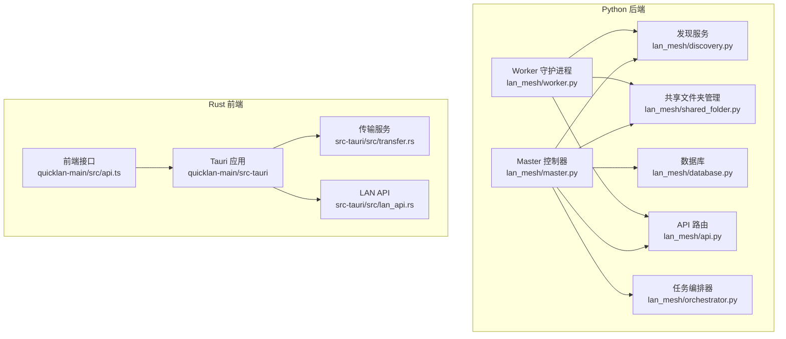
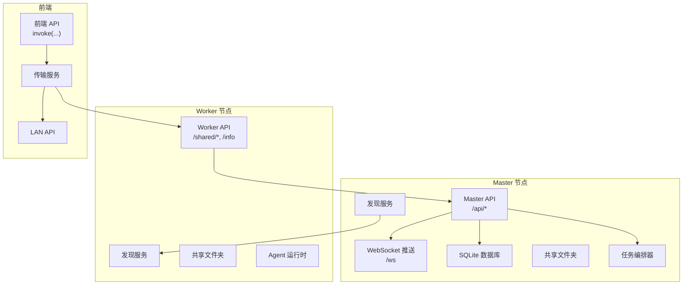
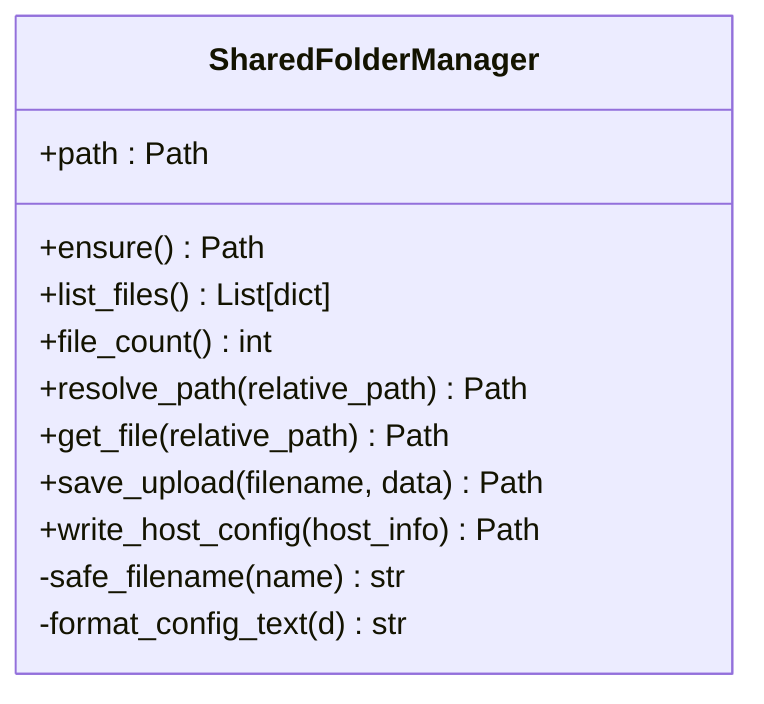
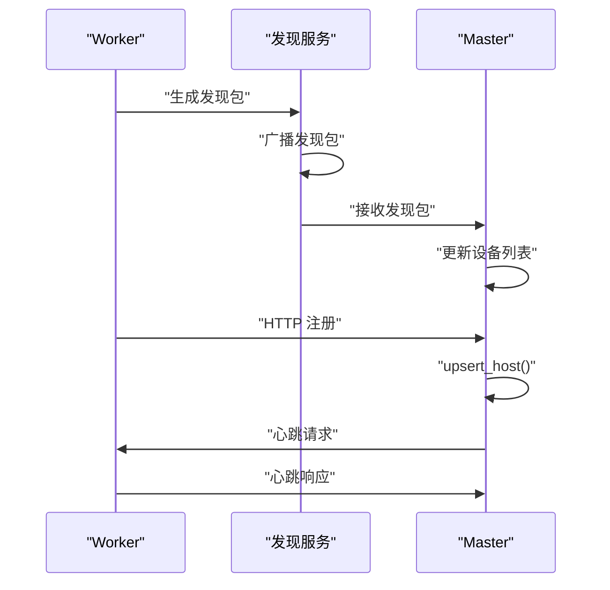
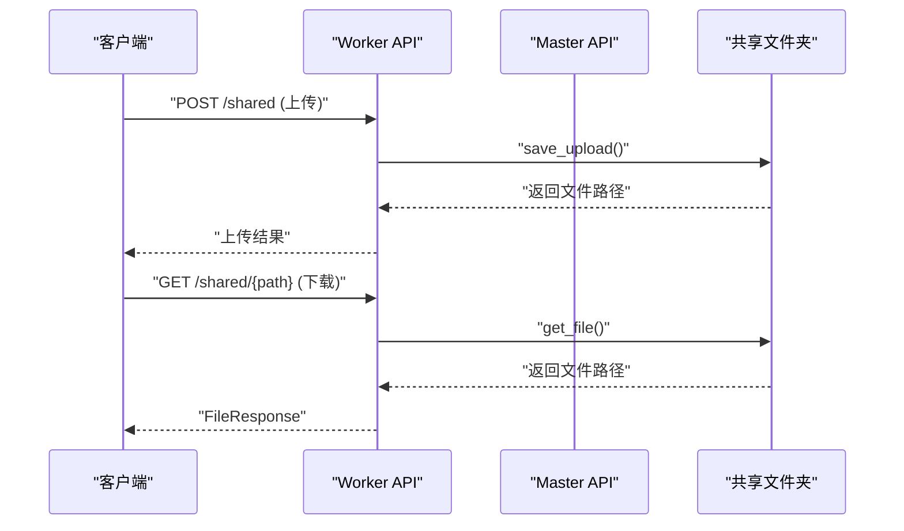
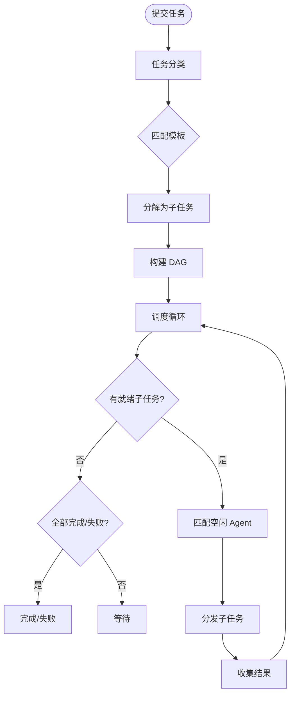
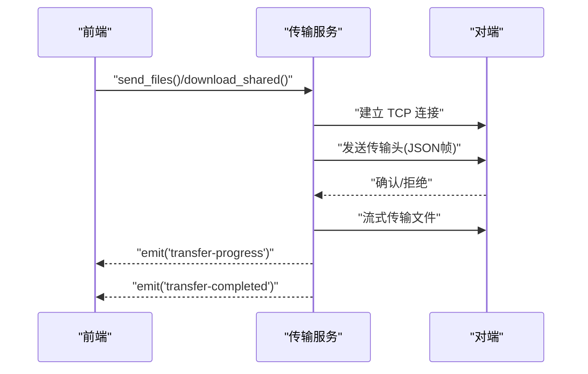
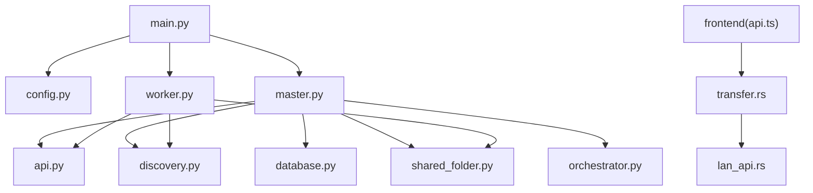

# 文件共享系统

<cite>
**本文引用的文件**
- [main.py](file://main.py)
- [lan_mesh/__init__.py](file://lan_mesh/__init__.py)
- [lan_mesh/config.py](file://lan_mesh/config.py)
- [lan_mesh/protocol.py](file://lan_mesh/protocol.py)
- [lan_mesh/host_info.py](file://lan_mesh/host_info.py)
- [lan_mesh/discovery.py](file://lan_mesh/discovery.py)
- [lan_mesh/shared_folder.py](file://lan_mesh/shared_folder.py)
- [lan_mesh/api.py](file://lan_mesh/api.py)
- [lan_mesh/master.py](file://lan_mesh/master.py)
- [lan_mesh/worker.py](file://lan_mesh/worker.py)
- [lan_mesh/database.py](file://lan_mesh/database.py)
- [lan_mesh/orchestrator.py](file://lan_mesh/orchestrator.py)
- [quicklan-main/src/api.ts](file://quicklan-main/src/api.ts)
- [quicklan-main/src-tauri/src/lan_api.rs](file://quicklan-main/src-tauri/src/lan_api.rs)
- [quicklan-main/src-tauri/src/transfer.rs](file://quicklan-main/src-tauri/src/transfer.rs)
</cite>

## 目录
1. [简介](#简介)
2. [项目结构](#项目结构)
3. [核心组件](#核心组件)
4. [架构概览](#架构概览)
5. [详细组件分析](#详细组件分析)
6. [依赖分析](#依赖分析)
7. [性能考虑](#性能考虑)
8. [故障排除指南](#故障排除指南)
9. [结论](#结论)
10. [附录](#附录)

## 简介
本文件共享系统是一个基于局域网的分布式文件传输与协作框架，结合了 Python 后端与 Rust 前端，提供以下能力：
- 基于 UDP 的设备发现与注册
- Master/Worker 分布式架构
- 共享文件夹的自动管理与文件上传下载
- 任务编排与 Agent 协作
- 前端通过 Tauri 集成的文件传输协议与状态同步
- 项目级预算与使用追踪

系统通过 FastAPI 提供 HTTP API，同时在前端使用 Rust 的 TCP 协议实现文件传输，支持断点续传与并发控制。

## 项目结构
项目分为三层：
- 后端 Python 层：负责设备发现、注册、共享文件管理、任务编排与数据库持久化
- 前端 Rust/Tauri 层：负责本地文件传输、下载进度与状态同步
- Web UI：基于 FastAPI 提供 Master 的仪表盘

**图表来源**
- [lan_mesh/master.py:67-324](file://lan_mesh/master.py#L67-L324)
- [lan_mesh/worker.py:62-325](file://lan_mesh/worker.py#L62-L325)
- [lan_mesh/discovery.py:33-259](file://lan_mesh/discovery.py#L33-L259)
- [lan_mesh/shared_folder.py:16-219](file://lan_mesh/shared_folder.py#L16-L219)
- [lan_mesh/database.py:16-611](file://lan_mesh/database.py#L16-L611)
- [lan_mesh/api.py:1-539](file://lan_mesh/api.py#L1-L539)
- [lan_mesh/orchestrator.py:58-262](file://lan_mesh/orchestrator.py#L58-L262)
- [quicklan-main/src-tauri/src/transfer.rs:73-750](file://quicklan-main/src-tauri/src/transfer.rs#L73-L750)
- [quicklan-main/src-tauri/src/lan_api.rs:19-177](file://quicklan-main/src-tauri/src/lan_api.rs#L19-L177)
- [quicklan-main/src/api.ts:1-130](file://quicklan-main/src/api.ts#L1-L130)

**章节来源**
- [main.py:25-90](file://main.py#L25-L90)
- [lan_mesh/config.py:48-84](file://lan_mesh/config.py#L48-L84)

## 核心组件
- 配置管理：统一加载 YAML 配置与环境变量，提供强类型配置对象
- 协议定义：定义端口常量、发现数据包、主机信息模型与任务模型
- 设备发现：基于 UDP 的广播发现，支持设备注册、心跳与离线清理
- 共享文件夹：自动创建与管理共享目录，提供文件列表、下载与上传
- API 路由：Worker 与 Master 的 HTTP API，包括文件传输、任务管理与状态推送
- 数据库：SQLite 持久化，存储主机记录、心跳历史、Agent 注册与任务状态
- 任务编排：将用户任务分解为子任务 DAG，匹配 Agent 并分发执行
- 前端传输：Rust TCP 协议实现文件传输，支持断点续传与并发控制

**章节来源**
- [lan_mesh/config.py:14-84](file://lan_mesh/config.py#L14-L84)
- [lan_mesh/protocol.py:12-356](file://lan_mesh/protocol.py#L12-L356)
- [lan_mesh/discovery.py:33-259](file://lan_mesh/discovery.py#L33-L259)
- [lan_mesh/shared_folder.py:16-219](file://lan_mesh/shared_folder.py#L16-L219)
- [lan_mesh/api.py:1-539](file://lan_mesh/api.py#L1-L539)
- [lan_mesh/database.py:16-611](file://lan_mesh/database.py#L16-L611)
- [lan_mesh/orchestrator.py:58-262](file://lan_mesh/orchestrator.py#L58-L262)
- [quicklan-main/src-tauri/src/transfer.rs:73-750](file://quicklan-main/src-tauri/src/transfer.rs#L73-L750)

## 架构概览
系统采用 Master/Worker 分布式架构：
- Master 负责设备发现、注册、心跳收集、共享文件管理与任务编排
- Worker 负责本机配置采集、共享文件夹暴露、注册与心跳上报
- 前端通过 Rust TCP 协议与后端 API 协作，实现文件传输与状态同步

**图表来源**
- [lan_mesh/master.py:187-324](file://lan_mesh/master.py#L187-L324)
- [lan_mesh/worker.py:219-325](file://lan_mesh/worker.py#L219-L325)
- [lan_mesh/api.py:103-526](file://lan_mesh/api.py#L103-L526)
- [quicklan-main/src-tauri/src/transfer.rs:73-750](file://quicklan-main/src-tauri/src/transfer.rs#L73-L750)
- [quicklan-main/src-tauri/src/lan_api.rs:19-177](file://quicklan-main/src-tauri/src/lan_api.rs#L19-L177)

## 详细组件分析

### 共享文件夹管理
共享文件夹管理器负责：
- 自动创建共享目录并写入说明文件
- 安全解析路径，防止路径穿越
- 列出共享文件与统计文件数量
- 保存上传文件，避免命名冲突
- 自动生成主机配置报告（JSON 与 TXT）

**图表来源**
- [lan_mesh/shared_folder.py:16-219](file://lan_mesh/shared_folder.py#L16-L219)

**章节来源**
- [lan_mesh/shared_folder.py:23-144](file://lan_mesh/shared_folder.py#L23-L144)

### 设备发现与注册
发现服务通过 UDP 广播实现设备发现，支持：
- 定时广播自身存在
- 监听其他设备的发现包
- 设备离线清理
- 主动探测指定 IP

**图表来源**
- [lan_mesh/discovery.py:139-214](file://lan_mesh/discovery.py#L139-L214)
- [lan_mesh/api.py:116-168](file://lan_mesh/api.py#L116-L168)

**章节来源**
- [lan_mesh/discovery.py:33-259](file://lan_mesh/discovery.py#L33-L259)
- [lan_mesh/api.py:116-168](file://lan_mesh/api.py#L116-L168)

### 文件上传下载 API
- Worker API
  - GET /shared：列出共享文件
  - GET /shared/{path}：下载共享文件
  - POST /shared：上传文件到共享目录
  - GET /info：返回本机配置
- Master API
  - /api/register：Worker 注册
  - /api/heartbeat：心跳上报
  - /api/hosts：主机列表
  - /api/network：网络状态
  - /api/discovery：UDP 发现设备
  - /ws：WebSocket 实时推送

**图表来源**
- [lan_mesh/api.py:39-98](file://lan_mesh/api.py#L39-L98)
- [lan_mesh/shared_folder.py:103-118](file://lan_mesh/shared_folder.py#L103-L118)

**章节来源**
- [lan_mesh/api.py:39-98](file://lan_mesh/api.py#L39-L98)
- [lan_mesh/api.py:116-256](file://lan_mesh/api.py#L116-L256)

### 任务编排与 Agent 协作
任务编排器将用户任务分解为子任务 DAG，匹配空闲 Agent 并分发执行：
- 任务分类与模板
- 子任务依赖构建
- Agent 匹配与分发
- 结果聚合与状态同步

**图表来源**
- [lan_mesh/orchestrator.py:58-262](file://lan_mesh/orchestrator.py#L58-L262)

**章节来源**
- [lan_mesh/orchestrator.py:58-262](file://lan_mesh/orchestrator.py#L58-L262)

### 前端传输协议与状态同步
前端通过 Rust TCP 协议实现文件传输：
- 传输服务监听 TCP 端口，处理入站与出站传输
- 支持快速发送与共享下载两种模式
- 断点续传与并发控制
- 传输进度与状态事件推送

**图表来源**
- [quicklan-main/src-tauri/src/transfer.rs:298-443](file://quicklan-main/src-tauri/src/transfer.rs#L298-L443)
- [quicklan-main/src-tauri/src/transfer.rs:504-539](file://quicklan-main/src-tauri/src/transfer.rs#L504-L539)

**章节来源**
- [quicklan-main/src-tauri/src/transfer.rs:73-750](file://quicklan-main/src-tauri/src/transfer.rs#L73-L750)
- [quicklan-main/src-tauri/src/lan_api.rs:19-177](file://quicklan-main/src-tauri/src/lan_api.rs#L19-L177)

## 依赖分析
系统模块间依赖关系如下：
- 主入口依赖配置与控制器
- Master/Worker 依赖发现、共享文件夹、API 路由与数据库
- 前端依赖传输服务与 LAN API
- 协议定义贯穿前后端

**图表来源**
- [main.py:56-85](file://main.py#L56-L85)
- [lan_mesh/master.py:77-114](file://lan_mesh/master.py#L77-L114)
- [lan_mesh/worker.py:73-96](file://lan_mesh/worker.py#L73-L96)
- [quicklan-main/src/api.ts:1-130](file://quicklan-main/src/api.ts#L1-L130)

**章节来源**
- [lan_mesh/config.py:48-84](file://lan_mesh/config.py#L48-L84)
- [lan_mesh/protocol.py:12-356](file://lan_mesh/protocol.py#L12-L356)

## 性能考虑
- 端口选择与冲突检测：后端与前端均实现端口递增策略，避免端口占用
- 心跳与发现频率：合理的发现与心跳间隔平衡网络负载与实时性
- 文件传输：Rust TCP 流式传输减少内存占用，支持断点续传
- 数据库：SQLite 线程安全连接池与索引优化，定期清理过期数据
- 并发控制：任务编排器与传输服务的并发限制，避免资源争用

[本节为通用指导，不直接分析具体文件]

## 故障排除指南
- 端口占用：启动时自动查找可用端口，若失败需检查防火墙与占用进程
- 设备未注册：确认 Worker 成功向 Master 发送注册与心跳
- 文件下载失败：检查路径解析与权限，确认共享文件存在
- 传输中断：检查 TCP 连接与防火墙设置，确认对端接受传输
- 数据库异常：检查 SQLite 文件权限与磁盘空间

**章节来源**
- [lan_mesh/master.py:225-234](file://lan_mesh/master.py#L225-L234)
- [lan_mesh/worker.py:240-249](file://lan_mesh/worker.py#L240-L249)
- [quicklan-main/src-tauri/src/transfer.rs:130-159](file://quicklan-main/src-tauri/src/transfer.rs#L130-L159)

## 结论
本文件共享系统通过 Master/Worker 架构实现了高效的局域网文件传输与协作，结合前端 Rust 传输协议提供了可靠的断点续传与并发控制。系统具备良好的扩展性与安全性，适合在企业内网环境中部署与使用。

[本节为总结性内容，不直接分析具体文件]

## 附录
- 配置文件位置与加载顺序：显式路径 → 环境变量 → 用户目录 → 当前目录
- 端口范围：发现端口固定，API 端口与传输端口递增查找
- 版本与协议：统一的应用名称与协议版本，确保兼容性

**章节来源**
- [lan_mesh/config.py:48-72](file://lan_mesh/config.py#L48-L72)
- [lan_mesh/protocol.py:14-25](file://lan_mesh/protocol.py#L14-L25)