# 核心模块

<cite>
**本文引用的文件**
- [main.py](file://main.py)
- [lan_mesh/__init__.py](file://lan_mesh/__init__.py)
- [lan_mesh/config.py](file://lan_mesh/config.py)
- [config.yaml](file://config.yaml)
- [lan_mesh/preflight.py](file://lan_mesh/preflight.py)
- [lan_mesh/host_info.py](file://lan_mesh/host_info.py)
- [lan_mesh/protocol.py](file://lan_mesh/protocol.py)
- [lan_mesh/discovery.py](file://lan_mesh/discovery.py)
- [lan_mesh/database.py](file://lan_mesh/database.py)
- [lan_mesh/shared_folder.py](file://lan_mesh/shared_folder.py)
- [lan_mesh/api.py](file://lan_mesh/api.py)
- [lan_mesh/master.py](file://lan_mesh/master.py)
- [lan_mesh/worker.py](file://lan_mesh/worker.py)
- [lan_mesh/orchestrator.py](file://lan_mesh/orchestrator.py)
- [lan_mesh/task.py](file://lan_mesh/task.py)
- [lan_mesh/model_router.py](file://lan_mesh/model_router.py)
- [lan_mesh/project.py](file://lan_mesh/project.py)
- [lan_mesh/mcp_gateway.py](file://lan_mesh/mcp_gateway.py)
- [lan_mesh/agent_runtime.py](file://lan_mesh/agent_runtime.py)
- [lan_mesh/tool_registry.py](file://lan_mesh/tool_registry.py)
- [lan_mesh/model_pool.example.yaml](file://lan_mesh/model_pool.example.yaml)
- [lan_mesh/web/templates/dashboard.html](file://lan_mesh/web/templates/dashboard.html)
</cite>

## 目录
1. [简介](#简介)
2. [项目结构](#项目结构)
3. [核心组件](#核心组件)
4. [架构总览](#架构总览)
5. [详细组件分析](#详细组件分析)
6. [依赖关系分析](#依赖关系分析)
7. [性能考量](#性能考量)
8. [故障排查指南](#故障排查指南)
9. [结论](#结论)
10. [附录](#附录)

## 简介
本文件面向 Work Station 的核心模块，系统性梳理以下关键子系统：设备发现（基于 UDP 广播）、数据库持久化（SQLite）、任务编排（DAG 算法）、文件共享（分布式目录）、模型路由器（L1-L4 难度分级 + 加权评分）、项目管理（预算控制 + 预算护栏）、MCP 工具网关、Agent 运行时。文档解释模块职责、实现原理、交互关系、配置项、API 接口与扩展点，并提供使用场景与排障建议，帮助开发者快速理解与扩展。

## 项目结构
- 入口程序负责解析命令行参数、加载配置并启动 Master/Worker。
- 核心子系统位于 lan_mesh 包内，包含配置、自检、主机信息采集、协议定义、发现、数据库、共享文件夹、API 路由、Master 控制器、Worker 守护进程、任务编排与 DAG 管理、模型路由器、项目管理器、MCP 网关、Agent 运行时、工具注册表等模块。
- 前端 Web UI 位于 master 的 web/templates 与 web/static 目录。

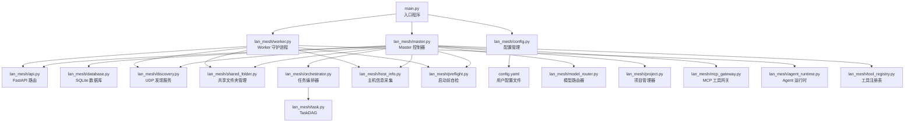

图表来源
- [main.py:1-90](file://main.py#L1-L90)
- [lan_mesh/master.py:1-319](file://lan_mesh/master.py#L1-L319)
- [lan_mesh/worker.py:1-325](file://lan_mesh/worker.py#L1-L325)
- [lan_mesh/api.py:1-539](file://lan_mesh/api.py#L1-L539)
- [lan_mesh/database.py:1-611](file://lan_mesh/database.py#L1-L611)
- [lan_mesh/discovery.py:1-259](file://lan_mesh/discovery.py#L1-L259)
- [lan_mesh/shared_folder.py:1-219](file://lan_mesh/shared_folder.py#L1-L219)
- [lan_mesh/orchestrator.py:1-287](file://lan_mesh/orchestrator.py#L1-L287)
- [lan_mesh/task.py:1-91](file://lan_mesh/task.py#L1-L91)
- [lan_mesh/host_info.py:1-212](file://lan_mesh/host_info.py#L1-L212)
- [lan_mesh/preflight.py:1-290](file://lan_mesh/preflight.py#L1-L290)
- [lan_mesh/config.py:1-139](file://lan_mesh/config.py#L1-L139)
- [config.yaml:1-22](file://config.yaml#L1-L22)
- [lan_mesh/model_router.py:1-327](file://lan_mesh/model_router.py#L1-L327)
- [lan_mesh/project.py:1-320](file://lan_mesh/project.py#L1-L320)
- [lan_mesh/mcp_gateway.py:1-280](file://lan_mesh/mcp_gateway.py#L1-L280)
- [lan_mesh/agent_runtime.py:1-305](file://lan_mesh/agent_runtime.py#L1-L305)
- [lan_mesh/tool_registry.py:1-338](file://lan_mesh/tool_registry.py#L1-L338)

章节来源
- [main.py:1-90](file://main.py#L1-L90)
- [lan_mesh/config.py:1-139](file://lan_mesh/config.py#L1-L139)
- [config.yaml:1-22](file://config.yaml#L1-L22)

## 核心组件
- 设备发现模块（UDP 广播）
  - 职责：周期性广播自身存在、监听其他设备、清理超时设备、提供网络状态。
  - 关键类：DiscoveryService；关键常量：端口、广播间隔、TTL。
  - 交互：Worker/ Master 启动时均创建 DiscoveryService，Master 作为发现中心聚合 Worker。
- 数据库模块（SQLite）
  - 职责：持久化主机注册记录、心跳日志、Agent 注册、任务与项目信息、用量日志。
  - 关键类：Database；关键表：hosts、heartbeat_log、agents、tasks、projects、usage_log。
  - 线程安全：每线程独立连接，避免跨线程共享连接。
- 任务编排模块（DAG）
  - 职责：任务分解、构建子任务 DAG、匹配 Agent、分发子任务、聚合结果。
  - 关键类：Orchestrator、TaskDAG；预置模板：按任务类型自动拆分子任务。
- 文件共享模块（分布式目录）
  - 职责：自动创建共享目录、列举/上传/下载文件、生成主机配置报告。
  - 关键类：SharedFolderManager；提供安全路径解析与文件名清洗。
- **模型路由器模块（Phase 2）**
  - 职责：任务难度分级（L1-L4）、加权评分算法、降级链容灾、多 Provider 支持、策略适配。
  - 关键类：ModelRouter；难度分类：基于规则的关键词匹配；评分算法：能力覆盖率×0.4 + 成本反向×0.3 + 速度×0.2 - 负载×0.1。
- **项目管理模块（Phase 3）**
  - 职责：项目创建与管理、预算控制（护栏）、消费追踪、工作空间隔离。
  - 关键类：ProjectManager；预算阈值：80%（警告）/ 100%（超支暂停）。
- **MCP 工具网关模块**
  - 职责：统一工具调度、Server 连接池管理、工具列表聚合、自动重连。
  - 关键类：MCPGateway；支持 stdio 和 HTTP 两种传输方式。
- **Agent 运行时模块**
  - 职责：Worker 端任务执行、多 Provider LLM 调用、降级链重试、本地工具处理。
  - 关键类：AgentRuntime；支持代码生成、审查、文档摘要、系统任务等技能。

章节来源
- [lan_mesh/discovery.py:1-259](file://lan_mesh/discovery.py#L1-L259)
- [lan_mesh/database.py:1-611](file://lan_mesh/database.py#L1-L611)
- [lan_mesh/orchestrator.py:1-287](file://lan_mesh/orchestrator.py#L1-L287)
- [lan_mesh/task.py:1-91](file://lan_mesh/task.py#L1-L91)
- [lan_mesh/shared_folder.py:1-219](file://lan_mesh/shared_folder.py#L1-L219)
- [lan_mesh/model_router.py:1-327](file://lan_mesh/model_router.py#L1-L327)
- [lan_mesh/project.py:1-320](file://lan_mesh/project.py#L1-L320)
- [lan_mesh/mcp_gateway.py:1-280](file://lan_mesh/mcp_gateway.py#L1-L280)
- [lan_mesh/agent_runtime.py:1-305](file://lan_mesh/agent_runtime.py#L1-L305)

## 架构总览
系统采用 Master/Worker 架构：
- Master 负责：注册与聚合 Worker 信息、提供 Web UI、任务编排、数据库持久化、文件共享、MCP 工具网关、模型路由、项目管理。
- Worker 负责：采集本机信息、共享文件夹、UDP 发现 Master、HTTP 注册与心跳、执行子任务。
- 通信：UDP 广播用于设备发现；HTTP API 用于注册、心跳、任务分发与文件共享；WebSocket 实时推送状态。

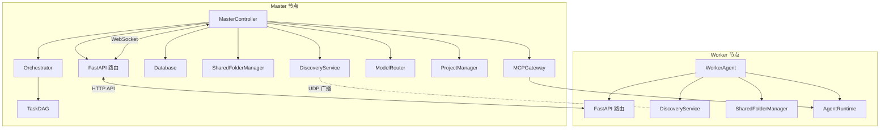

图表来源
- [lan_mesh/master.py:1-319](file://lan_mesh/master.py#L1-L319)
- [lan_mesh/worker.py:1-325](file://lan_mesh/worker.py#L1-L325)
- [lan_mesh/api.py:1-539](file://lan_mesh/api.py#L1-L539)
- [lan_mesh/discovery.py:1-259](file://lan_mesh/discovery.py#L1-L259)
- [lan_mesh/database.py:1-611](file://lan_mesh/database.py#L1-L611)
- [lan_mesh/orchestrator.py:1-287](file://lan_mesh/orchestrator.py#L1-L287)
- [lan_mesh/task.py:1-91](file://lan_mesh/task.py#L1-L91)
- [lan_mesh/model_router.py:1-327](file://lan_mesh/model_router.py#L1-L327)
- [lan_mesh/project.py:1-320](file://lan_mesh/project.py#L1-L320)
- [lan_mesh/mcp_gateway.py:1-280](file://lan_mesh/mcp_gateway.py#L1-L280)
- [lan_mesh/agent_runtime.py:1-305](file://lan_mesh/agent_runtime.py#L1-L305)

## 详细组件分析

### 设备发现模块（UDP 广播机制）
- 核心机制
  - 定时广播自身存在（presence），携带设备身份与配置摘要。
  - 监听广播，收到包后回送 presence 并更新设备列表。
  - 定期清理超时设备（TTL）。
- 关键实现
  - DiscoveryService.start()/stop() 启停三个后台线程：广播、监听、清理。
  - _broadcast_packet/_send_packet 支持广播与单播。
  - list_devices/find_device/network_status 提供查询与网络状态。
- 与协议的关系
  - DiscoveryPacket/NetworkStatus 定义发现载荷与网络快照。
  - 与 host_info 的 make_discovery_packet 协作生成发现包。
- 使用场景
  - Worker 启动后通过 DiscoveryService 发现 Master 并注册。
  - Master 通过 DiscoveryService 聚合 Worker 列表并清理离线节点。

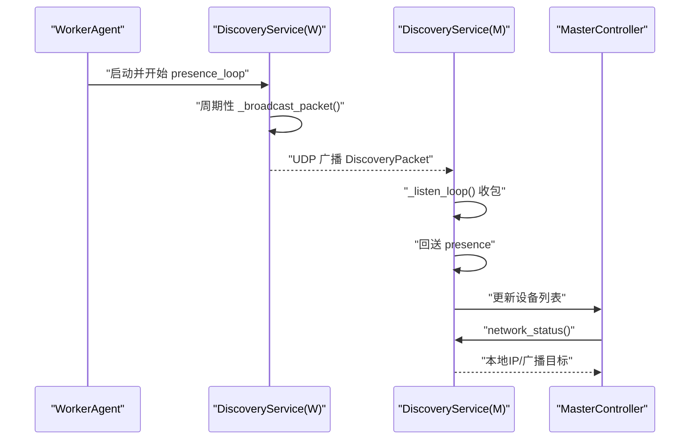

图表来源
- [lan_mesh/discovery.py:139-259](file://lan_mesh/discovery.py#L139-L259)
- [lan_mesh/protocol.py:29-65](file://lan_mesh/protocol.py#L29-L65)
- [lan_mesh/host_info.py:194-212](file://lan_mesh/host_info.py#L194-L212)

章节来源
- [lan_mesh/discovery.py:1-259](file://lan_mesh/discovery.py#L1-L259)
- [lan_mesh/protocol.py:12-25](file://lan_mesh/protocol.py#L12-L25)
- [lan_mesh/host_info.py:129-212](file://lan_mesh/host_info.py#L129-L212)

### 数据库模块（SQLite 持久化设计）
- 设计要点
  - 线程安全：每线程持有独立 sqlite3.Connection。
  - 结构：hosts、heartbeat_log、agents、tasks、projects、usage_log。
  - 索引：对高频查询建立索引（如 heartbeat_log(device_id,timestamp)、tasks(status)、agents(status)、projects(status)）。
- 主要能力
  - 主机：upsert_host/get_host/list_hosts/set_offline/prune_offline/cleanup_old_heartbeats。
  - Agent：upsert_agent/get_agent/list_agents/update_agent_status/find_idle_agent_with_skill。
  - 任务：save_task/get_task/list_tasks。
  - 项目：upsert_project/get_project/list_projects/delete_project/update_project_budget/update_project_status。
  - 用量：record_usage/get_usage_log。
- 扩展点
  - 新增表/字段时注意兼容性（如 tasks 表新增 project_id）。
  - 可按需增加索引优化查询。

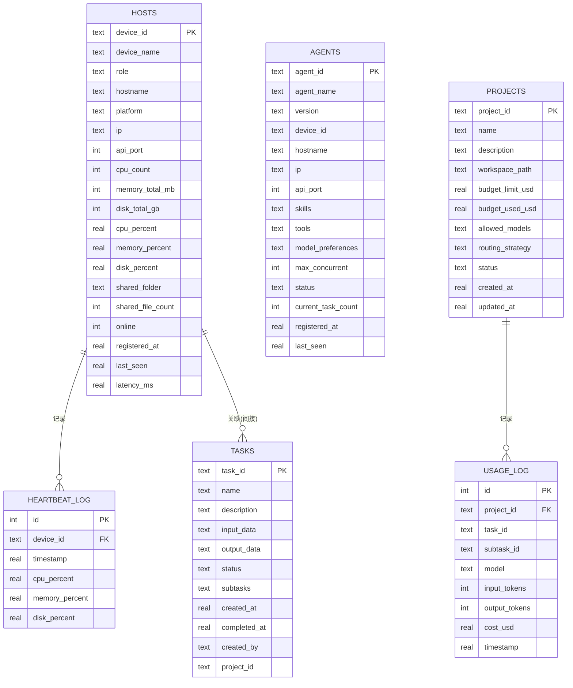

图表来源
- [lan_mesh/database.py:36-143](file://lan_mesh/database.py#L36-L143)
- [lan_mesh/database.py:492-585](file://lan_mesh/database.py#L492-L585)

章节来源
- [lan_mesh/database.py:1-611](file://lan_mesh/database.py#L1-L611)

### 任务编排模块（DAG 算法实现）
- 职责
  - 任务分解：根据任务类型选择模板，生成子任务并建立依赖关系。
  - DAG 构建：TaskDAG 基于邻接表与入度表维护依赖。
  - 匹配与分发：查找具备所需技能的空闲 Agent，HTTP 调用 Worker 执行。
  - 结果聚合：收集子任务输出，标记任务完成或失败。
- 关键流程
  - submit_task → _decompose → TaskDAG → _schedule_loop → _dispatch_subtask → HTTP 执行 → 回写状态。
  - DAG 检测：has_cycle；就绪判断：get_ready_subtasks；完成/失败判定：is_all_completed/has_failed。
- 扩展点
  - 模板：DECOMPOSITION_TEMPLATES 可按业务扩展。
  - 匹配策略：find_idle_agent_with_skill 可替换为更复杂的路由策略。
- **集成增强**（新增）
  - 与模型路由器集成：在分发前调用 ModelRouter 确定推荐模型和降级链。
  - 与项目管理器集成：记录模型调用消费，检查项目预算。

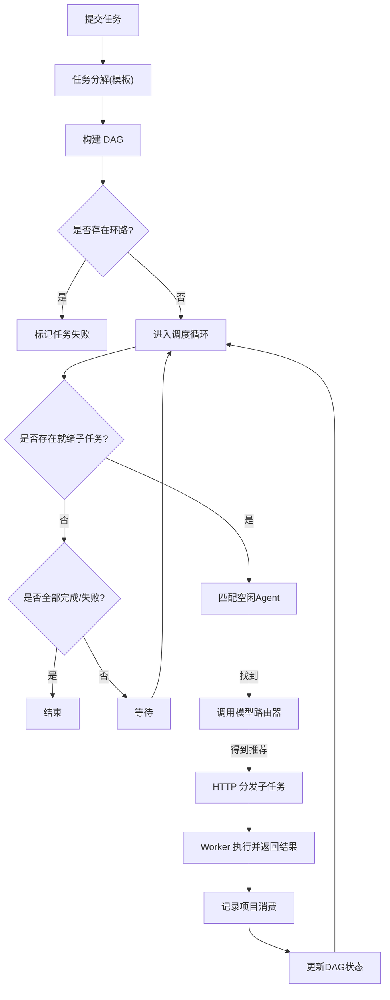

图表来源
- [lan_mesh/orchestrator.py:58-287](file://lan_mesh/orchestrator.py#L58-L287)
- [lan_mesh/task.py:16-91](file://lan_mesh/task.py#L16-L91)
- [lan_mesh/model_router.py:164-242](file://lan_mesh/model_router.py#L164-L242)
- [lan_mesh/project.py:234-271](file://lan_mesh/project.py#L234-L271)

章节来源
- [lan_mesh/orchestrator.py:1-287](file://lan_mesh/orchestrator.py#L1-L287)
- [lan_mesh/task.py:1-91](file://lan_mesh/task.py#L1-L91)

### 文件共享模块（分布式传输机制）
- 功能
  - 自动创建共享目录，保证首次运行可用。
  - 列举共享文件/目录，统计文件数量与大小。
  - 安全路径解析（防路径穿越），上传文件并去重命名。
  - 自动生成主机配置报告（JSON 与 TXT），便于人工与程序读取。
- 传输特点
  - 基于目录共享，不引入额外传输协议；适合局域网内小文件分发与临时共享。
  - 通过 Worker/ Master 的 /shared 接口进行下载/上传。
- 安全与健壮性
  - resolve_path 防止 ../ 越权访问。
  - save_upload 自动处理重名冲突。
  - write_host_config 覆盖写入，确保最新配置可见。

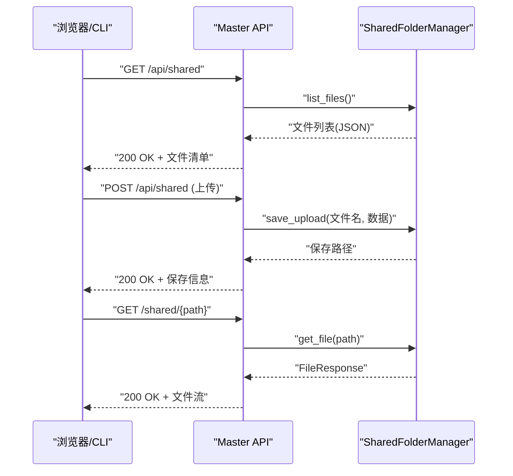

图表来源
- [lan_mesh/api.py:62-98](file://lan_mesh/api.py#L62-L98)
- [lan_mesh/shared_folder.py:39-118](file://lan_mesh/shared_folder.py#L39-L118)

章节来源
- [lan_mesh/shared_folder.py:1-219](file://lan_mesh/shared_folder.py#L1-L219)
- [lan_mesh/api.py:1-539](file://lan_mesh/api.py#L1-L539)

### 模型路由器模块（Phase 2）
- **新增功能**：模型路由决策引擎
- 核心机制
  - 任务难度分级：基于规则的 L1-L4 分级（关键词匹配 + 文本长度 + 技能类型）。
  - 加权评分算法：Score = 能力覆盖率×0.4 + 成本反向×0.3 + 速度×0.2 - 负载×0.1。
  - 降级链容灾：首选模型失败时自动沿 Fallback Chain 重试。
  - 多 Provider 支持：DeepSeek/OpenAI/Anthropic/Qwen，统一 OpenAI 兼容 API。
  - 策略适配：cost_first（省钱优先）/ quality_first（质量优先）/ balanced。
- 关键实现
  - classify_difficulty：基于关键词和技能类型的难度分类。
  - _compute_score：综合评分计算，考虑能力匹配度、成本、速度、负载。
  - get_fallback_chain：构建降级链，过滤白名单和可用性。
- 使用场景
  - 任务执行前的智能模型选择。
  - 项目预算紧张时的经济模型推荐。
  - 多 Provider 环境下的最优模型路由。

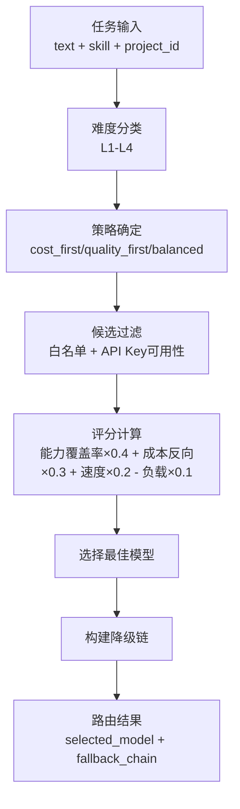

图表来源
- [lan_mesh/model_router.py:60-104](file://lan_mesh/model_router.py#L60-L104)
- [lan_mesh/model_router.py:246-284](file://lan_mesh/model_router.py#L246-L284)
- [lan_mesh/model_router.py:304-326](file://lan_mesh/model_router.py#L304-L326)

章节来源
- [lan_mesh/model_router.py:1-327](file://lan_mesh/model_router.py#L1-L327)

### 项目管理模块（Phase 3）
- **新增功能**：项目隔离与预算控制
- 核心机制
  - 项目生命周期：创建、激活、暂停、归档。
  - 预算护栏：80%（警告）/ 100%（超支暂停），自动切换经济模型。
  - 消费追踪：基于 token 用量的精确成本计算。
  - 工作空间隔离：每个项目独立目录，上下文完全隔离。
- 关键实现
  - create_project：创建项目并生成独立工作空间。
  - check_budget：检查项目预算是否充足。
  - record_usage：记录模型调用消费并更新预算。
  - suspend_if_over_budget：超支自动暂停项目。
- 使用场景
  - 多项目并行开发的预算控制。
  - 成本敏感场景的自动经济模型切换。
  - 项目间的数据隔离与审计追踪。

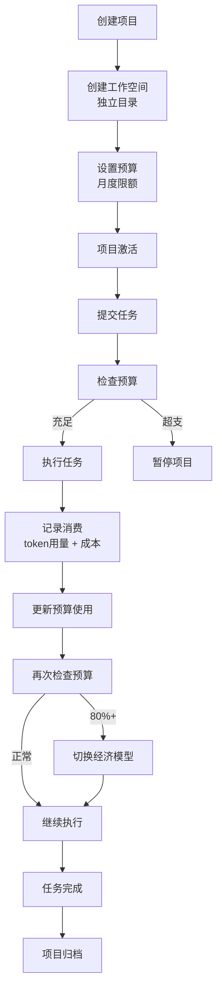

图表来源
- [lan_mesh/project.py:78-123](file://lan_mesh/project.py#L78-L123)
- [lan_mesh/project.py:176-190](file://lan_mesh/project.py#L176-L190)
- [lan_mesh/project.py:234-271](file://lan_mesh/project.py#L234-L271)
- [lan_mesh/project.py:273-291](file://lan_mesh/project.py#L273-L291)

章节来源
- [lan_mesh/project.py:1-320](file://lan_mesh/project.py#L1-L320)

### MCP 工具网关模块
- **新增功能**：统一工具调度枢纽
- 核心机制
  - Server 管理：维护所有 MCP Server 的连接池（stdio 子进程 + HTTP 远程）。
  - 工具聚合：聚合所有 Server 的工具列表 → 统一 /tools/list。
  - 路由调用：路由工具调用到正确的 Server → 统一 /tools/call。
  - 自动重连：断线检测与自动重连机制。
  - 动态调整：按模型类型动态调整工具描述（弱模型加更多示例）。
- 关键实现
  - register_server/unregister_server：Server 注册与注销。
  - list_all_tools：聚合工具列表并标注来源。
  - call_tool：工具调用路由与执行。
  - health_check：健康检查与自动重连。
- 使用场景
  - 多来源工具的统一管理与调用。
  - Agent 与外部工具的桥接层。
  - 动态工具加载与配置管理。

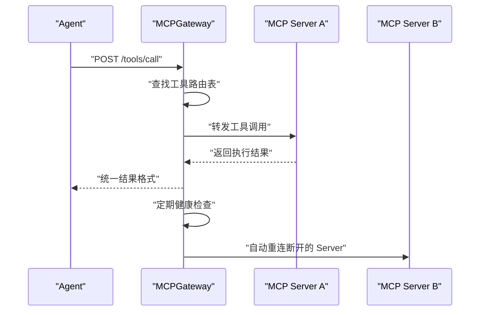

图表来源
- [lan_mesh/mcp_gateway.py:48-80](file://lan_mesh/mcp_gateway.py#L48-L80)
- [lan_mesh/mcp_gateway.py:112-134](file://lan_mesh/mcp_gateway.py#L112-L134)
- [lan_mesh/mcp_gateway.py:136-177](file://lan_mesh/mcp_gateway.py#L136-L177)
- [lan_mesh/mcp_gateway.py:218-236](file://lan_mesh/mcp_gateway.py#L218-L236)

章节来源
- [lan_mesh/mcp_gateway.py:1-280](file://lan_mesh/mcp_gateway.py#L1-L280)

### Agent 运行时模块
- **新增功能**：Worker 端任务执行引擎
- 核心机制
  - 技能处理器：根据 required_skill 路由到对应执行处理器。
  - LLM 调用：支持多 Provider（DeepSeek/OpenAI/Anthropic/Qwen）。
  - 降级链重试：基于模型路由器注入的降级链进行重试。
  - 本地工具：Shell 命令执行、文件读写、系统监控等。
- 关键实现
  - execute：统一的子任务执行入口。
  - _call_llm_with_routing：带路由决策的 LLM 调用。
  - _handle_*：各类技能的具体处理器实现。
  - _call_openai_compatible：通用 OpenAI 兼容 API 调用。
- 使用场景
  - Worker 端子任务的实际执行。
  - 智能模型选择与降级容灾。
  - 本地系统操作与文件处理。

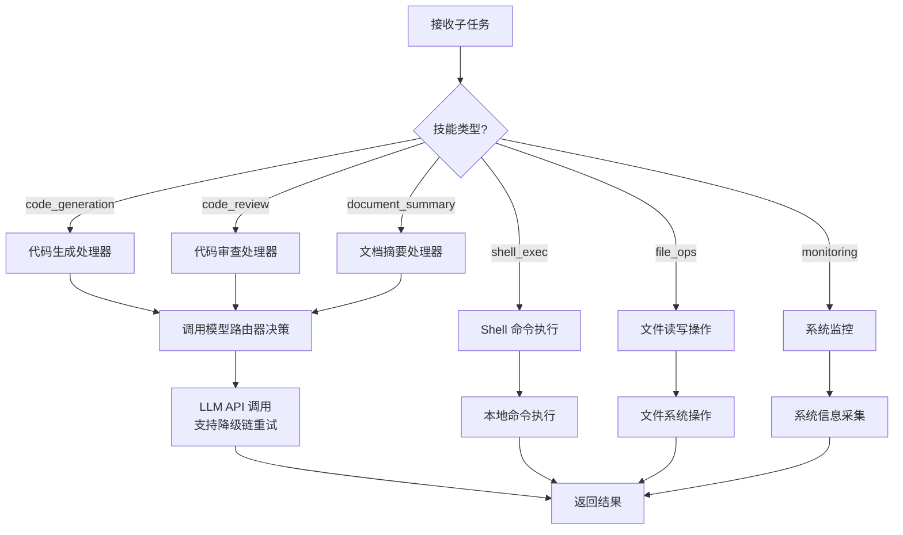

图表来源
- [lan_mesh/agent_runtime.py:57-94](file://lan_mesh/agent_runtime.py#L57-L94)
- [lan_mesh/agent_runtime.py:191-230](file://lan_mesh/agent_runtime.py#L191-L230)
- [lan_mesh/agent_runtime.py:248-300](file://lan_mesh/agent_runtime.py#L248-L300)

章节来源
- [lan_mesh/agent_runtime.py:1-305](file://lan_mesh/agent_runtime.py#L1-L305)

### Master 控制器
- 职责
  - 采集本机信息（含共享文件夹与配置报告）。
  - 启动 FastAPI（含 Master/Worker 双路由）、WebSocket 推送。
  - 启动 DiscoveryService、离线清理、配置刷新线程。
  - 与 Database、Discovery、SharedFolder、Orchestrator、MCPGateway、ModelRouter、ProjectManager 协作。
- 生命周期
  - start() 前自检、端口选择、启动服务与后台线程。
  - stop() 停止 DiscoveryService。

章节来源
- [lan_mesh/master.py:1-319](file://lan_mesh/master.py#L1-L319)

### Worker 守护进程
- 职责
  - 采集本机信息并生成配置报告。
  - 启动 DiscoveryService 发现 Master。
  - 注册主机信息与 Agent Card，周期性心跳上报。
  - 暴露 /info、/shared、/tasks/execute 等 API。
- 生命周期
  - start() 前自检、端口选择、启动服务与心跳线程。
  - stop() 停止 DiscoveryService。

章节来源
- [lan_mesh/worker.py:1-325](file://lan_mesh/worker.py#L1-L325)

## 依赖关系分析
- 模块耦合
  - Master/Worker 通过 DiscoveryService 与 HTTP API 交互；Master 依赖 Database 与 Orchestrator。
  - Orchestrator 依赖 Database 与 TaskDAG；TaskDAG 依赖 SubTask。
  - API 路由依赖 SharedFolderManager、DiscoveryService、Database、Agent/Task/Project/MCP 等。
  - **新增依赖**：ModelRouter 依赖 ProjectManager；ProjectManager 依赖 Database；AgentRuntime 依赖 ModelRouter。
- 外部依赖
  - psutil（主机信息采集）、fastapi/uvicorn（HTTP/WebSocket）、requests（HTTP 调用）、sqlite3（内置）、pydantic/yaml（配置）。
- 循环依赖
  - 未见直接循环；API 路由在控制器中注入实例，避免循环导入。

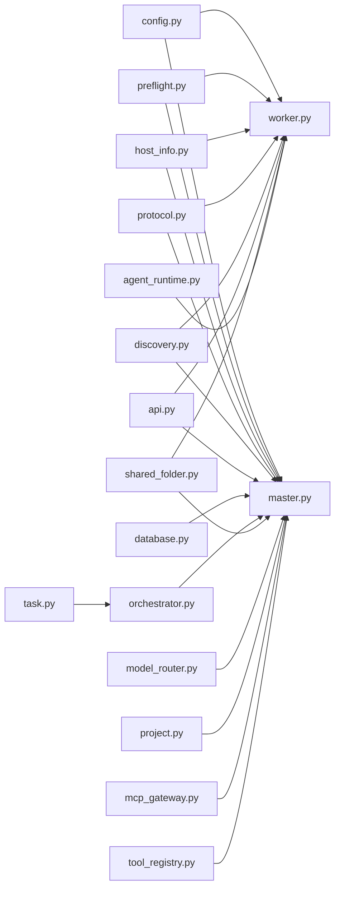

图表来源
- [lan_mesh/config.py:1-139](file://lan_mesh/config.py#L1-L139)
- [lan_mesh/preflight.py:1-290](file://lan_mesh/preflight.py#L1-L290)
- [lan_mesh/host_info.py:1-212](file://lan_mesh/host_info.py#L1-L212)
- [lan_mesh/protocol.py:1-388](file://lan_mesh/protocol.py#L1-L388)
- [lan_mesh/discovery.py:1-259](file://lan_mesh/discovery.py#L1-L259)
- [lan_mesh/api.py:1-539](file://lan_mesh/api.py#L1-L539)
- [lan_mesh/database.py:1-611](file://lan_mesh/database.py#L1-L611)
- [lan_mesh/orchestrator.py:1-287](file://lan_mesh/orchestrator.py#L1-L287)
- [lan_mesh/task.py:1-91](file://lan_mesh/task.py#L1-L91)
- [lan_mesh/shared_folder.py:1-219](file://lan_mesh/shared_folder.py#L1-L219)
- [lan_mesh/model_router.py:1-327](file://lan_mesh/model_router.py#L1-L327)
- [lan_mesh/project.py:1-320](file://lan_mesh/project.py#L1-L320)
- [lan_mesh/mcp_gateway.py:1-280](file://lan_mesh/mcp_gateway.py#L1-L280)
- [lan_mesh/agent_runtime.py:1-305](file://lan_mesh/agent_runtime.py#L1-L305)
- [lan_mesh/tool_registry.py:1-338](file://lan_mesh/tool_registry.py#L1-L338)

章节来源
- [lan_mesh/master.py:1-319](file://lan_mesh/master.py#L1-L319)
- [lan_mesh/worker.py:1-325](file://lan_mesh/worker.py#L1-L325)
- [lan_mesh/api.py:1-539](file://lan_mesh/api.py#L1-L539)

## 性能考量
- 线程与并发
  - DiscoveryService 使用多线程分别处理广播、监听与清理；Database 每线程独占连接，避免锁争用。
  - Orchestrator 调度循环与子任务执行采用异步线程，避免阻塞主流程。
  - **新增**：ModelRouter 预计算成本基准，避免重复计算；ProjectManager 使用阈值检查快速判断预算状态。
- 网络与 I/O
  - UDP 广播频率与 TTL 可调，平衡发现及时性与网络负载。
  - 文件共享基于本地目录，上传/下载受磁盘 I/O 与网络带宽限制。
  - **新增**：MCP 工具网关使用连接池减少连接开销，支持自动重连。
- 数据库
  - 合理使用索引（已针对高频查询建立索引），避免大表全表扫描。
  - 定期清理旧心跳与用量日志，控制表规模。
  - **新增**：项目预算查询使用阈值快速判断，减少不必要的数据库访问。

## 故障排查指南
- 启动前自检
  - 检查 Python 版本、依赖、配置文件、数据目录、共享文件夹、网络接口、UDP 端口、HTTP 端口、数据库目录（Master）、Web 模板（Master）。
  - 若配置文件缺失，自检会自动创建默认配置。
- 常见问题
  - UDP 端口被占用：更换 discovery.port 或释放端口。
  - HTTP 端口被占用：程序会自动寻找可用端口，可通过日志确认最终端口。
  - 网络不可用：确保至少存在一个非回环 IPv4 接口。
  - 权限不足：确保数据目录与共享文件夹可写。
  - **新增**：模型 API Key 未配置：检查 model_pool.yaml 中的 API Key 环境变量。
  - **新增**：项目预算超支：检查项目状态为 suspended，需要充值或调整预算。
- 日志定位
  - Master/Worker 启动日志包含设备 ID、共享目录、数据库路径、HTTP API 端口、局域网访问地址。
  - 发现服务异常会打印绑定失败信息；心跳失败会尝试重新注册。
  - **新增**：模型路由器会打印路由决策详情（难度、评分、策略）。
  - **新增**：项目管理器会打印预算使用情况和超支警告。

章节来源
- [lan_mesh/preflight.py:226-290](file://lan_mesh/preflight.py#L226-L290)
- [lan_mesh/discovery.py:155-175](file://lan_mesh/discovery.py#L155-L175)
- [lan_mesh/worker.py:253-325](file://lan_mesh/worker.py#L253-L325)
- [lan_mesh/master.py:233-319](file://lan_mesh/master.py#L233-L319)

## 结论
Work Station 的核心模块围绕"发现—注册—编排—共享"形成闭环：DiscoveryService 提供设备发现与网络状态，Database 实现可靠持久化，Orchestrator 以 DAG 驱动任务分发，SharedFolderManager 提供简单高效的文件共享。**新增的模型路由器实现了智能的 L1-L4 难度分级与加权评分路由，项目管理器提供了完善的预算控制与隔离机制，MCP 工具网关统一了外部工具的管理和调用，Agent 运行时实现了 Worker 端的多技能任务执行。**模块间通过清晰的 API 与协议边界协作，具备良好的可扩展性与可维护性。

## 附录

### 配置选项
- discovery
  - port：UDP 广播端口（默认 45454）
  - presence_interval：广播间隔（秒，默认 3）
  - device_ttl：设备离线判定阈值（秒，默认 12）
- worker
  - api_port：HTTP API 起始端口（默认 45460）
  - shared_folder：共享文件夹路径（默认 ~/lan_mesh_shared）
  - device_name：设备名称（留空则自动）
- master
  - api_port：HTTP API + Web UI 端口（默认 45470）
  - shared_folder：共享文件夹路径（默认 ~/lan_mesh_shared）
  - device_name：设备名称（留空则自动）
  - db_path：SQLite 数据库路径（默认 ~/.lan_mesh/master.sqlite3）
- **新增**：model_pool.yaml（模型池配置）
  - models：模型列表，包含 id、provider、api_key_env、base_url、cost、capabilities、quality_score、speed_score、rate_limit、max_context_tokens、fallback 等字段。

章节来源
- [lan_mesh/config.py:14-40](file://lan_mesh/config.py#L14-L40)
- [config.yaml:4-22](file://config.yaml#L4-L22)
- [lan_mesh/model_pool.example.yaml:1-139](file://lan_mesh/model_pool.example.yaml#L1-L139)

### API 接口速览
- Worker
  - GET /info：返回本机完整配置
  - GET /shared：列出共享文件
  - GET /shared/{path}：下载共享文件
  - POST /shared：上传文件到共享目录
  - POST /tasks/execute：执行子任务（由 Master 分发）
- Master
  - POST /api/register：Worker 注册（接收完整 HostInfo）
  - POST /api/heartbeat：Worker 心跳（实时资源使用率）
  - GET /api/hosts：所有主机列表
  - GET /api/hosts/{id}：单台主机详情
  - GET /api/network：本机网络状态
  - POST /api/probe/{ip}：主动探测指定 IP
  - GET /api/discovery：UDP 发现到的设备列表
  - WS /ws：实时推送主机状态变更
  - POST /api/agents/register：Agent Card 注册
  - GET /api/agents：Agent 列表
  - GET /api/agents/{agent_id}：Agent 详情
  - POST /api/tasks：提交任务（触发编排）
  - GET /api/tasks：任务列表
  - GET /api/tasks/{task_id}：任务详情
  - POST /api/projects：创建项目
  - GET /api/projects：项目列表
  - GET /api/projects/{project_id}：项目详情（含预算）
  - PUT /api/projects/{project_id}：更新项目
  - DELETE /api/projects/{project_id}：归档项目
  - GET /api/projects/{project_id}/usage：项目用量记录
  - **新增**：POST /api/route/dry-run：路由决策预览
  - **新增**：GET /api/models：模型池列表
  - **新增**：GET /tools/list：列出 MCP 工具
  - **新增**：POST /tools/call：调用 MCP 工具
  - **新增**：GET /tools/servers：列出 MCP 服务器
  - **新增**：POST /tools/servers：注册 MCP 服务器
  - **新增**：DELETE /tools/servers/{name}：注销 MCP 服务器

章节来源
- [lan_mesh/api.py:37-539](file://lan_mesh/api.py#L37-L539)

### 使用场景示例
- 启动 Master
  - python main.py master
  - 访问 Web UI：http://localhost:45470
- 启动 Worker
  - python main.py worker
  - Worker 通过 UDP 发现 Master 并注册，随后周期性心跳上报
- 提交任务
  - 通过 Master 的 /api/tasks 提交任务，Orchestrator 自动分解并分发给具备相应技能的 Agent
  - **新增**：任务执行时自动调用模型路由器进行智能模型选择
- 文件共享
  - 在共享目录放置文件，其他节点通过 /shared 接口下载或上传
- **新增**：创建项目
  - 通过 /api/projects 创建项目，设置预算、模型白名单、路由策略
  - 任务提交时关联项目，自动进行预算检查和消费记录
- **新增**：MCP 工具使用
  - 通过 /tools/list 查看工具列表
  - 通过 /tools/call 调用具体工具
  - 通过 /tools/servers 注册 MCP Server

章节来源
- [main.py:25-90](file://main.py#L25-L90)
- [lan_mesh/master.py:233-319](file://lan_mesh/master.py#L233-L319)
- [lan_mesh/worker.py:253-325](file://lan_mesh/worker.py#L253-L325)
- [lan_mesh/api.py:302-344](file://lan_mesh/api.py#L302-L344)

### Web UI 功能概览
- **新增**：仪表盘界面（深色主题，5个Tab面板）
  - 主机监控：显示所有主机状态、资源使用率
  - 任务管理：提交任务、查看任务状态与子任务 DAG
  - Agent 状态：查看 Agent 能力与工作状态
  - MCP 工具：管理 MCP Server 与工具调用
  - 项目管理：创建项目、查看预算使用情况
- **新增**：实时通信
  - WebSocket 推送主机状态、任务变更、项目事件
  - 自动刷新各面板数据

章节来源
- [lan_mesh/web/templates/dashboard.html:1-466](file://lan_mesh/web/templates/dashboard.html#L1-L466)