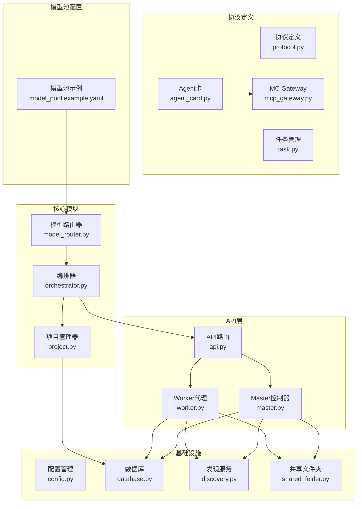
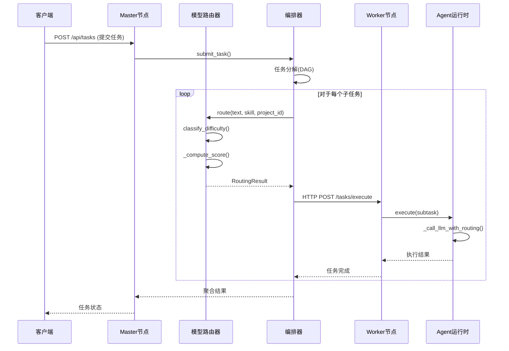
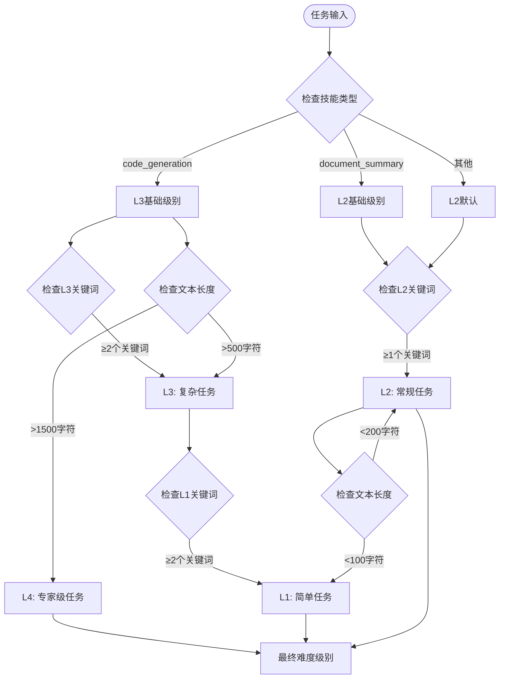
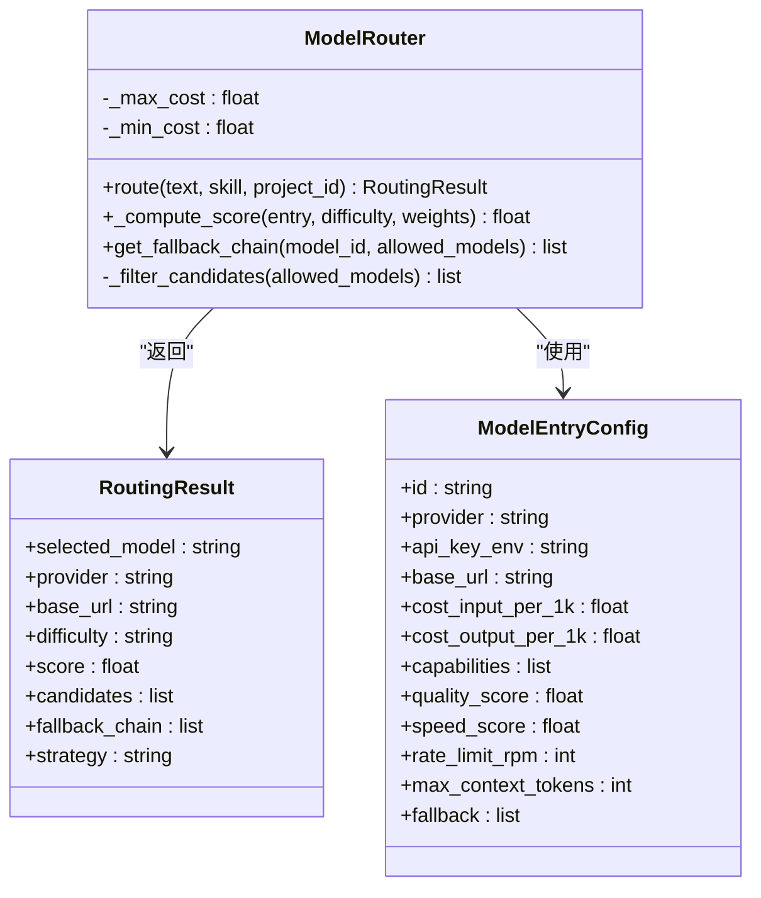
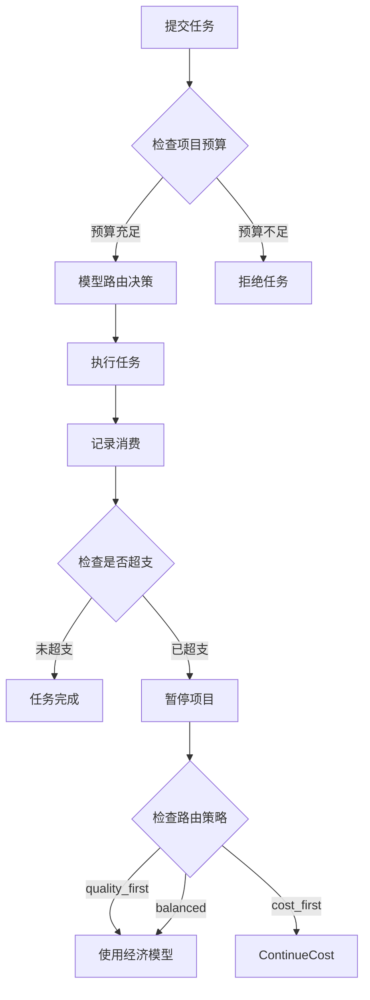
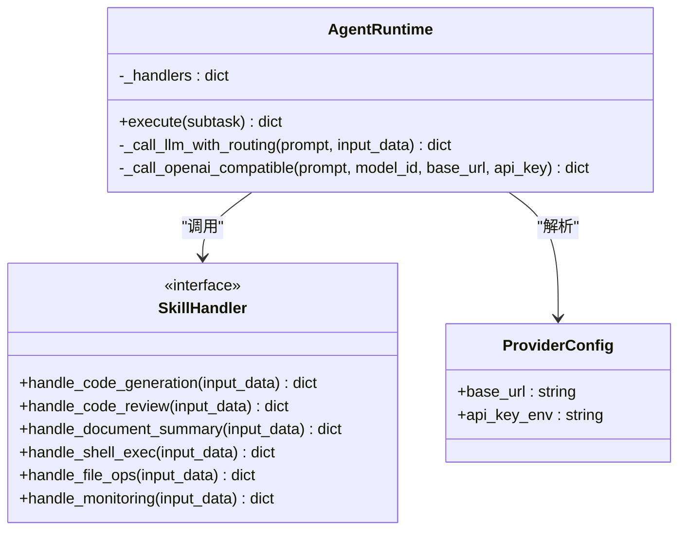
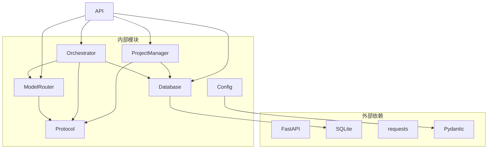

# 模型路由系统

<cite>
**本文档引用的文件**
- [model_router.py](file://lan_mesh/model_router.py)
- [api.py](file://lan_mesh/api.py)
- [master.py](file://lan_mesh/master.py)
- [worker.py](file://lan_mesh/worker.py)
- [orchestrator.py](file://lan_mesh/orchestrator.py)
- [protocol.py](file://lan_mesh/protocol.py)
- [config.py](file://lan_mesh/config.py)
- [database.py](file://lan_mesh/database.py)
- [project.py](file://lan_mesh/project.py)
- [mcp_gateway.py](file://lan_mesh/mcp_gateway.py)
- [task.py](file://lan_mesh/task.py)
- [agent_runtime.py](file://lan_mesh/agent_runtime.py)
- [agent_card.py](file://lan_mesh/agent_card.py)
- [shared_folder.py](file://lan_mesh/shared_folder.py)
- [discovery.py](file://lan_mesh/discovery.py)
- [model_pool.example.yaml](file://lan_mesh/model_pool.example.yaml)
</cite>

## 更新摘要
**变更内容**
- 新增阿里云百炼 Token Plan 模型集成功能
- 添加14个新的AI模型支持（Qwen系列4个、DeepSeek系列3个、Kimi系列3个、GLM系列3个、MiniMax 1个）
- 支持ALIYUN_TOKENPLAN_API_KEY环境变量配置
- 引入订阅制计费模式与现有按令牌计费模式互补

## 目录
1. [简介](#简介)
2. [项目结构](#项目结构)
3. [核心组件](#核心组件)
4. [架构概览](#架构概览)
5. [详细组件分析](#详细组件分析)
6. [依赖关系分析](#依赖关系分析)
7. [性能考虑](#性能考虑)
8. [故障排除指南](#故障排除指南)
9. [结论](#结论)

## 简介

模型路由系统是 LAN Mesh 分布式任务编排平台的核心组件之一，负责智能地为不同类型的AI任务选择最适合的模型。该系统实现了基于难度分级的智能路由算法，支持多种路由策略，并提供了完整的降级链机制。

**更新** 新增阿里云百炼 Token Plan 模型集成功能，支持14个新的AI模型，提供订阅制计费模式，与现有的按令牌计费模式形成互补。

系统的主要特点包括：
- **难度分级系统**：将任务分为L1-L4四个等级，基于规则进行智能分类
- **多目标优化评分**：综合考虑能力匹配度、成本、响应速度和负载率
- **灵活路由策略**：支持成本优先、质量优先和平衡三种策略
- **降级链机制**：当首选模型不可用时自动重试备用模型
- **项目隔离**：支持多项目预算控制和模型限制
- **多供应商支持**：支持OpenAI、DeepSeek、Qwen、阿里云百炼等多种AI供应商

## 项目结构



**图表来源**
- [model_router.py:116-327](file://lan_mesh/model_router.py#L116-L327)
- [api.py:103-557](file://lan_mesh/api.py#L103-L557)
- [master.py:68-332](file://lan_mesh/master.py#L68-L332)
- [worker.py:62-325](file://lan_mesh/worker.py#L62-L325)
- [model_pool.example.yaml:140-331](file://lan_mesh/model_pool.example.yaml#L140-L331)

**章节来源**
- [model_router.py:1-327](file://lan_mesh/model_router.py#L1-L327)
- [api.py:1-570](file://lan_mesh/api.py#L1-L570)
- [master.py:1-332](file://lan_mesh/master.py#L1-L332)
- [worker.py:1-325](file://lan_mesh/worker.py#L1-L325)
- [model_pool.example.yaml:1-331](file://lan_mesh/model_pool.example.yaml#L1-L331)

## 核心组件

### 模型路由器 (ModelRouter)

模型路由器是系统的核心决策引擎，负责：

1. **任务难度分类**：基于规则将任务分为L1-L4四个等级
2. **智能评分算法**：计算每个候选模型的综合评分
3. **路由策略执行**：根据项目配置选择最优路由策略
4. **降级链构建**：为失败场景准备备用模型
5. **多供应商支持**：支持OpenAI、DeepSeek、Qwen、阿里云百炼等多家供应商

**更新** 新增对阿里云百炼 Token Plan 模型的支持，提供订阅制计费模式。

评分算法公式：
```
Score = (能力匹配度 × W_cap) + (成本反向指数 × W_cost) + (响应速度 × W_speed) - (负载率 × W_load)
```

### 任务编排器 (Orchestrator)

编排器负责：
- 任务分解和DAG构建
- Agent匹配和任务分发
- 结果收集和聚合
- 任务生命周期管理

### 项目管理器 (ProjectManager)

项目管理器提供：
- 项目创建、查询、更新、归档
- 预算控制和消费记录
- 模型调用成本计算
- 项目隔离和权限控制

**章节来源**
- [model_router.py:116-327](file://lan_mesh/model_router.py#L116-L327)
- [orchestrator.py:58-287](file://lan_mesh/orchestrator.py#L58-L287)
- [project.py:62-320](file://lan_mesh/project.py#L62-L320)

## 架构概览



**图表来源**
- [api.py:303-327](file://lan_mesh/api.py#L303-L327)
- [orchestrator.py:158-251](file://lan_mesh/orchestrator.py#L158-L251)
- [model_router.py:164-242](file://lan_mesh/model_router.py#L164-L242)
- [agent_runtime.py:191-230](file://lan_mesh/agent_runtime.py#L191-L230)

## 详细组件分析

### 模型难度分类系统

系统实现了基于规则的智能难度分类：



**图表来源**
- [model_router.py:60-104](file://lan_mesh/model_router.py#L60-L104)

难度级别定义：
- **L1 (极简)**：关键词提取、格式转换、简单分类
- **L2 (常规)**：文档摘要、邮件撰写、基础分析
- **L3 (复杂)**：代码生成、多步逻辑推理、技术分析
- **L4 (专家级)**：大型架构设计、深度分析、系统级任务

**章节来源**
- [model_router.py:25-104](file://lan_mesh/model_router.py#L25-L104)

### 智能评分算法

模型评分采用加权求和的方式：



**图表来源**
- [model_router.py:116-327](file://lan_mesh/model_router.py#L116-L327)
- [protocol.py:311-329](file://lan_mesh/protocol.py#L311-L329)
- [config.py:39-53](file://lan_mesh/config.py#L39-L53)

评分组件说明：
- **能力匹配度 (W_cap)**：模型能力覆盖所需能力的比例
- **成本反向指数 (W_cost)**：成本越低得分越高
- **响应速度 (W_speed)**：基于模型的速度评分
- **负载率 (W_load)**：当前系统负载情况

**章节来源**
- [model_router.py:246-284](file://lan_mesh/model_router.py#L246-L284)

### 路由策略配置

系统支持三种路由策略：

| 策略名称 | 能力匹配权重 | 成本权重 | 速度权重 | 负载权重 | 适用场景 |
|---------|-------------|---------|---------|---------|----------|
| balanced | 0.4 | 0.3 | 0.2 | 0.1 | 平衡考虑，通用场景 |
| cost_first | 0.2 | 0.5 | 0.2 | 0.1 | 预算敏感，成本优先 |
| quality_first | 0.6 | 0.1 | 0.2 | 0.1 | 质量优先，对成本不敏感 |

**章节来源**
- [model_router.py:109-113](file://lan_mesh/model_router.py#L109-L113)

### 项目预算控制系统



**图表来源**
- [project.py:176-291](file://lan_mesh/project.py#L176-L291)
- [orchestrator.py:213-225](file://lan_mesh/orchestrator.py#L213-L225)

预算控制机制：
- **预算阈值**：80%使用率时建议切换经济模型
- **超支处理**：100%使用率时自动暂停项目
- **自动恢复**：项目重新激活后恢复正常路由

**章节来源**
- [project.py:174-291](file://lan_mesh/project.py#L174-L291)

### Agent运行时执行引擎

Agent运行时负责实际的任务执行：



**图表来源**
- [agent_runtime.py:38-305](file://lan_mesh/agent_runtime.py#L38-L305)
- [agent_card.py:167-217](file://lan_mesh/agent_card.py#L167-L217)

支持的技能类型：
- **code_generation**：代码生成
- **code_review**：代码审查  
- **document_summary**：文档摘要
- **shell_exec**：Shell命令执行
- **file_ops**：文件操作
- **monitoring**：系统监控

**章节来源**
- [agent_runtime.py:38-305](file://lan_mesh/agent_runtime.py#L38-L305)
- [agent_card.py:16-111](file://lan_mesh/agent_card.py#L16-L111)

### 阿里云百炼 Token Plan 模型集成

**新增** 系统现已支持阿里云百炼 Token Plan 订阅制模型集成功能：

#### 支持的模型系列

1. **Qwen系列**（4个模型）
   - qwen3.7-max：专家级模型，支持长上下文和视觉能力
   - qwen3.7-plus：高级模型，支持多模态能力
   - qwen3.6-plus：中高级模型，支持多模态能力
   - qwen3.6-flash：高性能轻量模型

2. **DeepSeek系列**（3个模型）
   - deepseek-v4-pro：专业级推理模型
   - deepseek-v4-flash：高性能轻量推理模型
   - deepseek-v3.2：通用推理模型

3. **Kimi系列**（3个模型）
   - kimi-k2.7-code：专业代码生成模型
   - kimi-k2.6：高级推理模型
   - kimi-k2.5：通用推理模型

4. **GLM系列**（3个模型）
   - glm-5.2：高级推理模型
   - glm-5.1：中高级推理模型
   - glm-5：通用模型

5. **MiniMax系列**（1个模型）
   - MiniMax-M2.5：专业级推理模型

#### 订阅制计费模式

**更新** 新增订阅制计费模式，与现有按令牌计费模式互补：

- **计费方式**：按Credits计量，无需担心令牌消耗
- **成本设置**：cost_input_per_1k和cost_output_per_1k均为0.0
- **环境变量**：ALIYUN_TOKENPLAN_API_KEY
- **Base URL**：https://token-plan.cn-beijing.maas.aliyuncs.com/compatible-mode/v1

#### 配置示例

```yaml
# 阿里云百炼 Token Plan (订阅制, 多品牌模型统一 Credits 计量)
# 获取 API Key: 百炼控制台 → Token Plan → 成员管理 → 生成 API Key
# 环境变量: export ALIYUN_TOKENPLAN_API_KEY="你的TokenPlan专属Key"
# 注意: Token Plan Key 与普通百炼 API Key 不通用

# -- 千问系列 --
- id: qwen3.7-max
  provider: aliyun-tokenplan
  api_key_env: ALIYUN_TOKENPLAN_API_KEY
  base_url: https://token-plan.cn-beijing.maas.aliyuncs.com/compatible-mode/v1
  cost_input_per_1k: 0.0     # 订阅制, 按Credits计量
  cost_output_per_1k: 0.0
  capabilities: [reasoning, coding, long_context]
  quality_score: 0.95
  speed_score: 0.70
  rate_limit_rpm: 200
  max_context_tokens: 131072
  fallback: [qwen3.7-plus, deepseek-v4-pro, kimi-k2.7-code]
```

**章节来源**
- [model_pool.example.yaml:140-331](file://lan_mesh/model_pool.example.yaml#L140-L331)

## 依赖关系分析



**图表来源**
- [model_router.py:1-20](file://lan_mesh/model_router.py#L1-L20)
- [orchestrator.py:19-21](file://lan_mesh/orchestrator.py#L19-L21)
- [project.py:21-22](file://lan_mesh/project.py#L21-L22)
- [database.py:6-13](file://lan_mesh/database.py#L6-L13)
- [config.py:11-11](file://lan_mesh/config.py#L11-L11)

主要依赖关系：
- **ModelRouter** 依赖 Protocol 定义的数据结构
- **Orchestrator** 依赖 ModelRouter 和 Database
- **ProjectManager** 依赖 Database 和 Protocol
- **API层** 依赖所有核心模块提供服务

**章节来源**
- [model_router.py:1-20](file://lan_mesh/model_router.py#L1-L20)
- [orchestrator.py:19-21](file://lan_mesh/orchestrator.py#L19-L21)
- [project.py:21-22](file://lan_mesh/project.py#L21-L22)

## 性能考虑

### 评分算法优化

1. **预计算成本基准**：在初始化时计算最大最小成本，避免重复计算
2. **候选模型过滤**：提前过滤掉不可用的模型，减少不必要的计算
3. **降级链缓存**：为常用模型建立降级链缓存

### 内存管理

1. **线程安全数据库**：每个线程使用独立的数据库连接
2. **连接池管理**：合理管理HTTP连接，避免资源泄漏
3. **文件操作优化**：使用流式处理大文件，避免内存溢出

### 网络通信优化

1. **批量操作**：支持批量任务提交和查询
2. **连接复用**：重用HTTP连接减少握手开销
3. **超时控制**：合理的超时设置避免长时间阻塞

## 故障排除指南

### 常见问题及解决方案

**问题1：模型路由不生效**
- 检查 `model_pool.yaml` 配置文件是否正确加载
- 验证环境变量中的API Key是否设置
- 确认模型降级链配置是否完整
- **新增** 检查ALIYUN_TOKENPLAN_API_KEY环境变量是否正确配置

**问题2：任务执行失败**
- 检查Worker节点是否正常注册
- 验证Agent运行时是否正确初始化
- 确认网络连接是否正常
- **新增** 验证阿里云百炼Token Plan API Key的有效性

**问题3：预算控制异常**
- 检查项目配置中的预算设置
- 验证消费记录是否正确写入数据库
- 确认路由策略配置是否正确

**问题4：性能问题**
- 检查数据库连接池配置
- 验证线程数量是否合理
- 确认缓存机制是否正常工作

**问题5：阿里云百炼模型无法使用**
- **新增** 确认ALIYUN_TOKENPLAN_API_KEY环境变量已正确设置
- **新增** 验证Token Plan API Key具有相应模型的访问权限
- **新增** 检查网络连接到阿里云百炼Token Plan服务的连通性
- **新增** 确认模型ID在Token Plan中存在且可用

**章节来源**
- [model_router.py:288-327](file://lan_mesh/model_router.py#L288-L327)
- [agent_runtime.py:191-230](file://lan_mesh/agent_runtime.py#L191-L230)
- [project.py:273-291](file://lan_mesh/project.py#L273-L291)

## 结论

模型路由系统通过智能化的难度分类、多目标优化评分和灵活的路由策略，为分布式AI任务提供了高效的模型选择机制。系统的设计充分考虑了可扩展性、可靠性和易用性，在保证性能的同时提供了完善的监控和故障处理能力。

**更新** 新增的阿里云百炼 Token Plan 模型集成功能进一步增强了系统的灵活性，为用户提供了更多样化的AI模型选择。订阅制计费模式与现有的按令牌计费模式形成互补，满足不同用户的需求。

关键优势：
1. **智能决策**：基于任务特征和项目需求的自动化决策
2. **成本控制**：通过预算管理和经济模型降低使用成本
3. **高可用性**：完整的降级链机制确保服务连续性
4. **可扩展性**：模块化设计支持功能扩展和性能优化
5. **多供应商支持**：支持多种AI供应商，提供灵活的选择
6. **订阅制模式**：新增的Token Plan支持提供稳定的成本控制

未来发展方向：
- 引入机器学习模型优化路由决策
- 增加实时性能监控和自适应调整
- 扩展更多类型的模型和技能支持
- 优化大规模集群的路由效率
- **新增** 扩展更多第三方AI供应商的集成
- **新增** 优化订阅制模型的使用体验和成本控制