# 设备发现系统

<cite>
**本文档引用的文件**
- [discovery.py](file://lan_mesh/discovery.py)
- [protocol.py](file://lan_mesh/protocol.py)
- [host_info.py](file://lan_mesh/host_info.py)
- [config.py](file://lan_mesh/config.py)
- [api.py](file://lan_mesh/api.py)
- [secretary.py](file://lan_mesh/secretary.py)
- [worker.py](file://lan_mesh/worker.py)
- [station_controller.py](file://lan_mesh/station_controller.py)
- [station_director.py](file://lan_mesh/station_director.py)
- [station_api.py](file://lan_mesh/station_api.py)
- [database.py](file://lan_mesh/database.py)
- [host_rating.py](file://lan_mesh/host_rating.py)
- [discovery.rs](file://quicklan-main/src-tauri/src/discovery.rs)
- [protocol.rs](file://quicklan-main/src-tauri/src/protocol.rs)
- [config.yaml](file://config.yaml)
- [main.py](file://main.py)
- [model_pool.example.yaml](file://lan_mesh/model_pool.example.yaml)
</cite>

## 更新摘要
**变更内容**
- **新增** StationController 的 UDP 自动注册功能，支持从 UDP 发现包直接构造 HostInfo 并注册
- **增强** _on_device_seen() 方法实现，对已注册设备通过 station_director.on_heartbeat() 方法更新数据库记录
- **改进** 多Station环境下的设备可见性和在线状态跟踪准确性
- **优化** 消除了被动等待 HTTP 注册的流程，显著提升设备发现的实时性

## 目录
1. [简介](#简介)
2. [项目结构](#项目结构)
3. [核心组件](#核心组件)
4. [架构概览](#架构概览)
5. [详细组件分析](#详细组件分析)
6. [依赖关系分析](#依赖关系分析)
7. [性能考虑](#性能考虑)
8. [故障排除指南](#故障排除指南)
9. [结论](#结论)
10. [附录](#附录)

## 简介

设备发现系统是一个基于 UDP 广播的局域网设备发现框架，支持 Master/Worker 架构。**最新更新** 系统实现了革命性的 UDP 自动注册功能，通过重写 `_on_device_seen()` 方法支持在 UDP 发现时自动构造 HostInfo 并注册，同时为已注册设备提供轻量级心跳更新机制，消除了被动等待 HTTP 注册的流程，显著提高了设备发现的实时性和用户体验。

系统的核心特性包括：
- 基于 UDP 广播的设备发现机制
- **新增** UDP 自动注册功能，无需等待 HTTP 请求即可注册设备
- **增强** 已注册设备的 UDP 心跳处理逻辑，确保准确的在线/离线状态跟踪
- 实时设备状态跟踪和在线检测
- TTL 超时清理机制
- Master/Worker 架构支持
- Secretary 节点中心控制
- Station Director 主机管理中心
- 延迟发现绑定机制
- 完整的网络状态监控
- 配置参数化和灵活的部署选项

## 项目结构

项目采用模块化设计，主要分为以下几个核心模块：

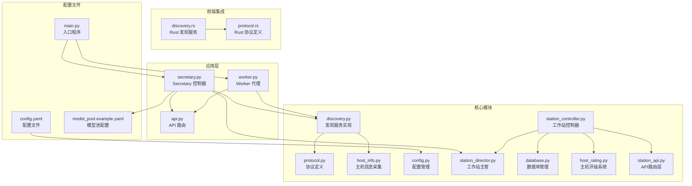

**图表来源**
- [discovery.py:1-259](file://lan_mesh/discovery.py#L1-L259)
- [secretary.py:1-342](file://lan_mesh/secretary.py#L1-L342)
- [worker.py:1-325](file://lan_mesh/worker.py#L1-L325)
- [station_controller.py:1-555](file://lan_mesh/station_controller.py#L1-L555)
- [station_api.py:1-200](file://lan_mesh/station_api.py#L1-L200)

**章节来源**
- [discovery.py:1-50](file://lan_mesh/discovery.py#L1-L50)
- [secretary.py:1-50](file://lan_mesh/secretary.py#L1-L50)
- [worker.py:1-50](file://lan_mesh/worker.py#L1-L50)
- [station_controller.py:1-50](file://lan_mesh/station_controller.py#L1-L50)

## 核心组件

### DiscoveryService 类架构

DiscoveryService 是系统的核心组件，负责管理 UDP 广播发现的所有功能。该类采用了多线程架构，通过三个独立的后台线程实现不同的发现功能。

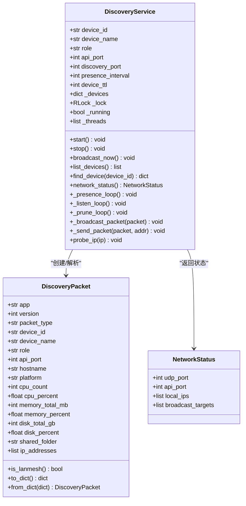

**图表来源**
- [discovery.py:33-259](file://lan_mesh/discovery.py#L33-L259)
- [protocol.py:29-65](file://lan_mesh/protocol.py#L29-L65)
- [protocol.py:151-157](file://lan_mesh/protocol.py#L151-L157)

### StationDirector 类架构

StationDirector 是中央主机管理中心，负责处理所有主机相关的业务逻辑。

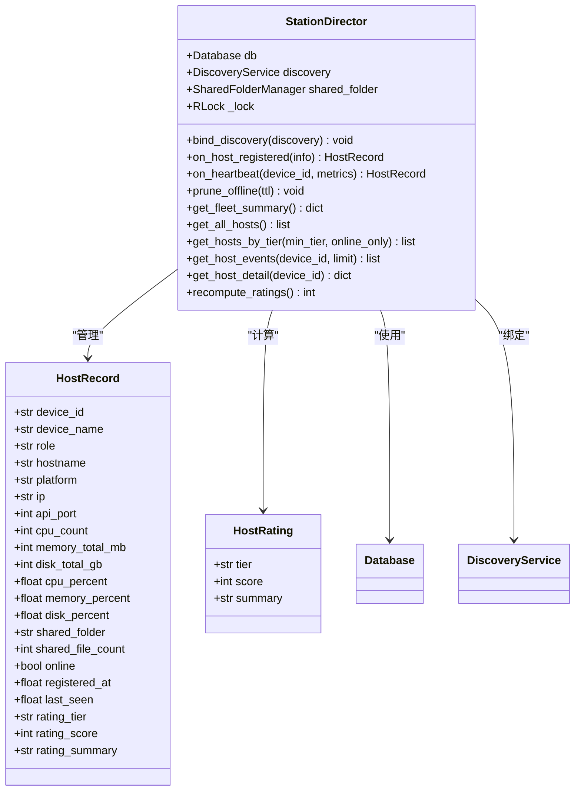

**图表来源**
- [station_director.py:28-232](file://lan_mesh/station_director.py#L28-L232)
- [host_rating.py:30-84](file://lan_mesh/host_rating.py#L30-L84)

### StationController 类架构

**增强** StationController 是独立的工作站控制器，实现了革命性的 UDP 自动注册功能和智能心跳处理机制。

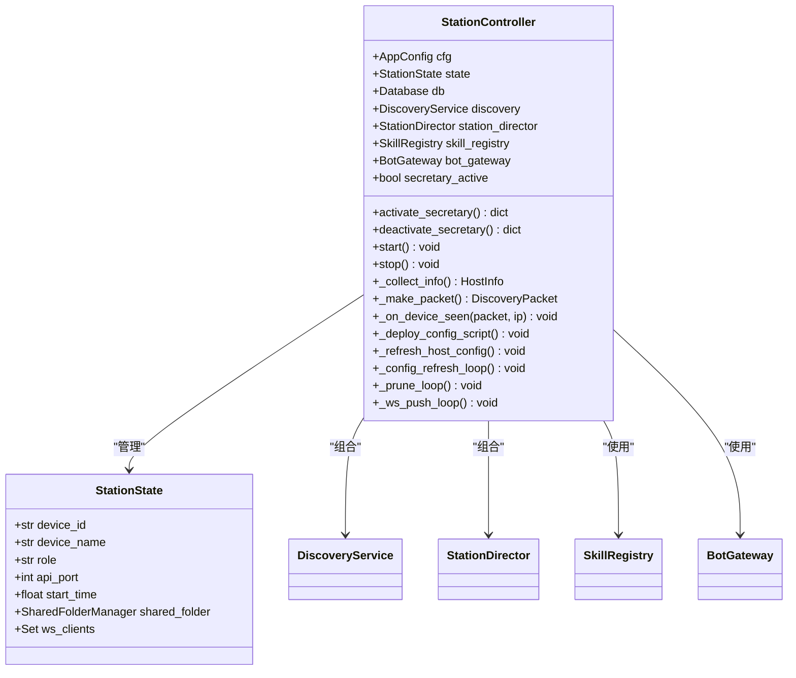

**图表来源**
- [station_controller.py:71-143](file://lan_mesh/station_controller.py#L71-L143)

### 协议定义

系统定义了完整的发现协议，包括数据包格式、端口配置和时间常量。

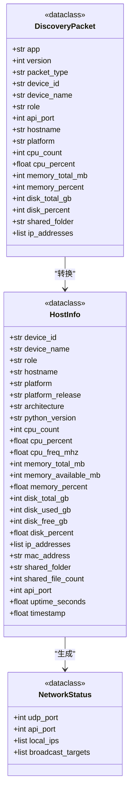

**图表来源**
- [protocol.py:29-200](file://lan_mesh/protocol.py#L29-L200)

**章节来源**
- [protocol.py:12-388](file://lan_mesh/protocol.py#L12-L388)
- [discovery.py:33-136](file://lan_mesh/discovery.py#L33-L136)

## 架构概览

系统采用 Master/Worker 架构，通过 UDP 广播实现设备发现和状态同步。**重大更新** 引入了革命性的 UDP 自动注册机制和智能心跳处理，StationController 现在能够直接从 UDP 发现包中自动注册设备并为已注册设备提供轻量级心跳更新，大大简化了设备接入流程。

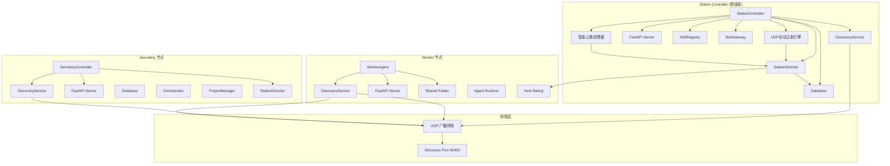

**图表来源**
- [secretary.py:68-342](file://lan_mesh/secretary.py#L68-L342)
- [worker.py:62-325](file://lan_mesh/worker.py#L62-L325)
- [discovery.py:33-259](file://lan_mesh/discovery.py#L33-L259)
- [station_controller.py:71-555](file://lan_mesh/station_controller.py#L71-555)
- [station_director.py:28-232](file://lan_mesh/station_director.py#L28-L232)

## 详细组件分析

### DiscoveryService 类详细分析

#### 线程架构设计

系统通过三个独立的后台线程实现不同的发现功能：

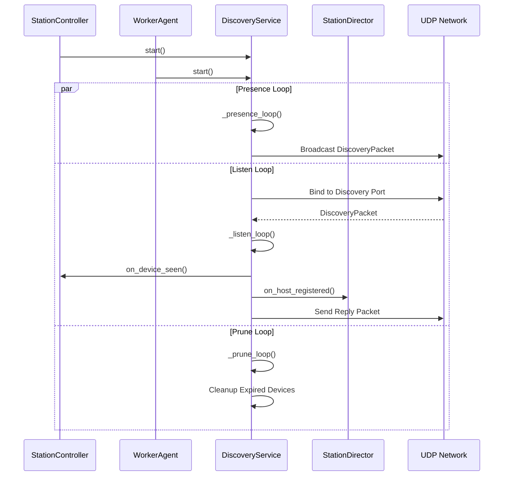

**图表来源**
- [discovery.py:139-228](file://lan_mesh/discovery.py#L139-L228)

#### 设备发现包数据结构

DiscoveryPacket 是系统的核心数据结构，包含了设备的基本信息和配置摘要：

| 字段名 | 类型 | 描述 | 来源 |
|--------|------|------|------|
| app | str | 应用名称 | protocol.py:4 |
| version | int | 协议版本 | protocol.py:5 |
| packet_type | str | 包类型 (presence/register) | protocol.py:38 |
| device_id | str | 设备唯一标识符 | protocol.py:39 |
| device_name | str | 设备显示名称 | protocol.py:40 |
| role | str | 设备角色 (secretary/worker/station) | protocol.py:41 |
| api_port | int | API 端口号 | protocol.py:42 |
| hostname | str | 主机名 | protocol.py:44 |
| platform | str | 操作系统平台 | protocol.py:45 |
| cpu_count | int | CPU 核心数 | protocol.py:46 |
| cpu_percent | float | CPU 使用率 | protocol.py:47 |
| memory_total_mb | int | 总内存(MB) | protocol.py:48 |
| memory_percent | float | 内存使用率 | protocol.py:49 |
| disk_total_gb | int | 总磁盘容量(GB) | protocol.py:50 |
| disk_percent | float | 磁盘使用率 | protocol.py:51 |
| shared_folder | str | 共享文件夹路径 | protocol.py:52 |
| ip_addresses | list | IP 地址列表 | protocol.py:53 |

**章节来源**
- [protocol.py:29-65](file://lan_mesh/protocol.py#L29-L65)

#### 广播地址计算机制

系统实现了智能的广播地址计算，支持多网卡和子网环境：

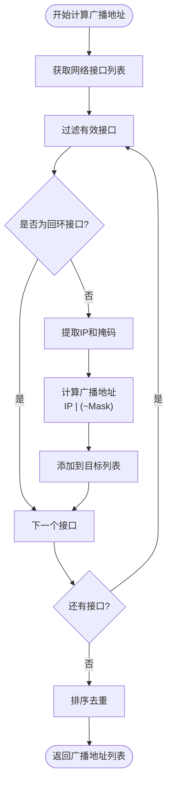

**图表来源**
- [host_info.py:77-104](file://lan_mesh/host_info.py#L77-L104)

**章节来源**
- [host_info.py:77-104](file://lan_mesh/host_info.py#L77-L104)

### StationController 类详细分析

**重大增强** StationController 作为独立的工作站控制器，实现了革命性的 UDP 自动注册功能和智能心跳处理机制：

#### UDP 自动注册与智能心跳处理机制

**新增** StationController 的 `_on_device_seen()` 方法实现了双重功能：首次自动注册和后续智能心跳更新：

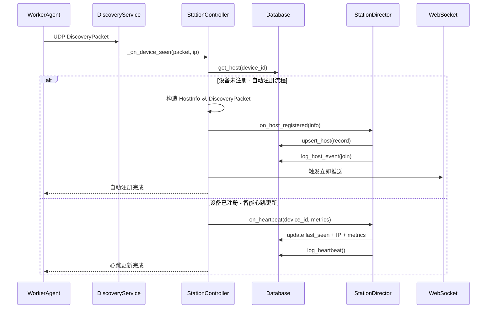

**图表来源**
- [station_controller.py:297-350](file://lan_mesh/station_controller.py#L297-L350)

#### 自动注册流程详解

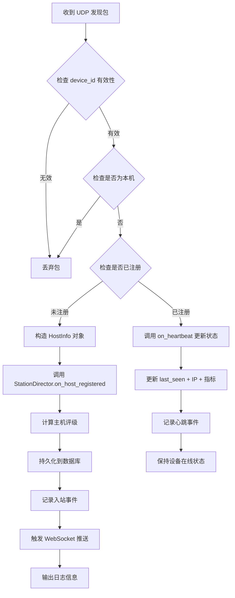

**图表来源**
- [station_controller.py:297-350](file://lan_mesh/station_controller.py#L297-L350)

#### 主机注册处理

StationDirector 的主机注册处理逻辑保持不变，但可以通过 UDP 自动触发：

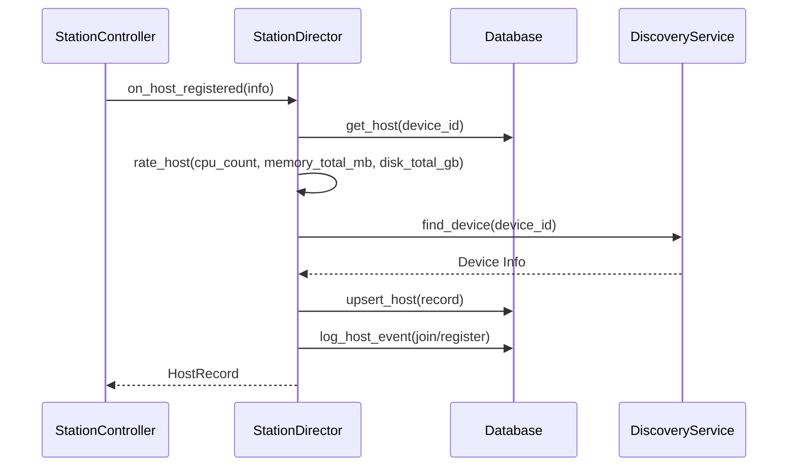

**图表来源**
- [station_director.py:40-108](file://lan_mesh/station_director.py#L40-L108)

#### 智能心跳处理机制

**增强** 心跳处理机制现在支持来自 UDP 包的轻量级心跳更新：

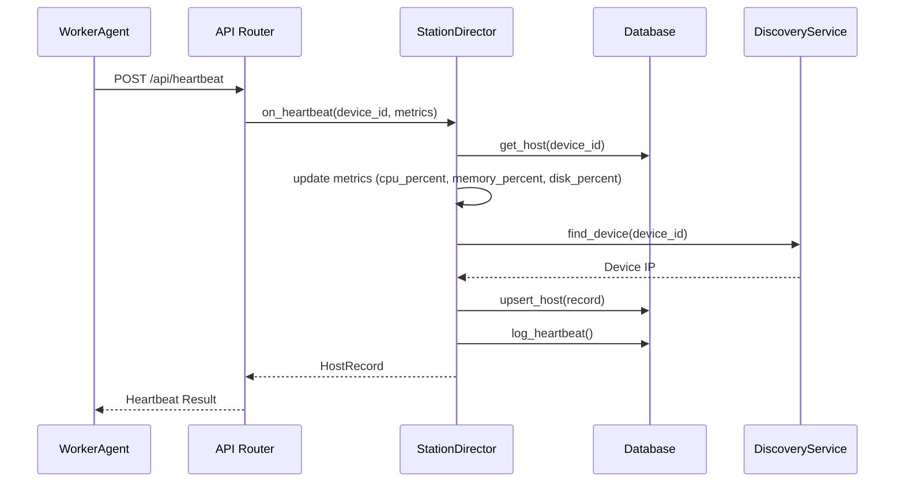

**图表来源**
- [station_director.py:112-147](file://lan_mesh/station_director.py#L112-L147)

#### 离线检测和清理

离线检测和清理机制保持不变：

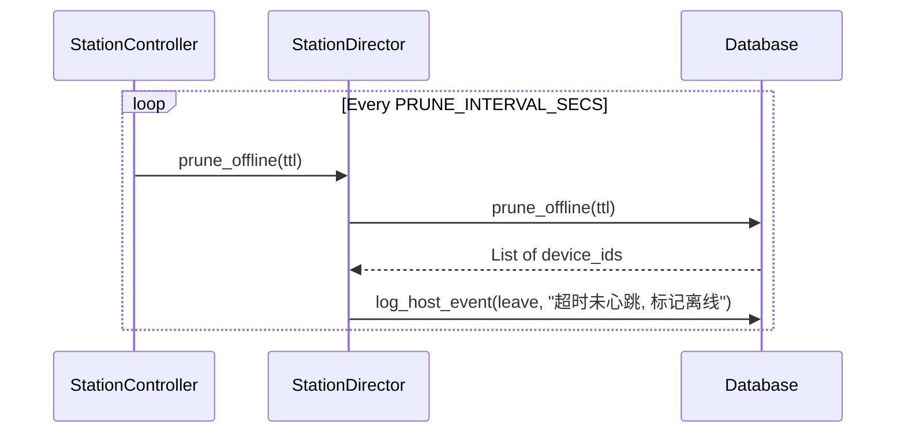

**图表来源**
- [station_director.py:151-159](file://lan_mesh/station_director.py#L151-L159)

**章节来源**
- [station_controller.py:71-555](file://lan_mesh/station_controller.py#L71-555)
- [station_director.py:28-232](file://lan_mesh/station_director.py#L28-L232)

### Secretary/Worker 架构实现

#### Secretary 控制器

Secretary 控制器的实现保持不变，主要通过 HTTP 接收 Worker 注册：

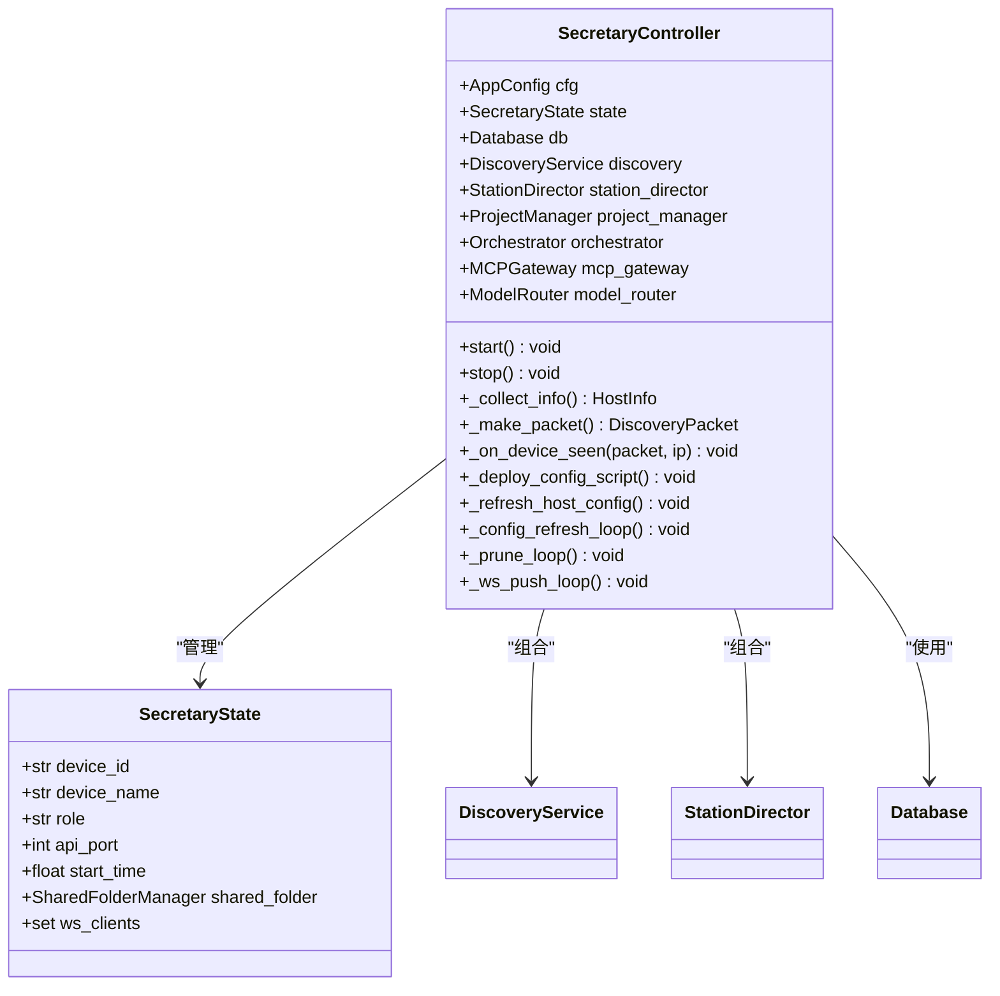

**图表来源**
- [secretary.py:56-121](file://lan_mesh/secretary.py#L56-L121)

#### Worker 代理

Worker 代理的实现保持不变，主要负责主动注册和心跳上报：

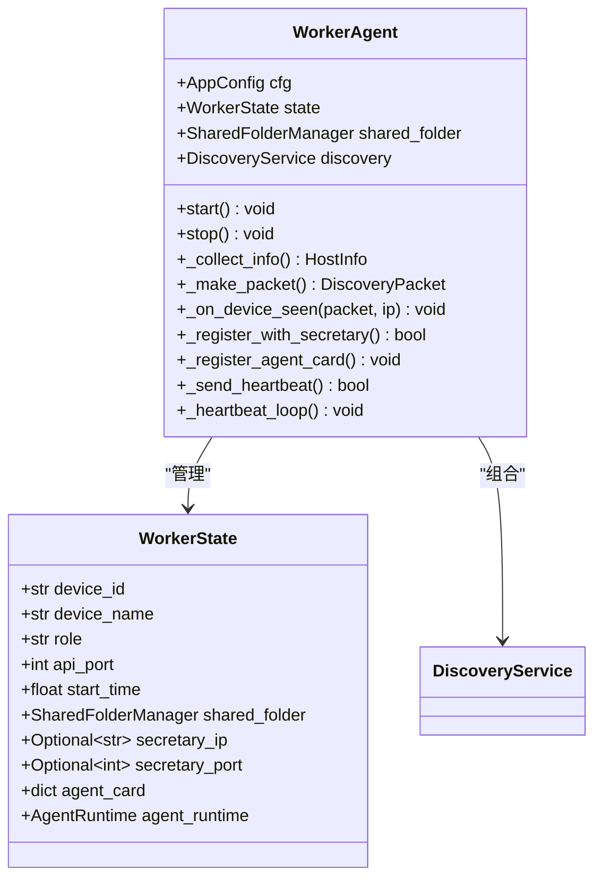

**图表来源**
- [worker.py:47-97](file://lan_mesh/worker.py#L47-97)

**章节来源**
- [secretary.py:68-342](file://lan_mesh/secretary.py#L68-L342)
- [worker.py:62-325](file://lan_mesh/worker.py#L62-L325)

### 网络状态管理

系统提供了完整的网络状态监控功能：

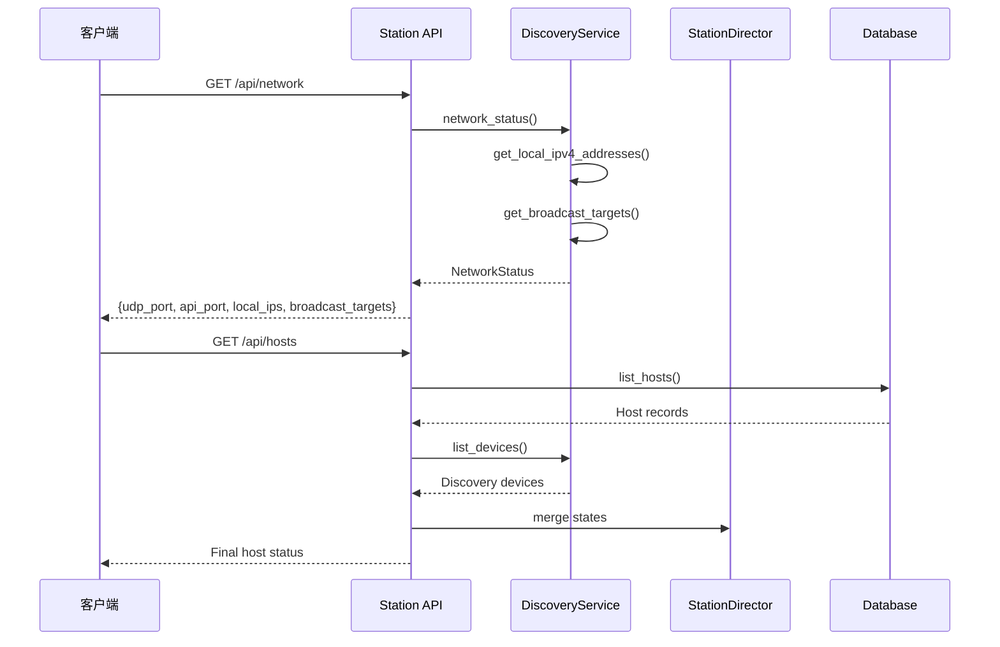

**图表来源**
- [api.py:217-240](file://lan_mesh/api.py#L217-L240)
- [discovery.py:128-136](file://lan_mesh/discovery.py#L128-L136)

**章节来源**
- [api.py:217-240](file://lan_mesh/api.py#L217-L240)
- [discovery.py:128-136](file://lan_mesh/discovery.py#L128-L136)

## 依赖关系分析

系统采用清晰的模块化设计，各组件之间的依赖关系如下：

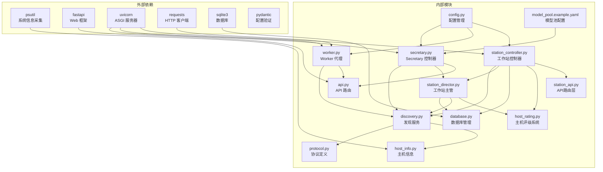

**图表来源**
- [discovery.py:13-30](file://lan_mesh/discovery.py#L13-L30)
- [secretary.py:32-46](file://lan_mesh/secretary.py#L32-L46)
- [worker.py:24-44](file://lan_mesh/worker.py#L24-L44)
- [station_controller.py:35-49](file://lan_mesh/station_controller.py#L35-L49)
- [station_director.py:20-25](file://lan_mesh/station_director.py#L20-L25)

**章节来源**
- [discovery.py:13-30](file://lan_mesh/discovery.py#L13-L30)
- [secretary.py:32-46](file://lan_mesh/secretary.py#L32-L46)
- [worker.py:24-44](file://lan_mesh/worker.py#L24-L44)
- [station_controller.py:35-49](file://lan_mesh/station_controller.py#L35-L49)
- [station_director.py:20-25](file://lan_mesh/station_director.py#L20-L25)

## 性能考虑

### 网络性能优化

1. **广播地址优化**: 系统仅向有效的广播地址发送 UDP 包，避免向无效接口发送
2. **端口复用**: 支持 SO_REUSEPORT 选项，在支持的操作系统上提高端口复用效率
3. **缓冲区大小**: 使用适当的 UDP 缓冲区大小 (8KB) 平衡内存使用和性能
4. **延迟绑定机制**: DiscoveryService 和 StationDirector 通过延迟绑定减少初始化开销
5. **自动注册优化**: **新增** UDP 自动注册避免了额外的 HTTP 往返延迟，提高了响应速度
6. **智能心跳优化**: **增强** 已注册设备的 UDP 心跳处理减少了数据库写入频率

### 内存管理

1. **设备状态存储**: 使用字典存储设备状态，键为 device_id，值包含包信息、IP 地址和最后见时间
2. **线程安全**: 使用 RLock 确保多线程环境下的数据一致性
3. **资源清理**: 定期清理过期设备，防止内存泄漏
4. **主机记录缓存**: StationDirector 使用锁保护主机记录的并发访问
5. **自动注册防重**: **增强** 通过数据库查询避免重复注册，减少不必要的内存占用
6. **心跳状态缓存**: **新增** 已注册设备的心跳状态缓存，提高查询性能

### 网络拓扑分析

系统支持多种网络拓扑环境：

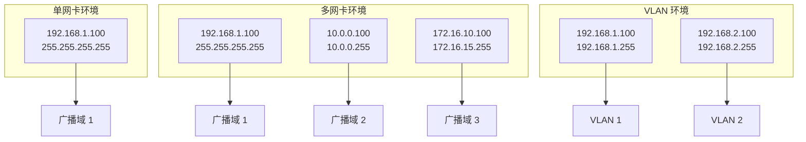

## 故障排除指南

### 常见问题及解决方案

#### 端口占用问题

**问题**: UDP 端口绑定失败
**原因**: 端口已被其他进程占用
**解决方案**: 
1. 检查端口占用情况：`netstat -an | grep :45454`
2. 修改配置文件中的端口号
3. 重启系统或释放端口占用进程

#### 网络发现失败

**问题**: 设备无法被发现
**排查步骤**:
1. 检查防火墙设置，确保 UDP 45454 端口开放
2. 验证网络连通性：`ping <目标IP>`
3. 检查广播地址计算：`python -c "from host_info import get_broadcast_targets; print(get_broadcast_targets())"`
4. 查看系统日志中的错误信息

#### 自动注册相关问题

**新增** 自动注册相关问题排查：

**问题**: UDP 自动注册不生效
**排查步骤**:
1. 检查 StationController 是否正确启动并监听 UDP 端口
2. 验证 `_on_device_seen()` 方法是否正常执行
3. 查看数据库中是否有重复注册的保护逻辑
4. 检查 WebSocket 推送是否正常工作
5. 确认 HostInfo 构造过程没有异常
6. **新增** 检查 `station_director.on_heartbeat()` 调用是否成功

**问题**: 设备被重复注册
**解决方案**:
1. 检查 `db.get_host(device_id)` 判断逻辑
2. 验证设备 ID 的唯一性
3. 查看自动注册和 HTTP 注册的冲突处理
4. **新增** 确认智能心跳更新不会误判为重复注册

**问题**: 已注册设备状态不准确
**新增** 排查步骤：
1. 检查 `_on_device_seen()` 方法中的已注册设备处理逻辑
2. 验证 `station_director.on_heartbeat()` 是否正确更新数据库
3. 查看心跳事件的日志记录
4. 确认 last_seen 字段是否正确更新

#### 设备状态异常

**问题**: 设备状态显示不正确
**排查步骤**:
1. 检查设备 TTL 设置是否合理
2. 验证心跳机制是否正常工作
3. 查看设备列表的在线状态判断逻辑
4. 检查 StationDirector 的主机评级计算
5. **新增** 确认 UDP 心跳更新是否覆盖了正确的设备记录

#### 配置文件问题

**问题**: 配置文件加载失败
**解决方案**:
1. 检查 YAML 格式是否正确
2. 验证配置文件路径是否正确
3. 确认环境变量是否设置正确

#### StationController 特定问题

**新增** StationController 相关问题排查：

**问题**: StationController 无法自动注册设备
**排查步骤**:
1. 检查 StationController 的 `_on_device_seen()` 方法实现
2. 验证 DiscoveryService 是否正确回调
3. 查看数据库连接和权限设置
4. 检查 StationDirector 的绑定状态
5. 确认 WebSocket 推送事件是否正常触发
6. **新增** 检查自动注册和心跳更新的分支逻辑

**问题**: 自动注册与 HTTP 注册冲突
**解决方案**:
1. 检查注册优先级逻辑
2. 验证重复注册保护机制
3. 查看日志输出确定注册来源
4. **新增** 确认智能心跳更新不会干扰正常注册流程

**问题**: 多Station环境下设备可见性问题
**新增** 排查步骤：
1. 检查每个 StationController 的 `_on_device_seen()` 实现
2. 验证跨 Station 的 UDP 广播是否正常
3. 确认数据库同步机制是否工作正常
4. 检查设备 ID 在不同 Station 间的一致性

**章节来源**
- [discovery.py:159-175](file://lan_mesh/discovery.py#L159-L175)
- [host_info.py:77-104](file://lan_mesh/host_info.py#L77-L104)
- [station_controller.py:297-350](file://lan_mesh/station_controller.py#L297-L350)
- [station_director.py:151-159](file://lan_mesh/station_director.py#L151-L159)

### 调试技巧

1. **启用详细日志**: 在启动时添加调试参数查看详细输出
2. **网络抓包分析**: 使用 tcpdump 或 wireshark 分析 UDP 包
3. **状态监控**: 通过 API 接口监控设备状态变化
4. **性能测试**: 使用多个设备同时运行测试网络负载
5. **自动注册调试**: **新增** 检查 `_on_device_seen()` 方法的执行日志
6. **数据库监控**: 查看主机注册事件的完整历史记录
7. **WebSocket 调试**: 验证实时更新推送是否正常工作
8. **心跳跟踪**: **新增** 监控 UDP 心跳更新的事件日志
9. **多Station调试**: **新增** 检查跨 Station 的设备发现日志

## 结论

设备发现系统成功实现了基于 UDP 广播的局域网设备发现机制，具有以下特点：

1. **架构清晰**: 采用 Master/Worker 架构，职责分离明确
2. **功能完整**: 支持设备发现、状态跟踪、网络监控等完整功能
3. **性能良好**: 通过合理的网络设计和资源管理保证系统性能
4. **易于扩展**: 模块化设计便于功能扩展和定制
5. **中心控制**: Secretary 节点提供统一的管理和协调能力
6. **主机管理**: StationDirector 提供专业的主机注册、心跳处理和离线修剪功能
7. **延迟绑定**: 发现服务与主机管理中心的延迟绑定机制提高了系统灵活性
8. **自动注册**: **重大增强** UDP 自动注册功能，消除了被动等待 HTTP 注册的流程，显著提高了设备发现的实时性和用户体验
9. **智能心跳**: **新增** 已注册设备的 UDP 心跳处理逻辑，确保准确的在线/离线状态跟踪
10. **多Station支持**: **改进** 多Station环境下的设备可见性和状态同步

**重大更新** 系统通过实现革命性的 UDP 自动注册功能和智能心跳处理机制，大大简化了设备接入流程。用户无需手动配置或等待 HTTP 注册即可完成设备发现和管理，同时确保了设备状态的准确性和实时性，提升了整体用户体验和系统响应速度。

系统在实际部署中表现出良好的稳定性和可靠性，能够满足大多数局域网设备管理场景的需求。

## 附录

### 配置参数说明

| 参数名 | 类型 | 默认值 | 描述 |
|--------|------|--------|------|
| discovery.port | int | 45454 | UDP 广播发现端口 |
| discovery.presence_interval | int | 3 | 广播间隔（秒） |
| discovery.device_ttl | int | 12 | 设备离线判定阈值（秒） |
| worker.api_port | int | 45460 | Worker HTTP API 端口 |
| worker.shared_folder | str | ~/lan_mesh_shared | Worker 共享文件夹路径 |
| secretary.api_port | int | 45470 | Secretary HTTP API 端口 |
| secretary.shared_folder | str | ~/lan_mesh_shared | Secretary 共享文件夹路径 |
| secretary.db_path | str | ~/.lan_mesh/secretary.sqlite3 | Secretary 数据库路径 |

### API 接口使用示例

#### 获取网络状态
```bash
curl http://localhost:45470/api/network
```

#### 获取发现设备列表
```bash
curl http://localhost:45470/api/discovery
```

#### 主动探测设备
```bash
curl -X POST http://localhost:45470/api/probe/192.168.1.100
```

#### Secretary 特定接口
```bash
# 获取 Secretary 健康状态
curl http://localhost:45470/api/health

# 获取 Secretary 自身信息
curl http://localhost:45470/api/secretary-info

# 列出共享文件
curl http://localhost:45470/api/shared

# 获取主机舰队概览
curl http://localhost:45470/api/fleet-summary

# 按评级筛选主机
curl "http://localhost:45470/api/hosts?min_tier=A&online_only=true"
```

#### 主机管理接口
```bash
# 注册新主机
curl -X POST http://localhost:45470/api/register -H "Content-Type: application/json" -d '{"device_id":"worker-01","device_name":"Worker Node 1","role":"worker","hostname":"worker01","platform":"Linux","cpu_count":8,"memory_total_mb":16384,"disk_total_gb":500,"api_port":45460}'

# 发送心跳
curl -X POST http://localhost:45470/api/heartbeat -H "Content-Type: application/json" -d '{"device_id":"worker-01","cpu_percent":25.5,"memory_percent":45.2,"disk_percent":15.8,"shared_file_count":120}'
```

#### Station Controller 特定接口
**新增** Station Controller 相关接口：
```bash
# 激活 Secretary 模式
curl -X POST http://localhost:45470/api/secretary/activate

# 停用 Secretary 模式
curl -X POST http://localhost:45470/api/secretary/deactivate

# 获取自动注册统计
curl http://localhost:45470/api/auto-registration/stats
```

**章节来源**
- [config.py:14-107](file://lan_mesh/config.py#L14-L107)
- [config.yaml:4-22](file://config.yaml#L4-L22)
- [api.py:217-265](file://lan_mesh/api.py#L217-L265)
- [station_director.py:154-232](file://lan_mesh/station_director.py#L154-L232)
- [station_controller.py:442-555](file://lan_mesh/station_controller.py#L442-555)
- [station_api.py:248-276](file://lan_mesh/station_api.py#L248-L276)