# 项目管理系统

<cite>
**本文档引用的文件**
- [main.py](file://main.py)
- [config.yaml](file://config.yaml)
- [requirements.txt](file://requirements.txt)
- [lan_mesh/__init__.py](file://lan_mesh/__init__.py)
- [lan_mesh/config.py](file://lan_mesh/config.py)
- [station_controller.py](file://lan_mesh/station_controller.py)
- [lan_mesh/worker.py](file://lan_mesh/worker.py)
- [lan_mesh/database.py](file://lan_mesh/database.py)
- [lan_mesh/discovery.py](file://lan_mesh/discovery.py)
- [lan_mesh/api.py](file://lan_mesh/api.py)
- [lan_mesh/host_info.py](file://lan_mesh/host_info.py)
- [lan_mesh/protocol.py](file://lan_mesh/protocol.py)
- [lan_mesh/shared_folder.py](file://lan_mesh/shared_folder.py)
- [lan_mesh/project.py](file://lan_mesh/project.py)
- [quicklan-main/README.md](file://quicklan-main/README.md)
</cite>

## 目录
1. [项目概述](#项目概述)
2. [系统架构](#系统架构)
3. [核心组件](#核心组件)
4. [配置管理](#配置管理)
5. [网络发现机制](#网络发现机制)
6. [项目管理功能](#项目管理功能)
7. [API 接口设计](#api-接口设计)
8. [数据存储架构](#数据存储架构)
9. [性能优化策略](#性能优化策略)
10. [故障排除指南](#故障排除指南)
11. [总结](#总结)

## 项目概述

LAN Mesh 是一个基于 Python 的分布式项目管理系统，实现了跨主机网络连接层框架。该项目借鉴了 QuickLAN 的设计理念，提供了完整的局域网设备发现、主机配置采集、共享文件管理和 Web UI 仪表盘功能。

### 主要特性

- **分布式架构**：支持 Master/Worker 模式的分布式部署
- **自动发现**：基于 UDP 广播的局域网设备自动发现
- **配置管理**：完整的主机配置信息采集和管理
- **文件共享**：基于共享文件夹的跨主机文件传输
- **Web 界面**：直观的仪表盘界面监控所有节点状态
- **项目隔离**：多项目预算控制和资源管理
- **任务编排**：智能的任务分配和执行管理

## 系统架构

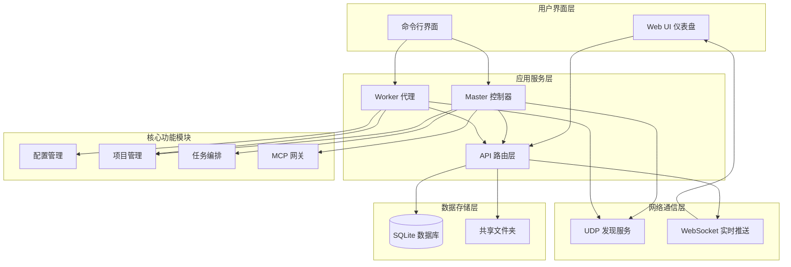

**图表来源**
- [station_controller.py](file://lan_mesh/station_controller.py#L67-L324)
- [lan_mesh/worker.py:62-325](file://lan_mesh/worker.py#L62-L325)
- [lan_mesh/api.py:1-539](file://lan_mesh/api.py#L1-L539)

## 核心组件

### Master 控制器

Master 控制器是系统的核心协调者，负责管理所有 Worker 节点并提供 Web UI 仪表盘。

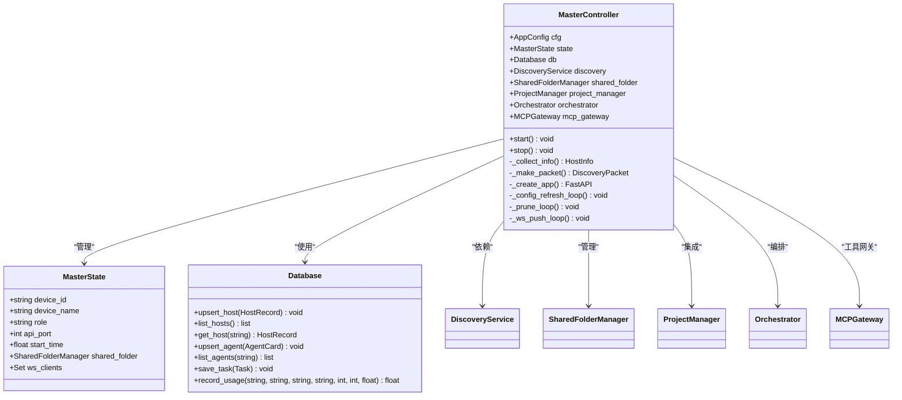

**图表来源**
- [station_controller.py](file://lan_mesh/station_controller.py#L55-L114)
- [lan_mesh/database.py:16-611](file://lan_mesh/database.py#L16-L611)

### Worker 代理

Worker 代理部署在各个主机上，负责自动采集本机配置并向 Master 注册。

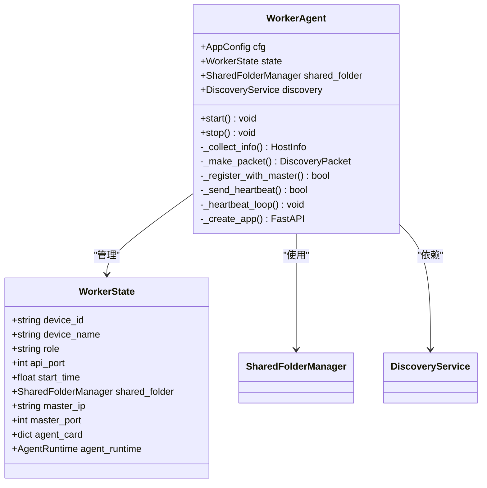

**图表来源**
- [lan_mesh/worker.py:47-96](file://lan_mesh/worker.py#L47-L96)

**章节来源**
- [station_controller.py](file://lan_mesh/station_controller.py#L67-L324)
- [lan_mesh/worker.py:62-325](file://lan_mesh/worker.py#L62-L325)

## 配置管理

系统采用基于 Pydantic 的强类型配置管理，支持多种配置源和环境变量覆盖。

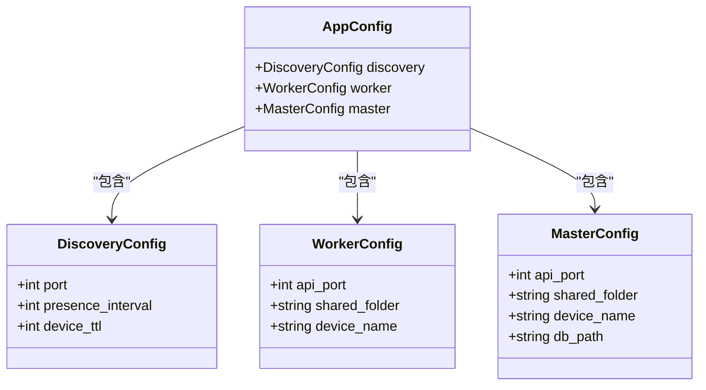

**图表来源**
- [lan_mesh/config.py:14-41](file://lan_mesh/config.py#L14-L41)

### 配置加载流程

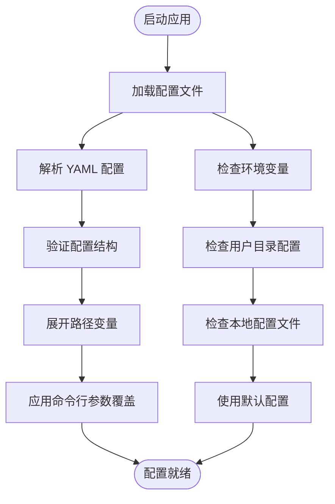

**图表来源**
- [lan_mesh/config.py:48-84](file://lan_mesh/config.py#L48-L84)

**章节来源**
- [lan_mesh/config.py:1-84](file://lan_mesh/config.py#L1-L84)
- [config.yaml:1-22](file://config.yaml#L1-L22)

## 网络发现机制

系统实现了基于 UDP 广播的局域网设备发现机制，支持 Master/Worker 架构。

### 发现服务架构

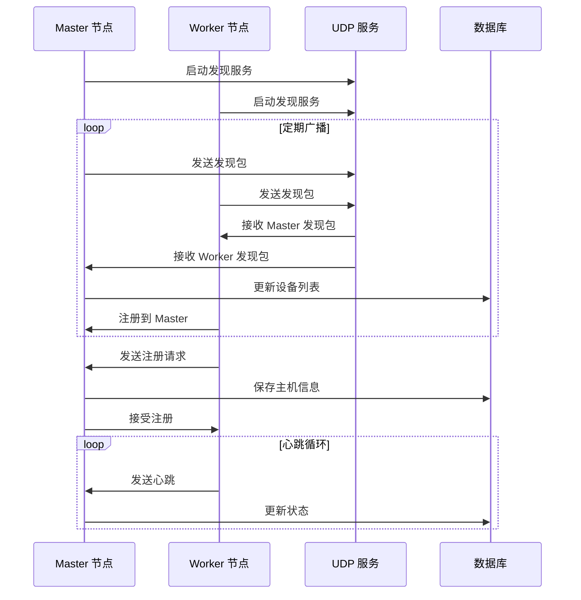

**图表来源**
- [lan_mesh/discovery.py:33-94](file://lan_mesh/discovery.py#L33-L94)
- [lan_mesh/api.py:116-168](file://lan_mesh/api.py#L116-L168)

### 发现包结构

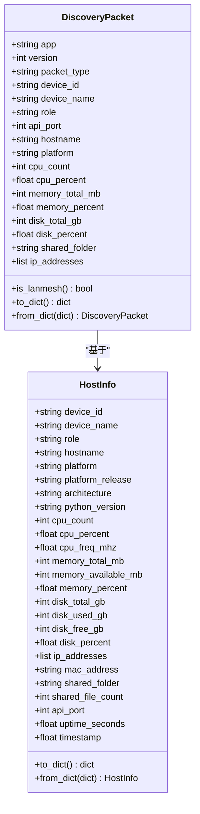

**图表来源**
- [lan_mesh/protocol.py:29-111](file://lan_mesh/protocol.py#L29-L111)

**章节来源**
- [lan_mesh/discovery.py:1-259](file://lan_mesh/discovery.py#L1-L259)
- [lan_mesh/protocol.py:1-356](file://lan_mesh/protocol.py#L1-L356)

## 项目管理功能

系统实现了完整的项目管理功能，包括预算控制、资源隔离和使用统计。

### 项目管理架构

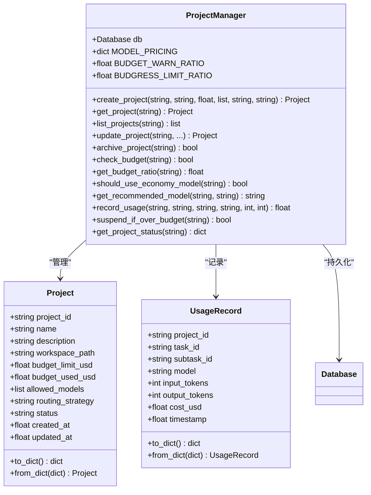

**图表来源**
- [lan_mesh/project.py:62-320](file://lan_mesh/project.py#L62-L320)

### 预算控制策略

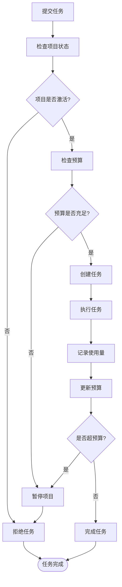

**图表来源**
- [lan_mesh/project.py:176-291](file://lan_mesh/project.py#L176-L291)

**章节来源**
- [lan_mesh/project.py:1-320](file://lan_mesh/project.py#L1-L320)

## API 接口设计

系统提供了完整的 RESTful API 接口，支持 Master 和 Worker 两种角色。

### API 路由架构

```mermaid
graph TB
subgraph "Worker API"
WInfo[GET /info<br/>获取主机信息]
WList[GET /shared<br/>列出共享文件]
WDownload[GET /shared/{path}<br/>下载共享文件]
WUpload[POST /shared<br/>上传文件]
WExecute[POST /tasks/execute<br/>执行任务]
end
subgraph "Master API"
MRegister[POST /api/register<br/>注册 Worker]
MHeartbeat[POST /api/heartbeat<br/>心跳更新]
MHosts[GET /api/hosts<br/>获取主机列表]
MHostDetail[GET /api/hosts/{id}<br/>获取主机详情]
MNetwork[GET /api/network<br/>获取网络状态]
MProbe[POST /api/probe/{ip}<br/>探测 IP]
MDiscovery[GET /api/discovery<br/>获取发现设备]
MAgents[GET /api/agents<br/>获取 Agent 列表]
MTasks[GET /api/tasks<br/>获取任务列表]
MProjects[GET /api/projects<br/>获取项目列表]
MTools[GET /api/tools/list<br/>获取工具列表]
end
subgraph "WebSocket"
WS[WS /ws<br/>实时推送]
end
WInfo --> Worker[Worker 节点]
MRegister --> Master[Master 节点]
WS --> Master
```

**图表来源**
- [lan_mesh/api.py:39-526](file://lan_mesh/api.py#L39-L526)

### 核心 API 功能

| API 端点 | 方法 | 功能描述 | 请求体 | 响应 |
|---------|------|----------|--------|------|
| `/api/register` | POST | Worker 注册 | HostInfo | {ok: true, device_id} |
| `/api/heartbeat` | POST | 心跳更新 | {device_id, cpu_percent, memory_percent, disk_percent} | {ok: true} |
| `/api/hosts` | GET | 获取主机列表 | - | {hosts: [...], total: number, online: number} |
| `/api/agents/register` | POST | Agent 注册 | AgentCard | {ok: true, agent_id} |
| `/api/tasks` | POST | 提交任务 | {name, description, input_data} | Task |
| `/api/projects` | POST | 创建项目 | {name, budget_limit_usd, ...} | Project |
| `/tools/list` | GET | 获取工具列表 | {model: string} | {tools: [...], servers: [...]} |

**章节来源**
- [lan_mesh/api.py:1-539](file://lan_mesh/api.py#L1-L539)

## 数据存储架构

系统使用 SQLite 作为主要数据存储，支持主机信息、任务状态、项目数据和使用记录的持久化。

### 数据库模式设计

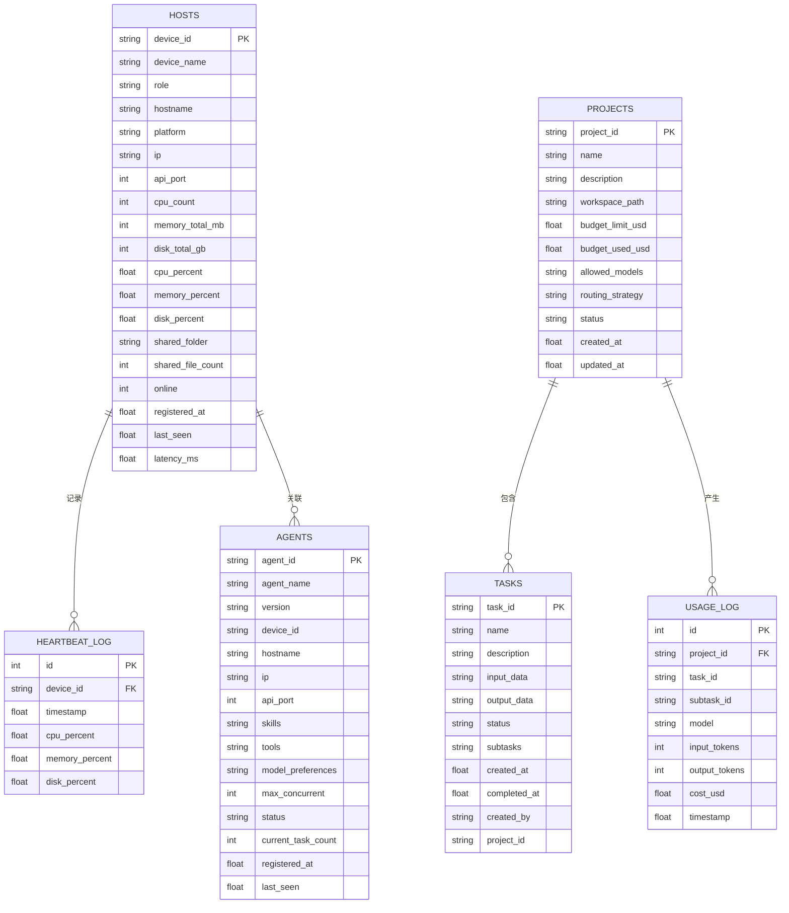

**图表来源**
- [lan_mesh/database.py:36-143](file://lan_mesh/database.py#L36-L143)

### 数据访问模式

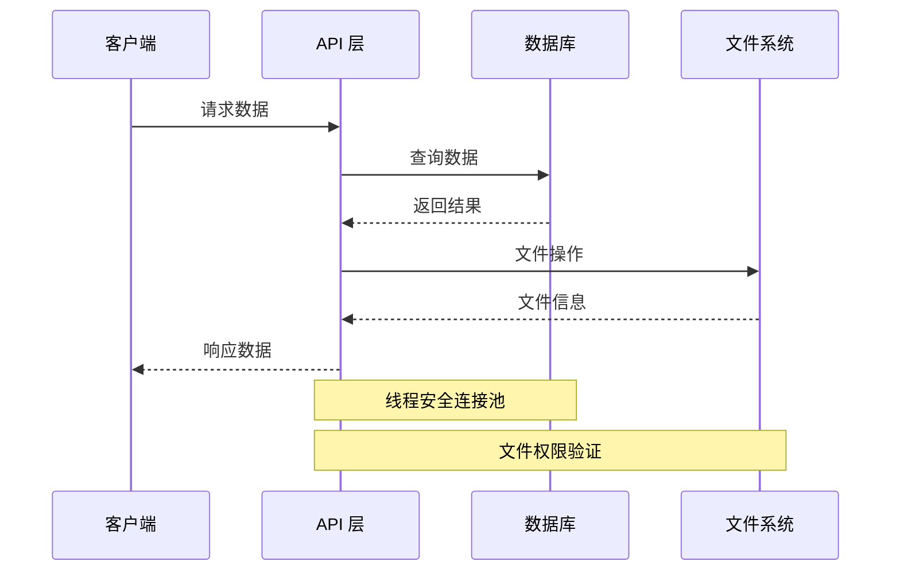

**图表来源**
- [lan_mesh/database.py:22-35](file://lan_mesh/database.py#L22-L35)
- [lan_mesh/shared_folder.py:88-118](file://lan_mesh/shared_folder.py#L88-L118)

**章节来源**
- [lan_mesh/database.py:1-611](file://lan_mesh/database.py#L1-L611)
- [lan_mesh/shared_folder.py:1-219](file://lan_mesh/shared_folder.py#L1-L219)

## 性能优化策略

系统采用了多项性能优化策略来确保在大规模部署场景下的稳定运行。

### 线程池和并发控制

- **线程分离**：发现服务、心跳循环、配置刷新等任务分别在独立线程中运行
- **连接池管理**：SQLite 使用线程本地连接，避免锁竞争
- **异步处理**：WebSocket 推送使用 asyncio 异步处理

### 缓存和索引优化

- **数据库索引**：为常用查询字段建立索引，提高查询性能
- **内存缓存**：设备列表和项目状态在内存中缓存
- **文件系统缓存**：共享文件列表和统计信息缓存

### 网络优化

- **UDP 广播优化**：智能计算广播目标地址，减少无效广播
- **心跳间隔调整**：根据网络状况动态调整心跳频率
- **连接复用**：HTTP 客户端连接复用，减少连接开销

## 故障排除指南

### 常见问题诊断

#### 网络发现问题

**症状**：Worker 无法发现 Master 节点

**排查步骤**：
1. 检查 UDP 端口 45454 是否被占用
2. 验证防火墙设置是否允许 UDP 广播
3. 确认网络子网配置正确
4. 检查设备 ID 生成是否正常

#### 心跳丢失问题

**症状**：Master 显示 Worker 离线

**排查步骤**：
1. 检查 Worker HTTP API 端口连通性
2. 验证网络延迟和丢包率
3. 检查 Worker 进程状态
4. 查看数据库中的心跳记录

#### 数据库连接问题

**症状**：SQLite 连接失败或锁超时

**排查步骤**：
1. 检查数据库文件权限
2. 验证磁盘空间充足
3. 检查 SQLite 版本兼容性
4. 确认没有其他进程占用数据库文件

### 日志分析

系统提供了详细的日志输出，帮助快速定位问题：

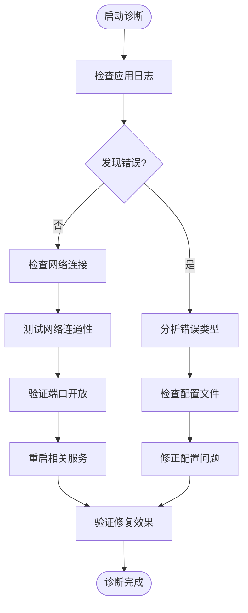

**章节来源**
- [station_controller.py](file://lan_mesh/station_controller.py#L238-L324)
- [lan_mesh/worker.py:253-325](file://lan_mesh/worker.py#L253-L325)

## 总结

LAN Mesh 项目管理系统是一个功能完整、架构清晰的分布式系统。通过 Master/Worker 架构实现了高效的资源管理和任务编排，结合项目预算控制和使用统计功能，为企业级应用提供了强大的支持。

### 系统优势

1. **架构清晰**：模块化设计，职责分离明确
2. **扩展性强**：支持动态添加 Worker 节点
3. **监控完善**：实时状态监控和告警机制
4. **安全性高**：文件权限控制和路径验证
5. **易用性好**：提供 Web UI 和命令行双重界面

### 技术特色

- 借鉴 QuickLAN 的成熟设计，经过实践验证
- 基于 Python 生态系统，开发和维护成本低
- 支持多种操作系统和网络环境
- 完善的错误处理和故障恢复机制

该系统为需要跨主机协作和资源管理的场景提供了可靠的解决方案，具有良好的扩展性和维护性。
