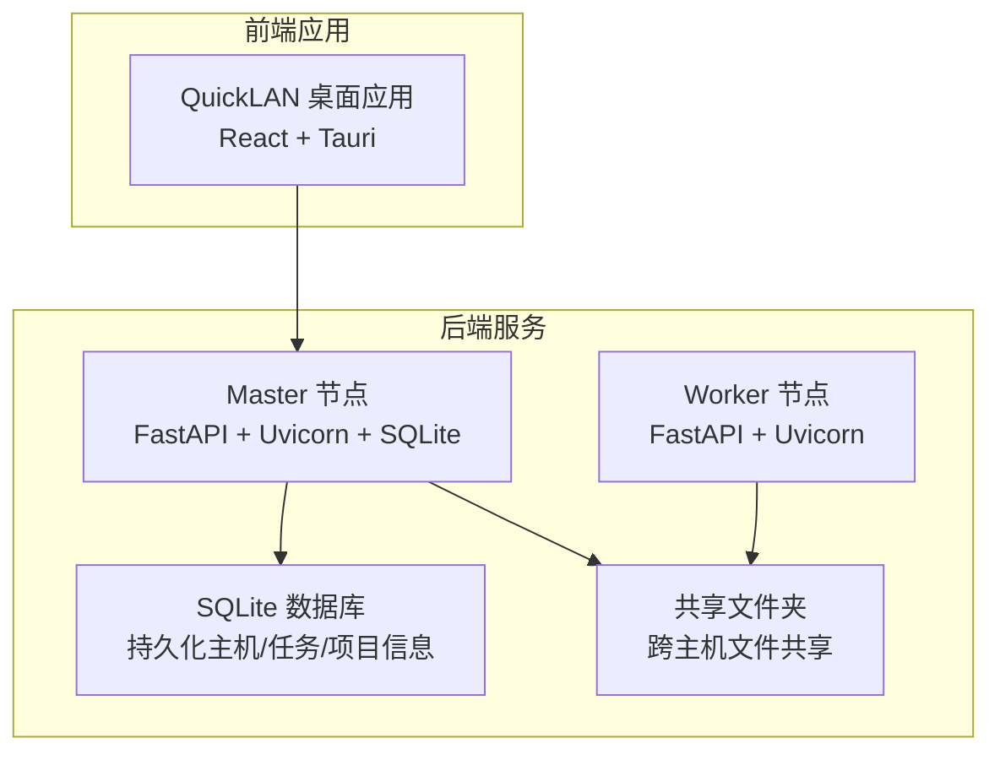
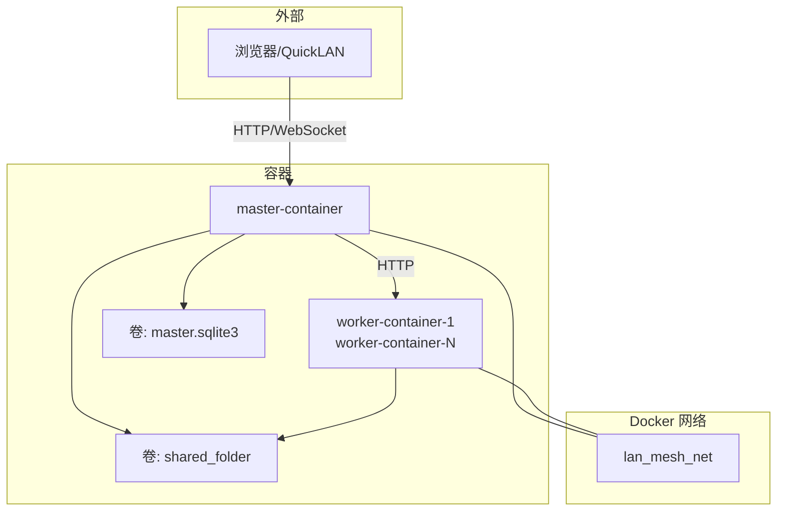
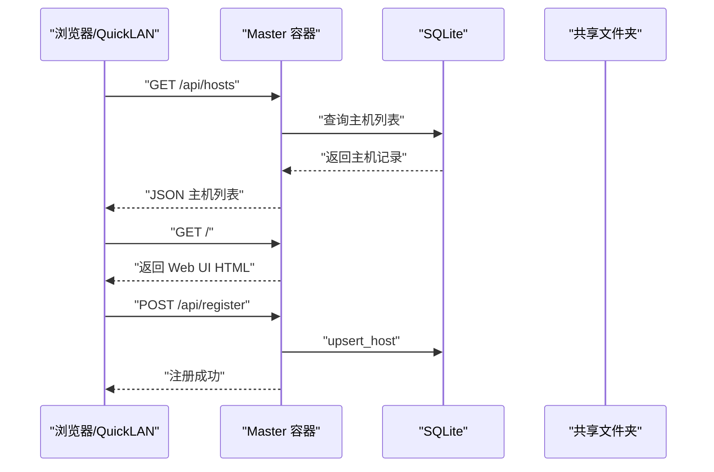
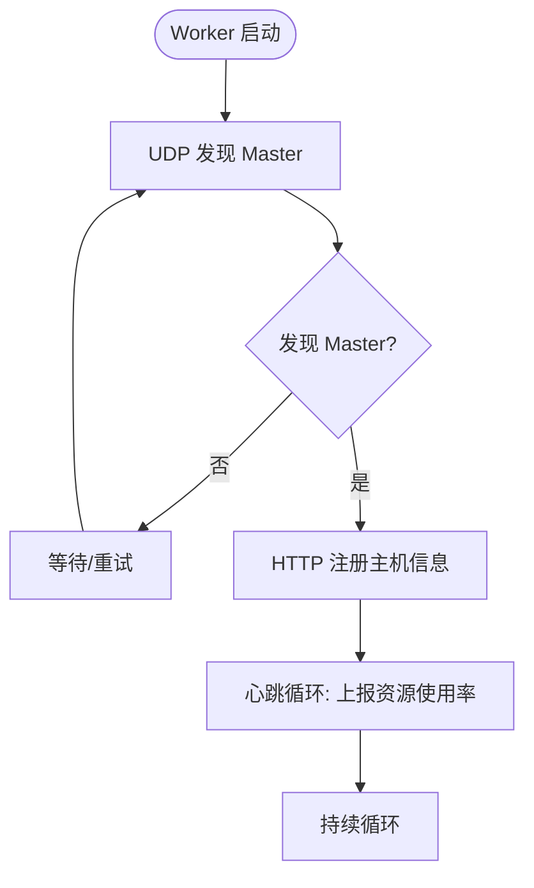
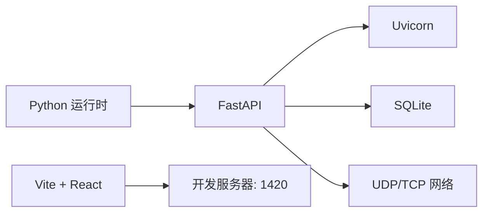

# Docker 容器化部署

<cite>
**本文引用的文件**
- [main.py](file://main.py)
- [requirements.txt](file://requirements.txt)
- [config.yaml](file://config.yaml)
- [lan_mesh/api.py](file://lan_mesh/api.py)
- [station_controller.py](file://lan_mesh/station_controller.py)
- [lan_mesh/worker.py](file://lan_mesh/worker.py)
- [lan_mesh/config.py](file://lan_mesh/config.py)
- [lan_mesh/database.py](file://lan_mesh/database.py)
- [lan_mesh/shared_folder.py](file://lan_mesh/shared_folder.py)
- [quicklan-main/package.json](file://quicklan-main/package.json)
- [quicklan-main/vite.config.ts](file://quicklan-main/vite.config.ts)
- [quicklan-main/src-tauri/tauri.conf.json](file://quicklan-main/src-tauri/tauri.conf.json)
- [quicklan-main/README.md](file://quicklan-main/README.md)
</cite>

## 目录
1. [简介](#简介)
2. [项目结构](#项目结构)
3. [核心组件](#核心组件)
4. [架构总览](#架构总览)
5. [详细组件分析](#详细组件分析)
6. [依赖分析](#依赖分析)
7. [性能考虑](#性能考虑)
8. [故障排查指南](#故障排查指南)
9. [结论](#结论)
10. [附录](#附录)

## 简介
本方案为 Work Station（LAN Mesh）提供完整的 Docker 容器化部署蓝图，涵盖：
- 多阶段 Dockerfile 构建与镜像优化
- docker-compose.yml 服务编排、网络与卷配置
- 容器间通信、端口映射与环境变量
- 安全加固、资源限制与健康检查
- 数据持久化与配置管理策略
- 完整部署命令与使用示例

## 项目结构
Work Station 由两部分组成：
- 后端 Python 服务：LAN Mesh（Master/Worker 节点）
- 前端桌面应用：QuickLAN（React + Tauri），用于本地 GUI 体验

图表来源
- [station_controller.py](file://lan_mesh/station_controller.py#L187-L223)
- [lan_mesh/worker.py:219-238](file://lan_mesh/worker.py#L219-L238)
- [lan_mesh/database.py:16-26](file://lan_mesh/database.py#L16-L26)
- [lan_mesh/shared_folder.py:16-37](file://lan_mesh/shared_folder.py#L16-L37)
- [quicklan-main/src-tauri/tauri.conf.json:1-48](file://quicklan-main/src-tauri/tauri.conf.json#L1-L48)

章节来源
- [main.py:1-90](file://main.py#L1-L90)
- [station_controller.py](file://lan_mesh/station_controller.py#L1-L324)
- [lan_mesh/worker.py:1-325](file://lan_mesh/worker.py#L1-L325)
- [lan_mesh/database.py:1-611](file://lan_mesh/database.py#L1-L611)
- [lan_mesh/shared_folder.py:1-219](file://lan_mesh/shared_folder.py#L1-L219)
- [quicklan-main/README.md:1-54](file://quicklan-main/README.md#L1-L54)

## 核心组件
- Master 控制器：负责 UDP 发现、HTTP API、Web UI、SQLite 持久化、WebSocket 推送、离线清理等
- Worker 代理：负责 UDP 发现、HTTP 注册/心跳、共享文件夹、FastAPI API
- 配置系统：基于 Pydantic 的强类型配置，支持 YAML 与环境变量
- 数据库：SQLite 表结构覆盖主机、心跳、Agent、任务、项目、用量日志
- 共享文件夹：自动创建、文件列举/下载/上传、主机配置报告生成

章节来源
- [station_controller.py](file://lan_mesh/station_controller.py#L67-L324)
- [lan_mesh/worker.py:62-325](file://lan_mesh/worker.py#L62-L325)
- [lan_mesh/config.py:36-84](file://lan_mesh/config.py#L36-L84)
- [lan_mesh/database.py:16-143](file://lan_mesh/database.py#L16-L143)
- [lan_mesh/shared_folder.py:16-219](file://lan_mesh/shared_folder.py#L16-L219)

## 架构总览
容器化后，Master/Worker 作为独立服务运行，共享文件夹与数据库通过卷持久化；前端 QuickLAN 作为本地桌面应用与 Master 交互。

图表来源
- [lan_mesh/api.py:103-112](file://lan_mesh/api.py#L103-L112)
- [lan_mesh/api.py:39-43](file://lan_mesh/api.py#L39-L43)
- [station_controller.py](file://lan_mesh/station_controller.py#L290-L304)
- [lan_mesh/worker.py:304-312](file://lan_mesh/worker.py#L304-L312)

## 详细组件分析

### Master 组件（容器化要点）
- 端口暴露：HTTP API + Web UI 端口（默认 45470），可通过命令行或配置覆盖
- 静态资源：内置 Web UI 模板与静态文件
- 数据持久化：SQLite 数据库存放于用户目录下的 .lan_mesh
- 共享文件夹：自动创建并暴露给 Worker
- UDP 发现：广播自身存在，监听 Worker presence
- WebSocket：实时推送主机状态变更
- 健康检查：提供 /api/health 端点

图表来源
- [lan_mesh/api.py:170-204](file://lan_mesh/api.py#L170-L204)
- [lan_mesh/api.py:116-146](file://lan_mesh/api.py#L116-L146)
- [station_controller.py](file://lan_mesh/station_controller.py#L187-L223)
- [lan_mesh/database.py:147-192](file://lan_mesh/database.py#L147-L192)

章节来源
- [station_controller.py](file://lan_mesh/station_controller.py#L67-L324)
- [lan_mesh/api.py:103-112](file://lan_mesh/api.py#L103-L112)
- [lan_mesh/database.py:16-143](file://lan_mesh/database.py#L16-L143)

### Worker 组件（容器化要点）
- 端口暴露：HTTP API 端口（默认 45460），端口递增策略
- UDP 发现：主动寻找 Master，注册并发送心跳
- 共享文件夹：自动创建，同步主机配置报告
- Agent 运行时：可选的任务执行能力
- 心跳循环：周期性上报资源使用率与共享文件数

图表来源
- [lan_mesh/worker.py:126-146](file://lan_mesh/worker.py#L126-L146)
- [lan_mesh/worker.py:203-215](file://lan_mesh/worker.py#L203-L215)

章节来源
- [lan_mesh/worker.py:62-325](file://lan_mesh/worker.py#L62-L325)

### 配置与环境变量
- 配置来源优先级：显式路径 > 环境变量 > 用户目录 ~/.lan_mesh/config.yaml > 项目根目录 config.yaml
- 关键配置项：discovery.port、worker.api_port、worker.shared_folder、master.api_port、master.shared_folder、master.db_path
- 环境变量：LAN_MESH_CONFIG 指向配置文件路径

章节来源
- [lan_mesh/config.py:48-72](file://lan_mesh/config.py#L48-L72)
- [config.yaml:1-22](file://config.yaml#L1-L22)

### 数据库与共享文件夹
- SQLite：线程安全连接池、索引优化、心跳日志清理
- 共享文件夹：自动创建、文件列举/下载/上传、主机配置报告（JSON/TXT）

章节来源
- [lan_mesh/database.py:16-143](file://lan_mesh/database.py#L16-L143)
- [lan_mesh/shared_folder.py:16-219](file://lan_mesh/shared_folder.py#L16-L219)

## 依赖分析
- Python 运行时：Python 3.8+（requirements.txt 指定依赖）
- 网络协议：UDP 广播（45454）、TCP API（45460-45470）
- 前端开发：Vite + React（QuickLAN 开发服务器端口 1420）

图表来源
- [requirements.txt:1-8](file://requirements.txt#L1-L8)
- [lan_mesh/api.py:26-31](file://lan_mesh/api.py#L26-L31)
- [station_controller.py](file://lan_mesh/station_controller.py#L298-L304)
- [quicklan-main/vite.config.ts:7-13](file://quicklan-main/vite.config.ts#L7-L13)

章节来源
- [requirements.txt:1-8](file://requirements.txt#L1-L8)
- [quicklan-main/vite.config.ts:1-15](file://quicklan-main/vite.config.ts#L1-L15)

## 性能考虑
- 多线程/异步：Master 使用线程处理配置刷新与离线清理，WebSocket 推送使用异步
- 端口冲突检测：启动时自动查找可用端口
- 心跳与清理：固定间隔的心跳与离线清理，避免数据库膨胀
- 文件操作：共享文件夹采用安全路径解析与文件名清洗，避免路径穿越

章节来源
- [station_controller.py](file://lan_mesh/station_controller.py#L160-L183)
- [lan_mesh/worker.py:203-215](file://lan_mesh/worker.py#L203-L215)
- [lan_mesh/shared_folder.py:88-118](file://lan_mesh/shared_folder.py#L88-L118)

## 故障排查指南
- 端口占用：容器启动失败时检查端口是否被占用（45460-45470）
- 权限问题：共享文件夹与数据库目录需具备读写权限
- 网络连通：确保 UDP 45454 可用，Worker 能够发现 Master
- 健康检查：访问 /api/health 确认 Master 正常运行
- 日志定位：容器标准输出与错误输出，结合数据库日志

章节来源
- [lan_mesh/api.py:242-250](file://lan_mesh/api.py#L242-L250)
- [station_controller.py](file://lan_mesh/station_controller.py#L238-L318)
- [lan_mesh/worker.py:253-318](file://lan_mesh/worker.py#L253-L318)

## 结论
通过多阶段 Docker 构建与 docker-compose 编排，Work Station 可实现：
- 高内聚的服务拆分（Master/Worker）
- 易维护的数据持久化（SQLite + 共享文件夹）
- 安全可控的网络与资源边界
- 可观测的健康检查与日志

## 附录

### Dockerfile 多阶段构建建议
- 基础镜像：python:3.11-slim
- 第一阶段：安装系统依赖（如需要编译包）、pip 安装 Python 依赖
- 第二阶段：仅复制运行时产物，最小化镜像体积
- 运行用户：非 root 用户运行，降低安全风险
- 健康检查：/api/health
- 端口暴露：45460-45470（Master/Worker）
- 卷挂载：~/.lan_mesh（数据库）、共享文件夹

章节来源
- [requirements.txt:1-8](file://requirements.txt#L1-L8)
- [lan_mesh/api.py:242-250](file://lan_mesh/api.py#L242-L250)

### docker-compose.yml 配置要点
- 服务定义：master、worker（可扩展多个 worker）
- 网络：自定义桥接网络，便于容器间 DNS 解析
- 端口映射：Master 45470，Worker 45460+（端口递增）
- 环境变量：LAN_MESH_CONFIG 指向配置文件
- 卷挂载：~/.lan_mesh（数据库）、共享文件夹
- 健康检查：/api/health
- 资源限制：CPU/内存配额，OOM 保护

章节来源
- [lan_mesh/config.py:48-72](file://lan_mesh/config.py#L48-L72)
- [config.yaml:1-22](file://config.yaml#L1-L22)
- [lan_mesh/api.py:242-250](file://lan_mesh/api.py#L242-L250)

### 容器间通信与端口映射
- Master/Worker 通过 HTTP 通信（/api/register、/api/heartbeat、/api/hosts）
- WebSocket /ws 实时推送
- UDP 45454 用于设备发现
- 端口范围：45460-45470（Worker 默认 45460，Master 默认 45470）

章节来源
- [lan_mesh/api.py:116-146](file://lan_mesh/api.py#L116-L146)
- [lan_mesh/api.py:501-525](file://lan_mesh/api.py#L501-L525)
- [lan_mesh/worker.py:268-269](file://lan_mesh/worker.py#L268-L269)
- [station_controller.py](file://lan_mesh/station_controller.py#L248-L254)

### 环境变量与配置管理
- LAN_MESH_CONFIG：指向 YAML 配置文件路径
- 配置优先级：显式路径 > 环境变量 > ~/.lan_mesh/config.yaml > ./config.yaml
- 关键参数：discovery.port、worker.api_port、master.api_port、shared_folder、db_path

章节来源
- [lan_mesh/config.py:48-72](file://lan_mesh/config.py#L48-L72)
- [config.yaml:1-22](file://config.yaml#L1-L22)

### 数据持久化与共享文件夹
- 数据库：~/.lan_mesh/master.sqlite3
- 共享文件夹：~/lan_mesh_shared（可被 Worker/共享）
- 文件操作：安全路径解析、文件名清洗、主机配置报告（JSON/TXT）

章节来源
- [lan_mesh/config.py:81-83](file://lan_mesh/config.py#L81-L83)
- [lan_mesh/shared_folder.py:122-144](file://lan_mesh/shared_folder.py#L122-L144)

### 健康检查与安全加固
- 健康检查：/api/health
- 安全：非 root 用户、最小权限、卷权限控制
- 资源限制：CPU/内存配额、OOM 保护
- 网络隔离：自定义桥接网络、仅开放必要端口

章节来源
- [lan_mesh/api.py:242-250](file://lan_mesh/api.py#L242-L250)
- [station_controller.py](file://lan_mesh/station_controller.py#L298-L304)

### 部署命令与使用示例
- 构建镜像：docker build -t lan-mesh .
- 启动编排：docker compose up -d
- 访问 Web UI：http://localhost:45470
- Worker 注册：Worker 启动后自动发现并注册 Master
- 停止与清理：docker compose down

章节来源
- [main.py:25-85](file://main.py#L25-L85)
- [station_controller.py](file://lan_mesh/station_controller.py#L238-L318)
- [lan_mesh/worker.py:253-318](file://lan_mesh/worker.py#L253-L318)
