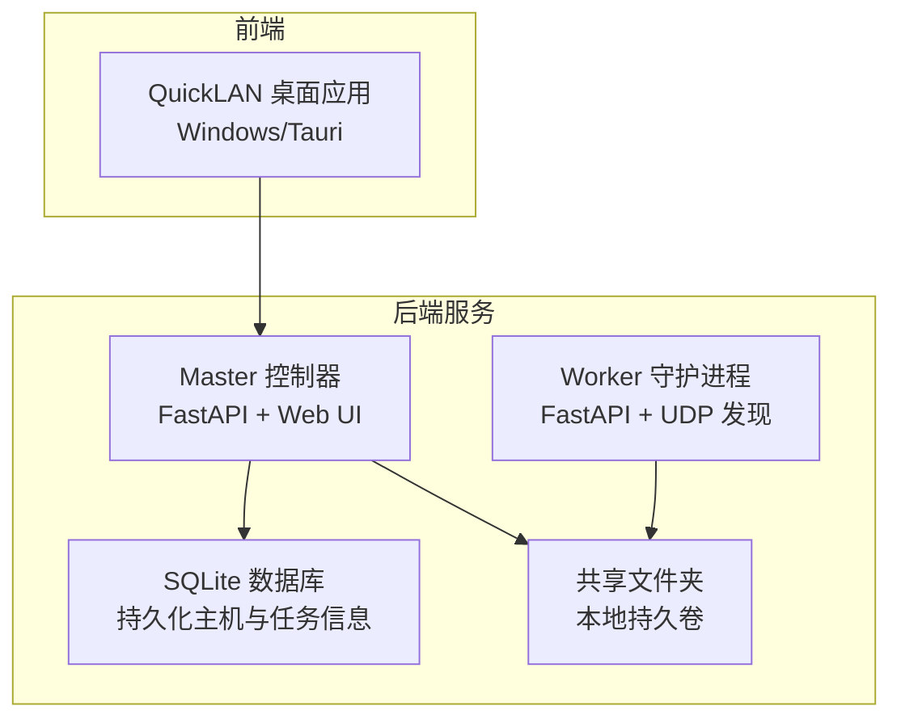
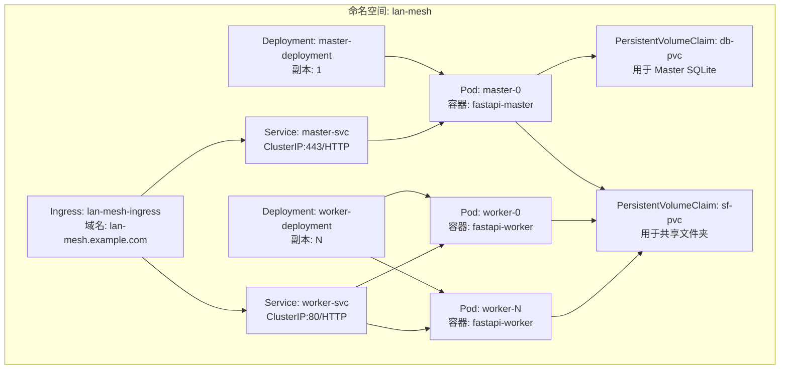
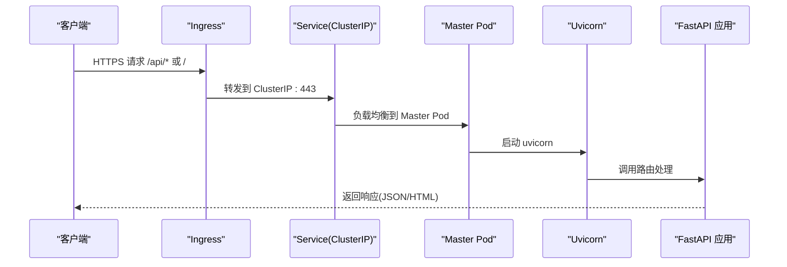
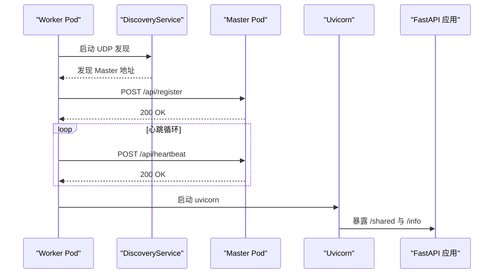
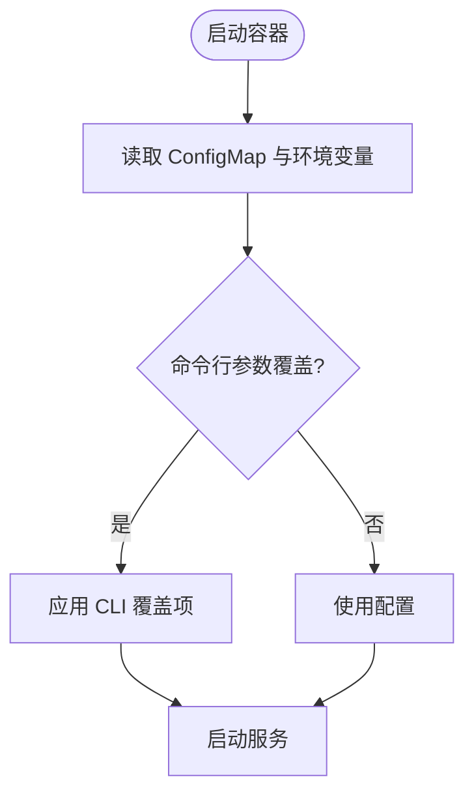
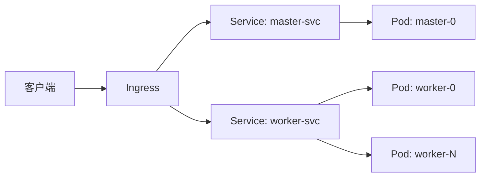
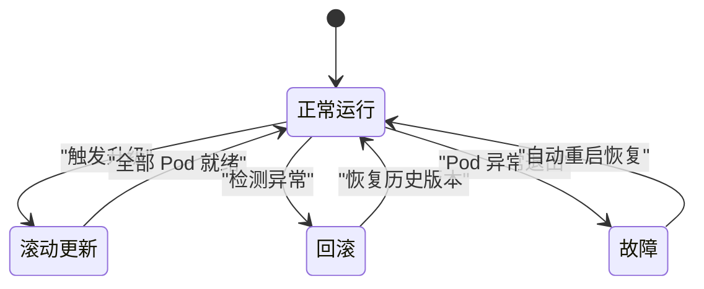
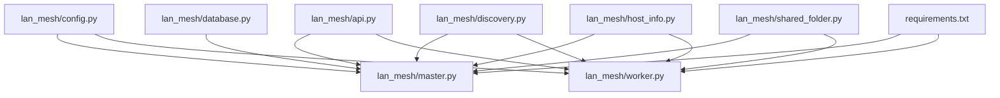

# Kubernetes 部署

<cite>
**本文引用的文件**   
- [config.yaml](file://config.yaml)
- [main.py](file://main.py)
- [requirements.txt](file://requirements.txt)
- [lan_mesh/config.py](file://lan_mesh/config.py)
- [lan_mesh/api.py](file://lan_mesh/api.py)
- [lan_mesh/master.py](file://lan_mesh/master.py)
- [lan_mesh/worker.py](file://lan_mesh/worker.py)
- [lan_mesh/database.py](file://lan_mesh/database.py)
- [lan_mesh/discovery.py](file://lan_mesh/discovery.py)
- [lan_mesh/host_info.py](file://lan_mesh/host_info.py)
- [lan_mesh/shared_folder.py](file://lan_mesh/shared_folder.py)
- [quicklan-main/README.md](file://quicklan-main/README.md)
</cite>

## 目录
1. [简介](#简介)
2. [项目结构](#项目结构)
3. [核心组件](#核心组件)
4. [架构总览](#架构总览)
5. [详细组件分析](#详细组件分析)
6. [依赖关系分析](#依赖关系分析)
7. [性能考虑](#性能考虑)
8. [故障排查指南](#故障排查指南)
9. [结论](#结论)
10. [附录](#附录)

## 简介
本文件面向 Work Station 项目（LAN Mesh）在 Kubernetes 上的集群部署，提供 Deployment、Service、Ingress 的 YAML 配置思路与最佳实践；说明 Pod 调度、资源分配与副本管理；涵盖 ConfigMap 与 Secret 的配置管理；解释网络策略、服务发现与负载均衡；给出 Helm Chart 部署方案与自动化脚本建议；阐述滚动更新、回滚策略与故障恢复机制，并提供监控与日志收集配置建议。

## 项目结构
Work Station 由两部分组成：
- 后端服务：Python FastAPI 应用，分为 Master 控制节点与 Worker 工作节点，负责设备发现、注册、心跳、任务编排、Web UI 仪表盘与共享文件管理。
- 前端应用：QuickLAN 桌面应用（React + Tauri），与后端通过 HTTP API 交互，不直接参与 Kubernetes 部署。

**图表来源**
- [lan_mesh/master.py:1-324](file://lan_mesh/master.py#L1-L324)
- [lan_mesh/worker.py:1-325](file://lan_mesh/worker.py#L1-L325)
- [lan_mesh/database.py:1-611](file://lan_mesh/database.py#L1-L611)
- [lan_mesh/shared_folder.py:1-219](file://lan_mesh/shared_folder.py#L1-L219)
- [quicklan-main/README.md:1-54](file://quicklan-main/README.md#L1-L54)

**章节来源**
- [config.yaml:1-22](file://config.yaml#L1-L22)
- [main.py:1-90](file://main.py#L1-L90)
- [lan_mesh/config.py:1-84](file://lan_mesh/config.py#L1-L84)
- [lan_mesh/master.py:1-324](file://lan_mesh/master.py#L1-L324)
- [lan_mesh/worker.py:1-325](file://lan_mesh/worker.py#L1-L325)
- [lan_mesh/database.py:1-611](file://lan_mesh/database.py#L1-L611)
- [lan_mesh/shared_folder.py:1-219](file://lan_mesh/shared_folder.py#L1-L219)
- [quicklan-main/README.md:1-54](file://quicklan-main/README.md#L1-L54)

## 核心组件
- Master 控制器：提供 HTTP API、WebSocket 实时推送、Web UI 仪表盘、SQLite 持久化、UDP 发现、离线清理与配置刷新。
- Worker 守护进程：提供 HTTP API、UDP 发现、向 Master 注册与心跳、共享文件夹、Agent 卡片注册与任务执行。
- 配置与发现：基于 YAML 配置文件与环境变量，支持命令行覆盖；UDP 广播发现协议与 TTL 清理。
- 数据存储：SQLite 文件位于用户目录，Master 启动时创建并维护；Worker 仅使用共享文件夹。
- 端口规划：Master API 端口默认 45470，Worker API 端口默认 45460；UDP 发现端口 45454。

**章节来源**
- [lan_mesh/config.py:1-84](file://lan_mesh/config.py#L1-L84)
- [config.yaml:1-22](file://config.yaml#L1-L22)
- [lan_mesh/master.py:1-324](file://lan_mesh/master.py#L1-L324)
- [lan_mesh/worker.py:1-325](file://lan_mesh/worker.py#L1-L325)
- [lan_mesh/discovery.py:1-259](file://lan_mesh/discovery.py#L1-L259)
- [lan_mesh/database.py:1-611](file://lan_mesh/database.py#L1-L611)

## 架构总览
下图展示 Master 与 Worker 在 Kubernetes 中的部署关系、服务发现与负载均衡：

**图表来源**
- [lan_mesh/master.py:187-324](file://lan_mesh/master.py#L187-L324)
- [lan_mesh/worker.py:219-325](file://lan_mesh/worker.py#L219-L325)
- [lan_mesh/database.py:22-26](file://lan_mesh/database.py#L22-L26)
- [lan_mesh/shared_folder.py:23-37](file://lan_mesh/shared_folder.py#L23-L37)

## 详细组件分析

### Master 控制器（Deployment + Service + Ingress）
- 角色定位：提供 HTTP API、WebSocket、Web UI、设备发现、任务编排与持久化。
- 端口暴露：HTTP API 端口默认 45470；Ingress 通过 443/HTTP 暴露 Web UI 与 API。
- 存储：需要持久化 SQLite 数据库与共享文件夹。
- 副本：建议单副本，避免多实例并发写入 SQLite 导致冲突。

**图表来源**
- [lan_mesh/master.py:290-324](file://lan_mesh/master.py#L290-L324)
- [lan_mesh/api.py:187-223](file://lan_mesh/api.py#L187-L223)

**章节来源**
- [lan_mesh/master.py:187-324](file://lan_mesh/master.py#L187-L324)
- [lan_mesh/api.py:187-223](file://lan_mesh/api.py#L187-L223)

### Worker 守护进程（Deployment + Service）
- 角色定位：注册到 Master、发送心跳、提供共享文件 API。
- 端口暴露：HTTP API 端口默认 45460；Service 为 ClusterIP:80。
- 副本：建议多副本，按需横向扩展。

**图表来源**
- [lan_mesh/worker.py:126-216](file://lan_mesh/worker.py#L126-L216)
- [lan_mesh/discovery.py:139-214](file://lan_mesh/discovery.py#L139-L214)
- [lan_mesh/api.py:116-168](file://lan_mesh/api.py#L116-L168)

**章节来源**
- [lan_mesh/worker.py:126-216](file://lan_mesh/worker.py#L126-L216)
- [lan_mesh/discovery.py:139-214](file://lan_mesh/discovery.py#L139-L214)
- [lan_mesh/api.py:116-168](file://lan_mesh/api.py#L116-L168)

### 配置管理（ConfigMap 与 Secret）
- ConfigMap：存放应用配置（如 discovery、worker、master 端口与共享目录），支持热更新。
- Secret：存放敏感信息（如数据库密码、认证令牌），通过环境变量注入。
- 命令行覆盖：通过启动参数覆盖 ConfigMap 与环境变量。

**图表来源**
- [lan_mesh/config.py:48-84](file://lan_mesh/config.py#L48-L84)
- [main.py:56-76](file://main.py#L56-L76)

**章节来源**
- [lan_mesh/config.py:48-84](file://lan_mesh/config.py#L48-L84)
- [main.py:56-76](file://main.py#L56-L76)

### 网络策略、服务发现与负载均衡
- Service 类型：Master 使用 ClusterIP:443 暴露 Web UI 与 API；Worker 使用 ClusterIP:80 暴露 API。
- Ingress：统一入口，支持 TLS 终止与域名路由。
- 端口规划：Master API 45470；Worker API 45460；UDP 发现 45454。
- 负载均衡：Service 层实现 Pod 间负载均衡；Ingress 层实现外部流量接入。

**图表来源**
- [lan_mesh/master.py:290-324](file://lan_mesh/master.py#L290-L324)
- [lan_mesh/worker.py:219-325](file://lan_mesh/worker.py#L219-L325)

**章节来源**
- [lan_mesh/master.py:290-324](file://lan_mesh/master.py#L290-L324)
- [lan_mesh/worker.py:219-325](file://lan_mesh/worker.py#L219-L325)

### 滚动更新、回滚策略与故障恢复
- 滚动更新：Deployment 设置 maxUnavailable 与 maxSurge，确保平滑升级。
- 回滚：通过 kubectl rollout undo 恢复到历史版本。
- 故障恢复：Pod 失败时自动重启；Master 单副本，Worker 多副本；Ingress 健康检查与超时重试。

**图表来源**
- [lan_mesh/master.py:290-324](file://lan_mesh/master.py#L290-L324)
- [lan_mesh/worker.py:219-325](file://lan_mesh/worker.py#L219-L325)

**章节来源**
- [lan_mesh/master.py:290-324](file://lan_mesh/master.py#L290-L324)
- [lan_mesh/worker.py:219-325](file://lan_mesh/worker.py#L219-L325)

### 监控与日志收集
- 日志：容器 stdout/stderr 输出，结合 DaemonSet 的日志收集器（如 Fluent Bit/Fluentd）集中存储。
- 指标：Prometheus Exporter 暴露应用指标；Grafana 可视化。
- 健康检查：liveness/readiness 探针指向 /api/health；Ingress 层健康检查。
- 建议：为 Master 与 Worker 分别配置探针与告警规则。

**章节来源**
- [lan_mesh/api.py:242-250](file://lan_mesh/api.py#L242-L250)

## 依赖关系分析

**图表来源**
- [lan_mesh/config.py:1-84](file://lan_mesh/config.py#L1-L84)
- [lan_mesh/api.py:1-539](file://lan_mesh/api.py#L1-L539)
- [lan_mesh/master.py:1-324](file://lan_mesh/master.py#L1-L324)
- [lan_mesh/worker.py:1-325](file://lan_mesh/worker.py#L1-L325)
- [lan_mesh/discovery.py:1-259](file://lan_mesh/discovery.py#L1-L259)
- [lan_mesh/host_info.py:1-212](file://lan_mesh/host_info.py#L1-L212)
- [lan_mesh/database.py:1-611](file://lan_mesh/database.py#L1-L611)
- [lan_mesh/shared_folder.py:1-219](file://lan_mesh/shared_folder.py#L1-L219)
- [requirements.txt:1-8](file://requirements.txt#L1-L8)

**章节来源**
- [lan_mesh/config.py:1-84](file://lan_mesh/config.py#L1-L84)
- [lan_mesh/api.py:1-539](file://lan_mesh/api.py#L1-L539)
- [lan_mesh/master.py:1-324](file://lan_mesh/master.py#L1-L324)
- [lan_mesh/worker.py:1-325](file://lan_mesh/worker.py#L1-L325)
- [lan_mesh/discovery.py:1-259](file://lan_mesh/discovery.py#L1-L259)
- [lan_mesh/host_info.py:1-212](file://lan_mesh/host_info.py#L1-L212)
- [lan_mesh/database.py:1-611](file://lan_mesh/database.py#L1-L611)
- [lan_mesh/shared_folder.py:1-219](file://lan_mesh/shared_folder.py#L1-L219)
- [requirements.txt:1-8](file://requirements.txt#L1-L8)

## 性能考虑
- 资源配额：Master 作为单点控制，建议适度 CPU/Memory；Worker 可按任务规模弹性扩缩容。
- 存储：Master 的 SQLite 与共享文件夹建议使用高性能持久卷；避免多副本同时写入。
- 网络：UDP 发现端口 45454 需在集群网络策略中放通；Ingress 层启用压缩与缓存。
- 调度：为 Master 指定亲和性与容忍度，确保稳定运行；Worker 使用节点选择器按业务隔离。

## 故障排查指南
- 健康检查失败：检查 /api/health 是否可达；确认端口映射与 Service 选择器。
- Worker 无法注册：检查 UDP 发现是否正常、Master 地址是否正确、防火墙策略。
- 数据库异常：确认 PVC 绑定与权限；避免多副本并发写入。
- 日志与指标：验证日志收集器与 Prometheus 抓取配置。

**章节来源**
- [lan_mesh/api.py:242-250](file://lan_mesh/api.py#L242-L250)
- [lan_mesh/worker.py:126-216](file://lan_mesh/worker.py#L126-L216)
- [lan_mesh/discovery.py:139-214](file://lan_mesh/discovery.py#L139-L214)

## 结论
通过合理的 Deployment、Service、Ingress 配置与存储、网络策略、滚动更新与监控体系，Work Station 可在 Kubernetes 上稳定运行。Master 作为单点控制，Worker 可弹性扩展；共享文件夹与 SQLite 需要持久化保障；UDP 发现与 HTTP API 的端口规划应与集群网络策略协同。

## 附录

### Kubernetes 部署清单（示例思路）
- ConfigMap：应用配置（discovery、worker、master 端口与共享目录）
- Secret：数据库密码、认证令牌
- PersistentVolume/PersistentVolumeClaim：Master SQLite 与共享文件夹
- Service：master-svc（ClusterIP:443）、worker-svc（ClusterIP:80）
- Deployment：master-deployment（replicas=1）、worker-deployment（replicas=N）
- Ingress：域名路由与 TLS 终止

### Helm Chart 部署方案
- Chart 目录结构：templates/*.yaml、values.yaml、Chart.yaml
- values.yaml：端口、副本数、镜像、资源、存储、Ingress 与 Secret 名称
- 模板：使用 .Values.* 注入 ConfigMap、Secret、Service、Deployment、Ingress

### 自动化部署脚本
- CI/CD：GitOps（ArgoCD/Flux）或流水线（GitHub Actions/Jenkins）自动发布
- 命令行：kubectl apply -f manifests/ 或 helm upgrade/install
- 健康检查：集成探针与就绪检查，失败自动回滚