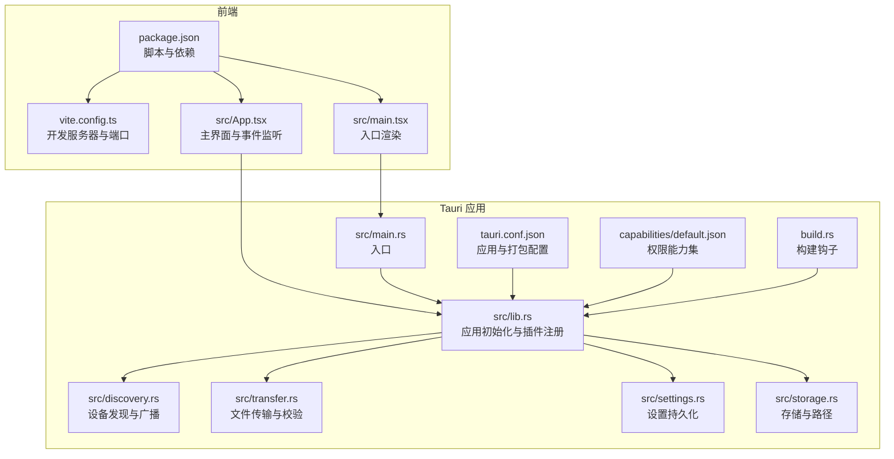
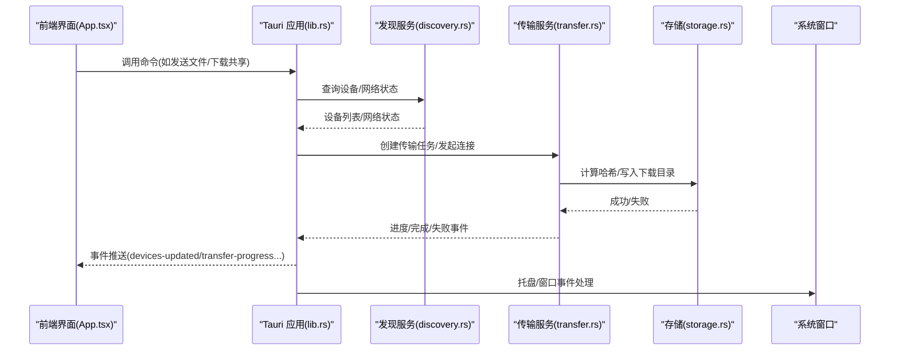
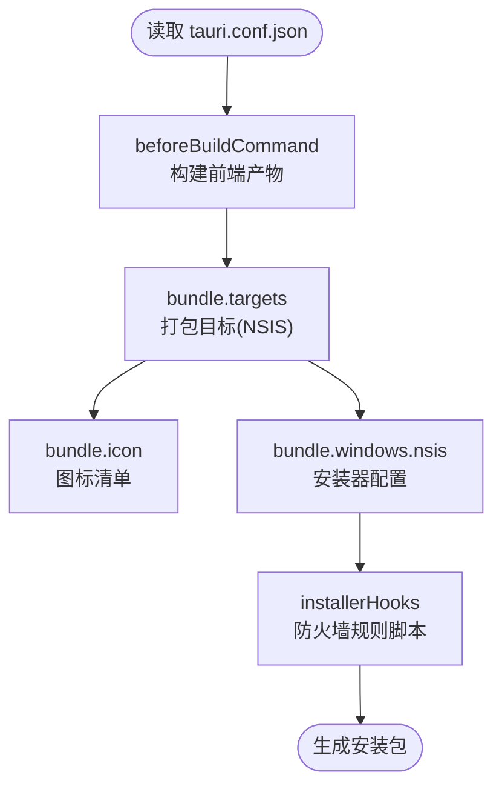
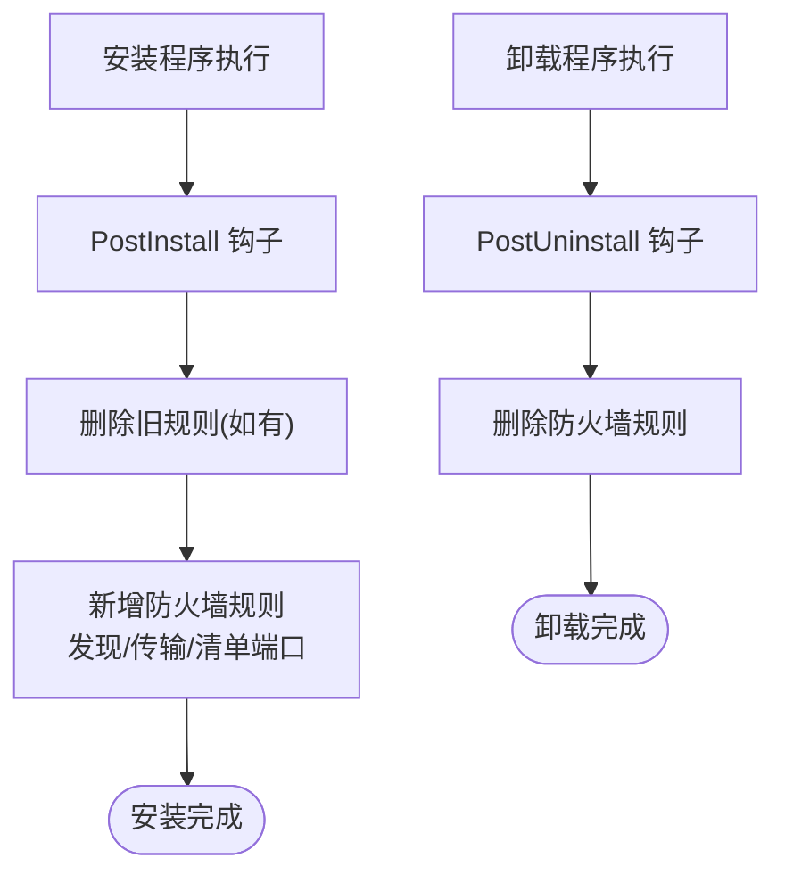
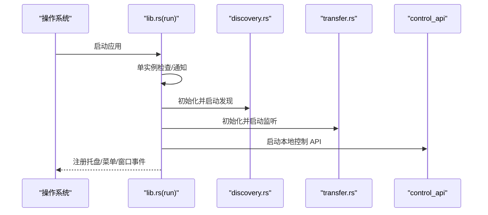
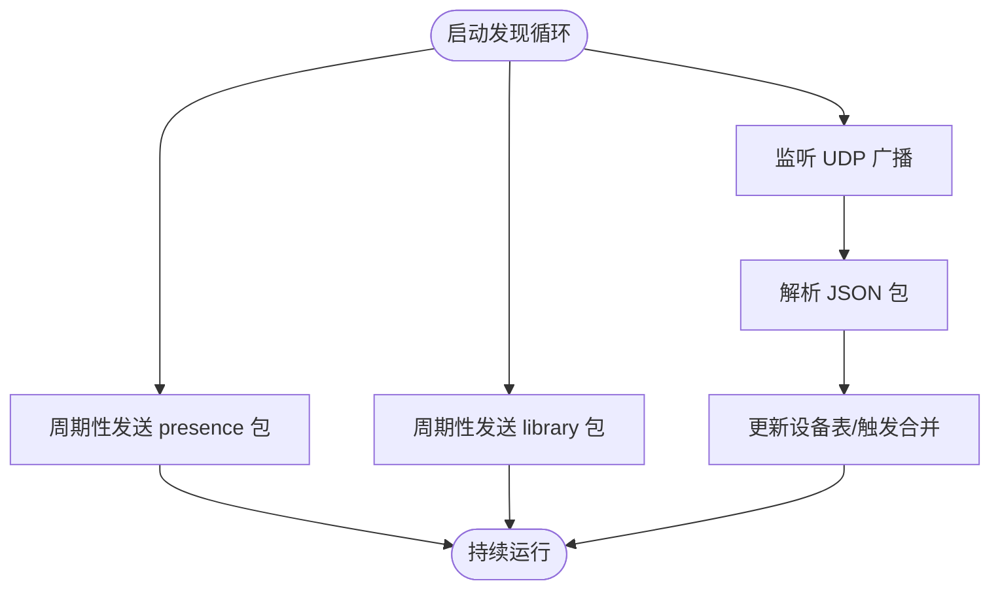
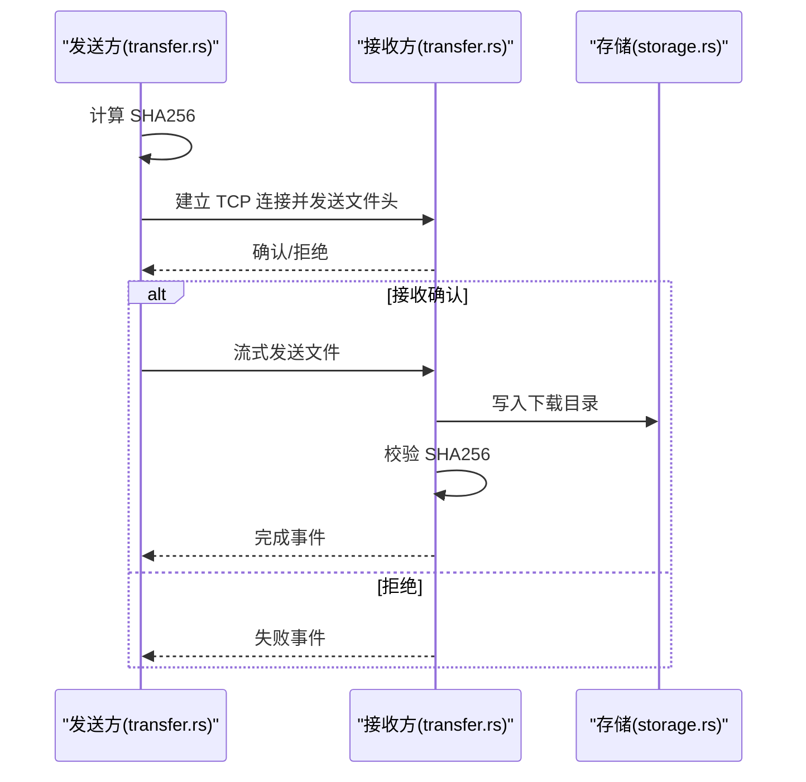
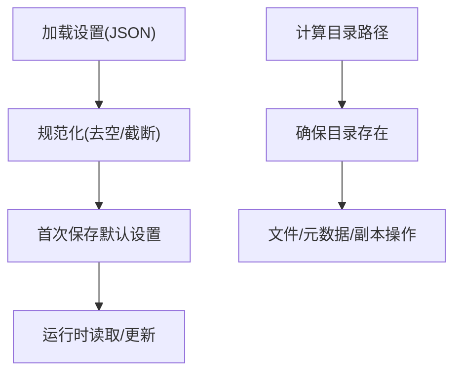
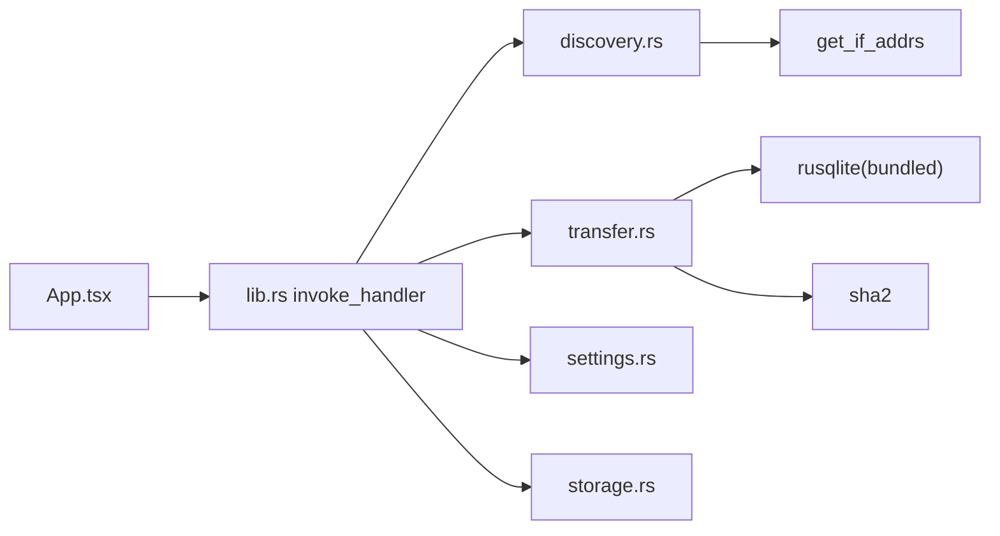

# 桌面应用打包部署

<cite>
**本文引用的文件**
- [tauri.conf.json](file://quicklan-main/src-tauri/tauri.conf.json)
- [Cargo.toml](file://quicklan-main/src-tauri/Cargo.toml)
- [package.json](file://quicklan-main/package.json)
- [vite.config.ts](file://quicklan-main/vite.config.ts)
- [build.rs](file://quicklan-main/src-tauri/build.rs)
- [hooks.nsi](file://quicklan-main/src-tauri/windows/hooks.nsi)
- [default.json](file://quicklan-main/src-tauri/capabilities/default.json)
- [README.md](file://quicklan-main/README.md)
- [main.rs](file://quicklan-main/src-tauri/src/main.rs)
- [lib.rs](file://quicklan-main/src-tauri/src/lib.rs)
- [settings.rs](file://quicklan-main/src-tauri/src/settings.rs)
- [storage.rs](file://quicklan-main/src-tauri/src/storage.rs)
- [discovery.rs](file://quicklan-main/src-tauri/src/discovery.rs)
- [transfer.rs](file://quicklan-main/src-tauri/src/transfer.rs)
- [App.tsx](file://quicklan-main/src/App.tsx)
- [main.tsx](file://quicklan-main/src/main.tsx)
</cite>

## 目录
1. [简介](#简介)
2. [项目结构](#项目结构)
3. [核心组件](#核心组件)
4. [架构总览](#架构总览)
5. [详细组件分析](#详细组件分析)
6. [依赖关系分析](#依赖关系分析)
7. [性能考虑](#性能考虑)
8. [故障排查指南](#故障排查指南)
9. [结论](#结论)
10. [附录](#附录)

## 简介
本指南面向 Work Station 桌面应用（基于 Tauri + React/Vite）的跨平台打包与部署，覆盖 Windows、macOS、Linux 的构建配置要点，解释 Tauri 配置项与安全策略，提供签名证书与应用商店发布准备建议，说明自动更新与版本管理策略，梳理依赖库与运行时要求，并给出 CI/CD 自动化构建思路。

## 项目结构
该仓库采用“前端 + Tauri 后端”的混合架构：
- 前端位于 quicklan-main/src（React + TypeScript + Vite）
- Tauri 应用位于 quicklan-main/src-tauri（Rust）
- 打包与构建脚本在 package.json 中定义，Tauri 配置在 tauri.conf.json

**图表来源**
- [package.json:1-32](file://quicklan-main/package.json#L1-L32)
- [vite.config.ts:1-15](file://quicklan-main/vite.config.ts#L1-L15)
- [App.tsx:1-800](file://quicklan-main/src/App.tsx#L1-L800)
- [main.tsx:1-11](file://quicklan-main/src/main.tsx#L1-L11)
- [tauri.conf.json:1-48](file://quicklan-main/src-tauri/tauri.conf.json#L1-L48)
- [default.json:1-16](file://quicklan-main/src-tauri/capabilities/default.json#L1-L16)
- [build.rs:1-4](file://quicklan-main/src-tauri/build.rs#L1-L4)
- [main.rs:1-6](file://quicklan-main/src-tauri/src/main.rs#L1-L6)
- [lib.rs:1-250](file://quicklan-main/src-tauri/src/lib.rs#L1-L250)
- [discovery.rs:1-384](file://quicklan-main/src-tauri/src/discovery.rs#L1-L384)
- [transfer.rs:1-800](file://quicklan-main/src-tauri/src/transfer.rs#L1-L800)
- [settings.rs:1-134](file://quicklan-main/src-tauri/src/settings.rs#L1-L134)
- [storage.rs:1-313](file://quicklan-main/src-tauri/src/storage.rs#L1-L313)

**章节来源**
- [package.json:1-32](file://quicklan-main/package.json#L1-L32)
- [vite.config.ts:1-15](file://quicklan-main/vite.config.ts#L1-L15)
- [tauri.conf.json:1-48](file://quicklan-main/src-tauri/tauri.conf.json#L1-L48)
- [README.md:1-54](file://quicklan-main/README.md#L1-L54)

## 核心组件
- 应用入口与生命周期
  - 前端入口：React 渲染与事件监听，负责 UI 交互与状态管理
  - Rust 入口：单实例控制、托盘菜单、窗口事件、插件注册、服务启动
- 网络与传输
  - 设备发现：UDP 广播与探测，维护在线设备列表
  - 文件传输：TCP 流式传输，分块校验，支持共享下载与本地副本
- 存储与设置
  - 配置与数据目录：用户配置、数据库、共享副本
  - 设置持久化：昵称、下载目录等
- 打包与权限
  - Tauri 配置：窗口尺寸、安全策略、打包目标与图标
  - 能力集：默认权限声明

**章节来源**
- [main.rs:1-6](file://quicklan-main/src-tauri/src/main.rs#L1-L6)
- [lib.rs:138-249](file://quicklan-main/src-tauri/src/lib.rs#L138-L249)
- [discovery.rs:60-276](file://quicklan-main/src-tauri/src/discovery.rs#L60-L276)
- [transfer.rs:130-159](file://quicklan-main/src-tauri/src/transfer.rs#L130-L159)
- [settings.rs:21-93](file://quicklan-main/src-tauri/src/settings.rs#L21-L93)
- [storage.rs:9-46](file://quicklan-main/src-tauri/src/storage.rs#L9-L46)
- [tauri.conf.json:12-46](file://quicklan-main/src-tauri/tauri.conf.json#L12-L46)
- [default.json:6-14](file://quicklan-main/src-tauri/capabilities/default.json#L6-L14)

## 架构总览
下图展示从前端到 Rust 后端的服务调用链与事件流。

**图表来源**
- [App.tsx:144-178](file://quicklan-main/src/App.tsx#L144-L178)
- [lib.rs:218-246](file://quicklan-main/src-tauri/src/lib.rs#L218-L246)
- [discovery.rs:72-120](file://quicklan-main/src-tauri/src/discovery.rs#L72-L120)
- [transfer.rs:298-375](file://quicklan-main/src-tauri/src/transfer.rs#L298-L375)
- [storage.rs:169-203](file://quicklan-main/src-tauri/src/storage.rs#L169-L203)

## 详细组件分析

### Tauri 配置与打包
- 应用元信息与构建
  - 产品名称、版本、标识符、开发/构建命令、前端产物目录
- 窗口与安全
  - 主窗口尺寸、最小尺寸、拖拽、CSP 策略
- 打包与安装器
  - 目标：NSIS（Windows），图标清单，安装器语言与模式、开始菜单文件夹、防火墙规则脚本
- 能力集
  - 默认权限：事件监听/发射、窗口操作、对话框、外部打开

**图表来源**
- [tauri.conf.json:6-11](file://quicklan-main/src-tauri/tauri.conf.json#L6-L11)
- [tauri.conf.json:27-46](file://quicklan-main/src-tauri/tauri.conf.json#L27-L46)
- [default.json:6-14](file://quicklan-main/src-tauri/capabilities/default.json#L6-L14)

**章节来源**
- [tauri.conf.json:1-48](file://quicklan-main/src-tauri/tauri.conf.json#L1-L48)
- [default.json:1-16](file://quicklan-main/src-tauri/capabilities/default.json#L1-L16)

### Windows 安装器与防火墙规则
- 使用 NSIS 安装器，安装语言为简体中文，支持用户/系统安装模式
- 安装后自动配置防火墙规则，允许发现、传输、清单 HTTP 端口范围
- 卸载时删除对应规则，避免残留

**图表来源**
- [tauri.conf.json:37-44](file://quicklan-main/src-tauri/tauri.conf.json#L37-L44)
- [hooks.nsi:1-19](file://quicklan-main/src-tauri/windows/hooks.nsi#L1-L19)

**章节来源**
- [tauri.conf.json:37-44](file://quicklan-main/src-tauri/tauri.conf.json#L37-L44)
- [hooks.nsi:1-19](file://quicklan-main/src-tauri/windows/hooks.nsi#L1-L19)

### Rust 应用初始化与服务
- 单实例启动：Windows 上使用互斥量，通知已有实例显示窗口
- 插件注册：对话框、外部打开
- 服务启动：发现、传输、本地控制 API、托盘菜单
- 事件与窗口：设备更新、传输进度/完成/失败、窗口关闭最小化

**图表来源**
- [lib.rs:138-249](file://quicklan-main/src-tauri/src/lib.rs#L138-L249)
- [discovery.rs:60-65](file://quicklan-main/src-tauri/src/discovery.rs#L60-L65)
- [transfer.rs:130-159](file://quicklan-main/src-tauri/src/transfer.rs#L130-L159)

**章节来源**
- [lib.rs:138-249](file://quicklan-main/src-tauri/src/lib.rs#L138-L249)
- [main.rs:1-6](file://quicklan-main/src-tauri/src/main.rs#L1-L6)

### 设备发现与网络状态
- 广播与监听：UDP 广播“presence/library”包，解析并更新设备表
- 网络状态：暴露本地 IP、广播目标、端口占用情况
- 设备注释：本地持久化，支持更新

**图表来源**
- [discovery.rs:146-161](file://quicklan-main/src-tauri/src/discovery.rs#L146-L161)
- [discovery.rs:163-251](file://quicklan-main/src-tauri/src/discovery.rs#L163-L251)

**章节来源**
- [discovery.rs:60-120](file://quicklan-main/src-tauri/src/discovery.rs#L60-L120)
- [discovery.rs:278-287](file://quicklan-main/src-tauri/src/discovery.rs#L278-L287)

### 文件传输与校验
- 发送流程：计算 SHA256，建立 TCP 连接，发送文件头，等待确认，流式发送并上报进度
- 接收流程：接收文件头，弹出确认窗口，写入下载目录，完成后校验并可注册本地副本
- 共享下载：向远端请求共享内容，按需验证密码

**图表来源**
- [transfer.rs:298-375](file://quicklan-main/src-tauri/src/transfer.rs#L298-L375)
- [transfer.rs:541-616](file://quicklan-main/src-tauri/src/transfer.rs#L541-L616)
- [storage.rs:169-203](file://quicklan-main/src-tauri/src/storage.rs#L169-L203)

**章节来源**
- [transfer.rs:180-261](file://quicklan-main/src-tauri/src/transfer.rs#L180-L261)
- [transfer.rs:445-502](file://quicklan-main/src-tauri/src/transfer.rs#L445-L502)

### 设置与存储
- 设置：昵称、下载目录，带默认值与规范化
- 存储：应用数据目录、配置目录、数据库与共享副本路径，文件名清洗与去重

**图表来源**
- [settings.rs:21-93](file://quicklan-main/src-tauri/src/settings.rs#L21-L93)
- [storage.rs:9-46](file://quicklan-main/src-tauri/src/storage.rs#L9-L46)

**章节来源**
- [settings.rs:1-134](file://quicklan-main/src-tauri/src/settings.rs#L1-L134)
- [storage.rs:1-313](file://quicklan-main/src-tauri/src/storage.rs#L1-L313)

## 依赖关系分析
- 前端到后端
  - 前端通过 @tauri-apps/api 调用后端命令，后端在 lib.rs 中集中注册
- Rust 组件内聚
  - discovery、transfer、settings、storage 作为服务模块协同工作
- 外部依赖
  - Tauri 生态插件（对话框、外部打开）、Tokio 异步运行时、SQLite（捆绑）、SHA256 校验

**图表来源**
- [lib.rs:218-246](file://quicklan-main/src-tauri/src/lib.rs#L218-L246)
- [Cargo.toml:19-33](file://quicklan-main/src-tauri/Cargo.toml#L19-L33)
- [discovery.rs:1-22](file://quicklan-main/src-tauri/src/discovery.rs#L1-L22)
- [transfer.rs:1-28](file://quicklan-main/src-tauri/src/transfer.rs#L1-L28)

**章节来源**
- [Cargo.toml:19-33](file://quicklan-main/src-tauri/Cargo.toml#L19-L33)
- [lib.rs:11-35](file://quicklan-main/src-tauri/src/lib.rs#L11-L35)

## 性能考虑
- 传输性能
  - 分块传输与进度统计，避免阻塞 UI
  - SHA256 在发送前计算，减少重复 IO
- 网络效率
  - UDP 广播仅针对局域网接口，减少无效广播
  - 设备表定期修剪，降低内存占用
- I/O 优化
  - 共享副本复用与校验，避免重复拷贝
  - 下载路径唯一命名，避免冲突与覆盖

[本节为通用指导，无需特定文件引用]

## 故障排查指南
- 开发与构建
  - 确认前端端口与 Vite 配置一致，避免端口冲突
  - 使用脚本启动开发与构建，确保依赖安装完整
- Windows 安装器
  - 若防火墙未放行，检查安装钩子是否执行
  - 卸载后残留规则可通过钩子清理
- 运行时问题
  - 传输失败多因防火墙拦截或端口占用，检查端口范围与进程
  - 设备未上线：确认 UDP 广播可达与网络状态

**章节来源**
- [vite.config.ts:7-13](file://quicklan-main/vite.config.ts#L7-L13)
- [package.json:7-14](file://quicklan-main/package.json#L7-L14)
- [hooks.nsi:1-19](file://quicklan-main/src-tauri/windows/hooks.nsi#L1-L19)
- [README.md:43-49](file://quicklan-main/README.md#L43-L49)

## 结论
本项目以 Tauri 将 React 前端与 Rust 后端整合，形成跨平台桌面应用。通过清晰的模块划分与事件驱动架构，实现了高效的局域网设备发现与文件传输。打包方面以 NSIS 为主，配合防火墙规则自动化，简化了 Windows 用户体验。建议在生产环境中补充自动更新与签名策略，并完善 CI/CD 流水线以实现稳定交付。

[本节为总结，无需特定文件引用]

## 附录

### 跨平台构建配置要点
- Windows
  - 使用 NSIS 安装器，配置图标、语言、安装模式与开始菜单文件夹
  - 安装/卸载钩子自动维护防火墙规则
- macOS/Linux
  - 可扩展 bundle.targets，添加 dmg/appimage 等目标
  - 需要为各平台配置签名与公证流程（见下一节）

**章节来源**
- [tauri.conf.json:27-44](file://quicklan-main/src-tauri/tauri.conf.json#L27-L44)
- [hooks.nsi:1-19](file://quicklan-main/src-tauri/windows/hooks.nsi#L1-L19)

### Tauri 配置参数与安全策略
- 应用窗口与安全
  - 窗口宽高与最小尺寸、拖拽启用
  - CSP 置空，前端直连本地 API
- 权限能力集
  - 事件监听/发射、窗口关闭/拖拽、对话框、外部打开
- 打包图标与安装器
  - 多分辨率图标与 NSIS 安装器配置

**章节来源**
- [tauri.conf.json:12-26](file://quicklan-main/src-tauri/tauri.conf.json#L12-L26)
- [default.json:6-14](file://quicklan-main/src-tauri/capabilities/default.json#L6-L14)

### 签名证书与应用商店发布准备
- Windows
  - 使用 SignTool 对安装包与可执行文件签名
  - 为 .msi/.exe 提供代码签名证书，满足 Windows Defender 要求
- macOS
  - 为 DMG 与 .app 签名并公证，满足 Gatekeeper
- Linux
  - 为 AppImage 或 DEB/RPM 提供签名，必要时提交至应用商店

[本节为通用实践建议，无需特定文件引用]

### 自动更新机制与版本管理
- 版本号
  - 前端、Rust、Tauri 配置中的版本保持一致
- 更新策略
  - 可结合 Tauri 自带 updater 或第三方方案（如 Squirrel）
  - 发布渠道：GitHub Releases、内部 CDN
- 版本管理
  - Git 标签与变更日志同步，CI 触发构建与发布

**章节来源**
- [package.json:2-4](file://quicklan-main/package.json#L2-L4)
- [Cargo.toml:2-4](file://quicklan-main/src-tauri/Cargo.toml#L2-L4)
- [tauri.conf.json:3-5](file://quicklan-main/src-tauri/tauri.conf.json#L3-L5)

### 依赖库与运行时要求
- 前端
  - React、TypeScript、Vite、@tauri-apps/* 插件
- 后端
  - Tauri 2、tokio、rusqlite(bundled)、sha2、get_if_addrs、dirs、hostname、uuid
- 运行时
  - Windows 10/11；Linux/macOS 上需满足 Tauri 运行时依赖

**章节来源**
- [Cargo.toml:19-33](file://quicklan-main/src-tauri/Cargo.toml#L19-L33)
- [package.json:15-30](file://quicklan-main/package.json#L15-L30)
- [README.md:16-22](file://quicklan-main/README.md#L16-L22)

### CI/CD 集成与自动化构建
- 构建步骤
  - 安装依赖 → 前端构建 → Tauri 构建 → 打包安装器
- 平台矩阵
  - Windows/macOS/Linux 分别构建与测试
- 发布
  - 上传安装包与签名文件至发布渠道，生成变更日志
- 安全
  - 代码签名、二进制完整性校验、最小权限原则

[本节为通用实践建议，无需特定文件引用]