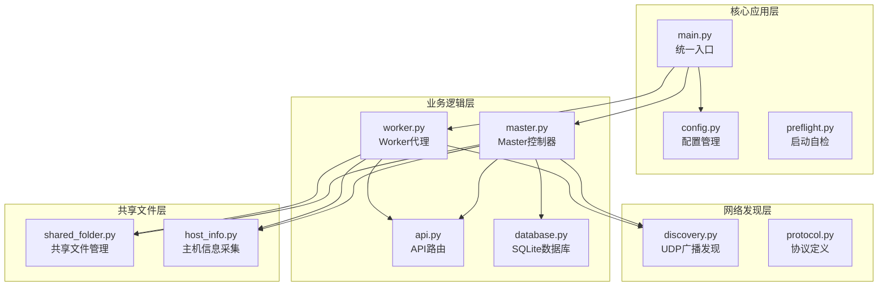
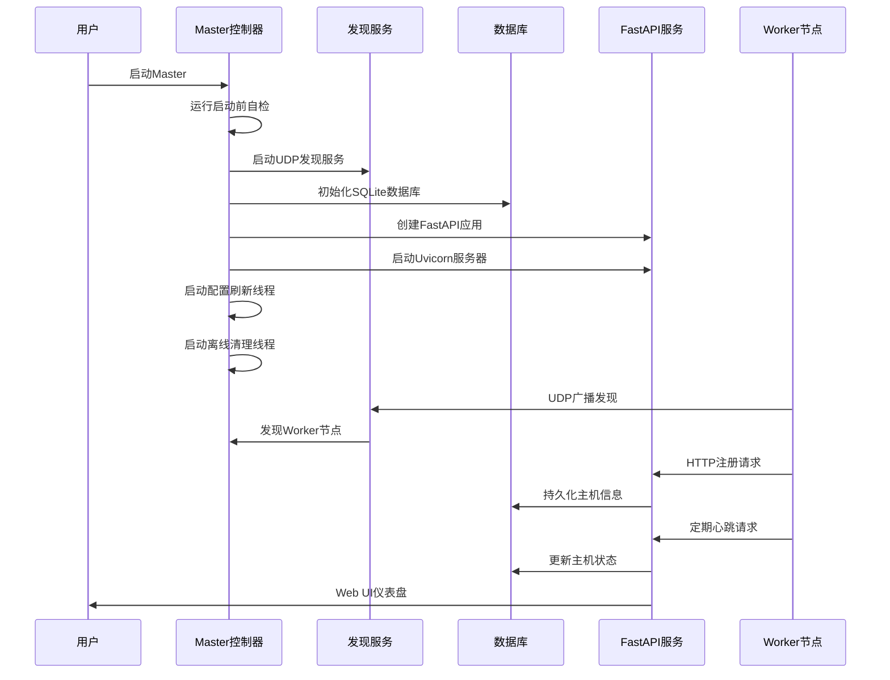
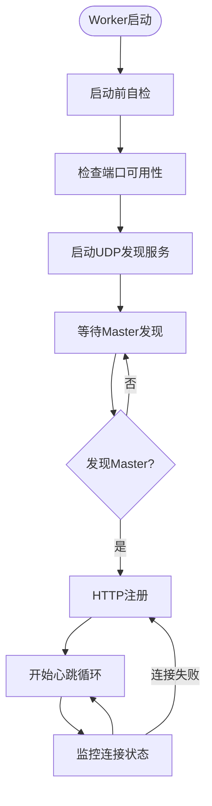
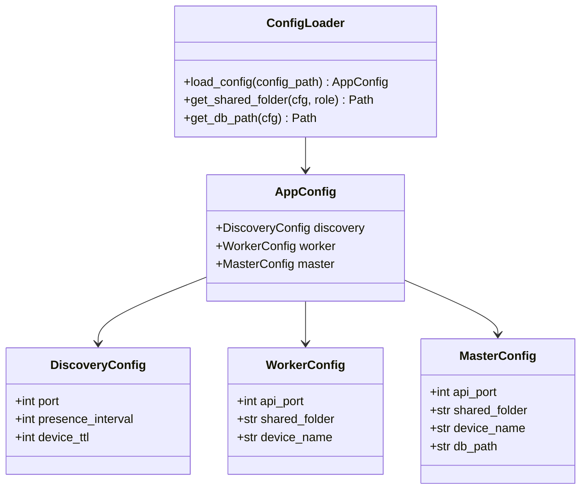
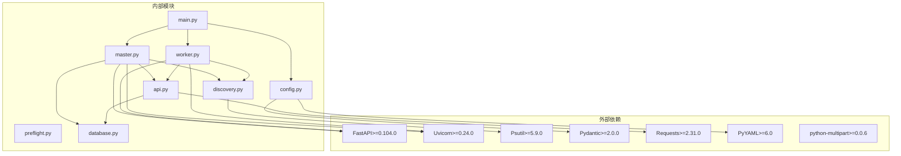

# 生产环境部署

<cite>
**本文档引用的文件**
- [main.py](file://main.py)
- [config.yaml](file://config.yaml)
- [requirements.txt](file://requirements.txt)
- [lan_mesh/config.py](file://lan_mesh/config.py)
- [lan_mesh/preflight.py](file://lan_mesh/preflight.py)
- [lan_mesh/master.py](file://lan_mesh/master.py)
- [lan_mesh/worker.py](file://lan_mesh/worker.py)
- [lan_mesh/api.py](file://lan_mesh/api.py)
- [lan_mesh/discovery.py](file://lan_mesh/discovery.py)
- [lan_mesh/database.py](file://lan_mesh/database.py)
</cite>

## 目录
1. [简介](#简介)
2. [项目结构](#项目结构)
3. [核心组件](#核心组件)
4. [架构概览](#架构概览)
5. [详细组件分析](#详细组件分析)
6. [依赖关系分析](#依赖关系分析)
7. [性能考虑](#性能考虑)
8. [故障排除指南](#故障排除指南)
9. [结论](#结论)
10. [附录](#附录)

## 简介

Work Station 是一个基于 Python 的跨主机网络连接层框架，采用 Master/Worker 架构实现分布式设备管理和任务协调。该项目提供了完整的生产环境部署解决方案，包括服务器硬件要求、操作系统兼容性、网络配置、Python 环境搭建、依赖安装、配置文件设置、服务部署、防火墙规则配置以及监控和健康检查功能。

## 项目结构

Work Station 项目采用模块化架构设计，主要包含以下核心组件：



**图表来源**
- [main.py:1-90](file://main.py#L1-L90)
- [lan_mesh/config.py:1-84](file://lan_mesh/config.py#L1-L84)
- [lan_mesh/master.py:1-324](file://lan_mesh/master.py#L1-L324)
- [lan_mesh/worker.py:1-325](file://lan_mesh/worker.py#L1-L325)

**章节来源**
- [main.py:1-90](file://main.py#L1-L90)
- [lan_mesh/config.py:1-84](file://lan_mesh/config.py#L1-L84)

## 核心组件

### Master 控制器
Master 控制器作为系统的核心管理节点，负责：
- 自动采集本机配置信息
- 管理共享文件夹
- 通过 UDP 广播发现 Master 角色
- 接收 Worker 的 HTTP 注册和心跳
- 持久化主机信息到 SQLite 数据库
- 提供 Web UI 仪表盘
- 定期清理超时离线主机

### Worker 代理
Worker 代理部署在各工作主机上，负责：
- 自动采集本机配置信息
- 创建并暴露共享文件夹
- 通过 UDP 广播发现 Master 节点
- 通过 HTTP 向 Master 注册并发送心跳
- 提供 HTTP API 供 Master 查询和文件下载

### 配置管理系统
基于 Pydantic 的强类型配置校验系统，支持：
- YAML 配置文件加载
- 环境变量覆盖
- 默认配置生成
- 路径展开和解析

**章节来源**
- [lan_mesh/master.py:67-114](file://lan_mesh/master.py#L67-L114)
- [lan_mesh/worker.py:62-96](file://lan_mesh/worker.py#L62-L96)
- [lan_mesh/config.py:36-84](file://lan_mesh/config.py#L36-L84)

## 架构概览

Work Station 采用分布式架构，通过 UDP 广播实现设备发现，通过 HTTP API 实现服务通信：

```mermaid
graph TB
subgraph "Master节点"
M_API[FastAPI服务<br/>端口: 45470]
M_DB[SQLite数据库<br/>master.sqlite3]
M_Discovery[UDP发现服务<br/>端口: 45454]
M_Shared[共享文件夹<br/>~/lan_mesh_shared]
M_UI[Web UI仪表盘]
end
subgraph "Worker节点"
W_API[FastAPI服务<br/>端口: 45460]
W_Discovery[UDP发现服务<br/>端口: 45454]
W_Shared[共享文件夹<br/>~/lan_mesh_shared]
end
subgraph "网络层"
UDP[UDP广播<br/>45454端口]
HTTP[HTTP API<br/>45460/45470端口]
end
M_Discovery -.-> UDP
W_Discovery -.-> UDP
UDP -.-> M_Discovery
UDP -.-> W_Discovery
M_API <- --> HTTP
W_API <- --> HTTP
M_API -.-> M_DB
M_API -.-> M_Shared
W_API -.-> W_Shared
```

**图表来源**
- [config.yaml:4-22](file://config.yaml#L4-L22)
- [lan_mesh/master.py:257-269](file://lan_mesh/master.py#L257-L269)
- [lan_mesh/worker.py:272-283](file://lan_mesh/worker.py#L272-L283)

## 详细组件分析

### Master 控制器详细分析

Master 控制器实现了完整的生命周期管理，包括启动前自检、服务启动、后台任务管理和优雅关闭：



**图表来源**
- [lan_mesh/master.py:238-318](file://lan_mesh/master.py#L238-L318)
- [lan_mesh/api.py:116-146](file://lan_mesh/api.py#L116-L146)

### Worker 代理详细分析

Worker 代理实现了自动发现和注册机制：



**图表来源**
- [lan_mesh/worker.py:253-318](file://lan_mesh/worker.py#L253-L318)
- [lan_mesh/worker.py:203-215](file://lan_mesh/worker.py#L203-L215)

### 配置管理系统分析

配置管理系统提供了灵活的配置加载机制：



**图表来源**
- [lan_mesh/config.py:14-41](file://lan_mesh/config.py#L14-L41)
- [lan_mesh/config.py:48-84](file://lan_mesh/config.py#L48-L84)

**章节来源**
- [lan_mesh/master.py:67-324](file://lan_mesh/master.py#L67-L324)
- [lan_mesh/worker.py:62-325](file://lan_mesh/worker.py#L62-L325)
- [lan_mesh/config.py:1-84](file://lan_mesh/config.py#L1-L84)

## 依赖关系分析

项目依赖关系清晰，采用分层架构设计：



**图表来源**
- [requirements.txt:1-8](file://requirements.txt#L1-L8)
- [lan_mesh/master.py:27-44](file://lan_mesh/master.py#L27-L44)
- [lan_mesh/worker.py:24-44](file://lan_mesh/worker.py#L24-L44)

**章节来源**
- [requirements.txt:1-8](file://requirements.txt#L1-L8)
- [lan_mesh/master.py:17-44](file://lan_mesh/master.py#L17-L44)
- [lan_mesh/worker.py:15-44](file://lan_mesh/worker.py#L15-L44)

## 性能考虑

### 端口配置和网络优化

系统使用预定义的端口范围，避免端口冲突：

- **Master API 端口**: 45470 (可配置)
- **Worker API 端口**: 45460 (可配置)  
- **UDP 发现端口**: 45454 (固定)

### 内存和存储优化

- **数据库优化**: 使用 SQLite 本地存储，支持心跳历史清理
- **共享文件夹**: 自动创建和维护，支持文件上传下载
- **缓存策略**: 定期清理超时离线主机，保持系统性能

### 资源监控

系统内置资源监控功能：
- CPU 使用率监控
- 内存使用率监控  
- 磁盘使用率监控
- 实时心跳状态

**章节来源**
- [config.yaml:4-22](file://config.yaml#L4-L22)
- [lan_mesh/database.py:194-201](file://lan_mesh/database.py#L194-L201)

## 故障排除指南

### 常见启动问题

1. **Python 版本不兼容**
   - 要求 Python 3.10+
   - 检查命令: `python --version`

2. **依赖包缺失**
   - 使用命令: `pip install -r requirements.txt`
   - 检查依赖: psutil, fastapi, uvicorn, requests, pydantic

3. **端口占用问题**
   - Master: 45470 端口
   - Worker: 45460 端口  
   - UDP: 45454 端口

### 网络发现故障

1. **UDP 广播失败**
   - 检查防火墙设置
   - 验证网络接口状态
   - 确认广播地址可达

2. **Master 未发现 Worker**
   - 检查 Worker 是否正常启动
   - 验证网络连通性
   - 查看日志输出

### 数据库问题

1. **SQLite 文件权限**
   - 确保用户对数据库文件有读写权限
   - 检查磁盘空间充足

2. **心跳历史清理**
   - 定期清理过期心跳记录
   - 避免数据库膨胀

**章节来源**
- [lan_mesh/preflight.py:48-289](file://lan_mesh/preflight.py#L48-L289)
- [lan_mesh/discovery.py:155-200](file://lan_mesh/discovery.py#L155-L200)
- [lan_mesh/database.py:282-289](file://lan_mesh/database.py#L282-L289)

## 结论

Work Station 提供了完整的生产环境部署解决方案，具有以下优势：

1. **架构清晰**: Master/Worker 分层架构，职责明确
2. **配置灵活**: 支持多种配置方式，易于定制
3. **监控完善**: 内置健康检查和资源监控
4. **部署简单**: 支持多平台部署，配置文件驱动
5. **扩展性强**: 模块化设计，易于功能扩展

建议在生产环境中重点关注网络配置、端口管理和监控告警设置，确保系统的稳定运行。

## 附录

### 系统要求

**硬件要求**
- CPU: 至少 2 核心
- 内存: 至少 2GB RAM
- 存储: 至少 10GB 可用空间
- 网络: 千兆以太网或更高

**操作系统兼容性**
- Linux (推荐 Ubuntu 20.04+)
- Windows 10/11
- macOS 10.15+

### 网络配置

**防火墙规则**
- TCP 45454: UDP 广播发现
- TCP 45460: Worker HTTP API
- TCP 45470: Master HTTP API + Web UI

**网络要求**
- 同一局域网内通信
- 支持 UDP 广播
- 端口需开放给所有节点

### Python 环境搭建

```bash
# 创建虚拟环境
python3 -m venv lan_mesh_env

# 激活虚拟环境
source lan_mesh_env/bin/activate  # Linux/macOS
# 或
lan_mesh_env\Scripts\activate     # Windows

# 安装依赖
pip install -r requirements.txt

# 验证安装
python -c "import fastapi, uvicorn, psutil, pydantic, yaml, requests"
```

### 配置文件设置

基础配置文件位于 `config.yaml`：

```yaml
# UDP 发现配置
discovery:
  port: 45454              # UDP 广播发现端口
  presence_interval: 3     # 广播间隔 (秒)
  device_ttl: 12           # 设备离线判定阈值 (秒)

# Worker 节点配置
worker:
  api_port: 45460          # HTTP API 端口
  shared_folder: ~/lan_mesh_shared  # 共享文件夹路径
  device_name: ""          # 设备名称

# Master 节点配置
master:
  api_port: 45470          # HTTP API + Web UI 端口
  shared_folder: ~/lan_mesh_shared  # 共享文件夹路径
  device_name: ""          # 设备名称
  db_path: ~/.lan_mesh/master.sqlite3  # 数据库路径
```

### Master 部署步骤

```bash
# 1. 启动 Master 节点
python main.py master

# 2. 访问 Web UI
# http://localhost:45470

# 3. 验证服务状态
curl http://localhost:45470/
```

### Worker 部署步骤

```bash
# 1. 启动 Worker 节点
python main.py worker

# 2. 验证服务状态
curl http://localhost:45460/info
```

### 服务配置示例

**systemd 服务配置 (Master)**

```ini
[Unit]
Description=LAN Mesh Master Service
After=network.target

[Service]
Type=simple
User=lan_mesh
WorkingDirectory=/opt/lan_mesh
Environment=PYTHONPATH=/opt/lan_mesh
ExecStart=/opt/lan_mesh/venv/bin/python main.py master
Restart=always
RestartSec=10

[Install]
WantedBy=multi-user.target
```

**systemd 服务配置 (Worker)**

```ini
[Unit]
Description=LAN Mesh Worker Service
After=network.target

[Service]
Type=simple
User=lan_mesh
WorkingDirectory=/opt/lan_mesh
Environment=PYTHONPATH=/opt/lan_mesh
ExecStart=/opt/lan_mesh/venv/bin/python main.py worker
Restart=always
RestartSec=10

[Install]
WantedBy=multi-user.target
```

### 日志配置

系统使用默认的日志级别设置：
- Master: HTTP API + Web UI 端口 45470
- Worker: HTTP API 端口 45460
- 日志级别: warning

### 健康检查

```bash
# Master 健康检查
curl -f http://localhost:45470/api/hosts

# Worker 健康检查  
curl -f http://localhost:45460/info

# Web UI 检查
curl -f http://localhost:45470/
```

### 性能调优参数

**端口配置调优**
- UDP 发现端口: 45454 (固定)
- Master API 端口: 45470 (可配置)
- Worker API 端口: 45460 (可配置)

**资源限制配置**
- 最大并发连接数: 默认无限制
- 心跳间隔: 3 秒
- 设备离线判定: 12 秒

**章节来源**
- [config.yaml:1-22](file://config.yaml#L1-L22)
- [lan_mesh/master.py:298-304](file://lan_mesh/master.py#L298-L304)
- [lan_mesh/worker.py:306-312](file://lan_mesh/worker.py#L306-L312)