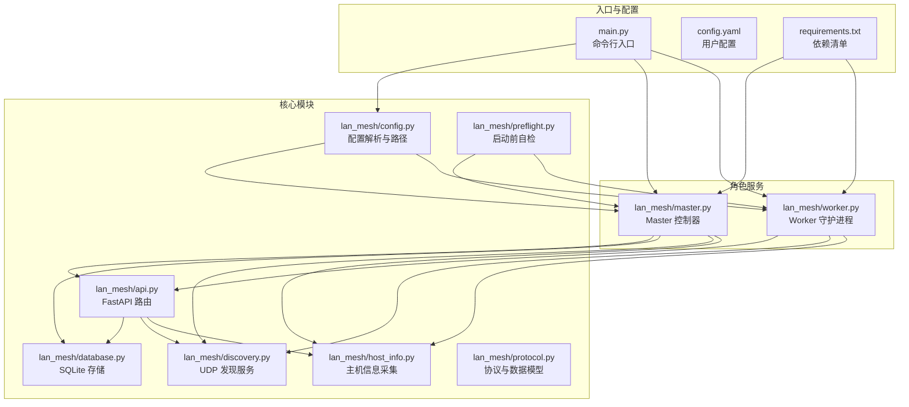
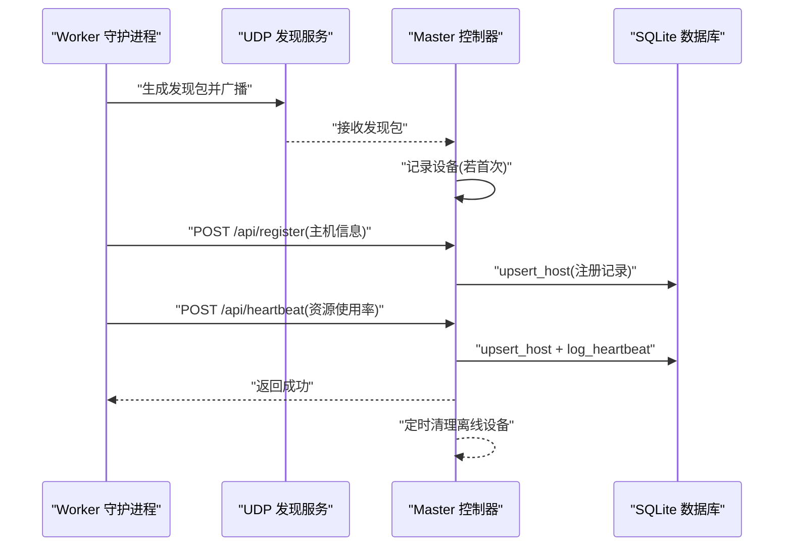
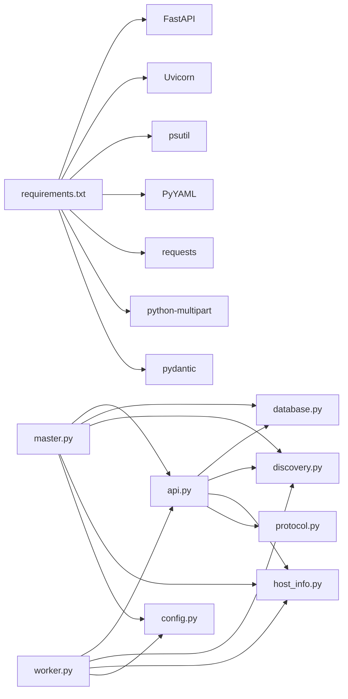

# 监控与维护

<cite>
**本文引用的文件**
- [main.py](file://main.py)
- [config.yaml](file://config.yaml)
- [requirements.txt](file://requirements.txt)
- [lan_mesh/config.py](file://lan_mesh/config.py)
- [lan_mesh/preflight.py](file://lan_mesh/preflight.py)
- [lan_mesh/host_info.py](file://lan_mesh/host_info.py)
- [lan_mesh/discovery.py](file://lan_mesh/discovery.py)
- [lan_mesh/database.py](file://lan_mesh/database.py)
- [lan_mesh/api.py](file://lan_mesh/api.py)
- [lan_mesh/master.py](file://lan_mesh/master.py)
- [lan_mesh/worker.py](file://lan_mesh/worker.py)
- [lan_mesh/protocol.py](file://lan_mesh/protocol.py)
</cite>

## 目录
1. [简介](#简介)
2. [项目结构](#项目结构)
3. [核心组件](#核心组件)
4. [架构总览](#架构总览)
5. [详细组件分析](#详细组件分析)
6. [依赖分析](#依赖分析)
7. [性能考虑](#性能考虑)
8. [故障排查指南](#故障排查指南)
9. [结论](#结论)
10. [附录](#附录)

## 简介
本指南面向 Work Station（LAN Mesh）系统的运维与维护人员，围绕系统监控与维护的关键目标，提供以下内容：
- 关键性能指标（CPU、内存、网络、磁盘）的采集与监控配置建议
- 日志收集与分析（结构化日志与轮转策略）
- 健康检查端点与告警配置思路
- 系统维护任务（数据库清理、缓存与共享文件管理、服务重启）
- 故障诊断工具与调试方法
- 备份策略与数据恢复流程

## 项目结构
LAN Mesh 由 Python 后端（FastAPI + Uvicorn）、基于 psutil 的主机信息采集、UDP 广播发现、SQLite 数据持久化与 Web UI 组成。系统通过 Worker 与 Master 角色协作，实现跨主机的资源注册、心跳上报与可视化管理。

图表来源
- [main.py:1-90](file://main.py#L1-L90)
- [lan_mesh/master.py:1-324](file://lan_mesh/master.py#L1-L324)
- [lan_mesh/worker.py:1-325](file://lan_mesh/worker.py#L1-L325)
- [lan_mesh/api.py:1-539](file://lan_mesh/api.py#L1-L539)
- [lan_mesh/database.py:1-611](file://lan_mesh/database.py#L1-L611)
- [lan_mesh/discovery.py:1-259](file://lan_mesh/discovery.py#L1-L259)
- [lan_mesh/host_info.py:1-212](file://lan_mesh/host_info.py#L1-L212)
- [lan_mesh/config.py:1-84](file://lan_mesh/config.py#L1-L84)
- [lan_mesh/preflight.py:1-290](file://lan_mesh/preflight.py#L1-L290)
- [lan_mesh/protocol.py:1-356](file://lan_mesh/protocol.py#L1-L356)

章节来源
- [main.py:1-90](file://main.py#L1-L90)
- [lan_mesh/config.py:1-84](file://lan_mesh/config.py#L1-L84)
- [lan_mesh/preflight.py:1-290](file://lan_mesh/preflight.py#L1-L290)

## 核心组件
- 配置管理：基于 Pydantic 的强类型配置，支持 YAML 与环境变量加载，提供默认值与路径展开。
- 主机信息采集：使用 psutil 采集 CPU、内存、磁盘、网络等实时指标，并生成主机信息快照。
- UDP 发现：周期性广播自身存在，监听其他设备，维护设备列表与 TTL 清理。
- 数据持久化：SQLite 存储主机注册记录、心跳历史、Agent、任务、项目与用量日志。
- API 服务：FastAPI 提供 Worker/Master 的 HTTP API、WebSocket 实时推送与 Web UI。
- 启动前自检：检查 Python 版本、依赖、配置、网络、端口、数据库与模板等关键条件。

章节来源
- [lan_mesh/config.py:1-84](file://lan_mesh/config.py#L1-L84)
- [lan_mesh/host_info.py:129-191](file://lan_mesh/host_info.py#L129-L191)
- [lan_mesh/discovery.py:33-259](file://lan_mesh/discovery.py#L33-L259)
- [lan_mesh/database.py:16-143](file://lan_mesh/database.py#L16-L143)
- [lan_mesh/api.py:103-526](file://lan_mesh/api.py#L103-L526)
- [lan_mesh/preflight.py:226-290](file://lan_mesh/preflight.py#L226-L290)

## 架构总览
系统采用 Master/Worker 架构：Worker 主动采集本机信息并通过 HTTP 向 Master 注册与发送心跳；Master 通过 UDP 广播自身并接收 Worker 心跳，聚合状态到 SQLite 并提供 Web UI 与 API；同时 Master 通过 WebSocket 向前端推送实时状态。

图表来源
- [lan_mesh/worker.py:126-215](file://lan_mesh/worker.py#L126-L215)
- [lan_mesh/discovery.py:139-214](file://lan_mesh/discovery.py#L139-L214)
- [lan_mesh/api.py:116-168](file://lan_mesh/api.py#L116-L168)
- [lan_mesh/database.py:147-201](file://lan_mesh/database.py#L147-L201)
- [lan_mesh/master.py:166-174](file://lan_mesh/master.py#L166-L174)

## 详细组件分析

### 监控指标采集与配置
- CPU：采集逻辑位于主机信息采集模块，包含逻辑核数、瞬时 CPU 百分比、频率等。
- 内存：采集物理内存总量、可用量与使用百分比。
- 磁盘：采集根分区总容量、已用、剩余与使用百分比。
- 网络：采集本地 IPv4 地址、MAC 地址、广播目标与 UDP 端口状态。
- 心跳上报：Worker 定期发送 CPU、内存、磁盘使用率与共享文件数量至 Master。

建议的监控配置（基于现有代码能力）：
- 采集频率：心跳间隔约 5 秒，适合大多数场景；可根据负载调整。
- 指标维度：按设备维度聚合，结合 Master 的 hosts 列表与心跳历史表进行趋势分析。
- 可视化：利用 Master 的 Web UI 与 /ws 实时推送查看状态变化。

章节来源
- [lan_mesh/host_info.py:129-191](file://lan_mesh/host_info.py#L129-L191)
- [lan_mesh/worker.py:172-194](file://lan_mesh/worker.py#L172-L194)
- [lan_mesh/api.py:148-168](file://lan_mesh/api.py#L148-L168)
- [lan_mesh/database.py:194-201](file://lan_mesh/database.py#L194-L201)

### 日志收集与分析
- 日志级别：Uvicorn 服务器日志级别在启动时设置为“warning”，便于生产环境减少噪声。
- 结构化日志：建议在业务层统一输出 JSON 格式日志（包含时间戳、级别、服务名、设备 ID、消息），便于集中收集与检索。
- 日志轮转：建议使用系统级轮转工具（如 logrotate 或 systemd-journald），按大小或时间切分，保留 7–30 天滚动日志。
- 收集位置：Worker 与 Master 的标准输出/错误输出可由系统服务管理器接管；也可重定向到文件。

章节来源
- [lan_mesh/master.py:298-304](file://lan_mesh/master.py#L298-L304)
- [lan_mesh/worker.py:306-312](file://lan_mesh/worker.py#L306-L312)

### 健康检查端点与告警
- 健康检查：Master 提供 /api/health 端点，返回服务状态、运行时长与设备 ID。
- 告警建议：
  - CPU/内存/磁盘使用率阈值：例如连续多个心跳超过 80% 触发预警。
  - 心跳丢失：超过 TTL（默认约 12 秒）未收到心跳，视为离线并触发告警。
  - UDP 端口不可用：自检阶段已检查，生产中可通过外部探针持续探测。
  - Web UI 可达性：对 / 与 /api/health 做 HTTP/TCP 健康探测。

章节来源
- [lan_mesh/api.py:242-250](file://lan_mesh/api.py#L242-L250)
- [lan_mesh/discovery.py:160-174](file://lan_mesh/discovery.py#L160-L174)
- [lan_mesh/preflight.py:168-183](file://lan_mesh/preflight.py#L168-L183)

### 系统维护任务
- 数据库清理：
  - 清理离线设备：Master 定时清理超过 TTL 的离线主机。
  - 心跳历史清理：按小时清理旧心跳记录，避免表膨胀。
- 缓存与共享文件：
  - 共享文件夹：Worker/Master 通过共享文件夹暴露文件列表与上传下载能力，定期清理冗余文件。
  - 配置报告：Master/Worker 定期刷新本机配置报告，便于跨节点对比。
- 服务重启：
  - 使用系统服务管理器（如 systemd）管理进程生命周期，支持优雅重启与自动拉起。
  - 重启前建议先 /api/health 检查健康状态，再执行操作。

章节来源
- [lan_mesh/master.py:166-174](file://lan_mesh/master.py#L166-L174)
- [lan_mesh/database.py:272-289](file://lan_mesh/database.py#L272-L289)
- [lan_mesh/worker.py:152-159](file://lan_mesh/worker.py#L152-L159)
- [lan_mesh/master.py:152-164](file://lan_mesh/master.py#L152-L164)

### 故障诊断工具与调试方法
- 端口占用与绑定：
  - UDP 发现端口绑定失败时，会提示端口被占用或无权限；可检查是否有重复实例运行。
  - HTTP API 端口被占用时，系统会自动寻找可用端口（端口递增策略）。
- 网络接口：
  - 若未检测到可用非回环 IPv4 接口，需检查网络配置。
- 启动前自检：
  - 运行自检模块，快速定位配置、依赖、端口、目录权限等问题。
- 心跳与发现：
  - 使用 /api/discovery 查看发现到的设备列表；使用 /api/probe/{ip} 主动探测指定 IP。
  - 通过 /ws 实时观察主机状态变更。

章节来源
- [lan_mesh/discovery.py:160-174](file://lan_mesh/discovery.py#L160-L174)
- [lan_mesh/worker.py:240-249](file://lan_mesh/worker.py#L240-L249)
- [lan_mesh/preflight.py:152-166](file://lan_mesh/preflight.py#L152-L166)
- [lan_mesh/api.py:228-240](file://lan_mesh/api.py#L228-L240)
- [lan_mesh/api.py:500-525](file://lan_mesh/api.py#L500-L525)

### 备份策略与数据恢复
- 备份对象：
  - Master SQLite 数据库文件（包含主机、Agent、任务、项目与用量日志）。
  - 共享文件夹中的重要文件与配置报告。
- 备份策略：
  - 增量/全量备份：建议每日全量 + 每小时增量，保留 7–14 天滚动副本。
  - 校验与归档：备份完成后进行校验并异地归档。
- 恢复流程：
  - 停止 Master 服务，替换数据库文件与共享文件夹内容，启动服务并验证 /api/health 与 Web UI。
  - 如需回滚，使用最近一次成功的备份恢复。

章节来源
- [config.yaml:21](file://config.yaml#L21)
- [lan_mesh/config.py:81-84](file://lan_mesh/config.py#L81-L84)
- [lan_mesh/database.py:16-143](file://lan_mesh/database.py#L16-L143)

## 依赖分析
- 外部依赖：FastAPI、Uvicorn、psutil、PyYAML、requests、python-multipart、pydantic。
- 模块耦合：
  - Master/Worker 依赖 discovery、host_info、api、database、protocol。
  - API 路由依赖 discovery、database、shared_folder、state。
  - 数据库层对 protocol 的数据模型强依赖。

图表来源
- [requirements.txt:1-8](file://requirements.txt#L1-L8)
- [lan_mesh/master.py:32-45](file://lan_mesh/master.py#L32-L45)
- [lan_mesh/worker.py:28-44](file://lan_mesh/worker.py#L28-L44)
- [lan_mesh/api.py:33-34](file://lan_mesh/api.py#L33-L34)

章节来源
- [requirements.txt:1-8](file://requirements.txt#L1-L8)
- [lan_mesh/master.py:32-45](file://lan_mesh/master.py#L32-L45)
- [lan_mesh/worker.py:28-44](file://lan_mesh/worker.py#L28-L44)
- [lan_mesh/api.py:33-34](file://lan_mesh/api.py#L33-L34)

## 性能考虑
- 心跳频率与负载：心跳间隔约 5 秒，适合大多数场景；高并发时可适当增大间隔以降低 API 压力。
- 数据库写入：批量写入与索引优化（心跳历史表已建立索引）有助于提升查询与清理效率。
- 端口选择：HTTP API 端口被占用时自动递增，避免冲突；UDP 端口需确保唯一性。
- 磁盘 I/O：共享文件夹频繁读写时，建议使用高性能磁盘与合理的文件组织结构。

## 故障排查指南
- 启动失败：
  - 使用自检模块定位问题；关注 Python 版本、依赖、配置文件、数据目录、共享文件夹、网络接口、UDP 端口与数据库目录。
- 心跳异常：
  - 检查 Worker 与 Master 的网络连通性；确认 /api/heartbeat 能正常访问；查看数据库心跳历史是否更新。
- 发现异常：
  - 检查 UDP 端口绑定与广播目标；使用 /api/discovery 与 /api/probe/{ip} 排查。
- Web UI 不可用：
  - 确认 Master 端口映射与防火墙规则；检查模板文件是否存在。

章节来源
- [lan_mesh/preflight.py:226-290](file://lan_mesh/preflight.py#L226-L290)
- [lan_mesh/api.py:148-168](file://lan_mesh/api.py#L148-L168)
- [lan_mesh/discovery.py:160-174](file://lan_mesh/discovery.py#L160-L174)
- [lan_mesh/api.py:228-240](file://lan_mesh/api.py#L228-L240)

## 结论
LAN Mesh 提供了完善的监控与维护基础：基于 psutil 的指标采集、心跳上报、SQLite 持久化与 Web UI 实时展示。结合本文的监控配置、日志策略、健康检查与维护流程，可构建稳定可靠的跨主机协同平台。建议在生产环境中配合系统级日志轮转与告警系统，进一步提升可观测性与可靠性。

## 附录
- 常用端点速览：
  - /api/health：健康检查
  - /api/register：Worker 注册
  - /api/heartbeat：心跳上报
  - /api/hosts：主机列表
  - /api/discovery：发现设备列表
  - /ws：实时状态推送
- 常用配置项：
  - discovery.port、discovery.presence_interval、discovery.device_ttl
  - worker.api_port、worker.shared_folder、worker.device_name
  - master.api_port、master.shared_folder、master.device_name、master.db_path

章节来源
- [lan_mesh/api.py:116-250](file://lan_mesh/api.py#L116-L250)
- [config.yaml:4-21](file://config.yaml#L4-L21)
- [lan_mesh/protocol.py:17-24](file://lan_mesh/protocol.py#L17-L24)