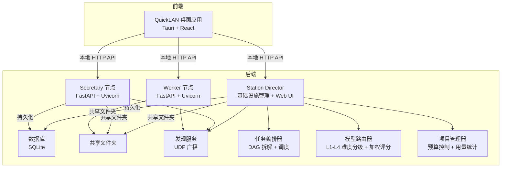
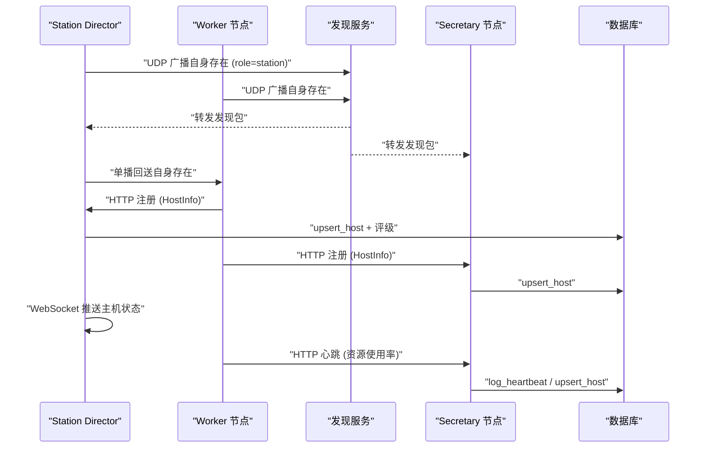
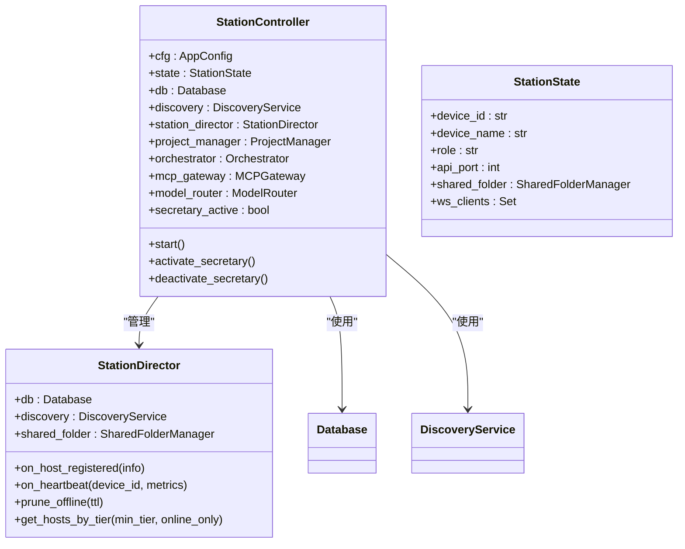
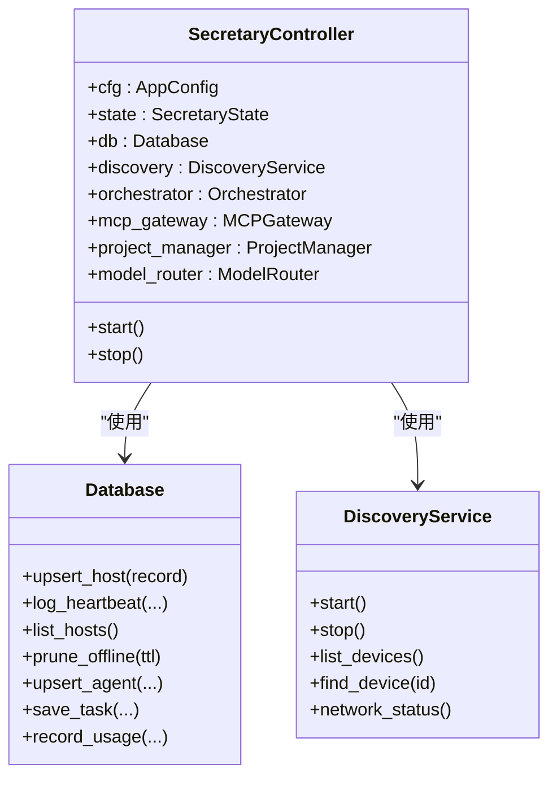
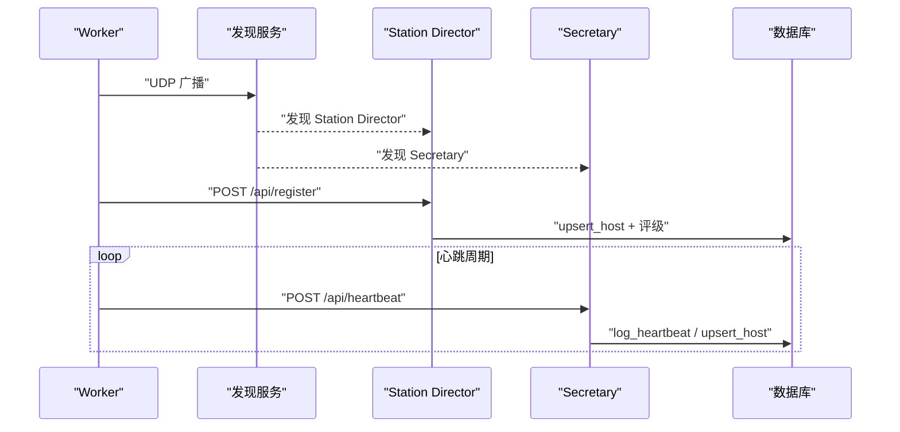
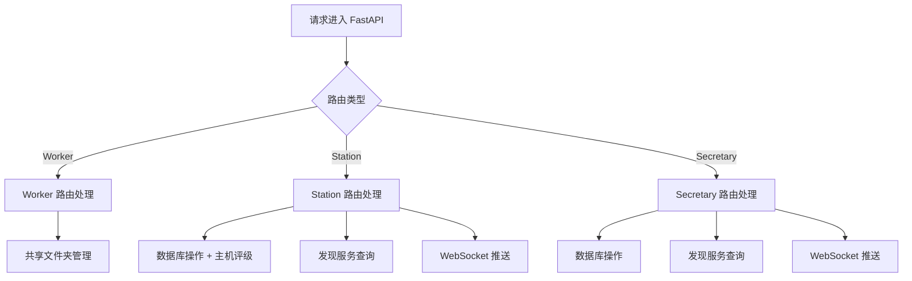
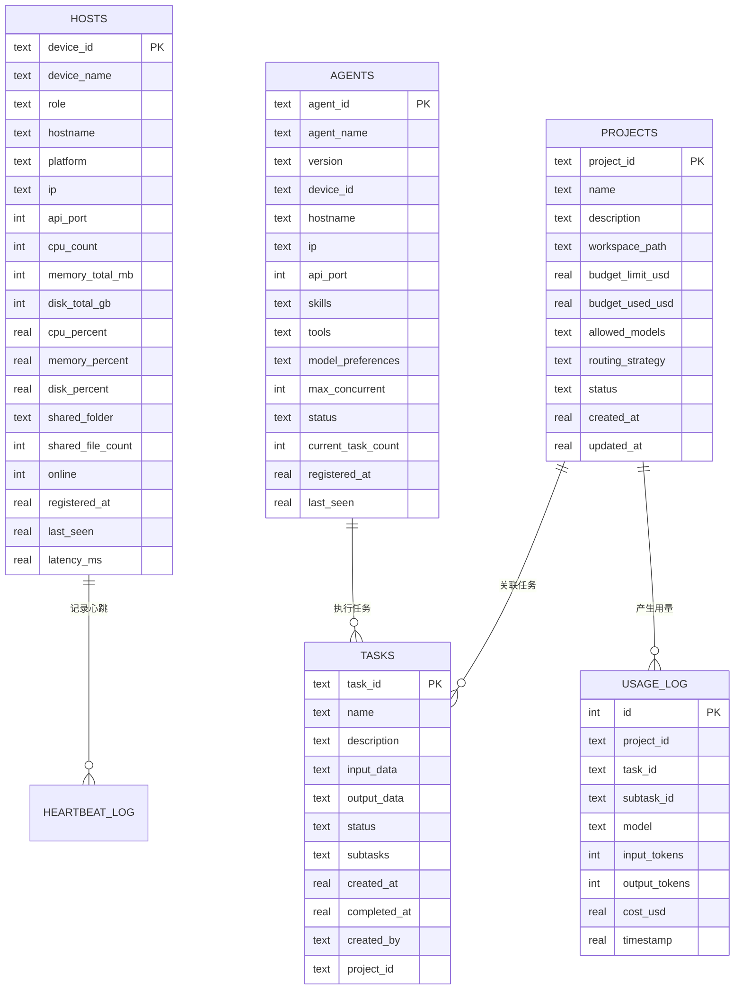
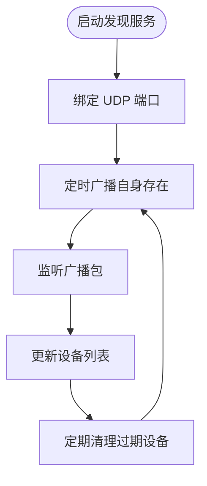
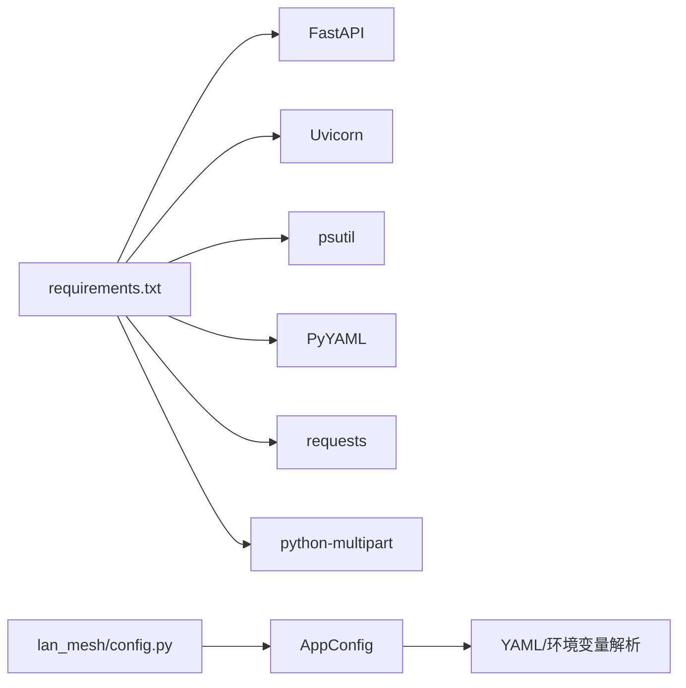

# 部署指南

<cite>
**本文引用的文件**
- [README.md](file://README.md)
- [main.py](file://main.py)
- [config.yaml](file://config.yaml)
- [requirements.txt](file://requirements.txt)
- [lan_mesh/config.py](file://lan_mesh/config.py)
- [lan_mesh/secretary.py](file://lan_mesh/secretary.py)
- [lan_mesh/worker.py](file://lan_mesh/worker.py)
- [lan_mesh/api.py](file://lan_mesh/api.py)
- [lan_mesh/database.py](file://lan_mesh/database.py)
- [lan_mesh/discovery.py](file://lan_mesh/discovery.py)
- [lan_mesh/host_info.py](file://lan_mesh/host_info.py)
- [lan_mesh/model_pool.example.yaml](file://lan_mesh/model_pool.example.yaml)
- [lan_mesh/station_controller.py](file://lan_mesh/station_controller.py)
- [lan_mesh/station_director.py](file://lan_mesh/station_director.py)
- [lan_mesh/station_api.py](file://lan_mesh/station_api.py)
- [lan_mesh/web/templates/dashboard.html](file://lan_mesh/web/templates/dashboard.html)
- [quicklan-main/README.md](file://quicklan-main/README.md)
- [scripts/setup_env.bat](file://scripts/setup_env.bat)
- [scripts/setup_env.ps1](file://scripts/setup_env.ps1)
- [scripts/setup_env.sh](file://scripts/setup_env.sh)
- [scripts/start_secretary.bat](file://scripts/start_secretary.bat)
- [scripts/start_secretary.ps1](file://scripts/start_secretary.ps1)
- [scripts/start_secretary.sh](file://scripts/start_secretary.sh)
- [scripts/start_worker.bat](file://scripts/start_worker.bat)
- [scripts/start_worker.ps1](file://scripts/start_worker.ps1)
- [scripts/start_worker.sh](file://scripts/start_worker.sh)
- [scripts/start_station.bat](file://scripts/start_station.bat)
- [scripts/start_station.ps1](file://scripts/start_station.ps1)
- [scripts/start_station.sh](file://scripts/start_station.sh)
</cite>

## 更新摘要
**所做更改**
- 新增完整的跨平台启动脚本支持（start_station.bat, start_station.ps1, start_station.sh）
- 新增Station模式的部署指南和动态Secretary激活功能
- 新增完整的Web UI仪表盘和Dashboard界面
- 新增Secretary模式的动态激活/停用机制
- 新增Station Director的基础设施管理功能
- 更新模型池配置系统的完整说明，包含订阅制模型支持

## 目录
1. [简介](#简介)
2. [项目结构](#项目结构)
3. [核心组件](#核心组件)
4. [架构总览](#架构总览)
5. [详细组件分析](#详细组件分析)
6. [依赖分析](#依赖分析)
7. [性能考虑](#性能考虑)
8. [故障排查指南](#故障排查指南)
9. [结论](#结论)
10. [附录](#附录)

## 简介
本指南面向 Work Station 项目（LAN Mesh）在生产环境的部署，涵盖服务器配置、防火墙与网络规划、Docker 容器化与 Kubernetes 部署、负载均衡与高可用、多平台部署注意事项、性能调优与监控、备份与灾难恢复、以及安全加固与合规性要求。文档基于仓库现有实现进行说明，并提供可操作的步骤与图示。

**更新** 新增跨平台启动脚本支持，提供完整的Station模式部署方案，包含动态Secretary激活功能和Web UI仪表盘。

## 项目结构
Work Station 由 Python 后端与前端桌面应用两部分组成：
- Python 后端：LAN Mesh 核心，包含 Station Director、Secretary/Worker 节点、API、发现服务、数据库与共享文件夹管理。
- 前端桌面应用：QuickLAN（React + Tauri），用于本地控制与展示，与后端通过本地 HTTP API 交互。



**图表来源**
- [lan_mesh/station_controller.py:69-121](file://lan_mesh/station_controller.py#L69-L121)
- [lan_mesh/secretary.py:68-332](file://lan_mesh/secretary.py#L68-L332)
- [lan_mesh/worker.py:62-325](file://lan_mesh/worker.py#L62-L325)
- [lan_mesh/api.py:103-526](file://lan_mesh/api.py#L103-L526)
- [lan_mesh/database.py:16-143](file://lan_mesh/database.py#L16-L143)
- [lan_mesh/discovery.py:33-259](file://lan_mesh/discovery.py#L33-L259)

**章节来源**
- [main.py:19-98](file://main.py#L19-L98)
- [lan_mesh/station_controller.py:69-121](file://lan_mesh/station_controller.py#L69-L121)
- [lan_mesh/secretary.py:68-332](file://lan_mesh/secretary.py#L68-L332)
- [lan_mesh/worker.py:62-325](file://lan_mesh/worker.py#L62-L325)
- [lan_mesh/api.py:103-526](file://lan_mesh/api.py#L103-L526)
- [lan_mesh/database.py:16-143](file://lan_mesh/database.py#L16-L143)
- [lan_mesh/discovery.py:33-259](file://lan_mesh/discovery.py#L33-L259)

## 核心组件
- 配置系统：基于 Pydantic 的强类型配置，支持 YAML 与环境变量覆盖，默认路径与查找顺序明确。
- Station Director：独立控制器，提供基础设施管理、Web UI、WebSocket 推送、数据库持久化、共享文件夹、主机评级与资源池管理。
- Secretary 节点：提供 Web UI、HTTP API、WebSocket 推送、数据库持久化、共享文件夹、任务与项目管理、MCP 工具网关。
- Worker 节点：自动采集本机信息、共享文件夹、UDP 发现、HTTP 注册与心跳、任务执行路由。
- 发现服务：基于 UDP 广播的局域网设备发现，支持 TTL 清理与主动探测。
- 数据库：SQLite，存储主机、Agent、任务、项目与用量日志，带索引优化。
- API 层：统一的 FastAPI 路由，分别暴露 Worker、Station Director 与 Secretary 的端点。
- 模型池：支持多供应商模型配置，包含成本、质量、速度评分和降级链。

**更新** 新增Station Director的基础设施管理功能，支持动态Secretary激活/停用，提供完整的Web UI仪表盘。

**章节来源**
- [lan_mesh/config.py:48-84](file://lan_mesh/config.py#L48-L84)
- [lan_mesh/station_controller.py:69-121](file://lan_mesh/station_controller.py#L69-L121)
- [lan_mesh/secretary.py:68-332](file://lan_mesh/secretary.py#L68-L332)
- [lan_mesh/worker.py:62-325](file://lan_mesh/worker.py#L62-L325)
- [lan_mesh/api.py:103-526](file://lan_mesh/api.py#L103-L526)
- [lan_mesh/database.py:16-143](file://lan_mesh/database.py#L16-L143)
- [lan_mesh/discovery.py:33-259](file://lan_mesh/discovery.py#L33-L259)
- [lan_mesh/model_pool.example.yaml:140-331](file://lan_mesh/model_pool.example.yaml#L140-L331)

## 架构总览
LAN Mesh 采用"Station Director + Secretary/Worker"的混合架构：
- Station Director 负责基础设施管理、主机评级与资源池、Web UI 仪表盘。
- Secretary 节点负责注册、心跳、可视化、任务编排、项目预算与用量统计、MCP 工具网关。
- Worker 节点负责本机信息采集、共享文件夹、发现与注册、心跳上报、任务执行。
- 发现服务贯穿两端，保证局域网内设备互通与拓扑感知。
- 数据库持久化所有状态，Web UI 与 WebSocket 实时推送。



**图表来源**
- [lan_mesh/station_director.py:40-104](file://lan_mesh/station_director.py#L40-L104)
- [lan_mesh/discovery.py:139-214](file://lan_mesh/discovery.py#L139-L214)
- [lan_mesh/api.py:116-168](file://lan_mesh/api.py#L116-L168)
- [lan_mesh/database.py:147-201](file://lan_mesh/database.py#L147-L201)

**章节来源**
- [lan_mesh/station_director.py:40-104](file://lan_mesh/station_director.py#L40-L104)
- [lan_mesh/discovery.py:139-214](file://lan_mesh/discovery.py#L139-L214)
- [lan_mesh/api.py:116-168](file://lan_mesh/api.py#L116-L168)
- [lan_mesh/database.py:147-201](file://lan_mesh/database.py#L147-L201)

## 详细组件分析

### Station Director 组件分析
- 启动流程：自检、生成设备 ID、初始化数据库、创建共享文件夹、启动 FastAPI/Uvicorn、启动发现服务、启动清理与配置刷新线程。
- 核心功能：基础设施管理、主机评级与资源池、WebSocket 推送、动态Secretary激活/停用。
- Web UI：完整的仪表盘界面，包含主机监控、网络状态、事件历史等功能。
- 动态激活：支持在运行时激活/停用 Secretary 模式，无需重启服务。

**更新** 新增Station Director的完整功能分析，包括基础设施管理、动态Secretary激活和Web UI仪表盘。



**图表来源**
- [lan_mesh/station_controller.py:69-121](file://lan_mesh/station_controller.py#L69-L121)
- [lan_mesh/station_director.py:28-36](file://lan_mesh/station_director.py#L28-L36)
- [lan_mesh/station_controller.py:57-67](file://lan_mesh/station_controller.py#L57-L67)

**章节来源**
- [lan_mesh/station_controller.py:69-121](file://lan_mesh/station_controller.py#L69-L121)
- [lan_mesh/station_director.py:28-36](file://lan_mesh/station_director.py#L28-L36)
- [lan_mesh/station_controller.py:57-67](file://lan_mesh/station_controller.py#L57-L67)

### Secretary 组件分析
- 启动流程：自检、生成设备 ID、初始化数据库、创建共享文件夹、启动 FastAPI/Uvicorn、启动发现服务、启动清理与配置刷新线程。
- API 能力：注册/心跳、主机列表、网络状态、发现设备、WebSocket 推送、Agent 管理、任务与项目管理、MCP 工具网关。
- Web UI：静态资源挂载与仪表盘页面。

**更新** 新增模型路由器和项目管理器集成，提供任务编排和预算控制功能，支持阿里云百炼 Token Plan 模型。



**图表来源**
- [lan_mesh/secretary.py:68-120](file://lan_mesh/secretary.py#L68-L120)
- [lan_mesh/database.py:16-143](file://lan_mesh/database.py#L16-L143)
- [lan_mesh/discovery.py:33-94](file://lan_mesh/discovery.py#L33-L94)

**章节来源**
- [lan_mesh/secretary.py:68-332](file://lan_mesh/secretary.py#L68-L332)
- [lan_mesh/database.py:16-143](file://lan_mesh/database.py#L16-L143)
- [lan_mesh/discovery.py:33-94](file://lan_mesh/discovery.py#L33-L94)

### Worker 组件分析
- 启动流程：自检、生成设备 ID、创建共享文件夹、启动 FastAPI/Uvicorn、启动发现服务、注册与心跳循环。
- API 能力：本机信息、共享文件列举/下载/上传、任务执行端点（通过 AgentRuntime）。
- Agent 卡片：Worker 向 Secretary 注册自身能力（技能、工具、偏好等）。



**图表来源**
- [lan_mesh/worker.py:126-215](file://lan_mesh/worker.py#L126-L215)
- [lan_mesh/api.py:116-168](file://lan_mesh/api.py#L116-L168)
- [lan_mesh/database.py:194-201](file://lan_mesh/database.py#L194-L201)

**章节来源**
- [lan_mesh/worker.py:62-325](file://lan_mesh/worker.py#L62-L325)
- [lan_mesh/api.py:116-168](file://lan_mesh/api.py#L116-L168)
- [lan_mesh/database.py:194-201](file://lan_mesh/database.py#L194-L201)

### API 层与路由
- Worker 路由：/info、/shared 列举/下载/上传、/tasks/execute。
- Station Director 路由：/api/register、/api/heartbeat、/api/hosts、/api/network、/api/discovery、/api/probe/{ip}、/ws、/api/station/*。
- Secretary 路由：/api/register、/api/heartbeat、/api/hosts、/api/network、/api/discovery、/api/probe/{ip}、/ws、/api/agents、/api/tasks、/api/projects、/tools/*。



**图表来源**
- [lan_mesh/api.py:39-98](file://lan_mesh/api.py#L39-L98)
- [lan_mesh/station_api.py:42-97](file://lan_mesh/station_api.py#L42-L97)
- [lan_mesh/api.py:103-526](file://lan_mesh/api.py#L103-L526)

**章节来源**
- [lan_mesh/api.py:39-98](file://lan_mesh/api.py#L39-L98)
- [lan_mesh/station_api.py:42-97](file://lan_mesh/station_api.py#L42-L97)
- [lan_mesh/api.py:103-526](file://lan_mesh/api.py#L103-L526)

### 数据库与持久化
- 表结构：hosts、heartbeat_log、agents、tasks、projects、usage_log；索引覆盖常用查询。
- 操作：UPSERT、查询、清理过期心跳、按状态过滤、用量记录。



**图表来源**
- [lan_mesh/database.py:36-143](file://lan_mesh/database.py#L36-L143)
- [lan_mesh/database.py:145-611](file://lan_mesh/database.py#L145-L611)

**章节来源**
- [lan_mesh/database.py:36-143](file://lan_mesh/database.py#L36-L143)
- [lan_mesh/database.py:145-611](file://lan_mesh/database.py#L145-L611)

### 发现服务与网络规划
- UDP 广播端口：默认 45454，广播目标基于本地子网计算。
- TTL 与清理：设备离线阈值可配置，定期清理过期设备。
- 端口范围：Station/Secretary/Worker API 端口可配置，默认端口见配置文件。



**图表来源**
- [lan_mesh/discovery.py:139-228](file://lan_mesh/discovery.py#L139-L228)
- [lan_mesh/host_info.py:77-103](file://lan_mesh/host_info.py#L77-L103)

**章节来源**
- [lan_mesh/discovery.py:139-228](file://lan_mesh/discovery.py#L139-L228)
- [lan_mesh/host_info.py:77-103](file://lan_mesh/host_info.py#L77-L103)

### 模型池配置系统
- 多供应商支持：DeepSeek、OpenAI、Anthropic、通义千问、阿里云百炼 Token Plan 等主流模型提供商。
- 成本控制：每千tokens的成本定价，支持预算控制和用量统计。
- 智能降级：每个模型配置降级链，确保服务连续性。
- 环境变量：通过环境变量名引用API Key，支持多环境配置。
- 订阅制支持：阿里云百炼 Token Plan 提供统一 Credits 计量，无需显式成本定价。

**更新** 新增阿里云百炼 Token Plan 配置支持，提供完整的订阅制模型接入方案，包含多品牌模型统一 Credits 计量。

**章节来源**
- [lan_mesh/model_pool.example.yaml:140-331](file://lan_mesh/model_pool.example.yaml#L140-L331)

## 依赖分析
- 运行时依赖：FastAPI、Uvicorn、psutil、PyYAML、requests、python-multipart 等。
- 配置解析：YAML 与环境变量覆盖，支持多路径查找。
- 端口与协议：TCP（HTTP API）、UDP（发现）。



**图表来源**
- [requirements.txt:1-8](file://requirements.txt#L1-L8)
- [lan_mesh/config.py:48-84](file://lan_mesh/config.py#L48-L84)

**章节来源**
- [requirements.txt:1-8](file://requirements.txt#L1-L8)
- [lan_mesh/config.py:48-84](file://lan_mesh/config.py#L48-L84)

## 性能考虑
- 端口选择：Station/Secretary/Worker 默认端口可配置，避免冲突；发现 TTL 与心跳间隔影响延迟与资源消耗。
- 数据库索引：按 status、timestamp 等建立索引，减少查询开销。
- 心跳频率：合理设置心跳间隔，平衡实时性与网络负载。
- 文件共享：大文件传输建议使用 Worker 的共享文件夹能力，结合断点续传与校验（如需）。
- 并发与线程：发现服务与清理线程为守护线程，避免阻塞主进程。
- 模型路由：加权评分算法的计算开销和降级链的容错机制。
- Station Director：主机评级计算和资源池查询的性能优化。

**更新** 新增Station Director的性能考虑，包括主机评级计算和资源池查询的性能优化，以及动态Secretary激活的性能影响。

**章节来源**
- [config.yaml:5-21](file://config.yaml#L5-L21)
- [lan_mesh/database.py:105-136](file://lan_mesh/database.py#L105-L136)
- [lan_mesh/discovery.py:139-228](file://lan_mesh/discovery.py#L139-L228)
- [lan_mesh/station_director.py:54-79](file://lan_mesh/station_director.py#L54-L79)

## 故障排查指南
- 端口占用：启动时会尝试查找可用端口，若绑定失败请检查端口占用或调整配置。
- 发现失败：确认 UDP 45454 可用、防火墙放行、子网广播可达。
- 注册/心跳异常：检查 Station/Secretary 地址与端口是否正确、网络连通性、超时设置。
- 数据库异常：确认 SQLite 文件权限与磁盘空间充足。
- 日志定位：启动输出包含设备 ID、共享目录、数据库路径、Web UI 访问地址等信息。
- 模型池配置：检查 model_pool.yaml 格式、API Key 环境变量设置、降级链配置。
- Token Plan 配置：检查 ALIYUN_TOKENPLAN_API_KEY 环境变量设置、Token Plan 服务可用性。
- Station Director：确认Web UI可访问、WebSocket连接正常、主机评级功能正常。

**更新** 新增Station Director相关的故障排查，包括Web UI访问、WebSocket连接和主机评级功能的问题诊断。

**章节来源**
- [lan_mesh/station_controller.py:312-331](file://lan_mesh/station_controller.py#L312-L331)
- [lan_mesh/worker.py:240-269](file://lan_mesh/worker.py#L240-L269)
- [lan_mesh/discovery.py:155-174](file://lan_mesh/discovery.py#L155-L174)

## 结论
Work Station 项目提供了清晰的 Station Director + Secretary/Worker 架构与完善的局域网发现、注册、心跳与可视化能力。通过合理的网络规划、容器化与高可用部署，可在生产环境中稳定运行。建议结合本文的部署步骤、性能调优与安全加固建议，逐步完成上线与运维。

**更新** 新增跨平台启动脚本支持，提供完整的Station模式部署方案，包含动态Secretary激活功能和Web UI仪表盘。

## 附录

### 快速开始安装、配置和启动

#### Windows 环境初始化（推荐）
```cmd
# 使用批处理脚本一键初始化环境
scripts\setup_env.bat
```

该脚本会自动完成以下步骤：
1. 检查 Python 版本（3.11+）
2. 创建虚拟环境 `.venv/`
3. 安装依赖
4. 复制模型池配置模板

#### PowerShell 环境初始化
```powershell
# 使用 PowerShell 脚本初始化环境
.\scripts\setup_env.ps1
```

#### Linux/macOS 环境初始化
```bash
# 使用 Shell 脚本初始化环境
bash scripts/setup_env.sh
```

**更新** 新增 Windows 批处理脚本的完整使用说明，提供一键式环境初始化体验。

#### 配置模型池
复制模板并填入 API Key 环境变量名：
```powershell
cp lan_mesh/model_pool.example.yaml lan_mesh/model_pool.yaml
```

设置环境变量（按需）：
```powershell
# Windows (PowerShell)
$env:DEEPSEEK_API_KEY = "sk-xxx"
$env:OPENAI_API_KEY = "sk-xxx"
$env:QWEN_API_KEY = "sk-xxx"
$env:ALIYUN_TOKENPLAN_API_KEY = "你的TokenPlan专属Key"

# Windows (批处理)
set DEEPSEEK_API_KEY=sk-xxx
set OPENAI_API_KEY=sk-xxx
set QWEN_API_KEY=sk-xxx
set ALIYUN_TOKENPLAN_API_KEY=你的TokenPlan专属Key

# Linux/macOS
export DEEPSEEK_API_KEY="sk-xxx"
export OPENAI_API_KEY="sk-xxx"
export QWEN_API_KEY="sk-xxx"
export ALIYUN_TOKENPLAN_API_KEY="你的TokenPlan专属Key"
```

**更新** 新增 ALIYUN_TOKENPLAN_API_KEY 环境变量设置说明，支持阿里云百炼 Token Plan 配置。

#### 启动 Station Director（推荐）

**Windows 批处理脚本**：
```cmd
# 基本启动
scripts\start_station.bat

# 自定义端口和名称
scripts\start_station.bat --port 8080 --name "控制中心"
scripts\start_station.bat -p 8080 -n "控制中心"
```

**PowerShell 脚本**：
```powershell
# 基本启动
.\scripts\start_station.ps1

# 自定义端口和名称
.\scripts\start_station.ps1 -Port 8080 -Name "控制中心"
```

**Shell 脚本**：
```bash
# 基本启动
bash scripts/start_station.sh

# 自定义端口和名称
bash scripts/start_station.sh --port 8080 --name "控制中心"
```

Station Director 启动后在 `http://localhost:45470` 提供 Web UI 仪表盘和 API。

**更新** 新增完整的跨平台启动脚本使用说明，包括参数传递和自定义配置。

#### 启动 Secretary 节点

**Windows 批处理脚本**：
```cmd
# 基本启动
scripts\start_secretary.bat

# 自定义端口和名称
scripts\start_secretary.bat --port 8080 --name "控制中心"
scripts\start_secretary.bat -p 8080 -n "控制中心"
```

**PowerShell 脚本**：
```powershell
# 基本启动
.\scripts\start_secretary.ps1

# 自定义端口和名称
.\scripts\start_secretary.ps1 -Port 8080 -Name "控制中心"
```

**Shell 脚本**：
```bash
# 基本启动
bash scripts/start_secretary.sh

# 自定义端口和名称
bash scripts/start_secretary.sh --port 8080 --name "控制中心"
```

Secretary 启动后在 `http://localhost:45470` 提供 Web UI 仪表盘和 API。

**更新** 新增完整的 Windows 批处理脚本使用说明，包括参数传递和自定义配置。

#### 启动 Worker 节点

**Windows 批处理脚本**：
```cmd
# 基本启动
scripts\start_worker.bat

# 自定义端口和名称
scripts\start_worker.bat --port 45460 --name "计算节点-01"
scripts\start_worker.bat -p 45460 -n "计算节点-01"
```

**PowerShell 脚本**：
```powershell
# 基本启动
.\scripts\start_worker.ps1

# 自定义端口和名称
.\scripts\start_worker.ps1 -Port 45460 -Name "计算节点-01"
```

**Shell 脚本**：
```bash
# 基本启动
bash scripts/start_worker.sh

# 自定义端口和名称
bash scripts/start_worker.sh --port 45460 --name "计算节点-01"
```

Worker 自动发现 Station Director/Secretary 并注册，等待任务分发。

**更新** 新增 Windows 批处理脚本的 Worker 启动说明。

### 生产环境部署步骤（通用）
- 准备服务器：安装 Python 3.8+、pip 依赖（见 requirements.txt）。
- 配置文件：准备 config.yaml，设置发现端口、Station/Secretary/Worker 端口、共享目录与设备名。
- 启动 Station Director：在主控节点运行，启动 Web UI 与 API。
- 启动 Worker：在各工作节点运行，自动发现并注册到 Station Director/Secretary。
- 防火墙与网络：开放 UDP 45454 与 Station/Secretary/Worker API 端口；确保子网广播可达。
- 监控与日志：收集 Uvicorn/FastAPI 日志与应用输出，结合数据库慢查询分析。

**更新** 新增命令行参数覆盖配置的高级部署选项。

**章节来源**
- [requirements.txt:1-8](file://requirements.txt#L1-L8)
- [config.yaml:1-22](file://config.yaml#L1-L22)
- [lan_mesh/station_controller.py:312-384](file://lan_mesh/station_controller.py#L312-L384)
- [lan_mesh/secretary.py:246-332](file://lan_mesh/secretary.py#L246-L332)
- [lan_mesh/worker.py:253-325](file://lan_mesh/worker.py#L253-L325)
- [main.py:25-98](file://main.py#L25-L98)

### Docker 容器化部署方案
- 基础镜像：使用官方 Python 运行时镜像。
- 构建步骤：复制 requirements.txt、安装依赖、复制源码、设置工作目录。
- 端口映射：映射 Station/Secretary/Worker API 端口与 UDP 45454（需要 hostNetwork 或 privileged 权限以支持广播）。
- 卷挂载：挂载共享文件夹与数据目录（含 SQLite）。
- 健康检查：通过 /api/health 或 /info 端点进行探活。
- 注意事项：UDP 广播在容器网络中可能受限，推荐 hostNetwork 或使用特权模式。

**更新** 新增阿里云百炼 Token Plan 配置文件的容器化部署注意事项，包括环境变量注入和 Token Plan 服务的网络访问配置。

**章节来源**
- [requirements.txt:1-8](file://requirements.txt#L1-L8)
- [config.yaml:5-21](file://config.yaml#L5-L21)
- [lan_mesh/api.py:242-250](file://lan_mesh/api.py#L242-L250)

### Kubernetes 部署配置
- DaemonSet/Deployment：Station 建议 Deployment，Secretary 建议 Deployment，Worker 建议 DaemonSet 或按节点数 Deployment。
- 网络策略：启用 hostNetwork 或配置额外的 UDP 端口暴露；限制入站规则仅允许来自集群内部的访问。
- ConfigMap：存放 config.yaml；Secret：存放敏感配置（如令牌或密钥）。
- PVC：为共享文件夹与 SQLite 数据目录提供持久卷。
- 服务发现：通过 ClusterIP 服务暴露 Station/Secretary API，Worker 通过 UDP 广播发现 Station/Secretary。
- 资源限制：为 Station/Secretary/Worker 设置 CPU/内存限制，避免资源争用。

**更新** 新增阿里云百炼 Token Plan 配置文件的 Kubernetes 部署配置，包括 Secret 管理和环境变量注入。

**章节来源**
- [config.yaml:5-21](file://config.yaml#L5-L21)
- [lan_mesh/api.py:116-168](file://lan_mesh/api.py#L116-L168)

### 负载均衡与高可用
- Station/Secretary 高可用：使用外部负载均衡器（如 HAProxy/Nginx/云 LB）分发到多个实例；注意会话粘性与状态一致性。
- Worker 节点：无状态，可水平扩展；通过共享文件夹与数据库实现状态共享。
- 数据库：SQLite 适合单实例；生产建议迁移到 PostgreSQL/MySQL 并配合主从或集群方案。
- 发现层：多 Station/Secretary 场景下，Worker 仍通过 UDP 广播发现，Station/Secretary 间通过数据库同步状态。

**更新** 新增模型路由器在高可用场景下的部署考虑，包括 Token Plan 服务的高可用配置。

**章节来源**
- [lan_mesh/database.py:16-143](file://lan_mesh/database.py#L16-L143)
- [lan_mesh/discovery.py:139-214](file://lan_mesh/discovery.py#L139-L214)

### 不同操作系统与平台的部署注意事项
- Linux：默认网络接口与广播地址计算正常；注意防火墙（iptables/nftables）与 SELinux。
- Windows：Python 与端口占用检查；注意 PowerShell 执行策略与防病毒软件拦截。
- macOS：网络接口命名差异；注意系统权限与防火墙设置。
- 前端桌面应用（QuickLAN）：Windows 安装包生成路径与端口范围参考 README。

**更新** 新增 Windows 批处理脚本的执行策略和防病毒软件注意事项。

**章节来源**
- [quicklan-main/README.md:43-48](file://quicklan-main/README.md#L43-L48)

### 性能调优建议
- 心跳与 TTL：根据网络规模与延迟调整心跳间隔与 TTL。
- 数据库：定期清理过期心跳日志；为高频查询字段建立索引。
- 文件传输：利用共享文件夹进行大文件传输，减少 API 压力。
- 并发：合理设置 Worker 数量与并发上限，避免 CPU/IO 抖动。
- 模型路由：加权评分算法的计算优化和降级链的容错机制。
- Station Director：主机评级计算的缓存策略和资源池查询的性能优化。

**更新** 新增模型路由器的性能调优建议，包括加权评分算法的计算优化和降级链的容错机制，以及 Token Plan 服务的性能考虑。

**章节来源**
- [config.yaml:5-21](file://config.yaml#L5-L21)
- [lan_mesh/database.py:282-289](file://lan_mesh/database.py#L282-L289)
- [lan_mesh/station_director.py:54-79](file://lan_mesh/station_director.py#L54-L79)

### 监控配置
- 指标采集：CPU/内存/磁盘使用率、网络接口流量、API 响应时间与错误率。
- 日志：应用日志、Uvicorn 访问日志、数据库慢查询日志。
- 可视化：Grafana + Prometheus 或 Loki/Tempo/Promtail 组合。
- 告警：基于资源使用率、服务不可用、发现异常等阈值触发告警。

**更新** 新增模型路由器和项目管理器的监控指标建议，包括 Token Plan 服务的使用情况监控。

**章节来源**
- [lan_mesh/api.py:170-204](file://lan_mesh/api.py#L170-L204)
- [lan_mesh/database.py:194-201](file://lan_mesh/database.py#L194-L201)

### 备份与灾难恢复
- 备份对象：SQLite 数据库文件、共享文件夹、配置文件。
- 备份策略：增量/全量备份结合，保留多版本；异地存储。
- 恢复流程：停止服务 -> 恢复数据库与共享文件夹 -> 启动服务 -> 验证发现与心跳。
- 灾难场景：Station/Secretary 节点故障时，切换到备用实例；Worker 重新注册与心跳恢复。

**更新** 新增模型池配置文件的备份和恢复策略，包括 Token Plan 配置的安全存储建议。

**章节来源**
- [config.yaml:16-21](file://config.yaml#L16-L21)
- [lan_mesh/database.py:16-143](file://lan_mesh/database.py#L16-L143)

### 安全加固与合规性
- 网络隔离：仅在受信任的局域网内部署；必要时使用 VLAN/子网划分。
- 端口与协议：最小化开放端口；禁用不必要的服务；使用 HTTPS（如需）。
- 访问控制：限制 API 访问来源；在反向代理层增加认证与速率限制。
- 数据保护：共享文件夹与数据库文件加密存储；定期轮换密钥。
- 合规性：遵循所在组织的数据保护政策与审计要求；保留操作日志。

**更新** 新增模型池配置文件的安全存储和访问控制建议，包括 Token Plan API Key 的安全管理。

**章节来源**
- [lan_mesh/api.py:116-168](file://lan_mesh/api.py#L116-L168)
- [lan_mesh/discovery.py:155-174](file://lan_mesh/discovery.py#L155-L174)

### 端口说明
| 端口 | 协议 | 用途 |
|------|------|------|
| 45454 | UDP | 设备发现广播 |
| 45460 | TCP | Worker HTTP API |
| 45470 | TCP | Station/Secretary HTTP API + Web UI |

**更新** 新增端口说明表格，包含模型路由器和项目管理器的 API 端口。

**章节来源**
- [README.md:108-115](file://README.md#L108-L115)

### API 概览
#### 任务管理
- `POST /api/tasks/submit` — 提交任务（支持关联项目）
- `GET /api/tasks/{id}` — 查询任务状态与子任务 DAG

#### 项目管理
- `POST /api/projects` — 创建项目（含预算、模型白名单、路由策略）
- `GET /api/projects` — 列出所有项目
- `GET /api/projects/{id}/usage` — 查看消费记录

#### 模型路由
- `POST /api/route/dry-run` — 路由决策预览（输入文本 → 推荐模型 + 评分详情）
- `GET /api/models` — 模型池列表

#### 实时通信
- `WS /ws` — WebSocket 推送（主机状态、任务变更、项目事件）

**更新** 新增模型路由器和项目管理器的 API 端点说明。

**章节来源**
- [README.md:116-133](file://README.md#L116-L133)

### 使用启动脚本
项目提供了跨平台的启动脚本，简化节点启动过程：

#### Windows 批处理脚本
```cmd
# 环境初始化（推荐）
scripts\setup_env.bat

# 启动 Station Director（默认端口 45470）
scripts\start_station.bat

# 启动 Secretary 节点（默认端口 45470）
scripts\start_secretary.bat

# 启动 Worker 节点（默认端口 45460）
scripts\start_worker.bat

# 自定义端口和名称
scripts\start_station.bat --port 8080 --name "控制中心"
scripts\start_secretary.bat -p 45460 -n "计算节点-01"
scripts\start_worker.bat -p 45460 -n "计算节点-01"
```

#### Windows PowerShell 启动脚本
```powershell
# 启动 Station Director（默认端口 45470）
.\scripts\start_station.ps1

# 启动 Secretary 节点（默认端口 45470）
.\scripts\start_secretary.ps1

# 启动 Worker 节点（默认端口 45460）
.\scripts\start_worker.ps1

# 自定义端口和名称
.\scripts\start_station.ps1 -Port 8080 -Name "控制中心"
.\scripts\start_secretary.ps1 -Port 45460 -Name "计算节点-01"
.\scripts\start_worker.ps1 -Port 45460 -Name "计算节点-01"
```

#### Linux/macOS Shell 启动脚本
```bash
# 启动 Station Director（默认端口 45470）
bash scripts/start_station.sh

# 启动 Secretary 节点（默认端口 45470）
bash scripts/start_secretary.sh

# 启动 Worker 节点（默认端口 45460）
bash scripts/start_worker.sh

# 自定义端口和名称
bash scripts/start_station.sh --port 8080 --name "控制中心"
bash scripts/start_secretary.sh --port 45460 --name "计算节点-01"
bash scripts/start_worker.sh --port 45460 --name "计算节点-01"
```

**更新** 新增 Windows 批处理脚本的完整使用说明，包括环境初始化和参数传递。

**章节来源**
- [scripts/setup_env.bat:1-59](file://scripts/setup_env.bat#L1-L59)
- [scripts/setup_env.ps1:1-74](file://scripts/setup_env.ps1#L1-L74)
- [scripts/setup_env.sh:1-57](file://scripts/setup_env.sh#L1-L57)
- [scripts/start_station.bat:1-48](file://scripts/start_station.bat#L1-L48)
- [scripts/start_station.ps1:1-50](file://scripts/start_station.ps1#L1-L50)
- [scripts/start_station.sh:1-55](file://scripts/start_station.sh#L1-L55)
- [scripts/start_secretary.bat:1-47](file://scripts/start_secretary.bat#L1-L47)
- [scripts/start_secretary.ps1:1-49](file://scripts/start_secretary.ps1#L1-L49)
- [scripts/start_secretary.sh:1-55](file://scripts/start_secretary.sh#L1-L55)
- [scripts/start_worker.bat:1-47](file://scripts/start_worker.bat#L1-L47)
- [scripts/start_worker.ps1:1-49](file://scripts/start_worker.ps1#L1-L49)
- [scripts/start_worker.sh:1-55](file://scripts/start_worker.sh#L1-L55)

### Windows 执行策略与防病毒软件注意事项
- PowerShell 执行策略：如果遇到执行策略限制，请使用 `Set-ExecutionPolicy -ExecutionPolicy RemoteSigned -Scope CurrentUser` 命令临时放宽限制。
- 防病毒软件拦截：首次运行批处理脚本时，防病毒软件可能会拦截，请将其添加到白名单或临时关闭防护。
- UAC 权限：某些操作可能需要管理员权限，请以管理员身份运行命令提示符。
- 字符编码：批处理脚本已设置 UTF-8 编码，确保中文显示正常。

**更新** 新增 Windows 平台特有的部署注意事项和解决方案。

**章节来源**
- [scripts/setup_env.bat:1-59](file://scripts/setup_env.bat#L1-L59)
- [scripts/start_station.bat:1-48](file://scripts/start_station.bat#L1-L48)
- [scripts/start_secretary.bat:1-47](file://scripts/start_secretary.bat#L1-L47)
- [scripts/start_worker.bat:1-47](file://scripts/start_worker.bat#L1-L47)

### Station 模式部署指南

#### Station Director 概述
Station Director 是 LAN Mesh 的基础设施管理入口，提供：
- 独立的 Web UI 仪表盘
- 主机注册与心跳处理
- 主机评级与资源池管理
- 动态 Secretary 激活/停用
- WebSocket 实时推送

#### 启动 Station Director
```cmd
# 基本启动
python main.py station

# 自定义端口和名称
python main.py station --port 8080 --name "控制中心"
python main.py station -p 8080 -n "控制中心"
```

#### Web UI 仪表盘功能
- **Station 面板**：显示主机舰队概览、事件历史、Secretary 状态
- **主机监控**：实时查看所有注册主机的状态、资源使用率
- **网络状态**：显示 UDP 端口、API 端口、本地 IP 和广播目标
- **事件历史**：查看主机加入/离开/评级变更等事件

#### 动态 Secretary 激活
通过 Web UI 或 API 可以在运行时激活/停用 Secretary 模式：
- **激活 Secretary**：加载项目管理器、任务编排器、模型路由器、MCP 网关
- **停用 Secretary**：卸载所有项目管理组件，回到纯基础设施管理模式

#### API 端点
- `/api/station/activate-secretary` — 激活 Secretary 模式
- `/api/station/deactivate-secretary` — 停用 Secretary 模式
- `/api/station/roles` — 查询当前激活的角色
- `/api/station/fleet` — 获取主机舰队概览
- `/api/station/events` — 获取事件历史

**章节来源**
- [lan_mesh/station_controller.py:69-121](file://lan_mesh/station_controller.py#L69-L121)
- [lan_mesh/station_api.py:61-97](file://lan_mesh/station_api.py#L61-L97)
- [lan_mesh/web/templates/dashboard.html:127-200](file://lan_mesh/web/templates/dashboard.html#L127-L200)

### 阿里云百炼 Token Plan 配置指南

#### Token Plan 服务概述
阿里云百炼 Token Plan 是一种订阅制的模型服务，提供统一的 Credits 计量方式，支持多品牌模型的统一接入。与普通百炼 API Key 不同，Token Plan Key 需要在百炼控制台的 Token Plan 服务中生成。

#### 配置步骤
1. **获取 Token Plan API Key**
   - 登录阿里云百炼控制台
   - 进入 Token Plan 服务页面
   - 在成员管理中生成专用的 API Key

2. **设置环境变量**
   ```powershell
   # Windows (PowerShell)
   $env:ALIYUN_TOKENPLAN_API_KEY = "你的TokenPlan专属Key"
   
   # Windows (批处理)
   set ALIYUN_TOKENPLAN_API_KEY=你的TokenPlan专属Key
   
   # Linux/macOS
   export ALIYUN_TOKENPLAN_API_KEY="你的TokenPlan专属Key"
   ```

3. **配置模型池**
   在 `lan_mesh/model_pool.yaml` 中，Token Plan 模型配置示例：
   ```yaml
   - id: qwen3.7-max
     provider: aliyun-tokenplan
     api_key_env: ALIYUN_TOKENPLAN_API_KEY
     base_url: https://token-plan.cn-beijing.maas.aliyuncs.com/compatible-mode/v1
     cost_input_per_1k: 0.0     # 订阅制, 按Credits计量
     cost_output_per_1k: 0.0
     capabilities: [reasoning, coding, long_context]
     quality_score: 0.95
     speed_score: 0.70
     rate_limit_rpm: 200
     max_context_tokens: 131072
     fallback: [qwen3.7-plus, deepseek-v4-pro, kimi-k2.7-code]
   ```

#### 支持的 Token Plan 模型
- **通义千问系列**：qwen3.7-max、qwen3.7-plus、qwen3.6-plus、qwen3.6-flash
- **DeepSeek系列**：deepseek-v4-pro、deepseek-v4-flash、deepseek-v3.2
- **月之暗面 Kimi系列**：kimi-k2.7-code、kimi-k2.6、kimi-k2.5
- **智谱 GLM系列**：glm-5.2、glm-5.1、glm-5
- **MiniMax系列**：MiniMax-M2.5

#### 使用注意事项
- Token Plan Key 与普通百炼 API Key 不通用，必须使用专门生成的 Token Plan Key
- 订阅制服务按 Credits 计量，无需显式设置每千tokens成本
- 支持多品牌模型统一接入，简化企业级模型管理
- 建议在生产环境中为 Token Plan API Key 设置访问控制和限额

**章节来源**
- [lan_mesh/model_pool.example.yaml:140-331](file://lan_mesh/model_pool.example.yaml#L140-L331)
- [scripts/setup_env.bat:54](file://scripts/setup_env.bat#L54)
- [scripts/setup_env.ps1:70](file://scripts/setup_env.ps1#L70)
- [scripts/setup_env.sh:53](file://scripts/setup_env.sh#L53)