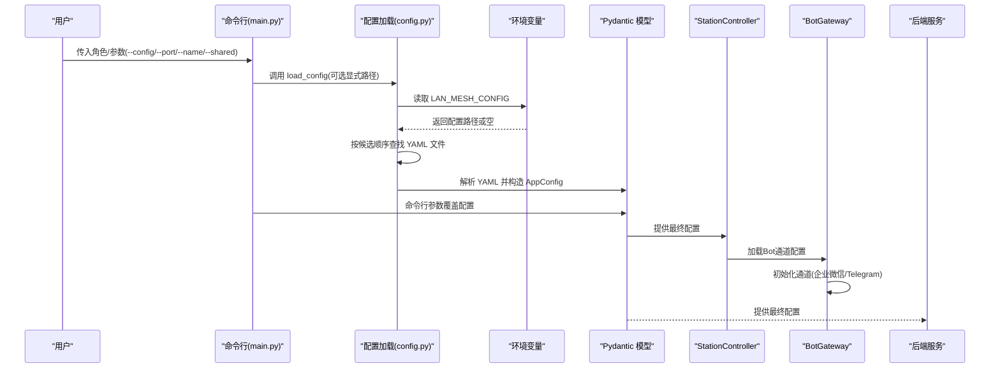
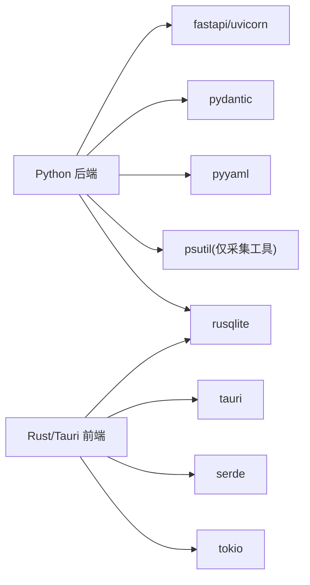

# 配置管理系统

<cite>
**本文档引用的文件**
- [config.yaml](file://config.yaml)
- [config.py](file://lan_mesh/config.py)
- [main.py](file://main.py)
- [collect_config.py](file://lan_mesh/collect_config.py)
- [bot_gateway.py](file://lan_mesh/bot_gateway.py)
- [station_controller.py](file://lan_mesh/station_controller.py)
- [station_api.py](file://lan_mesh/station_api.py)
- [dashboard.html](file://lan_mesh/web/templates/dashboard.html)
- [settings.rs](file://quicklan-main/src-tauri/src/settings.rs)
- [storage.rs](file://quicklan-main/src-tauri/src/storage.rs)
- [tauri.conf.json](file://quicklan-main/src-tauri/tauri.conf.json)
- [Cargo.toml](file://quicklan-main/src-tauri/Cargo.toml)
- [requirements.txt](file://requirements.txt)
- [worker.py](file://lan_mesh/worker.py)
- [preflight.py](file://lan_mesh/preflight.py)
- [secretary.py](file://lan_mesh/secretary.py)
- [model_pool.example.yaml](file://lan_mesh/model_pool.example.yaml)
- [model_pool.yaml](file://lan_mesh/model_pool.yaml)
</cite>

## 更新摘要
**所做更改**
- 新增Bot Gateway配置系统，支持企业微信群机器人和Telegram Bot通道管理
- 添加BotConfig和BotChannelConfig配置类，实现完整的Bot通道配置模型
- 集成Web UI的Bot通道配置界面，支持实时测试和管理
- 实现事件驱动的通知系统，支持多种事件类型的推送
- 更新配置模型，新增bot配置组和相关字段
- 新增Telegram Bot命令处理系统和内置命令支持

## 目录
1. [简介](#简介)
2. [项目结构](#项目结构)
3. [核心组件](#核心组件)
4. [架构总览](#架构总览)
5. [详细组件分析](#详细组件分析)
6. [Bot Gateway配置系统](#bot-gateway配置系统)
7. [依赖关系分析](#依赖关系分析)
8. [性能考虑](#性能考虑)
9. [故障排查指南](#故障排查指南)
10. [结论](#结论)
11. [附录](#附录)

## 简介
本文件系统性阐述配置管理的设计与实现，涵盖以下方面：
- 配置文件结构与 YAML 语法规范
- 参数覆盖与环境变量支持机制
- 完整配置项清单（网络、存储、安全、Bot通道等）
- 配置加载顺序与优先级规则
- 不同部署场景的配置示例与最佳实践
- 配置验证与错误处理机制
- 动态配置更新与热重载能力说明
- Bot Gateway配置系统与移动端通知集成

## 项目结构
本仓库包含两套配置体系：
- Python 后端（LAN Mesh）：基于 Pydantic 的强类型配置模型，支持 YAML 文件与命令行参数覆盖
- Rust/Tauri 前端（QuickLAN）：基于 JSON 的用户设置与应用数据目录管理

```mermaid
graph TB
subgraph "Python 后端"
CFG["config.py<br/>Pydantic 配置模型"]
YML["config.yaml<br/>YAML 配置文件"]
CLI["main.py<br/>命令行参数覆盖"]
BOT["bot_gateway.py<br/>Bot 通道管理"]
CTRL["station_controller.py<br/>控制器集成"]
API["station_api.py<br/>Bot API接口"]
UI["dashboard.html<br/>Bot配置界面"]
END
subgraph "Rust/Tauri 前端"
SET["settings.rs<br/>用户设置(JSON)"]
STOR["storage.rs<br/>应用数据目录"]
CONF["tauri.conf.json<br/>应用打包配置"]
END
YML --> CFG
CLI --> CFG
CFG --> CTRL
CTRL --> BOT
BOT --> API
API --> UI
SET --> STOR
STOR --> |"应用数据/配置目录"| RUNTIME["后端服务"]
CONF --> |"构建/打包"| RUNTIME
```

**图表来源**
- [config.py:1-159](file://lan_mesh/config.py#L1-L159)
- [config.yaml:1-22](file://config.yaml#L1-L22)
- [main.py:48-76](file://main.py#L48-L76)
- [bot_gateway.py:1-354](file://lan_mesh/bot_gateway.py#L1-L354)
- [station_controller.py:1-480](file://lan_mesh/station_controller.py#L1-L480)
- [station_api.py:693-722](file://lan_mesh/station_api.py#L693-L722)
- [dashboard.html:880-985](file://lan_mesh/web/templates/dashboard.html#L880-L985)
- [settings.rs:1-134](file://quicklan-main/src-tauri/src/settings.rs#L1-L134)
- [storage.rs:1-313](file://quicklan-main/src-tauri/src/storage.rs#L1-L313)
- [tauri.conf.json:1-48](file://quicklan-main/src-tauri/tauri.conf.json#L1-L48)

**章节来源**
- [config.py:1-159](file://lan_mesh/config.py#L1-L159)
- [config.yaml:1-22](file://config.yaml#L1-L22)
- [main.py:1-90](file://main.py#L1-L90)
- [bot_gateway.py:1-354](file://lan_mesh/bot_gateway.py#L1-L354)
- [station_controller.py:1-480](file://lan_mesh/station_controller.py#L1-L480)
- [station_api.py:693-722](file://lan_mesh/station_api.py#L693-L722)
- [dashboard.html:880-985](file://lan_mesh/web/templates/dashboard.html#L880-L985)
- [settings.rs:1-134](file://quicklan-main/src-tauri/src/settings.rs#L1-L134)
- [storage.rs:1-313](file://quicklan-main/src-tauri/src/storage.rs#L1-L313)
- [tauri.conf.json:1-48](file://quicklan-main/src-tauri/tauri.conf.json#L1-L48)

## 核心组件
- 配置模型（Pydantic）：定义 discovery、worker、secretary、bot 四类配置的字段与默认值
- 配置加载器：按候选路径查找 YAML 文件，支持环境变量覆盖
- 命令行覆盖：通过主程序解析参数，直接修改配置对象
- Bot Gateway：企业微信群机器人和 Telegram Bot 通道管理
- 用户设置（Rust/Tauri）：JSON 格式的用户偏好设置，持久化至应用配置目录
- 存储目录：统一管理应用数据、共享存储与数据库路径

**章节来源**
- [config.py:14-84](file://lan_mesh/config.py#L14-L84)
- [config.py:92-116](file://lan_mesh/config.py#L92-L116)
- [main.py:48-76](file://main.py#L48-L76)
- [bot_gateway.py:65-76](file://lan_mesh/bot_gateway.py#L65-L76)
- [settings.rs:9-13](file://quicklan-main/src-tauri/src/settings.rs#L9-L13)
- [storage.rs:9-27](file://quicklan-main/src-tauri/src/storage.rs#L9-L27)

## 架构总览
下图展示配置加载与覆盖的总体流程：



**图表来源**
- [main.py:48-76](file://main.py#L48-L76)
- [config.py:92-116](file://lan_mesh/config.py#L92-L116)
- [station_controller.py:201-219](file://lan_mesh/station_controller.py#L201-L219)
- [bot_gateway.py:78-98](file://lan_mesh/bot_gateway.py#L78-L98)

## 详细组件分析

### 配置文件结构与 YAML 语法
- 文件位置与命名
  - 支持的候选路径：显式路径、环境变量 LAN_MESH_CONFIG、用户主目录下的 ~/.lan_mesh/config.yaml、项目根目录 ./config.yaml
  - 若均不存在，则使用默认配置（所有字段采用模型默认值）
- 结构层级
  - discovery：UDP 发现相关参数
  - worker：Worker 节点运行参数
  - secretary：Secretary 节点运行参数（含数据库路径）
  - bot：Bot 通道配置（新增）

**更新** 新增了bot配置组，支持企业微信群机器人和Telegram Bot通道

**章节来源**
- [config.yaml:1-22](file://config.yaml#L1-L22)
- [config.py:79-84](file://lan_mesh/config.py#L79-L84)
- [config.py:92-116](file://lan_mesh/config.py#L92-L116)

### 参数覆盖与环境变量支持
- 环境变量
  - LAN_MESH_CONFIG：用于指定 YAML 配置文件的绝对或相对路径
  - LAN_MESH_MODEL_POOL：用于指定模型池配置文件路径
- 命令行覆盖
  - --config/-c：显式指定配置文件路径
  - --port/-p：覆盖 secretary/worker 的 api_port
  - --name/-n：覆盖 secretary/worker 的 device_name
  - --shared：覆盖 secretary/worker 的 shared_folder
- 覆盖优先级
  - 命令行参数 > YAML 配置 > 默认值

**章节来源**
- [config.py:59-64](file://lan_mesh/config.py#L59-L64)
- [main.py:48-76](file://main.py#L48-L76)

### 完整配置选项清单
- discovery
  - port：UDP 广播端口
  - presence_interval：广播间隔（秒）
  - device_ttl：设备离线判定阈值（秒）
- worker
  - api_port：HTTP API 端口
  - shared_folder：共享文件夹路径（支持 ~ 与环境变量展开）
  - device_name：设备名称（留空则自动使用主机名）
- secretary
  - api_port：HTTP API + Web UI 端口
  - shared_folder：共享文件夹路径（支持 ~ 与环境变量展开）
  - device_name：设备名称（留空则自动使用主机名-secretary）
  - db_path：SQLite 数据库文件路径（支持 ~ 与环境变量展开）
- bot（新增）
  - channels：Bot 通道列表
    - channel_type：通道类型（wechat_webhook | telegram）
    - enabled：是否启用
    - webhook_url：企业微信群机器人 Webhook URL
    - bot_token：Telegram Bot Token
    - chat_id：Telegram Chat ID
    - webhook_url_base：Telegram 公网回调地址
    - min_priority：最低推送优先级（low | normal | high）

**更新** 新增了bot配置组，包含完整的Bot通道配置选项

**章节来源**
- [config.yaml:4-21](file://config.yaml#L4-L21)
- [config.py:14-33](file://lan_mesh/config.py#L14-L33)
- [config.py:63-76](file://lan_mesh/config.py#L63-L76)
- [config.py:74-84](file://lan_mesh/config.py#L74-L84)

### 配置加载顺序与优先级规则
- 加载顺序
  1) 显式指定的 config_path
  2) 环境变量 LAN_MESH_CONFIG
  3) ~/.lan_mesh/config.yaml
  4) ./config.yaml
- 优先级
  - 命令行覆盖 > YAML 配置 > 默认值
  - YAML 中未提供的键使用模型默认值

**章节来源**
- [config.py:92-116](file://lan_mesh/config.py#L92-L116)
- [main.py:48-76](file://main.py#L48-L76)

### 不同部署场景的配置示例与最佳实践
- 单机开发（默认）
  - 使用默认配置，无需额外文件
- 多节点局域网
  - 在 secretary 节点设置合适的 api_port 与 db_path
  - 在 worker 节点设置合适的 api_port 与 shared_folder
- Docker/Kubernetes
  - 通过环境变量 LAN_MESH_CONFIG 指向挂载的配置卷
  - 通过命令行参数覆盖特定节点的端口与路径
- Bot 通道配置
  - 企业微信群机器人：配置 webhook_url 即可启用
  - Telegram Bot：配置 bot_token 和 chat_id 启用双向通信
  - 设置 min_priority 控制推送事件的优先级
- 安全加固
  - 将敏感信息置于环境变量（如密钥），不在 YAML 中明文存储
  - 使用只读权限的配置文件与受限的共享目录

**更新** 新增了Bot通道配置的最佳实践和部署场景

**章节来源**
- [config.py:59-64](file://lan_mesh/config.py#L59-L64)
- [config.yaml:1-22](file://config.yaml#L1-L22)
- [main.py:48-76](file://main.py#L48-L76)

### 配置验证与错误处理机制
- 类型与结构校验
  - 使用 Pydantic 模型对 YAML 内容进行强类型校验
  - 未找到配置文件时返回默认配置，避免启动失败
- 路径展开
  - 对包含 ~ 与环境变量的路径进行展开，确保实际路径正确
- Bot 通道验证
  - 通道类型必须为 wechat_webhook 或 telegram
  - Telegram 通道需要 bot_token 和 chat_id
  - 企业微信通道需要 webhook_url
- 前端设置校验（Rust/Tauri）
  - 用户设置 JSON 的反序列化失败时回退到默认值
  - 更新设置前进行基本校验（如昵称非空、下载目录可创建）

**章节来源**
- [config.py:10-11](file://lan_mesh/config.py#L10-L11)
- [config.py:43-45](file://lan_mesh/config.py#L43-L45)
- [config.py:66-72](file://lan_mesh/config.py#L66-L72)
- [bot_gateway.py:197-213](file://lan_mesh/bot_gateway.py#L197-L213)
- [settings.rs:22-37](file://quicklan-main/src-tauri/src/settings.rs#L22-L37)
- [settings.rs:54-82](file://quicklan-main/src-tauri/src/settings.rs#L54-L82)

### 动态配置更新与热重载
- 当前能力
  - 后端服务启动时加载配置；命令行参数可在启动时覆盖
  - Bot 通道配置支持运行时添加、删除和测试
  - Web UI 提供实时配置管理界面
- 建议方案
  - 引入文件监控（如 watchdog）在 YAML 变更时触发重新加载
  - 对于前端设置，可通过 Tauri 命令在运行时更新并持久化
  - Bot 通道配置支持热更新，无需重启服务

**更新** 新增了Bot通道的动态配置能力

**章节来源**
- [config.py:92-116](file://lan_mesh/config.py#L92-L116)
- [main.py:56-85](file://main.py#L56-L85)
- [station_controller.py:201-219](file://lan_mesh/station_controller.py#L201-L219)
- [station_api.py:693-722](file://lan_mesh/station_api.py#L693-L722)

### 主机配置采集工具（辅助诊断）
- 功能概述
  - 采集 CPU、内存、磁盘、网络、GPU、进程数等系统信息
  - 输出 JSON 与人类可读文本报告
- 使用场景
  - 作为部署前后的对比依据，辅助定位网络与存储问题
- 注意事项
  - 需要 psutil 库；部分平台可能缺少 GPU 检测能力

**章节来源**
- [collect_config.py:1-333](file://lan_mesh/collect_config.py#L1-L333)

## Bot Gateway配置系统

### Bot 通道类型与功能
Bot Gateway 支持两种类型的移动通知通道：

#### 企业微信群机器人 Webhook
- 单向推送：仅支持从工作站向手机推送消息
- 配置简单：只需提供 webhook_url
- 适用场景：简单的通知推送，无需双向交互
- 优点：配置简单，部署快速
- 限制：不支持命令交互，无法接收手机端指令

#### Telegram Bot API
- 双向通信：支持推送消息和接收命令
- 功能完整：支持命令交互、菜单导航、实时对话
- 配置复杂：需要 bot_token 和 chat_id
- 适用场景：需要双向交互的智能通知系统
- 优点：功能丰富，用户体验好
- 限制：需要公网可访问的服务器或内网穿透

### 事件驱动的通知系统
Bot Gateway 实现了完整的事件驱动通知系统：

#### 支持的事件类型
- 任务相关：task_submitted、task_completed、task_failed
- 主机状态：host_online、host_offline
- Secretary 状态：secretary_activated、secretary_deactivated
- 技能管理：skill_assigned、skill_revoked
- 预算告警：budget_warning
- 测试消息：bot_test

#### 事件优先级控制
- low：低优先级事件（如主机上线）
- normal：常规事件（如任务提交、完成）
- high：重要事件（如任务失败、预算告警）

#### 消息模板系统
- 每种事件类型都有对应的中文消息模板
- 支持变量替换，动态生成个性化消息
- 未知事件类型自动降级为 JSON 格式

### Web UI Bot 配置界面
Web UI 提供完整的 Bot 通道管理功能：

#### 配置界面特性
- 实时通道列表显示
- 支持添加、编辑、删除通道
- 内置测试功能
- 通道状态可视化（启用/禁用）
- 优先级筛选和排序

#### 通道管理操作
- 添加新通道：选择通道类型，填写必要参数
- 编辑现有通道：修改参数设置
- 删除通道：移除不需要的通道
- 测试通道：发送测试消息验证配置

### Telegram Bot 命令系统
Telegram Bot 支持完整的命令交互：

#### 内置命令
- /start：显示欢迎信息和帮助
- /help：显示可用命令列表
- /status：查询工作站状态
- /hosts：列出在线主机
- /tasks：显示最近任务
- /ping：测试连接

#### 命令处理机制
- 内置命令：由系统自动处理
- 外部命令：委托给外部命令处理器
- 错误处理：友好的错误提示
- 异步回复：不阻塞命令处理

**章节来源**
- [bot_gateway.py:17-23](file://lan_mesh/bot_gateway.py#L17-L23)
- [bot_gateway.py:35-62](file://lan_mesh/bot_gateway.py#L35-L62)
- [bot_gateway.py:65-76](file://lan_mesh/bot_gateway.py#L65-L76)
- [bot_gateway.py:78-98](file://lan_mesh/bot_gateway.py#L78-L98)
- [bot_gateway.py:284-307](file://lan_mesh/bot_gateway.py#L284-L307)
- [dashboard.html:880-985](file://lan_mesh/web/templates/dashboard.html#L880-L985)
- [station_api.py:693-722](file://lan_mesh/station_api.py#L693-L722)

## 依赖关系分析
- Python 后端依赖
  - fastapi/uvicorn：Web 服务栈
  - pydantic：配置模型与校验
  - pyyaml：YAML 解析
  - psutil：主机配置采集工具依赖
  - requests：HTTP 请求库（Bot 通道）
- Rust/Tauri 前端依赖
  - tauri、serde、tokio、rusqlite 等：窗口、序列化、异步与数据库



**图表来源**
- [requirements.txt:1-8](file://requirements.txt#L1-L8)
- [Cargo.toml:19-32](file://quicklan-main/src-tauri/Cargo.toml#L19-L32)

**章节来源**
- [requirements.txt:1-8](file://requirements.txt#L1-L8)
- [Cargo.toml:19-32](file://quicklan-main/src-tauri/Cargo.toml#L19-L32)

## 性能考虑
- 配置加载
  - YAML 解析与路径展开成本极低，启动阶段一次性完成
- Bot 通道性能
  - 异步发送：每个通道的消息发送都是异步线程，避免阻塞
  - 通道缓存：通道配置在内存中缓存，减少重复解析
  - 优先级过滤：在发送前过滤掉低于阈值的事件
- 热重载
  - 如需热重载，建议采用文件监控与增量更新策略，避免频繁重建服务实例
- 前端设置
  - JSON 序列化/反序列化开销很小，注意并发更新时的互斥保护

## 故障排查指南
- 找不到配置文件
  - 检查候选路径是否存在；确认 LAN_MESH_CONFIG 是否正确设置
- 路径展开异常
  - 确认 ~ 与环境变量是否正确；检查权限
- 命令行覆盖无效
  - 确认参数传递顺序与拼写；确认覆盖作用的角色（secretary/worker）
- 前端设置无法保存
  - 检查配置目录可写性；查看日志中的序列化/写入错误
- Bot 通道配置问题
  - 检查通道类型是否正确（wechat_webhook | telegram）
  - 确认必要的参数是否完整（webhook_url 或 bot_token+chat_id）
  - 验证网络连通性和防火墙设置
- Telegram Bot 无法接收消息
  - 检查 bot_token 是否有效
  - 确认 chat_id 是否正确
  - 验证服务器网络可达性
- 企业微信 Webhook 失败
  - 检查 webhook_url 格式是否正确
  - 验证企业微信机器人配置
  - 确认网络连接和防火墙设置

**更新** 新增了Bot通道相关的故障排查指南

**章节来源**
- [config.py:92-116](file://lan_mesh/config.py#L92-L116)
- [config.py:43-45](file://lan_mesh/config.py#L43-L45)
- [main.py:48-76](file://main.py#L48-L76)
- [bot_gateway.py:197-213](file://lan_mesh/bot_gateway.py#L197-L213)
- [bot_gateway.py:244-278](file://lan_mesh/bot_gateway.py#L244-L278)
- [settings.rs:84-92](file://quicklan-main/src-tauri/src/settings.rs#L84-L92)

## 结论
本配置系统以 Pydantic 为核心，结合 YAML 文件与命令行参数，提供了清晰、可扩展且易维护的配置管理方式。通过明确的加载顺序与覆盖规则，满足多场景部署需求。新增的 Bot Gateway 配置系统进一步增强了系统的实用性，实现了与移动端的无缝集成。建议在生产环境中配合环境变量与只读配置文件，提升安全性与稳定性。

## 附录

### 配置项速查表
- discovery
  - port：UDP 广播端口
  - presence_interval：广播间隔（秒）
  - device_ttl：设备离线判定阈值（秒）
- worker
  - api_port：HTTP API 端口
  - shared_folder：共享文件夹路径
  - device_name：设备名称
- secretary
  - api_port：HTTP API + Web UI 端口
  - shared_folder：共享文件夹路径
  - device_name：设备名称
  - db_path：SQLite 数据库路径
- bot（新增）
  - channels：Bot 通道列表
    - channel_type：通道类型（wechat_webhook | telegram）
    - enabled：是否启用
    - webhook_url：企业微信群机器人 Webhook URL
    - bot_token：Telegram Bot Token
    - chat_id：Telegram Chat ID
    - webhook_url_base：Telegram 公网回调地址
    - min_priority：最低推送优先级（low | normal | high）

**更新** 新增了bot配置组的完整配置项清单

**章节来源**
- [config.yaml:4-21](file://config.yaml#L4-L21)
- [config.py:14-33](file://lan_mesh/config.py#L14-L33)
- [config.py:63-76](file://lan_mesh/config.py#L63-L76)

### 环境变量一览
- LAN_MESH_CONFIG：指定 YAML 配置文件路径
- LAN_MESH_MODEL_POOL：指定模型池配置文件路径
- DEEPSEEK_API_KEY：用于某些代理/工具的密钥（在运行时读取）
- OPENAI_API_KEY：用于某些代理/工具的密钥（在运行时读取）

**章节来源**
- [config.py:59-64](file://lan_mesh/config.py#L59-L64)
- [config.py:140-149](file://lan_mesh/config.py#L140-L149)
- [agent_runtime.py:178-183](file://lan_mesh/agent_runtime.py#L178-L183)

### 角色配置映射
- 角色选择
  - secretary：主控节点，提供 Web UI 和数据库管理
  - worker：工作节点，提供资源共享和计算能力
- 配置覆盖
  - 命令行参数根据角色自动覆盖相应配置组
  - 路径和端口配置分别针对不同角色进行验证

**更新** 新增角色配置映射说明

**章节来源**
- [main.py:43-76](file://main.py#L43-L76)
- [config.py:99-107](file://lan_mesh/config.py#L99-L107)
- [preflight.py:246-251](file://lan_mesh/preflight.py#L246-L251)

### Bot 通道配置示例
以下是一个完整的 Bot 通道配置示例：

```yaml
# Bot 通道配置示例
bot:
  channels:
    # 企业微信群机器人通道
    - channel_type: wechat_webhook
      enabled: true
      webhook_url: "https://qyapi.weixin.qq.com/cgi-bin/webhook/send?key=your-webhook-key"
      min_priority: normal
    
    # Telegram Bot 通道
    - channel_type: telegram
      enabled: false
      bot_token: "123456789:ABC-defGHI-jklMNOpqrSTUvwxYZ123456"
      chat_id: "-123456789"
      min_priority: high
```

**章节来源**
- [config.py:63-76](file://lan_mesh/config.py#L63-L76)
- [bot_gateway.py:65-76](file://lan_mesh/bot_gateway.py#L65-L76)

### Bot 通道配置类详解

#### BotChannelConfig 配置类
BotChannelConfig 是单个 Bot 通道的配置模型，支持以下字段：

- channel_type：通道类型，支持 "wechat_webhook" 和 "telegram"
- enabled：布尔值，控制通道是否启用
- webhook_url：企业微信群机器人的 Webhook URL
- bot_token：Telegram Bot 的访问令牌
- chat_id：Telegram 的聊天 ID
- webhook_url_base：Telegram 公网回调地址的基础 URL
- min_priority：最低推送优先级，支持 "low"、"normal"、"high"

#### BotConfig 配置类
BotConfig 是 Bot 通道的总配置模型，包含：

- channels：BotChannelConfig 对象的列表，支持多个通道配置

#### BotGateway 类
BotGateway 是 Bot 通道的管理器，提供以下功能：

- add_channel：添加或更新通道配置
- remove_channel：移除指定类型的通道
- list_channels：列出所有通道配置（带脱敏处理）
- notify：推送事件通知到所有启用的通道
- test_channel：发送测试消息验证通道配置
- set_command_handler：设置命令处理回调函数

**章节来源**
- [config.py:63-76](file://lan_mesh/config.py#L63-L76)
- [config.py:74-84](file://lan_mesh/config.py#L74-L84)
- [bot_gateway.py:65-76](file://lan_mesh/bot_gateway.py#L65-L76)
- [bot_gateway.py:78-98](file://lan_mesh/bot_gateway.py#L78-L98)
- [bot_gateway.py:101-138](file://lan_mesh/bot_gateway.py#L101-L138)
- [bot_gateway.py:150-183](file://lan_mesh/bot_gateway.py#L150-L183)
- [bot_gateway.py:325-336](file://lan_mesh/bot_gateway.py#L325-L336)