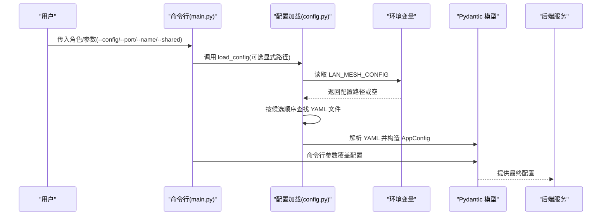
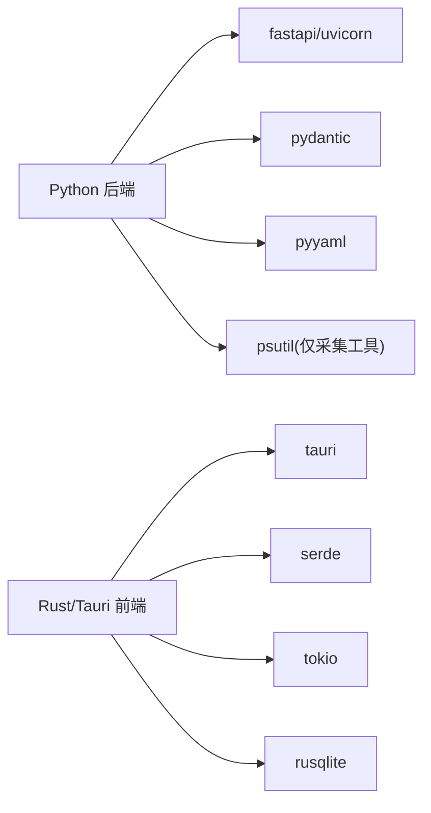

# 配置管理系统

<cite>
**本文档引用的文件**
- [config.yaml](file://config.yaml)
- [config.py](file://lan_mesh/config.py)
- [main.py](file://main.py)
- [collect_config.py](file://lan_mesh/collect_config.py)
- [settings.rs](file://quicklan-main/src-tauri/src/settings.rs)
- [storage.rs](file://quicklan-main/src-tauri/src/storage.rs)
- [tauri.conf.json](file://quicklan-main/src-tauri/tauri.conf.json)
- [Cargo.toml](file://quicklan-main/src-tauri/Cargo.toml)
- [requirements.txt](file://requirements.txt)
- [worker.py](file://lan_mesh/worker.py)
- [preflight.py](file://lan_mesh/preflight.py)
- [secretary.py](file://lan_mesh/secretary.py)
- [model_pool.example.yaml](file://lan_mesh/model_pool.example.yaml)
</cite>

## 更新摘要
**所做更改**
- 更新配置文件结构，将 master 相关设置替换为 secretary 设置
- 修改配置模型，移除 master 配置类，新增 secretary 配置类
- 更新命令行参数处理，支持 secretary 角色
- 更新启动前自检逻辑，针对 secretary 角色进行专门检查
- 更新文档中的配置选项和示例

## 目录
1. [简介](#简介)
2. [项目结构](#项目结构)
3. [核心组件](#核心组件)
4. [架构总览](#架构总览)
5. [详细组件分析](#详细组件分析)
6. [依赖关系分析](#依赖关系分析)
7. [性能考虑](#性能考虑)
8. [故障排查指南](#故障排查指南)
9. [结论](#结论)
10. [附录](#附录)

## 简介
本文件系统性阐述配置管理的设计与实现，涵盖以下方面：
- 配置文件结构与 YAML 语法规范
- 参数覆盖与环境变量支持机制
- 完整配置项清单（网络、存储、安全等）
- 配置加载顺序与优先级规则
- 不同部署场景的配置示例与最佳实践
- 配置验证与错误处理机制
- 动态配置更新与热重载能力说明

## 项目结构
本仓库包含两套配置体系：
- Python 后端（LAN Mesh）：基于 Pydantic 的强类型配置模型，支持 YAML 文件与命令行参数覆盖
- Rust/Tauri 前端（QuickLAN）：基于 JSON 的用户设置与应用数据目录管理

```mermaid
graph TB
subgraph "Python 后端"
CFG["config.py<br/>Pydantic 配置模型"]
YML["config.yaml<br/>YAML 配置文件"]
CLI["main.py<br/>命令行参数覆盖"]
END
subgraph "Rust/Tauri 前端"
SET["settings.rs<br/>用户设置(JSON)"]
STOR["storage.rs<br/>应用数据目录"]
CONF["tauri.conf.json<br/>应用打包配置"]
END
YML --> CFG
CLI --> CFG
CFG --> |"运行时使用"| RUNTIME["后端服务"]
SET --> STOR
STOR --> |"应用数据/配置目录"| RUNTIME
CONF --> |"构建/打包"| RUNTIME
```

**图表来源**
- [config.py:1-139](file://lan_mesh/config.py#L1-L139)
- [config.yaml:1-22](file://config.yaml#L1-L22)
- [main.py:48-76](file://main.py#L48-L76)
- [settings.rs:1-134](file://quicklan-main/src-tauri/src/settings.rs#L1-L134)
- [storage.rs:1-313](file://quicklan-main/src-tauri/src/storage.rs#L1-L313)
- [tauri.conf.json:1-48](file://quicklan-main/src-tauri/tauri.conf.json#L1-L48)

**章节来源**
- [config.py:1-139](file://lan_mesh/config.py#L1-L139)
- [config.yaml:1-22](file://config.yaml#L1-L22)
- [main.py:1-90](file://main.py#L1-L90)
- [settings.rs:1-134](file://quicklan-main/src-tauri/src/settings.rs#L1-L134)
- [storage.rs:1-313](file://quicklan-main/src-tauri/src/storage.rs#L1-L313)
- [tauri.conf.json:1-48](file://quicklan-main/src-tauri/tauri.conf.json#L1-L48)

## 核心组件
- 配置模型（Pydantic）：定义 discovery、worker、secretary 三类配置的字段与默认值
- 配置加载器：按候选路径查找 YAML 文件，支持环境变量覆盖
- 命令行覆盖：通过主程序解析参数，直接修改配置对象
- 用户设置（Rust/Tauri）：JSON 格式的用户偏好设置，持久化至应用配置目录
- 存储目录：统一管理应用数据、共享存储与数据库路径

**章节来源**
- [config.py:14-41](file://lan_mesh/config.py#L14-L41)
- [config.py:48-72](file://lan_mesh/config.py#L48-L72)
- [main.py:48-76](file://main.py#L48-L76)
- [settings.rs:9-13](file://quicklan-main/src-tauri/src/settings.rs#L9-L13)
- [storage.rs:9-27](file://quicklan-main/src-tauri/src/storage.rs#L9-L27)

## 架构总览
下图展示配置加载与覆盖的总体流程：



**图表来源**
- [main.py:48-76](file://main.py#L48-L76)
- [config.py:48-72](file://lan_mesh/config.py#L48-L72)

## 详细组件分析

### 配置文件结构与 YAML 语法
- 文件位置与命名
  - 支持的候选路径：显式路径、环境变量 LAN_MESH_CONFIG、用户主目录下的 ~/.lan_mesh/config.yaml、项目根目录 ./config.yaml
  - 若均不存在，则使用默认配置（所有字段采用模型默认值）
- 结构层级
  - discovery：UDP 发现相关参数
  - worker：Worker 节点运行参数
  - secretary：Secretary 节点运行参数（含数据库路径）

**更新** 配置文件中的 master 相关设置已更新为 secretary 设置

**章节来源**
- [config.yaml:1-22](file://config.yaml#L1-L22)
- [config.py:48-72](file://lan_mesh/config.py#L48-L72)

### 参数覆盖与环境变量支持
- 环境变量
  - LAN_MESH_CONFIG：用于指定 YAML 配置文件的绝对或相对路径
- 命令行覆盖
  - --config/-c：显式指定配置文件路径
  - --port/-p：覆盖 secretary/worker 的 api_port
  - --name/-n：覆盖 secretary/worker 的 device_name
  - --shared：覆盖 secretary/worker 的 shared_folder
- 覆盖优先级
  - 命令行参数 > YAML 配置 > 默认值

**章节来源**
- [config.py:59-64](file://lan_mesh/config.py#L59-L64)
- [main.py:48-76](file://main.py#L48-L76)

### 完整配置选项清单
- discovery
  - port：UDP 广播端口
  - presence_interval：广播间隔（秒）
  - device_ttl：设备离线判定阈值（秒）
- worker
  - api_port：HTTP API 端口
  - shared_folder：共享文件夹路径（支持 ~ 与环境变量展开）
  - device_name：设备名称（留空则自动使用主机名）
- secretary
  - api_port：HTTP API + Web UI 端口
  - shared_folder：共享文件夹路径（支持 ~ 与环境变量展开）
  - device_name：设备名称（留空则自动使用主机名-secretary）
  - db_path：SQLite 数据库文件路径（支持 ~ 与环境变量展开）

**更新** 移除了 master 配置项，新增了 secretary 配置项

**章节来源**
- [config.yaml:4-21](file://config.yaml#L4-L21)
- [config.py:14-33](file://lan_mesh/config.py#L14-L33)
- [config.py:75-83](file://lan_mesh/config.py#L75-L83)

### 配置加载顺序与优先级规则
- 加载顺序
  1) 显式指定的 config_path
  2) 环境变量 LAN_MESH_CONFIG
  3) ~/.lan_mesh/config.yaml
  4) ./config.yaml
- 优先级
  - 命令行覆盖 > YAML 配置 > 默认值
  - YAML 中未提供的键使用模型默认值

**章节来源**
- [config.py:48-72](file://lan_mesh/config.py#L48-L72)
- [main.py:48-76](file://main.py#L48-L76)

### 不同部署场景的配置示例与最佳实践
- 单机开发（默认）
  - 使用默认配置，无需额外文件
- 多节点局域网
  - 在 secretary 节点设置合适的 api_port 与 db_path
  - 在 worker 节点设置合适的 api_port 与 shared_folder
- Docker/Kubernetes
  - 通过环境变量 LAN_MESH_CONFIG 指向挂载的配置卷
  - 通过命令行参数覆盖特定节点的端口与路径
- 安全加固
  - 将敏感信息置于环境变量（如密钥），不在 YAML 中明文存储
  - 使用只读权限的配置文件与受限的共享目录

**更新** 将 master 节点替换为 secretary 节点

**章节来源**
- [config.py:59-64](file://lan_mesh/config.py#L59-L64)
- [config.yaml:1-22](file://config.yaml#L1-L22)
- [main.py:48-76](file://main.py#L48-L76)

### 配置验证与错误处理机制
- 类型与结构校验
  - 使用 Pydantic 模型对 YAML 内容进行强类型校验
  - 未找到配置文件时返回默认配置，避免启动失败
- 路径展开
  - 对包含 ~ 与环境变量的路径进行展开，确保实际路径正确
- 前端设置校验（Rust/Tauri）
  - 用户设置 JSON 的反序列化失败时回退到默认值
  - 更新设置前进行基本校验（如昵称非空、下载目录可创建）

**章节来源**
- [config.py:10-11](file://lan_mesh/config.py#L10-L11)
- [config.py:43-45](file://lan_mesh/config.py#L43-L45)
- [config.py:66-72](file://lan_mesh/config.py#L66-L72)
- [settings.rs:22-37](file://quicklan-main/src-tauri/src/settings.rs#L22-L37)
- [settings.rs:54-82](file://quicklan-main/src-tauri/src/settings.rs#L54-L82)

### 动态配置更新与热重载
- 当前能力
  - 后端服务启动时加载配置；命令行参数可在启动时覆盖
  - 未见内置的配置热重载机制
- 建议方案
  - 引入文件监控（如 watchdog）在 YAML 变更时触发重新加载
  - 对于前端设置，可通过 Tauri 命令在运行时更新并持久化

**章节来源**
- [config.py:48-72](file://lan_mesh/config.py#L48-L72)
- [main.py:56-85](file://main.py#L56-L85)

### 主机配置采集工具（辅助诊断）
- 功能概述
  - 采集 CPU、内存、磁盘、网络、GPU、进程数等系统信息
  - 输出 JSON 与人类可读文本报告
- 使用场景
  - 作为部署前后的对比依据，辅助定位网络与存储问题
- 注意事项
  - 需要 psutil 库；部分平台可能缺少 GPU 检测能力

**章节来源**
- [collect_config.py:1-333](file://lan_mesh/collect_config.py#L1-L333)

## 依赖关系分析
- Python 后端依赖
  - fastapi/uvicorn：Web 服务栈
  - pydantic：配置模型与校验
  - pyyaml：YAML 解析
  - psutil：主机配置采集工具依赖
- Rust/Tauri 前端依赖
  - tauri、serde、tokio、rusqlite 等：窗口、序列化、异步与数据库



**图表来源**
- [requirements.txt:1-8](file://requirements.txt#L1-L8)
- [Cargo.toml:19-32](file://quicklan-main/src-tauri/Cargo.toml#L19-L32)

**章节来源**
- [requirements.txt:1-8](file://requirements.txt#L1-L8)
- [Cargo.toml:19-32](file://quicklan-main/src-tauri/Cargo.toml#L19-L32)

## 性能考虑
- 配置加载
  - YAML 解析与路径展开成本极低，启动阶段一次性完成
- 热重载
  - 如需热重载，建议采用文件监控与增量更新策略，避免频繁重建服务实例
- 前端设置
  - JSON 序列化/反序列化开销很小，注意并发更新时的互斥保护

## 故障排查指南
- 找不到配置文件
  - 检查候选路径是否存在；确认 LAN_MESH_CONFIG 是否正确设置
- 路径展开异常
  - 确认 ~ 与环境变量是否正确；检查权限
- 命令行覆盖无效
  - 确认参数传递顺序与拼写；确认覆盖作用的角色（secretary/worker）
- 前端设置无法保存
  - 检查配置目录可写性；查看日志中的序列化/写入错误

**更新** 将 master 节点替换为 secretary 节点

**章节来源**
- [config.py:48-72](file://lan_mesh/config.py#L48-L72)
- [config.py:43-45](file://lan_mesh/config.py#L43-L45)
- [main.py:48-76](file://main.py#L48-L76)
- [settings.rs:84-92](file://quicklan-main/src-tauri/src/settings.rs#L84-L92)

## 结论
本配置系统以 Pydantic 为核心，结合 YAML 文件与命令行参数，提供了清晰、可扩展且易维护的配置管理方式。通过明确的加载顺序与覆盖规则，满足多场景部署需求。建议在生产环境中配合环境变量与只读配置文件，提升安全性与稳定性。

## 附录

### 配置项速查表
- discovery
  - port：UDP 广播端口
  - presence_interval：广播间隔（秒）
  - device_ttl：设备离线判定阈值（秒）
- worker
  - api_port：HTTP API 端口
  - shared_folder：共享文件夹路径
  - device_name：设备名称
- secretary
  - api_port：HTTP API + Web UI 端口
  - shared_folder：共享文件夹路径
  - device_name：设备名称
  - db_path：SQLite 数据库路径

**更新** 移除了 master 配置项，新增了 secretary 配置项

**章节来源**
- [config.yaml:4-21](file://config.yaml#L4-L21)
- [config.py:14-33](file://lan_mesh/config.py#L14-L33)

### 环境变量一览
- LAN_MESH_CONFIG：指定 YAML 配置文件路径
- DEEPSEEK_API_KEY：用于某些代理/工具的密钥（在运行时读取）
- OPENAI_API_KEY：用于某些代理/工具的密钥（在运行时读取）

**章节来源**
- [config.py:59-64](file://lan_mesh/config.py#L59-L64)
- [agent_runtime.py:178-183](file://lan_mesh/agent_runtime.py#L178-L183)

### 角色配置映射
- 角色选择
  - secretary：主控节点，提供 Web UI 和数据库管理
  - worker：工作节点，提供资源共享和计算能力
- 配置覆盖
  - 命令行参数根据角色自动覆盖相应配置组
  - 路径和端口配置分别针对不同角色进行验证

**更新** 新增角色配置映射说明

**章节来源**
- [main.py:43-76](file://main.py#L43-L76)
- [config.py:99-107](file://lan_mesh/config.py#L99-L107)
- [preflight.py:246-251](file://lan_mesh/preflight.py#L246-L251)