# 项目概述

<cite>
**本文引用的文件**
- [README.md](file://README.md)
- [main.py](file://main.py)
- [lan_mesh/__init__.py](file://lan_mesh/__init__.py)
- [lan_mesh/master.py](file://lan_mesh/master.py)
- [lan_mesh/worker.py](file://lan_mesh/worker.py)
- [lan_mesh/discovery.py](file://lan_mesh/discovery.py)
- [lan_mesh/api.py](file://lan_mesh/api.py)
- [lan_mesh/database.py](file://lan_mesh/database.py)
- [lan_mesh/shared_folder.py](file://lan_mesh/shared_folder.py)
- [lan_mesh/orchestrator.py](file://lan_mesh/orchestrator.py)
- [lan_mesh/model_router.py](file://lan_mesh/model_router.py)
- [lan_mesh/project.py](file://lan_mesh/project.py)
- [lan_mesh/mcp_gateway.py](file://lan_mesh/mcp_gateway.py)
- [lan_mesh/config.py](file://lan_mesh/config.py)
- [quicklan-main/src/App.tsx](file://quicklan-main/src/App.tsx)
- [quicklan-main/src/main.tsx](file://quicklan-main/src/main.tsx)
- [quicklan-main/package.json](file://quicklan-main/package.json)
- [requirements.txt](file://requirements.txt)
- [config.yaml](file://config.yaml)
</cite>

## 目录
1. [简介](#简介)
2. [项目结构](#项目结构)
3. [核心组件](#核心组件)
4. [架构总览](#架构总览)
5. [详细组件分析](#详细组件分析)
6. [依赖分析](#依赖分析)
7. [性能考虑](#性能考虑)
8. [故障排查指南](#故障排查指南)
9. [结论](#结论)
10. [附录](#附录)

## 简介
Work Station 是一个分布式个人 AI 工作站平台，旨在将局域网内多台异构主机组成统一调度网格，实现智能路由外部大模型 API、任务自动拆解、分布式执行、项目隔离与预算管控。项目以 Master/Worker 分布式架构为核心：Master 负责发现、注册、持久化、编排与可视化；Worker 负责本机资源采集、共享文件管理与任务执行。通过 UDP 广播实现设备发现，结合 FastAPI + WebSocket 提供实时监控面板，前端采用 React + Tauri 构建桌面应用。

**更新** 项目现已扩展为完整的分布式 AI 工作站解决方案，包含模型路由器、项目管理、MCP 工具网关等核心能力。

## 项目结构
项目分为三层：
- 后端核心（Python）：lan_mesh 包含 Master/Worker 控制器、发现服务、API 路由、数据库、共享文件夹、任务编排、模型路由、项目管理和 MCP 网关等模块。
- 前端应用（React + Tauri）：quicklan-main 提供桌面端 UI，通过 Tauri 暴露系统能力并与后端交互。
- 配置与依赖：config.yaml 提供运行时配置；requirements.txt 管理后端依赖。

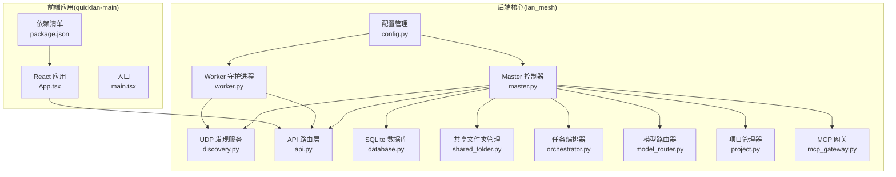

**图表来源**
- [lan_mesh/master.py](file://lan_mesh/master.py)
- [lan_mesh/worker.py](file://lan_mesh/worker.py)
- [lan_mesh/discovery.py](file://lan_mesh/discovery.py)
- [lan_mesh/api.py](file://lan_mesh/api.py)
- [lan_mesh/database.py](file://lan_mesh/database.py)
- [lan_mesh/shared_folder.py](file://lan_mesh/shared_folder.py)
- [lan_mesh/orchestrator.py](file://lan_mesh/orchestrator.py)
- [lan_mesh/model_router.py](file://lan_mesh/model_router.py)
- [lan_mesh/project.py](file://lan_mesh/project.py)
- [lan_mesh/mcp_gateway.py](file://lan_mesh/mcp_gateway.py)
- [lan_mesh/config.py](file://lan_mesh/config.py)
- [quicklan-main/src/App.tsx](file://quicklan-main/src/App.tsx)
- [quicklan-main/src/main.tsx](file://quicklan-main/src/main.tsx)
- [quicklan-main/package.json](file://quicklan-main/package.json)

**章节来源**
- [main.py](file://main.py)
- [lan_mesh/__init__.py](file://lan_mesh/__init__.py)
- [config.yaml](file://config.yaml)

## 核心组件
- Master 控制器：负责设备发现、注册与心跳处理、主机信息持久化、任务编排、MCP 工具网关、Web UI 仪表盘与 WebSocket 实时推送。
- Worker 守护进程：负责本机配置采集、共享文件夹管理、UDP 发现、向 Master 注册与心跳上报、暴露 Worker API。
- UDP 发现服务：基于广播的设备发现与在线维护，支持 TTL 清理与网络状态查询。
- API 路由层：为 Master/Worker 提供 REST API 与 WebSocket，支撑注册、心跳、主机列表、共享文件、任务与工具网关。
- 数据库：SQLite 存储主机记录、心跳日志、Agent 信息、任务与项目、用量统计等。
- 共享文件夹：统一的跨主机文件共享目录，支持文件列表、下载、上传与配置报告生成。
- 任务编排器：接收顶层任务，分解为子任务 DAG，匹配 Agent 并分发执行，聚合结果。
- 模型路由器：基于 L1-L4 难度分级和加权评分算法，实现智能模型选择与降级链容灾。
- 项目管理器：提供项目隔离、预算控制、消费追踪和路由策略管理。
- MCP 工具网关：动态加载外部工具，支持文件系统、Shell 命令、浏览器控制等工具。

**章节来源**
- [lan_mesh/master.py](file://lan_mesh/master.py)
- [lan_mesh/worker.py](file://lan_mesh/worker.py)
- [lan_mesh/discovery.py](file://lan_mesh/discovery.py)
- [lan_mesh/api.py](file://lan_mesh/api.py)
- [lan_mesh/database.py](file://lan_mesh/database.py)
- [lan_mesh/shared_folder.py](file://lan_mesh/shared_folder.py)
- [lan_mesh/orchestrator.py](file://lan_mesh/orchestrator.py)
- [lan_mesh/model_router.py](file://lan_mesh/model_router.py)
- [lan_mesh/project.py](file://lan_mesh/project.py)
- [lan_mesh/mcp_gateway.py](file://lan_mesh/mcp_gateway.py)
- [lan_mesh/config.py](file://lan_mesh/config.py)

## 架构总览
系统采用 Master/Worker 分布式架构：
- Master 作为中心节点，提供 Web UI、REST API 与 WebSocket，维护主机注册表与任务编排。
- Worker 作为边缘节点，自动采集本机信息、暴露共享文件与 Worker API，并向 Master 注册与心跳。
- UDP 广播用于设备发现与存在性通告，配合 SQLite 持久化与 TTL 清理。
- 前端通过 Tauri 与后端交互，实时接收 WebSocket 推送，展示主机状态与共享资源。

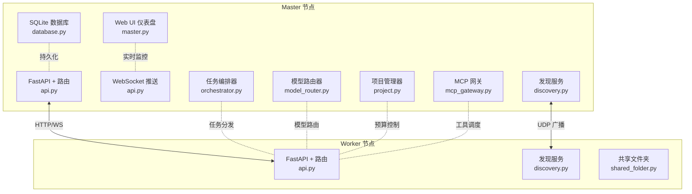

**图表来源**
- [lan_mesh/master.py](file://lan_mesh/master.py)
- [lan_mesh/worker.py](file://lan_mesh/worker.py)
- [lan_mesh/discovery.py](file://lan_mesh/discovery.py)
- [lan_mesh/api.py](file://lan_mesh/api.py)
- [lan_mesh/database.py](file://lan_mesh/database.py)
- [lan_mesh/orchestrator.py](file://lan_mesh/orchestrator.py)
- [lan_mesh/model_router.py](file://lan_mesh/model_router.py)
- [lan_mesh/project.py](file://lan_mesh/project.py)
- [lan_mesh/mcp_gateway.py](file://lan_mesh/mcp_gateway.py)

## 详细组件分析

### Master 控制器（中心节点）
- 职责：设备发现、注册与心跳处理、持久化、任务编排、MCP 工具网关、Web UI 与 WebSocket 实时推送。
- 关键流程：启动前自检、生成设备 ID、创建共享文件夹、启动发现服务、定时刷新配置报告、离线清理、启动 FastAPI 与 Web UI、后台 WS 推送。
- 线程与协程：多线程处理发现、配置刷新、离线清理；异步协程处理 WS 推送。

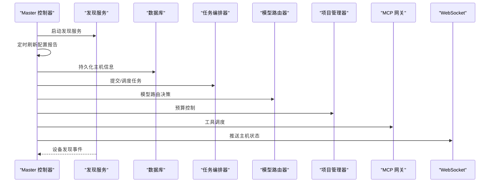

**图表来源**
- [lan_mesh/master.py](file://lan_mesh/master.py)
- [lan_mesh/discovery.py](file://lan_mesh/discovery.py)
- [lan_mesh/database.py](file://lan_mesh/database.py)
- [lan_mesh/orchestrator.py](file://lan_mesh/orchestrator.py)
- [lan_mesh/model_router.py](file://lan_mesh/model_router.py)
- [lan_mesh/project.py](file://lan_mesh/project.py)
- [lan_mesh/mcp_gateway.py](file://lan_mesh/mcp_gateway.py)
- [lan_mesh/api.py](file://lan_mesh/api.py)

**章节来源**
- [lan_mesh/master.py](file://lan_mesh/master.py)

### Worker 守护进程（边缘节点）
- 职责：采集本机配置、创建共享文件夹、UDP 发现 Master、注册与心跳、暴露 Worker API。
- 关键流程：启动前自检、生成设备 ID、创建共享文件夹、启动发现服务、注册到 Master、心跳循环、定时刷新配置报告、启动 FastAPI。
- 与 Master 的交互：HTTP 注册与心跳；通过 Master 的 Worker 路由查询与下载共享文件。

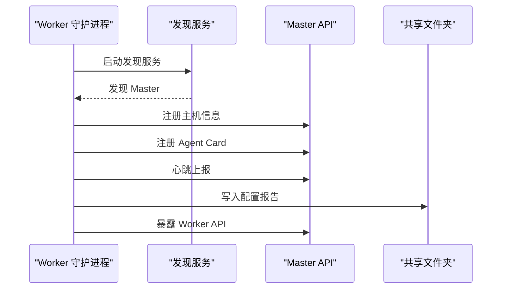

**图表来源**
- [lan_mesh/worker.py](file://lan_mesh/worker.py)
- [lan_mesh/discovery.py](file://lan_mesh/discovery.py)
- [lan_mesh/api.py](file://lan_mesh/api.py)
- [lan_mesh/shared_folder.py](file://lan_mesh/shared_folder.py)

**章节来源**
- [lan_mesh/worker.py](file://lan_mesh/worker.py)

### UDP 广播发现机制
- 核心机制：定时广播自身存在，监听其他设备包，回送 presence 包，按 TTL 清理离线设备。
- 线程模型：presence、listen、prune 三类后台线程。
- 端口绑定：支持 SO_REUSEADDR/SO_REUSEPORT，若端口占用则降级运行。

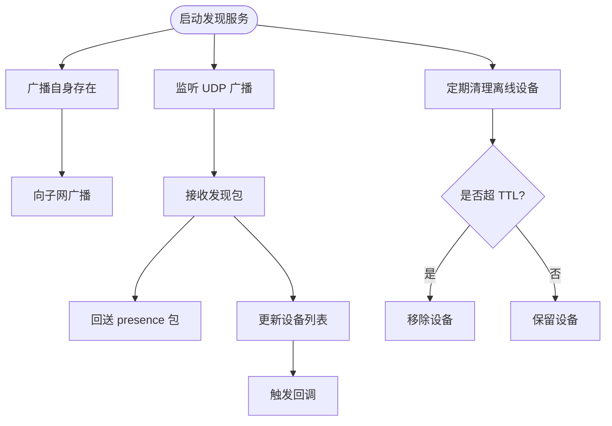

**图表来源**
- [lan_mesh/discovery.py](file://lan_mesh/discovery.py)

**章节来源**
- [lan_mesh/discovery.py](file://lan_mesh/discovery.py)

### API 路由层（Master/Worker）
- Master API：注册、心跳、主机列表、网络状态、发现设备、探测 IP、任务提交与查询、Agent 管理、工具网关、WebSocket。
- Worker API：本机信息、共享文件列表/下载/上传、任务执行端点。
- WebSocket：首次推送主机列表，保持连接并周期性 ping。

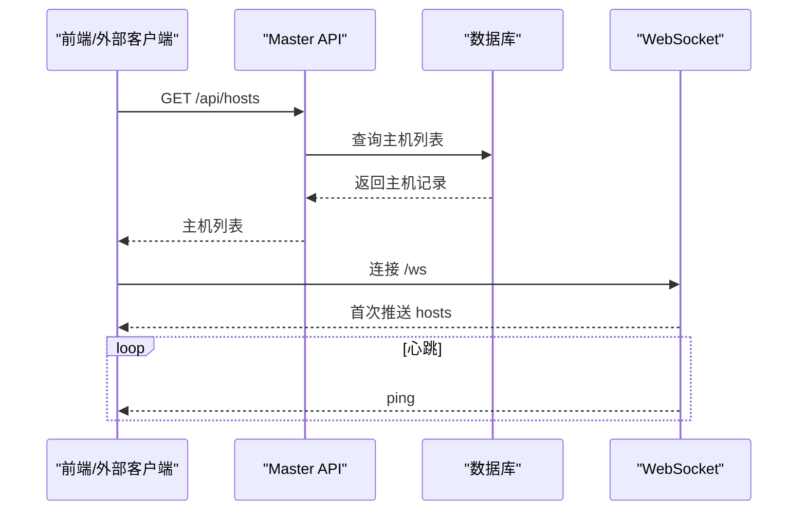

**图表来源**
- [lan_mesh/api.py](file://lan_mesh/api.py)
- [lan_mesh/database.py](file://lan_mesh/database.py)

**章节来源**
- [lan_mesh/api.py](file://lan_mesh/api.py)

### 任务编排系统
- 任务分解：根据任务类型（代码、文档、系统、简单）选择预置模板，构建子任务 DAG。
- 调度策略：查找具备所需技能的空闲 Agent，分发子任务，收集结果并聚合。
- 状态管理：数据库持久化任务生命周期，支持失败与完成状态。

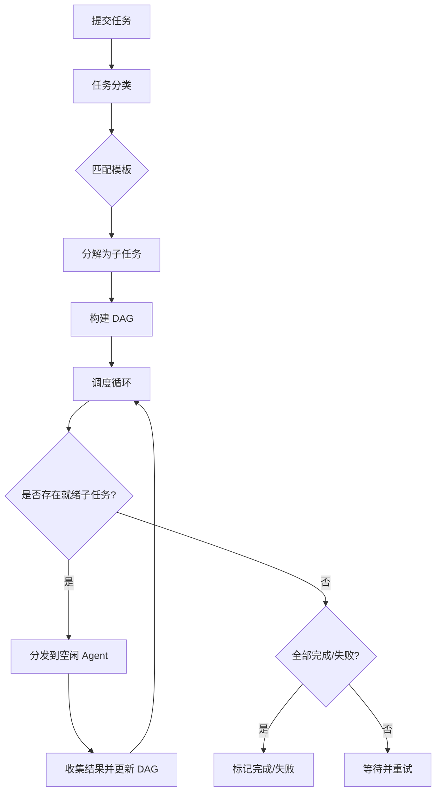

**图表来源**
- [lan_mesh/orchestrator.py](file://lan_mesh/orchestrator.py)
- [lan_mesh/database.py](file://lan_mesh/database.py)

**章节来源**
- [lan_mesh/orchestrator.py](file://lan_mesh/orchestrator.py)

### 模型路由器（Phase 2）
- 难度分级：L1-L4 基于规则的难度分类，支持关键词匹配和技能类型判断。
- 加权评分：能力覆盖率×0.4 + 成本反向×0.3 + 速度×0.2 - 负载×0.1。
- 降级链：首选模型失败时自动沿 Fallback Chain 重试。
- 策略适配：cost_first、quality_first、balanced 三种路由策略。

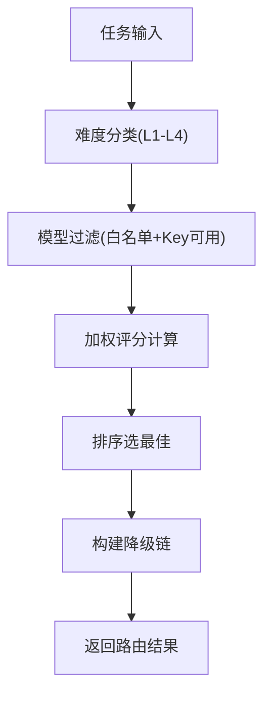

**图表来源**
- [lan_mesh/model_router.py](file://lan_mesh/model_router.py)

**章节来源**
- [lan_mesh/model_router.py](file://lan_mesh/model_router.py)

### 项目管理与预算控制（Phase 3）
- 项目隔离：独立工作空间、预算配额、模型白名单。
- 预算控制：Token 用量自动计量，成本实时追踪，超支自动暂停。
- 路由策略：根据项目状态动态调整经济模型使用。

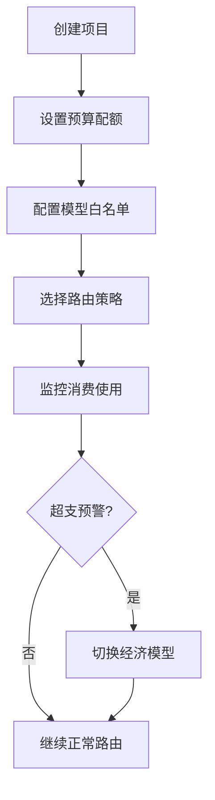

**图表来源**
- [lan_mesh/project.py](file://lan_mesh/project.py)

**章节来源**
- [lan_mesh/project.py](file://lan_mesh/project.py)

### MCP 工具网关
- 动态加载：支持 stdio 子进程和 HTTP 远程 MCP Server。
- 工具聚合：统一工具列表，按来源标记，支持按模型类型调整描述。
- 自动重连：断线检测与自动重连机制。

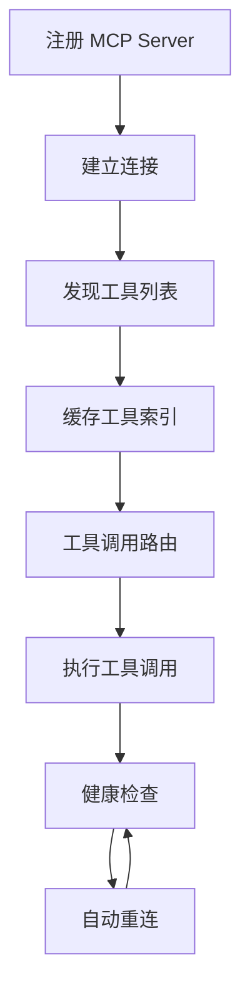

**图表来源**
- [lan_mesh/mcp_gateway.py](file://lan_mesh/mcp_gateway.py)

**章节来源**
- [lan_mesh/mcp_gateway.py](file://lan_mesh/mcp_gateway.py)

### 共享文件夹系统
- 功能：自动创建共享目录、列举文件、安全路径解析、上传下载、生成主机配置报告（JSON/TXT）。
- 安全：防止路径穿越，清理非法字符，避免覆盖冲突时自动编号。

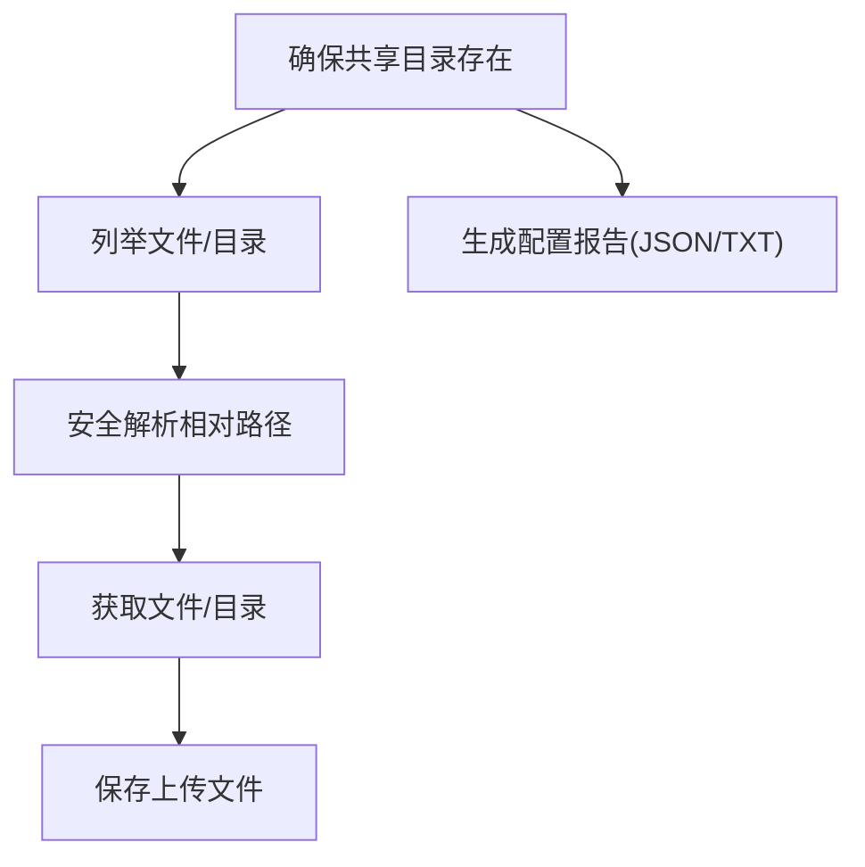

**图表来源**
- [lan_mesh/shared_folder.py](file://lan_mesh/shared_folder.py)

**章节来源**
- [lan_mesh/shared_folder.py](file://lan_mesh/shared_folder.py)

### 前端应用（React + Tauri）
- 技术栈：React + TypeScript，Vite 构建，Tauri 提供系统能力与窗口管理。
- 功能：设备列表、共享资源浏览、我的共享、传输面板、设置与网络状态。
- 事件：通过 @tauri-apps/api 监听设备更新、传输进度、完成与失败事件。

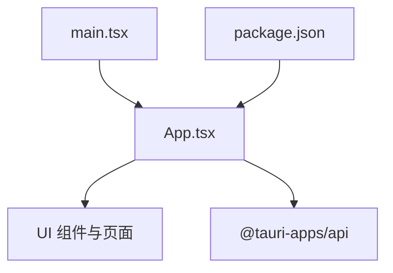

**图表来源**
- [quicklan-main/src/App.tsx](file://quicklan-main/src/App.tsx)
- [quicklan-main/src/main.tsx](file://quicklan-main/src/main.tsx)
- [quicklan-main/package.json](file://quicklan-main/package.json)

**章节来源**
- [quicklan-main/src/App.tsx](file://quicklan-main/src/App.tsx)
- [quicklan-main/src/main.tsx](file://quicklan-main/src/main.tsx)
- [quicklan-main/package.json](file://quicklan-main/package.json)

## 依赖分析
- 后端依赖：FastAPI、Uvicorn、Pydantic、PyYAML、Requests、python-multipart、psutil。
- 前端依赖：React、ReactDOM、@tauri-apps/api、lucide-react、@vitejs/plugin-react、typescript、vite。

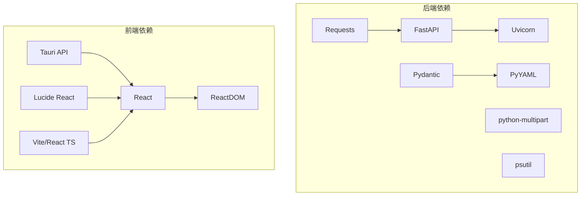

**图表来源**
- [requirements.txt](file://requirements.txt)
- [quicklan-main/package.json](file://quicklan-main/package.json)

**章节来源**
- [requirements.txt](file://requirements.txt)
- [quicklan-main/package.json](file://quicklan-main/package.json)

## 性能考虑
- 线程与协程分离：发现与清理使用线程，WS 推送使用异步协程，避免阻塞。
- TTL 清理：定期将超时离线主机标记为离线，减少无效查询。
- 心跳频率：通过配置项调节广播与心跳间隔，平衡实时性与网络开销。
- 文件操作：共享文件夹上传时自动编号避免覆盖，降低并发冲突风险。
- 数据库：索引优化（任务/Agent 状态、项目状态），限制日志条数，定期清理历史。
- 模型路由：预计算成本基准，避免重复计算，提升路由决策效率。

## 故障排查指南
- 启动失败：检查端口占用与权限，确保共享目录可写；查看自检输出。
- 设备未上线：确认 UDP 端口可达、防火墙放行；使用探测接口验证。
- 心跳异常：检查 Worker 到 Master 的网络连通性；查看 Master 日志。
- 文件下载失败：确认路径安全解析与文件存在；检查权限。
- 任务未执行：确认 Agent 状态为空闲且具备所需技能；查看编排器日志。
- 模型路由失败：检查模型池配置、API Key 环境变量、降级链设置。
- 项目预算超支：检查项目状态、路由策略、经济模型切换。

**章节来源**
- [lan_mesh/master.py](file://lan_mesh/master.py)
- [lan_mesh/worker.py](file://lan_mesh/worker.py)
- [lan_mesh/discovery.py](file://lan_mesh/discovery.py)
- [lan_mesh/shared_folder.py](file://lan_mesh/shared_folder.py)
- [lan_mesh/orchestrator.py](file://lan_mesh/orchestrator.py)
- [lan_mesh/model_router.py](file://lan_mesh/model_router.py)
- [lan_mesh/project.py](file://lan_mesh/project.py)

## 结论
Work Station 通过 Master/Worker 架构与 UDP 广播发现，构建了去中心化的局域网主机管理与任务编排平台。后端以 FastAPI + SQLite 提供稳定的服务与持久化能力，前端以 React + Tauri 提供直观的桌面体验。项目现已发展为完整的分布式个人 AI 工作站，包含模型路由器、项目管理、MCP 工具网关等核心能力，适合需要跨主机文件共享、实时监控、任务编排与 AI 工具集成的场景，具有良好的扩展性与可维护性。

## 附录
- 主要特性
  - 去中心化设备发现（UDP 广播）
  - 分布式文件传输与共享
  - 实时监控面板（WebSocket）
  - 任务编排与 Agent 管理
  - 模型路由器与智能路由
  - 项目隔离与预算控制
  - MCP 工具网关与动态注册
  - 主机配置报告自动生成
- 应用场景
  - 开发团队局域网协作与文件共享
  - 多主机任务编排与资源调度
  - 边缘节点监控与运维面板
  - 本地化 AI 工具集成与路由
  - 个人 AI 工作站与模型管理
  - 企业内部模型池与预算管控